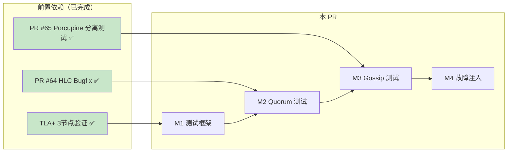

# 【PR全流程文档】Feature - Go 测试扩展（5节点场景）

> **文档说明**：本文档包含「前置规划」部分，记录需求对齐和技术设计，PR 开发前必须通过架构师评审。

---

## 第一部分：前置部分（开工前必完成，架构师评审通过）

### 1. 基础信息（与分支/PR绑定）

| 项目 | 内容 |
|------|------|
| 工作类型 | 新功能开发（Feature） |
| PR编号 | PR-066 |
| 分支名称 | feature/go-testing-5nodes |
| 工作主题 | Go 测试扩展（5节点场景） |
| 负责人 | 🤖 核心开发 A |
| 分支创建日期 | 2026-02-14 |
| 计划开工日期 | 2026-02-14 |
| 计划CI通过日期 | 2026-02-18 |
| 关联需求单号 | TLA+ 5节点模型替代方案 |
| 架构师评审状态 | ⏳ 待评审 |
| 预审批结果 | ⏳ 待评审 |

### 2. 背景与目标（为什么干）

#### 2.1 背景

**业务场景**：
NexKV 的 TLA+ 验证在 3 节点模型上已全部通过（10个性质、31个测试），但 5 节点模型因状态空间爆炸（3000万+状态）放弃验证。

**现有问题**：
- ❌ **5节点场景验证空白**：TLA+ 5节点模型无法完成，需要替代方案
- ❌ **测试覆盖不足**：现有 Go 测试仅覆盖 3 节点场景
- ❌ **故障容错验证缺失**：5节点容错能力（2节点故障）未验证

**价值**：
- ✅ **填补验证空白**：通过 Go 测试覆盖 TLA+ 无法验证的 5 节点场景
- ✅ **验证容错能力**：5节点集群可容忍 2 节点故障
- ✅ **提升生产信心**：3-7 节点集群生产就绪

#### 2.2 核心目标（可量化、可验证）

1. **功能目标**：
   - 实现 5 节点 Quorum 测试（5个用例）
   - 实现 5 节点 Gossip 测试（4个用例）
   - 实现 5 节点故障注入测试（5个用例）
   - 总计 14+ 新增测试用例

2. **性能目标**：
   - 5 节点 Quorum 决策延迟 < 10ms
   - 5 节点 Gossip 收敛时间 < 20s
   - 5 节点故障恢复时间 < 100ms

3. **测试目标**：
   - 新增测试 100% 通过
   - 测试覆盖率 > 80%
   - 无数据竞争（go test -race）

### 3. 技术设计

#### 3.1 架构设计

```
┌─────────────────────────────────────────────────────────────────────┐
│                    5节点测试架构                                      │
├─────────────────────────────────────────────────────────────────────┤
│                                                                     │
│  ┌─────────────────────────────────────────────────────────────┐   │
│  │ 测试框架层                                                    │   │
│  │ ├── New5NodeCluster(t) - 5节点集群创建                        │   │
│  │ ├── Assert5NodeMajority(t, cluster, node) - 多数派断言       │   │
│  │ └── WaitFor5NodeConvergence(t, cluster, timeout) - 收敛等待   │   │
│  └─────────────────────────────────────────────────────────────┘   │
│                                                                     │
│  ┌─────────────────────────────────────────────────────────────┐   │
│  │ 测试用例层                                                    │   │
│  │ ├── quorum_gossip_5nodes_test.go - Quorum 5节点测试           │   │
│  │ ├── gossip_5nodes_test.go - Gossip 5节点测试                  │   │
│  │ └── fault_injection_5nodes_test.go - 故障注入测试             │   │
│  └─────────────────────────────────────────────────────────────┘   │
│                                                                     │
│  ┌─────────────────────────────────────────────────────────────┐   │
│  │ 核心实现层（复用现有）                                         │   │
│  │ ├── quorum_gossip.go - Quorum+Gossip 实现                     │   │
│  │ ├── Cluster - 集群管理（已支持动态节点数）                     │   │
│  │ └── WAL - 故障恢复                                            │   │
│  └─────────────────────────────────────────────────────────────┘   │
│                                                                     │
└─────────────────────────────────────────────────────────────────────┘
```

#### 3.2 里程碑规划

| 里程碑 | 内容 | 预计工期 | 产出物 |
|--------|------|---------|--------|
| **M1** | 测试框架扩展 | 0.5天 | `cluster_5nodes_test.go` |
| **M2** | Quorum 5节点测试 | 0.5天 | `quorum_gossip_5nodes_test.go` |
| **M3** | Gossip 5节点测试 | 0.5天 | `gossip_5nodes_test.go` |
| **M4** | 故障注入测试 | 1天 | `fault_injection_5nodes_test.go` |
| **M5** | 验证与文档 | 0.5天 | Post 文档、性能报告 |

#### 3.3 测试用例设计

##### M2: Quorum 5节点测试

| 测试用例 | 说明 | 预期结果 |
|---------|------|---------|
| `Test_5Nodes_QuorumCommit_3Votes` | 3票达成多数派 | ✅ 提交成功 |
| `Test_5Nodes_QuorumCommit_2Votes` | 2票不足多数派 | ❌ 提交失败 |
| `Test_5Nodes_QuorumCommit_5Votes` | 全员投票 | ✅ 提交成功 |
| `Test_5Nodes_QuorumTimeout` | 超时未达多数派 | ❌ 回滚 |
| `Test_5Nodes_QuorumDecisionPropagation` | 决策传播 | 所有节点最终一致 |

##### M3: Gossip 5节点测试

| 测试用例 | 说明 | 预期结果 |
|---------|------|---------|
| `Test_5Nodes_GossipConvergence` | 5节点信息扩散 | <20s 全部收敛 |
| `Test_5Nodes_GossipWithDelay` | 网络延迟 100ms | 收敛时间增加但仍成功 |
| `Test_5Nodes_GossipPartialFailure` | 1节点崩溃 | 4节点收敛 |
| `Test_5Nodes_GossipIncrementalSync` | 增量同步 | 恢复节点追赶最新状态 |

##### M4: 故障注入测试

| 测试用例 | 说明 | 预期结果 |
|---------|------|---------|
| `Test_5Nodes_SingleNodeCrash` | 1节点崩溃 | 4节点继续，恢复后同步 |
| `Test_5Nodes_DoubleNodeCrash` | 2节点崩溃 | 3节点刚好多数派 |
| `Test_5Nodes_Partition_3v2` | 3v2 分区 | 3节点区继续工作 |
| `Test_5Nodes_CoordinatorCrash` | 协调者崩溃 | 重新选举 |
| `Test_5Nodes_CascadingFailure` | 级联故障 | 系统自愈或安全降级 |

#### 3.4 多数派计算

```go
// 5节点集群配置
const (
    NodeCount5     = 5
    Majority5      = 3  // (5/2)+1 = 3
    FaultTolerance = 2  // 5节点可容忍2节点故障
)

// 动态多数派计算
func CalculateMajority(nodeCount int) int {
    return (nodeCount / 2) + 1
}
```

#### 3.5 文件变更清单

| 操作 | 文件路径 | 说明 |
|------|---------|------|
| **新增** | `tla-verification/implementations/cluster_5nodes_test.go` | 5节点测试框架 |
| **新增** | `tla-verification/implementations/quorum_gossip_5nodes_test.go` | Quorum 5节点测试 |
| **新增** | `tla-verification/implementations/gossip_5nodes_test.go` | Gossip 5节点测试 |
| **新增** | `tla-verification/implementations/fault_injection_5nodes_test.go` | 故障注入测试 |

### 4. 风险评估

#### 4.1 技术风险

| 风险 | 影响 | 概率 | 缓解措施 |
|------|------|------|---------|
| **测试框架不兼容** | 中 | 低 | 复用现有 Cluster 实现 |
| **故障注入复杂** | 中 | 中 | 参考现有 fault_injection_test.go |
| **并发 Bug** | 高 | 中 | 使用 -race 标志检测 |
| **性能不达标** | 低 | 低 | 5节点性能已有基准数据 |

#### 4.2 依赖关系



### 5. 验收标准

#### 5.1 功能验收

| 验收项 | 标准 | 验证方式 |
|--------|------|---------|
| **Quorum 5节点测试** | 5个用例全部通过 | `go test -run Test_5Nodes_Quorum` |
| **Gossip 5节点测试** | 4个用例全部通过 | `go test -run Test_5Nodes_Gossip` |
| **故障注入测试** | 5个用例全部通过 | `go test -run Test_5Nodes_Fault` |
| **测试覆盖率** | > 80% | `go test -cover` |
| **无数据竞争** | 0 race detected | `go test -race` |

#### 5.2 性能验收

| 指标 | 3节点基准 | 5节点目标 | 说明 |
|------|----------|----------|------|
| **Quorum 决策延迟** | <5ms | <10ms | 允许增加 |
| **Gossip 收敛时间** | <10s | <20s | 节点增多 |
| **故障恢复时间** | <50ms | <100ms | 允许增加 |

### 6. 关联文档

| 文档 | 路径 | 说明 |
|------|------|------|
| **Spike 预研报告** | `docs/07_spike/2026-02-14_go-testing-5nodes-research.md` | 详细技术方案 |
| **TLA+ Spike 研究** | `docs/07_spike/2026-02-14_tla-verification-research.md` | TLA+ 与 Porcupine 互补关系 |
| **PR #65 Pre 文档** | `docs/06_PM/feature/2026-02-13_PR-064_Porcupine-Separated-Test-Strategy_Pre.md` | Porcupine 分离测试策略 |
| **TLA+ README** | `tla-verification/README.md` | TLA+ 验证完整报告 |

---

## 第二部分：架构师评审区

> **评审说明**：架构师在此区域填写评审意见，开发者根据评审意见修改后重新提交。

### 评审记录

#### 第一轮评审

| 评审日期 | 2026-02-14 |
|---------|-----------|
| 评审人 | 👤 架构师 |
| 评审状态 | ⏳ 待评审 |

| 问题 | 优先级 | 评审意见 | 处理状态 |
|------|--------|---------|---------|
| - | - | - | - |

**评审结论**：⏳ 待评审

---

**文档版本**: v1.0
**创建日期**: 2026-02-14
**最后更新**: 2026-02-14
**维护者**: 🤖 核心开发 A
**状态**: ⏳ 待架构师评审
