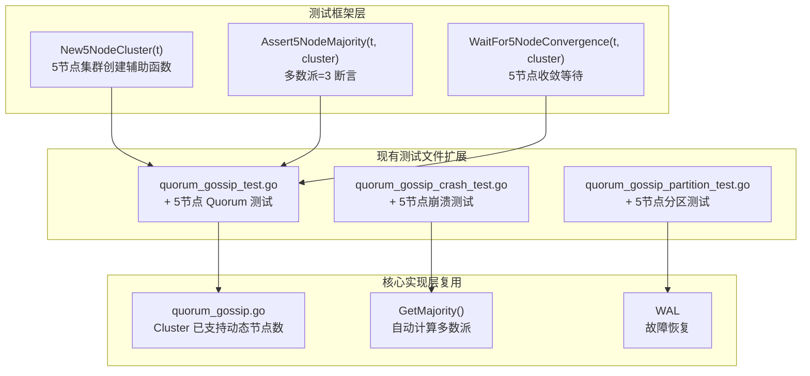
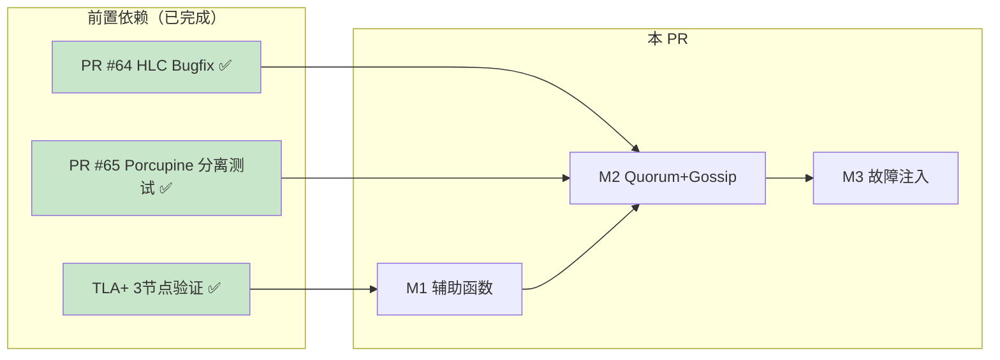

# 【PR全流程文档】Feature - Go 测试扩展（5节点场景）

> **文档说明**：本文档包含「前置规划」部分，记录需求对齐和技术设计，PR 开发前必须通过架构师评审。

---

## 第一部分：前置部分（开工前必完成，架构师评审通过）

### 1. 基础信息（与分支/PR绑定）

| 项目 | 内容 |
|------|------|
| 工作类型 | 新功能开发（Feature） |
| PR编号 | PR-066 |
| 分支名称 | feature/go-testing-5nodes |
| 工作主题 | Go 测试扩展（5节点场景） |
| 负责人 | 🤖 核心开发 A |
| 分支创建日期 | 2026-02-14 |
| 计划开工日期 | 2026-02-14 |
| 计划CI通过日期 | 2026-02-17 |
| 关联需求单号 | TLA+ 5节点模型替代方案 |
| 架构师评审状态 | ✅ 通过（第二轮） |
| 预审批结果 | ✅ 批准开始开发 |

### 2. 背景与目标（为什么干）

#### 2.1 背景

**业务场景**：
NexKV 的 TLA+ 验证在 3 节点模型上已全部通过（10个性质、31个测试），但 5 节点模型因状态空间爆炸（3000万+状态）放弃验证。

**现有问题**：
- ❌ **5节点场景验证空白**：TLA+ 5节点模型无法完成，需要替代方案
- ❌ **现有测试仅覆盖 3 节点**：`quorum_gossip_test.go` 等使用 `[]string{"n1", "n2", "n3"}`
- ❌ **故障容错验证缺失**：5节点容错能力（2节点故障）未验证

**价值**：
- ✅ **填补验证空白**：通过 Go 测试覆盖 TLA+ 无法验证的 5 节点场景
- ✅ **验证容错能力**：5节点集群可容忍 2 节点故障
- ✅ **提升生产信心**：3-7 节点集群生产就绪

#### 2.2 核心目标（可量化、可验证）

1. **功能目标**：
   - 扩展现有测试文件，添加 5 节点专属测试用例
   - 实现 5 节点 Quorum 测试（3个用例）
   - 实现 5 节点 Gossip 测试（2个用例）
   - 实现 5 节点故障注入测试（3个用例）
   - 总计 8 个新增测试用例

2. **性能目标**：
   - 记录 5 节点实际性能数据，与 3 节点对比分析

3. **测试目标**：
   - 新增测试 100% 通过
   - 无数据竞争（go test -race）

### 3. 技术设计

#### 3.1 架构设计



#### 3.2 现有测试清单（3节点）

> **说明**：现有测试均使用 3 节点（`[]string{"n1", "n2", "n3"}`），多数派=2

| 文件 | 测试函数 | 节点数 | 覆盖场景 |
|------|---------|-------|---------|
| `quorum_gossip_test.go` | TestTC001_SingleNodeProposeVote | 1 | 单节点投票 |
| `quorum_gossip_test.go` | TestTC002_QuorumCommitSuccess | 3 | Quorum 提交成功 |
| `quorum_gossip_test.go` | TestTC003_QuorumTimeoutRollback | 3 | Quorum 超时回滚 |
| `quorum_gossip_test.go` | TestTC010_ConcurrentVoteConflict | 3 | 并发投票冲突 |
| `quorum_gossip_test.go` | TestTC025_PartitionSafety | 3 | 分区安全性 |
| `quorum_gossip_test.go` | TestTC030_GossipConvergence | 3 | Gossip 收敛 |
| `quorum_gossip_test.go` | TestTC035_NodeRecovery | 3 | 节点恢复 |
| `quorum_gossip_crash_test.go` | TestTC036-TC050 | 3 | 崩溃相关测试（15个） |
| `quorum_gossip_partition_test.go` | TestTC041-TC045 | 3 | 分区测试（5个） |
| `quorum_gossip_fault_injection_test.go` | TestFaultInjection_* | 3 | 故障注入测试（7个） |

**关键发现**：现有测试均使用 3 节点，**未覆盖 5 节点场景**。

#### 3.3 文件组织策略

> **决策**：**扩展现有文件**，而非新增独立文件

**理由**：
1. 避免文件碎片化，保持测试代码集中
2. 便于对比 3 节点 vs 5 节点行为
3. 复用现有测试辅助函数和 setup 逻辑
4. 现有文件行数适中（<800行），有扩展空间

| 文件 | 当前行数 | 新增内容 | 预计行数 |
|------|---------|---------|---------|
| `quorum_gossip_test.go` | ~400 | +5节点 Quorum 测试 | ~500 |
| `quorum_gossip_crash_test.go` | ~530 | +5节点崩溃测试 | ~620 |
| `quorum_gossip_partition_test.go` | ~340 | +5节点分区测试 | ~420 |

#### 3.4 里程碑规划

| 里程碑 | 内容 | 预计工期 | 产出物 |
|--------|------|---------|--------|
| **M1** | 测试框架辅助函数 | 0.25天 | `New5NodeCluster()` 等 |
| **M2** | 5节点 Quorum + Gossip 测试 | 0.5天 | 5个新增测试用例 |
| **M3** | 5节点故障注入测试 | 0.5天 | 3个新增测试用例 |
| **M4** | 验证与文档 | 0.25天 | Post 文档、性能数据 |
| **总计** | - | **1.5天** | 8个新增测试用例 |

#### 3.5 新增测试用例设计

##### M2: Quorum + Gossip 测试（5节点）

| 测试用例 | 文件 | 差异化价值 |
|---------|------|-----------|
| `Test_5Nodes_QuorumCommit_3Votes` | quorum_gossip_test.go | 验证 5 节点多数派=3 |
| `Test_5Nodes_QuorumCommit_2Votes_Fail` | quorum_gossip_test.go | 验证 2 票不足以提交 |
| `Test_5Nodes_QuorumCommit_4Votes` | quorum_gossip_test.go | 验证超多数派场景 |
| `Test_5Nodes_GossipConvergence` | quorum_gossip_test.go | 5 节点收敛时间 |
| `Test_5Nodes_GossipWithOneCrash` | quorum_gossip_test.go | 4 节点收敛 |

##### M3: 故障注入测试（5节点）

| 测试用例 | 文件 | 差异化价值 |
|---------|------|-----------|
| `Test_5Nodes_DoubleNodeCrash` | quorum_gossip_crash_test.go | 验证 2 节点故障容忍 |
| `Test_5Nodes_Partition_3v2` | quorum_gossip_partition_test.go | 5 节点 3v2 分区 |
| `Test_5Nodes_CoordinatorCrashAndReelect` | quorum_gossip_crash_test.go | 协调者崩溃重选 |

#### 3.6 多数派计算

```go
// 现有实现已支持动态节点数
func (c *Cluster) GetMajority() int {
    return (len(c.nodeIDs) / 2) + 1
}

// 5节点配置
// NodeCount = 5, Majority = 3, FaultTolerance = 2
```

### 4. 风险评估

#### 4.1 技术风险

| 风险 | 影响 | 概率 | 缓解措施 |
|------|------|------|---------|
| **5节点性能下降** | 中 | 中 | 记录实际数据，与 3 节点对比 |
| **并发 Bug** | 高 | 中 | 使用 -race 标志检测 |
| **测试覆盖统计口径** | 低 | 低 | 统一使用 go test -cover |

#### 4.2 依赖关系



### 5. 验收标准

#### 5.1 功能验收

| 验收项 | 标准 | 验证方式 |
|--------|------|---------|
| **5节点 Quorum 测试** | 3个用例全部通过 | `go test -run Test_5Nodes_Quorum` |
| **5节点 Gossip 测试** | 2个用例全部通过 | `go test -run Test_5Nodes_Gossip` |
| **5节点故障测试** | 3个用例全部通过 | `go test -run Test_5Nodes_.*Crash\|Partition` |
| **无数据竞争** | 0 race detected | `go test -race` |

#### 5.2 性能验收（待实测验证）

| 指标 | 3节点基准 | 5节点目标 | 验收方式 |
|------|----------|----------|---------|
| **Quorum 决策延迟** | 待实测记录 | 与 3 节点对比 | Benchmark |
| **Gossip 收敛时间** | 待实测记录 | 与 3 节点对比 | 实际测量 |
| **故障恢复时间** | 待实测记录 | 与 3 节点对比 | 实际测量 |

### 6. 关联文档

| 文档 | 路径 | 说明 |
|------|------|------|
| **Spike 预研报告** | `docs/07_spike/2026-02-14_go-testing-5nodes-research.md` | 详细技术方案 |
| **TLA+ Spike 研究** | `docs/07_spike/2026-02-14_tla-verification-research.md` | TLA+ 与 Porcupine 互补关系 |
| **TLA+ README** | `tla-verification/README.md` | TLA+ 验证完整报告 |

---

## 第二部分：架构师评审区

> **评审说明**：架构师在此区域填写评审意见，开发者根据评审意见修改后重新提交。

### 评审记录

#### 第一轮评审（2026-02-14）

| 问题 | 优先级 | 评审意见 | 处理状态 |
|------|--------|---------|---------|
| **P0-1** | 文件规划与现有代码重复 | P0 | 采用**扩展现有文件**策略，理由见 3.3 | ✅ 已修复 |
| **P0-2** | 测试用例与现有测试重叠 | P0 | 补充现有测试清单（3.2），明确差异化价值（3.5） | ✅ 已修复 |
| **P1-1** | 性能指标来源不明确 | P1 | 改为"待实测验证"，记录对比数据 | ✅ 已修复 |
| **P1-2** | M4 故障注入测试重叠 | P1 | 调整为 3 个差异化测试用例 | ✅ 已修复 |
| **P1-3** | ASCII 图应改为 Mermaid | P1 | 已转换为 Mermaid flowchart | ✅ 已修复 |
| **P2-1** | 代码示例缺乏边界检查 | P2 | 使用现有 `GetMajority()` 实现 | ✅ 已确认 |
| **P2-2** | 依赖关系描述 | P2 | 已确认依赖关系正确 | ✅ 已确认 |

**第一轮评审结论**：⏳ 需修改后重新评审

---

#### 第二轮评审

| 评审日期 | 2026-02-14 |
|---------|-----------|
| 评审人 | 👤 架构师 |
| 评审状态 | ✅ 通过 |

| 问题 | 优先级 | 评审意见 | 处理状态 |
|------|--------|---------|---------|
| - | - | 第一轮问题已全部解决 | - |

**评审结论**：✅ **批准开始开发**

**评审意见**：
1. 第一轮所有问题已合理解决
2. 技术方案可行，复用现有基础设施
3. 工期估算合理（1.5天）
4. 测试用例设计差异化明确，无重复
5. 文档格式符合项目规范

---

**文档版本**: v1.1
**创建日期**: 2026-02-14
**最后更新**: 2026-02-14
**维护者**: 🤖 核心开发 A
**状态**: ⏳ 第二轮待评审
