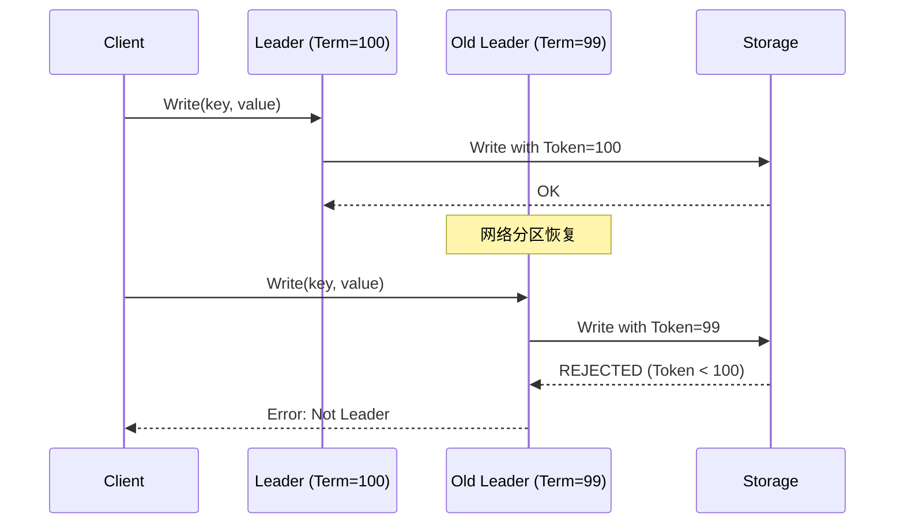
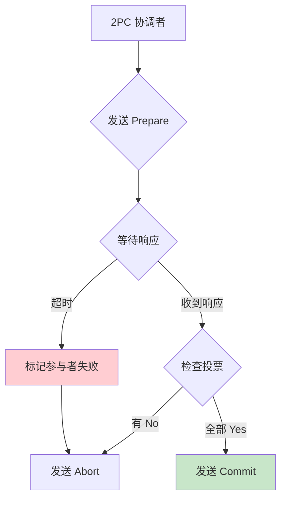
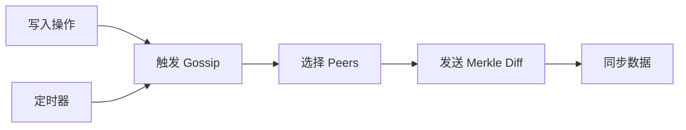

# PR-067 Pre 文档：一致性 P0 问题修复

> **PR 类型**: feature
> **创建日期**: 2026-02-14
> **负责人**: 🤖 核心开发 A
> **状态**: 🔄 待评审

---

## 1. 需求背景

### 1.1 来源

基于 `docs/07_spike/2026-02-14_tree-coordinator-consistency-hierarchy.md` 的三 Agent 评估结果，识别出 4 个 P0 阻塞问题必须在生产实施前解决。

### 1.2 问题描述

| 问题 | 风险 | 当前状态 |
|------|------|---------|
| **脑裂防护缺失** | 数据损坏 | ❌ 未实现 |
| **2PC 阻塞恢复** | 系统停摆 | ⚠️ 超时机制不完善 |
| **Gossip 触发机制** | 同步延迟 | ⚠️ TODO 未完成 |
| **NamespaceTopo 层级不一致** | 元数据错误 | ⚠️ 代码与文档不匹配 |

### 1.3 影响范围

- **严重程度**: 🔴 P0 - 阻塞生产使用
- **影响模块**: `internal/metadata/consistency/`, `internal/metadata/gossip/`
- **影响用户**: 所有使用 Tree Coordinator 的用户

---

## 2. 技术方案

### 2.1 Fencing Token 实现（脑裂防护）

**问题**：当网络分区恢复后，可能存在多个 Leader 同时写入，导致数据损坏。

**方案**：实现 Fencing Token 机制



**核心代码设计**：

```go
// FencingToken 防脑裂令牌
type FencingToken struct {
    Term     uint64    // 任期号（全局递增）
    NodeID   string    // 节点 ID
    IssuedAt time.Time // 签发时间
}

// FencingStore 带防护的存储
type FencingStore struct {
    mu        sync.RWMutex
    current   *FencingToken
    storage   KVStore
}

// Write 带防护的写入
func (s *FencingStore) Write(ctx context.Context, key string, value []byte, token *FencingToken) error {
    s.mu.Lock()
    defer s.mu.Unlock()

    // 检查 Token 是否有效
    if s.current != nil && token.Term <= s.current.Term {
        return ErrStaleToken // 拒绝旧 Token
    }

    // 更新当前 Token
    s.current = token

    // 执行写入
    return s.storage.Put(ctx, key, value)
}
```

**文件变更**：

| 文件 | 操作 | 说明 |
|------|------|------|
| `internal/metadata/consistency/fencing.go` | 新增 | FencingToken + FencingStore 实现 |
| `internal/metadata/consistency/fencing_test.go` | 新增 | 单元测试 |
| `internal/metadata/consistency/twopc_coordinator.go` | 修改 | 集成 Fencing Token |

### 2.2 2PC 阻塞恢复

**问题**：2PC 协调者在等待参与者响应时阻塞，导致系统停摆。

**方案**：实现超时机制 + 自动恢复



**核心代码设计**：

```go
// TwoPhaseCoordinatorWithTimeout 带 timeout 的 2PC 协调者
type TwoPhaseCoordinatorWithTimeout struct {
    *TwoPhaseCoordinator
    prepareTimeout time.Duration
    commitTimeout  time.Duration
}

// PrepareWithTimeout 带 timeout 的 Prepare
func (c *TwoPhaseCoordinatorWithTimeout) PrepareWithTimeout(ctx context.Context, txID string) error {
    ctx, cancel := context.WithTimeout(ctx, c.prepareTimeout)
    defer cancel()

    done := make(chan error, 1)
    go func() {
        done <- c.Prepare(ctx, txID)
    }()

    select {
    case err := <-done:
        return err
    case <-ctx.Done():
        // 超时后自动 Abort
        c.Abort(context.Background(), txID)
        return ErrPrepareTimeout
    }
}
```

**文件变更**：

| 文件 | 操作 | 说明 |
|------|------|------|
| `internal/metadata/consistency/twopc_coordinator.go` | 修改 | 添加超时机制 |
| `internal/metadata/consistency/twopc_coordinator_test.go` | 修改 | 添加超时测试 |

### 2.3 Gossip 触发机制

**问题**：当前 Gossip 只在定时器触发，导致 Layer3 同步延迟。

**方案**：实现事件驱动 + 定时触发



**核心代码设计**：

```go
// EventDrivenGossip 事件驱动的 Gossip
type EventDrivenGossip struct {
    *MerkleGossipSync
    eventChan  chan GossipEvent
    ticker     *time.Ticker
    pending    map[string]bool
}

// OnWrite 写入事件触发
func (g *EventDrivenGossip) OnWrite(key string) {
    select {
    case g.eventChan <- GossipEvent{Type: WriteEvent, Key: key}:
    default:
        // 通道满，丢弃（定时器会兜底）
    }
}

// Run 运行 Gossip 循环
func (g *EventDrivenGossip) Run(ctx context.Context) {
    for {
        select {
        case <-ctx.Done():
            return
        case event := <-g.eventChan:
            g.processEvent(event)
        case <-g.ticker.C:
            g.syncAll()
        }
    }
}
```

**文件变更**：

| 文件 | 操作 | 说明 |
|------|------|------|
| `internal/metadata/gossip/event_driven.go` | 新增 | 事件驱动 Gossip |
| `internal/metadata/gossip/event_driven_test.go` | 新增 | 单元测试 |
| `internal/metadata/consistency/tree_coordinator_integration.go` | 修改 | 集成事件驱动 |

### 2.4 NamespaceTopo 层级修复

**问题**：代码中 `NamespaceTopo` 被归类到 Layer1，但设计文档应为 Layer2。

**方案**：修改代码中的层级定义

```go
// GetLayerForNamespace 修复后的层级选择
func (c *TreeTopologyCoordinator) GetLayerForNamespace(ns string) Layer {
    switch ns {
    case kvstore.NamespaceCluster,
         kvstore.NamespaceShard,
         kvstore.NamespaceStatic,
         kvstore.NamespaceVersion:
        return Layer1 // 2PC 强一致

    case kvstore.NamespaceRole,
         kvstore.NamespaceTopo:  // 修复：NamespaceTopo 应为 Layer2
        return Layer2 // Quorum 增强最终一致

    default:
        return Layer3 // Gossip 最终一致
    }
}
```

**文件变更**：

| 文件 | 操作 | 说明 |
|------|------|------|
| `internal/metadata/consistency/tree_coordinator_integration.go` | 修改 | 修复层级定义 |
| `internal/metadata/consistency/tree_coordinator_integration_test.go` | 修改 | 更新测试 |

---

## 3. 实施计划

### 3.1 任务分解

| 任务 | 工期 | 依赖 | 产出物 |
|------|------|------|--------|
| **Task 1**: Fencing Token 实现 | 2 天 | - | fencing.go + 测试 |
| **Task 2**: 2PC 超时机制 | 1 天 | - | twopc_coordinator.go |
| **Task 3**: Gossip 事件驱动 | 1.5 天 | - | event_driven.go |
| **Task 4**: NamespaceTopo 修复 | 0.5 天 | - | 层级修复 |
| **Task 5**: 集成测试 | 1 天 | Task 1-4 | 集成测试 |
| **Task 6**: 文档更新 | 0.5 天 | Task 1-5 | 更新设计文档 |
| **总计** | **6.5 天** | | |

### 3.2 里程碑

| 里程碑 | 完成标准 | 预计日期 |
|--------|---------|---------|
| **M1**: Fencing Token | 脑裂测试通过 | Day 2 |
| **M2**: 2PC 超时 | 超时恢复测试通过 | Day 3 |
| **M3**: Gossip 事件驱动 | 延迟 < 5s 测试通过 | Day 4.5 |
| **M4**: 集成完成 | 所有测试通过 | Day 6 |

---

## 4. 测试计划

### 4.1 单元测试

| 模块 | 测试用例 | 覆盖率目标 |
|------|---------|-----------|
| **Fencing Token** | 正常写入、拒绝旧 Token、并发写入 | 90% |
| **2PC 超时** | 正常提交、超时 Abort、部分超时 | 85% |
| **Gossip 事件驱动** | 事件触发、定时触发、通道满处理 | 85% |

### 4.2 集成测试

```go
// TestFencingToken_SplitBrain 脑裂防护测试
func TestFencingToken_SplitBrain(t *testing.T) {
    cluster := setupCluster(3)
    defer cluster.Shutdown()

    // 模拟脑裂：创建两个 Leader
    leader1 := cluster.GetLeader()
    leader2 := cluster.ForceLeader("node-2")

    // Leader1 写入（Term=100）
    err1 := leader1.Put("key1", "value1", token100)
    require.NoError(t, err1)

    // Leader2 尝试写入（Term=99，应该被拒绝）
    err2 := leader2.Put("key1", "value2", token99)
    require.Error(t, err2) // 应该失败
    require.Equal(t, ErrStaleToken, err2)
}

// Test2PC_TimeoutRecovery 2PC 超时恢复测试
func Test2PC_TimeoutRecovery(t *testing.T) {
    cluster := setupCluster(3)
    defer cluster.Shutdown()

    // 模拟参与者超时
    cluster.DisconnectNode("node-2")

    // 发起 2PC（应该超时并 Abort）
    err := cluster.Put2PC("key1", "value1")
    require.Error(t, err)
    require.Equal(t, ErrPrepareTimeout, err)

    // 验证数据没有被写入
    _, err = cluster.Get("key1")
    require.Error(t, err) // 应该不存在
}
```

### 4.3 Porcupine 验证

```go
// Model: Fencing Token 正确性
var fencingTokenModel = porcupine.Model{
    Partition: func(history []porcupine.Operation) [][]porcupine.Operation {
        // 按时间分区
    },
    Init: func() interface{} {
        return &FencingState{Token: 0, Values: make(map[string]string)}
    },
    Step: func(state interface{}, input, output interface{}) (bool, interface{}) {
        // 验证 Token 单调递增
        // 验证写入被正确防护
    },
}
```

---

## 5. 风险评估

### 5.1 技术风险

| 风险 | 级别 | 缓解措施 |
|------|------|---------|
| **Fencing Token 性能影响** | 🟡 中 | 优化 Token 比较逻辑，使用无锁实现 |
| **2PC 超时配置不当** | 🟡 中 | 提供配置项，默认值基于压测 |
| **Gossip 事件风暴** | 🟡 中 | 通道满时丢弃，定时器兜底 |
| **向后兼容性** | 🟢 低 | 新增字段可选，旧客户端忽略 |

### 5.2 进度风险

| 风险 | 级别 | 缓解措施 |
|------|------|---------|
| **Fencing Token 复杂度超预期** | 🟡 中 | 预留 0.5 天缓冲 |
| **集成测试发现 Bug** | 🟡 中 | 每日代码审查 |

---

## 6. 回滚方案

### 6.1 代码回滚

```bash
# 如果 P0 修复导致问题，回滚到修复前
git revert <merge-commit>
git push origin main
```

### 6.2 配置回滚

```yaml
# 关闭 Fencing Token（如果影响性能）
consistency:
  fencing_enabled: false

# 关闭 Gossip 事件驱动（如果导致问题）
gossip:
  event_driven: false
  interval: 10s  # 仅使用定时器
```

---

## 7. 验收标准

### 7.1 功能验收

- [ ] Fencing Token 脑裂测试通过
- [ ] 2PC 超时恢复测试通过
- [ ] Gossip 事件驱动延迟 < 5s
- [ ] NamespaceTopo 层级正确

### 7.2 质量验收

- [ ] 单元测试覆盖率 ≥ 80%
- [ ] 集成测试全部通过
- [ ] Porcupine 线性化验证通过
- [ ] 代码审查通过

### 7.3 文档验收

- [ ] 更新设计文档
- [ ] 更新 API 文档
- [ ] 更新运维手册

---

## 8. 相关文档

| 文档 | 说明 |
|------|------|
| [Tree Coordinator 一致性层级研究](../../07_spike/2026-02-14_tree-coordinator-consistency-hierarchy.md) | 主研究文档 |
| [Leader HA 设计](../../07_spike/2026-02-14_leader-ha-design.md) | Fencing Token 详细设计 |
| [实施评审报告](../../07_spike/2026-02-14_consistency-implementation-review.md) | P0 问题清单 |
| [HLC 时钟设计](../../07_spike/2026-02-14_hlc-clock-design.md) | Gossip 事件驱动参考 |

---

**Pre 文档版本**: v1.0
**创建日期**: 2026-02-14
**等待评审**: 👤 架构师
