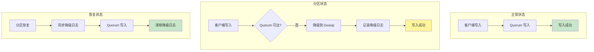
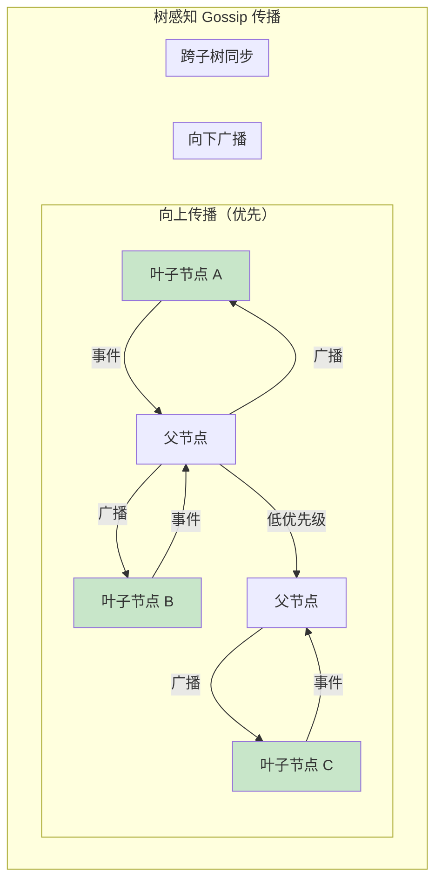
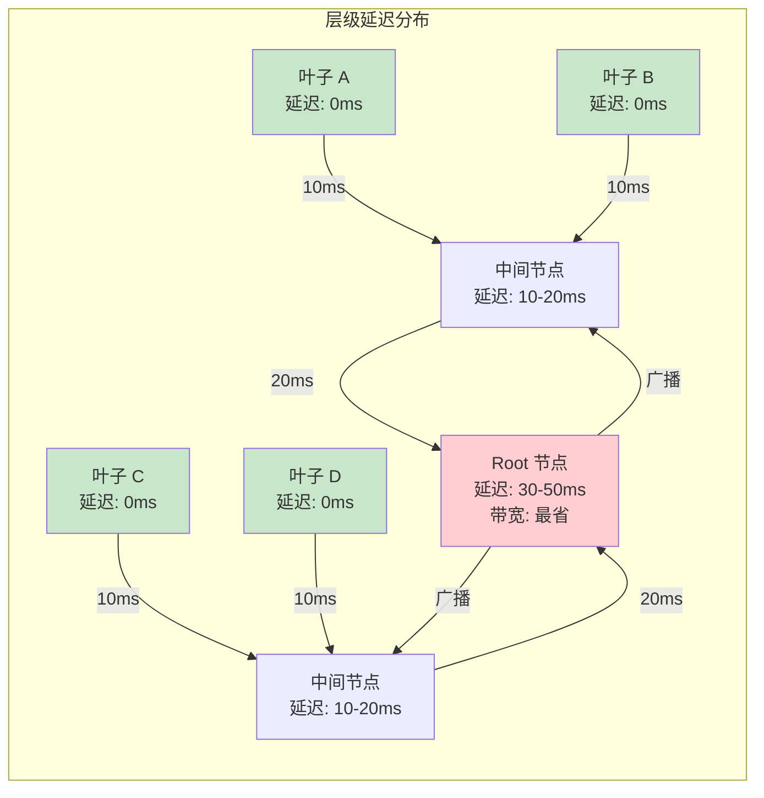

# PR-068 Pre 文档：一致性 Phase 2 核心功能

> **PR 类型**: feature
> **创建日期**: 2026-02-14
> **负责人**: 🤖 核心开发 A
> **状态**: 🔄 等待评审
> **依赖**: PR-067 (已合并)

---

## 1. 需求背景

### 1.1 来源

基于 `docs/07_spike/2026-02-14_tree-coordinator-consistency-hierarchy.md` 的实施路线图，PR-067 已完成 P0 问题修复，现在进入 Phase 2 核心功能开发。

### 1.2 当前状态

| 功能 | PR-067 状态 | Phase 2 目标 |
|------|------------|--------------|
| **Fencing Token** | ✅ 已实现 | 复用于分区恢复 |
| **2PC 超时机制** | ✅ 已实现 | 复用于强一致写入 |
| **Gossip 事件驱动** | ✅ 已实现 | **优化为树感知传播** |
| **Saga 补偿机制** | ❌ 已放弃 | 必要性评估 2/10 |
| **分区降级策略** | ❌ 未实现 | **本次实现** |
| **树感知 Gossip** | ❌ 未实现 | **本次实现** |

> **Saga 放弃理由**：
> 1. **必要性低（2/10）**：现有三层一致性已覆盖所有场景
> 2. **无跨层级事务需求**：每个 Namespace 映射到单一层级
> 3. **投入产出比低**：实现复杂度 9/10，完整版需 14 周

### 1.3 影响范围

- **严重程度**: 🟡 P1 - 核心功能增强
- **影响模块**: `internal/metadata/fault/`, `internal/metadata/partition/`, `internal/metadata/degradation/`, `internal/metadata/gossip/`
- **影响用户**: 所有使用 Tree Coordinator 的用户

---

## 2. 技术方案

### 2.1 分区降级策略

#### 2.1.1 原理解释

**分区降级**是在网络分区时，将一致性级别从强一致降级到最终一致，保证系统可用性。

**核心原理**：
1. **故障检测**: 使用 Phi Accrual 检测器识别节点故障
2. **分区判定**: 当 Quorum 不可达时，判定为分区
3. **降级执行**: 降级到 Gossip 写入，记录降级日志
4. **恢复同步**: 分区恢复后，将降级日志同步到 Quorum



#### 2.1.2 Phi Accrual 故障检测器

```go
// PhiAccrualDetector Phi Accrual 故障检测器
type PhiAccrualDetector struct {
    mu             sync.RWMutex
    nodeID         string
    heartbeatStats map[string]*HeartbeatStats // 节点 -> 心跳统计
    threshold      float64                    // Phi 阈值（默认 8.0）
    minStdDev      time.Duration              // 最小标准差（默认 500ms）
}

// HeartbeatStats 心跳统计
type HeartbeatStats struct {
    LastHeartbeat time.Time       // 最后心跳时间
    Intervals     []time.Duration // 心跳间隔历史
    Mean          time.Duration   // 平均间隔
    Variance      float64         // 方差
}

// RecordHeartbeat 记录心跳
func (d *PhiAccrualDetector) RecordHeartbeat(nodeID string) {
    d.mu.Lock()
    defer d.mu.Unlock()

    now := time.Now()
    stats := d.heartbeatStats[nodeID]

    if stats == nil {
        stats = &HeartbeatStats{}
        d.heartbeatStats[nodeID] = stats
    }

    if !stats.LastHeartbeat.IsZero() {
        interval := now.Sub(stats.LastHeartbeat)
        stats.Intervals = append(stats.Intervals, interval)
        d.updateStats(stats)
    }

    stats.LastHeartbeat = now
}

// Phi 计算 Phi 值
func (d *PhiAccrualDetector) Phi(nodeID string) float64 {
    d.mu.RLock()
    defer d.mu.RUnlock()

    stats := d.heartbeatStats[nodeID]
    if stats == nil || stats.LastHeartbeat.IsZero() {
        return 0
    }

    timeSinceLast := time.Since(stats.LastHeartbeat)

    // 使用正态分布计算 Phi
    // Phi = -log(1 - CDF(timeSinceLast))
    if stats.Variance == 0 {
        stats.Variance = float64(d.minStdDev * d.minStdDev)
    }

    phi := calculatePhi(timeSinceLast, stats.Mean, stats.Variance)
    return phi
}

// IsNodeFailed 判断节点是否故障
func (d *PhiAccrualDetector) IsNodeFailed(nodeID string) bool {
    return d.Phi(nodeID) > d.threshold
}
```

#### 2.1.3 分区检测器

```go
// PartitionDetector 分区检测器
type PartitionDetector struct {
    mu           sync.RWMutex
    localNodeID  string
    allNodes     []string
    quorumSize   int

    phiDetector  *PhiAccrualDetector
    partitionMap map[string]bool // 节点 -> 是否可达
}

// PartitionStatus 分区状态
type PartitionStatus struct {
    IsPartitioned   bool     // 是否分区
    CanReachQuorum  bool     // 是否可达 Quorum
    ReachableNodes  []string // 可达节点
    UnreachableNodes []string // 不可达节点
}

// CheckPartition 检查分区状态
func (d *PartitionDetector) CheckPartition() PartitionStatus {
    d.mu.RLock()
    defer d.mu.RUnlock()

    var reachable, unreachable []string

    for _, node := range d.allNodes {
        if d.phiDetector.IsNodeFailed(node) {
            unreachable = append(unreachable, node)
        } else {
            reachable = append(reachable, node)
        }
    }

    // 判断是否可达 Quorum
    canReachQuorum := len(reachable) >= d.quorumSize

    return PartitionStatus{
        IsPartitioned:    !canReachQuorum,
        CanReachQuorum:   canReachQuorum,
        ReachableNodes:   reachable,
        UnreachableNodes: unreachable,
    }
}
```

#### 2.1.4 降级管理器

```go
// DegradationManager 降级管理器
type DegradationManager struct {
    mu sync.RWMutex

    detector       *PartitionDetector
    quorumCoord    *QuorumCoordinator
    gossipSync     *EventDrivenGossipSync
    demotionLog    *DemotionLog

    isDegraded     bool
    degradedSince  time.Time
}

// Write 写入（自动降级）
func (m *DegradationManager) Write(ctx context.Context, ns, key string, value []byte) error {
    status := m.detector.CheckPartition()

    if status.CanReachQuorum {
        // 正常：使用 Quorum
        return m.quorumCoord.PutWithQuorum(ctx, ns, key, value)
    }

    // 降级：使用 Gossip
    m.mu.Lock()
    if !m.isDegraded {
        m.isDegraded = true
        m.degradedSince = time.Now()
    }
    m.mu.Unlock()

    // 写入本地 + 记录降级日志
    if err := m.gossipSync.store.Put(ns, key, value); err != nil {
        return err
    }

    m.demotionLog.Append(DemotionEntry{
        Namespace:  ns,
        Key:        key,
        Value:      value,
        Timestamp:  time.Now(),
    })

    m.gossipSync.OnWrite(ns, key)
    return nil
}
```

#### 2.1.5 降级日志与恢复

```go
// DemotionLog 降级日志
type DemotionLog struct {
    mu      sync.RWMutex
    entries []DemotionEntry
    store   KVStore
}

// DemotionEntry 降级日志条目
type DemotionEntry struct {
    ID        string    // 条目 ID
    Namespace string    // 命名空间
    Key       string    // 键
    Value     []byte    // 值
    Timestamp time.Time // 时间戳
    Synced    bool      // 是否已同步
}

// RecoveryManager 恢复管理器
type RecoveryManager struct {
    detector    *PartitionDetector
    manager     *DegradationManager
    quorumCoord *QuorumCoordinator
}

// CheckAndRecover 检查并恢复
func (r *RecoveryManager) CheckAndRecover(ctx context.Context) error {
    status := r.detector.CheckPartition()

    if !status.CanReachQuorum {
        return nil // 仍在分区中
    }

    // 分区恢复，同步降级日志
    unsynced := r.manager.demotionLog.GetUnsynced()

    for _, entry := range unsynced {
        if err := r.quorumCoord.PutWithQuorum(ctx, entry.Namespace, entry.Key, entry.Value); err != nil {
            return err
        }
        r.manager.demotionLog.MarkSynced(entry.ID)
    }

    // 重置降级状态
    r.manager.ResetDegraded()

    return nil
}
```

#### 2.1.6 文件变更

| 文件 | 操作 | 说明 |
|------|------|------|
| `internal/metadata/fault/detector.go` | 新增 | Phi Accrual 故障检测器 |
| `internal/metadata/partition/detector.go` | 新增 | 分区检测器 |
| `internal/metadata/degradation/manager.go` | 新增 | 降级管理器 |
| `internal/metadata/degradation/log.go` | 新增 | 降级日志 |
| `internal/metadata/degradation/recovery.go` | 新增 | 恢复管理器 |
| `internal/metadata/fault/detector_test.go` | 新增 | 检测器测试 |

---

### 2.2 树感知 Gossip 优化

#### 2.2.1 原理解释

**树感知 Gossip** 是基于树拓扑的优化传播策略，减少同步延迟和带宽消耗。

**核心原理**：
1. **向上传播**: 叶子节点 → 父节点（优先级高）
2. **向下广播**: 父节点 → 子节点（优先级中）
3. **层级感知**: 距离叶子越近，传播越快；Root 最慢



#### 2.2.2 节点层级行为分析

**关键设计考量**：不同层级节点有不同的传播行为和性能特征。

| 节点类型 | 发送目标 | 接收来源 | 带宽消耗 | 延迟特征 |
|----------|----------|----------|----------|----------|
| **叶子节点** | 只发父节点 | 无子节点 | 最低（1 个目标） | 最低（本地产生） |
| **中间节点** | 父节点 + 子节点 | 父节点 + 子节点 | 中等 | 中等 |
| **Root 节点** | 只广播子节点 | 所有子节点向上汇聚 | 低（只发不收向上） | **最高**（需等待向上传播） |

**Root 节点特殊行为**：
- ✅ **带宽最省**：只需向子节点广播，无需向上发送
- ⚠️ **延迟最高**：必须等待所有子树事件向上传播到达后，才能完成全局同步
- 📊 **设计权衡**：Root 节点的低带宽消耗 vs 高延迟特性



**性能目标**：
| 指标 | 当前 | 优化后 | 提升 |
|------|------|--------|------|
| **传播延迟** | 10 秒 | 3-5 秒 | 50%+ |
| **带宽消耗** | 100% | 30-50% | 50-70% |
| **消息跳数** | 随机 | 树深度 | 有序 |
| **Root 延迟** | N/A | 树深度 × 单跳延迟 | 可预测 |

#### 2.2.3 树感知传播策略

```go
// NodeType 节点类型
type NodeType int

const (
    NodeTypeLeaf   NodeType = iota // 叶子节点：只发父节点
    NodeTypeMiddle                  // 中间节点：发父节点 + 广播子节点
    NodeTypeRoot                    // Root 节点：只广播子节点，延迟最高
)

// TreeAwareGossipSync 树感知 Gossip 同步
type TreeAwareGossipSync struct {
    *EventDrivenGossipSync

    // 树拓扑
    localNodeID string
    nodeType    NodeType   // 节点类型（影响传播行为）
    parentNode  string     // 父节点 ID（Root 节点为空）
    childNodes  []string   // 子节点列表（叶子节点为空）
    treeDepth   int        // 树深度（叶子=0，Root=最大）

    // 优先级队列
    highPriority   chan GossipEvent // 向上传播（叶子→父）
    normalPriority chan GossipEvent // 向下广播（父→子）
    lowPriority    chan GossipEvent // 跨子树同步

    // 延迟统计
    avgPropagationDelay time.Duration // 平均传播延迟
}

// Propagate 根据节点类型传播事件
func (s *TreeAwareGossipSync) Propagate(event GossipEvent) {
    switch s.nodeType {
    case NodeTypeLeaf:
        // 叶子节点：只向父节点传播（带宽最低，延迟最低）
        s.sendToParent(event)

    case NodeTypeMiddle:
        // 中间节点：向父节点 + 广播子节点
        s.sendToParent(event)
        s.broadcastToChildren(event)

    case NodeTypeRoot:
        // Root 节点：只广播子节点（带宽省，但延迟最高）
        // 注意：Root 不需要向上发送，因为它已经是顶端
        s.broadcastToChildren(event)
    }
}

// broadcastToChildren 广播到所有子节点
func (s *TreeAwareGossipSync) broadcastToChildren(event GossipEvent) {
    for _, child := range s.childNodes {
        select {
        case s.normalPriority <- GossipEvent{
            Type:      event.Type,
            Namespace: event.Namespace,
            Key:       event.Key,
            NodeID:    child, // 目标节点
        }:
            // 发送成功
        default:
            // 通道满，记录丢弃
            s.stats.droppedNormalPriority++
        }
    }
}

// GetNodeType 获取节点类型
func (s *TreeAwareGossipSync) GetNodeType() NodeType {
    return s.nodeType
}

// GetExpectedDelay 获取预期延迟（基于节点类型）
func (s *TreeAwareGossipSync) GetExpectedDelay() time.Duration {
    // Root 节点延迟 = 树深度 × 单跳延迟
    // 叶子节点延迟 = 0（本地产生）
    return time.Duration(s.treeDepth) * s.avgPropagationDelay
}
```

#### 2.2.4 优先级传播

```go
// PriorityLevel 优先级级别
type PriorityLevel int

const (
    PriorityHigh   PriorityLevel = iota // 高优先级：向上传播
    PriorityNormal                      // 普通优先级：向下广播
    PriorityLow                         // 低优先级：跨子树同步
)

// PrioritizedEvent 带优先级的事件
type PrioritizedEvent struct {
    Event    GossipEvent
    Priority PriorityLevel
    EnqueueTime time.Time
}

// runPriorityLoop 运行优先级循环
func (s *TreeAwareGossipSync) runPriorityLoop(ctx context.Context) {
    for {
        select {
        case <-ctx.Done():
            return

        // 优先处理高优先级事件
        case event := <-s.highPriority:
            s.processEvent(event, PriorityHigh)

        // 然后处理普通优先级
        case event := <-s.normalPriority:
            s.processEvent(event, PriorityNormal)

        // 最后处理低优先级
        case event := <-s.lowPriority:
            s.processEvent(event, PriorityLow)
        }
    }
}
```

#### 2.2.5 带宽优化

```go
// BandwidthOptimizer 带宽优化器
type BandwidthOptimizer struct {
    // 批量合并
    batchSize    int           // 批量大小（默认 10）
    batchTimeout time.Duration // 批量超时（默认 100ms）
    pendingBatch []GossipEvent

    // 增量同步
    lastSyncVersion map[string]uint64 // 节点 -> 最后同步版本
}

// BatchSend 批量发送
func (o *BandwidthOptimizer) BatchSend(events []GossipEvent, targetNode string) error {
    // 1. 合并相同 Namespace 的事件
    merged := o.mergeEvents(events)

    // 2. 增量同步（只发送变更）
    incremental := o.filterIncremental(merged, targetNode)

    // 3. 压缩发送
    compressed := o.compress(incremental)

    return o.send(compressed, targetNode)
}

// mergeEvents 合并相同 Namespace 的事件
func (o *BandwidthOptimizer) mergeEvents(events []GossipEvent) []GossipEvent {
    nsMap := make(map[string]GossipEvent)
    for _, event := range events {
        key := event.Namespace
        nsMap[key] = event // 保留最新事件
    }

    result := make([]GossipEvent, 0, len(nsMap))
    for _, event := range nsMap {
        result = append(result, event)
    }
    return result
}
```

#### 2.2.6 文件变更

| 文件 | 操作 | 说明 |
|------|------|------|
| `internal/metadata/gossip/tree_aware.go` | 新增 | 树感知 Gossip 同步 |
| `internal/metadata/gossip/priority.go` | 新增 | 优先级传播 |
| `internal/metadata/gossip/bandwidth.go` | 新增 | 带宽优化 |
| `internal/metadata/gossip/tree_aware_test.go` | 新增 | 单元测试 |

---

### 2.3 API 文档补充

#### 2.3.1 Fencing API 文档

**文件**: `docs/08_api/fencing.md` (~3000 字)

**内容要点**:
- Fencing Token 机制原理
- FencingStore.Write/WriteRaw API
- TermStorage 持久化
- 防脑裂场景说明
- 使用示例和最佳实践

#### 2.3.2 Leader Manager API 文档

**文件**: `docs/08_api/leader_manager.md` (~2500 字)

**内容要点**:
- **父节点 = 天然 Leader**（基于树拓扑，无需选举）
- LeaderManager.BecomeLeader API（推进 Term）
- LeaderManager.GenerateToken API（生成 Fencing Token）
- Term 持久化机制
- Standby 故障切换场景

#### 2.3.3 2PC API 文档

**文件**: `docs/08_api/twopc.md` (~4000 字)

**内容要点**:
- 两阶段提交流程
- PreCommit/Commit API
- PreCommitWithTimeout/CommitWithTimeout API
- 超时与重试机制
- Gossip 状态同步
- 故障恢复策略

#### 2.3.4 Gossip Event API 文档

**文件**: `docs/08_api/gossip-event.md` (~3000 字)

**内容要点**:
- 事件驱动机制原理
- OnWrite/OnNamespaceChange API
- OnPeerJoin/OnPeerLeave API
- 防风暴策略
- 批量优化配置

#### 2.3.5 运维手册更新

**文件**: `docs/05_deployment_operation/02_运维手册.md` (+2000 字)

**内容要点**:
- Fencing 监控指标（Term 变更频率、Token 验证成功率）
- 2PC 事务监控（成功率/超时统计）
- Gossip 事件监控（处理速率、丢弃率）
- 分区降级监控
- 故障处理流程

---

## 3. 实施计划

### 3.1 任务分解

| 任务 | 工期 | 依赖 | 产出物 |
|------|------|------|--------|
| **DEGR-1**: Phi Accrual 故障检测器 | 1.5 天 | - | `fault/detector.go` |
| **DEGR-2**: 分区检测器 | 0.5 天 | DEGR-1 | `partition/detector.go` |
| **DEGR-3**: 降级管理器 | 1.5 天 | DEGR-2 | `degradation/manager.go` |
| **DEGR-4**: 降级日志系统（含 WAL） | 0.5 天 | DEGR-3 | `degradation/log.go` |
| **DEGR-5**: 分区恢复与同步 | 0.5 天 | DEGR-3,4 | `degradation/recovery.go` |
| **GOSSIP-1**: 树感知传播策略 | 1.5 天 | - | `gossip/tree_aware.go` |
| **GOSSIP-2**: 优先级传播（三通道） | 1 天 | GOSSIP-1 | `gossip/priority.go` |
| **GOSSIP-3**: 带宽优化 | 0.5 天 | GOSSIP-1 | `gossip/bandwidth.go` |
| **DOC-1-5**: 文档补充 | 1.5 天 | - | 4 个 API 文档 + 运维手册 |
| **总计** | **10 天** | | |

> **工期说明**：相比初始估算（8天）增加 2 天，原因（基于 Agent 评审）：
> - DEGR-1 参数调优和边界场景测试（+0.5天）
> - DEGR-3 并发写入和状态持久化复杂（+0.5天）
> - GOSSIP-1 拓扑变化处理复杂（+0.5天）
> - GOSSIP-2 三通道设计改造复杂（+0.5天）

### 3.2 里程碑

| 里程碑 | Day | 完成标准 |
|--------|-----|---------|
| **M1: 故障检测完成** | 2 | Phi Accrual + 分区检测可工作 |
| **M2: 降级核心完成** | 5 | 降级管理器 + WAL + 恢复同步 |
| **M3: Gossip 优化完成** | 8 | 树感知传播 + 三级优先队列 |
| **M4: 文档完成** | 9 | 4 个 API 文档 + 运维手册 |
| **M5: Phase 2 验收** | 10 | 所有测试通过 + CI 绿色 |

---

## 4. 测试计划

### 4.1 分区降级测试

```go
// TestDegradation_PartitionAndRecovery 分区与恢复测试
func TestDegradation_PartitionAndRecovery(t *testing.T) {
    detector := NewPartitionDetector("node-1", nodes, 2)
    manager := NewDegradationManager(detector, quorumCoord, gossipSync, logStore)

    // 1. 模拟分区
    detector.phiDetector.SimulateFailure("node-2")
    detector.phiDetector.SimulateFailure("node-3")

    status := detector.CheckPartition()
    require.True(t, status.IsPartitioned)

    // 2. 降级写入
    err := manager.Write(ctx, "ns", "key1", []byte("v1"))
    require.NoError(t, err)

    // 3. 验证降级日志
    unsynced := manager.demotionLog.GetUnsynced()
    require.Len(t, unsynced, 1)

    // 4. 恢复分区
    detector.phiDetector.SimulateRecovery("node-2")
    detector.phiDetector.SimulateRecovery("node-3")

    recovery := NewRecoveryManager(detector, manager, quorumCoord)
    err = recovery.CheckAndRecover(ctx)
    require.NoError(t, err)

    // 5. 验证降级日志已同步
    unsynced = manager.demotionLog.GetUnsynced()
    require.Len(t, unsynced, 0)
}

// TestPhiAccrualDetector_FailureDetection 故障检测测试
func TestPhiAccrualDetector_FailureDetection(t *testing.T) {
    detector := NewPhiAccrualDetector("node-1", 8.0)

    // 正常心跳
    for i := 0; i < 10; i++ {
        detector.RecordHeartbeat("node-2")
        time.Sleep(100 * time.Millisecond)
    }

    // 节点正常
    require.False(t, detector.IsNodeFailed("node-2"))

    // 模拟故障（停止心跳）
    time.Sleep(2 * time.Second)

    // 节点应该被判定为故障
    require.True(t, detector.IsNodeFailed("node-2"))
}
```

### 4.2 树感知 Gossip 测试

```go
// TestTreeAwareGossip_UpwardPropagation 向上传播测试
func TestTreeAwareGossip_UpwardPropagation(t *testing.T) {
    // 设置树拓扑：叶子 -> 父 -> Root
    leafSync := NewTreeAwareGossipSync("leaf-1", "parent", nil, 0)
    parentSync := NewTreeAwareGossipSync("parent", "root", []string{"leaf-1"}, 1)

    // 叶子节点触发事件
    event := GossipEvent{Type: EventWrite, Namespace: "ns1", Key: "key1"}
    leafSync.OnWrite("ns1", "key1")

    // 验证：事件应该优先发送到父节点
    time.Sleep(100 * time.Millisecond)

    stats := leafSync.GetStats()
    require.Equal(t, 1, stats["high_priority_sent"])
}

// TestTreeAwareGossip_BandwidthOptimization 带宽优化测试
func TestTreeAwareGossip_BandwidthOptimization(t *testing.T) {
    sync := NewTreeAwareGossipSync("node-1", "parent", nil, 0)
    optimizer := NewBandwidthOptimizer(10, 100*time.Millisecond)

    // 触发 10 个相同 Namespace 的事件
    for i := 0; i < 10; i++ {
        sync.OnWrite("ns1", fmt.Sprintf("key%d", i))
    }

    // 等待批量发送
    time.Sleep(200 * time.Millisecond)

    // 验证：应该合并为 1 次发送
    stats := optimizer.GetStats()
    require.Equal(t, 1, stats["batch_count"])
    require.Equal(t, 10, stats["events_merged"])
}
```

### 4.3 测试覆盖率目标

| 模块 | 覆盖率目标 |
|------|-----------|
| 分区降级策略 | >= 80% |
| 故障检测器 | >= 85% |
| 树感知 Gossip | >= 80% |
| 带宽优化器 | >= 75% |

---

## 5. 风险评估

### 5.1 技术风险

| 风险 | 级别 | 缓解措施 |
|------|------|---------|
| **降级状态持久化** | 🔴 高 | 实现 WAL 机制，确保节点崩溃不丢失数据 |
| **并发写入冲突** | 🔴 高 | 使用 HLC + Fencing Token 确保顺序 |
| **分区恢复冲突** | 🟡 高 | 使用 HLC 时间戳 + LWW 语义 |
| **网络抖动误判** | 🟡 中 | 连续 N 次检测失败才判定分区（默认 N=3） |
| **Root 节点单点故障** | 🟡 中 | 设计 Root 节点故障降级方案 |
| **Phi Accrual 参数调优** | 🟡 中 | 提供自适应调优机制，基于历史数据调整 |
| **树感知 Gossip 拓扑变化** | 🟡 中 | 拓扑变化时重新计算父/子节点 |
| **带宽优化批量延迟** | 🟢 低 | 可配置批量大小和超时 |

### 5.2 进度风险

| 风险 | 级别 | 缓解措施 |
|------|------|---------|
| **分区降级集成复杂** | 🟡 中 | 先单元测试，再集成测试 |
| **三通道设计改造复杂** | 🟡 中 | 预留额外工期，渐进式实施 |
| **文档时间不足** | 🟢 低 | 并行编写，优先核心 API |

### 5.3 需要修改的现有代码

| 文件 | 修改内容 | 难度 |
|------|----------|------|
| `internal/transport/libp2p_transport_adapter.go` | 添加心跳机制 | 中 |
| `internal/metadata/quorum/coordinator.go` | 批量写入支持 | 低 |
| `internal/metadata/gossip/event_driven.go` | 降级写入接口 + 三级优先队列 | **高** |
| `internal/metadata/cluster/tree_coordinator.go` | 集成分区检测 + 节点类型判断 | 中 |
| `internal/metadata/types/topology_info.go` | 扩展节点类型枚举 | 低 |

---

## 6. 验收标准

### 6.1 功能验收

- [ ] 5 秒内检测到分区
- [ ] 连续 N 次检测失败才判定分区（避免网络抖动误判）
- [ ] 自动降级到 Gossip
- [ ] 降级日志持久化（WAL 机制）
- [ ] 分区恢复后自动同步
- [ ] 树感知 Gossip 延迟 < 5 秒
- [ ] 带宽降低 50%+
- [ ] 4 个 API 文档完成
- [ ] 运维手册更新完成

### 6.2 质量验收

- [ ] 测试覆盖率 >= 80%
- [ ] CI 全部通过
- [ ] 代码审查无 P0/P1 问题

### 6.3 增强测试（基于 Agent 评审）

- [ ] 分区期间并发写入测试
- [ ] 网络恢复后数据一致性验证
- [ ] Root 节点故障时的自动切换测试
- [ ] 长时间降级状态下的性能影响测试
- [ ] 网络抖动模拟测试（验证误判率）

---

## 7. 相关文档

| 文档 | 说明 |
|------|------|
| [PR-067 Pre](./2026-02-14_PR-067_Consistency-P0-Fixes_Pre.md) | P0 修复 Pre 文档 |
| [PR-067 Post](./2026-02-14_PR-067_Consistency-P0-Fixes_Post.md) | P0 修复 Post 文档 |
| [分区降级策略](../../07_spike/2026-02-14_partition-degradation.md) | 降级详细设计 |
| [一致性协议设计](../../02_design/protocols/01_一致性协议设计.md) | 一致性协议文档 |

---

**Pre 文档版本**: v2.1（Agent 评审后修订）
**创建日期**: 2026-02-14
**最后更新**: 2026-02-14
**等待评审**: 👤 架构师
**评审依据**: 三 Agent 可行性评审（可行性 8.5/10，工期建议 10 天）
