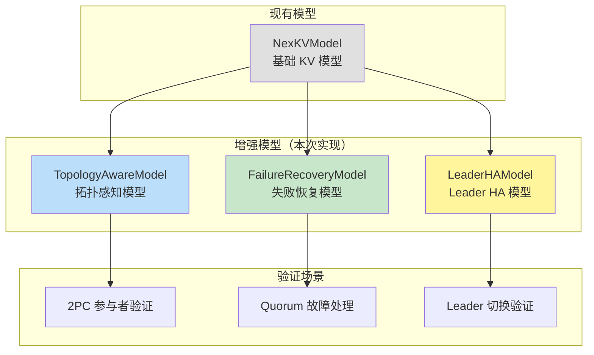
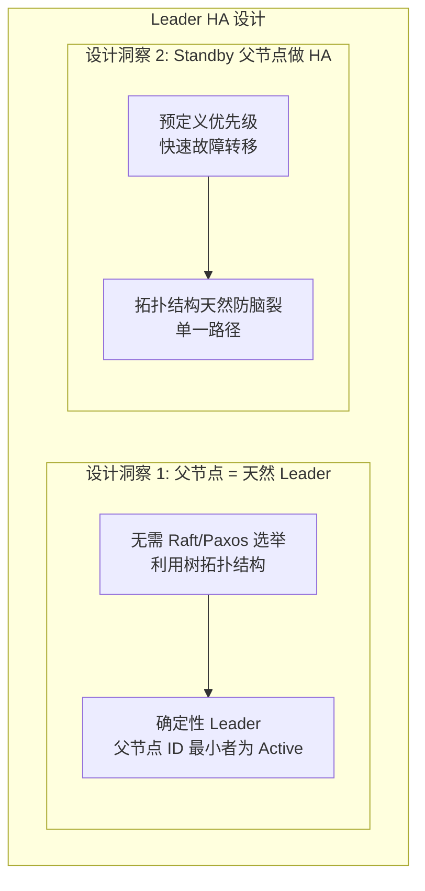

# PR-070 Pre 文档：Porcupine 增强模型

## 📋 基本信息

| 项目 | 内容 |
|------|------|
| **PR 编号** | PR-070 |
| **PR 类型** | Feature |
| **分支名称** | feature/phase3-porcupine-enhancement |
| **关联 Spike** | `docs/07_spike/2026-02-14_porcupine-enhanced-models.md` |
| **预计工期** | 2 天 |
| **开发者** | 🤖 核心开发 A |
| **创建日期** | 2026-02-14 |
| **状态** | 📝 待评审 |

---

## 1. 背景与目标

### 1.1 背景

PR-068 Phase 2 已完成核心功能开发（分区降级策略 + 树感知 Gossip 优化）。现有的 Porcupine 验证模型 (`internal/metadata/consistency/porcupine/model.go`) 是一个简化的 KV 模型，只支持基础的 Get/Put/Delete 操作，**缺乏对以下场景的验证能力**：

| 局限性 | 问题 | 影响 |
|--------|------|------|
| **无拓扑感知** | 假设所有节点参与 | 无法验证拓扑相关的 Bug |
| **无版本校验** | 不检查版本号 | 可能漏检版本冲突 |
| **无失败处理** | 假设操作总是成功 | 无法验证回滚逻辑 |
| **无 Leader 切换** | 不验证 Leader 变更 | 无法验证 Fencing Token |

### 1.2 目标

基于 Spike 文档设计，实现 Porcupine 增强验证模型：

1. **拓扑感知模型** (TopologyAwareModel) - 验证树拓扑相关的 2PC/Quorum/Gossip 操作
2. **失败恢复模型** (FailureRecoveryModel) - 验证节点故障场景下的正确性
3. **Leader HA 模型** (LeaderHAModel) - 验证 Leader 切换和 Fencing Token

> **注意**：Saga 补偿机制经三 Agent 评审后已放弃（详见 PR-068 评审报告），本次不包含 Saga 模型。

---

## 2. 技术设计

### 2.1 架构概览



### 2.2 文件结构

```
internal/metadata/consistency/porcupine/
├── model.go                    # 现有基础模型
├── enhanced_models.go          # 🆕 增强模型入口（VerifyWithModel）
├── enhanced_models_test.go     # 🆕 增强模型入口测试
├── topology_model.go           # 🆕 拓扑感知模型
├── topology_model_test.go      # 🆕 拓扑感知模型测试
├── failure_model.go            # 🆕 失败恢复模型
├── failure_model_test.go       # 🆕 失败恢复模型测试
├── leader_ha_model.go          # 🆕 Leader HA 模型
├── leader_ha_model_test.go     # 🆕 Leader HA 模型测试
├── enhanced_recorder.go        # 🆕 增强记录器（P2-03）
├── enhanced_recorder_test.go   # 🆕 增强记录器测试
└── recorder.go                 # 现有记录器
```

> **P2-02 说明**：`EnhancedOpType` 与现有 `model.go` 中的 `OpType` 是独立命名空间，分别用于增强模型和基础模型，不会冲突。

### 2.3 核心类型定义

#### 2.3.0 基础类型定义（P1-03）

```go
// VersionedValue 带版本号的值
type VersionedValue struct {
    Value   []byte // 值
    Version uint64 // 版本号（用于冲突检测）
}

// EnhancedOutput 增强操作输出
type EnhancedOutput struct {
    Ok      bool   // 操作是否成功
    Value   []byte // 返回值（Get 操作）
    Version uint64 // 版本号
    Error   string // 错误信息
}

// FailureRecoveryOperation 失败恢复操作
type FailureRecoveryOperation struct {
    Type         string   // 操作类型
    NodeID       string   // 节点 ID
    Key          string   // 键
    Value        []byte   // 值
    Version      uint64   // 版本号
    Participants []string // 参与者列表
    FailedNodes  []string // 故障节点列表
}
```

#### 2.3.1 拓扑感知模型

```go
// TopologyState 拓扑状态
type TopologyState struct {
    NodeStores    map[string]map[string]VersionedValue // 每个节点的存储
    Topology      *Topology                            // 拓扑信息（P2-06: 假设 immutable，共享引用）
    CurrentLeader string                               // 当前 Leader
    CurrentTerm   uint64                               // 当前任期
}

// Clone 克隆 TopologyState（P1-02: 补充实现）
// 注意：Topology 字段共享引用，假设拓扑在运行时不变（immutable）
func (s *TopologyState) Clone() *TopologyState {
    newNodeStores := make(map[string]map[string]VersionedValue)
    for nodeID, store := range s.NodeStores {
        newStore := make(map[string]VersionedValue)
        for k, v := range store {
            newStore[k] = v
        }
        newNodeStores[nodeID] = newStore
    }

    return &TopologyState{
        NodeStores:    newNodeStores,
        Topology:      s.Topology, // P2-06: 共享引用，拓扑 immutable
        CurrentLeader: s.CurrentLeader,
        CurrentTerm:   s.CurrentTerm,
    }
}

// NodeType 节点类型（树感知 Gossip 核心）
type NodeType int

const (
    NodeTypeUnknown NodeType = iota
    NodeTypeLeaf    // 叶子节点：只发父节点，带宽最低，延迟最低
    NodeTypeMiddle  // 中间节点：向上发父节点 + 向下广播子节点
    NodeTypeRoot    // Root 节点：只广播子节点，带宽省，延迟最高
)

// Topology 拓扑信息
type Topology struct {
    Nodes    map[string]*NodeInfo   // 节点信息
    ParentOf map[string][]string    // 父节点 -> 子节点列表
    ChildOf  map[string]string      // 子节点 -> 父节点
}

// TopologyOperation 拓扑操作
type TopologyOperation struct {
    Type         string      // 操作类型
    NodeID       string      // 节点 ID
    Key          string      // 键
    Value        []byte      // 值
    Version      uint64      // 版本号
    Term         uint64      // 任期
    Participants []string    // 参与者列表
    Nodes        []*NodeInfo // 节点列表（用于初始化拓扑）
}
```

#### 2.3.2 失败恢复模型

```go
// FailureRecoveryState 失败恢复状态
type FailureRecoveryState struct {
    NodeStores     map[string]map[string]VersionedValue
    FailedNodes    map[string]bool  // 故障节点
    RecoveredNodes map[string]bool  // 恢复节点
}
```

#### 2.3.3 Leader HA 模型核心设计

> **关键设计洞察**：父节点是天然 Leader，Standby 父节点做 HA



| 设计要点 | 说明 | 对比传统方案 |
|---------|------|-------------|
| **父节点 = 天然 Leader** | 无需选举，确定性 | 传统：需要 Raft/Paxos 选举 |
| **Standby 父节点做 HA** | 预定义优先级，快速故障转移 | 传统：动态选举，延迟高 |
| **拓扑结构天然防脑裂** | 单一路径，无分叉 | 传统：网络分区时可能脑裂 |
| **Fencing Token** | Term 单调递增，拒绝旧 Leader | 与 Raft Term 机制类似 |

```go
// LeaderHAState Leader HA 状态
type LeaderHAState struct {
    NodeStores      map[string]map[string]VersionedValue
    Topology        *Topology
    ActiveLeader    string    // 当前 Active Leader（父节点 ID 最小者）
    StandbyLeaders  []string  // Standby Leader 列表（按优先级排序）
    CurrentTerm     uint64    // 当前任期（Fencing Token）
}

// NewLeaderHAState 初始化 Leader HA 状态（P1-05: 补充初始化逻辑）
func NewLeaderHAState(topology *Topology) *LeaderHAState {
    // 1. 收集所有父节点（有子节点的节点）
    parentNodes := make([]string, 0)
    for nodeID, node := range topology.Nodes {
        if len(node.Children) > 0 {
            parentNodes = append(parentNodes, nodeID)
        }
    }

    // 2. 按节点 ID 排序（确定性 Leader 选举，ID 最小者为 Active）
    sort.Strings(parentNodes)

    // 3. 第一个为 Active，其余为 Standby
    if len(parentNodes) == 0 {
        return &LeaderHAState{
            Topology:       topology,
            CurrentTerm:    1,
        }
    }

    return &LeaderHAState{
        Topology:       topology,
        ActiveLeader:   parentNodes[0],
        StandbyLeaders: parentNodes[1:],
        CurrentTerm:    1,
    }
}

// GetActiveLeader 获取 Active Leader（父节点 ID 最小者）
// P1-03: 添加基于拓扑的自动计算逻辑
func (s *LeaderHAState) GetActiveLeader() string {
    if s.ActiveLeader != "" {
        return s.ActiveLeader
    }
    // 如果 ActiveLeader 为空，基于拓扑重新计算
    return s.computeActiveLeader()
}

// computeActiveLeader 基于拓扑计算 Active Leader（P1-03）
func (s *LeaderHAState) computeActiveLeader() string {
    parentNodes := make([]string, 0)
    for nodeID, node := range s.Topology.Nodes {
        if len(node.Children) > 0 {
            parentNodes = append(parentNodes, nodeID)
        }
    }
    sort.Strings(parentNodes)
    if len(parentNodes) > 0 {
        s.ActiveLeader = parentNodes[0]
        s.StandbyLeaders = parentNodes[1:]
    }
    return s.ActiveLeader
}

// HandleLeaderFailover 处理 Leader 故障转移
func (s *LeaderHAState) HandleLeaderFailover(failedLeader string) string {
    // 从 Standby 列表中选择下一个作为 Active Leader
    for i, standby := range s.StandbyLeaders {
        if standby != failedLeader {
            s.ActiveLeader = standby
            s.StandbyLeaders = s.StandbyLeaders[i+1:]
            s.CurrentTerm++ // Term 递增
            return s.ActiveLeader
        }
    }
    return "" // 无可用 Standby
}

// Clone 克隆 LeaderHAState
func (s *LeaderHAState) Clone() *LeaderHAState {
    newNodeStores := make(map[string]map[string]VersionedValue)
    for nodeID, store := range s.NodeStores {
        newStore := make(map[string]VersionedValue)
        for k, v := range store {
            newStore[k] = v
        }
        newNodeStores[nodeID] = newStore
    }

    newStandby := make([]string, len(s.StandbyLeaders))
    copy(newStandby, s.StandbyLeaders)

    return &LeaderHAState{
        NodeStores:     newNodeStores,
        Topology:       s.Topology,
        ActiveLeader:   s.ActiveLeader,
        StandbyLeaders: newStandby,
        CurrentTerm:    s.CurrentTerm,
    }
}
```

### 2.4 操作类型扩展

```go
// EnhancedOpType 增强操作类型
type EnhancedOpType int

const (
    // 继承现有操作类型
    EnhancedOpGet EnhancedOpType = iota
    EnhancedOpPut
    EnhancedOpDelete

    // 新增拓扑感知操作
    EnhancedOpInitTopology      // 初始化拓扑
    EnhancedOpWriteWith2PC      // 2PC 写入
    EnhancedOpWriteWithQuorum   // Quorum 写入
    EnhancedOpWriteWithGossip   // Gossip 写入

    // 新增失败恢复操作
    EnhancedOpNodeFail          // 节点故障
    EnhancedOpNodeRecover       // 节点恢复

    // 新增 Leader HA 操作
    EnhancedOpLeaderChange      // Leader 切换
)
```

### 2.5 树感知 Gossip 核心特性

> **P0-01 重要说明**：本 Gossip 模型**只验证最终一致性**，不验证瞬时传播效果。
> - 模型假设 Gossip 消息**最终**会传播到所有节点
> - 不建模网络延迟、消息丢失等瞬时行为
> - 适用于验证"在所有 Gossip 完成后，系统是否达到一致状态"

树感知 Gossip 根据节点类型采用不同的传播策略：

```mermaid
graph TB
    subgraph "树感知 Gossip 传播策略"
        subgraph "叶子节点 (Leaf)"
            L1[写入产生] --> L2[只发父节点]
            L2 --> L3[带宽: 最低<br/>延迟: 最低 (0 跳)]
        end

        subgraph "中间节点 (Middle)"
            M1[收到子节点数据] --> M2[向上发父节点]
            M2 --> M3[向下广播子节点]
            M3 --> M4[带宽: 中等<br/>延迟: 中等]
        end

        subgraph "Root 节点"
            R1[收到子节点数据] --> R2[只广播子节点]
            R2 --> R3[带宽: 最省<br/>延迟: 最高 (需等待向上传播)]
        end
    end

    L3 --> M1
    M4 --> R1
```

| 节点类型 | 发送目标 | 带宽 | 延迟 | 说明 |
|---------|---------|------|------|------|
| **Leaf** | 只发父节点 | 最低 | 最低 (0 跳) | 本地产生，无需等待 |
| **Middle** | 父节点 + 子节点 | 中等 | 中等 | 需向上传播 + 向下广播 |
| **Root** | 只广播子节点 | 最省 | 最高 | 需等待所有向上传播完成 |

**延迟计算公式**（与 `tree_aware.go` 实现一致）：
```go
// GetExpectedDelay 获取预期延迟（P1-02: 与 tree_aware.go 保持一致）
// 注意：此公式适用于 Root 节点等待向上传播完成后的延迟计算
// 单跳延迟假设为 100ms
func GetExpectedDelay(treeDepth int) time.Duration {
    return time.Duration(treeDepth) * 100 * time.Millisecond
}
```

**节点类型延迟特性**：
| 节点类型 | 延迟说明 |
|---------|---------|
| **Leaf** | 本地产生，写入即时可见（延迟 = 0） |
| **Middle** | 需要向上传播到 Root，延迟 = depth * 100ms |
| **Root** | 等待所有向上传播完成，延迟 = maxDepth * 100ms（最高） |

**设计洞察**：
- 叶子节点越多，整体带宽越省（叶子只发父节点）
- Root 节点最省事（只广播，但延迟最高）
- 延迟与树深度成正比

### 2.6 模型实现要点

#### 2.6.1 树感知 Gossip 传播验证

```go
// handleTreeAwareGossip 处理树感知 Gossip 传播
// 核心特性：
// - Leaf 节点：只发父节点
// - Middle 节点：向上发父节点 + 向下广播子节点
// - Root 节点：只广播子节点
// P1-04: 返回 []interface{} 以支持 NondeterministicModel
// P1-04: 节点不存在时返回 nil 表示验证失败
func handleTreeAwareGossip(st *TopologyState, op TopologyOperation, output interface{}) []interface{} {
    node := st.Topology.Nodes[op.NodeID]
    if node == nil {
        // P1-04: 节点不存在，返回 nil 表示验证失败
        return nil
    }

    newSt := st.Clone()

    // 1. 本地写入
    newSt.NodeStores[op.NodeID][op.Key] = VersionedValue{
        Value:   op.Value,
        Version: op.Version,
    }

    // 2. 根据节点类型传播
    nodeType := getNodeType(st.Topology, op.NodeID)

    switch nodeType {
    case NodeTypeLeaf:
        // 叶子节点：只向上发父节点
        if node.ParentID != "" {
            newSt.NodeStores[node.ParentID][op.Key] = VersionedValue{
                Value:   op.Value,
                Version: op.Version,
            }
        }

    case NodeTypeMiddle:
        // 中间节点：向上发父节点 + 向下广播子节点
        if node.ParentID != "" {
            newSt.NodeStores[node.ParentID][op.Key] = VersionedValue{
                Value:   op.Value,
                Version: op.Version,
            }
        }
        for _, childID := range node.Children {
            newSt.NodeStores[childID][op.Key] = VersionedValue{
                Value:   op.Value,
                Version: op.Version,
            }
        }

    case NodeTypeRoot:
        // Root 节点：只向下广播子节点
        for _, childID := range node.Children {
            newSt.NodeStores[childID][op.Key] = VersionedValue{
                Value:   op.Value,
                Version: op.Version,
            }
        }
    }

    if output == "ok" {
        return []interface{}{newSt}
    }
    return []interface{}{st}
}

// getNodeType 获取节点类型
func getNodeType(topology *Topology, nodeID string) NodeType {
    node := topology.Nodes[nodeID]
    if node == nil {
        return NodeTypeUnknown
    }

    hasParent := node.ParentID != ""
    hasChildren := len(node.Children) > 0

    if !hasParent && hasChildren {
        return NodeTypeRoot
    }
    if hasParent && !hasChildren {
        return NodeTypeLeaf
    }
    if hasParent && hasChildren {
        return NodeTypeMiddle
    }
    return NodeTypeUnknown
}
```

#### 2.6.2 延迟计算验证（P1-02）

```go
// GetExpectedDelay 计算预期延迟（与 tree_aware.go 实现一致）
// 公式: delay = treeDepth * 100ms
// 此方法通常用于 Root 节点估算等待向上传播完成的时间
func GetExpectedDelay(treeDepth int) time.Duration {
    return time.Duration(treeDepth) * 100 * time.Millisecond
}

// GetNodeExpectedDelay 计算特定节点的预期延迟
// 根据节点类型返回不同的延迟值
func GetNodeExpectedDelay(topology *Topology, nodeID string) time.Duration {
    nodeType := getNodeType(topology, nodeID)
    depth := getNodeDepth(topology, nodeID)

    switch nodeType {
    case NodeTypeLeaf:
        // 叶子节点：本地产生，延迟为 0
        return 0
    case NodeTypeMiddle:
        // 中间节点：取决于深度
        return time.Duration(depth) * 100 * time.Millisecond
    case NodeTypeRoot:
        // Root 节点：需等待所有向上传播，延迟最高
        maxDepth := getMaxTreeDepth(topology)
        return time.Duration(maxDepth) * 100 * time.Millisecond
    default:
        return 0
    }
}
```

#### 2.6.3 拓扑感知 2PC 写入（P1-04: NondeterministicModel）

```go
// handle2PCWrite 处理 2PC 写入（拓扑感知）
// 参与者：本地节点 + 父节点 + 兄弟节点
// P1-04: 返回 []interface{} 以支持 NondeterministicModel
func handle2PCWrite(st *TopologyState, op TopologyOperation, output interface{}) []interface{} {
    node := st.Topology.Nodes[op.NodeID]
    if node == nil {
        return []interface{}{st}
    }

    // 计算 2PC 参与者
    participants := []string{op.NodeID}
    if node.ParentID != "" {
        participants = append(participants, node.ParentID)
    }
    // 添加兄弟节点
    for _, sibling := range st.Topology.ParentOf[node.ParentID] {
        if sibling != op.NodeID {
            participants = append(participants, sibling)
        }
    }

    // 验证版本并更新所有参与者
    newSt := st.Clone()
    for _, participantID := range participants {
        store := newSt.NodeStores[participantID]
        if existing, exists := store[op.Key]; exists {
            if existing.Version >= op.Version {
                // 版本冲突，返回原状态
                return []interface{}{st}
            }
        }
        store[op.Key] = VersionedValue{
            Value:   op.Value,
            Version: op.Version,
        }
    }

    // 返回成功状态
    if output == "ok" {
        return []interface{}{newSt}
    }
    return []interface{}{st}
}
```

#### 2.6.5 失败恢复 Quorum 写入（P1-01: 添加回滚逻辑）

```go
// handleQuorumWithFailure 处理带故障的 Quorum
// P1-01: 添加失败回滚逻辑
func handleQuorumWithFailure(st *FailureRecoveryState, op FailureRecoveryOperation, output interface{}) []interface{} {
    // 过滤故障节点
    var healthyParticipants []string
    for _, pID := range op.Participants {
        if !st.FailedNodes[pID] {
            healthyParticipants = append(healthyParticipants, pID)
        }
    }

    quorum := (len(op.Participants) / 2) + 1
    if len(healthyParticipants) < quorum {
        // P1-01: Quorum 不可达时返回失败状态，不修改任何状态
        if output == "quorum_failed" {
            return []interface{}{st} // 返回原状态（回滚）
        }
        return []interface{}{st}
    }

    // 执行写入
    newSt := st.Clone()
    for _, pID := range healthyParticipants {
        store := newSt.NodeStores[pID]
        // P1-01: 检查版本冲突
        if existing, exists := store[op.Key]; exists && existing.Version >= op.Version {
            // 版本冲突，回滚到原状态
            return []interface{}{st}
        }
        store[op.Key] = VersionedValue{Value: op.Value, Version: op.Version}
    }

    // 成功返回新状态
    if output == "ok" {
        return []interface{}{newSt}
    }
    // 输出不匹配，回滚
    return []interface{}{st}
}
```

#### 2.6.4 NondeterministicModel 模式（P1-01, P1-04, P2-05）

所有增强模型必须使用 `NondeterministicModel` 模式：

**关键点**：
- `Init` 返回 `[]interface{}`（P1-01）
- `Step` 返回 `[]interface{}`
- 节点不存在时返回 `nil` 表示验证失败（P1-04）

```go
// TopologyAwareModel 创建拓扑感知模型（P1-01, P1-04: 使用 NondeterministicModel）
func TopologyAwareModel() porcupine.Model {
    return porcupine.Model{
        // P1-01: Init 返回 []interface{} 而非 interface{}
        Init: func() []interface{} {
            return []interface{}{&TopologyState{
                NodeStores:    make(map[string]map[string]VersionedValue),
                Topology:      &Topology{Nodes: make(map[string]*NodeInfo)},
                CurrentLeader: "",
                CurrentTerm:   0,
            }}
        },
        Step: func(state interface{}, input interface{}, output interface{}) []interface{} {
            st := state.(*TopologyState)
            op := input.(TopologyOperation)

            // 返回所有可能的状态（NondeterministicModel）
            var nextStates []interface{}

            switch op.Type {
            case "init_topology":
                nextStates = handleInitTopology(st, op, output)
            case "write_2pc":
                nextStates = handle2PCWrite(st, op, output)
            case "write_quorum":
                nextStates = handleQuorumWrite(st, op, output)
            case "write_gossip":
                nextStates = handleTreeAwareGossip(st, op, output)
            default:
                nextStates = []interface{}{st}
            }

            return nextStates
        },
        // P2-05: 补充 Equal 函数实现
        Equal: func(state1, state2 interface{}) bool {
            return deepEqual(state1, state2)
        },
    }
}

// deepEqual 深度比较两个状态（P2-05）
func deepEqual(state1, state2 interface{}) bool {
    s1, ok1 := state1.(*TopologyState)
    s2, ok2 := state2.(*TopologyState)
    if !ok1 || !ok2 {
        return false
    }

    // 比较 NodeStores
    if len(s1.NodeStores) != len(s2.NodeStores) {
        return false
    }
    for nodeID, store1 := range s1.NodeStores {
        store2, exists := s2.NodeStores[nodeID]
        if !exists || !reflect.DeepEqual(store1, store2) {
            return false
        }
    }

    // 比较其他字段
    return s1.CurrentLeader == s2.CurrentLeader &&
           s1.CurrentTerm == s2.CurrentTerm
}

// 所有处理函数返回 []interface{} 而非 (bool, interface{})
func handleInitTopology(st *TopologyState, op TopologyOperation, output interface{}) []interface{} {
    // 返回所有可能的拓扑初始化结果
    // ...
}

func handle2PCWrite(st *TopologyState, op TopologyOperation, output interface{}) []interface{} {
    // 返回所有可能的 2PC 结果（成功/失败/部分成功）
    // ...
}
```

#### 2.6.6 EnhancedRecorder 设计（P2-03）

```go
// EnhancedHistoryRecorder 增强历史记录器（P2-03）
type EnhancedHistoryRecorder struct {
    mu        sync.Mutex
    clientID  int
    timestamp TimestampGenerator
    ops       []porcupine.Operation
    pending   map[int]enhancedPendingOp
    opID      int
}

type enhancedPendingOp struct {
    input     interface{}
    startTime int64
}

// RecordTopologyCall 记录拓扑操作调用
func (r *EnhancedHistoryRecorder) RecordTopologyCall(op TopologyOperation) int {
    r.mu.Lock()
    defer r.mu.Unlock()

    opID := r.opID
    r.opID++
    r.pending[opID] = enhancedPendingOp{
        input:     op,
        startTime: r.timestamp(),
    }
    return opID
}

// RecordTopologyReturn 记录拓扑操作返回
func (r *EnhancedHistoryRecorder) RecordTopologyReturn(opID int, output EnhancedOutput) {
    r.mu.Lock()
    defer r.mu.Unlock()

    pending, exists := r.pending[opID]
    if !exists {
        return
    }

    r.ops = append(r.ops, porcupine.Operation{
        ClientID: r.clientID,
        Input:    pending.input,
        Output:   output,
        Call:     pending.startTime,
        Return:   r.timestamp(),
    })
    delete(r.pending, opID)
}

// RecordFailureCall 记录失败恢复操作调用
func (r *EnhancedHistoryRecorder) RecordFailureCall(op FailureRecoveryOperation) int {
    // 类似 RecordTopologyCall
    // ...
}

// GetHistory 获取操作历史
func (r *EnhancedHistoryRecorder) GetHistory() []porcupine.Operation {
    r.mu.Lock()
    defer r.mu.Unlock()
    return append([]porcupine.Operation{}, r.ops...)
}
```

### 2.7 验证工具集成

```go
// VerifyWithModel 使用指定模型验证
func VerifyWithModel(modelName string, history []porcupine.Operation) (bool, string) {
    var model porcupine.Model

    switch modelName {
    case "topology_aware":
        model = TopologyAwareModel()
    case "failure_recovery":
        model = FailureRecoveryModel()
    case "leader_ha":
        model = LeaderHAModel()
    default:
        return false, "unknown model"
    }

    result, info := porcupine.CheckOperations(model, history, time.Minute)
    // ... 返回结果
}
```

---

## 3. 测试计划

### 3.1 单元测试

| 测试文件 | 测试内容 | 覆盖目标 |
|---------|---------|---------|
| `topology_model_test.go` | 拓扑初始化、2PC 参与者验证、树感知 Gossip | 80%+ |
| `failure_model_test.go` | 节点故障、Quorum 失败、恢复同步 | 80%+ |
| `leader_ha_model_test.go` | Leader 切换、Term 单调性、Fencing Token | 80%+ |

### 3.2 验证场景

#### 3.2.1 正常用例

```go
// TestTopologyAware_2PCParticipants 测试 2PC 参与者
// 场景：L2-1 节点写入，验证 L1-A、L2-2 同步更新

// TestTopologyAware_TreeGossip 测试树感知 Gossip
// 场景：验证 Gossip 沿树拓扑传播路径
// - Leaf 节点写入 → 只传播到父节点
// - Middle 节点 → 向上传播 + 向下广播
// - Root 节点 → 只向下广播

// TestTopologyAware_GossipDelay 测试树感知 Gossip 延迟
// 场景：验证不同节点类型的延迟特性
// - Leaf 延迟 = 0（本地产生）
// - Middle 延迟 = depth * singleHopDelay
// - Root 延迟 = maxDepth * singleHopDelay（最高）

// TestTopologyAware_LeafBandwidth 测试叶子节点带宽
// 场景：验证叶子节点只发父节点，带宽最低

// TestFailureRecovery_QuorumWithFailure 测试带故障的 Quorum
// 场景：5 节点集群，1 节点故障，Quorum 仍可达

// TestFailureRecovery_QuorumFailed 测试 Quorum 失败
// 场景：5 节点集群，3 节点故障，Quorum 不可达

// TestLeaderHA_LeaderChange 测试 Leader 切换
// 场景：Leader 变更，验证 Term 单调性和旧 Leader 拒绝

// TestLeaderHA_FencingToken 测试 Fencing Token
// 场景：旧 Leader 尝试写入被拒绝
```

#### 3.2.2 负面用例（P2-04: 边界条件测试）

| 测试场景 | 描述 | 预期结果 |
|---------|------|---------|
| **空拓扑初始化** | 拓扑节点为空时写入 | `handleTreeAwareGossip` 返回 `nil` |
| **节点不存在** | 操作的 NodeID 不在拓扑中 | 返回 `nil`（验证失败） |
| **并发 Leader 切换** | 多个节点同时声明 Leader | Term 最高者胜出 |
| **版本号回退** | 新写入版本低于现有版本 | 返回原状态（拒绝） |
| **全节点故障** | 所有参与者标记故障 | Quorum 不可达，返回 `output == "quorum_failed"` |
| **网络分区恢复** | 分区恢复后数据同步 | 最终一致（通过 Gossip 合并） |
| **无 Standby 可用** | 只有 1 个父节点，故障后无 Standby | `HandleLeaderFailover` 返回空字符串 |
| **Term 回退** | 旧 Leader (Term < CurrentTerm) 写入 | 返回 `output == "stale_term"` |
| **空参与者列表** | 2PC 参与者为空 | 返回原状态（无操作） |

```go
// TestLeaderHA_NoStandby 测试无 Standby 场景（P2-04）
// 场景：只有 1 个父节点，故障后无 Standby 可用
// 预期：HandleLeaderFailover 返回 ""

// TestTopologyAware_EmptyParticipants 测试空参与者列表（P2-04）
// 场景：2PC 参与者为空，应返回原状态
// 预期：返回 []interface{}{st}

// TestFailureRecovery_AllNodesFailed 测试全节点故障（P2-04）
// 场景：所有参与者都故障，Quorum 必定失败
// 预期：返回 output == "quorum_failed"

// TestLeaderHA_StaleTerm 测试 Term 回退（P2-04）
// 场景：旧 Leader (Term < CurrentTerm) 尝试写入
// 预期：返回 output == "stale_term"
```

### 3.3 性能指标

| 操作数 | 检查时间目标 |
|--------|-------------|
| 1,000 ops | < 500ms |
| 10,000 ops | < 5s |

---

## 4. 风险评估

### 4.1 技术风险

| 风险 | 级别 | 缓解措施 |
|------|------|---------|
| **模型状态爆炸** | 🟡 中 | 使用 Clone() 按需复制，避免深拷贝 |
| **Porcupine 验证超时** | 🟡 中 | 设置合理 timeout，分批验证 |
| **与现有模型不兼容** | 🟢 低 | 增强模型独立实现，不影响现有模型 |

### 4.2 依赖风险

| 依赖 | 版本 | 风险 | 说明 |
|------|------|------|------|
| porcupine | v1.1.0 | 🟢 低 | 已在项目中使用，稳定 |

---

## 5. 实施计划

### 5.1 里程碑

| 里程碑 | 预计完成 | 交付物 |
|--------|---------|--------|
| **M1: 拓扑感知模型** | Day 1 中 | `topology_model.go` + 测试 |
| **M2: 失败恢复模型** | Day 1 晚 | `failure_model.go` + 测试 |
| **M3: Leader HA 模型** | Day 2 早 | `leader_ha_model.go` + 测试 |
| **M4: 集成验证** | Day 2 晚 | 所有测试通过 |

### 5.2 工期分解

| 任务 | 工时 | 说明 |
|------|------|------|
| 拓扑感知模型实现 | 3h | TopologyAwareModel + 4 个处理函数 |
| 失败恢复模型实现 | 2h | FailureRecoveryModel + 回滚逻辑 |
| Leader HA 模型实现 | 2h | LeaderHAModel + Term 验证 |
| 单元测试编写 | 4h | 3 个测试文件 + 80% 覆盖率 |
| 集成验证 | 3h | 与现有框架集成 + NondeterministicModel 适配 |

**总计**：14 小时 ≈ **2 天**

---

## 6. 验收标准

### 6.1 功能验收（P1-06: 具体可测试条件）

**TopologyAwareModel**：
- [ ] 2PC 参与者版本冲突时，`handle2PCWrite` 返回 `[]interface{}{st}`（原状态）
- [ ] Leaf 节点 Gossip 只传播到父节点，不传播到兄弟节点
- [ ] 节点不存在时，`handleTreeAwareGossip` 返回 `nil`（验证失败）
- [ ] Leaf 延迟 = 0，Middle 延迟 = depth * 100ms，Root 延迟 = maxDepth * 100ms

**FailureRecoveryModel**：
- [ ] Quorum 不可达时返回 `output == "quorum_failed"` 且状态不变
- [ ] 版本冲突时返回原状态（回滚）
- [ ] 全节点故障时 Quorum 必定失败

**LeaderHAModel**：
- [ ] `NewLeaderHAState` 正确初始化 Active/Standby 列表（父节点 ID 排序）
- [ ] Term 回退时 `HandleLeaderChange` 返回 `[]interface{}{st}`（拒绝）
- [ ] 旧 Leader (Term < CurrentTerm) 写入返回 `output == "stale_term"`
- [ ] 无 Standby 可用时 `HandleLeaderFailover` 返回空字符串

### 6.2 质量验收

- [ ] 所有新增代码测试覆盖率 > 80%
- [ ] `make build` 通过
- [ ] `make lint` 通过
- [ ] `make test` 通过
- [ ] `make test-race` 通过

### 6.3 文档验收

- [ ] README.md 更新，包含增强模型使用说明
- [ ] Post 文档记录实现细节和测试结果

---

## 7. 附录

### 7.1 参考文档

- [Porcupine 增强模型设计](../../07_spike/2026-02-14_porcupine-enhanced-models.md)
- [Tree Coordinator 一致性层级研究](../../07_spike/2026-02-14_tree-coordinator-consistency-hierarchy.md)
- [Porcupine 运行时验证](../../07_spike/2026-02-14_porcupine-runtime-verification.md)

### 7.2 相关 PR

- PR-063: Porcupine 线性一致性验证集成
- PR-067: P0 问题修复
- PR-068: Phase 2 核心功能（分区降级 + 树感知 Gossip）
- PR-069: P1/P2 Code Review 修复

---

**文档版本**: v1.4（双 Agent 评审后修订）
**创建日期**: 2026-02-14
**最后更新**: 2026-02-14
**维护者**: 🤖 核心开发 A
**状态**: ✅ 架构师已批准

---

## 8. 评审修订记录

### v1.4 修订内容（2026-02-14）

| 问题编号 | 来源 | 问题描述 | 修订内容 |
|---------|------|---------|---------|
| **P1-01** | 后端 | Init 函数签名不一致 | 修改 `Init: func() []interface{}{...}` |
| **P1-02** | 后端 | Clone() 方法缺失定义 | 补充 `TopologyState.Clone()` 实现（2.3.1 节） |
| **P1-03** | 后端 | GetActiveLeader() 逻辑不完整 | 添加 `computeActiveLeader()` 方法（2.3.3 节） |
| **P1-04** | 后端 | handleTreeAwareGossip 返回值问题 | 节点不存在返回 `nil`（2.6.1 节） |
| **P1-05** | 架构 | Leader HA 初始化逻辑不完整 | 补充 `NewLeaderHAState()` 实现（2.3.3 节） |
| **P1-06** | 架构 | 验收标准过于抽象 | 改为具体可测试条件（6.1 节） |
| **P2-01** | 后端 | 章节编号错误 | 修正 2.5.2 → 2.6.5 |
| **P2-02** | 后端 | 命名空间冲突说明 | 添加说明（2.2 节） |
| **P2-03** | 后端 | 缺少 Recorder 扩展设计 | 添加 `EnhancedHistoryRecorder`（2.6.6 节） |
| **P2-04** | 后端 | 测试计划缺少负面用例 | 补充边界条件测试表格（3.2.2 节） |
| **P2-05** | 后端 | deepEqual 未定义 | 补充实现（2.6.4 节） |
| **P2-06** | 架构 | Clone() 浅拷贝问题 | 添加注释说明拓扑 immutable（2.3.1 节） |

### v1.3 修订内容（2026-02-14）

| 问题编号 | 问题描述 | 修订内容 |
|---------|---------|---------|
| **A-01** | 缺少 Leader HA 核心设计 | 添加"父节点 = 天然 Leader + Standby 父节点做 HA"设计（2.3.3 节） |

### v1.2 修订内容（2026-02-14）

| 问题编号 | 问题描述 | 修订内容 |
|---------|---------|---------|
| **P0-01** | Gossip 异步传播建模不足 | 添加"模型只验证最终一致性"说明 |
| **P1-01** | Quorum 失败需要回滚逻辑 | `handleQuorumWithFailure` 添加版本冲突回滚 |
| **P1-02** | 延迟公式与实现不一致 | 与 `tree_aware.go` 实现保持一致 |
| **P1-03** | 缺少类型定义 | 添加 `VersionedValue`、`EnhancedOutput`、`FailureRecoveryOperation` |
| **P1-04** | Step 函数签名不一致 | 所有处理函数改为返回 `[]interface{}`（NondeterministicModel） |
| **P2-01** | 时间线太乐观 | 工期从 1.5 天调整为 2 天 |
