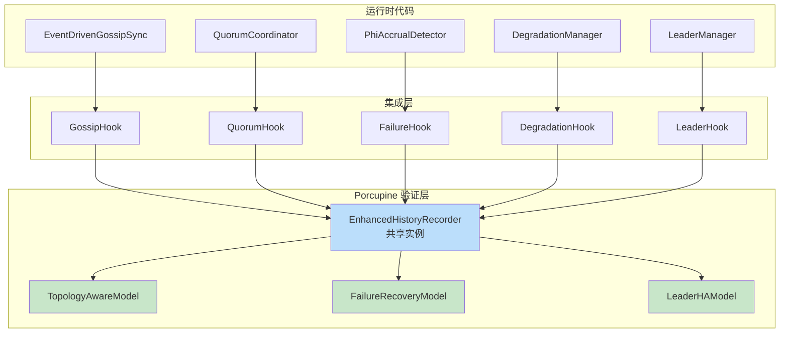
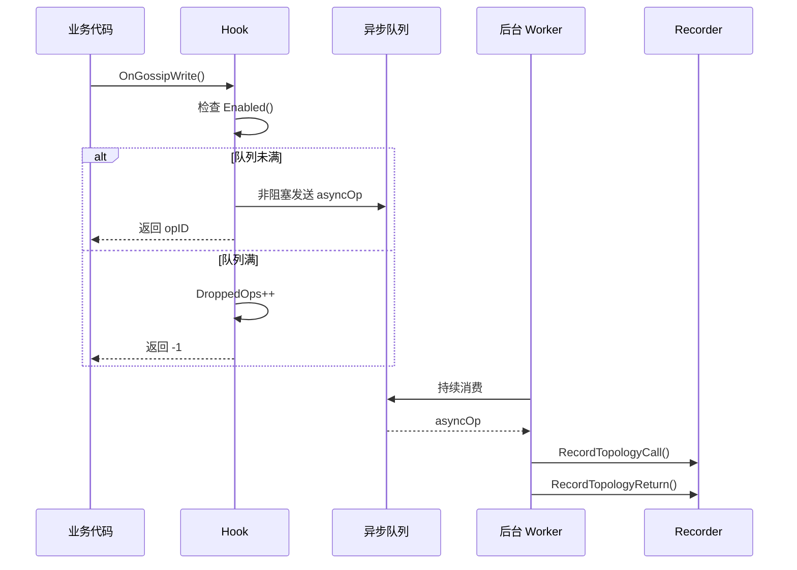

# PR-071 Pre 文档：Porcupine 运行时验证集成

## 📋 基本信息

| 项目 | 内容 |
|------|------|
| **PR 编号** | PR-071 |
| **PR 类型** | Feature |
| **分支名称** | feature/porcupine-runtime-integration |
| **关联 PR** | PR-070（Porcupine 增强模型） |
| **预计工期** | 4 天 |
| **开发者** | 🤖 核心开发 A |
| **创建日期** | 2026-02-14 |
| **状态** | 📝 待评审 |

---

## 1. 背景与目标

### 1.1 背景

PR-070 已完成 Porcupine 增强模型的实现，包括：
- **TopologyAwareModel** - 拓扑感知模型
- **FailureRecoveryModel** - 失败恢复模型
- **LeaderHAModel** - Leader HA 模型
- **EnhancedHistoryRecorder** - 增强记录器

但这些模型目前**仅在测试中使用**，未集成到实际运行时代码中。验证价值的实现需要：
1. 将记录器集成到实际操作路径中
2. 在关键操作点记录事件
3. 提供运行时验证能力

### 1.2 目标

将 Porcupine 增强模型集成到实际运行时代码中：

1. **Gossip 集成** - 在 Gossip 传播路径中记录操作
2. **Quorum 集成** - 在 Quorum 写入路径中记录操作
3. **故障检测集成** - 在 Phi Accrual 检测器中记录故障/恢复事件
4. **降级管理集成** - 在降级写入路径中记录操作
5. **Leader HA 集成** - 在 Leader 切换路径中记录操作

---

## 2. 技术设计

### 2.1 架构概览



> **关键设计决策**：所有 Hook 共享**同一个** `EnhancedHistoryRecorder` 实例，便于统一管理和验证。

### 2.2 集成点分析

| 模块 | 文件路径 | 集成点 | 模型类型 | 操作类型 |
|------|---------|--------|---------|---------|
| **Gossip** | `internal/metadata/gossip/event_driven.go` | `OnWrite()` | TopologyAware | `TopologyOpWriteGossip` |
| **Quorum** | `internal/metadata/quorum/coordinator.go` | `PutWithQuorum()` | TopologyAware | `TopologyOpWriteQuorum` |
| **故障检测** | `internal/metadata/fault/detector.go` | `IsNodeFailed()` | FailureRecovery | `FailureRecoveryOpNodeFail/NodeRecover` |
| **降级管理** | `internal/metadata/degradation/manager.go` | `writeWithDegradation()` | FailureRecovery | `FailureRecoveryOpQuorumWrite` |
| **Leader HA** | `internal/metadata/consistency/fencing.go` | `BecomeLeader()` | LeaderHA | `LeaderOpLeaderChange` |

### 2.3 文件结构

```
internal/metadata/consistency/porcupine/
├── enhanced_recorder.go       # ✅ 已实现（PR-070）
├── enhanced_recorder_test.go  # ✅ 已实现（PR-070）
├── hooks/
│   ├── interface.go           # 🆕 Hook 接口定义
│   ├── gossip_hook.go         # 🆕 Gossip 集成 Hook
│   ├── gossip_hook_test.go    # 🆕 Gossip Hook 测试
│   ├── quorum_hook.go         # 🆕 Quorum 集成 Hook
│   ├── quorum_hook_test.go    # 🆕 Quorum Hook 测试
│   ├── failure_hook.go        # 🆕 故障检测 Hook
│   ├── failure_hook_test.go   # 🆕 故障检测 Hook 测试
│   ├── degradation_hook.go    # 🆕 降级管理 Hook
│   ├── degradation_hook_test.go # 🆕 降级管理 Hook 测试
│   ├── leader_hook.go         # 🆕 Leader HA Hook
│   └── leader_hook_test.go    # 🆕 Leader HA Hook 测试
└── runtime/
    ├── config.go              # 🆕 验证配置（含默认值）
    ├── verifier.go            # 🆕 运行时验证器
    └── verifier_test.go       # 🆕 验证器测试
```

### 2.4 Hook 接口设计

```go
// VerificationHook 验证 Hook 接口
type VerificationHook interface {
    // Enabled 返回 Hook 是否启用
    Enabled() bool

    // SetEnabled 设置 Hook 启用状态
    SetEnabled(enabled bool)

    // Recorder 返回关联的记录器（共享实例）
    Recorder() *EnhancedHistoryRecorder

    // Stats 返回 Hook 统计信息
    Stats() HookStats

    // Flush 刷新待处理的操作（用于优雅关闭）
    Flush()
}

// HookStats Hook 统计信息
type HookStats struct {
    TotalRecorded  int64 // 总记录数
    TotalVerified  int64 // 总验证数
    TotalFailed    int64 // 总失败数
    TotalErrors    int64 // 总错误数（记录失败）
    DroppedOps     int64 // 丢弃的操作数（异步队列满）
    LastVerifyTime int64 // 最后验证时间
}
```

### 2.5 异步记录机制（P1-01 修复）

> **设计原则**：Hook 调用**不阻塞**关键路径，使用异步队列缓冲操作。

```go
// asyncOp 异步操作
type asyncOp struct {
    opType   string      // "topology", "failure", "leader"
    callOp   interface{} // Call 操作
    returnOp interface{} // Return 操作（可选，延迟填充）
    opID     int         // 操作 ID
}

// AsyncRecordConfig 异步记录配置
type AsyncRecordConfig struct {
    // Enabled 是否启用异步记录
    Enabled bool

    // BufferSize 异步队列大小（默认 10000）
    BufferSize int

    // DropOnFull 队列满时是否丢弃（true）或阻塞（false）
    // 推荐使用 true 避免阻塞关键路径
    DropOnFull bool
}

// DefaultAsyncRecordConfig 默认异步记录配置
func DefaultAsyncRecordConfig() AsyncRecordConfig {
    return AsyncRecordConfig{
        Enabled:    true,
        BufferSize: 10000,
        DropOnFull: true, // 关键：不阻塞业务
    }
}
```

**异步处理流程**：



### 2.6 各模块集成设计

#### 2.6.1 Gossip Hook（P0-02 修复：版本号策略）

```go
// GossipHook Gossip 验证 Hook
type GossipHook struct {
    mu          sync.RWMutex
    enabled     bool
    recorder    *EnhancedHistoryRecorder // 共享实例
    topology    *Topology
    asyncConfig AsyncRecordConfig
    opChan      chan asyncOp
    stats       HookStats
    wg          sync.WaitGroup
    ctx         context.Context
    cancel      context.CancelFunc
}

// VersionStrategy 版本号获取策略
type VersionStrategy int

const (
    // VersionStrategyTimestamp 使用时间戳作为版本号（默认）
    // 优点：简单，无需修改现有代码
    // 缺点：可能与实际存储版本不一致
    VersionStrategyTimestamp VersionStrategy = iota

    // VersionStrategyMVStore 从 MVStore 获取版本号
    // 优点：与实际存储一致
    // 缺点：需要额外读取开销
    VersionStrategyMVStore
)

// OnGossipWrite Gossip 写入时记录
// 集成点: EventDrivenGossipSync.OnWrite()
//
// 版本号策略（P0-02 修复）：
// - 使用 time.Now().UnixNano() 作为临时版本号
// - 原因：EventDrivenGossipSync.OnWrite() 不传递 Version 参数
// - 未来优化：扩展接口签名传递实际版本
func (h *GossipHook) OnGossipWrite(nodeID, key string, value []byte) (int, error) {
    if !h.Enabled() {
        return -1, nil
    }

    // 使用时间戳作为版本号（P0-02 修复）
    version := uint64(time.Now().UnixNano())

    op := TopologyOperation{
        Type:    TopologyOpWriteGossip,
        NodeID:  nodeID,
        Key:     key,
        Value:   value,
        Version: version,
    }

    return h.enqueueOp("topology", op)
}

// OnGossipReturn Gossip 返回时记录
func (h *GossipHook) OnGossipReturn(opID int, ok bool, errMsg string) {
    if !h.Enabled() || opID < 0 {
        return
    }

    output := TopologyOutput{
        Ok:    ok,
        Error: errMsg,
    }

    h.enqueueReturn("topology", opID, output)
}
```

#### 2.6.2 Quorum Hook

```go
// QuorumHook Quorum 验证 Hook
type QuorumHook struct {
    mu          sync.RWMutex
    enabled     bool
    recorder    *EnhancedHistoryRecorder // 共享实例
    asyncConfig AsyncRecordConfig
    opChan      chan asyncOp
    stats       HookStats
    // ... 生命周期管理字段
}

// OnQuorumWrite Quorum 写入时记录
// 集成点: QuorumCoordinator.PutWithQuorum()
func (h *QuorumHook) OnQuorumWrite(nodeID, key string, value []byte, participants []string) (int, error) {
    if !h.Enabled() {
        return -1, nil
    }

    // 使用时间戳作为版本号
    version := uint64(time.Now().UnixNano())

    op := TopologyOperation{
        Type:         TopologyOpWriteQuorum,
        NodeID:       nodeID,
        Key:          key,
        Value:        value,
        Version:      version,
        Participants: participants,
    }

    return h.enqueueOp("topology", op)
}

// OnQuorumReturn Quorum 返回时记录
func (h *QuorumHook) OnQuorumReturn(opID int, ok bool, errMsg string) {
    // ...
}
```

#### 2.6.3 Failure Hook（P0-01 修复：移除 Heartbeat）

> **重要修改**：移除 `OnHeartbeat()`，因为 `FailureRecoveryModel` 不支持心跳类型。
> 只记录**故障判定事件**（`OnNodeFailure`/`OnNodeRecovery`）。

```go
// FailureHook 故障检测验证 Hook
type FailureHook struct {
    mu          sync.RWMutex
    enabled     bool
    recorder    *EnhancedHistoryRecorder // 共享实例
    asyncConfig AsyncRecordConfig
    opChan      chan asyncOp
    stats       HookStats
    // ... 生命周期管理字段
}

// OnNodeFailure 节点故障记录
// 集成点: PhiAccrualDetector.IsNodeFailed() 返回 true 时调用
//
// 设计说明（P0-01 修复）：
// - 不记录每次心跳（高频操作，会产生大量噪音）
// - 只在故障判定时记录（真正需要验证的事件）
// - FailureRecoveryModel 支持 FailureRecoveryOpNodeFail 类型
func (h *FailureHook) OnNodeFailure(nodeID string) (int, error) {
    if !h.Enabled() {
        return -1, nil
    }

    op := FailureRecoveryOperation{
        Type:   FailureRecoveryOpNodeFail, // 正确的枚举值
        NodeID: nodeID,
    }

    return h.enqueueOp("failure", op)
}

// OnNodeRecovery 节点恢复记录
// 集成点: PhiAccrualDetector.Reset() 时调用
func (h *FailureHook) OnNodeRecovery(nodeID string) (int, error) {
    if !h.Enabled() {
        return -1, nil
    }

    op := FailureRecoveryOperation{
        Type:   FailureRecoveryOpNodeRecover, // 正确的枚举值
        NodeID: nodeID,
    }

    return h.enqueueOp("failure", op)
}
```

#### 2.6.4 Degradation Hook（P0-03 修复：类型映射）

```go
// DegradationHook 降级管理验证 Hook
type DegradationHook struct {
    mu          sync.RWMutex
    enabled     bool
    recorder    *EnhancedHistoryRecorder // 共享实例
    asyncConfig AsyncRecordConfig
    opChan      chan asyncOp
    stats       HookStats
    // ... 生命周期管理字段
}

// OnDegradedWrite 降级写入记录
// 集成点: Manager.writeWithDegradation()
//
// 类型映射（P0-03 修复）：
// - 使用 FailureRecoveryOpQuorumWrite（正确的枚举值）
// - 通过 Output.Error 字段标记降级状态
func (h *DegradationHook) OnDegradedWrite(nodeID, key string, value []byte) (int, error) {
    if !h.Enabled() {
        return -1, nil
    }

    // 使用时间戳作为版本号
    version := uint64(time.Now().UnixNano())

    op := FailureRecoveryOperation{
        Type:    FailureRecoveryOpQuorumWrite, // 修复：使用正确的枚举值
        NodeID:  nodeID,
        Key:     key,
        Value:   value,
        Version: version,
    }

    return h.enqueueOp("failure", op)
}

// OnDegradedReturn 降级写入返回
// 通过 Error 字段标记降级状态
func (h *DegradationHook) OnDegradedReturn(opID int, ok bool, degraded bool) {
    if !h.Enabled() || opID < 0 {
        return
    }

    output := FailureRecoveryOutput{
        Ok:    ok,
        Error: "", // 正常时为空
    }
    if degraded {
        output.Error = "degraded" // 通过 Error 标记降级状态
    }

    h.enqueueReturn("failure", opID, output)
}
```

#### 2.6.5 Leader Hook

```go
// LeaderHook Leader HA 验证 Hook
type LeaderHook struct {
    mu          sync.RWMutex
    enabled     bool
    recorder    *EnhancedHistoryRecorder // 共享实例
    asyncConfig AsyncRecordConfig
    opChan      chan asyncOp
    stats       HookStats
    // ... 生命周期管理字段
}

// OnLeaderChange Leader 变更记录
// 集成点: LeaderManager.BecomeLeader()
func (h *LeaderHook) OnLeaderChange(oldLeader, newLeader string, newTerm uint64) (int, error) {
    if !h.Enabled() {
        return -1, nil
    }

    op := LeaderHAOperation{
        Type:      LeaderOpLeaderChange,
        OldLeader: oldLeader,
        NewLeader: newLeader,
        NewTerm:   newTerm,
    }

    return h.enqueueOp("leader", op)
}

// OnLeaderChangeReturn Leader 变更返回
func (h *LeaderHook) OnLeaderChangeReturn(opID int, ok bool, errMsg string) {
    // ...
}

// OnFencingWrite Fencing Token 写入记录
// 集成点: FencingStore.Write()
func (h *LeaderHook) OnFencingWrite(nodeID, key string, value []byte, term uint64) (int, error) {
    if !h.Enabled() {
        return -1, nil
    }

    op := LeaderHAOperation{
        Type:      LeaderOpWrite,
        NodeID:    nodeID,
        Key:       key,
        Value:     value,
        WriteTerm: term,
    }

    return h.enqueueOp("leader", op)
}
```

### 2.7 运行时验证器（P1-02/P1-03/P1-04 修复）

```go
// RuntimeVerifier 运行时验证器
type RuntimeVerifier struct {
    mu            sync.RWMutex
    config        VerifierConfig
    recorder      *EnhancedHistoryRecorder // 共享的 recorder 实例

    // 各模块 Hook（共享 recorder）
    gossipHook      *GossipHook
    quorumHook      *QuorumHook
    failureHook     *FailureHook
    degradationHook *DegradationHook
    leaderHook      *LeaderHook

    // 验证结果缓存
    lastResult    *VerificationResult
    resultHistory []VerificationResult

    // 生命周期管理（P1-04 修复）
    ctx    context.Context
    cancel context.CancelFunc
    wg     sync.WaitGroup
}

// VerifierConfig 验证器配置（含默认值，P2-03 修复）
type VerifierConfig struct {
    // 是否启用验证
    Enabled bool

    // 验证间隔（0 表示禁用周期验证，默认 5 分钟）
    VerifyInterval time.Duration

    // 历史记录保留数量（默认 100）
    HistorySize int

    // 验证超时时间（默认 1 分钟）
    VerifyTimeout time.Duration

    // 每个 recorder 最大操作数（P1-03 修复，默认 10000）
    MaxOpsPerRecorder int

    // 异步记录配置
    AsyncConfig AsyncRecordConfig

    // 各模块 Hook 开关
    GossipEnabled      bool
    QuorumEnabled      bool
    FailureEnabled     bool
    DegradationEnabled bool
    LeaderEnabled      bool
}

// DefaultVerifierConfig 默认验证器配置
func DefaultVerifierConfig() VerifierConfig {
    return VerifierConfig{
        Enabled:            false,              // 默认禁用
        VerifyInterval:     5 * time.Minute,    // 5 分钟周期验证
        HistorySize:        100,                // 保留 100 次验证结果
        VerifyTimeout:      time.Minute,        // 1 分钟超时
        MaxOpsPerRecorder:  10000,              // 最多 1 万操作
        AsyncConfig:        DefaultAsyncRecordConfig(),
        GossipEnabled:      true,
        QuorumEnabled:      true,
        FailureEnabled:     true,
        DegradationEnabled: true,
        LeaderEnabled:      true,
    }
}

// VerificationResult 验证结果
type VerificationResult struct {
    Timestamp    time.Time
    TopologyPass bool
    FailurePass  bool
    LeaderHAPass bool
    TopologyMsg  string
    FailureMsg   string
    LeaderHAMsg  string
    TotalOps     int
    Duration     time.Duration
}

// NewRuntimeVerifier 创建运行时验证器
func NewRuntimeVerifier(config VerifierConfig) *RuntimeVerifier {
    ctx, cancel := context.WithCancel(context.Background())

    // 创建共享的 recorder（P1-02 修复）
    recorder := NewEnhancedHistoryRecorder("verifier", DefaultTimestampGenerator())

    v := &RuntimeVerifier{
        config:        config,
        recorder:      recorder,
        ctx:           ctx,
        cancel:        cancel,
        resultHistory: make([]VerificationResult, 0, config.HistorySize),
    }

    // 初始化各 Hook（共享 recorder）
    v.gossipHook = NewGossipHook(recorder, config.AsyncConfig)
    v.quorumHook = NewQuorumHook(recorder, config.AsyncConfig)
    v.failureHook = NewFailureHook(recorder, config.AsyncConfig)
    v.degradationHook = NewDegradationHook(recorder, config.AsyncConfig)
    v.leaderHook = NewLeaderHook(recorder, config.AsyncConfig)

    return v
}

// Verify 执行验证（P1-02 修复：使用共享 recorder）
func (v *RuntimeVerifier) Verify() *VerificationResult {
    v.mu.Lock()
    defer v.mu.Unlock()

    start := time.Now()
    result := &VerificationResult{
        Timestamp: start,
    }

    // 从共享 recorder 获取操作并分类
    topologyOps := v.recorder.GetTopologyOperations()
    failureOps := v.recorder.GetFailureRecoveryOperations()
    leaderOps := v.recorder.GetLeaderHAOperations()

    // 验证拓扑感知（使用共享 recorder 的拓扑操作）
    if len(topologyOps) > 0 {
        result.TopologyPass, result.TopologyMsg = VerifyTopology(v.recorder)
    } else {
        result.TopologyPass, result.TopologyMsg = true, "no topology operations"
    }

    // 验证失败恢复（使用共享 recorder 的失败恢复操作）
    if len(failureOps) > 0 {
        result.FailurePass, result.FailureMsg = VerifyFailureRecovery(v.recorder)
    } else {
        result.FailurePass, result.FailureMsg = true, "no failure operations"
    }

    // 验证 Leader HA（使用共享 recorder 的 Leader HA 操作）
    if len(leaderOps) > 0 {
        result.LeaderHAPass, result.LeaderHAMsg = VerifyLeaderHA(v.recorder)
    } else {
        result.LeaderHAPass, result.LeaderHAMsg = true, "no leader HA operations"
    }

    // 计算总操作数
    result.TotalOps = len(topologyOps) + len(failureOps) + len(leaderOps)
    result.Duration = time.Since(start)

    // 更新历史
    v.lastResult = result
    v.resultHistory = append(v.resultHistory, *result)
    if len(v.resultHistory) > v.config.HistorySize {
        v.resultHistory = v.resultHistory[1:]
    }

    // 内存控制（P1-03 修复）
    v.trimRecorderHistory()

    return result
}

// trimRecorderHistory 清理 recorder 历史（P1-03 修复）
func (v *RuntimeVerifier) trimRecorderHistory() {
    if v.config.MaxOpsPerRecorder > 0 && v.recorder.Len() > v.config.MaxOpsPerRecorder {
        v.recorder.Trim(v.config.MaxOpsPerRecorder)
    }
}

// VerifyOnCriticalEvent 关键事件后立即验证（P2-05 建议）
func (v *RuntimeVerifier) VerifyOnCriticalEvent(event string) *VerificationResult {
    // Leader 变更、Quorum 失败等关键事件后立即验证
    return v.Verify()
}

// Start 启动验证器（包含生命周期管理，P1-04 修复）
func (v *RuntimeVerifier) Start() {
    if v.config.VerifyInterval <= 0 {
        return
    }

    v.wg.Add(1)
    go func() {
        defer v.wg.Done()

        ticker := time.NewTicker(v.config.VerifyInterval)
        defer ticker.Stop()

        for {
            select {
            case <-v.ctx.Done():
                return
            case <-ticker.C:
                v.Verify()
            }
        }
    }()
}

// Stop 停止验证器（P1-04 修复）
func (v *RuntimeVerifier) Stop() {
    // 1. 停止周期验证
    if v.cancel != nil {
        v.cancel()
    }

    // 2. 等待所有 goroutine 退出
    v.wg.Wait()

    // 3. 刷新所有 Hook 的待处理操作
    if v.gossipHook != nil {
        v.gossipHook.Flush()
    }
    if v.quorumHook != nil {
        v.quorumHook.Flush()
    }
    if v.failureHook != nil {
        v.failureHook.Flush()
    }
    if v.degradationHook != nil {
        v.degradationHook.Flush()
    }
    if v.leaderHook != nil {
        v.leaderHook.Flush()
    }
}

// GetLastResult 获取最近验证结果
func (v *RuntimeVerifier) GetLastResult() *VerificationResult {
    v.mu.RLock()
    defer v.mu.RUnlock()
    return v.lastResult
}

// Hooks 返回各模块 Hook（用于注入到运行时组件）
func (v *RuntimeVerifier) Hooks() (gossip *GossipHook, quorum *QuorumHook, failure *FailureHook, degradation *DegradationHook, leader *LeaderHook) {
    return v.gossipHook, v.quorumHook, v.failureHook, v.degradationHook, v.leaderHook
}
```

### 2.8 EnhancedHistoryRecorder 扩展（P1-03 修复）

需要在 PR-070 的 `EnhancedHistoryRecorder` 中添加以下方法：

```go
// Trim 修剪历史记录（P1-03 修复）
// 保留最近的 maxOps 个操作
func (r *EnhancedHistoryRecorder) Trim(maxOps int) {
    r.mu.Lock()
    defer r.mu.Unlock()

    if len(r.ops) > maxOps {
        // 保留最近的操作
        r.ops = r.ops[len(r.ops)-maxOps:]
    }
}

// Flush 刷新待处理的操作（P1-06 修复：正确构造联合类型）
func (r *EnhancedHistoryRecorder) Flush() {
    r.mu.Lock()
    defer r.mu.Unlock()

    // 将所有 pending 操作标记为超时
    for opID, pending := range r.pending {
        // 根据操作类型构造对应的 EnhancedOutput（联合类型）
        var output EnhancedOutput
        switch pending.input.Type {
        case OpTypeTopology:
            output = EnhancedOutput{
                Type: OpTypeTopology,
                TopologyOut: TopologyOutput{
                    Ok:    false,
                    Error: "timeout",
                },
            }
        case OpTypeFailureRecovery:
            output = EnhancedOutput{
                Type: OpTypeFailureRecovery,
                FailureRecoveryOut: FailureRecoveryOutput{
                    Ok:    false,
                    Error: "timeout",
                },
            }
        case OpTypeLeaderHA:
            output = EnhancedOutput{
                Type: OpTypeLeaderHA,
                LeaderHAOut: LeaderHAOutput{
                    Ok:    false,
                    Error: "timeout",
                },
            }
        default:
            // 未知类型，跳过
            continue
        }

        r.ops = append(r.ops, porcupine.Operation{
            ClientId: r.clientID,
            Input:    pending.input,
            Output:   output,
            Call:     pending.call,
            Return:   r.timestamp.Now(),
        })
        delete(r.pending, opID)
    }
}
```

---

## 3. 测试计划

### 3.1 单元测试

| 测试文件 | 测试内容 | 覆盖目标 |
|---------|---------|---------|
| `gossip_hook_test.go` | Gossip 写入记录、返回记录、统计、异步队列 | 80%+ |
| `quorum_hook_test.go` | Quorum 写入记录、返回记录、统计 | 80%+ |
| `failure_hook_test.go` | 节点故障/恢复记录（不含心跳） | 80%+ |
| `degradation_hook_test.go` | 降级写入记录、类型映射 | 80%+ |
| `leader_hook_test.go` | Leader 变更记录、Fencing 写入 | 80%+ |
| `verifier_test.go` | 验证执行、生命周期、内存控制 | 80%+ |

### 3.2 集成测试（P2-02 扩展）

```go
// TestGossipHook_Integration Gossip Hook 集成测试
// 场景：实际 EventDrivenGossipSync 中触发写入，验证记录正确

// TestQuorumHook_Integration Quorum Hook 集成测试
// 场景：实际 QuorumCoordinator.PutWithQuorum() 中触发写入

// TestFailureHook_Integration Failure Hook 集成测试
// 场景：模拟节点故障判定，验证 OnNodeFailure/OnNodeRecovery

// TestLeaderHook_Integration Leader Hook 集成测试
// 场景：模拟 Leader 切换，验证 Term 单调性

// TestRuntimeVerifier_FullVerification 全量验证测试
// 场景：所有 Hook 启用，执行完整验证流程

// TestHook_EnableDisable Hook 动态开关测试（P2-02 新增）
// 场景：运行时动态启用/禁用 Hook

// TestHook_HighLoadAsync 高负载异步测试（P2-02 新增）
// 场景：队列满时丢弃行为验证

// TestRuntimeVerifier_Lifecycle 生命周期测试（P2-02 新增）
// 场景：Start/Stop 优雅关闭

// TestHook_ConcurrentAccess 并发访问测试（P2-02 新增）
// 场景：多 goroutine 并发记录
```

### 3.3 性能测试（P2-01 具体化）

**测试环境**：
- 3 节点集群，1000 次 Gossip 写入/秒
- 测试时长：5 分钟
- 基准：无 Hook 情况下的 P99 延迟

| 测试场景 | 基准 P99 | 目标 P99 | 验收标准 |
|---------|---------|---------|---------|
| Hook 禁用 | 10ms | < 10.1ms | 延迟增加 < 1% (绝对值 < 0.1ms) |
| Hook 启用（不验证） | 10ms | < 10.5ms | 延迟增加 < 5% (绝对值 < 0.5ms) |
| Hook 启用 + 周期验证 | 10ms | < 11ms | 延迟增加 < 10% |
| 1000 ops 验证 | - | < 100ms | 验证延迟 < 100ms |

---

## 4. 风险评估

### 4.1 技术风险

| 风险 | 级别 | 缓解措施 |
|------|------|---------|
| **性能影响** | 🟡 中 | Hook 默认禁用，异步记录（DropOnFull=true），不阻塞关键路径 |
| **内存占用** | 🟢 低 | MaxOpsPerRecorder 限制 + 定期 Trim() |
| **并发安全** | 🟢 低 | 使用 sync.RWMutex，Hook 内部无阻塞操作 |
| **集成复杂度** | 🟢 低 | 组合模式，最小侵入，共享 recorder |
| **版本号不一致** | 🟡 中 | 使用时间戳作为临时版本，未来可扩展接口 |

### 4.2 依赖风险

| 依赖 | 版本 | 风险 | 说明 |
|------|------|------|------|
| porcupine | v1.1.0 | 🟢 低 | 已在项目中使用 |
| EnhancedHistoryRecorder | PR-070 | 🟡 低 | 需扩展 Trim/Flush 方法 |

---

## 5. 实施计划

### 5.1 里程碑

| 里程碑 | 预计完成 | 交付物 |
|--------|---------|--------|
| **M1: 框架 + 配置** | Day 1 中 | `interface.go` + `config.go` + 异步队列 |
| **M2: Gossip/Quorum Hook** | Day 1 晚 | `gossip_hook.go` + `quorum_hook.go` + 测试 |
| **M3: Failure/Degradation Hook** | Day 2 中 | `failure_hook.go` + `degradation_hook.go` + 测试 |
| **M4: Leader Hook** | Day 2 晚 | `leader_hook.go` + 测试 |
| **M5: 验证器 + 生命周期** | Day 3 中 | `verifier.go` + Trim/Flush 扩展 |
| **M6: 集成测试** | Day 3 晚 | 所有集成测试通过 |
| **M7: 文档完成** | Day 4 | Post 文档 + README 更新 |

### 5.2 工期分解

| 任务 | 工时 | 说明 |
|------|------|------|
| Hook 接口 + 配置 + 异步队列 | 3h | `interface.go` + `config.go` |
| Gossip Hook 实现 | 2h | `gossip_hook.go` + 测试 |
| Quorum Hook 实现 | 2h | `quorum_hook.go` + 测试 |
| Failure Hook 实现 | 2h | `failure_hook.go` + 测试 |
| Degradation Hook 实现 | 2h | `degradation_hook.go` + 测试 |
| Leader Hook 实现 | 2h | `leader_hook.go` + 测试 |
| 验证器 + 生命周期 | 3h | `verifier.go` + Trim/Flush |
| 集成测试 | 3h | 9 个集成测试 |
| 性能测试 | 2h | 基准测试 + 验收 |
| 文档 | 2h | Post 文档 + README |

**总计**：23 小时 ≈ **4 天**

---

## 6. 验收标准

### 6.1 功能验收

**Hook 功能**：
- [ ] 所有 Hook 实现完整
- [ ] Hook 可动态启用/禁用
- [ ] 异步记录队列正常工作
- [ ] Hook 统计信息正确
- [ ] Flush() 正确处理 pending 操作

**验证功能**：
- [ ] `RuntimeVerifier.Verify()` 正确执行验证
- [ ] 验证结果正确记录到历史
- [ ] 周期验证可启动/停止
- [ ] `Stop()` 优雅关闭所有 goroutine

**集成功能**：
- [ ] Gossip 写入正确触发 Hook
- [ ] Quorum 写入正确触发 Hook
- [ ] 节点故障/恢复正确触发 Hook
- [ ] 降级写入正确触发 Hook
- [ ] Leader 变更正确触发 Hook

### 6.2 质量验收

- [ ] 所有新增代码测试覆盖率 > 80%
- [ ] `make build` 通过
- [ ] `make lint` 通过
- [ ] `make test` 通过
- [ ] `make test-race` 通过

### 6.3 性能验收

- [ ] Hook 禁用时：P99 延迟增加 < 1% (绝对值 < 0.1ms)
- [ ] Hook 启用（不验证）：P99 延迟增加 < 5% (绝对值 < 0.5ms)
- [ ] 1000 ops 验证延迟 < 100ms
- [ ] 内存占用稳定（MaxOpsPerRecorder 限制生效）

### 6.4 文档验收

- [ ] Post 文档记录实现细节
- [ ] README.md 更新，包含验证使用说明

---

## 7. 附录

### 7.1 参考文档

- [PR-070 Pre 文档](./2026-02-14_PR-070_Porcupine-Enhanced-Models_Pre.md)
- [Porcupine 运行时验证 Spike](../../07_spike/2026-02-14_porcupine-runtime-verification.md)
- [EnhancedHistoryRecorder 设计](../../07_spike/2026-02-14_porcupine-enhanced-models.md)

### 7.2 相关 PR

- PR-070: Porcupine 增强模型（已完成）
- PR-068: Phase 2 核心功能（已完成）

---

**文档版本**: v2.1（第二轮三 Agent 评审后修订）
**创建日期**: 2026-02-14
**最后更新**: 2026-02-14
**维护者**: 🤖 核心开发 A
**状态**: ✅ 评审通过

---

## 8. 评审修订记录

### v2.1 修订内容（2026-02-14）

| 问题编号 | 来源 | 问题描述 | 修订内容 |
|---------|------|---------|---------|
| **P1-06** | Agent 3 | `Flush()` 中 `EnhancedOutput{Error: "timeout"}` 语法错误 | 根据 `pending.input.Type` 分别构造对应的联合类型 Output |

### v2.0 修订内容（2026-02-14）

| 问题编号 | 来源 | 问题描述 | 修订内容 |
|---------|------|---------|---------|
| **P0-01** | Agent 3 | Heartbeat 不被 FailureRecoveryModel 支持 | 移除 `OnHeartbeat()`，只保留 `OnNodeFailure/OnNodeRecover` |
| **P0-02** | Agent 3 | GossipWrite 缺少 Version 参数 | 添加版本号策略：使用 `time.Now().UnixNano()` |
| **P0-03** | Agent 3 | DegradedWrite 类型映射错误 | 使用 `FailureRecoveryOpQuorumWrite`，通过 `Error` 字段标记降级 |
| **P1-01** | Agent 1 | 异步记录机制缺失详细设计 | 添加 2.5 节异步记录机制设计，包含 `AsyncRecordConfig` |
| **P1-02** | Agent 1 | RuntimeVerifier 共享 recorder 问题 | 所有 Hook 共享同一个 `EnhancedHistoryRecorder` 实例 |
| **P1-03** | Agent 1 | 内存占用控制策略缺失 | 添加 `MaxOpsPerRecorder` 配置 + `Trim()` 方法 |
| **P1-04** | Agent 1 | Hook 生命周期管理缺失 | 添加 `Start()/Stop()` 方法 + `Flush()` 处理 pending |
| **P1-05** | Agent 2 | 版本号缺失问题 | 使用时间戳作为临时版本号 |
| **P2-01** | Agent 1 | 验收标准不够具体 | 添加具体性能测试环境和验收指标 |
| **P2-02** | Agent 1 | 集成测试覆盖不足 | 新增 4 个集成测试场景 |
| **P2-03** | Agent 1 | 配置参数缺少默认值 | 添加 `DefaultVerifierConfig()` |
| **P2-05** | Agent 3 | 验证时机不够细化 | 添加 `VerifyOnCriticalEvent()` 方法 |
| **工期** | Agent 1 | 3 天可能不足 | 调整为 4 天（23 小时） |
