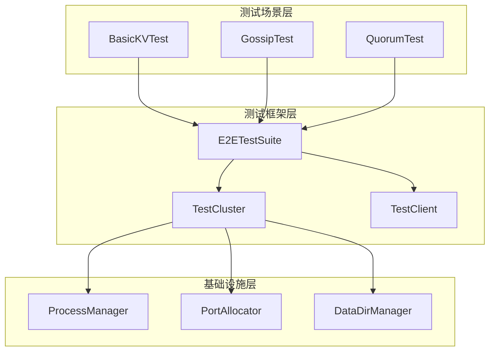

# 【PR全流程文档】Feature - E2E 测试框架

> **文档说明**：本文档包含「前置规划」和「后置总结」两部分，记录从需求对齐到开发完成的全流程，一个PR对应一份全流程文档，归档后作为项目追溯依据。

---

## 第一部分：前置部分（开工前必完成，架构师评审通过）

### 1. 基础信息（与分支/PR绑定）

| 项目 | 内容 |
|------|------|
| 工作类型 | 新功能开发（Feature） |
| PR编号 | PR-072（待创建GitHub PR后确认） |
| 分支名称 | feature/e2e-testing-framework |
| 工作主题 | E2E 测试框架 - 真实进程级别测试基础设施 |
| 负责人 | AI Agent (Core Developer A) |
| 分支创建日期 | 2026-02-15 |
| 计划开工日期 | 2026-02-15 |
| 计划CI通过日期 | 2026-02-19 |
| 关联需求单号 | Spike: `docs/07_spike/2026-02-15_e2e-porcupine-integration.md` |
| 架构师评审状态 | □ 待评审 |
| 预审批结果 | □ 未通过 |

### 2. 背景与目标（为什么干）

#### 2.1 背景

- **业务场景**：NexKV 作为分布式 KV 存储系统，需要验证真实多进程环境下的一致性保证
- **现有问题**：
  1. 当前集成测试使用 mock 组件，无法验证真实网络通信
  2. Porcupine 验证系统完整但未集成到生产代码
  3. 缺少故障注入能力，无法验证故障恢复逻辑
  4. CI 流程缺少真实进程级别的验证
- **价值**：
  1. 提供真实进程级别的测试能力
  2. 支持多节点集群测试
  3. 集成 Porcupine 一致性验证（可选）
  4. 为后续性能测试和故障注入奠定基础

#### 2.2 核心目标（可量化、可验证）

1. **功能目标**：
   - 实现进程管理器（启动、停止、健康检查）
   - 实现端口分配器（OS 动态分配，避免冲突）
   - 实现数据目录管理器（测试隔离）
   - 实现集群管理器（多节点配置）
   - 实现测试客户端（KV 操作封装）
   
2. **质量目标**：
   - 所有新增代码测试覆盖率 ≥ 80%
   - 支持 `make test-e2e-short` 快速验证
   - 支持 `make test-e2e` 完整测试

3. **可用性目标**：
   - 测试框架可独立运行，不依赖 Porcupine
   - 支持并行测试（可选）
   - 自动清理资源

#### 2.3 明确边界（不做什么，避免范围蔓延）

- **本次不支持**：
  1. Porcupine 一致性验证集成（阶段 3）
  2. 故障注入测试（阶段 4）
  3. 性能基准测试
  4. CI 集成配置
  
- **本次不优化**：
  1. 现有集成测试代码
  2. nexkvd 主进程代码
  3. RPC 客户端性能

### 3. 实现方案（怎么干，核心设计）

#### 3.1 整体架构



#### 3.2 核心组件设计

**1. ProcessManager（进程管理器）**
```go
type ProcessManager struct {
    processes map[string]*ManagedProcess
    logger    *log.Logger
    mu        sync.RWMutex
}

// 关键方法
func (pm *ProcessManager) Start(config ProcessConfig) error
func (pm *ProcessManager) Stop(ctx context.Context, id string) error
func (pm *ProcessManager) StopAll(ctx context.Context) error
func (pm *ProcessManager) Status(id string) ProcessStatus
```

**2. PortAllocator（端口分配器）**
```go
type PortAllocator struct {
    mu        sync.RWMutex
    allocated map[int]string
}

// 使用 OS 动态分配（:0），避免端口冲突
func (pa *PortAllocator) AllocatePort(testID string) (int, error)
func (pa *PortAllocator) ReleasePort(port int)
```

**3. DataDirManager（数据目录管理器）**
```go
type DataDirManager struct {
    baseDir     string
    testDirs    map[string]string
    mu          sync.RWMutex
}

// 每个测试独立目录，支持自动清理
func (dm *DataDirManager) CreateTestDir(testID string) (string, error)
func (dm *DataDirManager) CleanupTestDir(testID string) error
func (dm *DataDirManager) CleanupAll() error
```

#### 3.3 目录结构

```
test/e2e/
├── suite.go           # 基础测试套件
├── cluster.go         # 集群管理器
├── client.go          # 测试客户端
├── process.go         # 进程管理器
├── port.go            # 端口分配器
├── data_dir.go        # 数据目录管理
├── *_test.go          # 各组件测试
├── fixtures/
│   └── config.yaml    # 测试配置模板
├── scenarios/
│   └── basic_kv_test.go
└── utils/
    ├── retry.go
    └── wait.go
```

#### 3.4 分阶段实施

| 阶段 | 任务 | 工作量 | 交付物 |
|------|------|--------|--------|
| **阶段 1** | 基础框架 | 8h | port.go, data_dir.go, process.go, suite.go |
| **阶段 2** | 集群管理 | 6h | cluster.go, client.go, basic_kv_test.go |
| **阶段 3** | Porcupine 集成 | 6h | verifier_client.go（可选） |
| **阶段 4** | CI 集成 | 8h | GitHub Actions（可选） |
| **总计** | | **28h** | |

### 4. 风险评估与应对措施

| 风险点 | 影响等级 | 应对措施 |
|--------|----------|----------|
| **端口冲突** | 低 | 使用 OS 动态分配（net.Listen(":0")） |
| **进程残留** | 中 | 进程组管理（Setpgid）+ 清理脚本 |
| **数据残留** | 低 | 自动清理 + 定期检查 |
| **测试不稳定** | 中 | 重试机制 + 超时配置 |
| **CI 权限** | 低 | 阶段 1-2 不需要特殊权限 |

### 5. 架构师评审记录（循环优化，直至通过）

| 评审轮次 | 评审日期 | 评审人 | 核心评审意见 | 优化措施 | 优化结果 |
|----------|----------|--------|--------------|----------|----------|
| 第1轮 | - | - | 待评审 | - | - |

### 6. 预审批确认

> **架构师签字/备注**：[待架构师评审通过后填写]

---

## 第二部分：流程节点记录（开发/CI过程追溯）

### 1. 开发过程记录

| 节点 | 完成日期 | 具体内容 | 交付物 |
|------|----------|----------|--------|
| 启动开发 | 2026-02-15 | 创建分支，编写 Pre 文档 | 本文档 |
| Task 1 | - | 创建目录结构 | test/e2e/ |
| Task 2 | - | 实现端口分配器 | port.go |
| Task 3 | - | 实现数据目录管理器 | data_dir.go |
| Task 4 | - | 实现进程管理器 | process.go |
| Task 5 | - | 实现基础测试套件 | suite.go |
| Task 6 | - | 实现集群管理器 | cluster.go |
| Task 7 | - | 实现测试客户端 | client.go |
| Post文档编写 | - | - | - |
| 架构师Post批准 | - | - | - |
| 提交GitHub | - | - | - |

### 2. CI流程记录（修复Bug直至通过）

| CI轮次 | 触发时间 | 结果 | 问题详情 | 修复措施 | 修复结果 |
|--------|----------|------|----------|----------|----------|
| - | - | - | - | - | - |

### 3. 合并记录

| 合并时间 | 合并方式 | 审批人 | 备注 |
|----------|----------|--------|------|
| - | - | - | - |

---

## 第三部分：后置部分（CI通过后编写，总结/成果/ToDo）

> **待 CI 通过后补充**

### 1. 核心成果总结

#### 1.1 功能成果
- **已完成**：[待补充]
- **与Pre文档差异**：[待补充]

#### 1.2 测试成果
- **测试覆盖率**：[待补充]
- **测试结果**：[待补充]

### 2. 未完成项与ToDo清单

#### 2.1 本次PR未完成项
- [待补充]

#### 2.2 ToDo清单

| 优先级 | 任务内容 | 预估工期 | 关联PR | 备注 |
|--------|----------|----------|--------|------|
| P1 | Porcupine 集成 | 6h | 阶段 3 | 可选 |
| P2 | 故障注入测试 | 4h | 阶段 4 | 可选 |
| P2 | CI 集成 | 4h | 阶段 4 | 可选 |

---

## 文档归档信息

| 项目 | 内容 |
|------|------|
| 文档当前版本 | V1.0 (Pre) |
| 创建日期 | 2026-02-15 |
| 归档路径 | `docs/06_PM/feature/2026-02-15_PR-072_E2E-Testing-Framework_Pre.md` |
| Spike 参考 | `docs/07_spike/2026-02-15_e2e-test-framework-roadmap.md` |
