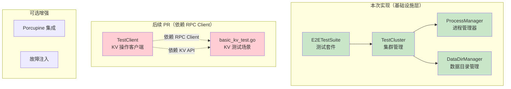

# 【PR全流程文档】Feature - E2E 测试框架

> **文档说明**：本文档包含「前置规划」和「后置总结」两部分，记录从需求对齐到开发完成的全流程，一个PR对应一份全流程文档，归档后作为项目追溯依据。

---

## 第一部分：前置部分（开工前必完成，架构师评审通过）

### 1. 基础信息（与分支/PR绑定）

| 项目 | 内容 |
|------|------|
| 工作类型 | 新功能开发（Feature） |
| PR编号 | PR-072（待创建GitHub PR后确认） |
| 分支名称 | feature/e2e-testing-framework |
| 工作主题 | E2E 测试框架 - 真实进程级别测试基础设施（阶段 1） |
| 负责人 | AI Agent (Core Developer A) |
| 分支创建日期 | 2026-02-15 |
| 计划开工日期 | 2026-02-15 |
| 计划CI通过日期 | 2026-02-18 |
| 关联需求单号 | Spike: `docs/07_spike/2026-02-15_e2e-porcupine-integration.md` |
| 架构师评审状态 | □ 待评审（第 2 轮） |
| 预审批结果 | □ 未通过 |

### 2. 背景与目标（为什么干）

#### 2.1 背景

- **业务场景**：NexKV 作为分布式 KV 存储系统，需要验证真实多进程环境下的一致性保证
- **现有问题**：
  1. 当前集成测试使用 mock 组件，无法验证真实网络通信
  2. Porcupine 验证系统完整但未集成到生产代码
  3. 缺少故障注入能力，无法验证故障恢复逻辑
  4. CI 流程缺少真实进程级别的验证
- **价值**：
  1. 提供真实进程级别的测试能力
  2. 支持多节点集群测试
  3. 为后续 Porcupine 集成和故障注入奠定基础

#### 2.2 核心目标（可量化、可验证）

1. **功能目标**：
   - 实现进程管理器（启动、停止、健康检查、跨平台支持）
   - 实现数据目录管理器（测试隔离、自动清理）
   - 实现基础测试套件（Testify Suite 生命周期管理）
   - 实现集群管理器（多节点进程启动）
   
2. **质量目标**：
   - 所有新增代码测试覆盖率 ≥ 80%
   - 支持 `make test-e2e-short` 快速验证

3. **可用性目标**：
   - 测试框架可独立运行
   - 自动清理资源（进程、目录、端口）
   - 安全隔离（进程组、网络绑定 localhost）

#### 2.3 明确边界（不做什么，避免范围蔓延）

- **本次支持**：
  1. ✅ ProcessManager - 进程生命周期管理
  2. ✅ DataDirManager - 数据目录隔离
  3. ✅ E2ETestSuite - 基础测试套件
  4. ✅ TestCluster - 多节点进程启动（仅进程管理）
  
- **本次不支持**：
  1. ❌ TestClient - KV 操作客户端（**依赖 RPC Client PR**）
  2. ❌ basic_kv_test.go - KV 测试场景（**依赖 KV API PR**）
  3. ❌ Porcupine 一致性验证集成（阶段 3）
  4. ❌ 故障注入测试（阶段 4）
  5. ❌ 性能基准测试
  6. ❌ CI 集成配置
  
- **本次不优化**：
  1. 现有集成测试代码
  2. nexkvd 主进程代码
  3. RPC 客户端性能

#### 2.4 前置依赖

| 依赖项 | 状态 | 说明 |
|--------|------|------|
| Spike 预研究 | ✅ 已完成 | `docs/07_spike/2026-02-15_e2e-test-framework-roadmap.md` |
| Porcupine 系统 | ✅ 已实现 | `internal/metadata/consistency/porcupine/` |
| 现有 PortAllocator | ✅ 可复用 | `internal/metadata/cluster/port_allocator.go` |
| RPC Client | ❌ **未实现** | 阻塞 TestClient 和 KV 测试 |
| KV API | ❌ **未实现** | 阻塞 KV 测试场景 |

**依赖影响**：由于 RPC Client 和 KV API 未实现，本次 PR 范围调整为**仅实现基础设施层**。

### 3. 实现方案（怎么干，核心设计）

#### 3.1 整体架构



#### 3.2 核心组件设计

##### 3.2.1 ProcessManager（进程管理器）

**安全设计要点**：
- 进程组管理（Setpgid）确保子进程树可完整清理
- 优雅关闭流程：SIGTERM → 等待 10s → SIGKILL
- 并发安全：sync.RWMutex 保护进程 map
- 跨平台兼容：macOS/Linux 使用信号，Windows 使用 taskkill

```go
type ProcessManager struct {
    processes map[string]*ManagedProcess
    logger    *log.Logger
    mu        sync.RWMutex
}

type ProcessConfig struct {
    ID          string
    Binary      string            // 二进制路径（白名单验证）
    Args        []string
    Env         map[string]string
    WorkDir     string
    StopTimeout time.Duration     // 默认 10s
}

// 关键方法
func (pm *ProcessManager) Start(config ProcessConfig) error
func (pm *ProcessManager) Stop(ctx context.Context, id string) error  // 优雅停止
func (pm *ProcessManager) StopAll(ctx context.Context) error
func (pm *ProcessManager) KillAll() error  // 强制清理（用于测试失败）
func (pm *ProcessManager) Status(id string) ProcessStatus
```

**跨平台策略**：

| 平台 | 启动方式 | 停止方式 | 进程组 |
|------|---------|---------|--------|
| Linux/macOS | exec.Command | SIGTERM → SIGKILL | Setpgid: true |
| Windows | exec.Command | taskkill /F /T | Job Objects |

##### 3.2.2 DataDirManager（数据目录管理器）

**安全设计要点**：
- 使用 `t.TempDir()` 作为基础目录（Go 框架自动清理）
- 每个测试独立子目录
- 清理失败时记录日志但不阻塞

```go
type DataDirManager struct {
    baseDir     string           // 默认使用 t.TempDir()
    testDirs    map[string]string
    mu          sync.RWMutex
}

type DataDirConfig struct {
    SubDirs     []string         // 默认 ["data", "wal", "logs"]
    AutoCleanup bool             // 默认 true
}

// 关键方法
func (dm *DataDirManager) CreateTestDir(testID string) (string, error)
func (dm *DataDirManager) CleanupTestDir(testID string) error
func (dm *DataDirManager) CleanupAll() error
func (dm *DataDirManager) ActiveCount() int
```

##### 3.2.3 E2ETestSuite（基础测试套件）

```go
type E2ETestSuite struct {
    suite.Suite
    
    // 基础组件
    ProcessManager *ProcessManager
    DataDirManager *DataDirManager
    Logger         *log.Logger
}

// 生命周期
func (s *E2ETestSuite) SetupSuite()
func (s *E2ETestSuite) TearDownSuite()
func (s *E2ETestSuite) BeforeTest(suiteName, testName string)
func (s *E2ETestSuite) AfterTest(suiteName, testName string)
```

##### 3.2.4 TestCluster（集群管理器）

**范围说明**：本次仅实现进程启动管理，不包含 TestClient。

```go
type TestCluster struct {
    Config          *ClusterConfig
    Nodes           []*TestNode
    ProcessManager  *ProcessManager
    DataDirManager  *DataDirManager
    Logger          *log.Logger
}

type TestNode struct {
    ID        string
    HostID    string
    Addr      string         // 监听地址（127.0.0.1:port）
    DataDir   string
    ProcessID string         // 进程 ID
}

// 关键方法
func NewTestCluster(config *ClusterConfig, ...) (*TestCluster, error)
func (c *TestCluster) Start() error          // 启动所有节点
func (c *TestCluster) Stop() error           // 停止所有节点
func (c *TestCluster) NodeStatus(id string) ProcessStatus
```

#### 3.3 目录结构

```
test/e2e/
├── suite.go           # 基础测试套件
├── cluster.go         # 集群管理器（仅进程管理）
├── process.go         # 进程管理器
├── data_dir.go        # 数据目录管理
├── *_test.go          # 各组件单元测试
├── fixtures/
│   └── config.yaml    # 测试配置模板
└── utils/
    └── wait.go        # 等待工具
```

**延后文件**（依赖 RPC Client PR）：
- `client.go` - 测试客户端
- `scenarios/basic_kv_test.go` - KV 测试

#### 3.4 分阶段实施

| 阶段 | 任务 | 工作量 | 状态 |
|------|------|--------|------|
| **阶段 1（本次）** | 基础框架 | **15h** | ✅ 本次实现 |
| ├─ | process.go + 测试 | 6h | |
| ├─ | data_dir.go + 测试 | 3h | |
| ├─ | suite.go + 测试 | 3h | |
| └─ | cluster.go + 测试 | 3h | |
| **阶段 2（延后）** | TestClient | 6h | ⏳ 依赖 RPC Client PR |
| **阶段 3（可选）** | Porcupine 集成 | 6h | 📋 规划中 |
| **阶段 4（可选）** | CI 集成 | 4h | 📋 规划中 |

**风险缓冲**：+3h（20%）

**本次总计**：**18h（2-3 天）**

### 4. 风险评估与应对措施

| 风险点 | 影响等级 | 概率 | 应对措施 |
|--------|----------|------|----------|
| **进程残留** | 高 | 15% | 进程组管理（Setpgid）+ 强制清理（KillAll） |
| **端口冲突** | 低 | 5% | 复用现有 PortAllocator（MVStore 持久化） |
| **数据残留** | 低 | 10% | 使用 t.TempDir() + 自动清理 |
| **测试不稳定** | 中 | 20% | 超时配置 + 重试机制 |
| **跨平台兼容** | 中 | 15% | 平台适配层 + CI 多平台测试 |

### 5. 架构师评审记录（循环优化，直至通过）

| 评审轮次 | 评审日期 | 评审人 | 核心评审意见 | 优化措施 | 优化结果 |
|----------|----------|--------|--------------|----------|----------|
| 第1轮 | 2026-02-15 | Agents | TestClient 依赖缺失、工作量低估、安全设计不足 | 调整范围移除 TestClient、补充安全设计、修正工作量 | 待确认 |
| 第2轮 | - | - | 待评审 | - | - |

### 6. 预审批确认

> **架构师签字/备注**：[待架构师评审通过后填写]

---

## 第二部分：流程节点记录（开发/CI过程追溯）

### 1. 开发过程记录

| 节点 | 完成日期 | 具体内容 | 交付物 |
|------|----------|----------|--------|
| 启动开发 | 2026-02-15 | 创建分支，编写 Pre 文档 | 本文档 |
| Review 第1轮 | 2026-02-15 | Agents Review，发现 P0 问题 | 审查报告 |
| 修改 Pre | 2026-02-15 | 调整范围、补充设计 | 本文档 V2.0 |
| Task 1 | - | 创建目录结构 | test/e2e/ |
| Task 2 | - | 实现数据目录管理器 | data_dir.go |
| Task 3 | - | 实现进程管理器 | process.go |
| Task 4 | - | 实现基础测试套件 | suite.go |
| Task 5 | - | 实现集群管理器 | cluster.go |
| Post文档编写 | - | - | - |
| 架构师Post批准 | - | - | - |
| 提交GitHub | - | - | - |

### 2. CI流程记录（修复Bug直至通过）

| CI轮次 | 触发时间 | 结果 | 问题详情 | 修复措施 | 修复结果 |
|--------|----------|------|----------|----------|----------|
| - | - | - | - | - | - |

### 3. 合并记录

| 合并时间 | 合并方式 | 审批人 | 备注 |
|----------|----------|--------|------|
| - | - | - | - |

---

## 第三部分：后置部分（CI通过后编写，总结/成果/ToDo）

> **待 CI 通过后补充**

### 1. 核心成果总结

#### 1.1 功能成果
- **已完成**：[待补充]
- **与Pre文档差异**：[待补充]

#### 1.2 测试成果
- **测试覆盖率**：[待补充]
- **测试结果**：[待补充]

### 2. 未完成项与ToDo清单

#### 2.1 本次PR未完成项
- TestClient（依赖 RPC Client PR）
- KV 测试场景（依赖 KV API PR）

#### 2.2 ToDo清单

| 优先级 | 任务内容 | 预估工期 | 关联PR | 备注 |
|--------|----------|----------|--------|------|
| P0 | TestClient 实现 | 6h | 后续 PR | 依赖 RPC Client |
| P1 | Porcupine 集成 | 6h | 阶段 3 | 可选 |
| P2 | 故障注入测试 | 4h | 阶段 4 | 可选 |
| P2 | CI 集成 | 4h | 阶段 4 | 可选 |

---

## 文档归档信息

| 项目 | 内容 |
|------|------|
| 文档当前版本 | V2.0 (Pre - 第2轮评审) |
| 创建日期 | 2026-02-15 |
| 修改日期 | 2026-02-15 |
| 归档路径 | `docs/06_PM/feature/2026-02-15_PR-072_E2E-Testing-Framework_Pre.md` |
| Spike 参考 | `docs/07_spike/2026-02-15_e2e-test-framework-roadmap.md` |
