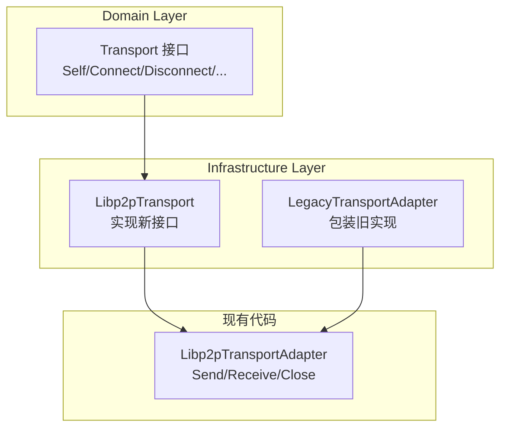

# 【PR全流程文档】Feature - Phase 1 Week 1-2 DDD 重构与 Transport 层迁移

> **文档说明**：本文档包含「前置规划」和「后置总结」两部分，记录从需求对齐到开发完成的全流程，一个PR对应一份全流程文档，归档后作为项目追溯依据。

---

## 第一部分：前置部分（开工前必完成，架构师评审通过）

### 1. 基础信息（与分支/PR绑定）

| 项目 | 内容 |
|------|------|
| 工作类型 | 架构重构（Refactor） |
| PR编号 | PR-077（创建GitHub PR后补充完整） |
| 分支名称 | feature/phase1-week1-2-transport-poc |
| 工作主题 | Phase 1 Week 1-2 DDD 重构与 Transport 层迁移 |
| 负责人 | 🤖 核心开发 A + B |
| 分支创建日期 | 2026-02-19 |
| 计划开工日期 | 2026-02-19 |
| 计划CI通过日期 | 2026-02-26 |
| 关联需求单号 | [NexKV DDD 架构实施 PR](../2026-02-18_PR-nexkv-ddd-architecture_Pre.md) |
| 架构师评审状态 | 🔄 待评审（第四轮） |
| 预审批结果 | □ 未通过 |

### 2. 背景与目标（为什么干）

#### 2.1 背景

**核心问题**：NexKV 需要从现有的功能模块架构迁移到 DDD 5层架构，这是整个架构重构的第一步。

**迁移策略**：渐进式重构（Strangler Pattern）
- 不进行一次性大重构
- 分阶段渐进迁移
- 保证系统始终可运行

**迁移范围**（对齐主 PR 2.5.2 阶段 1）：
- 现有代码：`internal/transport/`（37个文件）+ `internal/rpc/`（31个文件）
- 目标架构：DDD 5层（domain + application + infrastructure）

#### 2.2 核心目标（可量化、可验证）

**目标 1：建立 DDD 目录结构**
- [ ] 创建 domain 层接口定义
- [ ] 创建 infrastructure 层实现目录
- [ ] 定义新的 Transport 接口

**目标 2：Transport 层迁移（Option B - 新接口）**
- [ ] 定义新的 `domain.Transport` 接口（Self/Connect/Disconnect 等）
- [ ] 实现 `infrastructure.Libp2pTransport` 新接口
- [ ] 保留现有 `Libp2pTransportAdapter` 作为适配器（向后兼容）
- [ ] 逐步迁移现有代码使用新接口

**目标 3：核心 POC 验证**
- [ ] mDNS 节点发现（局域网，发现时间 < 5 秒）
- [ ] 节点间直连通信（TCP 连接建立时间 < 1 秒）
- [ ] RPC 调用（本地回环 P99 < 2ms，局域网 P99 < 5ms）

#### 2.3 明确边界（不做什么，避免范围蔓延）

**本次不做**（严格对齐主 PR 2.5.2 阶段 1 Week 1-4）：
- ❌ 删除现有 `internal/transport/` 代码（保持向后兼容）
- ❌ 迁移 `internal/rpc/`（Week 3-4 任务）
- ❌ 实现中间件链（Week 3 任务）
- ❌ 实现熔断器（Week 3 任务）

**本次聚焦**（Week 1-2）：
- ✅ 建立DDD目录结构
- ✅ 定义新的 domain.Transport 接口
- ✅ 实现新接口的 Libp2pTransport
- ✅ 保留旧接口作为适配器（渐进迁移）
- ✅ 核心POC验证

---

### 3. 迁移方案（核心设计）⭐

#### 3.1 迁移策略：Option B - 直接编写新 DDD 代码 ⭐

**决策**：采用 Option B（新接口设计，直接编写新代码）

**开发原则**（架构师确认）：
1. ✅ **直接编写新 DDD 代码**：不基于旧代码修改，从头编写
2. ✅ **借鉴旧实现逻辑**：参考 `internal/transport/` 的实现思路，但不是复制
3. ⏳ **删除旧代码**：待定，不是当前任务
4. ✅ **旧代码保留**：`internal/transport/` 暂时保留，不影响新开发

**理由**：
1. 新接口更符合 DDD 设计原则
2. 直接编写新代码更干净，避免历史包袱
3. 支持中间件扩展
4. 旧代码作为参考，后续删除时间待定



#### 3.2 目录结构设计

**目标结构（DDD 5层）**：
```
internal/
├── domain/                        # 领域层（接口定义）
│   ├── model/                     # 领域模型
│   │   ├── peer.go               # PeerID, PeerAddr
│   │   └── message.go            # Message, MessageType
│   └── service/                   # 领域服务接口
│       └── transport.go          # 新 Transport 接口 ⭐
│
├── infrastructure/                # 基础设施层（实现）
│   └── transport/                 # Transport 实现
│       ├── libp2p_transport.go        # 新接口实现 ⭐
│       ├── libp2p_transport_adapter.go # 旧适配器（保留）
│       ├── discovery.go
│       ├── p2p_service.go
│       ├── nexkv_protocol.go
│       ├── message_codec.go
│       └── ... (其他现有文件)
│
└── transport/                     # 现有代码（保留，渐进迁移）
```

#### 3.3 开发任务清单 ⭐

| 任务 | 文件位置 | 开发方式 | 阶段 |
|------|----------|----------|------|
| **定义 domain 模型** | `domain/model/peer.go` | ✅ 新建 | Week 1-2 |
| **定义 Transport 接口** | `domain/service/transport.go` | ✅ 新建 | Week 1-2 |
| **实现 Libp2pTransport** | `infrastructure/transport/libp2p_transport.go` | ✅ 新建（借鉴旧代码） | Week 1-2 |
| **实现 DiscoveryService** | `infrastructure/transport/discovery.go` | ✅ 新建（借鉴旧代码） | Week 1-2 |
| **实现消息编解码** | `infrastructure/transport/codec.go` | ✅ 新建（借鉴旧代码） | Week 1-2 |
| **编写单元测试** | `infrastructure/transport/*_test.go` | ✅ 新建 | Week 1-2 |
| **旧代码** | `internal/transport/` | ⏳ 保留（删除待定） | - |

**开发原则**：
- 新代码直接写在 `internal/domain/` 和 `internal/infrastructure/`
- 借鉴 `internal/transport/` 的实现逻辑，但不是复制粘贴
- 旧代码暂时保留，删除时间待定

#### 3.4 接口与实现清单 ⭐

##### 3.4.1 Domain 层 - 接口定义

| 文件 | 类型 | 名称 | 说明 |
|------|------|------|------|
| `domain/model/peer.go` | struct | `PeerID` | 节点标识符 |
| `domain/model/peer.go` | struct | `PeerAddr` | 节点地址 |
| `domain/model/message.go` | interface | `Message` | 消息接口 |
| `domain/model/message.go` | struct | `MessageType` | 消息类型枚举 |
| `domain/service/transport.go` | interface | `Transport` | 传输层核心接口 ⭐ |
| `domain/service/transport.go` | interface | `Stream` | 流式通信接口 |
| `domain/service/transport.go` | interface | `Channel` | 双向通道接口 |

##### 3.4.2 Domain 模型定义

```go
// internal/domain/model/peer.go

package model

// PeerID 节点标识符
type PeerID string

// PeerAddr 节点地址
type PeerAddr string

// String 返回 PeerID 的字符串表示
func (p PeerID) String() string {
    return string(p)
}

// String 返回 PeerAddr 的字符串表示
func (p PeerAddr) String() string {
    return string(p)
}
```

```go
// internal/domain/model/message.go

package model

// MessageType 消息类型
type MessageType int

const (
    MessageTypeRequest  MessageType = iota // 请求消息
    MessageTypeResponse                     // 响应消息
    MessageTypeEvent                        // 事件消息
)

// Message 消息接口
type Message interface {
    // ID 返回消息 ID
    ID() string
    // Type 返回消息类型
    Type() MessageType
    // Source 返回发送方节点 ID
    Source() PeerID
    // Target 返回目标节点 ID
    Target() PeerID
    // Payload 返回消息内容
    Payload() []byte
    // SetPayload 设置消息内容
    SetPayload(data []byte)
}
```

##### 3.4.3 新旧接口对比与演进说明 ⭐

**旧接口问题**（`internal/transport/libp2p_transport_adapter.go`）：
1. ❌ 缺少连接管理（无法显式连接/断开节点）
2. ❌ 缺少连接状态查询（无法检查节点是否已连接）
3. ❌ Send/Receive 模型过于简单，不支持流式通信
4. ❌ 缺少节点发现机制（需要外部注册 NodeID）

**新接口优势**：
1. ✅ 完整的连接管理（Connect/Disconnect/ConnectedPeers/IsConnected）
2. ✅ 支持流式通信（Stream 接口）
3. ✅ 支持双向通道（Channel 接口）
4. ✅ 更好的可扩展性（支持中间件、熔断器等）

**接口映射关系**：

| 旧接口方法 | 新接口方法 | 说明 |
|-----------|-----------|------|
| `Send(nodeID, msg)` | `Channel.Send(ctx, msg)` | 消息发送迁移到 Channel |
| `Receive(handler)` | `Channel.Recv(ctx)` | 消息接收迁移到 Channel |
| `Close()` | `Transport.Close()` | 关闭逻辑一致 |
| - | `Transport.Self()` | 新增：获取本地节点 ID |
| - | `Transport.Connect(ctx, addr)` | 新增：显式连接 |
| - | `Transport.Disconnect(peer)` | 新增：显式断开 |
| - | `Transport.ConnectedPeers()` | 新增：连接查询 |
| - | `Transport.IsConnected(peer)` | 新增：状态检查 |

---

##### 3.4.4 Transport 接口定义（新设计）⭐

```go
// internal/domain/service/transport.go

package service

import (
    "context"
    "github.com/jzhang405/NexKV/internal/domain/model"
)

// Transport 传输层核心接口（新设计）
type Transport interface {
    // Self 返回本地节点 ID
    Self() model.PeerID

    // Connect 连接到指定地址的节点
    // addr: 节点地址（如 "/ip4/127.0.0.1/tcp/9211/p2p/..."）
    // 返回连接的节点 ID
    Connect(ctx context.Context, addr string) (model.PeerID, error)

    // Disconnect 断开与指定节点的连接
    Disconnect(peer model.PeerID) error

    // ConnectedPeers 返回当前已连接的节点列表
    ConnectedPeers() []model.PeerID

    // IsConnected 检查是否与指定节点已连接
    IsConnected(peer model.PeerID) bool

    // Close 关闭传输层
    Close() error
}

// Stream 流式通信接口
type Stream interface {
    // ID 返回流 ID
    ID() string

    // Protocol 返回协议名称
    Protocol() string

    // RemotePeer 返回远程节点 ID
    RemotePeer() model.PeerID

    // Read 读取数据
    Read(p []byte) (n int, err error)

    // Write 写入数据
    Write(p []byte) (n int, err error)

    // Close 关闭流
    Close() error
}

// Channel 双向通道接口
type Channel interface {
    // Send 发送消息
    Send(ctx context.Context, msg []byte) error

    // Recv 接收消息
    Recv(ctx context.Context) ([]byte, error)

    // Close 关闭通道
    Close() error
}
```

##### 3.4.5 Infrastructure 层 - 实现清单

| 文件 | 类型 | 名称 | 实现接口 | 说明 |
|------|------|------|----------|------|
| `infrastructure/transport/libp2p_transport.go` | struct | `Libp2pTransport` | `service.Transport` | libp2p 传输实现 ⭐ |
| `infrastructure/transport/libp2p_stream.go` | struct | `Libp2pStream` | `service.Stream` | libp2p 流实现 ⭐ |
| `infrastructure/transport/libp2p_channel.go` | struct | `Libp2pChannel` | `service.Channel` | libp2p 通道实现 ⭐ |
| `infrastructure/transport/discovery.go` | struct | `DiscoveryService` | - | mDNS 节点发现 |
| `infrastructure/transport/codec.go` | struct | `MessageCodec` | - | 消息编解码 |
| `infrastructure/transport/config.go` | struct | `Config` | - | 配置结构 |

##### 3.4.5 新接口实现（从头编写）

```go
// internal/infrastructure/transport/libp2p_transport.go

package transport

import (
    "context"
    "fmt"

    "github.com/jzhang405/NexKV/internal/domain/model"
    "github.com/jzhang405/NexKV/internal/domain/service"
    "github.com/libp2p/go-libp2p"
    "github.com/libp2p/go-libp2p/core/host"
    "github.com/libp2p/go-libp2p/core/network"
    "github.com/libp2p/go-libp2p/core/peer"
    "github.com/multiformats/go-multiaddr"
)

// 确保实现 service.Transport 接口
var _ service.Transport = (*Libp2pTransport)(nil)

// Libp2pTransport 实现 domain.Transport 新接口
// 开发原则：从头编写，借鉴旧代码逻辑，不复制粘贴
type Libp2pTransport struct {
    host      host.Host
    discovery *DiscoveryService
    codec     *MessageCodec
}

// Config 传输层配置
type Config struct {
    ListenAddr     string // 监听地址
    DiscoveryTag   string // mDNS 发现标签
    EnableDiscovery bool  // 是否启用 mDNS 发现
}

// NewLibp2pTransport 创建新的 libp2p 传输实现
func NewLibp2pTransport(ctx context.Context, cfg *Config) (*Libp2pTransport, error) {
    // 1. 创建 libp2p host（借鉴旧代码的 host_builder.go 逻辑）
    h, err := libp2p.New(
        libp2p.ListenAddrStrings(cfg.ListenAddr),
    )
    if err != nil {
        return nil, fmt.Errorf("create libp2p host: %w", err)
    }

    // 2. 创建 discovery 服务（借鉴旧代码的 discovery.go 逻辑）
    var discovery *DiscoveryService
    if cfg.EnableDiscovery {
        discovery = NewDiscoveryService(h, cfg.DiscoveryTag)
    }

    // 3. 创建编解码器（借鉴旧代码的 message_codec.go 逻辑）
    codec := NewMessageCodec()

    return &Libp2pTransport{
        host:      h,
        discovery: discovery,
        codec:     codec,
    }, nil
}

// Self 返回本地节点 ID
func (t *Libp2pTransport) Self() model.PeerID {
    return model.PeerID(t.host.ID().String())
}

// Connect 连接到指定地址的节点
func (t *Libp2pTransport) Connect(ctx context.Context, addr string) (model.PeerID, error) {
    // 解析多地址（借鉴旧代码逻辑）
    maddr, err := multiaddr.NewMultiaddr(addr)
    if err != nil {
        return "", fmt.Errorf("parse multiaddr: %w", err)
    }

    // 提取 peer info
    info, err := peer.AddrInfoFromP2pAddr(maddr)
    if err != nil {
        return "", fmt.Errorf("extract peer info: %w", err)
    }

    // 连接
    if err := t.host.Connect(ctx, *info); err != nil {
        return "", fmt.Errorf("connect: %w", err)
    }

    return model.PeerID(info.ID.String()), nil
}

// Disconnect 断开与指定节点的连接
func (t *Libp2pTransport) Disconnect(peerID model.PeerID) error {
    pid, err := peer.Decode(peerID.String())
    if err != nil {
        return fmt.Errorf("decode peer id: %w", err)
    }

    // 关闭所有与该节点的连接
    conns := t.host.Network().ConnsToPeer(pid)
    for _, conn := range conns {
        if err := conn.Close(); err != nil {
            return fmt.Errorf("close connection: %w", err)
        }
    }

    return nil
}

// ConnectedPeers 返回当前已连接的节点列表
func (t *Libp2pTransport) ConnectedPeers() []model.PeerID {
    peers := t.host.Network().Peers()
    result := make([]model.PeerID, 0, len(peers))
    for _, p := range peers {
        result = append(result, model.PeerID(p.String()))
    }
    return result
}

// IsConnected 检查是否与指定节点已连接
func (t *Libp2pTransport) IsConnected(peerID model.PeerID) bool {
    pid, err := peer.Decode(peerID.String())
    if err != nil {
        return false
    }
    return t.host.Network().Connectedness(pid) == network.Connected
}

// Close 关闭传输层（完整实现，包含错误处理）
func (t *Libp2pTransport) Close() error {
    var errs []error

    // 1. 关闭 discovery
    if t.discovery != nil {
        if err := t.discovery.Close(); err != nil {
            errs = append(errs, fmt.Errorf("close discovery: %w", err))
        }
    }

    // 2. 关闭 codec
    if t.codec != nil {
        if err := t.codec.Close(); err != nil {
            errs = append(errs, fmt.Errorf("close codec: %w", err))
        }
    }

    // 3. 关闭 host
    if err := t.host.Close(); err != nil {
        errs = append(errs, fmt.Errorf("close host: %w", err))
    }

    // 4. 返回组合错误
    if len(errs) > 0 {
        return fmt.Errorf("close transport failed: %v", errs)
    }
    return nil
}
```

##### 3.4.7 Libp2pStream 实现示例

```go
// internal/infrastructure/transport/libp2p_stream.go

package transport

import (
    "github.com/jzhang405/NexKV/internal/domain/model"
    "github.com/jzhang405/NexKV/internal/domain/service"
    "github.com/libp2p/go-libp2p/core/network"
)

// 确保实现 service.Stream 接口
var _ service.Stream = (*Libp2pStream)(nil)

// Libp2pStream 实现 Stream 接口
type Libp2pStream struct {
    stream   network.Stream
    protocol string
}

// NewLibp2pStream 创建新的 Stream
func NewLibp2pStream(stream network.Stream, protocol string) *Libp2pStream {
    return &Libp2pStream{
        stream:   stream,
        protocol: protocol,
    }
}

// ID 返回流 ID
func (s *Libp2pStream) ID() string {
    return s.stream.ID()
}

// Protocol 返回协议名称
func (s *Libp2pStream) Protocol() string {
    return s.protocol
}

// RemotePeer 返回远程节点 ID
func (s *Libp2pStream) RemotePeer() model.PeerID {
    return model.PeerID(s.stream.Conn().RemotePeer().String())
}

// Read 读取数据
func (s *Libp2pStream) Read(p []byte) (n int, err error) {
    return s.stream.Read(p)
}

// Write 写入数据
func (s *Libp2pStream) Write(p []byte) (n int, err error) {
    return s.stream.Write(p)
}

// Close 关闭流
func (s *Libp2pStream) Close() error {
    return s.stream.Close()
}
```

##### 3.4.8 错误定义

```go
// internal/infrastructure/transport/errors.go

package transport

import "errors"

var (
    // ErrChannelClosed 通道已关闭
    ErrChannelClosed = errors.New("channel is closed")
    // ErrMessageTooLarge 消息过大
    ErrMessageTooLarge = errors.New("message size exceeds limit")
)

const (
    // DefaultBufferSize 默认缓冲区大小 (4KB)
    DefaultBufferSize = 4096
    // MaxMessageSize 最大消息大小 (1MB)
    MaxMessageSize = 1024 * 1024
)
```

##### 3.4.9 Libp2pChannel 实现示例

```go
// internal/infrastructure/transport/libp2p_channel.go

package transport

import (
    "context"
    "sync"

    "github.com/jzhang405/NexKV/internal/domain/service"
)

// 确保实现 service.Channel 接口
var _ service.Channel = (*Libp2pChannel)(nil)

// Libp2pChannel 实现 Channel 接口
type Libp2pChannel struct {
    stream *Libp2pStream
    codec  *MessageCodec
    mu     sync.Mutex
    closed bool
}

// NewLibp2pChannel 创建新的 Channel
func NewLibp2pChannel(stream *Libp2pStream, codec *MessageCodec) *Libp2pChannel {
    return &Libp2pChannel{
        stream: stream,
        codec:  codec,
    }
}

// Send 发送消息
func (c *Libp2pChannel) Send(ctx context.Context, msg []byte) error {
    c.mu.Lock()
    defer c.mu.Unlock()

    if c.closed {
        return ErrChannelClosed
    }

    // 使用 codec 编码并发送
    encoded, err := c.codec.Encode(msg)
    if err != nil {
        return err
    }

    _, err = c.stream.Write(encoded)
    return err
}

// Recv 接收消息
func (c *Libp2pChannel) Recv(ctx context.Context) ([]byte, error) {
    c.mu.Lock()
    defer c.mu.Unlock()

    if c.closed {
        return nil, ErrChannelClosed
    }

    // 读取并解码（使用可配置的最大消息大小）
    buf := make([]byte, MaxMessageSize)
    n, err := c.stream.Read(buf)
    if err != nil {
        return nil, err
    }

    return c.codec.Decode(buf[:n])
}

// Close 关闭通道
func (c *Libp2pChannel) Close() error {
    c.mu.Lock()
    defer c.mu.Unlock()

    c.closed = true
    return c.stream.Close()
}
```

#### 3.5 测试计划（量化）

| 测试类型 | 位置 | 开发方式 | 预估用例数 | 优先级 |
|---------|-----|----------|-----------|--------|
| Transport 接口测试 | `libp2p_transport_test.go` | ✅ 新建 | 15-20 个 | P0 |
| Discovery 测试 | `discovery_test.go` | ✅ 新建 | 10-15 个 | P0 |
| Stream 测试 | `libp2p_stream_test.go` | ✅ 新建 | 10-15 个 | P1 |
| Channel 测试 | `libp2p_channel_test.go` | ✅ 新建 | 10-15 个 | P1 |
| 集成测试 | `integration_test.go` | ✅ 新建 | 8-10 个 | P1 |

**总计**：53-75 个测试用例，覆盖率目标 ≥ 80%

#### 3.6 验收标准（量化）

| 验收项 | 标准 | 验证方法 |
|--------|------|----------|
| **接口实现完成度** | 6 个 Domain 接口 + 6 个 Infrastructure 实现全部完成 | 代码审查 |
| **测试覆盖率** | 新代码测试覆盖率 ≥ 80% | `go test -cover` |
| **mDNS 节点发现** | 3 节点局域网发现时间 < 5 秒 | `go test -run TestDiscovery` |
| **直连通信** | TCP 连接建立时间 < 1 秒 | `go test -bench=BenchmarkConnect` |
| **RPC 延迟** | 本地回环 P99 < 2ms，局域网 P99 < 5ms | `go test -bench=BenchmarkRPC` |
| **旧代码兼容** | 164 个旧测试全部通过 | `go test ./internal/transport/...` |

#### 3.7 开发原则总结 ⭐

| 原则 | 说明 |
|------|------|
| **直接编写新代码** | 在 `internal/domain/` 和 `internal/infrastructure/` 中从头编写 |
| **借鉴旧代码逻辑** | 参考 `internal/transport/` 的实现思路，但不是复制粘贴 |
| **旧代码保留** | `internal/transport/` 暂时保留，删除时间待定 |
| **TDD 开发** | 先写测试，再写实现 |

---

### 4. 风险评估与应对措施

| 风险点 | 影响等级 | 概率 | 应对措施 | 检查点 |
|--------|----------|------|----------|--------|
| **接口设计不完整** | 中 | 中 | 1. 参考主 PR v18.0 接口定义<br/>2. 架构师评审<br/>3. 迭代优化 | Week 1 |
| **新旧接口并存复杂** | 中 | 中 | 1. 清晰的适配器模式<br/>2. 完整的测试覆盖<br/>3. 文档说明 | Week 2 |
| **破坏现有功能** | 高 | 低 | 1. 保留旧接口<br/>2. 164 个测试验证<br/>3. 渐进迁移 | Week 2 |
| **迁移周期过长** | 中 | 低 | 1. 分阶段迁移<br/>2. 每日进度跟踪 | Week 2 |

---

### 5. 依赖与前置条件

**前置条件**：
- [x] Go 1.21+
- [x] libp2p v0.33+
- [x] Week 0 培训已完成（DDD + Go 泛型 + libp2p）
- [x] 主 PR Pre 文档 v1.5 已批准

**技术依赖**：
- 现有代码：`internal/transport/`（37个文件）
- 现有代码：`internal/rpc/`（31个文件）- Week 3-4 迁移
- 现有测试：164个 Transport 测试 + 169个 RPC 测试

---

### 6. 架构师评审记录

| 评审轮次 | 评审日期 | 评审人 | 核心评审意见 | 优化措施 | 优化结果 |
|----------|----------|--------|--------------|----------|----------|
| 第1轮 | 2026-02-19 | Code Reviewer | 评分 9.0/10，P1 问题 | 补充接口定义 | ✅ 完成 |
| 第2轮 | 2026-02-19 | Code Reviewer | 评分 7.8/10，迁移策略不一致 | 对齐主 PR | ✅ 完成 |
| 第3轮 | 2026-02-19 | 👤 架构师 | 接口不匹配，映射表不完整 | 提供 Option A/B | ✅ 完成 |
| 第4轮 | 2026-02-19 | 👤 架构师 | **采用 Option B - 新接口** | ✅ 已更新 | ✅ 完成 |
| 第5轮 | 2026-02-19 | Code Reviewer | V1.5 评分 9.0/10，P1/P2 问题 | 优化文档 | ✅ 完成 |
| 第6轮 | 2026-02-19 | Code Reviewer | V1.6 评分 9.5/10，次要问题 | 修复次要问题 | ✅ 完成 |
| 第7轮 | - | 👤 架构师 | [待最终审批] | - | - |

### 7. 预审批确认

> **架构师签字/备注**：[待审批]

---

## 第二部分：流程节点记录（开发/CI过程追溯）

### 1. 开发过程记录

| 节点 | 完成日期 | 具体内容 | 交付物 |
|------|----------|----------|--------|
| 创建 DDD 目录 | - | [待开发] | internal/domain/, internal/infrastructure/ |
| 定义新接口 | - | [待开发] | domain/service/transport.go |
| 实现新 Libp2pTransport | - | [待开发] | infrastructure/transport/libp2p_transport.go |
| 保留旧适配器 | - | [待开发] | infrastructure/transport/libp2p_transport_adapter.go |
| 本地测试 | - | [待测试] | 164 个旧测试 + 新测试通过 |

### 2. CI流程记录

| CI轮次 | 触发时间 | 结果 | 问题详情 | 修复措施 | 修复结果 |
|--------|----------|------|----------|----------|----------|
| - | - | - | - | - | - |

---

## 第三部分：后置部分（CI通过后编写，总结/成果/ToDo）

### 1. 核心成果总结

#### 1.1 功能成果
- **已完成**：[待填写]
- **与Pre文档差异**：[待填写]

#### 1.2 迁移成果
| 迁移项 | 状态 | 说明 |
|--------|------|------|
| DDD 目录结构 | [待完成] | domain/, infrastructure/ |
| 新 Transport 接口 | [待完成] | Self/Connect/Disconnect 等 |
| 新 Libp2pTransport 实现 | [待完成] | 实现新接口 |
| 旧适配器保留 | [待完成] | 向后兼容 |
| 测试验证 | [待完成] | 164 + 新测试通过 |

### 2. ToDo清单

| 优先级 | 任务内容 | 预估工期 | 关联PR/需求 | 备注 |
|--------|----------|----------|-------------|------|
| 高 | Week 3-4: RPC 迁移为 Requestor | 2周 | PR-078 | 下一阶段 |
| 高 | Week 3-4: 中间件和容错机制 | 2周 | PR-078 | 下一阶段 |
| 中 | 逐步迁移业务代码使用新接口 | 持续 | - | 渐进迁移 |

### 3. 下一步工作建议
1. **优先推进**：实现新接口的 Libp2pTransport
2. **监控要点**：新旧接口并存期间的兼容性
3. **后续规划**：M1 里程碑验收（阶段 1 完成）

---

## 文档归档信息

| 项目 | 内容 |
|------|------|
| 文档最终版本 | V1.7 |
| 归档日期 | - |
| 归档路径 | docs/06_PM/feature/2026-02-19_PR-phase1-week1-2-transport-poc_Pre.md |
| 后续维护人 | 🤖 核心开发 A + B |

---

## 参考资料

- 📋 主 PR Pre 文档：[2026-02-18_PR-nexkv-ddd-architecture_Pre.md](../2026-02-18_PR-nexkv-ddd-architecture_Pre.md)
- 📚 培训材料：[Day1-AM-DDD-Architecture.md](../../08_training/2026-02-18_Day1-AM-DDD-Architecture.md)
- 📚 培训材料：[Day2-3-libp2p-Basics.md](../../08_training/2026-02-18_Day2-3-libp2p-Basics.md)

---

## 变更历史

| 版本 | 日期 | 变更内容 |
|------|------|----------|
| V1.0 | 2026-02-19 | 初始版本 |
| V1.1 | 2026-02-19 | 强调 DDD 重构策略 |
| V1.2 | 2026-02-19 | 对齐主 PR 迁移策略 |
| V1.3 | 2026-02-19 | Option A: 保持现有接口 |
| V1.4 | 2026-02-19 | **Option B: 采用新接口**（架构师决策） |
| V1.5 | 2026-02-19 | **明确开发原则**：直接编写新 DDD 代码，借鉴旧代码逻辑，删除旧代码待定 |
| V1.6 | 2026-02-19 | **根据 Review 优化**：添加新旧接口对比、Stream/Channel 实现、量化验收标准 |
| V1.7 | 2026-02-19 | **修复次要问题**：添加错误定义、缓冲区配置化、修正小节编号 |
