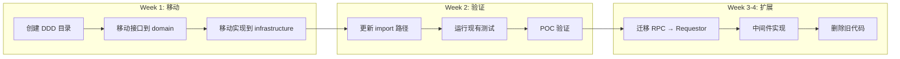

# 【PR全流程文档】Feature - Phase 1 Week 1-2 DDD 重构与 Transport 层迁移

> **文档说明**：本文档包含「前置规划」和「后置总结」两部分，记录从需求对齐到开发完成的全流程，一个PR对应一份全流程文档，归档后作为项目追溯依据。

---

## 第一部分：前置部分（开工前必完成，架构师评审通过）

### 1. 基础信息（与分支/PR绑定）

| 项目 | 内容 |
|------|------|
| 工作类型 | 架构重构（Refactor） |
| PR编号 | PR-077（创建GitHub PR后补充完整） |
| 分支名称 | feature/phase1-week1-2-transport-poc |
| 工作主题 | Phase 1 Week 1-2 DDD 重构与 Transport 层迁移 |
| 负责人 | 🤖 核心开发 A + B |
| 分支创建日期 | 2026-02-19 |
| 计划开工日期 | 2026-02-19 |
| 计划CI通过日期 | 2026-02-26 |
| 关联需求单号 | [NexKV DDD 架构实施 PR](../2026-02-18_PR-nexkv-ddd-architecture_Pre.md) |
| 架构师评审状态 | 🔄 待评审（第三轮） |
| 预审批结果 | □ 未通过 |

### 2. 背景与目标（为什么干）

#### 2.1 背景

**核心问题**：NexKV 需要从现有的功能模块架构迁移到 DDD 5层架构，这是整个架构重构的第一步。

**迁移策略**：渐进式重构（Strangler Pattern）
- 不进行一次性大重构
- 分阶段渐进迁移
- 保证系统始终可运行

**迁移范围**（对齐主 PR 2.5.2 阶段 1）：
- 现有代码：`internal/transport/`（37个文件）+ `internal/rpc/`（31个文件）
- 目标架构：DDD 5层（domain + application + infrastructure）

#### 2.2 核心目标（可量化、可验证）

**目标 1：建立 DDD 目录结构**
- [ ] 创建 domain 层接口定义
- [ ] 创建 infrastructure 层实现目录
- [ ] 保持现有代码不受影响（零破坏）

**目标 2：Transport 层迁移（Option A - 最小改动）**
- [ ] 将现有 `Transport` 接口移动到 `domain/service/transport.go`
- [ ] 迁移 `internal/transport/` 到 `internal/infrastructure/transport/`
- [ ] 164 个现有测试无需修改（仅 import 路径变更）

**目标 3：核心 POC 验证**
- [ ] mDNS 节点发现（局域网，发现时间 < 5 秒）
- [ ] 节点间直连通信（TCP 连接建立时间 < 1 秒）
- [ ] RPC 调用（本地回环 P99 < 2ms，局域网 P99 < 5ms）

#### 2.3 明确边界（不做什么，避免范围蔓延）

**本次不做**（严格对齐主 PR 2.5.2 阶段 1 Week 1-4）：
- ❌ 重新设计 Transport 接口（保持现有接口不变）
- ❌ 删除现有 `internal/transport/` 代码（Week 4 任务）
- ❌ 迁移 `internal/rpc/`（Week 3-4 任务）
- ❌ 实现中间件链（Week 3 任务）

**本次聚焦**（Week 1-2）：
- ✅ 建立DDD目录结构
- ✅ 移动现有接口到 domain 层（Option A）
- ✅ 移动现有实现到 infrastructure 层
- ✅ 核心POC验证

---

### 3. 迁移方案（核心设计）⭐

#### 3.1 迁移策略：Option A - 最小改动方案

**决策**：采用 Option A（保持现有接口，最小改动）

**理由**：
1. 现有接口 `Send/Receive/Close` 已经稳定运行
2. 164 个测试依赖此接口，无需修改
3. 符合 Strangler Pattern 的最小风险原则
4. 后续可在不破坏兼容性的情况下扩展接口



#### 3.2 目录结构设计

**现有结构**：
```
internal/
├── transport/           # 现有 Transport 实现（37个文件）
│   ├── libp2p_transport_adapter.go
│   ├── discovery.go
│   ├── p2p_service.go
│   ├── message.go
│   └── ...
├── rpc/                 # 现有 RPC 实现（31个文件）- Week 3-4 迁移
```

**目标结构（DDD 5层）**：
```
internal/
├── domain/                        # 领域层（接口定义）
│   ├── model/                     # 领域模型
│   │   ├── peer.go               # PeerID, PeerAddr
│   │   └── message.go            # Message, MessageType
│   └── service/                   # 领域服务接口
│       └── transport.go          # 现有 Transport 接口（移动）
│
├── infrastructure/                # 基础设施层（实现）
│   └── transport/                 # Transport 实现（移动）
│       ├── libp2p_transport_adapter.go
│       ├── discovery.go
│       ├── p2p_service.go
│       ├── nexkv_protocol.go
│       ├── message_codec.go
│       ├── key_manager.go
│       ├── key_mapper.go
│       ├── host_builder.go
│       ├── constants.go
│       ├── errors.go
│       └── ...
│
├── transport/                     # 现有代码（Week 4 删除）
└── rpc/                           # 现有代码（Week 3-4 迁移）
```

#### 3.3 完整迁移映射表 ⭐

| 现有代码 | DDD 目标位置 | 迁移策略 | 阶段 |
|---------|-------------|----------|------|
| `internal/transport/libp2p_transport_adapter.go` | `infrastructure/transport/libp2p_transport_adapter.go` | ✅ 移动 | Week 1-2 |
| `internal/transport/discovery.go` | `infrastructure/transport/discovery.go` | ✅ 移动 | Week 1-2 |
| `internal/transport/p2p_service.go` | `infrastructure/transport/p2p_service.go` | ✅ 移动 | Week 1-2 |
| `internal/transport/nexkv_protocol.go` | `infrastructure/transport/nexkv_protocol.go` | ✅ 移动 | Week 1-2 |
| `internal/transport/message.go` | `infrastructure/transport/message.go` | ✅ 移动 | Week 1-2 |
| `internal/transport/message_codec.go` | `infrastructure/transport/message_codec.go` | ✅ 移动 | Week 1-2 |
| `internal/transport/key_manager.go` | `infrastructure/transport/key_manager.go` | ✅ 移动 | Week 1-2 |
| `internal/transport/key_mapper.go` | `infrastructure/transport/key_mapper.go` | ✅ 移动 | Week 1-2 |
| `internal/transport/host_builder.go` | `infrastructure/transport/host_builder.go` | ✅ 移动 | Week 1-2 |
| `internal/transport/constants.go` | `infrastructure/transport/constants.go` | ✅ 移动 | Week 1-2 |
| `internal/transport/errors.go` | `infrastructure/transport/errors.go` | ✅ 移动 | Week 1-2 |
| `internal/transport/peer_id.go` | `infrastructure/transport/peer_id.go` | ✅ 移动 | Week 1-2 |
| `internal/transport/peer_utils.go` | `infrastructure/transport/peer_utils.go` | ✅ 移动 | Week 1-2 |
| `internal/transport/seed_integration.go` | `infrastructure/transport/seed_integration.go` | ✅ 移动 | Week 1-2 |
| `internal/transport/bootstrap.go` | `infrastructure/transport/bootstrap.go` | ✅ 移动 | Week 1-2 |
| **接口定义**（从 adapter 文件提取） | `domain/service/transport.go` | 🔄 提取 | Week 1-2 |
| `internal/rpc/client.go` | `infrastructure/transport/requestor_impl.go` | 🔄 Week 3-4 | Week 3-4 |
| `internal/rpc/server.go` | `infrastructure/transport/server_impl.go` | 🔄 Week 3-4 | Week 3-4 |
| `internal/rpc/types.go` | `domain/model/message.go` | 🔄 Week 3-4 | Week 3-4 |

#### 3.3.1 测试迁移计划

| 现有测试 | DDD 目标位置 | 迁移策略 | 数量 |
|---------|-------------|----------|------|
| `internal/transport/*_test.go` | `infrastructure/transport/*_test.go` | ✅ 移动 | 164 个 |
| `internal/rpc/*_test.go` | `infrastructure/transport/*_test.go` | 🔄 Week 3-4 | 169 个 |

**测试迁移步骤**：
1. Week 1：移动 Transport 测试（直接移动）
2. Week 2：更新测试 import 路径
3. Week 3-4：移动 RPC 测试

**验收标准**：
- [ ] 所有测试在新位置运行通过（164 + 169 = 333 个测试）
- [ ] 测试覆盖率 ≥ 80%

#### 3.4 接口设计（Option A - 保持现有接口）⭐

##### 3.4.1 Transport 接口（domain 层）- 现有接口

```go
// internal/domain/service/transport.go
// 从现有 internal/transport/libp2p_transport_adapter.go 提取

package service

// Transport 传输层接口（保持与业务层兼容）
// 业务层使用此接口发送和接收消息
type Transport interface {
    // Send 发送消息到指定节点
    // nodeID: 目标节点的业务层 ID（字符串形式）
    // msg: 消息内容（已编码的字节）
    Send(nodeID string, msg []byte) error

    // Receive 注册消息接收处理器
    // handler: 接收到消息时的回调函数
    //   - nodeID: 发送方节点的业务层 ID
    //   - msg: 接收到的消息内容
    Receive(handler func(nodeID string, msg []byte)) error

    // Close 关闭传输层
    Close() error
}
```

**关键决策**：
- ✅ 保持现有 `Send/Receive/Close` 接口不变
- ✅ 164 个测试无需修改
- ✅ 符合 Strangler Pattern 最小改动原则
- ⏳ 后续可扩展接口（如 `Connect/Disconnect`），在不破坏兼容性的情况下

##### 3.4.2 实现示例（直接移动）

```go
// internal/infrastructure/transport/libp2p_transport_adapter.go
// 从 internal/transport/libp2p_transport_adapter.go 直接移动

package transport

import (
    "github.com/jzhang405/NexKV/internal/domain/service"
    // ... 其他 import
)

// 确保实现 domain.Transport 接口
var _ service.Transport = (*Libp2pTransportAdapter)(nil)

// Libp2pTransportAdapter 适配器：实现 domain.Transport 接口
// 职责：将 NodeID 与 peer.ID 进行双向转换，保持业务层 API 不变
type Libp2pTransportAdapter struct {
    host      host.Host
    protocol  *NexKVProtocol
    mapper    *NodeIDMapper
    // ... 现有字段保持不变
}

// Send 发送消息到指定节点（现有实现，无需修改）
func (a *Libp2pTransportAdapter) Send(nodeID string, msg []byte) error {
    // 现有实现代码
}

// Receive 注册消息接收处理器（现有实现，无需修改）
func (a *Libp2pTransportAdapter) Receive(handler func(nodeID string, msg []byte)) error {
    // 现有实现代码
}

// Close 关闭传输层（现有实现，无需修改）
func (a *Libp2pTransportAdapter) Close() error {
    // 现有实现代码
}
```

**迁移步骤**：
1. 创建 `internal/domain/service/transport.go`，提取 `Transport` 接口
2. 移动 `internal/transport/*.go` 到 `internal/infrastructure/transport/`
3. 添加 `var _ service.Transport = (*Libp2pTransportAdapter)(nil)` 编译检查
4. 更新所有 import 路径

#### 3.5 向后兼容性保证与清理计划

**阶段 1（Week 1-3）：并行运行**
- 现有代码继续工作（零破坏）
- 新代码使用 DDD 接口
- 两者可以共存

```go
// 现有代码继续工作（import 路径变更后）
transport := infrastructure.NewLibp2pTransportAdapter(...)

// 新代码使用 domain 接口
var transportService service.Transport = infrastructure.NewLibp2pTransportAdapter(...)
```

**阶段 2（Week 4）：清理与删除**

- [ ] 验证所有引用已切换到新接口
- [ ] 删除旧代码：`internal/transport/` 目录
- [ ] 更新所有 import 路径
- [ ] 运行完整测试套件（164 + 169 = 333 个测试）

**验收标准**：
- [ ] 旧代码目录为空或删除
- [ ] 无编译错误
- [ ] 所有测试通过

---

### 4. 风险评估与应对措施

| 风险点 | 影响等级 | 概率 | 应对措施 | 检查点 |
|--------|----------|------|----------|--------|
| **破坏现有功能** | **高** | 低 | 1. Option A：保持接口不变<br/>2. 164 个测试无需修改<br/>3. Week 4 清理前完整验证 | Week 4 清理前 |
| **迁移周期过长** | 中 | 低 | 1. 分阶段迁移（Week 1-2 / Week 3-4）<br/>2. 自动化测试<br/>3. 每日进度跟踪 | Week 2 检查点 |
| **DDD 接口设计不合理** | 低 | 低 | 1. Option A：保持现有接口<br/>2. 后续可扩展 | Week 1 架构师评审 |
| **团队学习成本** | 低 | 低 | 1. ✅ Week 0 DDD 培训已完成<br/>2. 代码示例<br/>3. 结对编程 | Week 0 培训完成 |

---

### 5. 依赖与前置条件

**前置条件**：
- [x] Go 1.21+
- [x] libp2p v0.33+
- [x] Week 0 培训已完成（DDD + Go 泛型 + libp2p）
- [x] 主 PR Pre 文档 v1.5 已批准

**技术依赖**：
- 现有代码：`internal/transport/`（37个文件）
- 现有代码：`internal/rpc/`（31个文件）- Week 3-4 迁移
- 现有测试：164个 Transport 测试 + 169个 RPC 测试

---

### 6. 架构师评审记录（循环优化，直至通过）

| 评审轮次 | 评审日期 | 评审人 | 核心评审意见 | 优化措施 | 优化结果 |
|----------|----------|--------|--------------|----------|----------|
| 第1轮 | 2026-02-19 | Code Reviewer | 评分 9.0/10，P1 问题 | 补充接口定义 | ✅ 完成 |
| 第2轮 | 2026-02-19 | Code Reviewer | 评分 7.8/10，迁移策略不一致 | 对齐主 PR | ✅ 完成 |
| 第3轮 | 2026-02-19 | 👤 架构师 | 接口不匹配，映射表不完整 | **采用 Option A** | ✅ 已修复 |
| 第4轮 | - | 👤 架构师 | [待评审] | - | - |

### 7. 预审批确认

> **架构师签字/备注**：[待审批]

---

## 第二部分：流程节点记录（开发/CI过程追溯）

### 1. 开发过程记录

| 节点 | 完成日期 | 具体内容 | 交付物 |
|------|----------|----------|--------|
| 创建 DDD 目录 | - | [待开发] | internal/domain/, internal/infrastructure/ |
| 提取 domain 接口 | - | [待开发] | domain/service/transport.go |
| 移动 Transport 实现 | - | [待开发] | infrastructure/transport/*.go |
| 本地测试 | - | [待测试] | 164 个测试通过 |

### 2. CI流程记录

| CI轮次 | 触发时间 | 结果 | 问题详情 | 修复措施 | 修复结果 |
|--------|----------|------|----------|----------|----------|
| - | - | - | - | - | - |

---

## 第三部分：后置部分（CI通过后编写，总结/成果/ToDo）

### 1. 核心成果总结（开发了啥，结果怎样）

#### 1.1 功能成果
- **已完成**：[待填写]
- **与Pre文档差异**：[待填写]

#### 1.2 迁移成果
| 迁移项 | 状态 | 说明 |
|--------|------|------|
| DDD 目录结构 | [待完成] | domain/, infrastructure/ |
| Transport 接口提取 | [待完成] | domain/service/transport.go |
| Transport 实现移动 | [待完成] | infrastructure/transport/*.go |
| 测试验证 | [待完成] | 164 个测试通过 |

#### 1.3 代码/文档交付物

| 类型 | 具体内容 | 链接/路径 |
|------|----------|-----------|
| 代码变更 | domain 层接口 | internal/domain/service/transport.go |
| 代码变更 | infrastructure 层实现 | internal/infrastructure/transport/ |
| 文档更新 | 本 Pre 文档 | docs/06_PM/feature/ |

### 2. 未完成项与ToDo清单

#### 2.1 本次PR未完成项
- **未支持**：[待填写]
- **遗留问题**：[待填写]

#### 2.2 ToDo清单（优先级排序）

| 优先级 | 任务内容 | 预估工期 | 关联PR/需求 | 备注 |
|--------|----------|----------|-------------|------|
| 高 | Week 3-4: RPC 迁移为 Requestor | 2周 | PR-078 | 下一阶段 |
| 高 | Week 3-4: 中间件和容错机制 | 2周 | PR-078 | 下一阶段 |
| 高 | Week 4: 删除旧代码 | 1周 | PR-079 | 清理阶段 |

### 3. 下一步工作建议
1. **优先推进**：Week 3-4 RPC 迁移（Requestor 接口）
2. **监控要点**：DDD 架构迁移进度
3. **后续规划**：M1 里程碑验收（阶段 1 完成）

---

## 文档归档信息

| 项目 | 内容 |
|------|------|
| 文档最终版本 | V1.3 |
| 归档日期 | - |
| 归档路径 | docs/06_PM/feature/2026-02-19_PR-phase1-week1-2-transport-poc_Pre.md |
| 后续维护人 | 🤖 核心开发 A + B |

---

## 参考资料

- 📋 主 PR Pre 文档：[2026-02-18_PR-nexkv-ddd-architecture_Pre.md](../2026-02-18_PR-nexkv-ddd-architecture_Pre.md)
  - **重点参考**：2.5 现有代码迁移与重构策略
- 📚 培训材料：[Day1-AM-DDD-Architecture.md](../../08_training/2026-02-18_Day1-AM-DDD-Architecture.md)
- 📚 培训材料：[Day2-3-libp2p-Basics.md](../../08_training/2026-02-18_Day2-3-libp2p-Basics.md)

---

## 变更历史

| 版本 | 日期 | 变更内容 |
|------|------|----------|
| V1.0 | 2026-02-19 | 初始版本 |
| V1.1 | 2026-02-19 | 强调 DDD 重构策略 |
| V1.2 | 2026-02-19 | 对齐主 PR 迁移策略 |
| V1.3 | 2026-02-19 | **采用 Option A**：保持现有接口，完整迁移映射表 |
