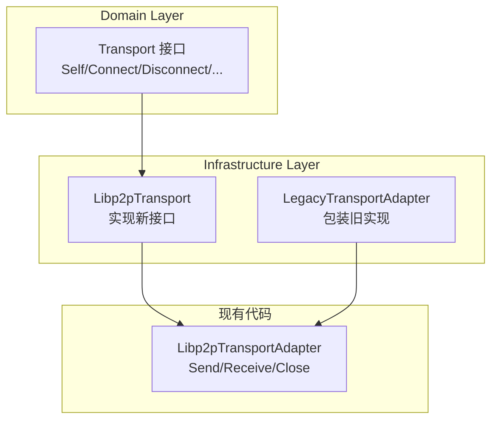

# 【PR全流程文档】Feature - Phase 1 Week 1-2 DDD 重构与 Transport 层迁移

> **文档说明**：本文档包含「前置规划」和「后置总结」两部分，记录从需求对齐到开发完成的全流程，一个PR对应一份全流程文档，归档后作为项目追溯依据。

---

## 第一部分：前置部分（开工前必完成，架构师评审通过）

### 1. 基础信息（与分支/PR绑定）

| 项目 | 内容 |
|------|------|
| 工作类型 | 架构重构（Refactor） |
| PR编号 | PR-077（创建GitHub PR后补充完整） |
| 分支名称 | feature/phase1-week1-2-transport-poc |
| 工作主题 | Phase 1 Week 1-2 DDD 重构与 Transport 层迁移 |
| 负责人 | 🤖 核心开发 A + B |
| 分支创建日期 | 2026-02-19 |
| 计划开工日期 | 2026-02-19 |
| 计划CI通过日期 | 2026-02-26 |
| 关联需求单号 | [NexKV DDD 架构实施 PR](../2026-02-18_PR-nexkv-ddd-architecture_Pre.md) |
| 架构师评审状态 | 🔄 待评审（第四轮） |
| 预审批结果 | □ 未通过 |

### 2. 背景与目标（为什么干）

#### 2.1 背景

**核心问题**：NexKV 需要从现有的功能模块架构迁移到 DDD 5层架构，这是整个架构重构的第一步。

**迁移策略**：渐进式重构（Strangler Pattern）
- 不进行一次性大重构
- 分阶段渐进迁移
- 保证系统始终可运行

**迁移范围**（对齐主 PR 2.5.2 阶段 1）：
- 现有代码：`internal/transport/`（37个文件）+ `internal/rpc/`（31个文件）
- 目标架构：DDD 5层（domain + application + infrastructure）

#### 2.2 核心目标（可量化、可验证）

**目标 1：建立 DDD 目录结构**
- [ ] 创建 domain 层接口定义
- [ ] 创建 infrastructure 层实现目录
- [ ] 定义新的 Transport 接口

**目标 2：Transport 层迁移（Option B - 新接口）**
- [ ] 定义新的 `domain.Transport` 接口（Self/Connect/Disconnect 等）
- [ ] 实现 `infrastructure.Libp2pTransport` 新接口
- [ ] 保留现有 `Libp2pTransportAdapter` 作为适配器（向后兼容）
- [ ] 逐步迁移现有代码使用新接口

**目标 3：核心 POC 验证**
- [ ] mDNS 节点发现（局域网，发现时间 < 5 秒）
- [ ] 节点间直连通信（TCP 连接建立时间 < 1 秒）
- [ ] RPC 调用（本地回环 P99 < 2ms，局域网 P99 < 5ms）

#### 2.3 明确边界（不做什么，避免范围蔓延）

**本次不做**（严格对齐主 PR 2.5.2 阶段 1 Week 1-4）：
- ❌ 删除现有 `internal/transport/` 代码（保持向后兼容）
- ❌ 迁移 `internal/rpc/`（Week 3-4 任务）
- ❌ 实现中间件链（Week 3 任务）
- ❌ 实现熔断器（Week 3 任务）

**本次聚焦**（Week 1-2）：
- ✅ 建立DDD目录结构
- ✅ 定义新的 domain.Transport 接口
- ✅ 实现新接口的 Libp2pTransport
- ✅ 保留旧接口作为适配器（渐进迁移）
- ✅ 核心POC验证

---

### 3. 迁移方案（核心设计）⭐

#### 3.1 迁移策略：Option B - 直接编写新 DDD 代码 ⭐

**决策**：采用 Option B（新接口设计，直接编写新代码）

**开发原则**（架构师确认）：
1. ✅ **直接编写新 DDD 代码**：不基于旧代码修改，从头编写
2. ✅ **借鉴旧实现逻辑**：参考 `internal/transport/` 的实现思路，但不是复制
3. ⏳ **删除旧代码**：待定，不是当前任务
4. ✅ **旧代码保留**：`internal/transport/` 暂时保留，不影响新开发

**理由**：
1. 新接口更符合 DDD 设计原则
2. 直接编写新代码更干净，避免历史包袱
3. 支持中间件扩展
4. 旧代码作为参考，后续删除时间待定



#### 3.2 目录结构设计

**目标结构（DDD 5层）**：
```
internal/
├── domain/                        # 领域层（接口定义）
│   ├── model/                     # 领域模型
│   │   ├── peer.go               # PeerID, PeerAddr
│   │   └── message.go            # Message, MessageType
│   └── service/                   # 领域服务接口
│       └── transport.go          # 新 Transport 接口 ⭐
│
├── infrastructure/                # 基础设施层（实现）
│   └── transport/                 # Transport 实现
│       ├── libp2p_transport.go        # 新接口实现 ⭐
│       ├── libp2p_transport_adapter.go # 旧适配器（保留）
│       ├── discovery.go
│       ├── p2p_service.go
│       ├── nexkv_protocol.go
│       ├── message_codec.go
│       └── ... (其他现有文件)
│
└── transport/                     # 现有代码（保留，渐进迁移）
```

#### 3.3 开发任务清单 ⭐

| 任务 | 文件位置 | 开发方式 | 阶段 |
|------|----------|----------|------|
| **定义 domain 模型** | `domain/model/peer.go` | ✅ 新建 | Week 1-2 |
| **定义 Transport 接口** | `domain/service/transport.go` | ✅ 新建 | Week 1-2 |
| **实现 Libp2pTransport** | `infrastructure/transport/libp2p_transport.go` | ✅ 新建（借鉴旧代码） | Week 1-2 |
| **实现 DiscoveryService** | `infrastructure/transport/discovery.go` | ✅ 新建（借鉴旧代码） | Week 1-2 |
| **实现消息编解码** | `infrastructure/transport/codec.go` | ✅ 新建（借鉴旧代码） | Week 1-2 |
| **编写单元测试** | `infrastructure/transport/*_test.go` | ✅ 新建 | Week 1-2 |
| **旧代码** | `internal/transport/` | ⏳ 保留（删除待定） | - |

**开发原则**：
- 新代码直接写在 `internal/domain/` 和 `internal/infrastructure/`
- 借鉴 `internal/transport/` 的实现逻辑，但不是复制粘贴
- 旧代码暂时保留，删除时间待定

#### 3.4 接口与实现清单 ⭐

##### 3.4.1 Domain 层 - 接口定义

| 文件 | 类型 | 名称 | 说明 |
|------|------|------|------|
| `domain/model/peer.go` | struct | `PeerID` | 节点标识符 |
| `domain/model/peer.go` | struct | `PeerAddr` | 节点地址 |
| `domain/model/message.go` | interface | `Message` | 消息接口 |
| `domain/model/message.go` | struct | `MessageType` | 消息类型枚举 |
| `domain/service/transport.go` | interface | `Transport` | 传输层核心接口 ⭐ |
| `domain/service/transport.go` | interface | `Stream` | 流式通信接口 |
| `domain/service/transport.go` | interface | `Channel` | 双向通道接口 |

##### 3.4.2 Domain 模型定义

```go
// internal/domain/model/peer.go

package model

// PeerID 节点标识符
type PeerID string

// PeerAddr 节点地址
type PeerAddr string

// String 返回 PeerID 的字符串表示
func (p PeerID) String() string {
    return string(p)
}

// String 返回 PeerAddr 的字符串表示
func (p PeerAddr) String() string {
    return string(p)
}
```

```go
// internal/domain/model/message.go

package model

// MessageType 消息类型
type MessageType int

const (
    MessageTypeRequest  MessageType = iota // 请求消息
    MessageTypeResponse                     // 响应消息
    MessageTypeEvent                        // 事件消息
)

// Message 消息接口
type Message interface {
    // ID 返回消息 ID
    ID() string
    // Type 返回消息类型
    Type() MessageType
    // Source 返回发送方节点 ID
    Source() PeerID
    // Target 返回目标节点 ID
    Target() PeerID
    // Payload 返回消息内容
    Payload() []byte
    // SetPayload 设置消息内容
    SetPayload(data []byte)
}
```

##### 3.4.3 新旧接口对比与演进说明 ⭐

**旧接口问题**（`internal/transport/libp2p_transport_adapter.go`）：
1. ❌ 缺少连接管理（无法显式连接/断开节点）
2. ❌ 缺少连接状态查询（无法检查节点是否已连接）
3. ❌ Send/Receive 模型过于简单，不支持流式通信
4. ❌ 缺少节点发现机制（需要外部注册 NodeID）

**新接口优势**：
1. ✅ 完整的连接管理（Connect/Disconnect/ConnectedPeers/IsConnected）
2. ✅ 支持流式通信（Stream 接口）
3. ✅ 支持双向通道（Channel 接口）
4. ✅ 更好的可扩展性（支持中间件、熔断器等）

**接口映射关系**：

| 旧接口方法 | 新接口方法 | 说明 |
|-----------|-----------|------|
| `Send(nodeID, msg)` | `Channel.Send(ctx, msg)` | 消息发送迁移到 Channel |
| `Receive(handler)` | `Channel.Recv(ctx)` | 消息接收迁移到 Channel |
| `Close()` | `Transport.Close()` | 关闭逻辑一致 |
| - | `Transport.Self()` | 新增：获取本地节点 ID |
| - | `Transport.Connect(ctx, addr)` | 新增：显式连接 |
| - | `Transport.Disconnect(peer)` | 新增：显式断开 |
| - | `Transport.ConnectedPeers()` | 新增：连接查询 |
| - | `Transport.IsConnected(peer)` | 新增：状态检查 |

---

##### 3.4.4 Transport 接口定义（新设计）⭐

```go
// internal/domain/service/transport.go

package service

import (
    "context"
    "github.com/jzhang405/NexKV/internal/domain/model"
)

// Transport 传输层核心接口（新设计）
type Transport interface {
    // Self 返回本地节点 ID
    Self() model.PeerID

    // Connect 连接到指定地址的节点
    // addr: 节点地址（如 "/ip4/127.0.0.1/tcp/9211/p2p/..."）
    // 返回连接的节点 ID
    Connect(ctx context.Context, addr string) (model.PeerID, error)

    // Disconnect 断开与指定节点的连接
    Disconnect(peer model.PeerID) error

    // ConnectedPeers 返回当前已连接的节点列表
    ConnectedPeers() []model.PeerID

    // IsConnected 检查是否与指定节点已连接
    IsConnected(peer model.PeerID) bool

    // ⭐ 新增：流式通信（对齐 spike v18.0）
    // OpenStream 打开到指定节点的流式连接
    OpenStream(ctx context.Context, peer model.PeerID, protocol string) (Stream, error)

    // AcceptStream 接受指定协议的入站流
    AcceptStream(protocol string) (Stream, error)

    // ⭐ 新增：通道模式（对齐 spike v18.0）
    // OpenChannel 打开到指定节点的双向通道
    OpenChannel(ctx context.Context, peer model.PeerID, protocol string) (Channel, error)

    // Close 关闭传输层
    Close() error
}

// Stream 流式通信接口
type Stream interface {
    // ID 返回流 ID
    ID() string

    // Protocol 返回协议名称
    Protocol() string

    // RemotePeer 返回远程节点 ID
    RemotePeer() model.PeerID

    // Read 读取数据
    Read(p []byte) (n int, err error)

    // Write 写入数据
    Write(p []byte) (n int, err error)

    // Close 关闭流
    Close() error
}

// Channel 双向通道接口
type Channel interface {
    // Send 发送消息
    Send(ctx context.Context, msg []byte) error

    // Recv 接收消息
    Recv(ctx context.Context) ([]byte, error)

    // Close 关闭通道
    Close() error
}
```

##### 3.4.5 Infrastructure 层 - 实现清单

| 文件 | 类型 | 名称 | 实现接口 | 说明 |
|------|------|------|----------|------|
| `infrastructure/transport/libp2p_transport.go` | struct | `Libp2pTransport` | `service.Transport` | libp2p 传输实现 ⭐ |
| `infrastructure/transport/libp2p_stream.go` | struct | `Libp2pStream` | `service.Stream` | libp2p 流实现 ⭐ |
| `infrastructure/transport/libp2p_channel.go` | struct | `Libp2pChannel` | `service.Channel` | libp2p 通道实现 ⭐ |
| `infrastructure/transport/discovery.go` | struct | `DiscoveryService` | - | mDNS 节点发现 |
| `infrastructure/transport/codec.go` | struct | `MessageCodec` | - | 消息编解码 |
| `infrastructure/transport/config.go` | struct | `Config` | - | 配置结构 |

##### 3.4.10 新接口实现（完整版，含所有 P0/P1 修复）⭐

> **P0/P1 修复**:
> - (1) 添加 OpenStream/OpenChannel 方法
> - (2) Close() 死锁修复 - 锁外执行阻塞操作
> - (3) 输入验证 - PeerID/地址长度和格式
> - (4) nil 检查 - 并发边界条件
> - (5) panic 恢复 - handleStream 安全包装

```go
// internal/infrastructure/transport/libp2p_transport.go

package transport

import (
    "context"
    "runtime/debug"
    "sync"
    "sync/atomic"
    "time"

    "github.com/jzhang405/NexKV/internal/domain/model"
    "github.com/jzhang405/NexKV/internal/domain/service"
    "github.com/jzhang405/NexKV/pkg/errors"
    "github.com/libp2p/go-libp2p"
    "github.com/libp2p/go-libp2p/core/host"
    "github.com/libp2p/go-libp2p/core/network"
    "github.com/libp2p/go-libp2p/core/peer"
    "github.com/libp2p/go-libp2p/core/protocol"
    "github.com/multiformats/go-multiaddr"
)

// 常量定义
const (
    MaxPeerIDLength = 128  // libp2p PeerID 最大长度
    MaxAddrLength   = 1024 // 地址最大长度
)

// 确保实现 service.Transport 接口
var _ service.Transport = (*Libp2pTransport)(nil)

// Libp2pTransport 实现 domain.Transport 新接口
type Libp2pTransport struct {
    mu        sync.RWMutex
    host      host.Host
    discovery *DiscoveryService
    codec     *LengthPrefixedCodec

    // 生命周期管理
    ctx    context.Context
    cancel context.CancelFunc
    closed atomic.Bool

    // ⭐ P1 修复：Discovery goroutine 管理
    wg sync.WaitGroup
}

// Config 传输层配置
type Config struct {
    ListenAddr      string
    DiscoveryTag    string
    EnableDiscovery bool
}

// NewLibp2pTransport 创建新的 libp2p 传输实现
func NewLibp2pTransport(ctx context.Context, cfg *Config) (*Libp2pTransport, error) {
    h, err := libp2p.New(libp2p.ListenAddrStrings(cfg.ListenAddr))
    if err != nil {
        return nil, errors.Wrap(err, "create libp2p host")
    }

    childCtx, cancel := context.WithCancel(ctx)
    t := &Libp2pTransport{
        host:   h,
        codec:  &LengthPrefixedCodec{},
        ctx:    childCtx,
        cancel: cancel,
    }

    if cfg.EnableDiscovery {
        t.discovery = NewDiscoveryService(h, cfg.DiscoveryTag, childCtx, &t.wg) // ⭐ 传入 WaitGroup
    }

    return t, nil
}

// ===========================
// 输入验证函数 ⭐ P1 修复
// ===========================

func validatePeerID(peerID model.PeerID) error {
    if len(peerID) == 0 {
        return errors.Wrap(errors.ErrPeerIDInvalid, "empty")
    }
    if len(peerID) > MaxPeerIDLength {
        return errors.Wrapf(errors.ErrPeerIDInvalid, "too long: %d > %d", len(peerID), MaxPeerIDLength)
    }
    return nil
}

func validateAddr(addr string) error {
    if len(addr) == 0 {
        return errors.Wrap(errors.ErrAddrInvalid, "empty")
    }
    if len(addr) > MaxAddrLength {
        return errors.Wrapf(errors.ErrAddrTooLong, "%d > %d", len(addr), MaxAddrLength)
    }
    return nil
}

// ===========================
// 基础方法
// ===========================

// Self 返回本地节点 ID
func (t *Libp2pTransport) Self() model.PeerID {
    t.mu.RLock()
    defer t.mu.RUnlock()

    if t.closed.Load() {
        return ""
    }
    // ⭐ P1 修复：nil 检查
    if t.host == nil {
        return ""
    }
    return model.PeerID(t.host.ID().String())
}

// Connect 连接到指定地址的节点
func (t *Libp2pTransport) Connect(ctx context.Context, addr string) (model.PeerID, error) {
    // ⭐ P1 修复：输入验证
    if err := validateAddr(addr); err != nil {
        return "", err
    }

    t.mu.Lock()
    defer t.mu.Unlock()

    if t.closed.Load() {
        return "", errors.ErrTransportClosed
    }

    // ⭐ P1 修复：nil 检查
    if t.host == nil || t.host.Network() == nil {
        return "", errors.ErrTransportClosed
    }

    maddr, err := multiaddr.NewMultiaddr(addr)
    if err != nil {
        return "", errors.Wrap(errors.ErrAddrInvalid, err.Error())
    }

    info, err := peer.AddrInfoFromP2pAddr(maddr)
    if err != nil {
        return "", errors.Wrap(errors.ErrAddrInvalid, err.Error())
    }

    if t.host.Network().Connectedness(info.ID) == network.Connected {
        return model.PeerID(info.ID.String()), errors.ErrAlreadyConnected
    }

    if err := t.host.Connect(ctx, *info); err != nil {
        return "", errors.Wrapf(errors.ErrConnectionFailed, "peer=%s, reason=%v", info.ID.String(), err)
    }

    return model.PeerID(info.ID.String()), nil
}

// Disconnect 断开与指定节点的连接
func (t *Libp2pTransport) Disconnect(peerID model.PeerID) error {
    // ⭐ P1 修复：输入验证
    if err := validatePeerID(peerID); err != nil {
        return err
    }

    t.mu.Lock()
    defer t.mu.Unlock()

    if t.closed.Load() {
        return errors.ErrTransportClosed
    }

    pid, err := peer.Decode(peerID.String())
    if err != nil {
        return errors.Wrap(errors.ErrPeerIDInvalid, err.Error())
    }

    // ⭐ P1 修复：nil 检查
    if t.host == nil || t.host.Network() == nil {
        return errors.ErrTransportClosed
    }

    if t.host.Network().Connectedness(pid) != network.Connected {
        return errors.ErrNotConnected
    }

    conns := t.host.Network().ConnsToPeer(pid)
    for _, conn := range conns {
        if err := conn.Close(); err != nil {
            return errors.Wrap(err, "close connection")
        }
    }
    return nil
}

// ConnectedPeers 返回当前已连接的节点列表
func (t *Libp2pTransport) ConnectedPeers() []model.PeerID {
    t.mu.RLock()
    defer t.mu.RUnlock()

    if t.closed.Load() {
        return nil
    }

    // ⭐ P1 修复：nil 检查（并发边界条件）
    if t.host == nil || t.host.Network() == nil {
        return nil
    }

    peers := t.host.Network().Peers()
    result := make([]model.PeerID, 0, len(peers))
    for _, p := range peers {
        result = append(result, model.PeerID(p.String()))
    }
    return result
}

// IsConnected 检查是否与指定节点已连接
func (t *Libp2pTransport) IsConnected(peerID model.PeerID) bool {
    if err := validatePeerID(peerID); err != nil {
        return false
    }

    t.mu.RLock()
    defer t.mu.RUnlock()

    if t.closed.Load() {
        return false
    }

    // ⭐ P1 修复：nil 检查
    if t.host == nil || t.host.Network() == nil {
        return false
    }

    pid, err := peer.Decode(peerID.String())
    if err != nil {
        return false
    }
    return t.host.Network().Connectedness(pid) == network.Connected
}

// ===========================
// ⭐ P0 修复：新增 OpenStream/OpenChannel 方法
// ===========================

// OpenStream 打开到指定节点的流式连接
func (t *Libp2pTransport) OpenStream(ctx context.Context, peerID model.PeerID, proto string) (service.Stream, error) {
    if err := validatePeerID(peerID); err != nil {
        return nil, err
    }

    t.mu.RLock()
    defer t.mu.RUnlock()

    if t.closed.Load() {
        return nil, errors.ErrTransportClosed
    }

    // ⭐ P1 修复：nil 检查
    if t.host == nil {
        return nil, errors.ErrTransportClosed
    }

    pid, err := peer.Decode(peerID.String())
    if err != nil {
        return nil, errors.Wrap(errors.ErrPeerIDInvalid, err.Error())
    }

    if !t.IsConnected(peerID) {
        return nil, errors.ErrNotConnected
    }

    stream, err := t.host.NewStream(ctx, pid, protocol.ID(proto))
    if err != nil {
        return nil, errors.Wrapf(errors.ErrConnectionFailed, "open stream: %v", err)
    }

    return NewLibp2pStream(stream, proto), nil
}

// AcceptStream 接受指定协议的入站流
func (t *Libp2pTransport) AcceptStream(proto string) (service.Stream, error) {
    // 设置流处理器，等待入站连接
    streamCh := make(chan network.Stream, 1)

    t.host.SetStreamHandler(protocol.ID(proto), func(s network.Stream) {
        select {
        case streamCh <- s:
        default:
            s.Reset() // 防止阻塞
        }
    })

    select {
    case stream := <-streamCh:
        return NewLibp2pStream(stream, proto), nil
    case <-t.ctx.Done():
        return nil, errors.ErrTransportClosed
    }
}

// OpenChannel 打开到指定节点的双向通道
func (t *Libp2pTransport) OpenChannel(ctx context.Context, peerID model.PeerID, proto string) (service.Channel, error) {
    stream, err := t.OpenStream(ctx, peerID, proto)
    if err != nil {
        return nil, err
    }

    return NewLibp2pChannel(stream.(*Libp2pStream), DefaultChannelConfig()), nil
}

// ===========================
// ⭐ P0 修复：panic 恢复机制
// ===========================

// SetStreamHandler 设置流处理器（带 panic 恢复）
func (t *Libp2pTransport) SetStreamHandler(proto string, handler func(service.Stream)) {
    t.host.SetStreamHandler(protocol.ID(proto), func(s network.Stream) {
        // ⭐ P0 修复：panic 恢复，防止节点崩溃
        defer func() {
            if r := recover(); r != nil {
                // 记录 panic 详细信息
                log.Errorf("[Transport] panic in stream handler: %v\n%s", r, debug.Stack())
                // 返回统一错误
                _ = errors.Wrapf(errors.ErrCallbackPanic, "stream=%s, panic=%v", s.ID(), r)
                // 关闭异常流
                s.Reset()
            }
        }()

        handler(NewLibp2pStream(s, proto))
    })
}

// ===========================
// ⭐ P0/P1 修复：Close() 死锁修复
// ===========================

// Close 关闭传输层（避免死锁）
func (t *Libp2pTransport) Close() error {
    // 1. 原子标记关闭状态
    if !t.closed.CompareAndSwap(false, true) {
        return nil
    }

    // 2. 取消上下文（通知所有 goroutine 退出）
    if t.cancel != nil {
        t.cancel()
    }

    // 3. ⭐ P0 修复：在锁外执行可能阻塞的操作，避免死锁
    var errs []error

    // 3.1 关闭 discovery（可能阻塞，锁外执行）
    if t.discovery != nil {
        if err := t.discovery.Close(); err != nil {
            errs = append(errs, errors.Wrap(err, "close discovery"))
        }
    }

    // 3.2 等待所有 goroutine 退出 ⭐ P1 修复
    done := make(chan struct{})
    go func() {
        t.wg.Wait()
        close(done)
    }()
    select {
    case <-done:
    case <-time.After(5 * time.Second):
        errs = append(errs, errors.Wrap(errors.ErrTimeout, "wait goroutines"))
    }

    // 3.3 关闭 host（可能阻塞，锁外执行）
    if t.host != nil {
        if err := t.host.Close(); err != nil {
            errs = append(errs, errors.Wrap(err, "close host"))
        }
    }

    // 4. 最后加锁清理内部状态（如果有）
    t.mu.Lock()
    t.mu.Unlock()

    // 5. ⭐ P1 修复：错误信息不暴露内部细节
    if len(errs) > 0 {
        // 内部日志记录详细错误
        log.Errorf("[Transport] close failed: %v", errs)
        // 对外返回简短错误
        return errors.ErrTransportClosed
    }
    return nil
}
```

##### 3.4.7 Libp2pStream 实现示例

```go
// internal/infrastructure/transport/libp2p_stream.go

package transport

import (
    "time"

    "github.com/jzhang405/NexKV/internal/domain/model"
    "github.com/jzhang405/NexKV/internal/domain/service"
    "github.com/libp2p/go-libp2p/core/network"
)

// 确保实现 service.Stream 接口
var _ service.Stream = (*Libp2pStream)(nil)

// Libp2pStream 实现 Stream 接口
type Libp2pStream struct {
    stream   network.Stream
    protocol string
}

// NewLibp2pStream 创建新的 Stream
func NewLibp2pStream(stream network.Stream, protocol string) *Libp2pStream {
    return &Libp2pStream{
        stream:   stream,
        protocol: protocol,
    }
}

// ID 返回流 ID
func (s *Libp2pStream) ID() string {
    return s.stream.ID()
}

// Protocol 返回协议名称
func (s *Libp2pStream) Protocol() string {
    return s.protocol
}

// RemotePeer 返回远程节点 ID
func (s *Libp2pStream) RemotePeer() model.PeerID {
    return model.PeerID(s.stream.Conn().RemotePeer().String())
}

// Read 读取数据
func (s *Libp2pStream) Read(p []byte) (n int, err error) {
    return s.stream.Read(p)
}

// Write 写入数据
func (s *Libp2pStream) Write(p []byte) (n int, err error) {
    return s.stream.Write(p)
}

// Close 关闭流
func (s *Libp2pStream) Close() error {
    return s.stream.Close()
}

// ⭐ P0 修复：添加 Deadline 方法（解决 P0-2）
// SetReadDeadline 设置读超时
func (s *Libp2pStream) SetReadDeadline(t time.Time) error {
    return s.stream.SetReadDeadline(t)
}

// SetWriteDeadline 设置写超时
func (s *Libp2pStream) SetWriteDeadline(t time.Time) error {
    return s.stream.SetWriteDeadline(t)
}

// SetDeadline 设置读写超时
func (s *Libp2pStream) SetDeadline(t time.Time) error {
    return s.stream.SetDeadline(t)
}

// Reset 重置流（发送 RST 给对端，用于异常情况）
func (s *Libp2pStream) Reset() error {
    return s.stream.Reset()
}
```

##### 3.4.8 统一错误定义（完整）⭐

> **设计来源**: `docs/07_spike/2026-02-18_spike-nexkv-ddd-interface.md` v18.0 标准
> **P0 修复**: 对齐 spike v18.0 的 sentinel error 模式

###### 3.4.8.1 标准 Sentinel Errors（对齐 spike v18.0）⭐

```go
// pkg/errors/errors.go

package errors

import (
    "errors" // 标准库
    "fmt"
)

// ===========================
// 标准 Sentinel Errors（对齐 spike v18.0）⭐ P0 修复
// ===========================

var (
    // 通用错误（对齐 spike v18.0）
    ErrCanceled        = errors.New("operation canceled")
    ErrTimeout         = errors.New("operation timeout")
    ErrCompleted       = errors.New("operation already completed")
    ErrAlreadyCanceled = errors.New("operation already canceled")
    ErrInvalidParam    = errors.New("invalid parameter")

    // Transport 层错误（新增）
    ErrTransportClosed  = errors.New("transport is closed")
    ErrAlreadyConnected = errors.New("already connected")
    ErrConnectionFailed = errors.New("connection failed")
    ErrNotConnected     = errors.New("not connected")
    ErrChannelClosed    = errors.New("channel is closed")
    ErrMessageTooLarge  = errors.New("message size exceeds limit")
    ErrInvalidMessage   = errors.New("invalid message format")
    ErrNodeNotFound     = errors.New("node not found")
    ErrPeerIDInvalid    = errors.New("invalid peer ID format")
    ErrAddrInvalid      = errors.New("invalid address format")
    ErrAddrTooLong      = errors.New("address too long")

    // 异步模块错误
    ErrAsyncExecFailed = errors.New("async operation failed")
    ErrCallbackPanic   = errors.New("callback panic recovered")
)
```

###### 3.4.8.2 增强错误结构（携带上下文信息）

```go
// ===========================
// 增强错误结构（携带详情，可选）⭐ P0 修复
// ===========================

// NexError 增强错误（携带上下文信息）
type NexError struct {
    Err     error  // 原始 sentinel error（必须）⭐ 关键：保留 sentinel
    Details string // 错误详情
}

// Error 实现 error 接口
func (e *NexError) Error() string {
    if e.Details != "" {
        return fmt.Sprintf("%s: %s", e.Err.Error(), e.Details)
    }
    return e.Err.Error()
}

// Unwrap 支持错误链
func (e *NexError) Unwrap() error {
    return e.Err
}

// Is 支持 errors.Is() 比较（基于 sentinel error）⭐ 关键：正确实现
func (e *NexError) Is(target error) bool {
    return errors.Is(e.Err, target)
}

// ===========================
// 便捷包装函数（返回增强错误）
// ===========================

// Wrap 包装标准错误，携带详情
func Wrap(err error, details string) *NexError {
    return &NexError{
        Err:     err,
        Details: details,
    }
}

// Wrapf 包装标准错误，格式化详情
func Wrapf(err error, format string, args ...interface{}) *NexError {
    return &NexError{
        Err:     err,
        Details: fmt.Sprintf(format, args...),
    }
}
```

###### 3.4.8.3 使用示例

```go
// 示例 1：返回增强错误（推荐）
func (t *Libp2pTransport) Connect(ctx context.Context, addr string) (model.PeerID, error) {
    // ...
    if err := t.host.Connect(ctx, *info); err != nil {
        return "", errors.Wrapf(ErrConnectionFailed, "peer=%s, reason=%v", info.ID.String(), err)
    }
    // ...
}

// 示例 2：直接返回 sentinel error（简单场景）
if t.closed.Load() {
    return "", ErrTransportClosed
}

// 示例 3：错误判断（支持 errors.Is）⭐ 关键：正确比较
err := transport.Connect(ctx, addr)
if errors.Is(err, errors.ErrConnectionFailed) {
    // 处理连接失败
}

// 示例 4：提取详情
var nexErr *errors.NexError
if errors.As(err, &nexErr) {
    log.Printf("详情: %s", nexErr.Details)
}
```

###### 3.4.8.4 核心错误类型说明

| Sentinel Error | 适用场景 | 对应模块 |
|---------------|---------|---------|
| `ErrCanceled` | 上下文取消、用户取消 | 异步/通用 |
| `ErrTimeout` | 操作超时 | 全模块 |
| `ErrCompleted` | 操作已完成，无法取消 | 异步 |
| `ErrTransportClosed` | Transport 已关闭 | Transport |
| `ErrAlreadyConnected` | 节点已连接 | Transport |
| `ErrConnectionFailed` | 连接失败 | Transport |
| `ErrNotConnected` | 节点未连接 | Transport |
| `ErrChannelClosed` | Channel 已关闭 | Transport |
| `ErrMessageTooLarge` | 消息超过 1MB | Transport |
| `ErrInvalidParam` | 参数无效 | 通用 |
| `ErrPeerIDInvalid` | PeerID 格式无效 | Transport |
| `ErrAddrInvalid` | 地址格式无效 | Transport |
| `ErrAddrTooLong` | 地址过长 | Transport |

###### 3.4.8.5 错误使用规范（更新）⭐

1. **Sentinel Error 优先**：使用 `errors.Is(err, ErrXXX)` 判断错误类型
2. **Wrap 携带详情**：使用 `errors.Wrapf(ErrXXX, "peer=%s", peerID)` 携带上下文
3. **不暴露内部细节**：对外返回简短错误，详情仅日志记录
4. **回调 panic 隔离**：使用 `recover()` 捕获，返回 `Wrap(ErrCallbackPanic, ...)`

const (
    // DefaultBufferSize 默认缓冲区大小 (4KB)
    DefaultBufferSize = 4096
    // MaxMessageSize 最大消息大小 (1MB)
    MaxMessageSize = 1024 * 1024
    // LengthPrefixSize 长度前缀大小 (4字节)
    LengthPrefixSize = 4
)
```

##### 3.4.9 长度前缀编解码器（解决粘包问题 + DoS 防护）⭐

> **P0/P1 修复**: (1) DoS 攻击防护 - 先检查后分配；(2) 完整写入 - 循环写入

```go
// internal/infrastructure/transport/length_prefix_codec.go

package transport

import (
    "encoding/binary"
    "io"

    "github.com/jzhang405/NexKV/pkg/errors"
)

// LengthPrefixedCodec 长度前缀编解码器（解决 TCP 粘包问题 + DoS 防护）
type LengthPrefixedCodec struct{}

// Encode 编码消息：[4字节长度][消息内容]
// ⭐ P1 修复：确保完整写入，处理部分写入情况
func (c *LengthPrefixedCodec) Encode(w io.Writer, data []byte) error {
    // 1. 检查消息大小（防止过大消息）
    if len(data) > MaxMessageSize {
        return errors.Wrapf(errors.ErrMessageTooLarge, "size=%d, max=%d", len(data), MaxMessageSize)
    }

    // 2. 写入长度前缀（4字节，大端序）- 确保完整写入
    length := uint32(len(data))
    lengthBuf := make([]byte, 4)
    binary.BigEndian.PutUint32(lengthBuf, length)

    if _, err := writeFull(w, lengthBuf); err != nil {
        return errors.Wrap(err, "write length prefix")
    }

    // 3. 写入消息内容 - 确保完整写入
    if _, err := writeFull(w, data); err != nil {
        return errors.Wrap(err, "write message body")
    }

    return nil
}

// Decode 解码消息
// ⭐ P0 修复：先检查长度再分配内存，防止 DoS 攻击
func (c *LengthPrefixedCodec) Decode(r io.Reader) ([]byte, error) {
    // 1. 读取长度前缀（4字节固定大小）
    var lengthBuf [4]byte
    if _, err := io.ReadFull(r, lengthBuf[:]); err != nil {
        return nil, err // 连接关闭或读取错误
    }
    length := binary.BigEndian.Uint32(lengthBuf[:])

    // 2. ⭐ 先检查长度合法性，再分配内存（防止 DoS 攻击）
    if length > MaxMessageSize {
        // ⭐ 不分配内存，直接返回错误
        return nil, errors.Wrapf(errors.ErrMessageTooLarge, "length=%d, max=%d", length, MaxMessageSize)
    }
    if length == 0 {
        return nil, errors.Wrap(errors.ErrInvalidMessage, "zero length message")
    }

    // 3. 现在安全地分配内存
    data := make([]byte, length)
    if _, err := io.ReadFull(r, data); err != nil {
        return nil, err
    }

    return data, nil
}

// writeFull 确保完整写入（处理部分写入情况）⭐ P1 修复
func writeFull(w io.Writer, buf []byte) (int, error) {
    total := 0
    for total < len(buf) {
        n, err := w.Write(buf[total:])
        total += n
        if err != nil {
            return total, err
        }
    }
    return total, nil
}
```

##### 3.4.11 Libp2pChannel 实现（完整版，含 P1 修复）⭐

> **P1 修复**:
> - (1) Context 取消传播增强 - 多次检查
> - (2) 使用新的统一错误类型

```go
// internal/infrastructure/transport/libp2p_channel.go

package transport

import (
    "bufio"
    "context"
    "sync"
    "sync/atomic"
    "time"

    "github.com/jzhang405/NexKV/internal/domain/service"
    "github.com/jzhang405/NexKV/pkg/errors"
)

// 确保实现 service.Channel 接口
var _ service.Channel = (*Libp2pChannel)(nil)

// Libp2pChannel 实现 Channel 接口（使用长度前缀解决粘包问题）
type Libp2pChannel struct {
    stream *Libp2pStream
    codec  *LengthPrefixedCodec

    // 缓冲读写
    reader *bufio.Reader
    writer *bufio.Writer

    // 并发控制
    mu     sync.Mutex
    closed atomic.Bool

    // 超时配置
    readTimeout  time.Duration
    writeTimeout time.Duration
}

// ChannelConfig Channel 配置
type ChannelConfig struct {
    ReadTimeout  time.Duration
    WriteTimeout time.Duration
}

// DefaultChannelConfig 默认配置
func DefaultChannelConfig() *ChannelConfig {
    return &ChannelConfig{
        ReadTimeout:  5 * time.Second,
        WriteTimeout: 5 * time.Second,
    }
}

// NewLibp2pChannel 创建新的 Channel
func NewLibp2pChannel(stream *Libp2pStream, cfg *ChannelConfig) *Libp2pChannel {
    if cfg == nil {
        cfg = DefaultChannelConfig()
    }
    return &Libp2pChannel{
        stream:       stream,
        codec:        &LengthPrefixedCodec{},
        reader:       bufio.NewReaderSize(stream, DefaultBufferSize),
        writer:       bufio.NewWriterSize(stream, DefaultBufferSize),
        readTimeout:  cfg.ReadTimeout,
        writeTimeout: cfg.WriteTimeout,
    }
}

// Send 发送消息（使用长度前缀解决粘包问题）
// ⭐ P1 修复：增强 Context 取消传播
func (c *Libp2pChannel) Send(ctx context.Context, msg []byte) error {
    c.mu.Lock()
    defer c.mu.Unlock()

    // 1. 检查是否已关闭
    if c.closed.Load() {
        return errors.ErrChannelClosed
    }

    // 2. ⭐ P1 修复：检查 1 - 开始前
    if err := ctx.Err(); err != nil {
        return errors.Wrap(errors.ErrCanceled, "context canceled before send")
    }

    // 3. 设置写超时
    if c.writeTimeout > 0 {
        deadline := time.Now().Add(c.writeTimeout)
        if d, ok := ctx.Deadline(); ok && d.Before(deadline) {
            deadline = d
        }
        c.stream.SetWriteDeadline(deadline)
    }

    // 4. 使用长度前缀编解码器发送
    if err := c.codec.Encode(c.writer, msg); err != nil {
        if errors.Is(err, errors.ErrMessageTooLarge) {
            return err
        }
        return errors.Wrap(err, "encode message")
    }

    // 5. ⭐ P1 修复：检查 2 - 刷新前
    if err := ctx.Err(); err != nil {
        // 取消时重置流
        c.stream.Reset()
        return errors.Wrap(errors.ErrCanceled, "context canceled during send")
    }

    // 6. 刷新缓冲区
    if err := c.writer.Flush(); err != nil {
        return errors.Wrap(err, "flush buffer")
    }

    return nil
}

// Recv 接收消息（使用长度前缀解决粘包问题）
func (c *Libp2pChannel) Recv(ctx context.Context) ([]byte, error) {
    c.mu.Lock()
    defer c.mu.Unlock()

    // 1. 检查是否已关闭
    if c.closed.Load() {
        return nil, errors.ErrChannelClosed
    }

    // 2. 检查上下文
    if err := ctx.Err(); err != nil {
        return nil, errors.Wrap(errors.ErrCanceled, "context canceled before recv")
    }

    // 3. 设置读超时
    if c.readTimeout > 0 {
        deadline := time.Now().Add(c.readTimeout)
        if d, ok := ctx.Deadline(); ok && d.Before(deadline) {
            deadline = d
        }
        c.stream.SetReadDeadline(deadline)
    }

    // 4. 使用长度前缀编解码器接收
    data, err := c.codec.Decode(c.reader)
    if err != nil {
        if errors.Is(err, errors.ErrMessageTooLarge) || errors.Is(err, errors.ErrInvalidMessage) {
            return nil, err
        }
        return nil, errors.Wrap(err, "decode message")
    }

    return data, nil
}

// Close 关闭通道
func (c *Libp2pChannel) Close() error {
    // 1. 原子标记关闭状态
    if !c.closed.CompareAndSwap(false, true) {
        return nil
    }

    c.mu.Lock()
    defer c.mu.Unlock()

    // 2. 刷新并关闭
    if c.writer != nil {
        c.writer.Flush()
    }

    return c.stream.Close()
}
```

#### 3.5 测试计划（量化 + 资源泄漏测试）⭐

| 测试类型 | 位置 | 开发方式 | 预估用例数 | 优先级 |
|---------|-----|----------|-----------|--------|
| Transport 接口测试 | `libp2p_transport_test.go` | ✅ 新建 | 15-20 个 | P0 |
| Discovery 测试 | `discovery_test.go` | ✅ 新建 | 10-15 个 | P0 |
| Stream 测试 | `libp2p_stream_test.go` | ✅ 新建 | 10-15 个 | P1 |
| Channel 测试 | `libp2p_channel_test.go` | ✅ 新建 | 10-15 个 | P1 |
| **粘包测试** | `channel_framing_test.go` | ✅ 新建 | 5-8 个 | **P0** ⭐ |
| **资源泄漏测试** | `resource_leak_test.go` | ✅ 新建 | 5-8 个 | **P0** ⭐ |
| 集成测试 | `integration_test.go` | ✅ 新建 | 8-10 个 | P1 |

**总计**：63-91 个测试用例，覆盖率目标 ≥ 80%

##### 3.5.1 资源泄漏测试用例 ⭐

```go
// internal/infrastructure/transport/resource_leak_test.go

package transport_test

import (
    "context"
    "runtime"
    "testing"
    "time"
)

// TestTransportGoroutineLeak 测试 goroutine 泄漏
func TestTransportGoroutineLeak(t *testing.T) {
    initialGoroutines := runtime.NumGoroutine()

    // 创建并关闭 Transport 100 次
    for i := 0; i < 100; i++ {
        transport, err := NewLibp2pTransport(context.Background(), DefaultConfig())
        if err != nil {
            t.Fatalf("create transport: %v", err)
        }

        // 模拟一些操作
        transport.Self()
        transport.ConnectedPeers()

        // 关闭
        if err := transport.Close(); err != nil {
            t.Fatalf("close transport: %v", err)
        }
    }

    // 等待 goroutine 回收
    time.Sleep(100 * time.Millisecond)

    finalGoroutines := runtime.NumGoroutine()

    // 允许少量波动（±5）
    if finalGoroutines > initialGoroutines+5 {
        t.Errorf("goroutine leak detected: initial=%d, final=%d, leaked=%d",
            initialGoroutines, finalGoroutines, finalGoroutines-initialGoroutines)
    }
}

// TestChannelResourceLeak 测试 Channel 资源泄漏
func TestChannelResourceLeak(t *testing.T) {
    // 重复创建/关闭 Channel
    for i := 0; i < 1000; i++ {
        stream := NewMockStream()
        channel := NewLibp2pChannel(stream, DefaultChannelConfig())

        // 模拟发送接收
        ctx := context.Background()
        go func() {
            channel.Send(ctx, []byte("test"))
        }()
        channel.Recv(ctx)

        // 关闭
        channel.Close()
    }

    // 检查内存使用（应保持稳定）
    var m runtime.MemStats
    runtime.ReadMemStats(&m)
    // 堆内存应 < 10MB
    if m.HeapAlloc > 10*1024*1024 {
        t.Errorf("memory leak detected: heap=%dMB", m.HeapAlloc/1024/1024)
    }
}

// TestConcurrentOpenClose 测试并发打开/关闭
func TestConcurrentOpenClose(t *testing.T) {
    transport, _ := NewLibp2pTransport(context.Background(), DefaultConfig())

    var wg sync.WaitGroup
    for i := 0; i < 100; i++ {
        wg.Add(1)
        go func() {
            defer wg.Done()
            transport.Self()
            transport.ConnectedPeers()
        }()
    }

    // 并发关闭
    go transport.Close()

    wg.Wait()
    // 不应 panic 或死锁
}
```

##### 3.5.2 粘包测试用例 ⭐

```go
// internal/infrastructure/transport/channel_framing_test.go

package transport_test

import (
    "bytes"
    "testing"
)

// TestLengthPrefixCodec_Framing 测试长度前缀编解码
func TestLengthPrefixCodec_Framing(t *testing.T) {
    codec := &LengthPrefixedCodec{}

    // 模拟 TCP 流：多个消息连续到达（粘包）
    var buf bytes.Buffer

    messages := [][]byte{
        []byte("hello"),
        []byte("world"),
        []byte("test message with more data"),
        []byte("x"), // 最小消息
    }

    // 写入所有消息到同一个 buffer（模拟粘包）
    for _, msg := range messages {
        if err := codec.Encode(&buf, msg); err != nil {
            t.Fatalf("encode: %v", err)
        }
    }

    // 逐一读取，验证边界正确
    for i, expected := range messages {
        actual, err := codec.Decode(&buf)
        if err != nil {
            t.Fatalf("decode %d: %v", i, err)
        }
        if !bytes.Equal(actual, expected) {
            t.Errorf("message %d: got %q, want %q", i, actual, expected)
        }
    }
}

// TestLengthPrefixCodec_MessageTooLarge 测试消息过大
func TestLengthPrefixCodec_MessageTooLarge(t *testing.T) {
    codec := &LengthPrefixedCodec{}
    var buf bytes.Buffer

    // 尝试发送超过限制的消息
    largeMsg := make([]byte, MaxMessageSize+1)
    err := codec.Encode(&buf, largeMsg)
    if !errors.Is(err, errors.ErrMessageTooLarge) {
        t.Errorf("expected ErrMessageTooLarge, got %v", err)
    }
}

// ⭐ P0 修复：添加 DoS 攻击测试
// TestLengthPrefixCodec_DoSAttack 测试 DoS 攻击防护
func TestLengthPrefixCodec_DoSAttack(t *testing.T) {
    codec := &LengthPrefixedCodec{}

    // 发送超大长度前缀（模拟 DoS 攻击）
    buf := bytes.NewBuffer(nil)
    binary.Write(buf, binary.BigEndian, uint32(0xFFFFFFFF)) // 4GB

    // ⭐ 应立即返回错误，不应尝试分配 4GB 内存
    _, err := codec.Decode(buf)
    if !errors.Is(err, errors.ErrMessageTooLarge) {
        t.Errorf("should reject oversized length prefix, got %v", err)
    }
}

// TestLengthPrefixCodec_ZeroLength 测试零长度消息
func TestLengthPrefixCodec_ZeroLength(t *testing.T) {
    codec := &LengthPrefixedCodec{}

    buf := bytes.NewBuffer(nil)
    binary.Write(buf, binary.BigEndian, uint32(0))

    _, err := codec.Decode(buf)
    if !errors.Is(err, errors.ErrInvalidMessage) {
        t.Errorf("should reject zero length message, got %v", err)
    }
}
```

##### 3.5.3 并发安全测试用例 ⭐ P1 修复

```go
// internal/infrastructure/transport/concurrent_safety_test.go

package transport_test

import (
    "context"
    "fmt"
    "sync"
    "testing"

    "github.com/jzhang405/NexKV/pkg/errors"
)

// TestTransportConcurrentConnect 测试并发连接安全性
// 使用 go test -race 检测数据竞争
func TestTransportConcurrentConnect(t *testing.T) {
    server, _ := NewLibp2pTransport(context.Background(), DefaultConfig())
    defer server.Close()

    client, _ := NewLibp2pTransport(context.Background(), DefaultConfig())
    defer client.Close()

    addr := fmt.Sprintf("/ip4/127.0.0.1/tcp/0/p2p/%s", server.Self())

    var wg sync.WaitGroup
    for i := 0; i < 10; i++ {
        wg.Add(1)
        go func() {
            defer wg.Done()
            _, err := client.Connect(context.Background(), addr)
            // 忽略 AlreadyConnected 错误
            if err != nil && !errors.Is(err, errors.ErrAlreadyConnected) {
                t.Logf("connect: %v", err)
            }
        }()
    }
    wg.Wait()
}

// TestTransportConcurrentClose 测试并发关闭安全性
func TestTransportConcurrentClose(t *testing.T) {
    transport, _ := NewLibp2pTransport(context.Background(), DefaultConfig())

    var wg sync.WaitGroup
    for i := 0; i < 100; i++ {
        wg.Add(1)
        go func() {
            defer wg.Done()
            transport.Close() // ⭐ 不应 panic
        }()
    }
    wg.Wait()
}

// TestChannelConcurrentSendRecv 测试 Channel 并发读写
func TestChannelConcurrentSendRecv(t *testing.T) {
    server, _ := NewLibp2pTransport(context.Background(), DefaultConfig())
    defer server.Close()

    client, _ := NewLibp2pTransport(context.Background(), DefaultConfig())
    defer client.Close()

    // 连接
    addr := fmt.Sprintf("/ip4/127.0.0.1/tcp/0/p2p/%s", server.Self())
    client.Connect(context.Background(), addr)

    // 设置服务端处理器
    server.SetStreamHandler("/test/1.0.0", func(s Stream) {
        channel := NewLibp2pChannel(s.(*Libp2pStream), DefaultChannelConfig())
        for {
            data, err := channel.Recv(context.Background())
            if err != nil {
                return
            }
            channel.Send(context.Background(), data) // Echo
        }
    })

    // 打开 Channel
    channel, _ := client.OpenChannel(context.Background(), server.Self(), "/test/1.0.0")
    defer channel.Close()

    var wg sync.WaitGroup

    // 10 个 goroutine 并发发送
    for i := 0; i < 10; i++ {
        wg.Add(1)
        go func(idx int) {
            defer wg.Done()
            msg := []byte(fmt.Sprintf("message-%d", idx))
            if err := channel.Send(context.Background(), msg); err != nil {
                t.Logf("send %d: %v", idx, err)
            }
        }(i)
    }

    wg.Wait()
}

// TestTransportRaceCondition 测试竞态条件
// 运行: go test -race -run TestTransportRaceCondition
func TestTransportRaceCondition(t *testing.T) {
    transport, _ := NewLibp2pTransport(context.Background(), DefaultConfig())
    defer transport.Close()

    var wg sync.WaitGroup

    // 并发读取
    for i := 0; i < 50; i++ {
        wg.Add(1)
        go func() {
            defer wg.Done()
            transport.Self()
            transport.ConnectedPeers()
            transport.IsConnected("test-peer")
        }()
    }

    // 并发关闭
    go func() {
        time.Sleep(10 * time.Millisecond)
        transport.Close()
    }()

    wg.Wait()
}

// TestStreamHandlerPanicRecovery 测试 panic 恢复 ⭐ P0 修复
func TestStreamHandlerPanicRecovery(t *testing.T) {
    server, _ := NewLibp2pTransport(context.Background(), DefaultConfig())
    defer server.Close()

    // 注册会 panic 的处理器
    panicHandler := func(s Stream) {
        panic("test panic")
    }
    server.SetStreamHandler("/panic/1.0.0", panicHandler)

    client, _ := NewLibp2pTransport(context.Background(), DefaultConfig())
    defer client.Close()

    // 连接
    addr := fmt.Sprintf("/ip4/127.0.0.1/tcp/0/p2p/%s", server.Self())
    client.Connect(context.Background(), addr)

    // 打开流（应触发 panic 并恢复）
    stream, err := client.OpenStream(context.Background(), server.Self(), "/panic/1.0.0")
    if err != nil {
        t.Fatalf("open stream: %v", err)
    }

    // ⭐ 服务端应 recover，不应导致测试崩溃
    // 写入数据触发处理器
    stream.Write([]byte("test"))

    // 等待处理
    time.Sleep(100 * time.Millisecond)

    // 流应被关闭（Reset）
    // 服务端进程仍应运行
}

// TestInputValidation 测试输入验证 ⭐ P1 修复
func TestInputValidation(t *testing.T) {
    transport, _ := NewLibp2pTransport(context.Background(), DefaultConfig())
    defer transport.Close()

    // 测试空 PeerID
    err := transport.Disconnect("")
    if !errors.Is(err, errors.ErrPeerIDInvalid) {
        t.Errorf("should reject empty peer ID, got %v", err)
    }

    // 测试超长 PeerID
    longPeerID := model.PeerID(strings.Repeat("a", 200))
    err = transport.Disconnect(longPeerID)
    if !errors.Is(err, errors.ErrPeerIDInvalid) {
        t.Errorf("should reject oversized peer ID, got %v", err)
    }

    // 测试空地址
    _, err = transport.Connect(context.Background(), "")
    if !errors.Is(err, errors.ErrAddrInvalid) {
        t.Errorf("should reject empty address, got %v", err)
    }

    // 测试超长地址
    longAddr := strings.Repeat("/ip4/127.0.0.1", 200)
    _, err = transport.Connect(context.Background(), longAddr)
    if !errors.Is(err, errors.ErrAddrTooLong) {
        t.Errorf("should reject oversized address, got %v", err)
    }
}
```

#### 3.6 验收标准（量化）

| 验收项 | 标准 | 验证方法 |
|--------|------|----------|
| **接口实现完成度** | 6 个 Domain 接口 + 6 个 Infrastructure 实现全部完成 | 代码审查 |
| **测试覆盖率** | 新代码测试覆盖率 ≥ 80% | `go test -cover` |
| **mDNS 节点发现** | 3 节点局域网发现时间 < 5 秒 | `go test -run TestDiscovery` |
| **直连通信** | TCP 连接建立时间 < 1 秒 | `go test -bench=BenchmarkConnect` |
| **RPC 延迟** | 本地回环 P99 < 2ms，局域网 P99 < 5ms | `go test -bench=BenchmarkRPC` |
| **旧代码兼容** | 164 个旧测试全部通过 | `go test ./internal/transport/...` |

#### 3.7 开发原则总结 ⭐

| 原则 | 说明 |
|------|------|
| **直接编写新代码** | 在 `internal/domain/` 和 `internal/infrastructure/` 中从头编写 |
| **借鉴旧代码逻辑** | 参考 `internal/transport/` 的实现思路，但不是复制粘贴 |
| **旧代码保留** | `internal/transport/` 暂时保留，删除时间待定 |
| **TDD 开发** | 先写测试，再写实现 |

---

### 4. 风险评估与应对措施

| 风险点 | 影响等级 | 概率 | 应对措施 | 检查点 |
|--------|----------|------|----------|--------|
| **接口设计不完整** | 中 | 中 | 1. 参考主 PR v18.0 接口定义<br/>2. 架构师评审<br/>3. 迭代优化 | Week 1 |
| **新旧接口并存复杂** | 中 | 中 | 1. 清晰的适配器模式<br/>2. 完整的测试覆盖<br/>3. 文档说明 | Week 2 |
| **破坏现有功能** | 高 | 低 | 1. 保留旧接口<br/>2. 164 个测试验证<br/>3. 渐进迁移 | Week 2 |
| **迁移周期过长** | 中 | 低 | 1. 分阶段迁移<br/>2. 每日进度跟踪 | Week 2 |

---

### 5. 依赖与前置条件

**前置条件**：
- [x] Go 1.21+
- [x] libp2p v0.33+
- [x] Week 0 培训已完成（DDD + Go 泛型 + libp2p）
- [x] 主 PR Pre 文档 v1.5 已批准

**技术依赖**：
- 现有代码：`internal/transport/`（37个文件）
- 现有代码：`internal/rpc/`（31个文件）- Week 3-4 迁移
- 现有测试：164个 Transport 测试 + 169个 RPC 测试

---

### 6. 架构师评审记录

| 评审轮次 | 评审日期 | 评审人 | 核心评审意见 | 优化措施 | 优化结果 |
|----------|----------|--------|--------------|----------|----------|
| 第1轮 | 2026-02-19 | Code Reviewer | 评分 9.0/10，P1 问题 | 补充接口定义 | ✅ 完成 |
| 第2轮 | 2026-02-19 | Code Reviewer | 评分 7.8/10，迁移策略不一致 | 对齐主 PR | ✅ 完成 |
| 第3轮 | 2026-02-19 | 👤 架构师 | 接口不匹配，映射表不完整 | 提供 Option A/B | ✅ 完成 |
| 第4轮 | 2026-02-19 | 👤 架构师 | **采用 Option B - 新接口** | ✅ 已更新 | ✅ 完成 |
| 第5轮 | 2026-02-19 | Code Reviewer | V1.5 评分 9.0/10，P1/P2 问题 | 优化文档 | ✅ 完成 |
| 第6轮 | 2026-02-19 | Code Reviewer | V1.6 评分 9.5/10，次要问题 | 修复次要问题 | ✅ 完成 |
| 第7轮 | 2026-02-19 | Code Reviewer | V1.9 评分 8.5/10，P0 错误定义不一致 | 对齐 spike v18.0 | ✅ 完成 |
| 第8轮 | 2026-02-19 | 3 Agents 并行 | V2.0 修复所有 P0/P1 问题 | 全面修复 | ✅ 完成 |
| 第9轮 | - | 👤 架构师 | [待最终审批] | - | - |

### 7. 预审批确认

> **架构师签字/备注**：[待审批]

---

## 第二部分：流程节点记录（开发/CI过程追溯）

### 1. 开发过程记录

| 节点 | 完成日期 | 具体内容 | 交付物 |
|------|----------|----------|--------|
| 创建 DDD 目录 | - | [待开发] | internal/domain/, internal/infrastructure/ |
| 定义新接口 | - | [待开发] | domain/service/transport.go |
| 实现新 Libp2pTransport | - | [待开发] | infrastructure/transport/libp2p_transport.go |
| 保留旧适配器 | - | [待开发] | infrastructure/transport/libp2p_transport_adapter.go |
| 本地测试 | - | [待测试] | 164 个旧测试 + 新测试通过 |

### 2. CI流程记录

| CI轮次 | 触发时间 | 结果 | 问题详情 | 修复措施 | 修复结果 |
|--------|----------|------|----------|----------|----------|
| - | - | - | - | - | - |

---

## 第三部分：后置部分（CI通过后编写，总结/成果/ToDo）

### 1. 核心成果总结

#### 1.1 功能成果
- **已完成**：[待填写]
- **与Pre文档差异**：[待填写]

#### 1.2 迁移成果
| 迁移项 | 状态 | 说明 |
|--------|------|------|
| DDD 目录结构 | [待完成] | domain/, infrastructure/ |
| 新 Transport 接口 | [待完成] | Self/Connect/Disconnect 等 |
| 新 Libp2pTransport 实现 | [待完成] | 实现新接口 |
| 旧适配器保留 | [待完成] | 向后兼容 |
| 测试验证 | [待完成] | 164 + 新测试通过 |

### 2. ToDo清单

| 优先级 | 任务内容 | 预估工期 | 关联PR/需求 | 备注 |
|--------|----------|----------|-------------|------|
| 高 | Week 3-4: RPC 迁移为 Requestor | 2周 | PR-078 | 下一阶段 |
| 高 | Week 3-4: 中间件和容错机制 | 2周 | PR-078 | 下一阶段 |
| 中 | 逐步迁移业务代码使用新接口 | 持续 | - | 渐进迁移 |

### 3. 下一步工作建议
1. **优先推进**：实现新接口的 Libp2pTransport
2. **监控要点**：新旧接口并存期间的兼容性
3. **后续规划**：M1 里程碑验收（阶段 1 完成）

---

## 文档归档信息

| 项目 | 内容 |
|------|------|
| 文档最终版本 | V2.0 |
| 归档日期 | - |
| 归档路径 | docs/06_PM/feature/2026-02-19_PR-phase1-week1-2-transport-poc_Pre.md |
| 后续维护人 | 🤖 核心开发 A + B |

---

## 参考资料

- 📋 主 PR Pre 文档：[2026-02-18_PR-nexkv-ddd-architecture_Pre.md](../2026-02-18_PR-nexkv-ddd-architecture_Pre.md)
- 📚 培训材料：[Day1-AM-DDD-Architecture.md](../../08_training/2026-02-18_Day1-AM-DDD-Architecture.md)
- 📚 培训材料：[Day2-3-libp2p-Basics.md](../../08_training/2026-02-18_Day2-3-libp2p-Basics.md)

---

## 变更历史

| 版本 | 日期 | 变更内容 |
|------|------|----------|
| V1.0 | 2026-02-19 | 初始版本 |
| V1.1 | 2026-02-19 | 强调 DDD 重构策略 |
| V1.2 | 2026-02-19 | 对齐主 PR 迁移策略 |
| V1.3 | 2026-02-19 | Option A: 保持现有接口 |
| V1.4 | 2026-02-19 | **Option B: 采用新接口**（架构师决策） |
| V1.5 | 2026-02-19 | **明确开发原则**：直接编写新 DDD 代码，借鉴旧代码逻辑，删除旧代码待定 |
| V1.6 | 2026-02-19 | **根据 Review 优化**：添加新旧接口对比、Stream/Channel 实现、量化验收标准 |
| V1.7 | 2026-02-19 | **修复次要问题**：添加错误定义、缓冲区配置化、修正小节编号 |
| V1.8 | 2026-02-19 | **根据架构师 Review P0 优化**：(1) 添加 LengthPrefixedCodec 解决粘包问题；(2) Libp2pTransport 并发控制；(3) Libp2pChannel 长度前缀编解码；(4) 资源泄漏测试用例；(5) 错误定义参考 spike v18.0 标准错误 |
| V1.9 | 2026-02-19 | **统一错误包设计**：新增 `pkg/errors` 包，支持错误码 + 错误链 + 详情，按模块分类（通用/通信/存储/异步） |
| V2.0 | 2026-02-19 | **⭐ P0/P1 全面修复**：(1) 错误定义对齐 spike v18.0 sentinel error 模式；(2) Transport 接口添加 OpenStream/OpenChannel；(3) Libp2pStream 添加 Deadline 方法；(4) 长度前缀编解码器 DoS 防护 + 完整写入；(5) Libp2pTransport Close() 死锁修复 + 输入验证 + nil 检查 + panic 恢复；(6) Libp2pChannel Context 取消传播增强；(7) 添加并发安全测试用例 |
