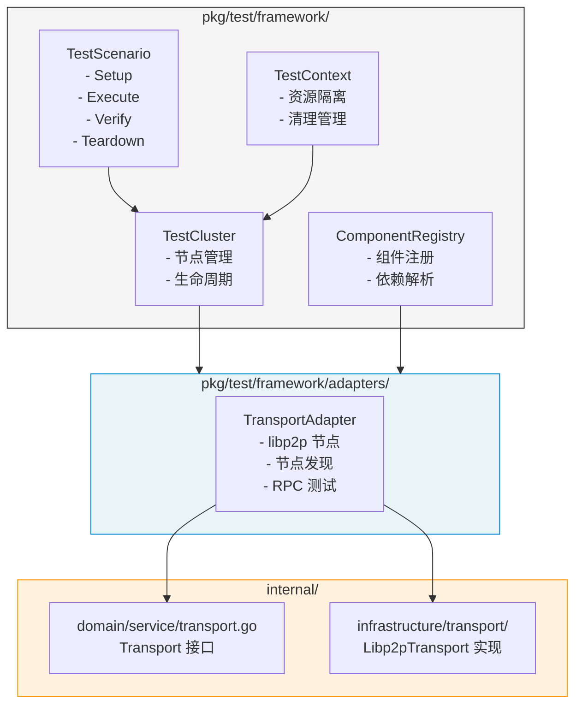

# 【PR全流程文档】Feature - 集成测试框架实施

> **文档说明**：本文档包含「前置规划」和「后置总结」两部分，记录从需求对齐到开发完成的全流程，一个PR对应一份全流程文档，归档后作为项目追溯依据。

---

## 与 Spike 文档的差异说明 ⭐ v1.2 审核补充

> 本 Pre 文档基于 [Spike v2.10](../../07_spike/2026-02-20_transport-poc-integration-test-framework.md)，在以下方面做了有意偏离：

| 方面 | Spike 文档 | Pre 文档 | 偏离原因 |
|------|------------|----------|----------|
| **目录结构** | `internal/infrastructure/transport/test/` | `pkg/test/framework/` | 支持独立的可复用测试框架包 |
| **接口设计** | `GetType()` 仅此方法 | 补充 `Init()` + `HealthCheck()` | 更完整的生命周期管理 |
| **依赖类型** | `[]ComponentType`（type-safe） | `[]string`（原设计） | **v1.2 修正**：采用 Spike 的 type-safe 设计 |
| **测试命名** | 未统一 | `Test{Component}_{Scenario}_{Expected}` | 统一命名规范 |

---

## 第一部分：前置部分（开工前必完成，架构师评审通过）

### 1. 基础信息（与分支/PR绑定）

| 项目 | 内容 |
|------|------|
| 工作类型 | Feature（新功能） |
| PR编号 | PR-081（[#81](https://github.com/jzhang405/NexKV/pull/81)） |
| 分支名称 | feature/integration-test-framework-implementation |
| 工作主题 | 集成测试框架实施（基于 Spike 成果） |
| 负责人 | 🤖 核心开发 A + 测试工程师 |
| 分支创建日期 | 2026-02-21 |
| 计划开工日期 | 2026-02-21 |
| 计划CI通过日期 | 2026-03-14（3周）⭐ v1.1 评审调整 |
| 关联需求单号 | [NexKV DDD 架构实施 PR](./2026-02-18_PR-nexkv-ddd-architecture_Pre.md) |
| 关联里程碑 | [M1 - 基础设施层验收](../milestones/2026-02-20_M1-infrastructure-layer-acceptance.md) |
| Spike 文档 | [集成测试框架设计 v2.10](../../07_spike/2026-02-20_transport-poc-integration-test-framework.md) |
| 架构师评审状态 | 🔄 评审中（v1.2 修复中）⭐ |
| 预审批结果 | ⏳ 待定 |

---

### 2. 背景与目标（为什么干）

#### 2.1 背景

**核心问题**：M1 里程碑验收报告显示测试覆盖率为 **67.2%**，未达 80% 目标。

**覆盖率目标说明** ⭐ v1.2 审核补充：
- **最低目标**：75%（本 PR 必须达到）
- **理想目标**：80%（后续持续优化）
- 本 PR 聚焦于框架实现和基础测试用例，覆盖率 75% 为最低验收标准

**低覆盖原因**：
| 模块 | 覆盖率 | 原因 |
|------|--------|------|
| `libp2p_channel.go` | 0% | 需要真实 libp2p 网络环境 |
| `libp2p_discovery.go` | 0% | 需要 mDNS 节点发现环境 |
| `libp2p_stream.go` 部分方法 | 0% | 需要真实网络流 |
| `libp2p_rpc.go:HandleIncomingStream` | 低 | 需要完整流处理链 |

**解决方案**：通过集成测试框架，在真实 libp2p 环境中测试这些场景。

#### 2.2 核心目标（可量化、可验证）

**目标 1：实施集成测试框架核心**
- [ ] `pkg/test/framework/cluster.go` - TestCluster 实现
- [ ] `pkg/test/framework/component.go` - TestComponent 接口
- [ ] `pkg/test/framework/registry.go` - ComponentRegistry 实现
- [ ] `pkg/test/framework/scenario.go` - TestScenario 接口
- [ ] `pkg/test/framework/context.go` - TestContext 实现

**目标 2：实现 Transport 适配器**
- [ ] `pkg/test/framework/adapters/transport_adapter.go` - Transport TestAdapter
- [ ] 支持 mDNS 节点发现测试
- [ ] 支持多节点集群通信测试
- [ ] 支持网络分区模拟

**目标 3：补充测试覆盖率**
- [ ] `libp2p_channel.go` 覆盖率提升到 60%+
- [ ] `libp2p_discovery.go` 覆盖率提升到 60%+
- [ ] `libp2p_stream.go` 覆盖率提升到 70%+
- [ ] 整体 Transport 层覆盖率提升到 75%+

**目标 4：CI/CD 集成**
- [ ] 添加 `make integration-test` 命令
- [ ] GitHub Actions 集成测试 Job
- [ ] 测试报告输出（JUnit XML 格式）

#### 2.3 明确边界（不做什么，避免范围蔓延）

**本次不做**（Phase 2 任务）：
- ❌ Storage 适配器（待 Bf-Tree 迁移后）
- ❌ Replication 适配器（待 Phase 3）
- ❌ Cluster 适配器（待 Phase 4）
- ❌ 性能基准测试框架（Week 3-4 任务）

**本次聚焦**（Phase 1 Week 1-3）⭐ v1.1 评审调整：
- ✅ 集成测试框架核心实现
- ✅ Transport 适配器实现
- ✅ 3 节点集群通信测试
- ✅ 网络分区模拟测试

---

### 3. 技术方案

#### 3.1 架构设计

基于 Spike 文档 v2.10 的设计方案，核心架构如下：



#### 3.2 目录结构 ⭐ v1.1 评审补充说明

**目录职责说明**：
- `pkg/test/framework/`：**可复用的测试框架代码**，可被其他项目引用
- `test/integration/`：**NexKV 专属的集成测试用例**，使用框架编写

```
pkg/test/
└── framework/                     # 可复用测试框架（可独立发布）
    ├── cluster.go                 # TestCluster 实现
    ├── component.go               # TestComponent 接口
    ├── registry.go                # ComponentRegistry 实现
    ├── scenario.go                # TestScenario 接口 + ScenarioExecutor
    ├── context.go                 # TestContext 实现
    ├── data_generator.go          # 测试数据生成器
    ├── metrics.go                 # 分布式系统指标
    ├── network_partition.go       # 网络分区控制器
    ├── cleanup.go                 # 资源清理管理
    ├── logger.go                  # 统一日志输出
    └── adapters/
        └── transport_adapter.go   # Transport 适配器

test/integration/                  # NexKV 专属集成测试
├── transport_test.go              # Transport 集成测试入口
└── scenarios/
    ├── two_nodes_connect.go       # TestTransport_TwoNodesConnect_Success
    ├── three_nodes_cluster.go     # TestTransport_ThreeNodesCluster_Success
    └── network_partition.go       # TestTransport_NetworkPartition_Reconnect
```

#### 3.3 核心接口设计 ⭐ v1.2 审核修正

基于 Spike 文档，核心接口定义如下（对齐 Spike 的 type-safe 设计）：

```go
// ComponentType 组件类型枚举（type-safe）⭐ v1.2 采用 Spike 设计
type ComponentType int

const (
    ComponentTypeTransport ComponentType = iota
    ComponentTypeStorage
    ComponentTypeReplication
    ComponentTypeCluster
)

// TestComponent 可测试组件接口 ⭐ v1.2 补充 Init/HealthCheck
type TestComponent interface {
    // 基础信息
    GetName() string
    GetType() ComponentType          // ⭐ type-safe 设计
    GetDependencies() []ComponentType // ⭐ type-safe 设计

    // 生命周期管理
    Init(ctx context.Context) error   // ⭐ v1.2 补充
    Start(ctx context.Context) error
    Stop(ctx context.Context) error

    // 健康检查
    IsReady(ctx context.Context) bool
    HealthCheck(ctx context.Context) error // ⭐ v1.2 补充
}

// TestCluster 测试集群接口
type TestCluster interface {
    AddNode(config NodeConfig) (TestNode, error)
    RemoveNode(nodeID string) error
    GetNode(nodeID string) (TestNode, error)
    WaitForReady(ctx context.Context, timeout time.Duration) error
    Cleanup() error
}

// TestScenario 测试场景接口
type TestScenario interface {
    Name() string
    Setup(ctx context.Context, cluster TestCluster) error
    Execute(ctx context.Context, cluster TestCluster) error
    Verify(ctx context.Context, cluster TestCluster) error
    Teardown(ctx context.Context, cluster TestCluster) error
}
```

**与 Spike 文档对齐** ⭐：
- `GetType()` 返回 `ComponentType` 而非 `string`
- `GetDependencies()` 返回 `[]ComponentType` 而非 `[]string`
- 补充 `Init()` 方法用于初始化
- 补充 `HealthCheck()` 方法用于深度健康检查

**错误处理策略** ⭐ v1.1 评审补充：

| 场景 | 策略 | 说明 |
|------|------|------|
| `Start()` 失败 | **Fail Fast** | 立即返回错误，不重试 |
| `Stop()` 失败 | **记录日志 + 继续** | 不影响其他组件停止 |
| `IsReady()` 超时 | **返回 false** | 由调用方决定是否重试 |
| 依赖组件未就绪 | **等待 + 超时** | 等待依赖组件启动，超时后失败 |

```go
// Start 实现示例（Fail Fast 策略）
func (c *TransportAdapter) Start(ctx context.Context) error {
    if err := c.transport.Start(ctx); err != nil {
        // Fail Fast: 不重试，直接返回错误
        return fmt.Errorf("transport start failed: %w", err)
    }
    return nil
}
```

#### 3.4 实施计划（3 周）⭐ v1.1 评审调整

| 阶段 | 时间 | 任务 | 产出 |
|------|------|------|------|
| **Week 1** | Day 1-2 | 框架核心实现 | cluster.go, component.go, registry.go |
| | Day 3-4 | Scenario + Context | scenario.go, context.go, cleanup.go |
| | Day 5 | 数据生成器 + 指标 | data_generator.go, metrics.go |
| **Week 2** | Day 1-3 | Transport 适配器 | transport_adapter.go + 网络分区实现 |
| | Day 4-5 | 集成测试用例 | two_nodes_connect.go, three_nodes_cluster.go |
| **Week 3** | Day 1-2 | 网络分区测试 | network_partition.go |
| | Day 3-4 | CI 集成 | Makefile, GitHub Actions |
| | Day 5 | 缓冲 + 验证 | 处理环境差异问题 |

**调整说明** ⭐：
- 框架核心涉及多个组件，需要更充分的开发时间
- Transport 适配器与真实 libp2p 集成，调试时间较长
- CI 环境差异问题通常需要额外时间解决
- Week 3 Day 5 作为缓冲，处理意外问题

---

### 4. 风险评估与缓解

#### 4.1 技术风险

| 风险 | 概率 | 影响 | 缓解措施 |
|------|------|------|---------|
| **网络分区实现困难** | 中 | 高 | 使用 Transport 层的消息拦截器，而非 iptables |
| **端口冲突** | 中 | 中 | 使用动态端口分配，或 `--parallel=1` 串行执行 |
| **Goroutine 泄漏** | 中 | 高 | 参考 Spike 文档 v2.8 修复方案，使用 ants 池 |
| **测试目录残留** | 低 | 低 | 使用 NEXKV_BASE_DIR + UUIDv7 test-id |

#### 4.2 进度风险

| 风险 | 概率 | 影响 | 缓解措施 |
|------|------|------|---------|
| **libp2p 行为不一致** | 中 | 中 | 先在本地验证，再提交 CI |
| **CI 环境差异** | 中 | 中 | 添加环境检测，跳过不支持的场景 |

#### 4.3 关键决策点

1. **网络分区实现方式**：
   - 选项 A：Transport 层消息拦截器（推荐）
   - 选项 B：iptables 防火墙规则（不推荐，需要 root 权限）
   - 选项 C：自定义 Transport 包装器

2. **并发控制**：
   - 使用 ants Goroutine 池（推荐，参见 Spike 文档 v2.7）
   - 避免无限制的 goroutine 创建

#### 4.4 网络分区实现细节 ⭐ v1.1 评审补充

```go
// NetworkPartitionController 网络分区控制器
type NetworkPartitionController struct {
    partitionID  string
    mu           sync.RWMutex
    blockedPeers map[peer.ID]bool

    // 消息拦截器：返回 nil 表示丢弃消息
    interceptor func(from, to peer.ID, msg []byte) ([]byte, error)
}

// NewNetworkPartitionController 创建分区控制器
func NewNetworkPartitionController(partitionID string) *NetworkPartitionController {
    return &NetworkPartitionController{
        partitionID:  partitionID,
        blockedPeers: make(map[peer.ID]bool),
        interceptor: func(from, to peer.ID, msg []byte) ([]byte, error) {
            return msg, nil // 默认放行
        },
    }
}

// BlockPeer 阻塞指定节点的消息
func (c *NetworkPartitionController) BlockPeer(peerID peer.ID) {
    c.mu.Lock()
    defer c.mu.Unlock()
    c.blockedPeers[peerID] = true

    // 更新拦截器
    c.interceptor = func(from, to peer.ID, msg []byte) ([]byte, error) {
        if c.blockedPeers[from] || c.blockedPeers[to] {
            return nil, fmt.Errorf("network partition: peer %s blocked", peerID)
        }
        return msg, nil
    }
}

// HealPartition 恢复分区
func (c *NetworkPartitionController) HealPartition() {
    c.mu.Lock()
    defer c.mu.Unlock()
    c.blockedPeers = make(map[peer.ID]bool)
    c.interceptor = func(from, to peer.ID, msg []byte) ([]byte, error) {
        return msg, nil
    }
}
```

**使用示例**：
```go
// 在 TransportAdapter 中集成
func (a *TransportAdapter) SetPartitionController(ctrl *NetworkPartitionController) {
    a.transport.SetMessageInterceptor(ctrl.interceptor)
}

// 测试中使用
func TestTransport_NetworkPartition_Reconnect(t *testing.T) {
    cluster := framework.NewTestCluster()
    defer cluster.Cleanup()

    // 创建 3 节点集群
    node1, _ := cluster.AddNode(config1)
    node2, _ := cluster.AddNode(config2)
    node3, _ := cluster.AddNode(config3)

    // 创建分区控制器
    partition := framework.NewNetworkPartitionController("partition-1")

    // 模拟网络分区：隔离 node3
    partition.BlockPeer(node3.ID())
    node1.SetPartitionController(partition)
    node2.SetPartitionController(partition)

    // 验证：node1, node2 能通信，node3 被隔离
    // ...

    // 恢复分区
    partition.HealPartition()

    // 验证：所有节点恢复正常通信
    // ...
}
```

---

### 5. 验收标准

#### 5.1 功能验收

| 验收项 | 验收标准 | 验证方法 |
|--------|---------|---------|
| TestCluster | 能创建/销毁多节点集群 | 单元测试 |
| TransportAdapter | 能包装 Libp2pTransport | 集成测试 |
| 两节点连接 | 节点 A 能连接节点 B | `TestTransport_TwoNodesConnect_Success` |
| 三节点集群 | 3 节点能互相发现和通信 | `TestTransport_ThreeNodesCluster_Success` |
| 网络分区 | 模拟分区后恢复 | `TestTransport_NetworkPartition_Reconnect` |

#### 5.2 质量验收

| 验收项 | 验收标准 |
|--------|---------|
| `make lint` | 0 issues |
| `make test` | 全部通过 |
| `make test-race` | 无竞态检测 |
| 测试覆盖率 | Transport 层 ≥ 75% |

#### 5.3 CI 验收

| 验收项 | 验收标准 |
|--------|---------|
| `make integration-test` | 能在 CI 环境执行 |
| GitHub Actions | 集成测试 Job 通过 |
| 测试报告 | JUnit XML 格式输出 |

#### 5.4 性能基准 ⭐ v1.1 评审补充

| 指标 | 目标 | 说明 |
|------|------|------|
| 测试启动时间 | < 5s | 3 节点集群启动 |
| 内存占用 | < 100MB | 单测试进程 |
| 并发测试 | 支持 4 并行 | CI 环境 |
| 单测试超时 | 30s | 防止 hung 测试 |

---

### 5.5 调试指南 ⭐ v1.1 评审补充

#### 本地调试

```bash
# 1. 运行单个测试（详细输出）
go test -v ./test/integration/... -run TestTransport_TwoNodesConnect_Success

# 2. 查看 libp2p 调试日志
NEXKV_LOG_LEVEL=debug go test -v ./test/integration/...

# 3. 保留测试目录（不自动清理）
NEXKV_KEEP_TEST_DIR=1 go test -v ./test/integration/...

# 4. 使用动态端口（避免端口冲突）
NEXKV_DYNAMIC_PORT=1 go test -v ./test/integration/...

# 5. 串行执行（调试时推荐）
go test -v ./test/integration/... -parallel 1
```

#### 清理残留资源

```bash
# 清理测试目录
rm -rf /tmp/nexkv-test-*

# 清理 Docker 资源（如使用）
docker system prune -f

# 检查端口占用
lsof -i :10000-10100
```

#### 常见问题排查

| 症状 | 可能原因 | 解决方案 |
|------|----------|----------|
| 节点发现超时 | mDNS 广播失败 | 使用静态 bootstrap 列表 |
| RPC 调用失败 | 节点未就绪 | 增加 `WaitForReady` 超时 |
| 测试目录残留 | 测试崩溃 | 手动清理或 `GlobalCleanup` |
| 端口冲突 | 多测试并行 | 使用动态端口或串行执行 |

---

### 6. 依赖与资源

#### 6.1 外部依赖

| 依赖 | 版本 | 用途 |
|------|------|------|
| `github.com/libp2p/go-libp2p` | v0.33.0 | P2P 通信（与项目现有版本一致 ✅） |
| `github.com/panjf2000/ants` | v2.9.0 | Goroutine 池 |

#### 6.2 内部依赖

| 依赖 | 状态 | 说明 |
|------|------|------|
| `internal/domain/service/transport.go` | ✅ 已完成 | Transport 接口定义 |
| `internal/infrastructure/transport/` | ✅ 已完成 | Libp2pTransport 实现 |

---

### 6.3 术语表 ⭐ v1.2 审核补充

| 术语 | 定义 |
|------|------|
| **适配器 (Adapter)** | 将外部组件（如 Libp2pTransport）封装为 TestComponent 接口的组件 |
| **组件类型 (ComponentType)** | 枚举类型，用于类型安全地标识组件种类（Transport/Storage/Replication/Cluster） |
| **测试场景 (TestScenario)** | 定义测试生命周期的接口：Setup → Execute → Verify → Teardown |
| **测试集群 (TestCluster)** | 管理多个 TestNode 的集群，提供节点生命周期管理 |
| **测试上下文 (TestContext)** | 提供测试隔离、资源管理和清理功能 |
| **网络分区 (Network Partition)** | 模拟网络隔离的混沌测试技术 |

---

## 第二部分：后置部分（CI通过后补充）

### 7. 开发总结

> 🔄 CI 通过后补充

### 8. 测试报告

> 🔄 CI 通过后补充

### 9. Code Review 报告

> 🔄 CI 通过后补充

### 10. 部署与发布

> 🔄 CI 通过后补充

---

**文档版本**: v1.2（第二轮审核修复版）⭐
**创建日期**: 2026-02-21
**最后更新**: 2026-02-21
**作者**: 🤖 AI Agent
**状态**: 🔄 评审中

### 评审记录

| 版本 | 日期 | 评审人 | 评审意见 | 状态 |
|------|------|--------|---------|------|
| v1.0 | 2026-02-21 | 👤 架构师 | 时间估算过于乐观，补充网络分区细节、调试指南 | 🔄 需调整 |
| v1.1 | 2026-02-21 | 🤖 AI Agent | 调整为 3 周，补充网络分区实现、调试指南、性能基准 | ✅ 第一轮通过 |
| v1.2 | 2026-02-21 | 👤 架构师 | 时间线不一致、目录结构不一致、接口类型安全问题 | 🔄 修复中 |

### v1.2 变更摘要（第二轮审核修复）

| 问题编号 | 问题描述 | 修复内容 |
|---------|---------|---------|
| **问题1** | 时间线前后不一致 | 统一为 **3 周**，在计划表中明确说明 |
| **问题2** | 目录结构不一致 | 新增"与 Spike 文档的差异说明"章节 |
| **问题3** | 文档状态矛盾 | 评审状态改为"🔄 评审中" |
| **问题4** | 覆盖率目标不统一 | 明确：75% 最低目标，80% 理想目标 |
| **问题5** | TestComponent 接口缺失 | 补充 `Init()` + `HealthCheck()` 方法 |
| **问题6** | 类型安全问题 | 采用 Spike 的 `ComponentType` 枚举设计 |
| **建议1** | 架构决策说明 | 新增"与 Spike 文档的差异说明"章节 |
| **建议2** | 术语定义 | 新增 6.3 术语表 |

### v1.1 变更摘要

| 变更项 | v1.0 | v1.1 |
|--------|------|------|
| 时间估算 | 2 周 | 3 周 |
| 网络分区实现 | 无细节 | 完整代码示例 |
| 调试指南 | 无 | 新增 5.5 节 |
| 性能基准 | 无 | 新增 5.4 节 |
| 错误处理策略 | 无 | 新增 3.3 节补充 |
| 目录结构说明 | 简单 | 补充职责说明 |
| 测试命名规范 | 不统一 | `Test{Component}_{Scenario}_{Expected}` 格式 |
