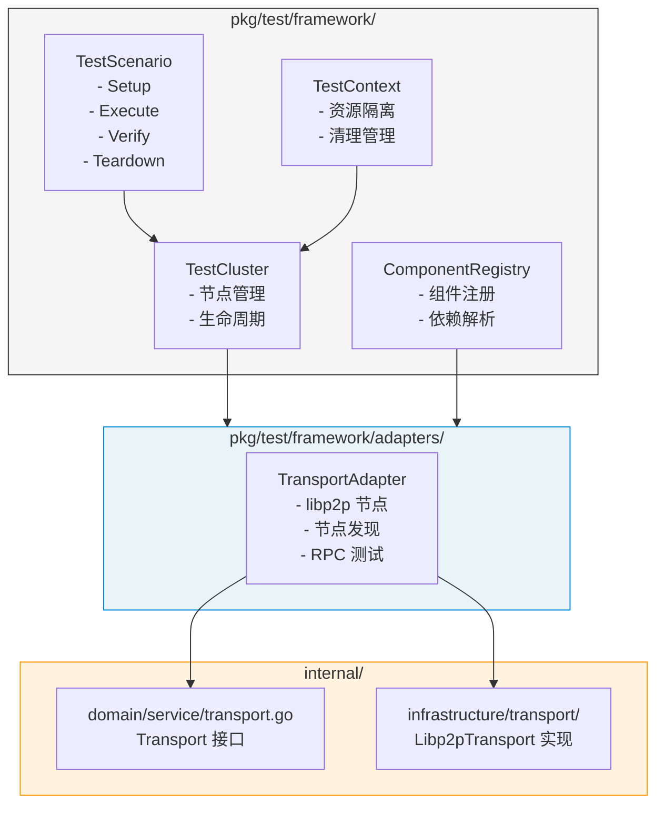

# 【PR全流程文档】Feature - 集成测试框架实施

> **文档说明**：本文档包含「前置规划」和「后置总结」两部分，记录从需求对齐到开发完成的全流程，一个PR对应一份全流程文档，归档后作为项目追溯依据。

---

## 第一部分：前置部分（开工前必完成，架构师评审通过）

### 1. 基础信息（与分支/PR绑定）

| 项目 | 内容 |
|------|------|
| 工作类型 | Feature（新功能） |
| PR编号 | PR-081（[#81](https://github.com/jzhang405/NexKV/pull/81)） |
| 分支名称 | feature/integration-test-framework-implementation |
| 工作主题 | 集成测试框架实施（基于 Spike 成果） |
| 负责人 | 🤖 核心开发 A + 测试工程师 |
| 分支创建日期 | 2026-02-21 |
| 计划开工日期 | 2026-02-21 |
| 计划CI通过日期 | 2026-03-07（2周） |
| 关联需求单号 | [NexKV DDD 架构实施 PR](./2026-02-18_PR-nexkv-ddd-architecture_Pre.md) |
| 关联里程碑 | [M1 - 基础设施层验收](../milestones/2026-02-20_M1-infrastructure-layer-acceptance.md) |
| Spike 文档 | [集成测试框架设计 v2.10](../../07_spike/2026-02-20_transport-poc-integration-test-framework.md) |
| 架构师评审状态 | 🔄 待评审 |
| 预审批结果 | □ 未通过 |

---

### 2. 背景与目标（为什么干）

#### 2.1 背景

**核心问题**：M1 里程碑验收报告显示测试覆盖率为 **67.2%**，未达 80% 目标。

**低覆盖原因**：
| 模块 | 覆盖率 | 原因 |
|------|--------|------|
| `libp2p_channel.go` | 0% | 需要真实 libp2p 网络环境 |
| `libp2p_discovery.go` | 0% | 需要 mDNS 节点发现环境 |
| `libp2p_stream.go` 部分方法 | 0% | 需要真实网络流 |
| `libp2p_rpc.go:HandleIncomingStream` | 低 | 需要完整流处理链 |

**解决方案**：通过集成测试框架，在真实 libp2p 环境中测试这些场景。

#### 2.2 核心目标（可量化、可验证）

**目标 1：实施集成测试框架核心**
- [ ] `pkg/test/framework/cluster.go` - TestCluster 实现
- [ ] `pkg/test/framework/component.go` - TestComponent 接口
- [ ] `pkg/test/framework/registry.go` - ComponentRegistry 实现
- [ ] `pkg/test/framework/scenario.go` - TestScenario 接口
- [ ] `pkg/test/framework/context.go` - TestContext 实现

**目标 2：实现 Transport 适配器**
- [ ] `pkg/test/framework/adapters/transport_adapter.go` - Transport TestAdapter
- [ ] 支持 mDNS 节点发现测试
- [ ] 支持多节点集群通信测试
- [ ] 支持网络分区模拟

**目标 3：补充测试覆盖率**
- [ ] `libp2p_channel.go` 覆盖率提升到 60%+
- [ ] `libp2p_discovery.go` 覆盖率提升到 60%+
- [ ] `libp2p_stream.go` 覆盖率提升到 70%+
- [ ] 整体 Transport 层覆盖率提升到 75%+

**目标 4：CI/CD 集成**
- [ ] 添加 `make integration-test` 命令
- [ ] GitHub Actions 集成测试 Job
- [ ] 测试报告输出（JUnit XML 格式）

#### 2.3 明确边界（不做什么，避免范围蔓延）

**本次不做**（Phase 2 任务）：
- ❌ Storage 适配器（待 Bf-Tree 迁移后）
- ❌ Replication 适配器（待 Phase 3）
- ❌ Cluster 适配器（待 Phase 4）
- ❌ 性能基准测试框架（Week 3-4 任务）

**本次聚焦**（Phase 1 Week 1-2）：
- ✅ 集成测试框架核心实现
- ✅ Transport 适配器实现
- ✅ 3 节点集群通信测试
- ✅ 网络分区模拟测试

---

### 3. 技术方案

#### 3.1 架构设计

基于 Spike 文档 v2.10 的设计方案，核心架构如下：



#### 3.2 目录结构

```
pkg/test/
└── framework/
    ├── cluster.go              # TestCluster 实现
    ├── component.go            # TestComponent 接口
    ├── registry.go             # ComponentRegistry 实现
    ├── scenario.go             # TestScenario 接口 + ScenarioExecutor
    ├── context.go              # TestContext 实现
    ├── data_generator.go       # 测试数据生成器
    ├── metrics.go              # 分布式系统指标
    ├── network_partition.go    # 网络分区控制器
    ├── cleanup.go              # 资源清理管理
    ├── logger.go               # 统一日志输出
    └── adapters/
        └── transport_adapter.go # Transport 适配器

test/integration/
├── transport_test.go           # Transport 集成测试入口
└── scenarios/
    ├── two_nodes_connect.go    # 两节点连接测试
    ├── three_nodes_cluster.go  # 三节点集群测试
    └── network_partition.go    # 网络分区测试
```

#### 3.3 核心接口设计

基于 Spike 文档，核心接口定义如下：

```go
// TestComponent 可测试组件接口
type TestComponent interface {
    Name() string
    Dependencies() []string
    Start(ctx context.Context) error
    Stop(ctx context.Context) error
    IsReady(ctx context.Context) bool
}

// TestCluster 测试集群接口
type TestCluster interface {
    AddNode(config NodeConfig) (TestNode, error)
    RemoveNode(nodeID string) error
    GetNode(nodeID string) (TestNode, error)
    WaitForReady(ctx context.Context, timeout time.Duration) error
    Cleanup() error
}

// TestScenario 测试场景接口
type TestScenario interface {
    Name() string
    Setup(ctx context.Context, cluster TestCluster) error
    Execute(ctx context.Context, cluster TestCluster) error
    Verify(ctx context.Context, cluster TestCluster) error
    Teardown(ctx context.Context, cluster TestCluster) error
}
```

#### 3.4 实施计划（2 周）

| 阶段 | 时间 | 任务 | 产出 |
|------|------|------|------|
| **Week 1** | Day 1-2 | 框架核心实现 | cluster.go, component.go, registry.go |
| | Day 3-4 | Scenario + Context | scenario.go, context.go, cleanup.go |
| | Day 5 | 数据生成器 + 指标 | data_generator.go, metrics.go |
| **Week 2** | Day 1-2 | Transport 适配器 | transport_adapter.go |
| | Day 3-4 | 集成测试用例 | two_nodes_connect.go, three_nodes_cluster.go |
| | Day 5 | CI 集成 + 验证 | Makefile, GitHub Actions |

---

### 4. 风险评估与缓解

#### 4.1 技术风险

| 风险 | 概率 | 影响 | 缓解措施 |
|------|------|------|---------|
| **网络分区实现困难** | 中 | 高 | 使用 Transport 层的消息拦截器，而非 iptables |
| **端口冲突** | 中 | 中 | 使用动态端口分配，或 `--parallel=1` 串行执行 |
| **Goroutine 泄漏** | 中 | 高 | 参考 Spike 文档 v2.8 修复方案，使用 ants 池 |
| **测试目录残留** | 低 | 低 | 使用 NEXKV_BASE_DIR + UUIDv7 test-id |

#### 4.2 进度风险

| 风险 | 概率 | 影响 | 缓解措施 |
|------|------|------|---------|
| **libp2p 行为不一致** | 中 | 中 | 先在本地验证，再提交 CI |
| **CI 环境差异** | 中 | 中 | 添加环境检测，跳过不支持的场景 |

#### 4.3 关键决策点

1. **网络分区实现方式**：
   - 选项 A：Transport 层消息拦截器（推荐）
   - 选项 B：iptables 防火墙规则（不推荐，需要 root 权限）
   - 选项 C：自定义 Transport 包装器

2. **并发控制**：
   - 使用 ants Goroutine 池（推荐，参见 Spike 文档 v2.7）
   - 避免无限制的 goroutine 创建

---

### 5. 验收标准

#### 5.1 功能验收

| 验收项 | 验收标准 | 验证方法 |
|--------|---------|---------|
| TestCluster | 能创建/销毁多节点集群 | 单元测试 |
| TransportAdapter | 能包装 Libp2pTransport | 集成测试 |
| 两节点连接 | 节点 A 能连接节点 B | `TestTransport_TwoNodesConnect` |
| 三节点集群 | 3 节点能互相发现和通信 | `TestTransport_ThreeNodesCluster` |
| 网络分区 | 模拟分区后恢复 | `TestTransport_NetworkPartition` |

#### 5.2 质量验收

| 验收项 | 验收标准 |
|--------|---------|
| `make lint` | 0 issues |
| `make test` | 全部通过 |
| `make test-race` | 无竞态检测 |
| 测试覆盖率 | Transport 层 ≥ 75% |

#### 5.3 CI 验收

| 验收项 | 验收标准 |
|--------|---------|
| `make integration-test` | 能在 CI 环境执行 |
| GitHub Actions | 集成测试 Job 通过 |
| 测试报告 | JUnit XML 格式输出 |

---

### 6. 依赖与资源

#### 6.1 外部依赖

| 依赖 | 版本 | 用途 |
|------|------|------|
| `github.com/libp2p/go-libp2p` | v0.33.0 | P2P 通信 |
| `github.com/panjf2000/ants` | v2.9.0 | Goroutine 池 |

#### 6.2 内部依赖

| 依赖 | 状态 | 说明 |
|------|------|------|
| `internal/domain/service/transport.go` | ✅ 已完成 | Transport 接口定义 |
| `internal/infrastructure/transport/` | ✅ 已完成 | Libp2pTransport 实现 |

---

## 第二部分：后置部分（CI通过后补充）

### 7. 开发总结

> 🔄 CI 通过后补充

### 8. 测试报告

> 🔄 CI 通过后补充

### 9. Code Review 报告

> 🔄 CI 通过后补充

### 10. 部署与发布

> 🔄 CI 通过后补充

---

**文档版本**: v1.0
**创建日期**: 2026-02-21
**最后更新**: 2026-02-21
**作者**: 🤖 AI Agent
**状态**: 🔄 待架构师评审
