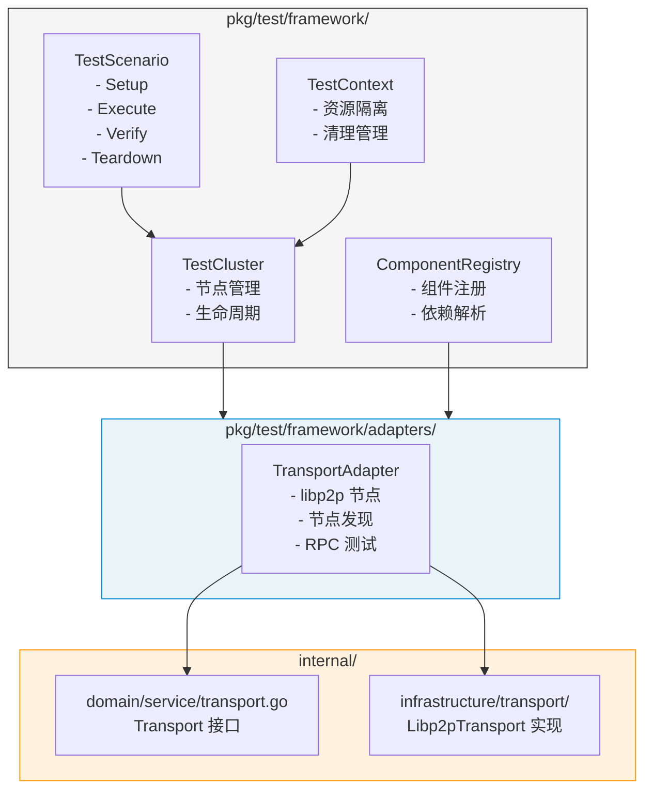

# 【PR全流程文档】Feature - 集成测试框架实施

> **文档说明**：本文档包含「前置规划」和「后置总结」两部分，记录从需求对齐到开发完成的全流程，一个PR对应一份全流程文档，归档后作为项目追溯依据。

---

## 与 Spike 文档的差异说明 ⭐ v1.4 优化

> 本 Pre 文档基于 [Spike v2.10](../../07_spike/2026-02-20_transport-poc-integration-test-framework.md)，在以下方面做了有意偏离：

| 方面 | Spike 文档 | Pre 文档 | 偏离原因 |
|------|------------|----------|----------|
| **目录结构** | `internal/infrastructure/transport/test/` | `pkg/test/framework/` | 支持独立的可复用测试框架包 |
| **接口设计** | `GetType()` 仅此方法 | 补充 `Init()` + `HealthCheck()` | 更完整的生命周期管理 |
| **依赖类型** | `[]ComponentType`（type-safe） | `[]string`（原设计） | **v1.3 修正**：完全对齐 Spike |
| **测试命名** | 未统一 | `Test{Component}_{Scenario}_{Expected}` | 统一命名规范 |
| **Init 签名** | `Init(ctx, env TestEnvironment)` | `Init(ctx)` | **v1.3 修正**：补充 env 参数 |
| **方法命名** | `Name()`/`Type()` | `GetName()`/`GetType()` | **v1.3 修正**：去除 Get 前缀 |
| **HealthCheckConfig** | 有 `GetHealthCheckConfig()` | 缺失 | **v1.3 补充** |
| **网络分区实现** | 自研 `NetworkPartitionController` | 官方 `swarm/testing.MockConnectionGater` | **v1.4 优化**：复用官方工具，避免重复造轮子 |
| **高级网络模拟** | 无 | `libp2p-testing/net`（Phase 2） | **v1.4 补充**：丢包/带宽/抖动模拟 |

---

## 第一部分：前置部分（开工前必完成，架构师评审通过）

### 1. 基础信息（与分支/PR绑定）

| 项目 | 内容 |
|------|------|
| 工作类型 | Feature（新功能） |
| PR编号 | PR-081（[#81](https://github.com/jzhang405/NexKV/pull/81)） |
| 分支名称 | feature/integration-test-framework-implementation |
| 工作主题 | 集成测试框架实施（基于 Spike 成果） |
| 负责人 | 🤖 核心开发 A + 测试工程师 |
| 分支创建日期 | 2026-02-21 |
| 计划开工日期 | 2026-02-21 |
| 计划CI通过日期 | 2026-03-14（3周）⭐ v1.1 评审调整 |
| 关联需求单号 | [NexKV DDD 架构实施 PR](./2026-02-18_PR-nexkv-ddd-architecture_Pre.md) |
| 关联里程碑 | [M1 - 基础设施层验收](../milestones/2026-02-20_M1-infrastructure-layer-acceptance.md) |
| Spike 文档 | [集成测试框架设计 v2.10](../../07_spike/2026-02-20_transport-poc-integration-test-framework.md) |
| 架构师评审状态 | 🔄 评审中（v1.3 Spike 对齐修复）⭐ |
| 预审批结果 | ⏳ 待定 |

---

### 2. 背景与目标（为什么干）

#### 2.1 背景

**核心问题**：M1 里程碑验收报告显示测试覆盖率为 **67.2%**，未达 80% 目标。

**覆盖率目标说明** ⭐ v1.2 审核补充：
- **最低目标**：75%（本 PR 必须达到）
- **理想目标**：80%（后续持续优化）
- 本 PR 聚焦于框架实现和基础测试用例，覆盖率 75% 为最低验收标准

**低覆盖原因**：
| 模块 | 覆盖率 | 原因 |
|------|--------|------|
| `libp2p_channel.go` | 0% | 需要真实 libp2p 网络环境 |
| `libp2p_discovery.go` | 0% | 需要 mDNS 节点发现环境 |
| `libp2p_stream.go` 部分方法 | 0% | 需要真实网络流 |
| `libp2p_rpc.go:HandleIncomingStream` | 低 | 需要完整流处理链 |

**解决方案**：通过集成测试框架，在真实 libp2p 环境中测试这些场景。

#### 2.2 核心目标（可量化、可验证）

**目标 1：实施集成测试框架核心**
- [ ] `pkg/test/framework/cluster.go` - TestCluster 实现
- [ ] `pkg/test/framework/component.go` - TestComponent 接口
- [ ] `pkg/test/framework/registry.go` - ComponentRegistry 实现
- [ ] `pkg/test/framework/scenario.go` - TestScenario 接口
- [ ] `pkg/test/framework/context.go` - TestContext 实现

**目标 2：实现 Transport 适配器**
- [ ] `pkg/test/framework/adapters/transport_adapter.go` - Transport TestAdapter
- [ ] 支持 mDNS 节点发现测试
- [ ] 支持多节点集群通信测试
- [ ] 支持网络分区模拟

**目标 3：补充测试覆盖率**
- [ ] `libp2p_channel.go` 覆盖率提升到 60%+
- [ ] `libp2p_discovery.go` 覆盖率提升到 60%+
- [ ] `libp2p_stream.go` 覆盖率提升到 70%+
- [ ] 整体 Transport 层覆盖率提升到 75%+

**目标 4：CI/CD 集成**
- [ ] 添加 `make integration-test` 命令
- [ ] GitHub Actions 集成测试 Job
- [ ] 测试报告输出（JUnit XML 格式）

#### 2.3 明确边界（不做什么，避免范围蔓延）

**本次不做**（Phase 2 任务）：
- ❌ Storage 适配器（待 Bf-Tree 迁移后）
- ❌ Replication 适配器（待 Phase 3）
- ❌ Cluster 适配器（待 Phase 4）
- ❌ 性能基准测试框架（Week 3-4 任务）

**本次聚焦**（Phase 1 Week 1-3）⭐ v1.1 评审调整：
- ✅ 集成测试框架核心实现
- ✅ Transport 适配器实现
- ✅ 3 节点集群通信测试
- ✅ 网络分区模拟测试

---

### 3. 技术方案

#### 3.1 架构设计

基于 Spike 文档 v2.10 的设计方案，核心架构如下：



#### 3.2 目录结构 ⭐ v1.1 评审补充说明

**目录职责说明**：
- `pkg/test/framework/`：**可复用的测试框架代码**，可被其他项目引用
- `test/integration/`：**NexKV 专属的集成测试用例**，使用框架编写

```
pkg/test/
└── framework/                     # 可复用测试框架（可独立发布）
    ├── cluster.go                 # TestCluster 实现
    ├── component.go               # TestComponent 接口
    ├── registry.go                # ComponentRegistry 实现
    ├── scenario.go                # TestScenario 接口 + ScenarioExecutor
    ├── context.go                 # TestContext 实现
    ├── data_generator.go          # 测试数据生成器
    ├── metrics.go                 # 分布式系统指标
    ├── cleanup.go                 # 资源清理管理
    ├── logger.go                  # 统一日志输出
    └── adapters/
        └── transport_adapter.go   # Transport 适配器（集成官方 swarm/testing）

test/integration/                  # NexKV 专属集成测试
├── transport_test.go              # Transport 集成测试入口
└── scenarios/
    ├── two_nodes_connect.go       # TestTransport_TwoNodesConnect_Success
    ├── three_nodes_cluster.go     # TestTransport_ThreeNodesCluster_Success
    └── network_partition.go       # TestTransport_NetworkPartition_Reconnect
```

> ⭐ **v1.4 优化**：移除 `network_partition.go`，复用 libp2p 官方 `swarm/testing` 的 `MockConnectionGater`

#### 3.3 核心接口设计 ⭐ v1.3 完全对齐 Spike

基于 Spike 文档 v2.10，核心接口定义如下（完全对齐）：

```go
// ComponentType 组件类型（type-safe，使用 string）⭐ v1.3 完全对齐 Spike
type ComponentType string

const (
    ComponentTypeTransport   ComponentType = "transport"
    ComponentTypeStorage     ComponentType = "storage"
    ComponentTypeReplication ComponentType = "replication"
    ComponentTypeCluster     ComponentType = "cluster"
    ComponentTypeTransaction ComponentType = "transaction"
    ComponentTypeMetadata    ComponentType = "metadata"
)

// TestEnvironment 测试环境接口 ⭐ v1.3 补充（Spike 第 254-272 行）
type TestEnvironment interface {
    ID() string
    Start(ctx context.Context) error
    Stop(ctx context.Context) error
    Status() EnvironmentStatus
    GetComponent(name string) (TestComponent, error)
    ListComponents() []TestComponent
}

// EnvironmentStatus 环境状态
type EnvironmentStatus int

const (
    EnvironmentStatusUnknown EnvironmentStatus = iota
    EnvironmentStatusCreating
    EnvironmentStatusCreated
    EnvironmentStatusStarting
    EnvironmentStatusRunning
    EnvironmentStatusStopping
    EnvironmentStatusStopped
    EnvironmentStatusError
)

// TestComponent 可测试组件接口 ⭐ v1.3 完全对齐 Spike（第 290-320 行）
type TestComponent interface {
    // 基础信息（去除 Get 前缀，与 Spike 一致）
    Name() string                        // ⭐ v1.3: Name() 而非 GetName()
    Type() ComponentType                 // ⭐ v1.3: Type() 而非 GetType()
    GetDependencies() []ComponentType    // type-safe 设计

    // 生命周期管理
    Init(ctx context.Context, env TestEnvironment) error // ⭐ v1.3: 补充 env 参数
    Start(ctx context.Context) error
    Stop(ctx context.Context) error

    // 健康检查
    HealthCheck(ctx context.Context) error               // 深度健康检查
    GetHealthCheckConfig() *HealthCheckConfig            // ⭐ v1.3 补充
}

// HealthCheckConfig 健康检查配置 ⭐ v1.3 补充（Spike 第 323-344 行）
type HealthCheckConfig struct {
    Timeout       time.Duration // 默认: 5s
    Interval      time.Duration // 默认: 10s
    RetryCount    int           // 默认: 3
    RetryInterval time.Duration // 默认: 1s
    Critical      bool          // 默认: true
}

// DefaultHealthCheckConfig 返回默认健康检查配置
func DefaultHealthCheckConfig() *HealthCheckConfig {
    return &HealthCheckConfig{
        Timeout:       5 * time.Second,
        Interval:      10 * time.Second,
        RetryCount:    3,
        RetryInterval: 1 * time.Second,
        Critical:      true,
    }
}

// TestCluster 测试集群接口
type TestCluster interface {
    AddNode(config NodeConfig) (TestNode, error)
    RemoveNode(nodeID string) error
    GetNode(nodeID string) (TestNode, error)
    WaitForReady(ctx context.Context, timeout time.Duration) error
    Cleanup() error
}

// TestScenario 测试场景接口
type TestScenario interface {
    Name() string
    Setup(ctx context.Context, cluster TestCluster) error
    Execute(ctx context.Context, cluster TestCluster) error
    Verify(ctx context.Context, cluster TestCluster) error
    Teardown(ctx context.Context, cluster TestCluster) error
}
```

**与 Spike 文档 v2.10 完全对齐** ⭐ v1.3：

| 项目 | Spike 文档 | Pre v1.2 | Pre v1.3 |
|------|------------|----------|----------|
| `ComponentType` 底层类型 | `string` | ❌ `int` | ✅ `string` |
| `Name()`/`Type()` 方法 | 无 Get 前缀 | ❌ `GetName()`/`GetType()` | ✅ `Name()`/`Type()` |
| `Init()` 签名 | `(ctx, env TestEnvironment)` | ❌ `(ctx)` | ✅ `(ctx, env)` |
| `GetHealthCheckConfig()` | 有 | ❌ 无 | ✅ 有 |
| `HealthCheckConfig` 结构体 | 有 | ❌ 无 | ✅ 有 |
| `TestEnvironment` 接口 | 有 | ❌ 无 | ✅ 有 |
| `IsReady()` 方法 | 无（由 HealthCheck 覆盖） | 有 | ✅ 移除（语义重复） |

**错误处理策略** ⭐ v1.3 对齐 Spike：

| 场景 | 策略 | 说明 |
|------|------|------|
| `Init()` 失败 | **Fail Fast** | 立即返回错误，不重试 |
| `Start()` 失败 | **Fail Fast** | 立即返回错误，不重试 |
| `Stop()` 失败 | **记录日志 + 继续** | 不影响其他组件停止 |
| `HealthCheck()` 失败 | **重试 + 超时** | 根据 `HealthCheckConfig` 配置重试 |
| 依赖组件未就绪 | **等待 + 超时** | 等待依赖组件启动，超时后失败 |

```go
// Init 实现示例（Fail Fast 策略）⭐ v1.3 更新签名
func (c *TransportAdapter) Init(ctx context.Context, env TestEnvironment) error {
    // 保存环境引用
    c.env = env

    // 初始化依赖组件
    for _, depType := range c.GetDependencies() {
        dep, err := env.GetComponent(string(depType))
        if err != nil {
            return fmt.Errorf("get dependency %s failed: %w", depType, err)
        }
        c.dependencies = append(c.dependencies, dep)
    }

    return nil
}

// Start 实现示例（Fail Fast 策略）
func (c *TransportAdapter) Start(ctx context.Context) error {
    if err := c.transport.Start(ctx); err != nil {
        // Fail Fast: 不重试，直接返回错误
        return fmt.Errorf("transport start failed: %w", err)
    }
    return nil
}

// HealthCheck 实现示例（带重试）⭐ v1.3 对齐 Spike
func (c *TransportAdapter) HealthCheck(ctx context.Context) error {
    config := c.GetHealthCheckConfig()

    var lastErr error
    for i := 0; i < config.RetryCount; i++ {
        if err := c.doHealthCheck(ctx); err == nil {
            return nil
        } else {
            lastErr = err
            time.Sleep(config.RetryInterval)
        }
    }
    return fmt.Errorf("health check failed after %d retries: %w", config.RetryCount, lastErr)
}
```

#### 3.4 实施计划（3 周）⭐ v1.1 评审调整

| 阶段 | 时间 | 任务 | 产出 |
|------|------|------|------|
| **Week 1** | Day 1-2 | 框架核心实现 | cluster.go, component.go, registry.go |
| | Day 3-4 | Scenario + Context | scenario.go, context.go, cleanup.go |
| | Day 5 | 数据生成器 + 指标 | data_generator.go, metrics.go |
| **Week 2** | Day 1-3 | Transport 适配器 | transport_adapter.go + 网络分区实现 |
| | Day 4-5 | 集成测试用例 | two_nodes_connect.go, three_nodes_cluster.go |
| **Week 3** | Day 1-2 | 网络分区测试 | network_partition.go |
| | Day 3-4 | CI 集成 | Makefile, GitHub Actions |
| | Day 5 | 缓冲 + 验证 | 处理环境差异问题 |

**调整说明** ⭐：
- 框架核心涉及多个组件，需要更充分的开发时间
- Transport 适配器与真实 libp2p 集成，调试时间较长
- CI 环境差异问题通常需要额外时间解决
- Week 3 Day 5 作为缓冲，处理意外问题

---

### 4. 风险评估与缓解

#### 4.1 技术风险

| 风险 | 概率 | 影响 | 缓解措施 |
|------|------|------|---------|
| **网络分区实现** | 低 | 中 | ⭐ **v1.4**：复用 libp2p 官方 `swarm/testing.MockConnectionGater` |
| **端口冲突** | 中 | 中 | 使用动态端口分配，或 `--parallel=1` 串行执行 |
| **Goroutine 泄漏** | 中 | 高 | 参考 Spike 文档 v2.8 修复方案，使用 ants 池 |
| **测试目录残留** | 低 | 低 | 使用 NEXKV_BASE_DIR + UUIDv7 test-id |

#### 4.2 进度风险

| 风险 | 概率 | 影响 | 缓解措施 |
|------|------|------|---------|
| **libp2p 行为不一致** | 中 | 中 | 先在本地验证，再提交 CI |
| **CI 环境差异** | 中 | 中 | 添加环境检测，跳过不支持的场景 |

#### 4.3 关键决策点

1. **网络分区实现方式** ⭐ v1.4 决策：
   - ✅ **选择**：复用 libp2p 官方 `swarm/testing.MockConnectionGater`
   - 理由：官方维护、无 bug、无额外依赖、功能完整

2. **并发控制**：
   - 使用 ants Goroutine 池（推荐，参见 Spike 文档 v2.7）
   - 避免无限制的 goroutine 创建

#### 4.4 网络分区实现（复用 libp2p 官方工具）⭐ v1.4 优化

> **决策**：不复用自研方案，直接使用 libp2p 官方 `swarm/testing.MockConnectionGater`

**优势**：
- ✅ 官方维护，无 bug 风险
- ✅ 无额外依赖（libp2p 已内置）
- ✅ 功能完整（拦截 Dial/Accept/Secured/Upgraded）

**实现方式**：

```go
import swarmtesting "github.com/libp2p/go-libp2p/p2p/net/swarm/testing"

// TransportAdapter 集成官方 MockConnectionGater
type TransportAdapter struct {
    host      host.Host
    connGater *swarmtesting.MockConnectionGater  // 复用官方工具
}

// NewTransportAdapter 创建适配器（注入 MockConnectionGater）
func NewTransportAdapter(t testing.TB) (*TransportAdapter, error) {
    connGater := swarmtesting.DefaultMockConnectionGater()

    h, err := libp2p.New(
        libp2p.ListenAddrStrings("/ip4/127.0.0.1/tcp/0"),
        libp2p.ConnectionGater(connGater),  // 注入连接控制器
    )
    if err != nil {
        return nil, err
    }

    return &TransportAdapter{
        host:      h,
        connGater: connGater,
    }, nil
}

// BlockPeer 阻塞指定节点（封装官方 API）
func (a *TransportAdapter) BlockPeer(peerID peer.ID) {
    originalPeerDial := a.connGater.PeerDial
    a.connGater.PeerDial = func(p peer.ID) bool {
        if p == peerID {
            return false  // 阻止连接
        }
        return originalPeerDial(p)
    }
}

// UnblockPeer 恢复连接
func (a *TransportAdapter) UnblockPeer(peerID peer.ID) {
    a.connGater.PeerDial = swarmtesting.DefaultMockConnectionGater().PeerDial
}
```

**测试用例示例**：

```go
func TestTransport_NetworkPartition_Reconnect(t *testing.T) {
    // 1. 创建 3 个节点（使用 MockConnectionGater）
    node1, _ := framework.NewTransportAdapter(t)
    node2, _ := framework.NewTransportAdapter(t)
    node3, _ := framework.NewTransportAdapter(t)

    // 2. 连接所有节点
    node1.Connect(node2.Addr())
    node1.Connect(node3.Addr())
    node2.Connect(node3.Addr())

    // 3. 模拟网络分区：隔离 node3
    node1.BlockPeer(node3.ID())
    node2.BlockPeer(node3.ID())

    // 4. 验证：node1, node2 能通信，node3 被隔离
    // ... 测试逻辑 ...

    // 5. 恢复连接
    node1.UnblockPeer(node3.ID())
    node2.UnblockPeer(node3.ID())

    // 6. 验证：所有节点恢复正常通信
    // ... 测试逻辑 ...
}
```

**与自研方案对比**：

| 对比项 | 自研 NetworkPartitionController | 官方 MockConnectionGater |
|--------|--------------------------------|-------------------------|
| 代码量 | ~100 行 | ~10 行（封装层） |
| 维护成本 | 高（自己维护） | 无（官方维护） |
| Bug 风险 | 有 | 无 |
| 功能完整性 | 基础 | 完整（5 个拦截点） |
| 依赖 | 无 | 无（libp2p 内置） |

#### 4.5 高级网络模拟扩展（Phase 2）⭐ v1.4 补充

> **定位**：当前 PR 使用内置 `swarm/testing`，Phase 2 按需引入 `libp2p-testing/net`

**`libp2p-testing/net` 核心能力**：

| 能力 | API | 适用场景 |
|------|-----|---------|
| **丢包模拟** | `SetPacketLoss(0.15)` | 验证重传机制 |
| **带宽限制** | `SetBandwidthLimit(nodeID, 1024*1024)` | 验证大消息传输 |
| **网络抖动** | 动态延迟设置 | 验证超时处理 |
| **动态分区** | 运行时切换分区 | 验证故障恢复 |

**依赖引入**（Phase 2）：
```bash
go get github.com/libp2p/go-libp2p-testing/net
```

**使用示例**（Phase 2 参考）：
```go
import mocknet "github.com/libp2p/go-libp2p-testing/net"

func TestBroadcastTracker_WithPacketLoss(t *testing.T) {
    // 1. 创建模拟网络（带丢包）
    mn := mocknet.New(ctx)
    mn.SetPacketLoss(0.15)  // 15% 丢包率

    // 2. 创建节点
    node1, _ := mn.GenPeer()
    node2, _ := mn.GenPeer()
    node3, _ := mn.GenPeer()

    // 3. 设置带宽限制
    mn.SetBandwidthLimit(node1.ID(), peer.ID(""), 1024*1024)  // 1MB/s

    // 4. 测试 BroadcastTracker 在丢包环境下的表现
    // ...
}
```

**适用场景**（Phase 2）：

| 场景 | 模拟方式 | 验证目标 |
|------|---------|---------|
| BroadcastTracker 回调 | 丢包 + 延迟 | 回调可靠性 |
| SyncService 2PC | 分区 + 丢包 | 数据一致性 |
| 大消息传输 | 带宽限制 | 分片/流控 |

**分阶段策略**：

| 阶段 | 工具 | 目标 |
|------|------|------|
| **Phase 1（当前）** | `swarm/testing`（内置） | 覆盖率 75%，基础网络测试 |
| **Phase 2（后续）** | `libp2p-testing/net` | Chaos 测试，验证异常网络表现 |

---

### 5. 验收标准

#### 5.1 功能验收

| 验收项 | 验收标准 | 验证方法 |
|--------|---------|---------|
| TestCluster | 能创建/销毁多节点集群 | 单元测试 |
| TransportAdapter | 能包装 Libp2pTransport | 集成测试 |
| 两节点连接 | 节点 A 能连接节点 B | `TestTransport_TwoNodesConnect_Success` |
| 三节点集群 | 3 节点能互相发现和通信 | `TestTransport_ThreeNodesCluster_Success` |
| 网络分区 | 模拟分区后恢复 | `TestTransport_NetworkPartition_Reconnect` |

#### 5.2 质量验收

| 验收项 | 验收标准 |
|--------|---------|
| `make lint` | 0 issues |
| `make test` | 全部通过 |
| `make test-race` | 无竞态检测 |
| 测试覆盖率 | Transport 层 ≥ 75% |

#### 5.3 CI 验收

| 验收项 | 验收标准 |
|--------|---------|
| `make integration-test` | 能在 CI 环境执行 |
| GitHub Actions | 集成测试 Job 通过 |
| 测试报告 | JUnit XML 格式输出 |

#### 5.4 性能基准 ⭐ v1.1 评审补充

| 指标 | 目标 | 说明 |
|------|------|------|
| 测试启动时间 | < 5s | 3 节点集群启动 |
| 内存占用 | < 100MB | 单测试进程 |
| 并发测试 | 支持 4 并行 | CI 环境 |
| 单测试超时 | 30s | 防止 hung 测试 |

---

### 5.5 调试指南 ⭐ v1.1 评审补充

#### 本地调试

```bash
# 1. 运行单个测试（详细输出）
go test -v ./test/integration/... -run TestTransport_TwoNodesConnect_Success

# 2. 查看 libp2p 调试日志
NEXKV_LOG_LEVEL=debug go test -v ./test/integration/...

# 3. 保留测试目录（不自动清理）
NEXKV_KEEP_TEST_DIR=1 go test -v ./test/integration/...

# 4. 使用动态端口（避免端口冲突）
NEXKV_DYNAMIC_PORT=1 go test -v ./test/integration/...

# 5. 串行执行（调试时推荐）
go test -v ./test/integration/... -parallel 1
```

#### 清理残留资源

```bash
# 清理测试目录
rm -rf /tmp/nexkv-test-*

# 清理 Docker 资源（如使用）
docker system prune -f

# 检查端口占用
lsof -i :10000-10100
```

#### 常见问题排查

| 症状 | 可能原因 | 解决方案 |
|------|----------|----------|
| 节点发现超时 | mDNS 广播失败 | 使用静态 bootstrap 列表 |
| RPC 调用失败 | 节点未就绪 | 增加 `WaitForReady` 超时 |
| 测试目录残留 | 测试崩溃 | 手动清理或 `GlobalCleanup` |
| 端口冲突 | 多测试并行 | 使用动态端口或串行执行 |

---

### 6. 依赖与资源

#### 6.1 外部依赖

| 依赖 | 版本 | 用途 | 阶段 |
|------|------|------|------|
| `github.com/libp2p/go-libp2p` | v0.33.0 | P2P 通信（与项目现有版本一致 ✅） | Phase 1 |
| `github.com/panjf2000/ants` | v2.9.0 | Goroutine 池 | Phase 1 |
| `github.com/libp2p/go-libp2p-testing/net` | latest | 高级网络模拟（丢包/带宽/抖动） | Phase 2 ⭐ |

#### 6.2 内部依赖

| 依赖 | 状态 | 说明 |
|------|------|------|
| `internal/domain/service/transport.go` | ✅ 已完成 | Transport 接口定义 |
| `internal/infrastructure/transport/` | ✅ 已完成 | Libp2pTransport 实现 |

---

### 6.3 术语表 ⭐ v1.2 审核补充

| 术语 | 定义 |
|------|------|
| **适配器 (Adapter)** | 将外部组件（如 Libp2pTransport）封装为 TestComponent 接口的组件 |
| **组件类型 (ComponentType)** | 枚举类型，用于类型安全地标识组件种类（Transport/Storage/Replication/Cluster） |
| **测试场景 (TestScenario)** | 定义测试生命周期的接口：Setup → Execute → Verify → Teardown |
| **测试集群 (TestCluster)** | 管理多个 TestNode 的集群，提供节点生命周期管理 |
| **测试上下文 (TestContext)** | 提供测试隔离、资源管理和清理功能 |
| **网络分区 (Network Partition)** | 模拟网络隔离的混沌测试技术 |

---

### 6.4 回滚计划 ⭐ v1.2 审核建议

如集成测试框架导致 CI 不稳定，执行以下回滚步骤：

| 步骤 | 操作 | 说明 |
|------|------|------|
| **1. 禁用 CI Job** | 注释 GitHub Actions 集成测试步骤 | 避免阻塞主流程 |
| **2. 标记代码** | 添加 `// +build integration` 标签 | 隔离测试代码 |
| **3. 本地验证** | 继续本地开发和调试 | 不影响 CI 稳定性 |
| **4. 问题修复** | 修复 flaky 测试或环境问题 | 根因分析 |
| **5. 重新启用** | 稳定后取消注释 CI Job | 恢复完整测试 |

```yaml
# GitHub Actions 回滚示例
jobs:
  integration-test:
    if: false  # 禁用集成测试 Job
    runs-on: ubuntu-latest
    # ...
```

### 6.5 监控指标 ⭐ v1.2 审核建议

| 指标 | 收集方式 | 告警阈值 | 处理措施 |
|------|----------|----------|----------|
| 集成测试成功率 | CI 报告 | < 90% | 排查 flaky 测试 |
| 平均测试耗时 | CI 报告 | > 5min | 优化测试并行度 |
| Flaky 测试数量 | 人工标记 | > 2 个 | 隔离并修复 |
| 内存占用 | CI 监控 | > 200MB | 检查资源泄漏 |

---

## 第二部分：后置部分（CI通过后补充）

### 7. 开发总结

> 🔄 CI 通过后补充

### 8. 测试报告

> 🔄 CI 通过后补充

### 9. Code Review 报告

> 🔄 CI 通过后补充

### 10. 部署与发布

> 🔄 CI 通过后补充

---

**文档版本**: v1.4（复用官方工具优化版）⭐
**创建日期**: 2026-02-21
**最后更新**: 2026-02-21
**作者**: 🤖 AI Agent
**状态**: 🔄 评审中

### 评审记录

| 版本 | 日期 | 评审人 | 评审意见 | 状态 |
|------|------|--------|---------|------|
| v1.0 | 2026-02-21 | 👤 架构师 | 时间估算过于乐观，补充网络分区细节、调试指南 | 🔄 需调整 |
| v1.1 | 2026-02-21 | 🤖 AI Agent | 调整为 3 周，补充网络分区实现、调试指南、性能基准 | ✅ 第一轮通过 |
| v1.2 | 2026-02-21 | 👤 架构师 | 时间线不一致、目录结构不一致、接口类型安全问题 | ✅ 已修复 |
| v1.3 | 2026-02-21 | 👤 架构师 | ComponentType 类型、方法命名、Init 签名、HealthCheckConfig | ✅ 已修复 |
| v1.4 | 2026-02-21 | 🤖 AI Agent | 复用 libp2p 官方 swarm/testing，移除自研 NetworkPartitionController | 🔄 修复中 |

### v1.4 变更摘要（复用官方工具优化）

| 变更项 | v1.3 | v1.4 |
|--------|------|------|
| **网络分区实现** | 自研 `NetworkPartitionController` (~100行) | 复用官方 `swarm/testing.MockConnectionGater` (~10行) |
| **目录结构** | 包含 `network_partition.go` | 移除，封装到 `transport_adapter.go` |
| **技术风险** | "网络分区实现困难"（中概率/高影响） | 降低为"低概率/中影响" |
| **维护成本** | 高（自己维护） | 无（官方维护） |

### v1.3 变更摘要（Spike 完全对齐）

| 问题编号 | 严重程度 | 问题描述 | 修复内容 |
|---------|---------|---------|---------|
| **P0-1** | 🔴 严重 | `ComponentType` 类型不一致（int vs string） | ✅ 改为 `string` 类型 |
| **P1-2** | 🟡 中等 | 方法命名不一致 | ✅ 去除 Get 前缀 |
| **P1-3** | 🟡 中等 | `Init()` 签名缺少 `env` | ✅ 补充 `env` 参数 |
| **P1-4** | 🟡 中等 | 缺少 `GetHealthCheckConfig()` | ✅ 补充方法 + 结构体 |
