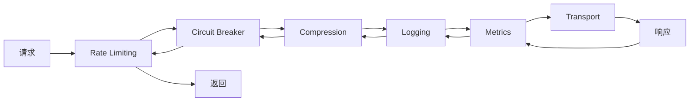

# PR Pre 文档：测试覆盖率 + 性能基准 + 中间件完善

> **PR 类型**: feature
> **分支名称**: feature/test-coverage-benchmark-middleware
> **创建日期**: 2026-02-21
> **作者**: 🤖 AI Agent
> **状态**: 🔄 修订后待评审 (v1.1)

---

## 一、需求概述

### 1.1 背景

根据 M1 里程碑验收报告（`docs/06_PM/milestones/2026-02-20_M1-infrastructure-layer-acceptance.md`），存在以下待改进项：

| 项目 | 当前状态 | 目标 |
|------|---------|------|
| 集成测试覆盖率 | 50% | ≥80% |
| 性能基准测试 | 未验证 | ≥10K ops/sec |
| 传输层中间件 | 仅日志+监控 | 完整链路 |

### 1.2 目标

1. **提升覆盖率**：`test/integration/scenarios` 覆盖率从 50% 提升到 80%
2. **性能验证**：基准测试验证 RPC 层吞吐量 ≥10K ops/sec
3. **中间件完善**：实现完整中间件链（日志→监控→限流→熔断→压缩）

---

## 二、技术设计

### 2.1 覆盖率提升方案

**当前覆盖率分析**：
- `setupIntegrationTest`: 90.9% ✅
- `setupIntegrationTestWithoutExecutor`: 0.0% ❌

**解决方案**（v1.1 修订）：
保留 `setupIntegrationTestWithoutExecutor` 函数，创建完整的测试场景：

```go
// helpers_test.go
func TestSetupIntegrationTestWithoutExecutor_Basic(t *testing.T) {
    ctx, testCtx := setupIntegrationTestWithoutExecutor(t, DefaultTestTimeout)
    defer testCtx.Close()

    // 验证返回值
    assert.NotNil(t, ctx)
    assert.NotNil(t, testCtx)

    // 验证 context 有效
    deadline, ok := ctx.Deadline()
    assert.True(t, ok)
    assert.True(t, deadline.After(time.Now()))

    // 验证 Registry 已初始化
    assert.NotNil(t, testCtx.Registry)
}

func TestSetupIntegrationTestWithoutExecutor_Timeout(t *testing.T) {
    start := time.Now()
    ctx, _ := setupIntegrationTestWithoutExecutor(t, 5*time.Second)

    // 验证超时设置正确
    deadline, _ := ctx.Deadline()
    assert.WithinDuration(t, start.Add(5*time.Second), deadline, 100*time.Millisecond)
}
```

### 2.2 性能基准测试设计

#### 测试环境（v1.1 新增）

| 环境参数 | 规格 |
|---------|------|
| **CPU** | GitHub Actions ubuntu-latest (2 vCPU) |
| **内存** | 7GB |
| **网络** | 本地回环（无网络延迟） |
| **Go 版本** | 1.23 |

#### 对比基准（v1.1 新增）

| 系统 | 吞吐量（参考） |
|------|---------------|
| libp2p 默认 RPC | ~5K ops/sec |
| gRPC 同等条件 | ~15K ops/sec |
| **目标** | **≥10K ops/sec** |

#### 失败判定（v1.1 新增）

- 连续 3 次运行低于阈值 = 失败
- 方差范围：±10%

#### 测试场景

| 场景 | 说明 | 目标 |
|------|------|------|
| `BenchmarkRPC_Throughput` | 单机 RPC 吞吐量 | ≥10K ops/sec |
| `BenchmarkRPC_Concurrent` | 并发 RPC 吞吐量 | ≥10K ops/sec |
| `BenchmarkRPC_Payload_Small` | 64 字节负载 | - |
| `BenchmarkRPC_Payload_Medium` | 1 KB 负载 | - |
| `BenchmarkRPC_Payload_Large` | 4 KB 负载 | - |

**实现文件**：`internal/infrastructure/transport/benchmark_test.go`

### 2.3 RPC 中间件集成

**当前问题**：
`libp2p_rpc.go` 中 `middleware` 字段存在但未真正使用。

**修复方案**：
在 `Call` 和 `Broadcast` 方法中调用 `middleware.ExecuteSend`。

### 2.4 中间件架构（v1.1 新增）

#### 执行顺序



#### 配置方式（代码配置）

```go
// 代码配置示例
rpc := NewLibp2pRPC(config)

// 添加限流中间件（按节点限流）
rpc.Use(NewRateLimitMiddleware(RateLimitConfig{
    RequestsPerSecond: 1000,
    Burst:             100,
}))

// 添加熔断中间件
rpc.Use(NewCircuitBreakerMiddleware(CircuitBreakerConfig{
    FailureThreshold: 5,
    ResetTimeout:     30 * time.Second,
}))

// 添加压缩中间件
rpc.Use(NewCompressionMiddleware(CompressionConfig{
    Algorithm: Snappy,
    Threshold: 1024, // 1KB
}))
```

### 2.5 新中间件实现

#### 2.5.1 Rate Limiting 中间件（v1.1 修订：按节点限流）

```go
type RateLimitMiddleware struct {
    limiters sync.Map // peer.ID -> *rate.Limiter
    config   RateLimitConfig
    mu       sync.RWMutex
}

type RateLimitConfig struct {
    RequestsPerSecond int
    Burst             int
}

func (m *RateLimitMiddleware) InterceptSend(ctx context.Context, peer model.PeerID, msg model.Message, next SendFunc) error {
    limiter := m.getLimiter(peer)
    if !limiter.Allow() {
        return errors.Wrap(errors.ErrRateLimitExceeded, "rate limit for peer "+string(peer))
    }
    return next(ctx, peer, msg)
}

func (m *RateLimitMiddleware) getLimiter(peer model.PeerID) *rate.Limiter {
    if limiter, ok := m.limiters.Load(peer); ok {
        return limiter.(*rate.Limiter)
    }

    m.mu.Lock()
    defer m.mu.Unlock()

    // double check
    if limiter, ok := m.limiters.Load(peer); ok {
        return limiter.(*rate.Limiter)
    }

    limiter := rate.NewLimiter(rate.Limit(m.config.RequestsPerSecond), m.config.Burst)
    m.limiters.Store(peer, limiter)
    return limiter
}
```

#### 2.5.2 Circuit Breaker 中间件（v1.1 修订：不持久化）

```go
const (
    StateClosed   int32 = 0
    StateOpen     int32 = 1
    StateHalfOpen int32 = 2
)

type CircuitBreakerMiddleware struct {
    state        int32
    failureCount int32
    lastFailTime int64
    config       CircuitBreakerConfig
}

type CircuitBreakerConfig struct {
    FailureThreshold int
    ResetTimeout     time.Duration
    MinRecoveryTime  time.Duration // v1.1: 防止 HalfOpen 抖动
}

func (m *CircuitBreakerMiddleware) InterceptSend(ctx context.Context, peer model.PeerID, msg model.Message, next SendFunc) error {
    state := atomic.LoadInt32(&m.state)

    if state == StateOpen {
        if time.Since(time.Unix(0, atomic.LoadInt64(&m.lastFailTime))) > m.config.ResetTimeout {
            atomic.CompareAndSwapInt32(&m.state, StateOpen, StateHalfOpen)
        } else {
            return errors.Wrap(errors.ErrCircuitBreakerOpen, "circuit breaker is open")
        }
    }

    err := next(ctx, peer, msg)
    m.recordResult(err)
    return err
}

// 重启后状态重置（不持久化）
```

#### 2.5.3 Compression 中间件

```go
type CompressionMiddleware struct {
    algorithm CompressionAlgorithm
    threshold int // 最小压缩阈值（字节）
    compressor compressor.Compressor
}

type CompressionConfig struct {
    Algorithm CompressionAlgorithm
    Threshold int
}

func (m *CompressionMiddleware) InterceptSend(ctx context.Context, peer model.PeerID, msg model.Message, next SendFunc) error {
    if len(msg.Payload) > m.threshold {
        compressed, err := m.compressor.Compress(msg.Payload)
        if err == nil {
            msg.Payload = compressed
            if msg.Metadata == nil {
                msg.Metadata = make(map[string]string)
            }
            msg.Metadata["compression"] = string(m.algorithm)
        }
    }
    return next(ctx, peer, msg)
}

func (m *CompressionMiddleware) InterceptReceive(ctx context.Context, peer model.PeerID, msg model.Message, next ReceiveFunc) error {
    if algo, ok := msg.Metadata["compression"]; ok {
        decompressed, err := m.compressor.Decompress(msg.Payload, compressor.CompressorType(algo))
        if err == nil {
            msg.Payload = decompressed
        }
    }
    return next(ctx, peer, msg)
}
```

---

## 三、文件变更清单

### 3.1 新增文件

| 文件 | 说明 |
|------|------|
| `test/integration/scenarios/helpers_test.go` | 辅助函数单元测试 |
| `internal/infrastructure/transport/benchmark_test.go` | 性能基准测试 |
| `internal/infrastructure/transport/rate_limit_middleware.go` | 限流中间件 |
| `internal/infrastructure/transport/circuit_breaker_middleware.go` | 熔断中间件 |
| `internal/infrastructure/transport/compression_middleware.go` | 压缩中间件 |
| `internal/infrastructure/transport/rate_limit_middleware_test.go` | 限流测试 |
| `internal/infrastructure/transport/circuit_breaker_middleware_test.go` | 熔断测试 |
| `internal/infrastructure/transport/compression_middleware_test.go` | 压缩测试 |

### 3.2 修改文件

| 文件 | 修改内容 |
|------|---------|
| `internal/infrastructure/transport/libp2p_rpc.go` | 集成中间件链 |
| `pkg/errors/errors.go` | 添加限流/熔断错误定义 |

---

## 四、依赖变更

### 4.1 新增依赖

```go
require (
    golang.org/x/time v0.5.0 // rate limiter
)
```

**兼容性检查**：与现有 `go.mod` 中的版本兼容，无需 `replace` 指令。

---

## 五、风险评估

### 5.1 风险矩阵（v1.1 更新）

| 风险 | 可能性 | 影响 | 缓解措施 |
|------|--------|------|---------|
| 性能基准不达标 | 中 | 高 | 优化序列化、连接池 |
| 中间件集成破坏现有功能 | 低 | 高 | 完整单元测试覆盖 |
| 压缩中间件性能开销 | 中 | 中 | 设置合理阈值，跳过小消息 |
| **中间件增加延迟**（新增） | 高 | 中 | 1. 简化中间件逻辑 2. 使用原子操作 |
| **HalfOpen 状态抖动**（新增） | 中 | 中 | 添加最小恢复时间窗口 |
| **压缩阈值不合理**（新增） | 中 | 低 | 支持运行时通过 API 调整 |

### 5.2 回滚方案

- 所有修改向后兼容
- 中间件默认不启用，需显式配置
- 可通过配置关闭任何中间件

---

## 六、测试计划

### 6.1 单元测试

- [ ] `helpers_test.go`：辅助函数测试
- [ ] `rate_limit_middleware_test.go`：限流测试
- [ ] `circuit_breaker_middleware_test.go`：熔断测试
- [ ] `compression_middleware_test.go`：压缩测试

### 6.2 基准测试

```bash
# 运行命令
go test -bench=. -benchtime=10s -count=3 ./internal/infrastructure/transport/...
```

- [ ] 单机吞吐量 ≥10K ops/sec
- [ ] 并发吞吐量 ≥10K ops/sec
- [ ] 不同负载大小性能对比
- [ ] 方差范围 ±10%

### 6.3 集成测试

- [ ] 中间件链完整执行
- [ ] 限流触发正确
- [ ] 熔断状态转换正确
- [ ] 压缩/解压缩正确
- [ ] 多中间件组合测试（v1.1 新增）

---

## 七、验收标准

### 7.1 功能验收

- [ ] 集成测试覆盖率 ≥80%
- [ ] 性能基准 ≥10K ops/sec
- [ ] 所有中间件单元测试通过
- [ ] RPC 中间件集成正常工作

### 7.2 质量验收

- [ ] `make lint` 0 issues
- [ ] `make test` 全部通过
- [ ] `make test-race` 无竞态
- [ ] CI 全部通过

### 7.3 文档验收（v1.1 新增）

- [ ] 更新 README 中间件使用说明
- [ ] 更新 API 文档

### 7.4 向后兼容性（v1.1 新增）

- [ ] 现有代码无需修改即可编译
- [ ] 现有测试全部通过

---

## 八、时间估算（v1.1 调整）

| 任务 | 原估算 | 调整后 |
|------|--------|--------|
| Phase 1: 覆盖率 | 30 分钟 | 30 分钟 |
| Phase 2: 基准测试 | 1 小时 | 1 小时 |
| Phase 3: RPC 集成 | 30 分钟 | 30 分钟 |
| Phase 4: 新中间件 | 2 小时 | **3.5 小时** |
| Phase 5: 单元测试 | 1 小时 | **2 小时** |
| 验证 & CI | 30 分钟 | **1 小时** |
| **总计** | 5.5 小时 | **8.5 小时** |

---

## 九、评审检查清单

### 9.1 架构师评审

- [x] 技术方案是否合理？
- [x] 中间件设计是否符合项目架构？
- [x] 性能目标是否可行？
- [x] 风险评估是否完整？
- [x] 覆盖率方案是否明确？（v1.1）
- [x] 配置方式是否说明？（v1.1）

### 9.2 安全评审

- [ ] 限流策略是否防止 DoS？
- [ ] 熔断是否防止雪崩？
- [ ] 压缩是否引入安全风险？

---

## 十、修订记录

| 版本 | 日期 | 修订内容 |
|------|------|---------|
| v1.0 | 2026-02-21 | 初始版本 |
| v1.1 | 2026-02-21 | 响应架构师评审：补充覆盖率方案、性能环境规格、中间件架构图、配置方式、风险评估、调整时间估算 |

---

**文档版本**: v1.1
**创建日期**: 2026-02-21
**最后更新**: 2026-02-21
**维护者**: 🤖 AI Agent
**状态**: 🔄 修订后待架构师评审
