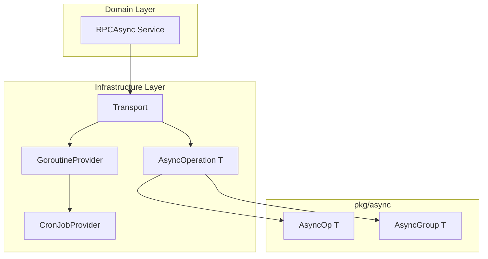

# 【PR全流程文档】Feature - M2 异步编程模型重构

> **文档说明**：本文档包含「前置规划」和「后置总结」两部分，记录从需求对齐到开发完成的全流程，一个PR对应一份全流程文档，归档后作为项目追溯依据。

---

## 第一部分：前置部分（开工前必完成，架构师评审通过）

### 1. 基础信息（与分支/PR绑定）

| 项目 | 内容 |
|------|------|
| 工作类型 | 重构（Refactor）- Feature 范畴 |
| PR编号 | PR-073（创建GitHub PR后补充完整） |
| 分支名称 | `feature/PR-073-async-programming-model` |
| 工作主题 | Transport 异步编程模型重构（AsyncOperation + GoroutineProvider + CronJobProvider + Transport 改造） |
| 负责人 | 🤖 核心开发 A |
| 分支创建日期 | 2026-02-22 |
| 计划开工日期 | 2026-02-24 |
| 计划CI通过日期 | 2026-03-14（2-3 周） |
| 关联需求单号 | M2 存储引擎 - 异步编程模型 |
| 架构师评审状态 | ☑️ 评审通过 |
| 预审批结果 | ☑️ 已通过（架构师批准 2026-02-23） |
| 参考文档 | [Spike 文档 v2.8](../../07_spike/2026-02-22_spike_m2-async-programming-model-refactor.md) |

### 2. 背景与目标（为什么干）

#### 2.1 背景

**业务场景**：
- NexKV 需要高性能的异步 RPC 通信，支持跨节点数据传输和协调
- 当前 Transport 层缺乏统一的异步编程抽象，代码重复且难以维护
- 需要支持批量 RPC 调用（如 Quorum 写入、Gossip 同步）

**现有问题**：
1. **缺乏统一异步抽象**：每个模块自行实现异步逻辑，代码重复
2. **协程管理混乱**：无统一的协程池管理，资源不可控
3. **定时任务分散**：15+ 处定时任务实现分散，缺乏统一管理
4. **监控不完善**：难以追踪异步操作状态和性能

**价值**：
1. **提升开发效率**：统一的异步抽象减少重复代码
2. **提高系统性能**：协程池管理避免资源浪费
3. **增强可维护性**：统一管理定时任务，便于监控和调试
4. **降低 Bug 率**：类型安全的接口减少运行时错误

#### 2.2 核心目标（可量化、可验证）

1. **功能目标**：
   - ✅ 实现 `AsyncOperation[T]` 接口，支持所有状态（Pending/Running/Completed/Failed/Canceled/Discarded/Timeout）
   - ✅ 实现 `GoroutineProvider` 接口，支持优先级、延迟、批量操作
   - ✅ 实现 `CronJobProvider` 扩展，支持定时任务管理
   - ✅ Transport 层成功集成新异步接口

2. **性能目标**：
   - ✅ RPC 调用吞吐量不低于当前实现
   - ✅ 延迟 P99 < 100ms
   - ✅ 协程数量可控（不超过配置的 2 倍）

3. **可用性目标**：
   - ✅ 支持异步操作取消和超时
   - ✅ 支持批量操作的部分失败处理
   - ✅ 支持优雅关闭，避免任务丢失

4. **质量目标**：
   - ✅ 单元测试覆盖率 > 80%
   - ✅ 集成测试通过（5 节点集群）
   - ✅ 代码符合 Go 编码规范

#### 2.3 明确边界（不做什么，避免范围蔓延）

**本次不支持**：
- ❌ Storage Engine 改造（独立 PR）
- ❌ Control Plane 改造（独立 PR）
- ❌ API 层改造（独立 PR）
- ❌ 其他模块改造

**本次不优化**：
- ❌ 网络协议优化（使用现有 libp2p）
- ❌ 序列化优化（使用现有 MessagePack）
- ❌ 其他性能优化（仅保证无回退）

### 3. 实现方案（怎么干，核心设计）

#### 3.1 整体架构设计



#### 3.2 核心接口定义

**1. AsyncOperation[T] 接口**

```go
type AsyncOperation[T any] interface {
    Get(ctx context.Context) (T, error)
    Status() OperationStatus
    Cancel() (canceled bool, err error)
    Discard() error
    IsStarted() bool
    OnComplete(callback func(T, error)) string
    OffComplete(cbID string) error
}
```

**关键特性**：
- ✅ 泛型支持：适用于任意返回类型
- ✅ 状态管理：7 种状态（Pending/Running/Completed/Failed/Canceled/Discarded/Timeout）
- ✅ 回调机制：支持注册完成回调
- ✅ 取消支持：支持操作取消和丢弃
- ✅ **GoroutineProvider 集成**：支持通过 `WithGoroutineProvider` 选项使用协程池

**AsyncOperation 创建选项**:
```go
// 基础创建
op := async.NewOp(ctx, execFunc)

// 带超时
op := async.NewOp(ctx, execFunc, async.WithTimeout(30*time.Second))

// ✅ 使用 GoroutineProvider（新增）
op := async.NewOp(ctx, execFunc, async.WithGoroutineProvider(provider))

// 组合选项
op := async.NewOp(ctx, execFunc, 
    async.WithTimeout(30*time.Second),
    async.WithGoroutineProvider(provider),
)
```

**2. AsyncGroup[T] 批量操作接口** ✅ 新增

```go
type AsyncGroup[T any] struct {
    // 内部字段...
}

// GroupResult 批量操作结果
type GroupResult[T any] struct {
    Values       map[model.PeerID]T
    Errors       map[model.PeerID]error
    SuccessPeers []model.PeerID
    FailedPeers  []model.PeerID
}

// NewGroup 创建批量异步操作组
func NewGroup[T any](
    ctx context.Context,
    targets []model.PeerID,
    execFunc func(ctx context.Context, target model.PeerID) (T, error),
) *AsyncGroup[T]

// WaitAny 等待任意一个完成
func (g *AsyncGroup[T]) WaitAny(ctx context.Context) (model.PeerID, T, error)

// WaitMajority 等待多数派完成
func (g *AsyncGroup[T]) WaitMajority(ctx context.Context) GroupResult[T]

// WaitAll 等待全部完成
func (g *AsyncGroup[T]) WaitAll(ctx context.Context) GroupResult[T]

// CancelAll 取消所有操作
func (g *AsyncGroup[T]) CancelAll() error

// Status 获取所有操作状态
func (g *AsyncGroup[T]) Status() map[model.PeerID]OperationStatus
```

**关键特性**：
- ✅ **批量执行**：同时向多个目标发起异步操作
- ✅ **灵活等待**：支持 WaitAny/WaitMajority/WaitAll 三种模式
- ✅ **结果聚合**：自动收集成功/失败结果和统计信息
- ✅ **广播场景**：适用于 Quorum 写入、Gossip 同步等场景

**使用示例**：
```go
// 创建批量操作组（向 5 个节点发送数据）
targets := []model.PeerID{"node-1", "node-2", "node-3", "node-4", "node-5"}
group := async.NewGroup(ctx, targets, func(ctx context.Context, target model.PeerID) (Result, error) {
    return sendToNode(ctx, target, data)
})

// 等待多数派（3/5）完成
result := group.WaitMajority(ctx)
fmt.Printf("成功: %d, 失败: %d\n", len(result.SuccessPeers), len(result.FailedPeers))

// 或等待全部完成
allResult := group.WaitAll(ctx)
```

**3. GoroutineProvider 接口**

```go
type GoroutineProvider interface {
    // 基础方法 - 统一使用 context
    Submit(ctx context.Context, task func(context.Context)) error
    SubmitWithArg[T any](ctx context.Context, task func(context.Context, T), arg T) error
    SubmitWithResult[T any](ctx context.Context, task func(context.Context) (T, error)) Result[T]
    SubmitWithArgAndResult[T any, R any](
        ctx context.Context,
        task func(context.Context, T) (R, error),
        arg T,
    ) Result[R]

    // 快捷方法
    SubmitWithPriority(ctx context.Context, priority Priority, task func(context.Context)) error
    SubmitDelayed(ctx context.Context, delay time.Duration, task func(context.Context)) error

    // 高级方法
    SubmitAdvanced[T any, R any](
        ctx context.Context,
        task func(context.Context, T) (R, error),
        arg T,
        opts ...SubmitOption,
    ) Result[R]

    // 批量方法
    SubmitBatch(ctx context.Context, tasks []func(context.Context)) error
    SubmitBatchWithArg[T any](ctx context.Context, tasks []func(context.Context, T), args []T) error
    SubmitBatchAllErrors(ctx context.Context, tasks []func(context.Context)) []error
    SubmitBatchWithResult[R any](ctx context.Context, tasks []func(context.Context) (R, error)) []Result[R]

    // 管理方法
    Stats() PoolStats
    Health() HealthStatus
    SetCapacity(capacity int) error
    Close() error
}
```

**关键特性**：
- ✅ **统一 Context**：所有方法都使用 `context.Context`
- ✅ **泛型支持**：`SubmitWithArg[T]`、`SubmitWithResult[T]` 等
- ✅ **避免闭包陷阱**：通过参数传递而非闭包捕获
- ✅ **优先级支持**：4 层优先级（Critical/High/Normal/Low）
- ✅ **批量操作**：支持批量提交和错误收集

**3. CronJobProvider 扩展**

```go
type CronJobProvider interface {
    // 生命周期
    Start()
    Stop() context.Context

    // ======================================
    // 基础方法（无参数）
    // ======================================
    Register(spec CronSpec, name string, task func(context.Context)) (string, error)
    RegisterWithPriority(spec CronSpec, name string, priority Priority, task func(context.Context)) (string, error)

    // ======================================
    // 带参数方法（避免闭包陷阱）✅ 新增
    // ======================================
    RegisterWithArg[T any](spec CronSpec, name string, task func(context.Context, T), arg T) (string, error)
    RegisterWithPriorityAndArg[T any](spec CronSpec, name string, priority Priority, task func(context.Context, T), arg T) (string, error)

    // 任务控制
    Pause(jobID string) error
    Resume(jobID string) error
    Unregister(jobID string) error

    // 任务查询
    GetJob(jobID string) (*CronJobInfo, error)
    ListJobs() []*CronJobInfo
}
```

**关键特性**：
- ✅ **统一 Context**：所有任务都接收 `func(context.Context)`
- ✅ **带参数支持**：`RegisterWithArg[T]` 避免闭包陷阱，类型安全
- ✅ **优先级集成**：定时任务提交到 GoroutineProvider 时保留优先级
- ✅ **生命周期管理**：支持 Pause/Resume/Unregister
- ✅ **与 GoroutineProvider 集成**：共享协程池资源

#### 3.3 目录结构

```
pkg/async/                           # 异步抽象层（新增）
├── async_op.go                      # AsyncOperation[T] 接口 + 实现
├── async_group.go                   # AsyncGroup[T] 批量操作
└── bridge.go                        # 桥接工具（可选）

internal/infrastructure/
├── concurrency/                     # 并发管理（新增）
│   ├── goroutine_provider.go        # 协程池提供者
│   ├── ants_provider.go             # ants 实现
│   └── robfig_cron_provider.go      # robfig/cron 实现
└── transport/                       # 传输层（改造）
    ├── libp2p_rpc.go                # RPC 传输实现（使用新异步）
    └── async_lifecycle.go           # 异步生命周期管理

internal/domain/
├── model/                           # 领域模型（已存在）
└── service/                         # 领域服务（改造）
    ├── rpc_async.go                 # RPCAsync 接口 + 实现
    └── broadcast.go                 # BroadcastService（可选）
```

#### 3.4 实施路径（2-3 周）

```
Week 1: 基础设施层（pkg/async + concurrency）
├── Day 1-2: AsyncOperation[T] 核心实现
│   ├── async_op.go（接口定义 + 实现）
│   ├── 单元测试
│   └── 基准测试
├── Day 3-4: GoroutineProvider 改进版
│   ├── goroutine_provider.go（改进接口）
│   ├── ants 集成
│   └── 单元测试
└── Day 5: AsyncGroup[T] 批量操作
    ├── async_group.go
    └── 单元测试

Week 2: Transport 层改造 + CronJobProvider
├── Day 1-2: RPCAsync 接口实现
│   ├── rpc_async.go（领域服务）
│   └── 集成测试
├── Day 3-4: Transport 集成
│   ├── libp2p_rpc.go（改造）
│   ├── 使用新的 AsyncOperation[T]
│   └── 集成测试
└── Day 5: CronJobProvider 实现
    ├── robfig_cron_provider.go
    └── 单元测试

Week 3（可选）: 优化与文档
├── 性能优化
├── 文档更新
└── Code Review
```

#### 3.5 关键设计决策

| 决策点 | 决策 | 理由 |
|--------|------|------|
| **接口定义位置** | `AsyncOperation[T]` → `pkg/async`<br>`GoroutineProvider` → `internal/infrastructure/concurrency`<br>`CronJobProvider` → `internal/infrastructure/concurrency` | 跨层共享 vs 内部使用 |
| **统一 Context** | 所有方法都使用 `context.Context` | 符合 Go 惯例，支持取消和超时 |
| **泛型支持** | `SubmitWithArg[T]`、`SubmitWithResult[T]` 等 | 避免闭包陷阱，类型安全 |
| **依赖方向** | Transport 依赖 Infrastructure 层<br>CronJobProvider 依赖 GoroutineProvider | 依赖倒置，解耦清晰 |
| **协程池实现** | 使用 ants 库 | 生产验证，性能优秀 |
| **定时任务实现** | 使用 robfig/cron 库 | 生产验证，功能完善 |

### 4. 风险评估与应对措施

| 风险点 | 影响等级 | 概率 | 应对措施 |
|--------|----------|------|----------|
| **接口设计不兼容** | 高 | 低 | ✅ 已通过 Spike 验证，架构师评审通过 |
| **性能回退** | 高 | 中 | ✅ 性能测试对比新旧实现<br>✅ 基准测试覆盖关键路径 |
| **协程池资源耗尽** | 中 | 中 | ✅ 配置协程池容量限制<br>✅ 监控协程数量<br>✅ 支持动态调整容量 |
| **定时任务冲突** | 中 | 低 | ✅ 统一管理，避免重复任务<br>✅ 支持任务暂停和恢复 |
| **迁移成本高** | 中 | 中 | ✅ 提供迁移指南<br>✅ 保留旧接口适配器（可选）<br>✅ 逐步迁移，非一次性替换 |
| **测试覆盖不足** | 高 | 低 | ✅ 单元测试覆盖率 > 80%<br>✅ 集成测试覆盖关键路径<br>✅ 5 节点集群测试 |
| **依赖库版本冲突** | 低 | 低 | ✅ 使用 go modules 管理依赖<br>✅ 锁定依赖版本 |

### 4.1 回滚计划 ✅ 新增

**回滚触发条件**:
- 生产环境出现严重性能回退（吞吐量下降 > 20%）
- 发现不可修复的数据一致性 bug
- 协程池资源泄漏导致系统不稳定

**回滚策略**:
| 层级 | 措施 | 说明 |
|------|------|------|
| **Feature Flag** | 禁用新实现 | 通过配置 `useNewAsyncModel=false` 快速回退到旧实现 |
| **代码回滚** | 回退到上一版本 | 如果 feature flag 无法解决问题，回退代码版本 |
| **数据兼容** | 无需数据迁移 | 新实现不修改存储格式，回滚无数据风险 |

**回滚检查清单**:
- [ ] 旧 Transport 实现保留在代码库中（标记为 deprecated）
- [ ] Feature flag 配置已验证
- [ ] 回滚操作文档已编写
- [ ] 回滚演练已完成（staging 环境）

### 5. 成功标准

#### 5.1 功能标准

**核心接口功能**:
- [ ] `AsyncOperation[T]` 支持所有状态（Pending/Running/Completed/Failed/Canceled/Discarded/Timeout）
- [ ] `AsyncOperation[T]` 支持取消、超时、回调功能
- [ ] `AsyncGroup[T]` 支持 WaitAny/WaitMajority/WaitAll 三种等待模式
- [ ] `GoroutineProvider` 所有方法正常工作（Submit/SubmitWithArg/SubmitWithResult/批量方法）
- [ ] `GoroutineProvider` 优先级调度正常工作（Critical/High/Normal/Low）
- [ ] `CronJobProvider` 所有功能正常工作（Register/Pause/Resume/Unregister）
- [ ] `CronJobProvider` 带参数方法正常工作（RegisterWithArg/RegisterWithPriorityAndArg）
- [ ] Transport 层成功集成新异步接口

**集群测试场景** ✅ 细化:
- [ ] 5 节点集群正常写入/读取（Quorum 写入成功）
- [ ] 节点故障时的异步操作处理（优雅降级）
- [ ] 网络分区恢复后的状态一致性
- [ ] 高并发场景下的协程池行为（资源不耗尽）
- [ ] 定时任务在集群环境下的调度一致性
- [ ] 优雅关闭时任务不丢失

#### 5.2 质量标准

- [ ] 单元测试覆盖率 > 80%（所有单元测试通过）
- [ ] 集成测试通过
- [ ] 性能无回退（对比旧实现）
- [ ] 代码符合 Go 编码规范（通过 golangci-lint）
- [ ] Code Review 通过

#### 5.3 文档标准

- [ ] 接口文档完整
- [ ] 使用示例清晰
- [ ] Post 文档总结到位
- [ ] 迁移指南完整

### 6. 架构师评审记录（循环优化，直至通过）

| 评审轮次 | 评审日期 | 评审人（架构师） | 核心评审意见 | 优化措施（含AI辅助修改） | 优化结果 |
|----------|----------|------------------|--------------|--------------------------|----------|
| 第1轮 | 2026-02-23 | 👤 架构师 | Pre 文档 v1.1 质量优秀，设计合理，风险可控。AsyncGroup[T] 批量操作接口设计精良，回滚计划完善。 | ✅ 补充 AsyncGroup[T] 接口<br>✅ 细化测试场景<br>✅ 添加回滚计划 | ✅ 通过 |

### 7. 预审批确认

> **架构师签字/备注**：✅ **预审批通过**
>
> **评审状态**：☑️ 已通过
>
> **批准日期**：2026-02-23
>
> **备注**：Pre 文档 v1.1 质量优秀，设计合理，风险可控。AsyncGroup[T] 批量操作接口设计精良，回滚计划完善。同意启动开发，需严格按照文档落地实施，确保 CI 通过后提交 Post 总结。

---

## 第二部分：流程节点记录（开发/CI过程追溯）

### 1. 开发过程记录

| 节点 | 完成日期 | 具体内容 | 交付物 |
|------|----------|----------|--------|
| 启动开发 | - | - | - |
| 本地测试 | - | - | - |
| Post文档编写 | - | - | - |
| 架构师Post批准 | - | - | - |
| 提交GitHub | - | - | - |

### 2. CI流程记录（修复Bug直至通过）

| CI轮次 | 触发时间 | 结果 | 问题详情 | 修复措施 | 修复结果 |
|--------|----------|------|----------|----------|----------|
| - | - | - | - | - | - |

---

## 第三部分：后置部分（CI通过后必完成，架构师评审通过）

> **说明**：CI 通过后，请补充以下内容，并提交给架构师评审。

### 1. 实施总结

#### 1.1 实际开发内容

[描述实际开发的详细内容，包括关键代码、重要决策等]

#### 1.2 与 Pre 文档的差异

[描述实际开发与 Pre 文档的差异，包括新增功能、删除功能、调整设计等]

#### 1.3 遇到的问题与解决方案

[描述开发过程中遇到的关键问题及解决方案]

### 2. 测试报告

#### 2.1 单元测试

- **测试覆盖率**：[实际覆盖率]%
- **测试用例数**：[用例数量]
- **测试结果**：[通过/失败]

#### 2.2 集成测试

- **测试场景**：[描述测试场景]
- **测试结果**：[通过/失败]

#### 2.3 性能测试

- **吞吐量对比**：[新旧实现对比]
- **延迟对比**：[P50/P95/P99 对比]
- **资源使用**：[协程数量、内存使用等]

### 3. 代码审查记录

[Code Review 记录，包括审查意见和修改情况]

### 4. 架构师 Post 评审

> **架构师签字/备注**：[待 Post 文档完成后补充]
>
> **评审状态**：□ 未通过 □ 已通过
>
> **备注**：[架构师对实施结果的评价]

---

## 附录

### A. 相关文档

1. [Spike 文档 v2.8](../../07_spike/2026-02-22_spike_m2-async-programming-model-refactor.md)
2. [DDD架构 - AsyncOperation](../../07_spike/2026-02-18_spike_nexkv-ddd-interface.md#13-b3-asyncoperation)
3. [DDD架构 - GoroutineProvider](../../07_spike/2026-02-18_spike_nexkv-ddd-interface.md#13-b4-goroutineprovider)
4. [DDD架构 - AsyncGroup](../../07_spike/2026-02-18_spike_nexkv-ddd-interface.md#13-b4-11-asyncgroup)

### B. 依赖库

1. **ants** (v2.x)：高性能协程池
   - GitHub: https://github.com/panjf2000/ants
   - License: MIT
   - 生产验证：大规模生产环境使用

2. **robfig/cron** (v3.x)：定时任务调度
   - GitHub: https://github.com/robfig/cron
   - License: MIT
   - 生产验证：广泛使用，功能完善

---

**文档版本**: v1.1
**创建日期**: 2026-02-23
**最后更新**: 2026-02-23
**维护者**: 🤖 核心开发 A + 👤 架构师
**状态**: ☑️ 待架构师评审

**变更历史**:
| 版本 | 日期 | 变更内容 | 作者 |
|------|------|----------|------|
| v1.0 | 2026-02-23 | 初始版本创建 | 🤖 核心开发 A |
| v1.1 | 2026-02-23 | 补充 AsyncGroup[T] 接口、细化测试场景、添加回滚计划 | 🤖 核心开发 A |
