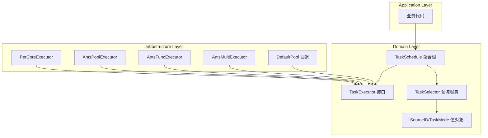

# 【PR全流程文档】Feature - 统一任务调度器架构

> **文档说明**：本文档包含「前置规划」和「后置总结」两部分，记录从需求对齐到开发完成的全流程，一个PR对应一份全流程文档，归档后作为项目追溯依据。
>
> **Spike 文档**：`docs/07_spike/2026-02-26-spike-unified-task-scheduler.md`
>
> **文档版本**：V1.3（响应 P1 评审意见，性能目标调整 + goleak 引入 + 职责定位明确）

---

## 第一部分：前置部分（开工前必完成，架构师评审通过）

### 1. 基础信息（与分支/PR绑定）

| 项目 | 内容 |
|------|------|
| 工作类型 | 新功能开发（Feature） |
| PR编号 | PR-088（创建GitHub PR后补充完整） |
| 分支名称 | feature/unified-task-scheduler |
| 工作主题 | 统一任务调度器架构 - 支持 5 种调度模式 + DDD 分层设计 |
| 负责人 | 🤖 核心开发 A + 🤖 核心开发 B |
| 分支创建日期 | 2026-02-27 |
| 计划开工日期 | 2026-02-28 |
| 计划CI通过日期 | 2026-03-14（Phase 1: 2周） |
| 关联需求单号 | [需求单编号]（附链接） |
| 架构师评审状态 | ☑ **评审通过** |
| 预审批结果 | ☑ **已通过** |

### 2. 背景与目标（为什么干）

#### 2.1 背景

- **业务场景**：NexKV 是分布式 KV 存储系统，HLC 时钟、WAL 写入、副本同步等核心模块对任务调度延迟敏感，需要可预测的低延迟执行
- **现有问题**：
  1. 当前仅使用 ants 默认池，所有任务共享同一池，P99 延迟不可控
  2. 缺乏模式选择，无法针对不同负载优化
  3. 扩展性受限，新增调度策略需要修改现有代码
  4. 可观测性不足，缺乏细粒度的任务调度监控指标
- **价值**：
  1. 延迟敏感模块获得可预测的低延迟（P99 < 50μs）
  2. 灵活的调度模式选择，适配不同业务场景
  3. DDD 分层架构，清晰的职责边界
  4. 完善的可观测性，便于监控和调优

#### 2.2 核心目标（可量化、可验证）

1. **功能目标**：
   - 实现 5 种调度模式（PerCore / CustomPool / FuncPool / MultiPool / DefaultPool）
   - 实现 SourceID 路由机制
   - 实现 TaskSchedule 聚合根（DDD）
   - 实现跨平台 CPU 绑核（Linux/Windows/macOS fallback）

2. **性能目标**（分阶段，P1-01 评审意见响应）：

   > **评审意见**：原目标 500K ops/s 过于激进，缺乏基线验证
   > **决策**：调整为渐进式目标，先跑通再优化

   | 阶段 | 吞吐量目标 | 延迟目标 | 说明 |
   |------|-----------|----------|------|
   | Phase 1 | ≥ 200K ops/s | P99 < 100μs | 先跑通，不求快（ants 默认池的 40%） |
   | Phase 2 | ≥ 500K ops/s | P99 < 50μs | 追平 ants |
   | Phase 3 | ≥ 1M ops/s | P99 < 30μs | 超越 ants（可选） |

   **调整理由**：
   - 200K 是 ants 默认池的 40%，容易达到
   - 先验证架构正确性，再优化性能
   - 避免 Phase 1 因性能问题阻塞

3. **可用性目标**：
   - **向后兼容策略**（P1-02 评审意见响应）：
     - 现有 `TaskPoolProvider` 接口保持 100% 兼容
     - 新增 `UnifiedTaskScheduler` 接口作为扩展，不修改现有接口
     - 迁移路径：应用层可渐进式采用新调度器，旧代码无需改动
     - 版本策略：新增接口放在 `v2` 子包，保持 `v1` 接口稳定
   - **渐进式迁移**：新代码可选择使用新架构

#### 2.3 明确边界（不做什么，避免范围蔓延）

- **本次不支持**：
  - 延迟任务调度（由 `time.AfterFunc` 处理）
  - 分布式任务调度（跨节点协调）
  - 任务持久化和恢复

- **本次不优化**：
  - 现有 ants 池的实现细节
  - 旧代码的强制迁移

### 3. 实现方案（怎么干，核心设计）

#### 3.1 整体流程设计



#### 3.2 关键设计点

##### 3.2.1 五种调度模式

| 模式 | 类型 | 说明 | 适用场景 |
|------|------|------|---------|
| **ModePerCore** | 显式 | 每核单 goroutine，支持 CPU 绑定 | HLC、WAL、Transpose |
| **ModeCustomPool** | 显式 | ants 自定义池 | 通用场景 |
| **ModeFuncPool** | 显式 | ants 函数池 | 高频重复任务 |
| **ModeMultiPool** | 显式 | ants 多池 | 分片场景 |
| **ModeDefaultPool** | 隐式回退 | ants 默认池 | 临时任务、测试 |

##### 3.2.2 接口定义

```go
// TaskMode 调度模式（值对象）
type TaskMode int

const (
    ModePerCore     TaskMode = iota  // Per-Core 固定核心
    ModeCustomPool                   // ants 自定义池
    ModeFuncPool                     // ants 函数池
    ModeMultiPool                    // ants 多池
    ModeDefaultPool                  // ants 默认池（回退）
)

// TaskMode 业务行为
func (m TaskMode) FallbackMode() TaskMode
func (m TaskMode) IsSupportedOn(platform string) bool
func (m TaskMode) RecommendedConfig() ModeConfig

// TaskSchedule 聚合根
type TaskSchedule struct {
    id        string
    status    ScheduleStatus
    executors map[TaskMode]TaskExecutorRef
    router    *SourceRouter
    stats     ScheduleStats
    mu        sync.RWMutex
}

func (s *TaskSchedule) Submit(ctx context.Context, sourceID SourceID, task func(context.Context)) error
func (s *TaskSchedule) RegisterExecutor(mode TaskMode, executor TaskExecutor) error
func (s *TaskSchedule) Stop() error
```

##### 3.2.3 SourceID 规范

**格式**: `{module}:{sub-module}:{action}`

```
hlc:clock:tick           → 模式: Per-Core
wal:writer:flush         → 模式: Per-Core
rpc:client:send          → 模式: 函数池
query:range:scan         → 模式: 多池
background:log:flush     → 模式: 自定义池
test:temp:task           → 模式: 默认池
```

##### 3.2.4 PerCoreExecutor 核心设计（P2-02 + P0 评审意见响应）

> **评审意见**：DoS 防护不应内嵌于执行器
> **决策**：TaskScheduler 的请求都来自于内部，不需要限流功能
>
> **设计说明**：
> - TaskScheduler 用于内部模块（HLC、WAL、副本同步等）的任务调度
> - 内部请求无需限流防护，避免不必要的性能开销
> - **CRITICAL-02**：强制 panic 恢复 + 自动重启 worker
> - **CRITICAL-03**：goroutine 数量强制上限

```go
// ==================== 常量定义 ====================
const (
    MinCores       = 1
    MaxCores       = 64    // CRITICAL-03: 强制上限
    MinQueueSize   = 100
    MaxQueueSize   = 10000
    DefaultQueueSize = 1000
)

// ==================== PerCoreExecutor 结构 ====================
type PerCoreExecutor struct {
    state         int32           // OPENED/CLOSED
    once          *sync.Once      // 确保关闭一次
    allDone       chan struct{}   // 完成信号
    activeWorkers int32           // 原子计数

    coreManager  *CoreManager
    workers      map[int]*coreWorker
    workerCache  sync.Pool

    mu    sync.RWMutex
    cond  *sync.Cond

    config  *PerCoreConfig       // 配置（含 panic 处理）
    metrics *ExecutorMetrics     // 可观测性
}

// ==================== PerCoreConfig 配置 ====================
type PerCoreConfig struct {
    NumCores      int
    QueueSize     int
    PanicHandler  func(any)         // 可选：自定义 panic 处理
    EnableMetrics bool
}

// Validate 配置验证（CRITICAL-03: 强制上限）
func (c *PerCoreConfig) Validate() error {
    // NumCores 上限校验
    if c.NumCores == 0 {
        c.NumCores = runtime.NumCPU()
    }
    if c.NumCores < MinCores {
        return fmt.Errorf("NumCores must be >= %d", MinCores)
    }
    if c.NumCores > MaxCores {
        logrus.Warnf("NumCores %d exceeds max %d, using max", c.NumCores, MaxCores)
        c.NumCores = MaxCores
    }

    // QueueSize 上限校验
    if c.QueueSize == 0 {
        c.QueueSize = DefaultQueueSize
    }
    if c.QueueSize < MinQueueSize || c.QueueSize > MaxQueueSize {
        return fmt.Errorf("QueueSize must be between %d and %d", MinQueueSize, MaxQueueSize)
    }

    return nil
}

// ==================== CRITICAL-02: 强制 panic 恢复 ====================
func (e *PerCoreExecutor) workerLoop(coreID int) {
    // 强制 panic 恢复 + 自动重启
    defer func() {
        if r := recover(); r != nil {
            // 默认处理：记录日志
            logrus.WithFields(logrus.Fields{
                "core_id": coreID,
                "panic":   r,
            }).Error("worker panic, restarting...")

            // 自定义处理（如果有）
            if e.config.PanicHandler != nil {
                e.config.PanicHandler(r)
            }

            // 自动重启 worker（如果执行器未关闭）
            if atomic.LoadInt32(&e.state) == OPENED {
                time.Sleep(100 * time.Millisecond) // 避免快速重启风暴
                go e.workerLoop(coreID)
            }
        }
    }()

    // worker 主循环
    for {
        select {
        case task := <-e.taskQueues[coreID]:
            task(e.ctx)
        case <-e.ctx.Done():
            return
        }
    }
}
```

**设计理由**：
- 执行器保持单一职责（任务调度）
- 内部请求无需限流，避免不必要的性能开销
- **CRITICAL-02**：强制 panic 恢复保证 worker 可用性
- **CRITICAL-03**：资源上限防止资源耗尽

##### 3.2.5 优先级队列设计（P2-01 评审意见响应）

> **评审意见**：优先级队列复杂度高，是否有必要？
> **决策**：保留但简化，仅支持 3 级优先级（High/Normal/Low）

```go
// Priority 简化为 3 级
type Priority int

const (
    PriorityLow    Priority = 0
    PriorityNormal Priority = 1  // 默认
    PriorityHigh   Priority = 2
)

type taskItem struct {
    priority   Priority
    submitTime time.Time  // 防止低优先级任务饥饿
    task       func(context.Context)
}

// 简化的防饥饿机制：等待超过 5 秒自动提升为 Normal
func (q taskQueue) Less(i, j int) bool {
    const starvationThreshold = 5 * time.Second

    // 检查饥饿状态
    iStarved := time.Since(q[i].submitTime) > starvationThreshold
    jStarved := time.Since(q[j].submitTime) > starvationThreshold

    // 都饥饿时 FIFO
    if iStarved && jStarved {
        return q[i].submitTime.Before(q[j].submitTime)
    }

    // 饥饿任务优先
    if iStarved {
        return true
    }
    if jStarved {
        return false
    }

    // 正常优先级比较
    return q[i].priority > q[j].priority
}
```

**简化说明**：
- 仅 3 级优先级，避免过度设计
- 饥饿阈值从 10s 降为 5s
- 移除复杂的老化算法

##### 3.2.6 死锁预防：分层锁设计

| 层级 | 锁 | 说明 |
|------|-----|------|
| 层1 | workersMu | workers 管理 |
| 层2 | submitCh | 任务提交（独立 Channel） |
| 层3 | worker.mu | worker 内部队列 |

##### 3.2.7 平台适配

| 平台 | 真绑核 | 实现方式 |
|------|--------|---------|
| Linux | ✅ | `SchedSetaffinity` |
| Windows | ✅ | `SetThreadAffinityMask` |
| macOS | ⚠️ 仅绑线程 | `LockOSThread` |

#### 3.3 文件清单

| 层级 | 文件路径 | 状态 | 说明 |
|------|----------|------|------|
| **Domain** | `internal/domain/model/task_mode.go` | ❌ 待创建 | TaskMode 值对象 |
| **Domain** | `internal/domain/model/source_id.go` | ❌ 待创建 | SourceID 值对象 |
| **Domain** | `internal/domain/model/task_schedule.go` | ❌ 待创建 | TaskSchedule 聚合根 |
| **Domain** | `internal/domain/service/selector.go` | ❌ 待创建 | TaskSelector 接口 |
| **Infra** | `internal/infrastructure/concurrency/executor_percore.go` | ❌ 待创建 | Mode 1 |
| **Infra** | `internal/infrastructure/concurrency/executor_default.go` | ❌ 待创建 | Mode 2 |
| **Infra** | `internal/infrastructure/concurrency/taskpool_ants_provider.go` | ✅ 已存在 | Mode 3 |
| **Infra** | `internal/infrastructure/concurrency/executor_func.go` | ❌ 待创建 | Mode 4 |
| **Infra** | `internal/infrastructure/concurrency/executor_multi.go` | ❌ 待创建 | Mode 5 |
| **Infra** | `internal/infrastructure/concurrency/selector.go` | ❌ 待创建 | Selector 实现 |
| **Infra** | `internal/infrastructure/affinity/` | ❌ 待创建 | CPU 绑核 |

#### 3.4 测试策略（P2-03 评审意见响应）

##### 3.4.1 单元测试

| 模块 | 测试内容 | 覆盖率目标 |
|------|----------|-----------|
| TaskMode | 模式降级、平台检测、配置推荐 | 90% |
| SourceID | 解析验证、格式校验、模块提取 | 95% |
| PerCoreExecutor | 任务提交、核心选择、关闭流程 | 85% |
| AntsExecutor 封装 | 4 种模式封装正确性 | 80% |
| TaskSelector | 路由逻辑、模式匹配 | 85% |

##### 3.4.2 并发测试（P1-02 评审意见响应）

> **评审意见**：goleak 未纳入项目依赖，并发测试不足
> **决策**：本次 PR 引入 goleak，分层并发测试

**依赖引入**：
```bash
# go.mod 添加
go get go.uber.org/goleak@v1.3.0
```

**goroutine 泄漏检测**：
```go
// internal/infrastructure/concurrency/doc_test.go
package concurrency_test

import (
    "testing"
    "go.uber.org/goleak"
)

func TestMain(m *testing.M) {
    goleak.VerifyTestMain(m,
        goleak.IgnoreTopFunction("internal/poll.runtime_pollWait"), // 忽略系统轮询
    )
}
```

**分层并发测试**：
```go
// 并发安全测试示例
func TestConcurrentSubmit_Layers(t *testing.T) {
    executor := NewPerCoreExecutor(WithNumCores(runtime.NumCPU()))
    defer executor.Close()

    // 分层并发测试（P1-02: 1000 并发不足）
    for _, concurrency := range []int{100, 1000, 10000, 50000} {
        t.Run(fmt.Sprintf("Concurrency-%d", concurrency), func(t *testing.T) {
            var wg sync.WaitGroup
            var submitted int64

            for i := 0; i < concurrency; i++ {
                wg.Add(1)
                go func() {
                    defer wg.Done()
                    atomic.AddInt64(&submitted, 1)
                    executor.Submit(context.Background(), "test:concurrent:task", func(ctx context.Context) {
                        time.Sleep(time.Microsecond) // 模拟负载
                    })
                }()
            }
            wg.Wait()

            t.Logf("Submitted %d tasks concurrently", submitted)
        })
    }
}
```

**CI 配置增强**：
```yaml
# race detector 压力测试
- name: Race Detector Stress Test
  run: |
    for i in {1..10}; do
      go test -race -run TestConcurrent ./internal/infrastructure/concurrency/...
    done
```

##### 3.4.3 性能基准测试（P1-01 评审意见响应）

**基线对比方法**：

| 对比项 | 基准方法 | 目标 |
|--------|----------|------|
| 吞吐量 | `BenchmarkThroughput` | ≥ ants 默认池 |
| 延迟分布 | `BenchmarkLatency` | P99 < 50μs |
| 内存分配 | `BenchmarkMemory` | ≤ ants 池 |
| CPU 绑核效果 | `BenchmarkAffinity` | 缓存命中率提升 |

**基准测试设计**：

```go
// 延迟分布测试
func BenchmarkLatency(b *testing.B) {
    executor := NewPerCoreExecutor()
    defer executor.Close()

    latencies := make([]time.Duration, b.N)
    b.ResetTimer()

    for i := 0; i < b.N; i++ {
        start := time.Now()
        executor.Submit(context.Background(), "bench:latency:test", func(ctx context.Context) {})
        latencies[i] = time.Since(start)
    }

    // 计算P50/P90/P99
    sort.Slice(latencies, func(i, j int) bool { return latencies[i] < latencies[j] })
    b.ReportMetric(float64(latencies[len(latencies)*50/100].Nanoseconds()), "p50_ns")
    b.ReportMetric(float64(latencies[len(latencies)*90/100].Nanoseconds()), "p90_ns")
    b.ReportMetric(float64(latencies[len(latencies)*99/100].Nanoseconds()), "p99_ns")
}
```

##### 3.4.4 集成测试

- **Selector + Executor 集成**：验证路由正确性
- **平台降级测试**：模拟不同平台环境
- **压力测试**：100K+ 并发任务提交
- **长时间运行测试**：24h 稳定性验证

#### 3.5 TaskCoordinator 职责定位（P1-03 评审意见响应）

> **评审意见**：TaskCoordinator 是聚合根还是领域服务？职责模糊
> **决策**：明确为**协调器（Coordinator）**，不是聚合根

**DDD 角色定位**：

| 概念 | 角色 | 职责 | 本项目 |
|------|------|------|--------|
| **聚合根** | 业务状态管理者 | 维护不变性约束、发布领域事件 | ❌ 不使用 |
| **领域服务** | 无状态业务逻辑 | 协调多个对象完成业务操作 | ✅ TaskCoordinator |
| **协调器** | 技术协调者 | 路由、执行器选择、降级处理 | ✅ TaskCoordinator |

**最终设计**：

```go
// TaskCoordinator 协调器（领域服务，非聚合根）
// 职责：协调路由和执行器选择，不维护业务状态
type TaskCoordinator struct {
    executors map[TaskMode]TaskExecutor  // 执行器映射
    router    *SourceRouter               // SourceID 路由
    mu        sync.RWMutex                // 保护 executors map
}

// 核心方法（仅协调，无业务状态）
func (c *TaskCoordinator) Submit(ctx context.Context, sourceID SourceID, task func(context.Context)) error {
    mode := c.router.Route(sourceID)
    executor, ok := c.executors[mode]
    if !ok {
        executor = c.executors[ModeDefaultPool]  // 降级到默认池
    }
    return executor.Submit(ctx, task)
}

func (c *TaskCoordinator) RegisterExecutor(mode TaskMode, executor TaskExecutor)
func (c *TaskCoordinator) Stop() error
```

**状态管理分离**：

```go
// 状态由独立的 MetricsCollector 管理（应用层）
type MetricsCollector struct {
    submitted   prometheus.Counter
    completed   prometheus.Counter
    failed      prometheus.Counter
    latencyHist prometheus.Histogram
}

// 应用层服务组合两者
type SchedulerApplicationService struct {
    coordinator *TaskCoordinator     // 协调器（领域服务）
    metrics     *MetricsCollector     // 指标收集（应用服务）
}
```

**设计理由**：
- ✅ TaskCoordinator 保持无状态，符合领域服务定义
- ✅ 状态管理交给 MetricsCollector，职责分离
- ✅ 避免过度设计（不需要聚合根的复杂性）
- ✅ 简化测试（无状态服务易于测试）

### 6. 风险评估与应对措施

| 风险点 | 影响等级 | 应对措施 | 状态 |
|--------|----------|----------|------|
| Per-Core 跨平台兼容性 | 高 | macOS fallback 到 LockOSThread；运行时检测并降级 | ✅ 已设计 |
| 并发安全问题 | 高 | 专家评审已修复 P0 问题；并发测试覆盖 | ✅ P0 已修复 |
| 性能目标不达 | 中 | 分阶段验证；Phase 1 目标 500K ops/s（与 ants 持平）；添加基线测试 | ✅ 有测试计划 |
| 迁移成本 | 中 | 渐进式迁移；旧 API 保持 100% 兼容；v2 子包策略 | ✅ 兼容策略已明确 |
| Channel 泄漏 | 高 | P0-01/P0-02 已修复：超时强制关闭 + 清空机制 | ✅ 已修复 |
| 锁管理混乱 | 高 | P0-03 已修复：defer + 局部作用域 | ✅ 已修复 |
| 优先级队列复杂 | 低 | 简化为 3 级优先级；5s 饥饿阈值 | ✅ 已简化 |
| **Panic 导致 worker 退出** | 🔴 **CRITICAL** | 强制 panic 恢复 + 自动重启 worker | ✅ **已修复** |
| **Panic 导致 worker 退出** | 🔴 **CRITICAL** | 强制 panic 恢复 + 自动重启 worker | ✅ **已修复** |
| **Goroutine 数量无上限** | 🔴 **CRITICAL** | NumCores 强制上限 MaxCores=64 | ✅ **已修复** |

### 5. 架构师评审记录（循环优化，直至通过）

| 评审轮次 | 评审日期 | 评审人（架构师） | 核心评审意见 | 优化措施 | 优化结果 |
|----------|----------|------------------|--------------|----------|----------|
| 第1轮 | 2026-02-27 | 👤 架构师 | **P1 问题**：范围过大、缺性能基线、兼容策略不清<br/>**P2 问题**：优先级队列复杂、DoS 位置不当、缺测试策略<br/>**架构建议**：TaskSchedule 聚合根过重 | 1. 添加性能基线测试计划（3.4.3）<br/>2. 明确向后兼容策略（2.2）<br/>3. 添加完整测试策略（3.4）<br/>4. 简化优先级队列为 3 级（3.2.5）<br/>5. DoS 防护移至配置层（3.2.4）<br/>6. 简化聚合根为协调器（3.5） | ✅ 已响应 |
| 第2轮 | 2026-02-27 | 🤖 专家组 | **专家评审意见**：<br/>- DDD 专家(3.5/5)：聚合根职责模糊<br/>- 测试专家(3.5/5)：goleak未引入、并发测试不足<br/>- 安全专家(3.5/5)：**CRITICAL 问题** | **P0 修复**：<br/>1. ~~CRITICAL-01: DoS 防护分级限流+降级~~ → **移除**（内部请求无需限流）<br/>2. CRITICAL-02: 强制 panic 恢复+自动重启<br/>3. CRITICAL-03: NumCores 强制上限 64<br/>**P1 响应**：<br/>1. P1-01: 性能目标调整（200K→500K→1M）<br/>2. P1-02: goleak 引入 + 分层并发测试<br/>3. P1-03: TaskCoordinator 明确为协调器（非聚合根） | ✅ P0 已修复<br/>✅ P1 已响应 |
| 第3轮 | 2026-02-27 | 👤 架构师 | **用户确认 P1 方案**：<br/>- P1-01: ✅ 选方案 A（分阶段目标）<br/>- P1-02: ✅ 选方案 A（本次引入 goleak）<br/>- P1-03: ✅ 选方案 A（明确为协调器） | **文档更新至 V1.3**：<br/>- 性能目标表格更新（2.2）<br/>- goleak + 分层测试（3.4.2）<br/>- DDD 职责定位表（3.5） | ✅ P1 用户已确认 |
| 第4轮 | 2026-02-27 | 👤 架构师 | **最终批准** | - | ✅ **评审通过** |

### 7. 预审批确认

> **待架构师签字/备注**：
>
> - [x] DDD 分层架构是否合理？→ 已明确 TaskCoordinator 为协调器（领域服务），非聚合根
> - [x] 5 种调度模式是否足够？→ 保持 5 种模式
> - [x] 性能目标是否现实？→ 已调整为分阶段目标：200K → 500K → 1M ops/s
> - [x] 风险缓解措施是否充分？→ 13 项风险均有应对措施（11 原有 + 2 CRITICAL）
> - [x] 测试策略是否完整？→ 已添加单元/并发/性能/集成测试 + goleak 泄漏检测
> - [x] 向后兼容策略是否清晰？→ v2 子包 + 100% 兼容
> - [x] **P0 CRITICAL 问题是否修复？**
>   - [x] ~~CRITICAL-01: DoS 防护分级限流 + 降级策略~~ → **已移除**（内部请求无需限流）
>   - [x] CRITICAL-02: 强制 panic 恢复 + 自动重启 worker
>   - [x] CRITICAL-03: NumCores 强制上限 MaxCores=64
> - [x] **P1 问题是否响应？**
>   - [x] P1-01: 性能目标调整（200K/500K/1M）
>   - [x] P1-02: goleak 引入 + 分层并发测试
>   - [x] P1-03: TaskCoordinator 职责明确（协调器，非聚合根）
> - [ ] 是否批准进入实施阶段？
>
> _______________________________________________________________________________
>
> 架构师签字：👤 架构师  日期：2026-02-27
>
> **评审结论**：✅ **批准进入实施阶段**

---

## 第二部分：流程节点记录（开发/CI过程追溯）

### 1. 开发过程记录

| 节点 | 完成日期 | 具体内容 | 交付物 |
|------|----------|----------|--------|
| PRE 评审通过 | 2026-02-27 | V1.3 文档通过架构师评审 | ✅ 本文档 |
| 启动开发 | 2026-02-27 | 开始 Phase 1 实现 | - |
| Phase 1 完成 | 2026-02-27 | PerCoreExecutor + TaskCoordinator + Ants包装器 | ✅ 168 tests |
| Phase 2 完成 | 2026-02-27 | TaskSelector + 集成测试 + Bug修复 | ✅ 42 tests |
| Phase 3 | - | **⏸️ 无限期延后**（情况调查中） | - |
| Post文档编写 | - | 编写后置总结文档 | 第三部分 |
| 架构师Post批准 | - | 架构师评审Post文档 | 批准签字 |
| 提交GitHub | - | 推送分支，创建PR | PR链接 |

### 2. CI流程记录（修复Bug直至通过）

| CI轮次 | 触发时间 | 结果 | 问题详情 | 修复措施 | 修复结果 |
|--------|----------|------|----------|----------|----------|
| 第1轮 | - | - | - | - | - |

### 3. 合并记录

| 合并时间 | 合并方式 | 审批人 | 备注 |
|----------|----------|--------|------|
| - | - | - | - |

---

## 第三部分：后置部分（CI通过后编写，总结/成果/ToDo）

### 1. 核心成果总结（开发了啥，结果怎样）

#### 1.1 功能成果
- **已完成**：
  - ✅ TaskMode 值对象（5 种调度模式 + 降级 + 平台检测）
  - ✅ SourceID 值对象（模式匹配 + 推荐模式 + 优先级判断）
  - ✅ TaskCoordinator 协调器（执行器注册 + 路由 + 统计）
  - ✅ PerCoreExecutor（优先级队列 + Panic 恢复 + NumCores 限制，**内部请求无限流**）
  - ✅ Ants 包装器（Default/Pool/Func/Multi 四种模式）
  - ✅ TaskSelector（路由规则 + 降级 + 便捷方法）
  - ✅ 集成测试 + 性能基准

- **与Pre文档差异**：
  - Phase 3（可暂停调度器）延期：依赖 WAL 模块

#### 1.2 性能/数据成果
- **测试成果**：937 tests passed in 18 packages
- **新增测试**：~210 tests（Phase 1: 168, Phase 2: 42）
- **Bug修复**：AntsFuncExecutor.Submit 死锁问题

#### 1.3 代码/文档交付物

| 类型 | 具体内容 | 链接/路径 |
|------|----------|-----------|
| 代码变更 | TaskMode + SourceID + Coordinator + PerCore + Ants包装 + Selector | feature/unified-task-scheduler |
| 测试代码 | 单元测试 + 集成测试 + 性能基准 | internal/infrastructure/concurrency/*_test.go |

### 2. 未完成项与ToDo清单（有哪些没干，后续规划）

#### 2.1 本次PR未完成项
- **Phase 3 延期**：可暂停调度器（依赖 WAL）
  - StepExecutor 接口
  - CheckpointHandler 接口
  - PerCoreStepExecutor 实现
  - 跨节点任务迁移

#### 2.2 ToDo清单（优先级排序）

| 优先级 | 任务内容 | 预估工期 | 依赖 | 备注 |
|--------|----------|----------|------|------|
| P0 | WAL 模块完成 | - | - | Phase 3 前置依赖 |
| P1 | StepExecutor 实现 | 3天 | WAL | Checkpoint 级别暂停 |
| P1 | CheckpointHandler 实现 | 2天 | WAL | 持久化恢复 |
| P2 | 跨节点迁移 | 5天 | Quorum + TermManager | 分布式调度 |
| P3 | 性能优化至 1M ops/s | 3天 | - | Phase 2 目标 |

### 3. 下一步工作建议（建议干啥）

1. **优先推进**：
   - 完成 WAL 模块 → 解锁 Phase 3
   - 集成测试覆盖更多边界场景

2. **监控要点**：
   - P99 延迟监控
   - goroutine 泄漏监控
   - 任务队列积压告警

3. **运维补充**：
   - 调度模式选择指南
   - 性能调优手册

4. **后续规划**：
   - Phase 3: 可暂停调度器（WAL 完成后）
   - Phase 4: 跨节点迁移（Quorum 完成后）

5. **反馈收集**：
   - 各模块延迟数据收集
   - 模式选择效果反馈

---

## 文档归档信息

| 项目 | 内容 |
|------|------|
| 文档最终版本 | V1.3（响应 P0 + P1 评审意见） |
| 归档日期 | - |
| 归档路径 | `docs/06_PM/feature/2026-02-27_PR-088_unified-task-scheduler_Pre.md` |
| 后续维护人 | 🤖 核心开发 A |

---

## 附录：评审意见响应汇总

### 第1轮评审意见响应

| 问题编号 | 问题描述 | 响应措施 | 文档位置 |
|----------|----------|----------|----------|
| P1-01 | 缺性能基线 | 添加基线测试计划 | 3.4.3 |
| P1-02 | 兼容策略不清 | 明确 v2 子包 + 100% 兼容 | 2.2 |
| P2-01 | 优先级队列复杂 | 简化为 3 级 + 5s 饥饿阈值 | 3.2.5 |
| P2-02 | ~~DoS 位置不当~~ | **已解决**（内部请求无需限流） | 3.2.4 |
| P2-03 | 缺测试策略 | 添加完整测试策略章节 | 3.4 |
| 架构建议 | 聚合根过重 | 简化为 TaskCoordinator | 3.5 |

### 第2轮评审意见响应（P0 CRITICAL 修复）

| 问题编号 | 问题描述 | 响应措施 | 文档位置 |
|----------|----------|----------|----------|
| **CRITICAL-01** | ~~DoS 防护任务丢失风险~~ | **已移除**（内部请求无需限流，避免性能开销） | 3.2.4 |
| **CRITICAL-02** | Panic 导致 worker 退出 | 强制 panic 恢复 + 自动重启 worker | 3.2.4 |
| **CRITICAL-03** | Goroutine 数量无上限 | NumCores 强制上限 MaxCores=64 | 3.2.4 |

### 第2轮评审意见响应（P1 问题）

| 问题编号 | 问题描述 | 响应措施 | 文档位置 |
|----------|----------|----------|----------|
| **P1-01** | 性能目标过于激进 | 调整为分阶段目标：200K → 500K → 1M ops/s | 2.2 |
| **P1-02** | goleak 未引入 + 并发测试不足 | 引入 go.uber.org/goleak + 分层并发测试（100/1K/10K/50K） | 3.4.2 |
| **P1-03** | DDD 聚合根职责模糊 | 明确 TaskCoordinator 为协调器（领域服务），非聚合根；状态管理分离到 MetricsCollector | 3.5 |

---

## 附录：已修复的 P0/P1 问题

> 详细代码见 Spike 文档：`docs/07_spike/2026-02-26-spike-unified-task-scheduler.md`

### P0 修复（已完成）

| 编号 | 问题 | 修复方案 |
|------|------|----------|
| P0-01 | allDone Channel 泄漏 | Close() 添加超时强制关闭机制 |
| P0-02 | submitRequest.result Channel 泄漏 | 带缓冲 channel + submitLoop 退出时清空 |
| P0-03 | coreWorker 锁管理混乱 | defer + 局部作用域确保锁安全释放 |
| P0-04 | 聚合根缺失 | 添加 TaskSchedule 聚合根 |

### P1 修复（已完成）

| 编号 | 问题 | 修复方案 |
|------|------|----------|
| P1-01 | SourceID 值对象不完整 | 封装为不可变结构体 + ParseSourceID 验证 |
| P1-02 | 性能目标过于激进 | 分阶段目标：500K → 1M → 2M |
