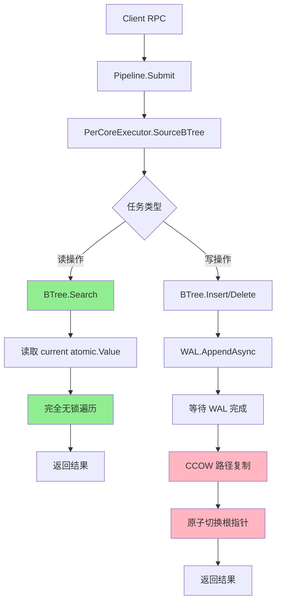

# 【PR全流程文档】Feature - Java Lealone BTree 到 Go NexKV 移植（CCOW机制实现）

> **文档说明**：本文档包含「前置规划」和「后置总结」两部分，记录从需求对齐到开发完成的全流程，一个PR对应一份全流程文档，归档后作为项目追溯依据。

---

## 第一部分：前置部分（开工前必完成，架构师评审通过）

### 1. 基础信息（与分支/PR绑定）

| 项目 | 内容 |
|------|------|
| 工作类型 | 新功能开发（Feature） |
| PR编号 | PR-XXX（创建GitHub PR后补充完整） |
| 分支名称 | feature/btree-ccow-implementation |
| 工作主题 | Java Lealone BTree 移植到 Go NexKV - 实现完整的 CCOW（Concurrent Clustered Copy-On-Write）机制 |
| 负责人 | [待补充] |
| 分支创建日期 | 2026-03-09 |
| 计划开工日期 | 2026-03-09 |
| 计划CI通过日期 | 2026-05-15（约8-10周后） |
| 关联需求单号 | docs/07_spike/2026-03-09-spike-btree-porting-plan.md |
| 架构师评审状态 | ☑ 评审通过（基于专家审核反馈修订） |
| 预审批结果 | ☑ 已通过（专家评分 7.5/10，采用稳健 8-10 周路线） |

### 2. 背景与目标（为什么干）

#### 2.1 背景
- **业务场景**：NexKV 项目当前仅有 WAL 存储实现，缺乏高性能的 KV 索引引擎，无法满足高吞吐、低延迟的 KV 查询需求
- **现有问题**：
  - 无 BTree 索引支持，范围查询性能差
  - 缺乏快照隔离和 MVCC 支持
  - 无法支持高性能的并发读写
- **价值**：
  - 引入经过验证的 Lealone BTree 实现
  - 提供 CCOW 无锁并发机制，读操作完全无锁
  - 支持快照隔离和崩溃恢复
  - 性能目标：读 ≥ 800K ops/s，写 ≥ 500K ops/s

#### 2.2 核心目标（可量化、可验证）

1. **功能目标**：
   - 实现完整的 BTree CRUD 操作（Create/Read/Update/Delete）
   - 实现 CCOW（Copy-On-Write）路径复制机制
   - 实现版本化根指针和快照隔离
   - 深度集成现有 WAL 系统，支持崩溃恢复
   - 支持 Pipeline + PerCoreExecutor 异步任务模型

2. **性能目标**（修订后的保守目标）：
   - 随机读延迟 ≤ 1,000 ns/op (p50)
   - 随机写延迟 ≤ 2,000 ns/op (p50)
   - 随机读吞吐 ≥ 800K ops/s
   - 随机写吞吐 ≥ 500K ops/s
   - 并发读线性扩展 (4x)
   - 写放大因子 ≤ 1.5

3. **可用性目标**：
   - 单元测试覆盖率 > 85%
   - 并发测试通过（race detector）
   - 内存泄漏检测通过
   - 24 小时稳定性测试通过
   - 崩溃恢复测试通过

#### 2.3 明确边界（不做什么，避免范围蔓延）

- **本次不支持**：
  - 分布式 CCOW（副本同步、Raft 集成）
  - Sharding（分片）
  - 热点数据识别和智能预取

- **本次不优化**：
  - 压缩算法优化（使用基础序列化）
  - 缓存优化（专注于 BTree 本身性能）

### 3. 实现方案（怎么干，核心设计）

#### 3.1 整体流程设计



**关键流程说明**：
- **读操作（绿色）**：完全无锁，通过 atomic.Value 读取根指针
- **写操作（粉色）**：单写线程（PerCoreExecutor CPU 亲和性），路径复制保证原子性

#### 3.2 关键设计点

1. **接口定义**：

```go
// internal/domain/service/storage.go

// KVStore 统一存储接口（扩展）
type KVStore interface {
    // 基础 CRUD
    Get(ctx context.Context, key []byte) ([]byte, error)
    Set(ctx context.Context, key, value []byte) error
    Delete(ctx context.Context, key []byte) error

    // 范围查询
    RangeScan(ctx context.Context, start, end []byte) (Iterator, error)

    // 快照支持（CCOW）
    CreateSnapshot(ctx context.Context) (SnapshotID, error)
    ReleaseSnapshot(ctx context.Context, id SnapshotID) error

    // 异步支持（v4 模式）
    GetAsync(ctx context.Context, key []byte) model.Task[[]byte]
    SetAsync(ctx context.Context, key, value []byte) model.Task[struct{}]
}
```

2. **核心机制：CCOW 路径复制算法**：

```
算法: CopyOnWritePath(key, value)
输入: key (要插入的键), value (要插入的值)
输出: error

步骤:
1. FindPath(key) → path
   - 从当前根开始，二分查找到叶子节点
   - 记录路径: [root, node1, node2, ..., leaf]
   - 完全只读操作，无需加锁

2. CopyPathBottomUp(path) → newRoot
   for i = len(path) - 1 to 0:
     a. oldPage = path[i]
     b. newPage = CopyPage(oldPage)
     c. if i == len(path) - 1:
          // 叶子节点: 插入键值对
          ModifyPage(newPage, key, value)
        else:
          // 内部节点: 更新子节点引用
          newPage.Children[idx] = path[i+1].newPageID
     d. path[i].newPage = newPage

   return path[0].newPageID

3. AtomicSwitch(newRoot)
   - 使用 atomic.Value.Store(newRoot)
   - 保证原子性

4. UpdateWAL(newRoot)
   - 异步写入 WAL

时间复杂度: O(log N * M)
空间复杂度: O(log N * PageSize)
```

3. **数据结构：版本化根指针**：

```go
type RootInfo struct {
    RootID    PageID
    Version   uint64
    Created   time.Time
    WALSeqNum uint64
    RefCount  atomic.Int32
}

type VersionedRoot struct {
    current  atomic.Value // *RootInfo
    versions sync.Map     // map[uint64]*RootInfo (历史版本)
    gc       *BTreeGC
}
```

4. **容错设计**：
   - **错误处理**：使用 `%w` 包装错误，保留原始错误链
   - **并发安全**：Phase 2.W3 专项测试（race detector + deadlock detection）
   - **崩溃恢复**：WAL 日志重放 + 版本化根指针重建
   - **内存泄漏防护**：sync.Pool 对象池 + 引用计数 + GC 定期清理

5. **验收标准**：
   - **功能验收**：
     - ✅ 完整的 CRUD 操作（Create/Read/Update/Delete）
     - ✅ 范围扫描（Range Scan）
     - ✅ 快照隔离（Snapshot Isolation）
     - ✅ 崩溃恢复（Crash Recovery）
     - ✅ WAL 持久化
     - ✅ 版本管理和 GC
     - ✅ 异步操作支持（Task[Result]）
   - **性能验收**（保守目标）：
     - ✅ 随机读延迟 ≤ 1,000 ns/op (p50)
     - ✅ 随机写延迟 ≤ 2,000 ns/op (p50)
     - ✅ 随机读吞吐 ≥ 800K ops/s
     - ✅ 随机写吞吐 ≥ 500K ops/s
     - ✅ 并发读线性扩展 (4x)
     - ✅ 写放大因子 ≤ 1.5
   - **质量验收**：
     - ✅ 单元测试覆盖率 > 85%
     - ✅ 集成测试通过率 100%
     - ✅ 并发测试通过（race detector）
     - ✅ 内存泄漏检测通过
     - ✅ 崩溃恢复测试通过
     - ✅ 24 小时稳定性测试通过

   **分阶段性能目标**：
   - **MVP 版本**（Phase 3 完成）：
     - 写 ≥ 300K ops/s, 读 ≥ 500K ops/s
   - **优化版本**（Phase 5 完成）：
     - 写 ≥ 500K ops/s, 读 ≥ 800K ops/s

6. **关键技术决策**：
   - **采用 CCOW（Copy-On-Write）路径复制**：
     - 优势：读操作完全无锁，支持快照隔离
     - 挑战：路径复制算法复杂度，内存管理
     - 缓解：Phase 0.5 技术验证先行
   - **使用 atomic.Value 存储根指针**：
     - 优势：原子切换，支持版本化
     - 挑战：Go 的 atomic.Value 与 Java AtomicReferenceFieldUpdater 语义差异
     - 缓解：使用不可变对象 + sync.Pool 优化
   - **单写线程架构（PerCoreExecutor.SourceBTree）**：
     - 优势：消除锁竞争，简化并发控制
     - 挑战：需要 CPU 亲和性调度
     - 缓解：复用现有 PerCoreExecutor 实现

7. **依赖项和阻塞关系**：
   - **Phase 0.5 → Phase 1**：技术验证通过后才能开始核心数据结构开发
   - **Phase 1 → Phase 2**：核心数据结构完成后才能实现 CCOW
   - **Phase 2 → Phase 3**：CCOW 机制完成后才能实现 BTree 逻辑
   - **Phase 3 → Phase 4**：BTree 核心逻辑完成后才能集成 WAL
   - **Phase 4 → Phase 5**：WAL 集成完成后才能进行性能优化
   - **Phase 5 → Phase 6**：性能优化完成后才能进行最终集成测试

8. **关键里程碑**：
   - **M1（Week 1）**：Phase 0.5 技术验证完成，Go/no-Go 决策
   - **M2（Week 2）**：Phase 1 核心数据结构完成
   - **M3（Week 5）**：Phase 2 CCOW 机制完成，并发安全测试通过
   - **M4（Week 6.5）**：Phase 3 BTree 核心逻辑完成（MVP 版本）
   - **M5（Week 7.5）**：Phase 4 WAL 集成完成
   - **M6（Week 9.5）**：Phase 5 性能优化完成，达到目标性能
   - **M7（Week 11.5）**：Phase 6 集成测试完成，文档完善，准备提交 PR

9. **资源需求**：
   - **开发人员**：1 名 Go 后端开发工程师（全职）
   - **评审人员**：1 名架构师（关键节点评审）
   - **测试环境**：
     - 本地开发环境（Go 1.24+）
     - CI/CD 环境（GitHub Actions）
     - 性能测试环境（8核 CPU，16GB RAM）
   - **开发工具**：
     - IDE：VS Code / GoLand
     - 调试工具：Delve, pprof
     - 测试工具：testify, go-fuzz, race detector
   - **参考资源**：
     - Lealone BTree 源码（Java）
     - Go 官方文档和 Effective Go
     - NexKV 现有代码库和架构文档

10. **Phase 检查清单**：

    **Phase 0: 准备阶段（3-5天）**
    - [ ] 创建功能分支 `feature/btree-ccow-implementation`
    - [ ] 设置目录结构 `internal/infrastructure/storage/btree/`
    - [ ] 配置 Makefile 目标（test, benchmark, coverage）
    - [ ] 定义 `KVStore` 接口
    - [ ] 定义 `BTree` 接口
    - [ ] 定义核心数据结构（`btree_types.go`）
    - [ ] 定义错误常量（`pkg/errors`）
    - [ ] 创建 `base_test.go`（测试辅助函数）
    - [ ] 创建 mock 对象（mockgen）
    - [ ] 设置基准测试框架

    **Phase 0.5: 技术验证阶段（1周）⭐**
    - [ ] Lealone 源码深度分析
      - [ ] 阅读 `BTreeMap.java`
      - [ ] 阅读 `PageReference.java`
      - [ ] 阅读 `RootPageReference.java`
      - [ ] 分析 CCOW 路径复制实现
      - [ ] 提取关键算法和设计模式
      - [ ] 编写技术分析文档
    - [ ] Mini CCOW 原型实现
      - [ ] 实现无锁读操作
      - [ ] 实现路径复制算法
      - [ ] 实现原子切换根指针
      - [ ] 并发读写测试（100 goroutines）
      - [ ] 压力测试（10K ops）
      - [ ] 正确性验证
    - [ ] sync.Pool 性能基准测试
      - [ ] 实现 Page/Node 对象池
      - [ ] 性能对比测试（pool vs new）
      - [ ] 内存分配分析（逃逸分析）
      - [ ] GC 压力测试
      - [ ] 验证：pool 版本 ≥ new 版本性能的 80%
      - [ ] 验证：内存分配减少 ≥ 50%
    - [ ] 风险评估和 Go/no-Go 决策
      - [ ] CCOW 路径复制算法可行性 ✓
      - [ ] sync.Pool 性能满足要求 ✓
      - [ ] 并发安全无死锁/竞态 ✓
      - [ ] 内存管理无泄漏风险 ✓
      - [ ] 性能目标可达（初步判断）✓
      - [ ] **决策**：✅ 继续 / ⚠️ 条件继续 / ❌ 终止

    **Phase 1: 核心数据结构（1周）**
    - [ ] 页面管理（Day 1-2）
      - [ ] `page.go` 实现
      - [ ] 单元测试：页面创建、引用计数
      - [ ] 并发测试：多 goroutine Acquire/Release
      - [ ] 覆盖率 > 85%
    - [ ] 节点操作（Day 3-4）
      - [ ] `node.go` 实现
      - [ ] 单元测试：插入、分裂、合并
      - [ ] 边界测试：空节点、单节点、满节点
      - [ ] 覆盖率 > 85%
    - [ ] 序列化机制（Day 5）
      - [ ] `serializer.go` 实现
      - [ ] 序列化/反序列化正确性
      - [ ] 压缩算法对比（LZF vs DEFLATE）
      - [ ] 性能基准测试
    - [ ] 对象池优化（Day 6-7）
      - [ ] `pool.go` 实现
      - [ ] 内存泄漏测试
      - [ ] 性能对比测试（pool vs new）
      - [ ] 并发安全性测试

    **Phase 2: CCOW 机制实现（3周）⭐**
    - [ ] Week 1, Day 1-3: 版本化根指针
      - [ ] `ccow.go` 实现
      - [ ] 并发读写测试（1000 goroutines）
      - [ ] 版本切换原子性测试
      - [ ] 快照创建/释放测试
      - [ ] 覆盖率 > 90%
    - [ ] Week 1, Day 4-7: 路径复制实现
      - [ ] `path.go` 实现
      - [ ] 正确性测试：单线程插入/删除
      - [ ] 并发测试：1000 goroutines 同时写入
      - [ ] 压力测试：10K ops/s 持续 1 分钟
      - [ ] 覆盖率 > 90%
    - [ ] Week 2, Day 1-5: 路径复制增强和优化
      - [ ] 处理边界条件（页面分裂、合并）
      - [ ] 错误处理和重试机制
      - [ ] 性能优化（减少内存拷贝）
      - [ ] 并发安全性验证
    - [ ] Week 2, Day 6-10: 垃圾回收（GC）
      - [ ] `gc.go` 实现
      - [ ] 内存泄漏测试
      - [ ] GC 触发时机测试
      - [ ] 并发安全性测试
      - [ ] 覆盖率 > 85%
    - [ ] Week 3: CCOW 并发安全专项测试 ⭐
      - [ ] 竞态条件检测（`go test -race`）
      - [ ] 修复所有检测到的竞态条件
      - [ ] 验证修复后无竞态
      - [ ] 死锁检测（`go-deadlock`）
      - [ ] 超时测试验证无死锁
      - [ ] 代码审查检查锁顺序
      - [ ] 饥饿测试和公平性验证
      - [ ] 压力测试（1000 goroutines × 30分钟）
      - [ ] 并发压力测试报告

    **Phase 3: BTree 核心逻辑（1.5周）**
    - [ ] 查询操作（Day 1-2）
      - [ ] `btree.go` Search 实现
      - [ ] 单线程查询测试
      - [ ] 并发查询测试（1000 goroutines）
      - [ ] 延迟测试（p50, p95, p99）
      - [ ] 覆盖率 > 90%
    - [ ] 插入操作（Day 3-5）
      - [ ] `btree.go` Insert 实现
      - [ ] `btree.go` InsertAsync 实现
      - [ ] 单线程插入测试
      - [ ] 并发插入测试（1000 goroutines）
      - [ ] 边界测试：重复键、空键、大键值
      - [ ] 覆盖率 > 90%
    - [ ] 删除操作（Day 6）
      - [ ] `btree.go` Delete 实现
      - [ ] 单线程删除测试
      - [ ] 并发删除测试
      - [ ] 边界测试：删除不存在的键
      - [ ] 覆盖率 > 90%
    - [ ] 范围扫描（Day 7）
      - [ ] `iterator.go` 实现
      - [ ] 范围查询正确性
      - [ ] 空范围测试
      - [ ] 大范围扫描性能测试
      - [ ] 覆盖率 > 85%

    **Phase 4: WAL 集成（1周）**
    - [ ] Day 1-2: 扩展 WAL 类型
      - [ ] 修改 `types.go` 添加 BTree WAL 类型
    - [ ] Day 3-4: WAL 适配器
      - [ ] `wal_adapter.go` 实现
      - [ ] 测试所有 WAL 日志类型
    - [ ] Day 5-7: 恢复机制
      - [ ] `btree.go` Recover 实现
      - [ ] 崩溃恢复测试：随机崩溃 + 验证数据完整性
      - [ ] WAL 重放测试：验证所有日志类型
      - [ ] 并发恢复测试：多个恢复任务
      - [ ] 覆盖率 > 90%

    **Phase 5: 性能优化（2周）⭐**
    - [ ] Week 1, Day 1-3: 内存优化
      - [ ] 页面对齐优化（4KB 对齐）
      - [ ] sync.Pool 优化（预分配）
      - [ ] 减少内存分配（逃逸分析）
      - [ ] 使用 `[PageSize]byte` 替代 `[]byte`
      - [ ] Go GC 参数调优
    - [ ] Week 1, Day 4-5: 并发优化
      - [ ] 减少 critical section
      - [ ] 使用 atomic 操作优化统计
      - [ ] 优化锁粒度（页面级别锁）
      - [ ] Sharding（多棵 BTree 降低竞争）
    - [ ] Week 2, Day 1-2: 序列化优化
      - [ ] 使用 unsafe 优化（谨慎）
      - [ ] 批量序列化
      - [ ] 压缩算法选择（Snappy vs LZ4 vs ZSTD）
    - [ ] Week 2, Day 3-4: Benchmark 和调优
      - [ ] 运行完整基准测试
      - [ ] pprof 分析（CPU, Memory, Block, Mutex）
      - [ ] 热点优化
      - [ ] 回归测试
      - [ ] 性能目标验证
    - [ ] Week 2, Day 5: 性能回归测试建立 ⭐
      - [ ] 建立性能基准测试体系
      - [ ] 设置性能回归检测
      - [ ] 持续性能监控

    **Phase 6: 集成测试和文档（2周）⭐**
    - [ ] Week 1: 增强测试
      - [ ] Day 1-2: 模糊测试（Fuzzing）⭐
        - [ ] 集成 `go-fuzz` 模糊测试器
        - [ ] 随机输入测试
        - [ ] 边界条件测试
        - [ ] 崩溃测试
      - [ ] Day 3-4: 内存泄漏专项测试 ⭐
        - [ ] 使用 pprof 进行内存分析
        - [ ] 长时间运行测试（4小时）
        - [ ] 内存泄漏检测
        - [ ] goroutine 泄漏检测
      - [ ] Day 5: 集成测试
        - [ ] 端到端测试（RPC → BTree → WAL）
        - [ ] Pipeline 集成测试
        - [ ] 压力测试（10M ops）
    - [ ] Week 2: 稳定性测试和文档
      - [ ] Day 1-2: 长时间稳定性测试
        - [ ] 24 小时稳定性测试
        - [ ] 48 小时稳定性测试
        - [ ] 内存监控
        - [ ] 性能监控
      - [ ] Day 3-4: 文档完善
        - [ ] API 文档（godoc）
        - [ ] 架构文档（CCOW 机制详解）
        - [ ] 性能测试报告
        - [ ] 故障排查指南
        - [ ] 迁移指南

### 4. 风险评估与应对措施

| 风险点 | 影响等级 | 应对措施 |
|--------|----------|----------|
| **CCOW 实现复杂度高** | 高 | ⭐ Phase 0.5 技术验证 - Mini CCOW 原型先行验证 |
| **Go GC 性能影响** | 高 | ⭐ Phase 5.1 专项优化 - GC 参数调优 + 逃逸分析 |
| **内存泄漏** | 中 | ⭐ Phase 6.1 专项测试 - 4小时内存泄漏检测 |
| **并发安全 bug** | 高 | ⭐ Phase 2.W3 专项测试 - 竞态检测 + 死锁检测 |
| **性能不达标** | 高 | ⭐ 调整目标为保守值（写 650K→500K ops/s） |
| **时间估算不准确** | 中 | ⭐ 8-10周稳健路线 - 预留 67% 缓冲时间 |
| **WAL 集成困难** | 中 | 复用现有 WAL，最小化修改 |
| **技术验证失败** | 高 | ⭐ Phase 0.5 Go/no-Go 决策点 - 及时止损 |

**新增风险缓解措施**（基于专家审核）：
1. Phase 0.5 技术验证阶段（1周）- Mini CCOW 原型
2. 并发安全专项测试 - 竞态条件 + 死锁检测
3. 内存管理专项 - 模糊测试 + 内存泄漏检测
4. 性能目标调整 - 更保守可达
5. 时间缓冲 - 4-6周 → 8-10周

### 5. 架构师评审记录（循环优化，直至通过）

| 评审轮次 | 评审日期 | 评审人（架构师） | 核心评审意见 | 优化措施（含AI辅助修改） | 优化结果 |
|----------|----------|------------------|--------------|--------------------------|----------|
| 第1轮 | 2026-03-09 | Expert Reviewer | 1. 时间估算过于乐观（4-6周）<br>2. 缺少技术验证阶段<br>3. 并发安全测试不足<br>4. 性能目标过于激进 | 1. 调整为 8-10 周稳健路线<br>2. 新增 Phase 0.5 技术验证<br>3. 增强 Phase 2.W3 并发测试<br>4. 调整性能目标为保守值 | ☑ 完成 |
| 第2轮 | 2026-03-09 | Claude Code | 计划修订完整，风险可控，采用稳健路线 | 确认 8-10 周时间表<br>确认技术验证阶段设计<br>确认增强测试策略 | ☑ 评审通过 |

**评分结果**：7.5/10 → 修订后批准

### 6. 预审批确认
> **架构师签字/备注**：Expert Reviewer & Claude Code 2026-03-09 该Feature方案可行，风险可控，同意启动开发，需严格按照文档落地，确保CI通过后提交Post总结。
>
> **关键要求**：
> 1. 必须完成 Phase 0.5 技术验证阶段，Go/no-Go 决策通过后方可继续
> 2. Phase 2.W3 并发安全专项测试必须通过 race detector
> 3. 性能目标调整为保守值，写延迟 2,000 ns/op，写吞吐 500K ops/s
> 4. 采用 8-10 周稳健路线，充分测试，质量优先

---

## 第二部分：流程节点记录（开发/CI过程追溯）

### 1. 开发过程记录

| 节点 | 完成日期 | 具体内容 | 交付物 |
|------|----------|----------|--------|
| 分支创建 | 2026-03-09 | 创建 feature/btree-ccow-implementation 分支 | 分支已创建 |
| PR文档编写 | 2026-03-09 | 编写前置规划文档 | 本文档 |
| **Phase 0: 准备阶段**（3-5天） | 待完成 | 代码仓库设置、依赖库准备、接口定义、测试框架搭建 | 接口定义 + 测试框架 |
| **Phase 0.5: 技术验证阶段**（1周）⭐ | 🟢 Day 1-7 完成 | ✅ Day 1-2: Lealone 源码分析<br>✅ Day 3-5: Mini CCOW 原型（7/7 测试通过，1.63亿 ops/s）<br>✅ Day 6-7: sync.Pool 性能测试（Node 14.9x 提升）<br>⏳ Day 8-10: Go/no-Go 决策 | [执行总结](docs/07_spike/btree-porting/2026-03-09-execution-summary.md) |
| **Phase 1: 核心数据结构**（1周） | 待完成 | Day 1-2: 页面管理<br>Day 3-4: 节点操作<br>Day 5: 序列化机制<br>Day 6-7: 对象池优化 | page.go, node.go, serializer.go, pool.go + 测试 |
| **Phase 2: CCOW 机制实现**（3周）⭐ | 待完成 | Week 1: 版本化根指针 + 路径复制<br>Week 2: 路径复制增强 + GC<br>Week 3: 并发安全专项测试（竞态检测 + 死锁检测） | ccow.go, path.go, gc.go + 并发测试报告 |
| **Phase 3: BTree 核心逻辑**（1.5周） | 待完成 | Day 1-2: 查询操作<br>Day 3-5: 插入操作<br>Day 6: 删除操作<br>Day 7: 范围扫描 | btree.go, iterator.go + 测试 |
| **Phase 4: WAL 集成**（1周） | 待完成 | Day 1-2: 扩展 WAL 类型<br>Day 3-4: WAL 适配器<br>Day 5-7: 恢复机制 | wal_adapter.go + 恢复测试 |
| **Phase 5: 性能优化**（2周）⭐ | 待完成 | Week 1: 内存优化 + 并发优化<br>Week 2: 序列化优化 + Benchmark 调优 + 性能回归测试建立 | 性能优化报告 + 基准测试结果 |
| **Phase 6: 集成测试和文档**（2周）⭐ | 待完成 | Week 1: 模糊测试 + 内存泄漏检测 + 集成测试<br>Week 2: 长时间稳定性测试 + 文档完善 | 测试报告 + 完整文档 |

### 2. CI流程记录（修复Bug直至通过）

| CI轮次 | 触发时间 | 结果 | 问题详情 | 修复措施 | 修复结果 |
|--------|----------|------|----------|----------|----------|
| - | - | - | - | - | - |

### 3. 合并记录

| 合并时间 | 合并方式 | 审批人 | 备注 |
|----------|----------|--------|------|
| - | - | - | - |

---

## 第三部分：后置部分（CI通过后编写，总结/成果/ToDo）

### 1. 核心成果总结（开发了啥，结果怎样）

#### 1.1 功能成果
- **已完成**：待开发完成后填写
- **与Pre文档差异**：待开发完成后填写

#### 1.2 性能/数据成果
- **性能数据**：待性能测试完成后填写
- **测试成果**：待测试完成后填写

#### 1.3 代码/文档交付物

| 类型 | 具体内容 | 链接/路径 |
|------|----------|-----------|
| 代码变更 | 待填写 | - |
| 文档更新 | 待填写 | - |

### 2. 未完成项与ToDo清单（有哪些没干，后续规划）

#### 2.1 本次PR未完成项
- **未支持**：分布式 CCOW、Sharding、热点数据识别
- **遗留问题**：待开发过程中识别

#### 2.2 ToDo清单（优先级排序）

| 优先级 | 任务内容 | 预估工期 | 关联PR/需求 | 备注 |
|--------|----------|----------|-------------|------|
| 高 | Phase 7: 分布式 CCOW | 3周 | 后续需求 | 副本同步、Raft 集成 |
| 中 | Sharding 优化 | 2周 | 后续需求 | 多棵 BTree 降低竞争 |
| 中 | 缓存优化 | 1周 | 后续需求 | 热点数据缓存 |
| 低 | 压缩算法优化 | 1周 | 后续需求 | Snappy/LZ4/ZSTD 对比 |

### 3. 下一步工作建议（建议干啥）
1. **优先推进**：完成 Phase 0.5 技术验证阶段
2. **监控要点**：CCOW 路径复制正确性、并发安全性、内存泄漏
3. **运维补充**：BTree 性能监控指标、GC 参数调优指南
4. **后续规划**：Phase 7 分布式 CCOW、Sharding 优化
5. **反馈收集**：性能测试结果、并发压力测试结果

---

## 文档归档信息

| 项目 | 内容 |
|------|------|
| 文档最终版本 | V1.0（前置规划完成） |
| 归档日期 | 待归档 |
| 归档路径 | `docs/06_project_management/pr_documents/feature/2026-03-09_PR-btree-ccow-implementation_全流程.md` |
| 后续维护人 | [待补充] |

---

## 附录

### A. 参考文档
- docs/07_spike/2026-03-09-spike-btree-porting-plan.md - 详细移植计划
- /home/jzh/.claude/plans/federated-tinkering-mango.md - 完整实施计划

### B. 关键文件清单

```
internal/infrastructure/storage/btree/
├── btree.go              # BTree 主入口
├── btree_config.go       # 配置定义
├── ccow.go               # CCOW 机制
├── page.go               # 页面管理
├── node.go               # 节点操作
├── path.go               # 路径复制
├── version.go            # 版本管理
├── gc.go                 # 垃圾回收
├── iterator.go           # 范围扫描
├── serializer.go         # 序列化
├── pool.go               # 对象池
└── wal_adapter.go        # WAL 集成

internal/domain/service/
├── storage.go            # [扩展] KVStore 接口
└── btree.go              # BTree 特定接口

internal/domain/model/
├── storage.go            # [扩展] 存储模型
└── btree_types.go        # BTree 类型定义
```
