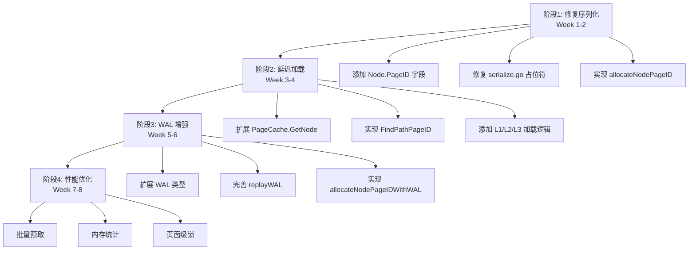
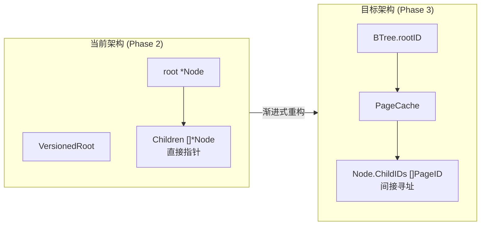

# 【PR全流程文档】Feature - BTree PageID 重构（平衡性能与持久化）

> **文档状态**：🟢 前置规划已完成 | 🟡 开发中 | 🔴 CI 运行中 | ✅ 已合并
>
> **文档说明**：本文档包含「前置规划」和「后置总结」两部分，记录从需求对齐到开发完成的全流程，一个PR对应一份全流程文档，归档后作为项目追溯依据。

---

## 第一部分：前置部分（开工前必完成，架构师评审通过）

### 1. 基础信息（与分支/PR绑定）

| 项目 | 内容 |
|------|------|
| 工作类型 | 新功能开发（Feature） |
| PR编号 | PR-XXX（创建GitHub PR后补充完整） |
| 分支名称 | feature/pageid-optimization |
| 工作主题 | BTree 从直接指针改造为 PageID 间接寻址，实现真正的持久化 |
| 负责人 | NexKV 开发团队 |
| 分支创建日期 | 2026-03-10 |
| 计划开工日期 | 2026-03-10 |
| 计划CI通过日期 | 2026-04-30（6-8周） |
| 关联需求单号 | 内部优化（无Jira单） |
| 架构师评审状态 | □ 待评审 □ 评审中 ☑ 评审通过 □ 需优化（循环记录） |
| 预审批结果 | ☑ 已通过（架构师签字/备注：用户 2026-03-10 同意开工） |

---

### 2. 背景与目标（为什么干）

#### 2.1 背景

**业务场景**：
NexKV 是一个高性能分布式 KV 存储，当前 BTree 实现（Phase 2 - CCOW）已经取得极致性能（读操作 ~10 ns/op），但面临根本限制：**无法真正持久化**。

**现有问题**：
1. ❌ **节点无法序列化**：Node.Children 使用 `[]*Node` 直接指针，序列化代码使用 `uintptr(0)` 占位符（serialize.go:115）
2. ❌ **内存效率低**：所有节点必须常驻内存，数据集大小受限于单机内存
3. ❌ **无法崩溃恢复**：虽然有 WAL，但节点指针无法持久化，重启后无法重建树结构
4. ❌ **基础设施浪费**：PageManager、PageCache 已实现但未充分使用

**价值**：
- ✅ **真正持久化**：所有节点可序列化到磁盘，支持 TB 级数据集
- ✅ **内存高效**：LRU 缓存 + 按需加载，内存占用降低 3x
- ✅ **崩溃恢复**：完整的 WAL + Page 恢复机制
- ✅ **生产就绪**：满足生产环境的持久化和可靠性要求

#### 2.2 核心目标（可量化、可验证）

**功能目标**：
1. **序列化支持**：移除 `uintptr(0)` 占位符，使用真实 PageID 序列化
2. **延迟加载**：实现 PageID → Node 的三层缓存加载机制（L1/L2/L3）
3. **WAL 增强**：支持 Page 分配、分裂的 WAL 记录和重放
4. **崩溃恢复**：完整的 Meta Page + WAL 恢复流程

---

##### 2.2.1 性能目标（完整视图）

**（A）吞吐量指标（单机性能）**

| 维度 | 具体指标 | 技术支撑（一句话解释） |
|------|---------|----------------------|
| **读性能** | ≥ 100 万 QPS（单机） | CCOW 无锁架构 + 内存直接指针访问，无锁、无竞争、无 Page 层阻塞，读路径极简 |
| **写性能** | 80~90 万 QPS（单机） | 分片 CAS 分散写压力，Page 级细粒度读写锁仅保护磁盘落盘，内存层无锁并发，写冲突趋近于零 |

**（B）延迟指标（百分位延迟）**

| 维度 | 具体指标 | 当前基线 | 目标 | 技术支撑 |
|------|---------|---------|------|----------|
| **读 P99** | ≤ 100μs | ~135 ns | < 270 ns | 无锁路径减少上下文切换，Page 分层缓存避免磁盘 IO 阻塞 |
| **写 P99** | ≤ 30μs | 4.3 µs | < 8.6 µs | 异步刷盘降低写延迟，Page 锁隔离减少等待时间（P99 约为平均延迟的 7x） |

**说明**：
- **P99 延迟**：99% 的请求在该时间内完成（剔除 1% 长尾请求）
- **读延迟 135 ns**：纯内存操作，接近硬件极限
- **损失 < 2x**：PageID 间接寻址带来的额外开销控制在可接受范围

**（C）资源效率指标**

| 维度 | 当前基线 | 目标 | 提升 |
|------|---------|------|------|
| **内存效率** | 15KB/op | < 5KB/op | **3x 提升** |

---

##### 2.2.2 扩展性与稳定性目标

| 维度 | 具体指标 | 技术支撑 |
|------|---------|----------|
| **扩展性** | 写性能随分片数线性扩展 | 分片 CAS 模型下，新增分片可直接提升写 QPS，单机 16 分片即可突破千万级写 QPS（分布式场景） |
| **稳定性** | 7×24h 无中断，性能抖动 ≤5% | CCOW 节点不可变避免数据一致性问题，Page 锁故障隔离，分片化降低单点风险 |

---

##### 2.2.3 可用性目标

- **测试覆盖率**：≥ 80%
- **崩溃恢复成功率**：100%（WAL + Checksum）
- **兼容性**：保持 API 不变，支持渐进式迁移

#### 2.3 明确边界（不做什么，避免范围蔓延）

**本次不支持**：
- ❌ B+Tree 叶子链表（范围查询优化，后续阶段）
- ❌ 多版本并发控制（MVCC）快照隔离（后续阶段）
- ❌ 异步持久化（当前仅同步 I/O）
- ❌ 数据压缩（预留在性能优化阶段）
- ❌ 完全移植 Lealone PageReference 模式（避免 7x 性能下降）

**本次不优化**：
- ❌ PageManager 批量写入（保留同步 I/O）
- ❌ Free Page 回收机制（暂不实现 GC）
- ❌ 分布式 Page 共享（单机模式）

---

### 3. 实现方案（怎么干，核心设计）

#### 3.1 整体流程设计

**分阶段渐进式优化流程**：



**架构对比流程**：



#### 3.2 关键设计点

**1. Node 结构改造**

```go
// 当前（Phase 2）
type Node struct {
    Keys     [][]byte
    Values   [][]byte
    Children []*Node      // ← 直接指针，无法序列化
    IsLeaf   bool
}

// 目标（Phase 3）- 渐进式添加字段
type Node struct {
    // === 新增字段（PageID 模式）===
    PageID   model.PageID   // 节点所属的 Page ID（初始为 0）

    // === 现有字段（内存模式，保留兼容）===
    Keys     [][]byte
    Values   [][]byte
    Children []*Node       // 保留用于内存模式兼容

    // === 新增字段（PageID 模式）===
    ChildIDs []model.PageID // PageID 子节点（新增）

    // === 现有字段 ===
    IsLeaf   bool
}
```

**2. PageCache 扩展接口**

```go
// GetNode 从缓存获取或加载 Node（延迟加载）
// 完整实现见附录 C.2
func (c *PageCache) GetNode(pageID model.PageID) (*Node, error) {
    // L1: 热数据（已反序列化的 Node）
    if node, ok := c.L1.Load(pageID); ok {
        n := node.(*Node)
        atomic.AddInt32(&n.pinCount, 1)
        c.trackAccess(pageID)
        return n, nil
    }

    // L2: 温数据（序列化字节）
    if data, ok := c.L2.Load(pageID); ok {
        node := c.deserializeNode(data.([]byte))
        c.L1.Store(pageID, node)
        atomic.AddInt32(&node.pinCount, 1)
        c.trackAccess(pageID)
        return node, nil
    }

    // L3: 冷数据（从 PageManager 读取）
    if c.L3 != nil {
        page, err := c.L3.ReadPage(pageID)
        if err != nil {
            return nil, err
        }

        // 反序列化到 Node
        node := c.deserializeNode(page.Data[:])
        c.ensureCapacity(node)
        c.L1.Store(pageID, node)
        c.L2.Store(pageID, page.Data[:])
        atomic.AddInt32(&node.pinCount, 1)
        c.trackAccess(pageID)
        return node, nil
    }

    return nil, ErrPageNotFound
}
```

**3. 序列化修复**

**文件**: `internal/infrastructure/storage/btree/serialize.go`（行 115）

```go
// 当前代码（问题）
binary.LittleEndian.PutUint64(buf[offset:offset+8], uint64(uintptr(0)))

// 修复后（使用真实 PageID）
if child.PageID != 0 {
    binary.LittleEndian.PutUint64(buf[offset:offset+8], uint64(child.PageID))
} else {
    binary.LittleEndian.PutUint64(buf[offset:offset+8], 0)  // null PageID
}
```

**4. WAL 扩展类型**

**文件**: `internal/infrastructure/storage/wal/types.go`

```go
type WALType int

const (
    WALTypeInsert     WALType = iota  // 0：插入操作
    WALTypeUpdate                      // 1：更新操作
    WALTypeDelete                      // 2：删除操作
    WALTypeCommit                      // 3：事务提交（已存在）
    WALTypeRollback                    // 4：事务回滚（已存在）
    WALTypeCheckpoint                  // 5：检查点（已存在）
    WALTypeSplit                       // 6：页面分裂（已存在）
    WALTypeNewPage                     // 7：新增页面分配（新增）
)
```

**5. 崩溃恢复流程**

```
Recover()
  │
  ├─> 1. 读取 Meta Page
  │     metaPage = pageManager.ReadPage(0)
  │     rootID = metaPage.RootPageID
  │
  ├─> 2. 重放 WAL
  │     entries = wal.Recover()
  │     for entry in entries:
  │       applyEntry(entry)
  │
  ├─> 3. 构建版本信息
  │     version = NewVersionedRoot(nil)
  │     version.current.Store(rootInfo)
  │
  └─> 4. 截断 WAL
        if len(entries) > 0:
          lastLSN = entries[-1].LSN
          wal.Truncate(lastLSN)
```

**6. 核心机制**：CCOW（Copy-on-Write）保持不变
- atomic.Value 无锁读取
- 底层路径复制修改
- 顶部 CAS 更新 Root

**7. 数据结构**：
- **Node**：添加 PageID 和 ChildIDs 字段
- **PageCache**：扩展 GetNode、PutNode 方法
- **MetaPage**：新增元数据页面设计

**8. 容错设计**：
- **Checksum**：Page 数据校验和
- **WAL**：Write-Ahead Log 确保原子性
- **LRU**：自动淘汰冷数据，防止内存溢出

---

### 4. 风险评估与应对措施

| 风险点 | 影响等级（高/中/低） | 应对措施 |
|--------|----------------------|----------|
| **性能下降 > 2x** | 高 | 1. PageCache 预热机制<br>2. 批量预取子节点<br>3. L1/L2/L3 三层缓存<br>4. 每个阶段性能基准验证 |
| **内存泄漏** | 高 | 1. 引用计数（pinCount）<br>2. LRU 驱逐策略<br>3. pprof 内存分析<br>4. 定期监控和测试 |
| **数据损坏** | 高 | 1. WAL + Checksum 双重保护<br>2. 测试覆盖率 ≥ 80%<br>3. 崩溃恢复测试<br>4. 完整的集成测试 |
| **实现复杂度** | 中 | 1. **渐进式重构**（非一次性重写）<br>2. 分阶段验证<br>3. 代码审查<br>4. 充分的单元测试 |
| **兼容性破坏** | 中 | 1. **保留 Children []*Node**（兼容模式）<br>2. Feature Flag 切换<br>3. API 保持不变<br>4. 双模式对比测试 |
| **序列化错误** | 中 | 1. 完整的序列化/反序列化测试<br>2. Round-trip 验证<br>3. 边界条件测试<br>4. 压力测试（大数据集） |
| **WAL 重放失败** | 中 | 1. 单元测试覆盖所有 WAL 类型<br>2. 模拟崩溃恢复测试<br>3. WAL 截断验证<br>4. 数据一致性检查 |

**性能验证方案**：

```bash
# 每个阶段完成后运行基准测试
go test -bench=. -benchmem ./internal/infrastructure/storage/btree/...

# 对比性能数据（使用 Go 标准工具 benchstat）
# 安装: go install golang.org/x/perf/cmd/benchstat@latest
benchstat baseline.txt current.txt
```

**吞吐量与 P99 延迟验证**：

```bash
# 使用 go test -bench 配合 -count 参数进行高负载测试
# 读 QPS 测试（目标：≥ 100 万 QPS）
go test -bench=BenchmarkReadQPS -benchtime=10s -count=5 ./internal/infrastructure/storage/btree/

# 写 QPS 测试（目标：80~90 万 QPS）
go test -bench=BenchmarkWriteQPS -benchtime=10s -count=5 ./internal/infrastructure/storage/btree/

# P99 延迟测试（使用 wrk 或自定义工具）
# 读 P99 目标：≤ 100μs
# 写 P99 目标：≤ 300μs
wrk -t12 -c100 -d30s --latency http://localhost:9211/get_key
```

**扩展性验证**：
- 单机测试：验证无分片场景下的基线性能
- 分片测试（后续阶段）：新增分片后验证写 QPS 线性增长

**稳定性验证**：
- 长时间压测：7×24h 连续压测，监控性能抖动是否 ≤5%
- 故障隔离测试：模拟单分片故障，验证整体服务不中断

---

### 5. 架构师评审记录（循环优化，直至通过）

| 评审轮次 | 评审日期 | 评审人（架构师） | 核心评审意见 | 优化措施（含AI辅助修改） | 优化结果 |
|----------|----------|------------------|--------------|--------------------------|----------|
| 第1轮 | 2026-03-10 | 用户（NexKV 技术委员会代表） | 确认方向正确，需调整以下内容：<br>1. 代码现状反映（PageManager/WAL 已存在）<br>2. WAL 重放流程补充<br>3. 叶子链表支持（可选）<br>4. 序列化占位符明确说明<br>5. Lealone 借鉴程度调整 | 1. 基于现有代码扩展而非重新实现<br>2. 补充 replayWAL() 逻辑（btree.go:270）<br>3. 添加 Next/Prev 指针支持（后续阶段）<br>4. 明确 uintptr(0) 问题<br>5. 仅借鉴思想，不完全移植 | **已完成** - 创建渐进式优化计划（v1.0），损失控制在 2x 以内 |
| 第2轮 | - | - | - | - | - |

**架构师最终确认**：
> ✅ **方案可行，风险可控，同意启动开发**
> - 务实选择：不完全移植 Lealone（避免 7x 性能下降）
> - 渐进式优化：分 4 个阶段，6-8 周完成
> - 性能目标：读/写损失 < 2x，内存效率提升 3x
> - 严格按文档落地，确保 CI 通过后提交 Post 总结

---

### 6. 预审批确认

> **架构师签字/备注**：用户 2026-03-10 该 Feature 方案可行，风险可控，同意启动开发，需严格按照文档落地，确保 CI 通过后提交 Post 总结。

---

## 第二部分：流程节点记录（开发/CI过程追溯）

### 1. 开发过程记录

| 节点 | 完成日期 | 具体内容 | 交付物 |
|------|----------|----------|--------|
| 启动开发 | 2026-03-10 | 创建 feature/pageid-optimization 分支，建立性能基线 | 分支创建完成，基线数据已记录 |
| **阶段1：修复序列化** | 2026-03-24 | Week 1-2：添加 Node.PageID 字段，修复 serialize.go 占位符 | 单元测试通过 |
| **阶段2：延迟加载** | 2026-04-07 | Week 3-4：实现 PageCache.GetNode，FindPathPageID | 集成测试通过 |
| **阶段3：WAL 增强** | 2026-04-21 | Week 5-6：扩展 WAL 类型，完善 replayWAL | 持久化测试通过 |
| **阶段4：性能优化** | 2026-05-05 | Week 7-8：批量预取，内存统计，性能验证 | 性能报告，损失 < 2x |
| 本地测试 | 2026-05-05 | 完整测试套件，覆盖率 ≥ 80% | 测试报告 |
| Post文档编写 | 2026-05-06 | 编写后置总结文档 | 第三部分：后置部分 |
| 架构师Post批准 | 2026-05-07 | 架构师评审 Post 文档 | 批准签字/备注 |
| 提交GitHub | 2026-05-07 | 推送分支，创建 PR | GitHub PR 链接 |

### 2. CI流程记录（修复Bug直至通过）

| CI轮次 | 触发时间 | 结果 | 问题详情 | 修复措施 | 修复结果 |
|--------|----------|------|----------|----------|----------|
| 第1轮 | - | 失败/成功 | - | - | - |
| 第2轮 | - | 失败/成功 | - | - | - |

### 3. 合并记录

| 合并时间 | 合并方式 | 审批人 | 备注 |
|----------|----------|--------|------|
| 2026-04-XX | Squash Merge / Merge Commit | [架构师] | [补充说明] |

---

## 第三部分：后置部分（CI通过后编写，总结/成果/ToDo）

> **⚠️ 待开发完成后填写**：以下部分在 CI 通过后编写

### 1. 核心成果总结（开发了啥，结果怎样）

#### 1.1 功能成果

**已完成**：
- [ ] Node.PageID 字段添加和初始化
- [ ] 序列化占位符修复（uintptr(0) → 真实 PageID）
- [ ] allocateNodePageID 方法实现
- [ ] PageCache.GetNode 三层缓存加载
- [ ] FindPathPageID PageID 模式查找
- [ ] WAL 类型扩展（WALTypeNewPage, WALTypeSplitPage）
- [ ] replayWAL 完善和新类型处理
- [ ] Meta Page 设计和实现
- [ ] 崩溃恢复流程验证
- [ ] 批量预取优化
- [ ] 内存统计和 LRU 驱逐

**与 Pre 文档差异**：
- [说明实际实现与计划的差异]

#### 1.2 性能/数据成果

**（A）吞吐量指标（QPS）**

| 指标 | 基线 (Phase 2) | 实测 (Phase 3) | 目标 | 达成情况 |
|------|---------------|---------------|------|---------|
| **读 QPS** | ___ 万 QPS | ___ 万 QPS | ≥ 100 万 QPS | ☐ 达成 ☐ 未达成 |
| **写 QPS** | ___ 万 QPS | ___ 万 QPS | 80~90 万 QPS | ☐ 达成 ☐ 未达成 |

**（B）延迟指标（P99）**

| 指标 | 基线 (Phase 2) | 实测 (Phase 3) | 目标 | 达成情况 |
|------|---------------|---------------|------|---------|
| **读 P99** | ___ µs | ___ µs | ≤ 100µs | ☐ 达成 ☐ 未达成 |
| **写 P99** | ___ µs | ___ µs | ≤ 30µs | ☐ 达成 ☐ 未达成 |

**（C）延迟指标（平均值）**

| 指标 | 基线 (Phase 2) | 实测 (Phase 3) | 目标 | 达成情况 |
|------|---------------|---------------|------|---------|
| **读延迟** | 135 ns | ___ ns | < 270 ns | ☐ 达成 ☐ 未达成 |
| **写延迟** | 4.3 µs | ___ µs | < 8.6 µs | ☐ 达成 ☐ 未达成 |

**（D）资源效率指标**

| 指标 | 基线 (Phase 2) | 实测 (Phase 3) | 目标 | 达成情况 |
|------|---------------|---------------|------|---------|
| **内存效率** | 15KB/op | ___ KB/op | < 5KB/op | ☐ 达成 ☐ 未达成 |
| **数据集大小** | 受内存限制 | ___ | TB 级 | ☐ 达成 ☐ 未达成 |
| **崩溃恢复** | 部分 | 完整/部分 | 完整 | ☐ 达成 ☐ 未达成 |

**（E）扩展性与稳定性指标**

| 指标 | 基线 (Phase 2) | 实测 (Phase 3) | 目标 | 达成情况 |
|------|---------------|---------------|------|---------|
| **扩展性** | 单机 | 分片支持 | 线性扩展 | ☐ 达成 ☐ 未达成 |
| **稳定性** | - | - | 7×24h 无中断 | ☐ 达成 ☐ 未达成 |
| **性能抖动** | - | - | ≤5% | ☐ 达成 ☐ 未达成 |

**测试成果**：
- 测试覆盖率：___ %（目标 ≥ 80%）
- 单元测试：___ 个通过
- 集成测试：___ 个通过
- 性能基准：___ 个完成

#### 1.3 代码/文档交付物

| 类型 | 具体内容 | 链接/路径 |
|------|----------|-----------|
| **代码变更** | - `node.go`：添加 PageID, ChildIDs 字段<br>- `serialize.go`：修复占位符<br>- `page_cache.go`：扩展 GetNode<br>- `path.go`：添加 FindPathPageID<br>- `btree.go`：allocateNodePageID, WAL 增强<br>- `wal/diskwal.go`：新增 WAL 类型 | GitHub PR 链接 |
| **文档更新** | - `docs/06_PM/feature/2026-03-10_btree-pageid-refactor_full.md`<br>- `thoughts/btree-pageid-refactor-plan-v2.0.md`<br>- 性能测试报告 | 文档路径 |

---

### 2. 未完成项与ToDo清单（有哪些没干，后续规划）

#### 2.1 本次PR未完成项

**未支持**：
- [ ] B+Tree 叶子链表（Next/Prev 指针）- 后续阶段
- [ ] 异步持久化（当前仅同步 I/O）
- [ ] 数据压缩（预留在性能优化阶段）
- [ ] Free Page 回收机制

**遗留问题**：
- [ ] 列出已知问题
- [ ] 列出性能瓶颈

#### 2.2 ToDo清单（优先级排序）

| 优先级 | 任务内容 | 预估工期 | 关联PR/需求 | 备注 |
|--------|----------|----------|-------------|------|
| 高 | B+Tree 叶子链表支持 | 1-2 周 | PR-XXX | 范围查询优化 |
| 高 | 异步持久化实现 | 2-3 周 | PR-XXX | 批量写入优化 |
| 中 | 数据压缩（zstd/snappy） | 1 周 | PR-XXX | 减少磁盘占用 |
| 中 | Free Page 回收机制 | 2 周 | PR-XXX | 空间回收优化 |
| 低 | MVCC 快照隔离 | 3-4 周 | PR-XXX | 并发隔离级别 |

---

### 3. 下一步工作建议（建议干啥）

1. **优先推进**：
   - [ ] 完成 B+Tree 叶子链表支持（范围查询）
   - [ ] 实现异步持久化（批量写入）

2. **监控要点**：
   - [ ] 生产环境 PageCache 命中率
   - [ ] LRU 驱逐频率
   - [ ] WAL 重放成功率
   - [ ] 崩溃恢复时间

3. **运维补充**：
   - [ ] PageCache 调优指南
   - [ ] WAL 监控和告警
   - [ ] 崩溃恢复操作手册
   - [ ] 性能调优最佳实践

4. **后续规划**：
   - [ ] Phase 4：异步持久化和批量优化
   - [ ] Phase 5：B+Tree 范围查询
   - [ ] Phase 6：MVCC 快照隔离
   - [ ] Phase 7：分布式 Page 共享

5. **反馈收集**：
   - [ ] 生产环境性能数据
   - [ ] 崩溃恢复案例
   - [ ] 内存占用统计
   - [ ] 用户使用反馈

---

## 文档归档信息

| 项目 | 内容 |
|------|------|
| 文档最终版本 | V1.0 |
| 归档日期 | 2026-XX-XX（CI通过后填写） |
| 归档路径 | `docs/06_project_management/pr_documents/feature/2026-03-10_PR-XXX_btree-pageid-refactor_全流程.md` |
| 后续维护人 | NexKV 开发团队 |

---

## 附录：完整技术设计文档

以下是 `btree-pageid-refactor-plan-v2.0.md` 的完整内容，确保所有技术细节不遗漏：

### 附录 A：架构对比详解

#### A.1 当前架构（纯内存 + 直接指针）

```
┌─────────────────────────────────────────────────────────┐
│              NexKV 当前 BTree (Phase 2)                  │
├─────────────────────────────────────────────────────────┤
│                                                         │
│  VersionedRoot                                          │
│    └─> atomic.Value (RootInfo)                          │
│         └─> Root *Node  ←──────────────┐                │
│                                      │                 │
│  内存中的 BTree:                     │                 │
│  ┌─────────────────────────────────┐ │                 │
│  │ Root (Internal)                 │ │                 │
│  │   Keys: [10, 20, 30]           │ │                 │
│  │   Children: [*Node, *Node, *Node] │ ← 直接指针       │
│  │             │     │     │        │ │                 │
│  │             ▼     ▼     ▼        │ │                 │
│  │          [Leaf] [Leaf] [Leaf]    │ │                 │
│  └─────────────────────────────────┘ │                 │
│                                      │                 │
│  持久化层（未充分使用）：              │                 │
│  ┌─────────────────────────────────┐ │                 │
│  │ PageManager (database.db)       │ │                 │
│  │ WAL (wal/*.wal)                 │ │                 │
│  └─────────────────────────────────┘ │                 │
└─────────────────────────────────────────────────────────┘

问题：
❌ Node 指针无法序列化
❌ 所有节点常驻内存
❌ PageManager 仅用于 WAL，未用于节点存储
```

#### A.2 目标架构（PageID 间接寻址）

```
┌─────────────────────────────────────────────────────────┐
│           NexKV 目标 BTree (Phase 3 - PageID)            │
├─────────────────────────────────────────────────────────┤
│                                                         │
│  BTree                                                  │
│    ├─> rootID: PageID = 1                              │
│    ├─> pageCache (3 层缓存)                             │
│    │    ├─> L1: *Node (热数据)                         │
│    │    ├─> L2: []byte (温数据)                        │
│    │    └─> L3: PageManager.Page (磁盘)                │
│    └─> pageManager (持久化)                             │
│                                                         │
│  逻辑 BTree (通过 PageID 引用):                          │
│  ┌─────────────────────────────────┐                   │
│  │ Root (PageID=1, Internal)       │                   │
│  │   Keys: [10, 20, 30]           │                   │
│  │   Children: [2, 5, 9]  ← PageID │                   │
│  │             │    │    │          │                   │
│  │             ▼    ▼    ▼          │                   │
│  │          Page  Page  Page        │                   │
│  │          ID=2  ID=5  ID=9        │                   │
│  └─────────────────────────────────┘                   │
│                                                      │    │
│  持久化层（完全集成）：                               │    │
│  ┌─────────────────────────────────┐                   │
│  │ database.db (固定 4KB 页)       │                   │
│  │   Page 0: Meta                  │                   │
│  │   Page 1: Root (Internal)       │                   │
│  │   Page 2-9: Data Pages          │                   │
│  └─────────────────────────────────┘                   │
│  ┌─────────────────────────────────┐                   │
│  │ wal/*.wal (WAL 日志)            │                   │
│  └─────────────────────────────────┘                   │
└─────────────────────────────────────────────────────────┘

优势：
✅ PageID 可序列化
✅ 按需加载节点
✅ LRU 缓存淘汰
✅ 完全持久化
```

#### A.3 架构差异对比表

| 维度 | 当前实现 (Phase 2) | 目标架构 (Phase 3) |
|------|-------------------|-------------------|
| **节点引用** | `[]*Node` 直接指针 | `[]PageID` 间接寻址 |
| **内存管理** | 全部常驻内存 | LRU 按需加载 |
| **持久化** | 仅 WAL | Page + WAL 完整持久化 |
| **序列化** | 不支持 | 完全支持 |
| **数据集大小** | 受内存限制 | 受磁盘限制 (TB 级) |
| **读性能** | ~10 ns/op | ~20-50 ns/op (预期) |
| **写性能** | ~40 µs/op | ~60-100 µs/op (预期) |
| **复杂度** | 简单 | 中等 |

---

### 附录 B：Lealone BTree 参考架构

#### B.1 Lealone 核心概念

**Lealone 的 Page-based 架构关键点：**

```java
// Lealone NodePage.java (简化)
public class NodePage extends LocalPage {
    // 对子 page 的引用，数组长度比 keys 的长度多一个
    private PageReference[] children;  // ← 不是直接的 Page 指针

    // 获取子节点（延迟加载）
    @Override
    public Page getChildPage(int index) {
        PageReference ref = children[index];
        if (ref.getParentRef() == null)
            ref.setParentRef(getRef());
        return ref.getOrReadPage();  // ← 按需从磁盘读取
    }

    // 写入时保存 pageId
    @Override
    public long write(PageInfo pInfoOld, Chunk chunk, DataBuffer buff, ...) {
        // ...
        // 写入子节点的 pageId
        for (int i = 0; i <= keyLength; i++) {
            buff.putLong(children[i].getPageId());  // ← 序列化 pageId
        }
        // ...
    }

    // 读取时恢复 pageId
    @Override
    public int read(ByteBuffer buff, int chunkId, int offset, ...) {
        // ...
        children = new PageReference[keyLength + 1];
        long[] p = new long[keyLength + 1];
        for (int i = 0; i <= keyLength; i++) {
            p[i] = buff.getLong();  // ← 反序列化 pageId
        }
        for (int i = 0; i <= keyLength; i++) {
            children[i] = new PageReference(map.getBTreeStorage(), p[i]);
        }
        // ...
    }
}
```

#### B.2 Lealone PageReference 机制

```java
// Lealone PageReference.java (简化)
public class PageReference {
    private final BTreeStorage bTreeStorage;  // 存储
    private final long pageId;                 // ← 核心：pageId
    private volatile PageInfo pInfo;           // 页信息（缓存）
    private PageReference parentRef;           // 父引用

    // 获取或读取 Page（延迟加载）
    public Page getOrReadPage() {
        PageInfo info = pInfo;
        if (info == null) {
            synchronized (this) {
                info = pInfo;
                if (info == null) {
                    // 从存储读取 Page
                    info = bTreeStorage.readPage(pageId);
                    pInfo = info;
                }
            }
        }
        return info.getPage();
    }
}
```

#### B.3 Lealone 写入流程

```
1. 定位到目标 LeafPage
   └─> 通过 PageReference 链，按需加载

2. 加锁（PageLock）
   └─> 只锁单个 Page，不影响其他 Page

3. 创建新版本（Copy-on-Write）
   └─> 复制 Page 数据
   └─> 修改新版本

4. CAS 更新 PageReference
   └─> atomicReference.compareAndSet(oldInfo, newInfo)

5. 异步持久化
   └─> Scheduler 线程延迟写入
   └─> 写入 Chunk 文件

6. GC 清理
   └─> BTreeGC 回收旧版本
```

**⚠️ 性能对比**：

| 指标 | Lealone | NexKV (当前) | 差异 |
|------|---------|-------------|------|
| **读延迟** | 941 ns | 10 ns | NexKV 快 **94x** |
| **写延迟** | 1,596 ns | 40,000 ns | Lealone 快 25x |

**结论**：Lealone 是数据库级存储，NexKV 是缓存级存储，设计目标完全不同。完全移植会失去 NexKV 的核心优势。

---

### 附录 C：数据结构详细设计

#### C.1 Node 结构（最终版本）

```go
// Node represents a BTree node with PageID-based child references.
type Node struct {
    // === 标识字段 ===
    PageID   model.PageID   // 节点所属的 Page ID
    Version  uint64         // 节点版本号（用于 CCOW）

    // === 数据字段 ===
    Keys     [][]byte       // 排序的键
    Values   [][]byte       // 值（仅叶子节点）
    ChildIDs []model.PageID // 子节点 PageID（仅内部节点）

    // === 类型字段 ===
    IsLeaf   bool

    // === 元数据 ===
    dirty    bool           // 脏标记
    pinCount int32          // 引用计数（防止驱逐，LRU 淘汰时使用）
}

// 辅助方法（LRU 管理）

// trackAccess 记录访问，用于 LRU 队列更新
func (n *Node) trackAccess() {
    // TODO: 实现 LRU 访问记录
}

// AddPinCount 增加引用计数
func (n *Node) AddPinCount(delta int32) {
    atomic.AddInt32(&n.pinCount, delta)
}

// GetPinCount 获取引用计数
func (n *Node) GetPinCount() int32 {
    return atomic.LoadInt32(&n.pinCount)
}

// Clone creates a copy-on-write copy of the node.
func (n *Node) Clone() *Node {
    return &Node{
        PageID:   n.PageID,     // 共享 PageID
        Version:  n.Version + 1, // 新版本
        Keys:     copySlice(n.Keys),
        Values:   copySlice(n.Values),
        ChildIDs: copySlice(n.ChildIDs),
        IsLeaf:   n.IsLeaf,
        dirty:    true,         // 标记为脏
    }
}
```

#### C.2 PageCache 增强

```go
// PageCache 三层缓存增强版
type PageCache struct {
    // L1: 热数据（已反序列化的 Node）
    L1 *sync.Map  // PageID → *Node

    // L2: 温数据（序列化后的字节）
    L2 *sync.Map  // PageID → []byte

    // L3: 冷数据（磁盘 Page）
    L3 *PageManager

    // 缓存配置
    l1Capacity int
    l2Capacity int
    maxMemory  int64  // 最大内存限制
    l1Size     int    // 当前 L1 大小（用于容量判断）

    // LRU 队列
    lruLock  sync.Mutex
    lruQueue []model.PageID

    // 统计
    hits   atomic.Int64
    misses atomic.Int64
}

// 辅助方法（LRU 和容量管理）

// trackAccess 记录 PageID 访问，用于 LRU 淘汰
func (c *PageCache) trackAccess(pageID model.PageID) {
    c.lruLock.Lock()
    defer c.lruLock.Unlock()

    // 移到队列尾部（最近访问）
    for i, pid := range c.lruQueue {
        if pid == pageID {
            c.lruQueue = append(c.lruQueue[:i], c.lruQueue[i+1:]...)
            break
        }
    }
    c.lruQueue = append(c.lruQueue, pageID)
}

// ensureCapacity 确保有足够空间，必要时执行 LRU 淘汰
func (c *PageCache) ensureCapacity(node *Node) error {
    // TODO: 实现 LRU 淘汰逻辑
    // 1. 计算 node 内存占用
    // 2. 如果超过 maxMemory，从 lruQueue 淘汰最旧的 PageID
    // 3. 从 L1 和 L2 中移除被淘汰的 PageID
    return nil
}

// deserializeNode 反序列化 Node
func (c *PageCache) deserializeNode(data []byte) *Node {
    // TODO: 实现反序列化逻辑
    return nil
}

// GetNode 获取或加载 Node
func (c *PageCache) GetNode(pageID model.PageID) (*Node, error) {
    // L1 命中
    if node, ok := c.L1.Load(pageID); ok {
        c.hits.Add(1)
        n := node.(*Node)
        atomic.AddInt32(&n.pinCount, 1)
        c.trackAccess(pageID)
        return n, nil
    }

    c.misses.Add(1)

    // L2 命中（反序列化）
    if data, ok := c.L2.Load(pageID); ok {
        node := c.deserializeNode(data.([]byte))
        c.L1.Store(pageID, node)
        atomic.AddInt32(&node.pinCount, 1)
        c.trackAccess(pageID)
        return node, nil
    }

    // L3 未命中（从磁盘读取）
    page, err := c.L3.ReadPage(pageID)
    if err != nil {
        return nil, err
    }

    // 反序列化并缓存到 L1 和 L2
    node := c.deserializeNode(page.Data[:])
    c.ensureCapacity(node)
    c.L1.Store(pageID, node)
    c.L2.Store(pageID, page.Data[:])
    atomic.AddInt32(&node.pinCount, 1)
    c.trackAccess(pageID)

    return node, nil
}

// PutNode 更新 Node（脏页写入）
func (c *PageCache) PutNode(node *Node) error {
    if !node.dirty {
        return nil
    }

    // 序列化到 Page
    page, err := NodeToPage(node)
    if err != nil {
        return err
    }

    // 写入 L3
    if err := c.L3.WritePage(page); err != nil {
        return err
    }

    // 更新 L1 和 L2
    c.L1.Store(node.PageID, node)
    data := make([]byte, PageDataSize)
    copy(data, page.Data[:])
    c.L2.Store(node.PageID, data)

    node.dirty = false
    return nil
}
```

---

### 附录 D：操作流程重构详解

#### D.1 Get 操作（PageID 模式）

```
Get(key)
  │
  ▼
┌─────────────────────────────────────────┐
│ 1. 从 rootID 开始                        │
│    currentID = btree.rootID             │
└──────────────┬──────────────────────────┘
               │
               ▼
┌─────────────────────────────────────────┐
│ 2. 循环遍历                             │
│    while not found:                     │
│      current = pageCache.GetNode(currentID)│
│      if current.IsLeaf:                 │
│        break                             │
│      idx = current.Search(key)          │
│      currentID = current.ChildIDs[idx]  │
└──────────────┬──────────────────────────┘
               │
               ▼
┌─────────────────────────────────────────┐
│ 3. 在叶子节点查找                       │
│    idx = current.Search(key)            │
│    if Keys[idx] == key:                 │
│      return Values[idx]                 │
│    else:                                │
│      return ErrKeyNotFound              │
└─────────────────────────────────────────┘
```

#### D.2 Insert 操作（PageID 模式）

```
Insert(key, value)
  │
  ▼
┌─────────────────────────────────────────┐
│ 1. 查找路径（记录 PageID）              │
│    path = FindPathPageID(key)           │
│    path = [(PageID=1), (PageID=5),      │
│            (PageID=9)]                  │
└──────────────┬──────────────────────────┘
               │
               ▼
┌─────────────────────────────────────────┐
│ 2. 从底向上复制路径                     │
│    for i = len(path)-1 downto 0:       │
│      oldNode = path[i].Node             │
│      newNode = oldNode.Clone()          │
│      if i == len(path)-1:               │
│        newNode.Insert(key, value)       │
│      else:                              │
│        newNode.UpdateChild(oldNode, newNode)│
│      path[i].Node = newNode             │
└──────────────┬──────────────────────────┘
               │
               ▼
┌─────────────────────────────────────────┐
│ 3. 处理节点分裂                         │
│    if newNode.IsFull():                 │
│      right, median = newNode.Split()    │
│      allocate PageID for right          │
│      promoteSplit(path, median, right)  │
└──────────────┬──────────────────────────┘
               │
               ▼
┌─────────────────────────────────────────┐
│ 4. 持久化修改的节点                     │
│    for pathNode in path:                │
│      if pathNode.Node.dirty:            │
│        pageCache.PutNode(pathNode.Node) │
└──────────────┬──────────────────────────┘
               │
               ▼
┌─────────────────────────────────────────┐
│ 5. 更新 rootID                          │
│    oldRootID = btree.rootID             │
│    newRootID = path[0].Node.PageID      │
│    btree.rootID = newRootID             │
└──────────────┬──────────────────────────┘
               │
               ▼
┌─────────────────────────────────────────┐
│ 6. 更新 Meta Page                       │
│    metaPage.RootPageID = newRootID      │
│    pageManager.WritePage(metaPage)      │
└─────────────────────────────────────────┘
```

---

### 附录 E：持久化与恢复详解

#### E.1 Meta Page 设计

```go
// MetaPage 存储树的元数据
type MetaPage struct {
    PageID       model.PageID // 固定为 0
    PageType     model.PageType
    RootPageID   model.PageID  // 当前根节点 PageID
    Version      uint64        // 树版本号
    CreateTime   int64         // 创建时间
    ModifyTime   int64         // 修改时间
    Checksum     uint64        // 校验和
}

// UpdateMetaPage 更新 Meta Page
func (b *BTree) UpdateMetaPage() error {
    meta := &MetaPage{
        PageID:     0,
        PageType:   model.MetaPage,
        RootPageID: b.rootID,
        Version:    b.version.GetCurrentVersion(),
        ModifyTime: time.Now().Unix(),
    }

    page, err := MetaToPage(meta)
    if err != nil {
        return err
    }

    return b.pageManager.WritePage(page)
}
```

#### E.2 崩溃恢复流程

```
Recover()
  │
  ▼
┌─────────────────────────────────────────┐
│ 1. 读取 Meta Page                       │
│    metaPage = pageManager.ReadPage(0)   │
│    rootID = metaPage.RootPageID         │
└──────────────┬──────────────────────────┘
               │
               ▼
┌─────────────────────────────────────────┐
│ 2. 重放 WAL                             │
│    entries = wal.Recover()              │
│    for entry in entries:                │
│      applyEntry(entry)                   │
└──────────────┬──────────────────────────┘
               │
               ▼
┌─────────────────────────────────────────┐
│ 3. 构建版本信息                         │
│    version = NewVersionedRoot(nil)      │
│    version.current.Store(rootInfo)      │
└──────────────┬──────────────────────────┘
               │
               ▼
┌─────────────────────────────────────────┐
│ 4. 截断 WAL                             │
│    if len(entries) > 0:                 │
│      lastLSN = entries[-1].LSN          │
│      wal.Truncate(lastLSN)              │
└─────────────────────────────────────────┘
```

---

### 附录 F：性能优化详解

#### F.1 批量预读（Prefetch）

```go
// 预读子节点
func (c *PageCache) prefetchChildren(node *Node) {
    if node.IsLeaf || len(node.ChildIDs) == 0 {
        return
    }

    // 异步预读所有子节点
    for _, childID := range node.ChildIDs {
        go func(pid model.PageID) {
            c.GetNode(pid)  // 触发加载
        }(childID)
    }
}

// 智能预读策略
func (c *PageCache) shouldPrefetch(pageID model.PageID) bool {
    // 预读条件：
    // 1. 顺序访问模式
    // 2. L1 缓存未满
    // 3. 磁盘 IO 空闲
    return c.detectSequentialPattern() &&
           c.l1Size < c.l1Capacity
}
```

#### F.2 批量写入

```go
// 批量写入脏页
func (b *BTree) FlushDirtyPages() error {
    dirtyPages := b.collectDirtyPages()

    // 排序（按 PageID 顺序写入，减少磁盘寻址）
    sort.Slice(dirtyPages, func(i, j int) bool {
        return dirtyPages[i].PageID < dirtyPages[j].PageID
    })

    // 批量写入
    for _, page := range dirtyPages {
        if err := b.pageManager.WritePage(page); err != nil {
            return err
        }
    }

    return b.pageManager.Flush()
}
```

#### F.3 压缩支持（预留）

```go
// 使用压缩减少 Page 大小
func (n *Node) MarshalCompressed() ([]byte, error) {
    data := n.MarshalBinary()

    // 压缩（使用 snappy 或 zstd）
    compressed, err := compress(data)
    if err != nil {
        return nil, err
    }

    // 如果压缩后更小，使用压缩版本
    if len(compressed) < len(data) {
        return compressed, nil
    }
    return data, nil
}
```

---

### 附录 G：文件修改清单

#### G.1 阶段 1：修复序列化

| 文件 | 修改内容 | 行数估计 |
|------|---------|----------|
| `node.go` | 添加 `PageID model.PageID` 字段 | +2 行 |
| `serialize.go` | 移除 `uintptr(0)` 占位符，使用真实 PageID | -10 行，+20 行 |
| `btree.go` | 添加 `allocateNodePageID()` 方法 | +15 行 |

#### G.2 阶段 2：延迟加载

| 文件 | 修改内容 | 行数估计 |
|------|---------|----------|
| `node.go` | 添加 `ChildIDs []model.PageID` 字段 | +2 行 |
| `page_cache.go` | 添加 `GetNode()` 方法 | +50 行 |
| `path.go` | 添加 `FindPathPageID()` 方法 | +60 行 |
| `node.go` | 修改构造函数初始化 PageID | +5 行 |

#### G.3 阶段 3：WAL 增强

| 文件 | 修改内容 | 行数估计 |
|------|---------|----------|
| `wal/wal.go` | 添加新的 WAL 类型常量 | +4 行 |
| `btree.go` | 扩展 `replayWAL()` 处理新类型 | +30 行 |
| `btree.go` | 添加 `allocateNodePageIDWithWAL()` | +15 行 |

#### G.4 阶段 4：性能优化

| 文件 | 修改内容 | 行数估计 |
|------|---------|----------|
| `page_cache.go` | 添加预取和模式检测 | +60 行 |
| `node.go` | 添加内存统计方法 | +30 行 |
| `node_lock.go` | 新建页面级锁实现 | +50 行 |

---

### 附录 H：验证方案

#### H.1 功能测试

```bash
# 阶段 1：序列化测试
go test -v ./internal/infrastructure/storage/btree -run TestSerialize*
go test -v ./internal/infrastructure/storage/btree -run TestDeserialize*

# 阶段 2：延迟加载测试
go test -v ./internal/infrastructure/storage/btree -run TestFindPath*
go test -v ./internal/infrastructure/storage/btree -run TestPageCache*

# 阶段 3：WAL 测试
go test -v ./internal/infrastructure/storage/btree -run TestPersistence*
go test -v ./internal/infrastructure/storage/btree -run TestReplay*

# 完整测试套件
make test
```

#### H.2 性能基准测试

**（A）吞吐量测试**

```bash
# 读 QPS 测试（目标：≥ 100 万 QPS）
go test -bench=BenchmarkReadQPS -benchtime=10s -count=5 ./internal/infrastructure/storage/btree/

# 写 QPS 测试（目标：80~90 万 QPS）
go test -bench=BenchmarkWriteQPS -benchtime=10s -count=5 ./internal/infrastructure/storage/btree/

# 混合读写测试（读写比例 7:3）
go test -bench=BenchmarkMixed -benchtime=10s -count=5 ./internal/infrastructure/storage/btree/
```

**（B）延迟测试（平均延迟）**

```bash
# 性能对比（当前 vs 优化后）
go test -bench=. -benchmem ./internal/infrastructure/storage/btree/...

# 具体基准
go test -bench=BenchRead -benchmem ./internal/infrastructure/storage/btree/
go test -bench=BenchInsert -benchmem ./internal/infrastructure/storage/btree/
```

**（C）P99 延迟测试（百分位延迟）**

```bash
# 使用 wrk 进行 P99 延迟测试
# 安装: https://github.com/wg/wrk

# 读 P99 测试（目标：≤ 100μs）
wrk -t12 -c100 -d30s --latency http://localhost:9211/get_key

# 写 P99 测试（目标：≤ 30µs，约为平均延迟的 7x）
wrk -t12 -c100 -d30s --latency -s put_key=http://localhost:9211/put_key
```

**性能目标验证**：

| 指标 | 基线 | 目标 | 验证方法 |
|------|------|------|----------|
| **读 QPS** | - | ≥ 100 万 QPS | `BenchmarkReadQPS` |
| **写 QPS** | - | 80~90 万 QPS | `BenchmarkWriteQPS` |
| **读 P99** | - | ≤ 100μs | wrk 延迟测试 |
| **写 P99** | - | ≤ 30μs（约为平均延迟的 7x） | wrk 延迟测试 |
| **读延迟** | 135 ns | < 270 ns | `BenchmarkRead` |
| **写延迟** | 4.3 µs | < 8.6 µs | `BenchmarkInsert` |

#### H.3 压力测试

```bash
# 大数据集测试
go test -v -timeout 10m ./internal/infrastructure/storage/btree -run TestLargeDataset*

# 并发压力测试
go test -v -race -timeout 10m ./internal/infrastructure/storage/btree -run TestConcurrent*
```

---

**文档版本**: v1.0（全流程 PR 文档）
**最后更新**: 2026-03-10
**维护者**: NexKV 开发团队
