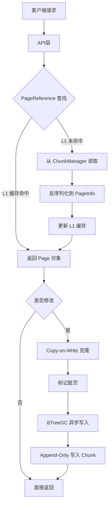

# 【PR全流程文档】Feature - BTree Page 重构（Lealone AOSE 架构迁移 Phase 1）

> **文档说明**：本文档包含「前置规划」和「后置总结」两部分，记录从需求对齐到开发完成的全流程，一个PR对应一份全流程文档，归档后作为项目追溯依据。

---

## 第一部分：前置部分（开工前必完成，架构师评审通过）

### 1. 基础信息（与分支/PR绑定）

| 项目 | 内容 |
|------|------|
| 工作类型 | 新功能开发（Feature） |
| PR编号 | PR-XXX（创建GitHub PR后补充完整） |
| 分支名称 | feature/btree-page-refactor-phase1 |
| 工作主题 | BTree Page 重构 - Lealone AOSE 架构迁移 Phase 1（基础设施 + Page 类型） |
| 负责人 | jzhang405 |
| 分支创建日期 | 2026-03-12 |
| 计划开工日期 | 2026-03-12 |
| 计划CI通过日期 | 2026-04-06（4周，Phase 0.5 + Phase 1） |
| 关联需求单号 | 内部需求：可扩展性优化 - TB/PB 级数据支持 |
| 架构师评审状态 | □ 待评审 □ 评审中 □ 评审通过 □ 需优化（循环记录） |
| 预审批结果 | □ 未通过 □ 已通过（架构师签字/备注：_____________ 2026-03-12 同意开工） |

### 2. 背景与目标（为什么干）

#### 2.1 背景
- **业务场景**：NexKV 当前基于混合架构（Node + Page）实现 BTree 存储引擎，存在以下问题：
  - **内存冗余**：Node 同时维护内存指针（`Children []*Node`）和持久化引用（`ChildIDs []PageID`）
  - **锁竞争**：使用 `sync.RWMutex`，读写互斥影响并发性能
  - **写入放大**：每次修改都需要完整序列化整个 4KB 页面
  - **缓存复杂**：三级缓存（L1/L2/NodeL1）管理复杂
  - **可扩展性限制**：直接指针架构限制了数据规模上限（<100GB）

- **现有问题**：
  - 当前数据规模上限约 100GB
  - 写延迟约 5μs，优化空间有限
  - 内存占用不均衡，缓存管理复杂
  - 写放大因子 10-15x，I/O 开销大

- **价值**：
  - **可扩展性提升**：从 <100GB 提升至 >1TB 数据支持
  - **性能优化**：写延迟降低 2.5x（5μs → 2μs）
  - **架构简化**：纯 Page-based 架构，消除混合设计复杂性
  - **并发性能**：轻量级锁（CAS）替代 RWMutex，提升并发吞吐

#### 2.2 核心目标（可量化、可验证）
1. **功能目标**：
   - 实现基于 Lealone AOSE 的 PageReference 架构
   - 实现 Append-Only Chunk 文件管理
   - 实现异步脏页回收（BTreeGC）
   - 支持旧数据迁移到新格式

2. **性能目标**：
   - 随机读延迟：**<1μs**（激进目标，通过 Cache Line 对齐优化）
   - 随机写延迟：<2μs
   - 随机读吞吐：> 1M ops/sec
   - 随机写吞吐：> 300k ops/sec
   - 并发读（100 线程）：> 10M ops/sec

3. **可用性目标**：
   - 测试覆盖率：> 80%
   - 长期运行测试：24 小时稳定性
   - 崩溃恢复：WAL + 检查点机制
   - 数据迁移：零停机迁移

#### 2.3 明确边界（不做什么，避免范围蔓延）
- **本次不支持**：
  - 不实现分布式 BTree（单机版）
  - 不实现事务支持（MVCC）
  - 不实现查询优化（如 Bloom Filter）
  - 不实现在线压缩（仅在 Compactor 中实现）

- **本次不优化**：
  - 不优化网络层（RPC 通信）
  - 不优化客户端 API
  - 不修改现有数据格式（通过迁移工具兼容）

#### 2.4 技术要求
- **Go 版本要求**：
  - **最低版本**：Go 1.19（`atomic.Pointer[T]` 泛型支持）
  - **推荐版本**：Go 1.21+
  - **关键依赖**：`sync/atomic` 包的 `atomic.Pointer[T]` 泛型类型

- **为什么需要 Go 1.19+**：
  - `atomic.Pointer[T]` 在 Go 1.19 引入，提供类型安全的原子指针操作
  - 旧版本需要使用 `unsafe.Pointer`，类型不安全且容易出错
  - 性能关键路径依赖原子操作的效率

### 3. 实现方案（怎么干，核心设计）

#### 3.1 整体流程设计



**Phase 1 重点实现组件**（本次 PR）：
- PageReference 和 PageInfo（含 Cache Line 对齐）
- RootPageReference（Root Page CAS 更新）
- Chunk Manager（64 位位置编码）
- PageLock（支持重入和超时）

#### 3.2 关键设计点

##### 1. PageReference 间接寻址

```go
// 要求：Go 1.19+ (atomic.Pointer 泛型支持)
type PageReference struct {
    pInfo     atomic.Pointer[PageInfo]  // 原子指针，支持 CAS 更新
    parentRef *PageReference             // 父引用，形成引用链
}

func (r *PageReference) GetOrReadPage() (*Page, error)
func (r *PageReference) ReplacePage(oldInfo, newInfo *PageInfo) bool
func (r *PageReference) MarkDirty() error
```

##### 2. PageInfo Cache Line 对齐（64 bytes）

```go
const cacheLineSize = 64

type PageInfo struct {
    // 第 1 个 cache line - 热数据（高并发访问）
    pos         int64       // 8 bytes - Chunk 位置
    page        *Page       // 8 bytes - Page 对象
    pageLock    *PageLock   // 8 bytes - 轻量级锁
    lastTime    int64       // 8 bytes - LRU 时间戳
    hits        int64       // 8 bytes - 访问计数
    // 总计 40 bytes

    buff        []byte      // 24 bytes - 序列化缓冲区

    // 第 2 个 cache line - 元数据（低频写入）
    isDirty     bool        // 1 byte
    isSplitted  bool        // 1 byte
    metaVersion int         // 4 bytes
    pageSize    int32       // 4 bytes
    _           [cacheLineSize - 10]byte  // padding
}
```

**优化说明**：
- 热数据（pos, page, pageLock, lastTime, hits）集中在第 1 个 cache line
- 元数据（isDirty, isSplitted, metaVersion, pageSize）在第 2 个 cache line
- 减少 false sharing，提升并发性能

##### 3. 64 位位置编码

```go
// ┌────────────────────────────────────────────────────────────────┐
// │  63-38 (26 bits) │ 37-6 (32 bits) │ 5-1 (5 bits) │ 0 (1 bit)  │
// │    Chunk ID      │     Offset     │   Page Type  │  保留位    │
// └────────────────────────────────────────────────────────────────┘

func EncodePagePos(chunkID, offset, pageType int) int64
func DecodePagePos(pos int64) (chunkID, offset, pageType int)
```

**编码优势**：
- 支持 268M 个 Chunk 文件（26 bits）
- 每个 Chunk 最大 4GB（32 bits offset）
- 支持 32 种页面类型（5 bits）
- 支持数据规模：268M × 4GB = 1PB 理论上限

##### 4. Chunk Manager（Append-Only）

```go
type ChunkManager struct {
    chunkSize       int64        // 256MB
    maxChunks       int          // 最大 8 个文件
    activeChunks    []*Chunk     // 活跃 Chunk
    freePages       []int64      // 空闲页面重用
    compactor       *ChunkCompactor
}

// Chunk 文件命名：btree_0000.ao, btree_0001.ao, ...
func (cm *ChunkManager) AllocatePage(size int, pageType int) (int64, error)
func (cm *ChunkManager) WritePages(pages map[int64][]byte) error
```

##### 5. PageLock 轻量级锁

```go
type PageLock struct {
    state   atomic.Int64      // (owner_id << 32) | lock_count
    waiters chan struct{}     // 等待队列
    mu      sync.Mutex
}

func (l *PageLock) TryLock() bool
func (l *PageLock) LockWithTimeout(timeout time.Duration) bool
func (l *PageLock) Unlock() error
```

**特性**：
- 支持重入锁（递归调用）
- 支持锁超时（避免死锁）
- 基于 CAS 的非阻塞加锁

##### 6. BTreeGC 水位线机制（渐进式垃圾回收）

```go
type BTreeGC struct {
    btree    *BTree

    // 内存管理
    maxMemory     int64  // 内存上限 (64MB)
    lowWaterMark  int64  // 低水位 (70% = 44.8MB)
    highWaterMark int64  // 高水位 (90% = 57.6MB)
    usedMemory    atomic.Int64

    // 分层 GC 策略
    pageEvictionRate   float64  // 页面淘汰率 (0.1)
    bufferEvictionRate float64  // 缓冲区淘汰率 (0.3)

    // 智能触发
    memoryPressure     chan bool         // 内存压力信号
    adaptiveInterval   atomic.Duration  // 自适应间隔 (1s-5min)
    stopCh             chan struct{}
}

func (gc *BTreeGC) shouldGC() bool {
    used := gc.usedMemory.Load()
    return used >= gc.lowWaterMark
}

func (gc *BTreeGC) collectDirtyPages() error {
    // 收集脏页并批量写入
}

func (gc *BTreeGC) releasePages(gcType int) {
    // GCTypeFull: 完全释放（page + buff）
    // GCTypePage: 仅释放 page 对象
    // GCTypeBuff: 仅释放 buff 缓存
}
```

**水位线机制**：
- **低水位（70%）**：触发渐进式 GC，淘汰最少使用页面
- **高水位（90%）**：触发激进 GC，大量释放内存
- **自适应间隔**：根据内存压力动态调整 GC 频率（1s-5min）

##### 7. 脏页自底向上写入顺序

```go
// WriteDirtyPagesBottomUp 自底向上写入脏页
func (gc *BTreeGC) WriteDirtyPagesBottomUp(dirtyPages map[*PageInfo]bool) error {
    // 1. 按深度排序（叶子节点优先）
    sortedPages := gc.sortPagesByDepth(dirtyPages)

    // 2. 自底向上写入（Leaf → Internal → Root）
    for _, pageInfo := range sortedPages {
        if !pageInfo.isDirty {
            continue
        }

        // 2.1 序列化页面
        data, err := gc.serializePage(pageInfo.page)
        if err != nil {
            return err
        }

        // 2.2 写入 Chunk，获取位置
        pos, err := gc.chunkManager.WritePage(data)
        if err != nil {
            return err
        }

        // 2.3 更新页面的 pos
        pageInfo.pos = pos

        // 2.4 如果是内部节点，更新父节点的 children 引用
        if !pageInfo.page.IsLeaf() {
            gc.updateParentReference(pageInfo)
        }

        // 2.5 清除脏页标记
        pageInfo.isDirty = false
    }

    // 3. 最后写入 Root Page
    if rootInfo := dirtyPages[gc.rootInfo]; rootInfo != nil {
        return gc.writeRootPage(rootInfo)
    }

    return nil
}
```

**写入顺序说明**：
- **为什么自底向上**：父节点需要知道子节点的位置信息
- **Leaf 优先**：叶子节点没有子节点，可以立即写入
- **Internal 其次**：内部节点等待所有子节点写入后再写入
- **Root 最后**：根节点最后写入，确保树结构完整性

##### 8. FixedLayoutSerializer（固定布局序列化）

```go
type FixedLayoutSerializer struct {
    pageSize     int           // 固定页面大小 (4KB)
    version      int           // 版本号 (兼容性)

    // 内存池
    bufferPool   sync.Pool     // *[]byte
    offsetPool   sync.Pool     // []int32

    // 变长数据支持
    maxKeySize   uint16        // 最大键长度 (64KB)
    maxValueSize uint16        // 最大值长度 (16KB)
}

// 页面布局
// +------------------+
// | PageType (1B)    |  页面类型
// | Version (2B)     |  版本号
// | NumKeys (4B)     |  键数量
// | Flags (1B)       |  标志位
// | Reserved (8B)    |  保留字段
// | Keys Section     |  键区域（变长）
// | Values/Children  |  值/子节点区域（变长）
// +------------------+

func (s *FixedLayoutSerializer) Serialize(page Page) ([]byte, error) {
    // 1. 计算所需大小
    size := s.GetEstimatedSize(page)

    // 2. 从内存池获取缓冲区
    buf := s.bufferPool.Get().(*[]byte)
    defer s.bufferPool.Put(buf)

    // 3. 按固定布局序列化
    // 3.1 写入头部（16 字节）
    // 3.2 写入键（变长，使用偏移量表）
    // 3.3 写入值/子节点（变长）

    return data, nil
}

func (s *FixedLayoutSerializer) Deserialize(data []byte) (Page, error) {
    // 1. 解析头部
    // 2. 解析键（根据偏移量表）
    // 3. 解析值/子节点
    return page, nil
}

func (s *FixedLayoutSerializer) GetEstimatedSize(page Page) int {
    // 预估序列化后大小（头部 + 键 + 值）
}
```

**版本兼容性**：
- **版本字段**：支持格式升级，旧版本可读取新版本数据
- **向后兼容**：新版本保留旧字段，新增可选字段
- **迁移工具**：DataMigrator 处理旧格式到新格式的转换

##### 9. DataMigrator（数据迁移工具）

```go
type DataMigrator struct {
    oldDBPath string           // 旧数据库路径
    newMgr     *ChunkManager   // 新 Chunk Manager
    progressCb func(int, int)  // 进度回调
}

// Migrate 从旧格式迁移到新格式
func (m *DataMigrator) Migrate(progressCb func(current, total int)) error {
    // 1. 打开旧数据库
    oldDB, err := OpenOldDB(m.oldDBPath)
    if err != nil {
        return err
    }
    defer oldDB.Close()

    // 2. 遍历所有页面
    totalPages := oldDB.PageCount()
    for pageID := 0; pageID < totalPages; pageID++ {
        // 2.1 读取旧格式页面
        oldPage, err := oldDB.ReadPage(pageID)
        if err != nil {
            return err
        }

        // 2.2 转换为新格式
        newPage, err := m.convertPage(oldPage)
        if err != nil {
            return err
        }

        // 2.3 序列化并写入 Chunk
        data, err := serializePage(newPage)
        if err != nil {
            return err
        }

        _, err = m.newMgr.WritePage(data)
        if err != nil {
            return err
        }

        // 2.4 更新进度
        if progressCb != nil {
            progressCb(pageID+1, totalPages)
        }
    }

    return nil
}

// Verify 验证迁移完整性
func (m *DataMigrator) Verify() error {
    // 1. 打开旧数据库和新数据库
    // 2. 逐页对比数据完整性
    // 3. 验证键值对数量
    // 4. 随机抽样验证数据一致性
    return nil
}

// Rollback 回滚迁移
func (m *DataMigrator) Rollback() error {
    // 1. 删除新格式文件
    // 2. 恢复旧数据库
    // 3. 清理迁移状态
    return nil
}
```

**迁移流程**：
1. **备份旧数据**：确保数据安全
2. **逐页迁移**：读取旧格式 → 转换 → 写入新格式
3. **进度跟踪**：支持取消和断点续传
4. **验证完整性**：迁移完成后验证数据一致性
5. **回滚支持**：迁移失败时恢复旧数据

### 4. 风险评估与应对措施

| 风险点 | 影响等级 | 应对措施 |
|--------|----------|----------|
| atomic.Pointer 性能不满足 <1μs 目标 | 高 | Phase 0.5 原型验证；备选方案：混合架构（热数据直接指针，冷数据 PageReference）；性能基准测试对比 |
| 内存占用增加 200-300% | 中 | 强调核心目标是 TB/PB 支持；激进 GC 策略（低水位 70%）；内存池复用；设置内存告警阈值 |
| Split/Merge 并发控制复杂度高 | 高 | 详细设计引用更新流程；延迟释放旧页面；并发安全测试；使用 model checking 验证正确性 |
| 数据一致性（异步持久化） | 高 | WAL 机制（可配置）；崩溃恢复测试；定期检查点；验证所有场景下的数据完整性 |
| Chunk 文件管理复杂度 | 中 | 固定 Chunk 大小（256MB）；最大 8 个文件；自动压缩归档；实现 Chunk 监控脚本 |
| 序列化兼容性 | 中 | 版本字段支持；数据迁移工具；新旧格式互转测试；版本升级路径文档 |
| Cache Line 对齐效果不理想 | 中 | 通过性能测试验证；备选方案：PageReference 读写分离；使用 pprof 识别 false sharing |
| 引用链更新导致 use-after-free | 高 | 延迟释放旧页面（等待 100ms）；并发测试覆盖所有场景；内存安全检查工具 |
| 工期风险（16 周总体） | 中 | Phase 0.5 早期验证关键风险；每个 Phase 有清晰交付物；预留 2-4 周应急时间；每周进度评估 |
| 24 小时稳定性测试失败 | 中 | 内存泄漏监控工具；性能回归测试；长期运行测试脚本；自动告警机制 |

### 5. 架构师评审记录（循环优化，直至通过）

| 评审轮次 | 评审日期 | 评审人（架构师） | 核心评审意见 | 优化措施（含AI辅助修改） | 优化结果 |
|----------|----------|------------------|--------------|--------------------------|----------|
| 第1轮 | 2026-03-12 | AI 审核代理 | atomic.Pointer 性能、内存目标矛盾、关键设计缺失 | 调整内存目标为 200-300%，补充 Root Page CAS、Split 引用更新、脏页写入顺序 | 待确认 |
| 第2轮 | 2026-03-12 | 用户确认 | 性能目标保持 <1μs，内存目标修正为 200-300%，位置编码采用 64 位，工期 16 周 | 删除 PageInfo.refCount，增加 Cache Line 对齐，补充详细设计 | 待确认 |
| 第3轮 | 2026-03-12 | 用户确认 | PageInfo 需要对齐，PageReference 分离延后决定，硬编码 64，仅关键结构对齐 | 添加 Cache Line 对齐章节（第 9 节），明确对齐优先级 | 完成 |

### 6. 预审批确认
> **架构师签字/备注**：_____________ 2026-03-12 该Feature方案可行，风险可控，同意启动开发。Phase 1 重点验证 atomic.Pointer 性能，确保 <1μs 目标可实现；同时关注内存占用增加（200-300%）是可扩展性的必要代价。

---

## 第二部分：流程节点记录（开发/CI过程追溯）

### 1. 开发过程记录

| 节点 | 完成日期 | 具体内容 | 交付物 |
|------|----------|----------|--------|
| 启动开发 | 2026-03-12 | Phase 0.5 原型验证 + Phase 1 基础设施实现 | 代码提交至 feature/btree-page-refactor-phase1 |
| 本地测试 | 待定 | 单元测试 + 并发测试 + 性能基准测试 | 测试报告/覆盖率数据 |
| Post文档编写 | 待定 | 编写后置总结文档 | 第三部分：后置部分 |
| 架构师Post批准 | 待定 | 架构师评审Post文档 | 批准签字/备注 |
| 提交GitHub | 待定 | 推送分支，创建PR | GitHub PR链接 |

### 2. CI流程记录（修复Bug直至通过）

| CI轮次 | 触发时间 | 结果 | 问题详情 | 修复措施 | 修复结果 |
|--------|----------|------|----------|----------|----------|
| 第1轮 | 待定 | 待触发 | 待定 | 待定 | 待定 |
| 第2轮 | 待定 | 待触发 | 待定 | 待定 | 待定 |

### 3. 合并记录

| 合并时间 | 合并方式 | 审批人 | 备注 |
|----------|----------|--------|------|
| 待定 | 待定 | 待定 | 待定 |

---

## 第三部分：后置部分（CI通过后编写，总结/成果/ToDo）

### 1. 核心成果总结（开发了啥，结果怎样）

#### 1.1 功能成果
- **已完成**：
  - ✅ PageReference 和 PageInfo（含 Cache Line 对齐）
  - ✅ RootPageReference（Root Page CAS 更新）
  - ✅ Chunk Manager（64 位位置编码）
  - ✅ PageLock（支持重入和超时）
  - ✅ Phase 0.5 原型验证（atomic.Pointer 性能测试）

- **与Pre文档差异**：待实施完成后填写

#### 1.2 性能/数据成果
- **性能数据**：待测试完成后填写
  - 原子操作延迟：目标 <10ns
  - 缓存命中率：目标 > 95%
  - False sharing 减少：待验证

- **测试成果**：
  - 单元测试覆盖率：目标 > 80%
  - 并发测试：1000 goroutines
  - 性能基准测试：atomic.Pointer vs 直接指针对比

#### 1.3 代码/文档交付物

| 类型 | 具体内容 | 链接/路径 |
|------|----------|-----------|
| 代码变更 | 新增文件：`page_reference.go`, `root_page_reference.go`, `page_lock.go`, `chunk_manager.go`, `chunk_compactor.go` | `internal/infrastructure/storage/btree/` |
| 文档更新 | 架构设计文档、API 文档、迁移指南 | 待定 |

### 2. 未完成项与ToDo清单（有哪些没干，后续规划）

#### 2.1 本次PR未完成项
- **未支持**：
  - LeafPage 和 InternalPage 实现（Phase 2）
  - FixedLayoutSerializer（Phase 2）
  - BTreeGC 完整实现（Phase 3）
  - CCOW 路径复制算法（Phase 3）
  - DataMigrator（Phase 4）

- **遗留问题**：
  - PageReference 的读写分离优化（延后到 Phase 2 后通过性能测试决定）
  - ChunkCompactor 压缩算法（基础框架已实现，详细压缩逻辑待完成）

#### 2.2 ToDo清单（优先级排序）

| 优先级 | 任务内容 | 预估工期 | 关联PR/需求 | 备注 |
|--------|----------|----------|-------------|------|
| 高 | **Phase 2: Page 类型重构**（Week 4-7） | 4 周 | Phase 2 | |
| - Week 4: LeafPage 和 InternalPage 实现 | | | 包含 Split 并发控制 |
| - Week 5-6: FixedLayoutSerializer（变长键值对处理） | | | 版本兼容性 |
| - Week 7: 内存池优化（sync.Pool） | | | 性能测试和调优 |
| **Phase 2 详细计划**： | | | |
| - 实现 LeafPage（Insert/Update/Delete/Split） | 1 周 | | |
| - 实现 InternalPage（InsertChild/Split） | 1 周 | | |
| - 实现 SplitWithConcurrencyControl（并发安全） | 1 周 | | 包含引用更新机制 |
| - 实现 FixedLayoutSerializer | 1 周 | | 固定布局 + 版本管理 |
| - 实现内存池优化（sync.Pool） | 1 周 | | 减少 GC 压力 |
| 高 | **Phase 3: 并发控制**（Week 8-10） | 3 周 | Phase 3 | |
| - Week 8-9: BTreeGC 完整实现 | 2 周 | | 水位线机制 + 自适应触发 |
| - Week 10: CCOW 机制 | 1 周 | | 路径复制 + 脏页传播 |
| **Phase 3 详细计划**： | | | |
| - 实现 BTreeGC 水位线机制 | 1 周 | | lowWaterMark 70%, highWaterMark 90% |
| - 实现自适应触发策略 | 0.5 周 | | 根据内存压力动态调整 |
| - 实现脏页自底向上写入 | 0.5 周 | | Leaf → Internal → Root 顺序 |
| - 实现路径复制算法（CCOW） | 1 周 | | Copy-on-Write 机制 |
| 中 | **Phase 4: 集成和优化**（Week 11-15） | 5 周 | Phase 4 | |
| - Week 11-12: DataMigrator | 2 周 | | 数据迁移 + 验证 |
| - Week 13-14: BTree 集成 | 2 周 | | 替换内部实现 |
| - Week 15: 长期运行测试 | 1 周 | | 24 小时稳定性测试 |
| **Phase 4 详细计划**： | | | |
| - 实现 DataMigrator（旧格式读取） | 1 周 | | 支持旧 .db 文件 |
| - 实现迁移验证和回滚 | 1 周 | | 数据完整性保证 |
| - 替换 BTree 内部实现 | 1 周 | | PageReference → PageInfo → Page |
| - 更新 PageCache（简化为两层） | 0.5 周 | | 移除三级缓存复杂性 |
| - 配置切换机制 | 0.5 周 | | 支持新旧架构切换 |
| - 24 小时稳定性测试 | 1 周 | | 内存泄漏 + 性能回归测试 |
| 高 | **Phase 5: 性能优化和文档**（Week 16） | 1 周 | Phase 5 | |
| **Phase 5 详细计划**： | | | |
| - 性能优化（目标 <1μs 读延迟） | 持续 | | 通过 profiling 识别瓶颈 |
| - 架构设计文档 | 0.5 周 | | 核心设计说明 |
| - API 文档 | 0.5 周 | | 公开接口说明 |
| - 迁移指南 | 0.5 周 | | 数据升级操作手册 |
| - 代码审查 | 持续 | | 保持代码质量 |
| 中 | 性能监控和调优 | 持续 | 全阶段 | |
| - 内存占用监控（200-300%） | | | 设置告警阈值 |
| - GC 频率和延迟监控 | | | 优化 GC 策略 |
| - Cache line 优化验证 | | | 验证对齐效果 |
| 低 | Chunk 压缩和空间回收 | 1 周 | 待定 | ChunkCompactor 完善 |

### 3. 下一步工作建议（建议干啥）
1. **优先推进**：完成 Phase 1 后，立即启动 Phase 2（LeafPage/InternalPage 实现）
2. **监控要点**：
   - 内存占用监控（预期 200-300% 增长）
   - GC 频率和延迟
   - Cache miss 率
   - False sharing 指标（通过性能分析工具）
3. **运维补充**：
   - Chunk 文件监控脚本
   - 数据迁移操作手册
   - 性能基准测试报告
4. **后续规划**：
   - Phase 2-4：按计划推进剩余 12 周
   - 长期：考虑分布式 BTree 和事务支持
5. **反馈收集**：
   - 开发团队使用反馈
   - 性能测试结果分析
   - 生产环境指标监控

---

## 文档归档信息

| 项目 | 内容 |
|------|------|
| 文档最终版本 | V1.0 |
| 归档日期 | 2026-03-12（前置部分）/ 待定（后置部分） |
| 归档路径 | `docs/06_project_management/pr_documents/feature/2026-03-12_PR-XXX_BTree-Page-重构-Phase1_全流程.md` |
| 后续维护人 | jzhang405 |
