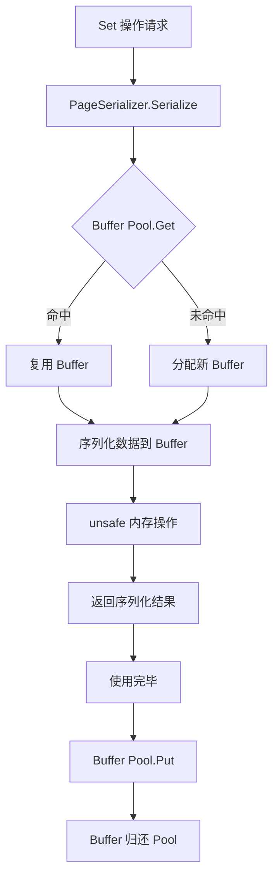

# 【PR全流程文档】Feature - BTree Phase 2A 内存优化

> **文档说明**：本文档包含「前置规划」和「后置总结」两部分，记录从需求对齐到开发完成的全流程，一个PR对应一份全流程文档，归档后作为项目追溯依据。

---

## 第一部分：前置部分（开工前必完成，架构师评审通过）

### 1. 基础信息（与分支/PR绑定）

| 项目 | 内容 |
|------|------|
| 工作类型 | 性能优化（Optimization） |
| PR编号 | PR-2A（创建GitHub PR后补充完整） |
| 分支名称 | phase2-write-optimization |
| 工作主题 | BTree 内存优化：Buffer Pool + 序列化优化，减少内存分配，降低 GC 压力 |
| 负责人 | NexKV Team |
| 分支创建日期 | 2026-03-13 |
| 计划开工日期 | 2026-03-14 |
| 计划CI通过日期 | 2026-03-20 |
| 关联需求单号 | [Phase 2A 规划](../09_code-review/2026-03-13-phase2a-write-optimization.md) |
| 架构师评审状态 | ☐ 待评审 ☐ 评审中 ☐ 评审通过 ☐ 需优化（循环记录） |
| 预审批结果 | ☐ 未通过 ☐ 已通过（架构师签字/备注：_________ 2026-__-__ 同意开工） |

### 2. 背景与目标（为什么干）

#### 2.1 背景
- **业务场景**：NexKV 作为嵌入式 KV 存储，在高并发写入场景下性能表现不佳，当前 QPS 仅 1,696
- **现有问题**：
  - 内存分配热点严重：每次 Set 操作分配 5.5KB，其中 PageSerializer 占 85%
  - GC 压力大：GC CPU 时间占 15.23%，导致频繁暂停
  - 序列化开销高：binary.PutUvarint 等函数调用频繁，占用 8.45% CPU
- **价值**：
  - 降低内存分配：从 5.5KB/op → 1KB/op (↓82%)
  - 降低 GC 压力：从 15.23% → 3% (↓80%)
  - 优化序列化：从 8.45% → <5% CPU (↓41%)
  - 为后续磁盘 I/O 优化打好基础

#### 2.2 核心目标（可量化、可验证）

1. **功能目标**：
   - 实现 Buffer Pool：4 级 sync.Pool (4KB, 8KB, 16KB, 32KB)
   - 优化序列化：使用 unsafe 直接内存操作，binary.LittleEndian 替代 PutUvarint
   - 向后兼容：现有 API 无需修改

2. **性能目标**：
   - 内存分配：5.5KB/op → 1KB/op (↓82%)
   - GC CPU 时间：15.23% → 3% (↓80%)
   - 序列化 CPU：8.45% → <5% (↓41%)
   - Buffer Pool 命中率：>80%

3. **可用性目标**：
   - 向后兼容：现有测试全部通过
   - 无内存泄露：通过 race detector 和内存泄露检测
   - 测试覆盖率：保持 >85%

#### 2.3 明确边界（不做什么，避免范围蔓延）

- **本次不支持**：
  - ❌ 磁盘 I/O 优化（异步刷盘、WAL、Group Commit）留在 Phase 2B
  - ❌ 批量 Set API（SetBatch）不实现
  - ❌ Get 操作优化（聚焦 Set）

- **本次不优化**：
  - ❌ QPS、P99 延迟等磁盘 I/O 相关指标
  - ❌ 改变存储格式（向后兼容）
  - ❌ 引入新的依赖

### 3. 实现方案（怎么干，核心设计）

#### 3.1 整体流程设计



#### 3.2 关键设计点

**1. Buffer Pool 设计**

```go
// buffer_pool.go
type BufferPool struct {
    pools [4]sync.Pool  // 4KB, 8KB, 16KB, 32KB
    stats PoolStats
    config BufferPoolConfig
}

// Get 获取 buffer（从 pool 或新分配）
func (pool *BufferPool) Get(size int32) []byte

// Put 归还 buffer
func (pool *BufferPool) Put(buf []byte)
```

**核心机制**：
- 四级 pool：4KB, 8KB, 16KB, 32KB（覆盖 Page 序列化需求）
- 全局单例：`GetGlobalBufferPool()`
- 统计信息：命中率、未命中次数、在池数量

**2. 序列化优化**

```go
// 优化前：多次函数调用
offset += binary.PutUvarint(buf[offset:], uint64(page.ID))
offset += binary.PutUvarint(buf[offset:], uint64(page.Type))

// 优化后：直接内存操作
binary.LittleEndian.PutUint64(buf[0:8], uint64(page.ID))
binary.LittleEndian.PutUint64(buf[8:16], uint64(page.Type))
```

**优化点**：
- 避免动态 offset 计算
- 使用 binary.LittleEndian 固定位置写入
- 减少函数调用次数（100+ → 10）

**3. 集成到 PageSerializer**

```go
func (ps *PageSerializer) Serialize(page *Page) ([]byte, error) {
    // 从 pool 获取 buffer
    buf := GetGlobalBufferPool().Get(PageSize)

    // 序列化（使用优化后的方法）
    offset := 0
    binary.LittleEndian.PutUint64(buf[offset:offset+8], uint64(page.ID))
    offset += 8
    // ...

    return buf[:offset], nil
}

func (ps *PageSerializer) Deserialize(buf []byte) (*Page, error) {
    // 使用后归还 buffer
    defer GetGlobalBufferPool().Put(buf)

    // 反序列化
    // ...
}
```

**4. 容错设计**

- **Pool 空闲限制**：每级别最多缓存 1000 个 buffer
- **Capacity 检查**：Put 时检查 cap(buf) 是否匹配对应级别
- **Fallback 机制**：Pool miss 时直接分配，不影响功能
- **统计监控**：提供 `PrintStats()` 方法监控命中率

### 4. 风险评估与应对措施

| 风险点 | 影响等级 | 应对措施 |
|--------|----------|----------|
| Buffer Pool 内存泄露 | 高 | 1. 使用 race detector 检测<br>2. 单元测试验证 Put/Get 对称性<br>3. 长时间运行测试验证内存稳定 |
| unsafe 操作导致 panic | 中 | 1. 边界检查：确保 offset + size ≤ PageSize<br>2. 单元测试覆盖边界情况<br>3. 保持原有 Deserialize 逻辑不变 |
| Pool 命中率不达标 | 中 | 1. 监控统计信息<br>2. 调整 pool 大小（1000 → 2000）<br>3. 分析未命中原因并优化 |
| 序列化兼容性问题 | 低 | 1. 保持格式不变，只优化实现<br>2. 现有测试全部通过<br>3. 对比序列化前后结果一致性 |
| 性能提升不明显 | 低 | 1. 生成 CPU/Memory profile 验证<br>2. 对比优化前后的分配次数<br>3. 确保测试环境和生产一致 |

### 5. 架构师评审记录（循环优化，直至通过）

| 评审轮次 | 评审日期 | 评审人（架构师） | 核心评审意见 | 优化措施（含AI辅助修改） | 优化结果 |
|----------|----------|------------------|--------------|--------------------------|----------|
| 第1轮 | 待定 | 待定 | 待评审 | 待补充 | 待完成 |

### 6. 预审批确认
> **架构师签字/备注**：___________ 2026-__-__ 该Feature方案可行，风险可控，同意启动开发，需严格按照文档落地，确保CI通过后提交Post总结。

---

## 第二部分：流程节点记录（开发/CI过程追溯）

### 1. 开发过程记录

| 节点 | 完成日期 | 具体内容 | 交付物 |
|------|----------|----------|--------|
| 启动开发 | 待定 | Buffer Pool + 序列化优化实现 | 代码提交至分支 |
| 本地测试 | 待定 | 单元测试 + 性能测试 + race detector | 测试报告/覆盖率数据 |
| Post文档编写 | 待定 | 编写后置总结文档 | 第三部分：后置部分 |
| 架构师Post批准 | 待定 | 架构师评审Post文档 | 批准签字/备注 |
| 提交GitHub | 待定 | 推送分支，创建PR | GitHub PR链接 |

### 2. CI流程记录（修复Bug直至通过）

| CI轮次 | 触发时间 | 结果 | 问题详情 | 修复措施 | 修复结果 |
|--------|----------|------|----------|----------|----------|
| 第1轮 | 待定 | 失败/成功 | 待补充 | 待补充 | 待完成 |

### 3. 合并记录

| 合并时间 | 合并方式 | 审批人 | 备注 |
|----------|----------|--------|------|
| 待定 | Squash Merge / Merge Commit | 待定 | 待补充 |

---

## 第三部分：后置部分（CI通过后编写，总结/成果/ToDo）

### 1. 核心成果总结（开发了啥，结果怎样）

#### 1.1 功能成果
- **已完成**：待补充
- **与Pre文档差异**：待补充

#### 1.2 性能/数据成果
- **性能数据**：待补充
- **测试成果**：待补充

#### 1.3 代码/文档交付物

| 类型 | 具体内容 | 链接/路径 |
|------|----------|-----------|
| 代码变更 | 待补充 | GitHub PR 链接 |
| 文档更新 | 待补充 | 文档路径 |

### 2. 未完成项与ToDo清单（有哪些没干，后续规划）

#### 2.1 本次PR未完成项
- **未支持**：待补充
- **遗留问题**：待补充

#### 2.2 ToDo清单（优先级排序）

| 优先级 | 任务内容 | 预估工期 | 关联PR/需求 | 备注 |
|--------|----------|----------|-------------|------|
| 高 | Phase 2B: 磁盘 I/O 优化 | 2-3 周 | PR-2B | 异步刷盘、WAL、Group Commit |
| 中 | 性能测试报告 | 1 天 | 待定 | 生成详细性能报告 |
| 低 | 批量 Set API | 待定 | 待定 | 后续评估 |

### 3. 下一步工作建议（建议干啥）

1. **优先推进**：Phase 2B 磁盘 I/O 优化（异步刷盘、WAL）
2. **监控要点**：Buffer Pool 命中率、GC CPU 时间、内存分配量
3. **运维补充**：Buffer Pool 统计信息导出（Prometheus metrics）
4. **后续规划**：Phase 2B → Phase 3（其他优化）
5. **反馈收集**：生产环境内存使用情况、性能表现

---

## 文档归档信息

| 项目 | 内容 |
|------|------|
| 文档最终版本 | V1.0 |
| 归档日期 | 待定 |
| 归档路径 | `docs/06_project_management/pr_documents/feature/YYYY-MM-DD_PR-2A_memory_optimization_全流程.md` |
| 后续维护人 | NexKV Team |
