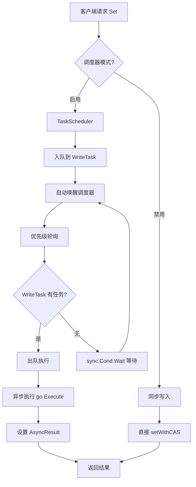

# 【PR全流程文档】Feature - TaskScheduler 多任务调度框架

> **文档说明**：本文档包含「前置规划」和「后置总结」两部分，记录从需求对齐到开发完成的全流程，一个PR对应一份全流程文档，归档后作为项目追溯依据。

---

## 第一部分：前置部分（开工前必完成，架构师评审通过）

### 1. 基础信息（与分支/PR绑定）

| 项目 | 内容 |
|------|------|
| 工作类型 | 新功能开发（Feature） |
| PR编号 | PR-XXX（创建GitHub PR后补充完整） |
| 分支名称 | feature/task-scheduler-framework |
| 工作主题 | TaskScheduler 多任务调度框架设计与实现 |
| 负责人 | jzhang405 |
| 分支创建日期 | 2026-03-14 |
| 计划开工日期 | 待定 |
| 计划CI通过日期 | 待定 |
| 关联需求单号 | BTree 写入性能优化（Phase 2） |
| 架构师评审状态 | □ 待评审 □ 评审中 □ 评审通过 □ 需优化（循环记录） |
| 预审批结果 | □ 未通过 □ 已通过（架构师签字/备注：XXX 202X-XX-XX 同意开工） |

### 2. 背景与目标（为什么干）

#### 2.1 背景

**业务场景**：

BTree 写入性能优化是 NexKV 项目的核心优化方向。当前实现存在严重的并发性能问题：

- **8 并发写入时性能比单线程慢 6.9 倍**
- **CAS 失败率 87.5%，浪费 47.5% CPU 时间**
- 无限重试，无退避策略
- 全局 Root CAS，不同 key 的写操作互相阻塞

**现有问题**：

1. **命名混淆风险**：原设计中的 `RunLoop` 与现有 `RunLoopWorker` 命名相似，容易混淆职责
2. **缺乏多任务调度**：现有 `RunLoopWorker` 是单队列单 worker 模式，无法支持多类型任务的优先级调度
3. **无优先级支持**：所有任务按 FIFO 顺序处理，无法区分任务优先级
4. **调度模式单一**：只有同步执行模式，无法支持 IO 密集型和混合型任务

**与 BTree 优化方案的关联**：

TaskScheduler 是 BTree 写入性能优化 Phase 2 的核心基础设施：

- **Phase 1**：有限重试 + 智能退避（减少 CPU 浪费）
- **Phase 2**：TaskScheduler 异步写入队列（本PR）+ WriteTask 实现
- **Phase 3**：Per-Page Lock 优化（长期目标）

TaskScheduler 解决了 Phase 2 的关键问题：
1. 单队列无法支持多类型任务调度
2. 无优先级导致关键任务等待
3. 命名混淆导致设计不清晰

**价值**：

实现 TaskScheduler 多任务调度框架后：
- **命名清晰**：`EventLoop`（单队列）vs `TaskScheduler`（多任务调度）
- **性能提升**：配合 Phase 2 整体优化，预期 8 并发写入性能提升 6.2x
- **框架价值**：提供可插拔、可扩展的多任务调度基础设施
- **可扩展性**：支持动态注册不同类型的 Task，每个 Task 独立队列
- **优先级调度**：支持按优先级调度，高优先级任务优先处理

#### 2.2 核心目标（可量化、可验证）

1. **功能目标**：
   - 实现 `TaskScheduler` 调度器，支持多任务优先级调度
   - 实现 `Task` 接口和 `SchedulerBaseTask` 基类（嵌入 `model.BaseTask`）
   - 支持任务动态注册/注销
   - 复用现有 `model.BaseTask[Result]` 实现异步结果等待
   - 复用现有 `model.TaskPriority` 实现标准化优先级
   - 重命名现有 `RunLoopWorker` → `EventLoop`

2. **性能目标**：
   - 8 并发写入吞吐量提升至 280%（相对当前 14.5%）
   - CPU 浪费从 47.5% 降至 5%
   - 平均延迟增加控制在 10% 以内

3. **可用性目标**：
   - 支持 panic 自动恢复
   - 支持上下文取消
   - 支持优雅关闭
   - 队列满时返回错误（背压控制）

#### 2.3 明确边界（不做什么，避免范围蔓延）

- **本次不支持**：
  - Per-Page Lock 优化（Phase 3，长期目标）
  - 分布式任务调度
  - 任务依赖关系

- **本次不优化**：
  - 不修改现有 `EventLoop`（原 `RunLoopWorker`）的核心逻辑
  - 不影响现有 API 的兼容性

### 3. 实现方案（怎么干，核心设计）

#### 3.1 整体流程设计



#### 3.2 关键设计点

1. **接口定义**：

**文件**: `internal/infrastructure/concurrency/task_scheduler.go`

```go
// Task 调度器任务接口
type Task interface {
    HasItem() bool                      // 检查是否有待处理任务
    Enqueue(item any) error             // 客户端入队任务
    Dequeue(item *any) bool             // 出队一个任务
    Execute(item any)                   // 执行任务处理逻辑
    GetTask() *model.BaseTask[any]      // 获取异步结果任务（复用现有）
    Name() string                        // 任务名称
    Priority() model.TaskPriority       // 优先级（复用现有枚举）
    setScheduler(s *TaskScheduler)      // 内部使用
}
```

**复用现有组件**：
- `internal/domain/model/task.go` 的 `BaseTask[Result]` - 异步结果等待
- `internal/domain/model/task.go` 的 `TaskPriority` - 10 级优先级枚举

2. **核心机制**：**优先级调度 + 无空转等待**

**无空转等待原理**：
- 所有 Task 队列都空时，调用 `sync.Cond.Wait()` 阻塞调度器 goroutine
- Task 入队时调用 `cond.Signal()` 自动唤醒调度器
- 避免忙等待（busy loop），零 CPU 消耗
- 与现有 `RunLoopWorker` 的 channel 阻塞等待类似，但支持多队列

**优先级调度原理**：
- 每个Task 有独立的优先级（数值越小优先级越高）
- 调度器每次循环按优先级排序任务列表
- 优先处理高优先级 Task 的队列
- 相同优先级按注册顺序处理

**执行模式（修正）**：
- 调度器本身作为 Task 提交给 PerCoreExecutor/AntsExecutor 运行
- 在 Executor 的 goroutine 中同步执行任务
- executeTask 同步执行，不启动新的 goroutine（避免 goroutine 爆炸）

```go
// ✅ 正确：调度器在 Executor 上运行
func (s *TaskScheduler) Start(executor TaskExecutor) error {
    return executor.Submit(
        context.Background(),
        model.SourceDefault,
        model.TaskPriorityNormal,
        s.Run,  // 调度器作为 task 提交
    )
}

// ✅ 正确：同步执行（在 executor 的 goroutine 中）
func (s *TaskScheduler) Run(ctx context.Context) error {
    for s.running {
        tasks := s.getSortedTasks()

        for _, task := range tasks {
            if !task.HasItem() { continue }

            var item any
            if !task.Dequeue(&item) { continue }

            // 同步执行（在 executor 的 goroutine 中，不启动新 goroutine）
            s.executeTask(task, item)
        }

        if !processed {
            s.waitForSignal()
        }
    }
    return nil
}
```

3. **数据结构**：

```go
// TaskScheduler 调度器（实现 model.TaskRunner 接口）
type TaskScheduler struct {
    name     string
    tasks    []Task
    taskMap  map[string]Task
    mu       sync.RWMutex
    running  bool
    cond     *sync.Cond       // 条件变量（无空转等待）
    wg       sync.WaitGroup
    ctx      context.Context
    cancel   context.CancelFunc
    stats    TaskSchedulerStats

    // 关联的 Executor（可选）
    executor TaskExecutor  // TaskExecutor 接口（来自 service 包）
}

// TaskSchedulerStats 统计信息
type TaskSchedulerStats struct {
    TotalCycles    atomic.Int64  // 总循环次数
    TotalTasks     atomic.Int64  // 总处理任务数
    EmptyWaits     atomic.Int64  // 空等待次数
    PanicCount     atomic.Int64  // Panic 恢复次数
    LastPanicTime  atomic.Value  // 最后一次 panic 时间
    TaskExecutions map[string]atomic.Int64  // 各任务执行次数
}

// SchedulerBaseTask 调度器任务基类（嵌入 model.BaseTask）
type SchedulerBaseTask struct {
    *model.BaseTask[any]  // 嵌入现有 BaseTask，复用异步结果机制
    name     string
    priority model.TaskPriority
    scheduler *TaskScheduler
    queue    []any
    mu       sync.Mutex
    cond     *sync.Cond
}

// 实现model.TaskRunner接口
func (s *TaskScheduler) Run(ctx context.Context, pipeline model.PipelineContext) error {
    // ... 调度循环逻辑 ...
    return nil
}

func (s *TaskScheduler) Priority() model.TaskPriority {
    return model.TaskPriorityNormal
}

func (s *TaskScheduler) SourceID() model.SourceID {
    return model.SourceDefault
}

// 复用 model.TaskPriority（10级优先级）
// 0=critical, 1=high, 2=urgent, 3=important, 4=normal-high
// 5=normal, 6=normal-low, 7=low, 8=background, 9=idle
```

**复用说明**：
- **`model.BaseTask[any]`**：提供 `done` channel、`Wait()`、`IsDone()`、`GetResult()` 等异步结果机制
- **`model.TaskPriority`**：提供标准化的 10 级优先级枚举（0-9，0 最高）
- **`model.TaskRunner`**：调度器实现此接口，可提交给 Executor
- **与现有 `Task` 接口体系一致**：`Task[Result]` 实现 `TaskRunner` 接口

**复用说明**：
- **`model.BaseTask[any]`**：提供 `done` channel、`Wait()`、`IsDone()`、`GetResult()` 等异步结果机制
- **`model.TaskPriority`**：提供标准化的 10 级优先级枚举（0-9，0 最高）
- **与现有 `Task` 接口体系一致**：`Task[Result]` 实现 `TaskRunner` 接口

4. **容错设计**：

- **Panic 恢复**：每个任务执行时带 `defer recover()`
- **上下文取消**：支持 `context.Context` 取消
- **背压控制**：队列满时返回 `ErrQueueFull`
- **优雅关闭**：`Stop()` 方法等待所有任务处理完毕

#### 3.3 命名规范（解决混淆）

| 旧名称 | 新名称 | 文件名 | 职责 |
|--------|--------|--------|------|
| `RunLoopWorker` | `EventLoop` | `event_loop.go` | 单队列单 worker 高性能执行 |
| `RunLoop` | `TaskScheduler` | `task_scheduler.go` | 多任务优先级调度框架 |

**命名理由**：
- `EventLoop`: 明确表示单一事件循环，处理单一任务队列
- `TaskScheduler`: 明确表示多任务调度器，支持优先级和动态注册
- 职责清晰，无重叠混淆，便于理解和选择

**共存策略**：
- `EventLoop`: 适用于简单高性能任务执行（保留现有实现）
- `TaskScheduler`: 适用于复杂多任务调度（新增实现）

#### 3.4 与现有组件对比

| 特性 | EventLoop (原 RunLoopWorker) | TaskScheduler (新增) |
|-----|------------------------------|---------------------|
| **运行模式** | 独立 goroutine + `LockOSThread()` | 在 PerCoreExecutor/Ants 上运行 |
| **队列模式** | 单一 `chan taskRequest` | 每个 Task 独立队列 |
| **任务类型** | Request / EnhancedRequest | 可插拔 Task 接口 |
| **异步结果** | `ResultCh/ErrorCh` 分离 channel | 复用 `BaseTask[Result].done` |
| **等待方法** | `Wait()`, `WaitWithTimeout()` | 复用 `BaseTask.Wait(ctx)` |
| **状态检查** | ❌ 无 | ✅ `IsDone()`, `Status()` |
| **优先级** | ❌ 无 | ✅ 支持（复用 `TaskPriority`） |
| **任务执行** | 同步执行（runLoop 内） | 同步执行（在 executor goroutine 内） |
| **对象池** | ✅ `sync.Pool` | 可选 |
| **动态注册** | ❌ 不支持 | ✅ 支持 |
| **CPU 绑定** | ✅ `LockOSThread()` | 通过 Executor 绑定 |
| **适用场景** | 简单高性能任务 | 复杂多任务调度 |

### 4. 风险评估与应对措施

| 风险点 | 影响等级（高/中/低） | 应对措施 |
|--------|----------------------|----------|
| 性能不如预期 | 中 | 先实现框架，通过基准测试验证，必要时调整优化策略 |
| 命名混淆问题重现 | 低 | 已明确 `EventLoop` vs `TaskScheduler` 命名，职责清晰 |
| 与现有代码冲突 | 低 | 重命名 `RunLoopWorker` → `EventLoop`，保持 API 兼容 |
| 测试覆盖不足 | 中 | 编写完整单元测试和基准测试，确保 80%+ 覆盖率 |
| 集成复杂度高 | 中 | 分阶段集成，先独立测试再集成到 BTree |

### 5. 测试验证计划

#### 5.1 单元测试

| 测试内容 | 文件 | 覆盖目标 |
|---------|------|---------|
| Task 接口方法 | `task_scheduler_test.go` | 100% |
| BaseTask 实现 | `base_task_test.go` | 90%+ |
| 调度器循环 | `task_scheduler_test.go` | 80%+ |
| 优先级调度 | `task_scheduler_test.go` | 核心逻辑 |
| Panic 恢复 | `task_scheduler_test.go` | 异常路径 |
| 上下文取消 | `task_scheduler_test.go` | 取消逻辑 |

#### 5.2 基准测试

| 测试内容 | 文件 | 验证指标 |
|---------|------|---------|
| 单任务吞吐量 | `task_scheduler_bench_test.go` | ops/sec |
| 多任务调度开销 | `task_scheduler_bench_test.go` | 调度延迟 |
| 与 EventLoop 对比 | `comparison_bench_test.go` | 性能差异 |
| 优先级调度性能 | `task_scheduler_bench_test.go` | 高优先级响应时间 |

#### 5.3 集成测试

- BTree 写入集成（`write_task_integration_test.go`）
- 并发压力测试（`concurrent_test.go`）
- 优雅关闭测试（`shutdown_test.go`）

### 6. 设计决策记录（ADR）

| 决策 | 选择方案 | 替代方案 | 理由 |
|------|---------|---------|------|
| 命名规范 | EventLoop vs TaskScheduler | RunLoopWorker vs RunLoop | 职责清晰，无重叠混淆 |
| 异步结果 | 复用 `model.BaseTask[Result]` | 新建 `AsyncResult` | 避免重复代码，复用成熟实现 |
| 优先级 | 复用 `model.TaskPriority` | 自定义 int | 10级标准枚举，语义清晰 |
| **运行模式** | **在 Executor 上运行** | **独立 goroutine** | 利用 CPU 绑定和智能调度 |
| **任务执行** | **同步执行** | **异步执行 `go Execute()`** | 避免 goroutine 爆炸，正确利用 Executor |
| 等待机制 | `sync.Cond.Wait()` | channel + select | 零 CPU 空转 |
| 队列实现 | slice + mutex | channel | 灵活性高，易于扩展 |
| 统计信息 | atomic.Int64 | mutex + int64 | 高性能无锁计数 |

### 7. 架构师评审记录（循环优化，直至通过）

| 评审轮次 | 评审日期 | 评审人（架构师） | 核心评审意见 | 优化措施（含AI辅助修改） | 优化结果 |
|----------|----------|------------------|--------------|--------------------------|----------|
| 第1轮 | 待定 | 待定 | 待评审 | 待优化 | 待完成 |

### 8. 预审批确认
> **架构师签字/备注**：XXX 202X-XX-XX 该Feature方案可行，风险可控，同意启动开发，需严格按照文档落地，确保CI通过后提交Post总结。

---

## 第二部分：流程节点记录（开发/CI过程追溯）

### 1. 开发过程记录

| 节点 | 完成日期 | 具体内容 | 交付物 |
|------|----------|----------|--------|
| 启动开发 | 待定 | 实现调度器和接口 | 代码提交至分支 |
| 本地测试 | 待定 | 单元测试和基准测试 | 测试报告/覆盖率数据 |
| Post文档编写 | 待定 | 编写后置总结文档 | 第三部分：后置部分 |
| 架构师Post批准 | 待定 | 架构师评审Post文档 | 批准签字/备注 |
| 提交GitHub | 待定 | 推送分支，创建PR | GitHub PR链接 |

### 2. CI流程记录（修复Bug直至通过）

| CI轮次 | 触发时间 | 结果 | 问题详情 | 修复措施 | 修复结果 |
|--------|----------|------|----------|----------|----------|
| 第1轮 | 待定 | 失败/成功 | 待测试 | 待修复 | 待处理 |

### 3. 合并记录

| 合并时间 | 合并方式 | 审批人 | 备注 |
|----------|----------|--------|------|
| 待定 | Squash Merge / Merge Commit | 待定 | 待补充 |

---

## 第三部分：后置部分（CI通过后编写，总结/成果/ToDo）

> **说明**：本部分在 CI 通过后填写。

### 1. 核心成果总结（开发了啥，结果怎样）

#### 1.1 功能成果
- **已完成**：待开发
- **与Pre文档差异**：待总结

#### 1.2 性能/数据成果
- **性能数据**：待测试
- **测试成果**：待验证

#### 1.3 代码/文档交付物

| 类型 | 具体内容 | 链接/路径 |
|------|----------|-----------|
| 代码变更 | 待列出 | GitHub PR链接 |
| 文档更新 | 待列出 | 文档路径 |

### 2. 未完成项与ToDo清单（有哪些没干，后续规划）

#### 2.1 本次PR未完成项
- **未支持**：待总结
- **遗留问题**：待记录

#### 2.2 ToDo清单（优先级排序）

| 优先级 | 任务内容 | 预估工期 | 关联PR/需求 | 备注 |
|--------|----------|----------|-------------|------|
| 待定 | 待定 | 待定 | 待定 | 待补充 |

### 3. 下一步工作建议（建议干啥）
1. **优先推进**：待规划
2. **监控要点**：待确定
3. **运维补充**：待补充
4. **后续规划**：待设计
5. **反馈收集**：待实施

---

## 附录：复用现有组件

### model.BaseTask[Result] 复用

**文件**: `internal/domain/model/task.go`

**复用的功能**：
- `done chan struct{}` - 完成信号
- `Wait(ctx context.Context) (Result, error)` - 等待完成
- `Done() <-chan struct{}` - 返回 done channel（用于 select）
- `IsDone() bool` - 检查是否完成
- `GetResult() (Result, error)` - 获取结果
- `Status() OperationStatus` - 获取任务状态

**使用方式**：

```go
// SchedulerBaseTask 嵌入 model.BaseTask
type SchedulerBaseTask struct {
    *model.BaseTask[any]  // 复用异步结果机制
    // ... 其他字段
}

// Execute 完成时
func (t *SchedulerBaseTask) Execute(item any) {
    // ... 执行逻辑 ...

    // 通过 BaseTask 的机制完成（需要访问内部方法）
    // 方式1: 直接调用 Complete() 方法（如果存在）
    // 方式2: 通过 Run() 方法的完成逻辑
}
```

### model.TaskPriority 复用

**文件**: `internal/domain/model/task.go`

**复用的功能**：
- 10 级优先级枚举（0-9，0 最高）
- 标准化优先级名称（critical, high, urgent, important, normal 等）

**优先级映射**：

```go
// TaskScheduler 可直接使用 model.TaskPriority
const (
    PriorityCritical   = model.TaskPriorityCritical   // 0
    PriorityHigh        = model.TaskPriorityHigh        // 1
    PriorityUrgent      = model.TaskPriorityUrgent      // 2
    PriorityImportant   = model.TaskPriorityImportant   // 3
    PriorityNormal      = model.TaskPriorityNormal      // 5（默认）
    PriorityBackground  = model.TaskPriorityBackground  // 8
)
```

---

## 附录：设计文档引用

**详细设计文档**：`thoughts/2026-03-14-task-runloop-framework-design.md`

**核心设计要素**：

1. **Task 接口**：`HasItem()`, `Enqueue()`, `Dequeue()`, `Execute()`, `GetTask()`
2. **TaskScheduler**：优先级轮询 + `sync.Cond.Wait()` 无空转
3. **SchedulerBaseTask**：嵌入 `model.BaseTask[any]`，复用异步结果机制
4. **优先级**：复用 `model.TaskPriority` 10级标准枚举
5. **性能优化**：对象池、panic 恢复、上下文支持（参考现有 `executor_runloop_worker.go`）

---

## 文档归档信息

| 项目 | 内容 |
|------|------|
| 文档最终版本 | V1.0 (Pre) |
| 归档日期 | 2026-03-14 |
| 归档路径 | `docs/06_PM/feature/2026-03-14_PR-TaskScheduler-multi-task-framework_Pre.md` |
| 后续维护人 | jzhang405 |
