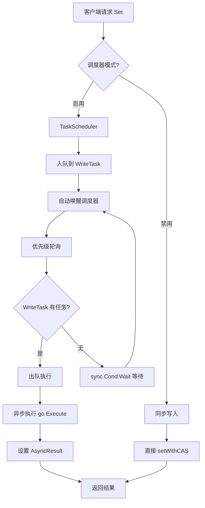

# 【PR全流程文档】Feature - TaskScheduler 多任务调度框架

> **文档说明**：本文档包含「前置规划」和「后置总结」两部分，记录从需求对齐到开发完成的全流程，一个PR对应一份全流程文档，归档后作为项目追溯依据。

---

## 第一部分：前置部分（开工前必完成，架构师评审通过）

### 1. 基础信息（与分支/PR绑定）

| 项目 | 内容 |
|------|------|
| 工作类型 | 新功能开发（Feature） |
| PR编号 | PR-XXX（创建GitHub PR后补充完整） |
| 分支名称 | feature/task-scheduler-framework |
| 工作主题 | TaskScheduler 多任务调度框架设计与实现 |
| 负责人 | jzhang405 |
| 分支创建日期 | 2026-03-14 |
| 计划开工日期 | 待定 |
| 计划CI通过日期 | 待定 |
| 关联需求单号 | BTree 写入性能优化（Phase 2） |
| 架构师评审状态 | □ 待评审 □ 评审中 □ 评审通过 □ 需优化（循环记录） |
| 预审批结果 | □ 未通过 □ 已通过（架构师签字/备注：XXX 202X-XX-XX 同意开工） |

### 2. 背景与目标（为什么干）

#### 2.1 背景

**业务场景**：

BTree 写入性能优化是 NexKV 项目的核心优化方向。当前实现存在严重的并发性能问题：

- **8 并发写入时性能比单线程慢 6.9 倍**
- **CAS 失败率 87.5%，浪费 47.5% CPU 时间**
- 无限重试，无退避策略
- 全局 Root CAS，不同 key 的写操作互相阻塞

**现有问题**：

1. **命名混淆**：当前 `RunLoopWorker` 和设计中的 `RunLoop` 命名容易混淆，无法从名字区分核心差异
2. **缺乏多任务调度**：现有 `RunLoopWorker` 是单队列单 worker 模式，无法支持多类型任务的优先级调度
3. **无优先级支持**：所有任务按 FIFO 顺序处理，无法区分任务优先级
4. **调度模式单一**：只有同步执行模式，无法支持 IO 密集型和混合型任务

**价值**：

实现 TaskScheduler 多任务调度框架后：
- **命名清晰**：`EventLoop`（单队列）vs `TaskScheduler`（多任务调度）
- **性能提升**：预期 8 并发写入性能提升 6.2x
- **可扩展性**：支持动态注册不同类型的 Task，每个 Task 独立队列
- **优先级调度**：支持按优先级调度，高优先级任务优先处理

#### 2.2 核心目标（可量化、可验证）

1. **功能目标**：
   - 实现 `TaskScheduler` 调度器，支持多任务优先级调度
   - 实现 `Task` 接口和 `BaseTask` 基类
   - 支持任务动态注册/注销
   - 支持异步执行结果获取（`AsyncResult`）
   - 重命名现有 `RunLoopWorker` → `EventLoop`

2. **性能目标**：
   - 8 并发写入吞吐量提升至 280%（相对当前 14.5%）
   - CPU 浪费从 47.5% 降至 5%
   - 平均延迟增加控制在 10% 以内

3. **可用性目标**：
   - 支持 panic 自动恢复
   - 支持上下文取消
   - 支持优雅关闭
   - 队列满时返回错误（背压控制）

#### 2.3 明确边界（不做什么，避免范围蔓延）

- **本次不支持**：
  - Per-Page Lock 优化（Phase 3，长期目标）
  - 分布式任务调度
  - 任务依赖关系

- **本次不优化**：
  - 不修改现有 `EventLoop`（原 `RunLoopWorker`）的核心逻辑
  - 不影响现有 API 的兼容性

### 3. 实现方案（怎么干，核心设计）

#### 3.1 整体流程设计



#### 3.2 关键设计点

1. **接口定义**：

**文件**: `internal/infrastructure/concurrency/task_scheduler.go`

```go
// Task 调度器任务接口
type Task interface {
    HasItem() bool                    // 检查是否有待处理任务
    Enqueue(item any) error           // 客户端入队任务
    Dequeue(item *any) bool           // 出队一个任务
    Execute(item any)                 // 执行任务处理逻辑
    SetAsyncResult(res AsyncResult)   // 设置异步结果
    Name() string                      // 任务名称
    Priority() int                     // 优先级
    setScheduler(s *TaskScheduler)     // 内部使用
}

// AsyncResult 异步执行结果
type AsyncResult struct {
    Value     any
    Error     error
    Done      chan struct{}
    Timestamp time.Time
}
```

2. **核心机制**：**优先级调度 + 无空转等待**

```go
// TaskScheduler 核心调度循环
func (s *TaskScheduler) Run() {
    for s.running {
        tasks := s.getSortedTasks()  // 按优先级排序

        processed := false
        for _, task := range tasks {
            if !task.HasItem() { continue }

            var item any
            if !task.Dequeue(&item) { continue }

            // 异步执行（不阻塞循环）
            go s.executeTask(task, item)

            processed = true
        }

        // 所有队列都空，无空转等待
        if !processed {
            s.waitForSignal()  // sync.Cond.Wait()
        }
    }
}
```

3. **数据结构**：

```go
// TaskScheduler 调度器
type TaskScheduler struct {
    name     string
    tasks    []Task
    taskMap  map[string]Task
    mu       sync.RWMutex
    running  bool
    cond     *sync.Cond       // 条件变量（无空转等待）
    wg       sync.WaitGroup
    ctx      context.Context
    cancel   context.CancelFunc
    stats    TaskSchedulerStats
}

// BaseTask 基类
type BaseTask struct {
    name        string
    priority    int
    scheduler   *TaskScheduler
    queue       []any
    mu          sync.Mutex
    cond        *sync.Cond
    ctx         context.Context
    cancel      context.CancelFunc
    asyncResult *AsyncResult
}
```

4. **容错设计**：

- **Panic 恢复**：每个任务执行时带 `defer recover()`
- **上下文取消**：支持 `context.Context` 取消
- **背压控制**：队列满时返回 `ErrQueueFull`
- **优雅关闭**：`Stop()` 方法等待所有任务处理完毕

#### 3.3 命名规范（解决混淆）

| 旧名称 | 新名称 | 文件名 | 职责 |
|--------|--------|--------|------|
| `RunLoopWorker` | `EventLoop` | `event_loop.go` | 单队列单 worker 高性能执行 |
| `RunLoop` | `TaskScheduler` | `task_scheduler.go` | 多任务优先级调度框架 |

**共存策略**：
- `EventLoop`: 适用于简单高性能任务执行（保留现有实现）
- `TaskScheduler`: 适用于复杂多任务调度（新增实现）

### 4. 风险评估与应对措施

| 风险点 | 影响等级（高/中/低） | 应对措施 |
|--------|----------------------|----------|
| 性能不如预期 | 中 | 先实现框架，通过基准测试验证，必要时调整优化策略 |
| 命名混淆问题重现 | 低 | 已明确 `EventLoop` vs `TaskScheduler` 命名，职责清晰 |
| 与现有代码冲突 | 低 | 重命名 `RunLoopWorker` → `EventLoop`，保持 API 兼容 |
| 测试覆盖不足 | 中 | 编写完整单元测试和基准测试，确保 80%+ 覆盖率 |
| 集成复杂度高 | 中 | 分阶段集成，先独立测试再集成到 BTree |

### 5. 架构师评审记录（循环优化，直至通过）

| 评审轮次 | 评审日期 | 评审人（架构师） | 核心评审意见 | 优化措施（含AI辅助修改） | 优化结果 |
|----------|----------|------------------|--------------|--------------------------|----------|
| 第1轮 | 待定 | 待定 | 待评审 | 待优化 | 待完成 |

### 6. 预审批确认
> **架构师签字/备注**：XXX 202X-XX-XX 该Feature方案可行，风险可控，同意启动开发，需严格按照文档落地，确保CI通过后提交Post总结。

---

## 第二部分：流程节点记录（开发/CI过程追溯）

### 1. 开发过程记录

| 节点 | 完成日期 | 具体内容 | 交付物 |
|------|----------|----------|--------|
| 启动开发 | 待定 | 实现调度器和接口 | 代码提交至分支 |
| 本地测试 | 待定 | 单元测试和基准测试 | 测试报告/覆盖率数据 |
| Post文档编写 | 待定 | 编写后置总结文档 | 第三部分：后置部分 |
| 架构师Post批准 | 待定 | 架构师评审Post文档 | 批准签字/备注 |
| 提交GitHub | 待定 | 推送分支，创建PR | GitHub PR链接 |

### 2. CI流程记录（修复Bug直至通过）

| CI轮次 | 触发时间 | 结果 | 问题详情 | 修复措施 | 修复结果 |
|--------|----------|------|----------|----------|----------|
| 第1轮 | 待定 | 失败/成功 | 待测试 | 待修复 | 待处理 |

### 3. 合并记录

| 合并时间 | 合并方式 | 审批人 | 备注 |
|----------|----------|--------|------|
| 待定 | Squash Merge / Merge Commit | 待定 | 待补充 |

---

## 第三部分：后置部分（CI通过后编写，总结/成果/ToDo）

> **说明**：本部分在 CI 通过后填写。

### 1. 核心成果总结（开发了啥，结果怎样）

#### 1.1 功能成果
- **已完成**：待开发
- **与Pre文档差异**：待总结

#### 1.2 性能/数据成果
- **性能数据**：待测试
- **测试成果**：待验证

#### 1.3 代码/文档交付物

| 类型 | 具体内容 | 链接/路径 |
|------|----------|-----------|
| 代码变更 | 待列出 | GitHub PR链接 |
| 文档更新 | 待列出 | 文档路径 |

### 2. 未完成项与ToDo清单（有哪些没干，后续规划）

#### 2.1 本次PR未完成项
- **未支持**：待总结
- **遗留问题**：待记录

#### 2.2 ToDo清单（优先级排序）

| 优先级 | 任务内容 | 预估工期 | 关联PR/需求 | 备注 |
|--------|----------|----------|-------------|------|
| 待定 | 待定 | 待定 | 待定 | 待补充 |

### 3. 下一步工作建议（建议干啥）
1. **优先推进**：待规划
2. **监控要点**：待确定
3. **运维补充**：待补充
4. **后续规划**：待设计
5. **反馈收集**：待实施

---

## 附录：设计文档引用

**详细设计文档**：`thoughts/2026-03-14-task-runloop-framework-design.md`

**核心设计要素**：

1. **Task 接口**：`HasItem()`, `Enqueue()`, `Dequeue()`, `Execute()`, `SetAsyncResult()`
2. **TaskScheduler**：优先级轮询 + `sync.Cond.Wait()` 无空转
3. **BaseTask**：提供通用实现，包含独立队列和上下文支持
4. **性能优化**：对象池、panic 恢复、上下文支持（参考现有 `executor_runloop_worker.go`）

---

## 文档归档信息

| 项目 | 内容 |
|------|------|
| 文档最终版本 | V1.0 (Pre) |
| 归档日期 | 2026-03-14 |
| 归档路径 | `docs/06_PM/feature/2026-03-14_PR-TaskScheduler-multi-task-framework_Pre.md` |
| 后续维护人 | jzhang405 |
