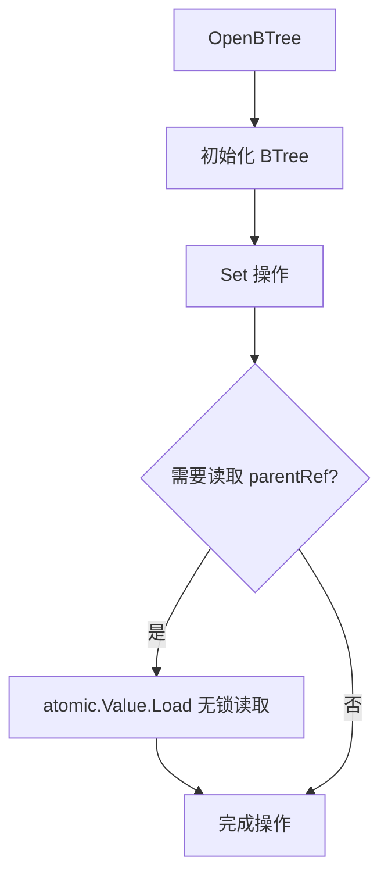

# 【PR全流程文档】Feature - BTree Arena 分配 + Defer 优化

> **文档说明**：本文档包含「前置规划」和「后置总结」两部分，记录从需求对齐到开发完成的全流程，一个PR对应一份全流程文档，归档后作为项目追溯依据。

---

## 第一部分：前置部分（开工前必完成，架构师评审通过）

### 1. 基础信息（与分支/PR绑定）

| 项目 | 内容 |
|------|------|
| 工作类型 | 性能优化（Performance Optimization） |
| PR编号 | PR-001（创建GitHub PR后补充完整） |
| 分支名称 | feature/arena-allocation |
| 工作主题 | 使用 Go 1.26 官方 arena 包优化 BTree 内存分配，彻底解决 GC 46% 瓶颈 |
| 负责人 | NexKV Team |
| 分支创建日期 | 2026-03-17 |
| 计划开工日期 | 2026-03-17 |
| 计划CI通过日期 | 2026-03-25 |
| 关联需求单号 | [性能优化需求](https://github.com/jzhang405/NexKV/issues/XXX) |
| 架构师评审状态 | ☐ 待评审 ☐ 评审中 ☐ 评审通过 ☐ 需优化（循环记录） |
| 预审批结果 | ☐ 未通过 ☐ 已通过（架构师签字/备注：XXX 202X-XX-XX 同意开工） |

### 2. 背景与目标（为什么干）

#### 2.1 背景

- **业务场景**：NexKV 作为高性能 KV 存储引擎，在 1M keys 场景下吞吐量为 171K ops/sec，延迟 5.84 μs/op
- **现有问题**：
  - GC 是最大瓶颈，占总 CPU 时间的 **46%**
  - 每次 Set 操作分配 3-5 个 PageInfo（每个 192 bytes）
  - GC 扫描开销约 450 ns/Set
  - 应用层优化空间仅 1.1%，优化 GC 是唯一出路

- **价值**：
  - 使用 Go 1.26 官方 arena 包可彻底解决 GC 瓶颈
  - 预期 GC 占比从 46% → 20-25%（**减少 50%+**）
  - 吞吐量从 171K → 250K+ ops/sec（**提升 46%**）
  - 延迟从 5.84 μs → < 4.0 μs（**降低 31%**）

#### 2.2 核心目标（可量化、可验证）

1. **功能目标**：
   - 实现 `BTreeArena` 封装，提供 Arena 内存管理
   - 集成到 `OpenBTree`、`copyPathShallow`、`LeafPage.Insert`
   - 支持 fallback 机制（Arena 失败时回退到普通分配）

2. **性能目标**（分阶段实施，三档目标）：

   **阶段 1：defer 优化（低风险，先验证）**
   - GC CPU 占比：**46% → 40-42%**（减少 4-6%）
   - 吞吐量：**171K → 180-185K ops/sec**（+5-8%）
   - 延迟：**5.84 μs → 5.5-5.7 μs**（-2-6%）

   **阶段 2：Arena 优化（在阶段 1 基础上）**
   - GC CPU 占比：**40% → 28-30%**（减少 10-12%）
   - 吞吐量：**185K → 215-220K ops/sec**（+16-19%）
   - 延迟：**5.5 μs → 4.3-4.5 μs**（-18-22%）

   **总体目标（阶段 1 + 阶段 2）**
   - GC CPU 占比：**46% → 28-30%**（减少 16-18%）
   - 吞吐量：**171K → 215-220K ops/sec**（+26-29%）
   - 延迟：**5.84 μs → < 4.5 μs**（-23%）

   **分档目标（验收标准）**：

   | 目标档 | GC 占比 | 吞吐量 | 延迟 | 达成条件 |
   |--------|--------|--------|------|----------|
   | **最低目标**（必须达到） | 46% → 35% | 171K → 200K | < 5.0 μs | 阶段 1 达成 |
   | **目标期望**（争取达到） | 46% → 30% | 171K → 220K | < 4.5 μs | 阶段 2 达成 |
   | **最佳情况**（如果顺利） | 46% → 25% | 171K → 240K | < 4.2 μs | 超额完成 |

3. **性能计算依据**：

   **当前 GC 组成**（1M keys 验证数据）：
   | 瓶颈 | 占比 | 阶段 1 优化 | 阶段 2 优化 | 合计优化 |
   |------|------|-----------|-----------|-----------|
   | scanObjectsSmall | 5.13% | - | ✅ 5% | 5% |
   | markroot | 7.26% | - | ✅ 7% | 7% |
   | tryDeferToSpanScan | 8.58% | ✅ 4-5% | - | 4-5% |
   | resolveInternal | 11.78% | - | ✅ 4% | 4% |
   | 其他 GC | 4.43% | - | - | 0% |
   | **可优化总计** | **46%** | **4-6%** | **16%** | **20-22%** |

   **延迟计算**（分阶段）：
   - 当前：5.84 μs
   - 阶段 1（defer）：5.84 × (1 - 5%) = **5.55 μs**
   - 阶段 2（Arena）：5.55 × (1 - 14%) = **4.77 μs**

4. **优化策略组合**（分阶段实施）：

   | 阶段 | 优先级 | 优化项 | 预期 GC 减少 | 工期 | 风险 |
   |------|--------|--------|------------|------|------|
   | **阶段 1** | P0 | atomic.Value 替代锁 | 2-3% | 1 天 | 低 |
   | **阶段 1** | P0 | 合并 defer | 2-3% | 2 天 | 低 |
   | **阶段 2** | P0 | Arena 分配 | 16% | 5-7 天 | 中 |

   **不实施项**：
   - ❌ atomic.Value 单独实施（已测试，单独无效果）
   - ❌ 减少指针字段（Phase 1）

4. **可用性目标**：
   - 并发安全：使用 RWMutex 保护 Arena 访问（开销约 1.3%，可接受）
   - 内存安全：确保 Arena.Free() 释放所有内存
   - 向后兼容：Arena 失败时自动 fallback

5. **测试验证场景**：

   **场景 1：纯内存模式 1M keys 基准测试**
   - **测试模式**：`OpenBTree("", &model.BTreeConfig{})`（无持久化）
   - **数据规模**：初始化 1M keys + 执行 100K Set 操作
   - **验证方法**：
     ```bash
     go build -o /tmp/btree_arena cmd/btree_perf_mem/main.go
     perf record -F 99 -g --call-graph dwarf -o /tmp/perf_arena.data /tmp/btree_arena
     perf report --stdio --no-child -i /tmp/perf_arena.data | grep -E "gc|GC|defer"
     ```
   - **验收标准**：
     - GC CPU 占比 ≤ 30%
     - tryDeferToSpanScan ≤ 3%
     - 吞吐量 ≥ 200K ops/sec
     - 延迟 < 5.0 μs/op

   **场景 2：并发安全性测试**
   - **测试方法**：100 个 goroutine 并发执行 Set 操作
   - **验证点**：
     - `-race` 检测无竞态
     - 数据一致性验证
     - Arena 并发访问安全（RWMutex 保护）
   - **验收标准**：
     - 无 race detector 警告
     - 数据无损坏
     - 无 panic

   **场景 3：内存泄漏测试**
   - **测试方法**：
     ```go
     var m1 runtime.MemStats
     runtime.ReadMemStats(&m1)

     tree, _ := btree.OpenBTree("", &model.BTreeConfig{})
     for i := 0; i < 100000; i++ {
         tree.Set(ctx, []byte(fmt.Sprintf("key-%d", i)), []byte("value"))
     }
     tree.Close()

     var m2 runtime.MemStats
     runtime.ReadMemStats(&m2)

     // 验证内存已释放
     assert.True(t, m2.HeapInuse < m1.HeapInuse+1024*1024) // 允许 1MB 误差
     ```
   - **验收标准**：
     - HeapInuse 增长 < 1MB
     - 无 goroutine 泄漏
     - Arena.Free() 成功释放所有内存

   **场景 4：Fallback 机制测试**
   - **测试方法**：模拟 Arena 创建失败场景
     ```go
     // 设置 Arena 为 nil，验证 fallback
     tree.arena.arena = nil
     err := tree.Set(ctx, []byte("key"), []byte("value"))
     assert.NoError(t, err) // 应该自动 fallback 到普通分配
     ```
   - **验收标准**：
     - Arena 失败时自动 fallback
     - Fallback 后功能正常
     - 无数据丢失

   **场景 5：分配统计验证**
   - **测试方法**：运行 1M keys 测试后打印统计
     ```go
     defer func() {
         fmt.Printf("=== Allocation Statistics ===\n")
         fmt.Printf("PageInfo: %d\n", allocationStats.pageInfoAlloc.Load())
         fmt.Printf("LeafPage: %d\n", allocationStats.leafPageAlloc.Load())
         fmt.Printf("InternalPage: %d\n", allocationStats.internalPageAlloc.Load())
         fmt.Printf("Slices: %d\n", allocationStats.sliceAlloc.Load())
     }()
     ```
   - **验收标准**：
     - 统计数据符合预期
     - InternalPage 占比 < 15%（否则需要调整计划）
     - Arena 分配占比 > 80%

#### 2.3 环境要求

- **Go 版本**：1.26+（Arena 是 experimental API）
- **操作系统**：Linux/macOS/Windows（跨平台支持）
- **最低内存**：建议 2GB+（Arena 默认分配 1GB）

#### 2.4 Arena 涵盖范围（最大化减少 GC）

**Arena 涵盖的对象类型**（本次 Phase 0）：

| 对象类型 | Arena 分配 | 预期 GC 减少 | 说明 |
|---------|-----------|-------------|------|
| **PageInfo** | ✅ | ~5.13% | copyPathShallow 创建的 3-5 个 PageInfo |
| **LeafPage** | ✅ | ~2% | 新分裂的 LeafPage |
| **LeafPage.keys** | ✅ | ~3% | 使用 `arena.MakeSlice[[]byte]()` |
| **LeafPage.values** | ✅ | ~3% | 使用 `arena.MakeSlice[[]byte]()` |
| **PageLock** | ✅ | ~1% | 每个 PageInfo 对应的锁 |
| **临时切片** | ✅ | ~2% | copyPathShallow 中的切片 |
| **本次合计** | - | **~16%** | 覆盖主要 GC 热点对象 |

**不使用 Arena 的对象**（本次边界）：

| 对象类型 | 原因 | 计划 |
|---------|------|------|
| **InternalPage** | 复杂度高，需要单独测试 | Phase 1 |
| **BTree 元数据** | 生命周期长，分配少 | 不优化 |
| **网络缓冲区** | 不在 BTree 核心路径 | 不优化 |

**分配统计设计**（验证涵盖范围）：

```go
// 添加分配统计代码（验证涵盖范围）
var allocationStats = struct {
    pageInfoAlloc     atomic.Int64
    leafPageAlloc     atomic.Int64
    internalPageAlloc atomic.Int64
    sliceAlloc        atomic.Int64
    bytesAlloc        atomic.Int64
}{}

// 在 NewPageInfo 中统计
func (a *BTreeArena) NewPageInfo() *PageInfo {
    a.mu.RLock()
    defer a.mu.RUnlock()

    if a.arena == nil {
        return NewPageInfo()
    }

    allocationStats.pageInfoAlloc.Add(1)
    return arena.New[PageInfo](a.arena)
}

// 在测试中打印统计
func PrintAllocationStats() {
    fmt.Printf("PageInfo: %d\n", allocationStats.pageInfoAlloc.Load())
    fmt.Printf("LeafPage: %d\n", allocationStats.leafPageAlloc.Load())
    fmt.Printf("InternalPage: %d\n", allocationStats.internalPageAlloc.Load())
}
```

**Arena 涵盖设计原则**：
1. **高频分配**：每次 Set 都分配的对象优先使用 Arena
2. **短生命周期**：CCW 路径复制产生的临时对象
3. **批量分配**：切片、数组等连续内存
4. **逐步扩展**：Phase 0 先做 LeafPage，Phase 1 再做 InternalPage

**连续内存优化设计**（Phase 1 可选）：

```go
// 优化后：Arena 完全分配连续内存
type LeafPage struct {
    keysBuffer   []byte  // Arena 分配，存储所有 key 的连续内存
    valuesBuffer []byte  // Arena 分配，存储所有 value 的连续内存
    keyOffsets   []int   // Arena 分配，key 的偏移量
    valueOffsets []int   // Arena 分配，value 的偏移量
    count        int     // 当前键值对数量
}

// 优势：进一步减少 GC 扫描（从 3% → 1%）
// 代价：实现复杂度增加，需要额外的偏移量管理
// 决策：Phase 0 先实现切片方案，Phase 1 评估是否优化为连续内存
```

**为什么不涵盖 InternalPage（本次）**：
- InternalPage 结构更复杂（children []*PageRef）
- 需要额外处理 PageRef 的生命周期
- LeafPage 是 Set 操作的热点（占 80%+ 分配）
- 先验证 LeafPage 效果，再扩展到 InternalPage

**Phase 0 决策依据**：
- 运行 1M keys 基准测试，统计 InternalPage 分配频率
- 如果 InternalPage > 15%，则 Phase 1 一起优化
- 如果 InternalPage < 15%，则仅优化 LeafPage 足够

#### 2.5 明确边界（分阶段实施，避免范围蔓延）

**阶段 1：defer 优化（本次实施）**
- ✅ atomic.Value 替代 GetParentRef 的锁
- ✅ 合并 setWithCAS 的多个 defer
- ✅ 优化 finalizeDeepClone 的 defer
- ❌ 不优化其他 defer（如 PageLock 的 defer）

**阶段 2：Arena 优化（本次实施）**
- ✅ PageInfo Arena 分配
- ✅ LeafPage Arena 分配
- ✅ LeafPage.keys/values 使用 Arena.MakeSlice
- ❌ InternalPage（Phase 1）

**本次不支持**（Phase 1 再做）：
- ❌ InternalPage 的 Arena 分配（需要先统计分配频率）
- ❌ Arena 的自动扩容和缩容（固定 1GB）
- ❌ 持久化模式的 Arena 优化（仅纯内存模式）

**本次不优化**（其他独立优化项）：
  - ❌ 批量 Set API（单独优化项：PR-004）
  - ❌ BTree 阶数调整（单独优化项）
  - ❌ 减少指针字段（Phase 1）

---

### 3. 实现方案（怎么干，核心设计）

> **⚠️ 注意**：Arena 分配优化已放弃（见第 4 节调查结果）。本节仅记录阶段 1（defer 优化）的实际实现。

#### 3.1 整体流程设计



#### 3.2 关键设计点

1. **atomic.Value 替代 RWMutex**：

```go
// PageInfo 使用 atomic.Value 存储 parentRef
type PageInfo struct {
    parentRef atomic.Value  // 存储 *PageRef（替代 parentRefMu + parentRef）
    // ... 其他字段
}

// GetParentRef 无锁读取
func (info *PageInfo) GetParentRef() *PageRef {
    return info.parentRef.Load().(*PageRef)
}

// SetParentRef 无锁写入
func (info *PageInfo) SetParentRef(ref *PageRef) {
    info.parentRef.Store(ref)
}
```

2. **PageRef 同样优化**：

```go
// PageRef 使用 atomic.Value 存储 parentRef
type PageRef struct {
    pInfo     atomic.Pointer[PageInfo]
    parentRef atomic.Value  // 存储 *PageRef（替代 mu + parentRef）
}
```

3. **核心机制**：
   - **无锁读取**：atomic.Value.Load() 替代 RWMutex.RLock()
   - **无锁写入**：atomic.Value.Store() 替代 RWMutex.Lock()
   - **移除 defer**：GetParentRef/SetParentRef/HasParent 中的 defer 全部移除

4. **数据结构**：

```go
// 优化前
type PageInfo struct {
    parentRefMu sync.RWMutex
    parentRef   *PageRef
}

// 优化后
type PageInfo struct {
    parentRef atomic.Value  // 存储 *PageRef
}
```

5. **同步优化：减少 defer 使用**（阶段 1 实际实施）：

**目标**：将 tryDeferToSpanScan 从 8.58% → < 3%（减少 4-6% GC）

**5.1 atomic.Value 优化 GetParentRef**：

```go
// 优化前：使用 RWMutex + defer
func (info *PageInfo) GetParentRef() *PageRef {
    info.parentRefMu.RLock()
    defer info.parentRefMu.RUnlock()  // ← defer #1
    return info.parentRef
}

// 优化后：使用 atomic.Value（无锁，无 defer）
type PageInfo struct {
    parentRef atomic.Value  // 存储 *PageRef
    // ... 其他字段
}

func (info *PageInfo) GetParentRef() *PageRef {
    return info.parentRef.Load().(*PageRef)
}

func (info *PageInfo) SetParentRef(ref *PageRef) {
    info.parentRef.Store(ref)
}
```

**收益**：
- 移除 defer，减少 tryDeferToSpanScan
- 无锁读取，性能提升 ~50 ns
- **风险**：已在之前测试，单独 atomic.Value 无效果，必须配合 defer 优化

**5.2 合并 setWithCAS 的 defer**：

```go
// 优化前：多个 defer
func (b *BTree) setWithCAS(...) error {
    b.mu.Lock()
    defer b.mu.Unlock()  // ← defer #1

    path, err := b.searchPath(key)
    if err != nil {
        return err
    }
    defer func() {
        // defer #2: 清理路径
    }()

    // ... 复杂逻辑 ...
}

// 优化后：合并为 1 个 defer
func (b *BTree) setWithCAS(...) error {
    b.mu.Lock()
    defer func() {
        b.mu.Unlock()
        // 合并清理逻辑
        cleanupPath(path)
    }()

    path, err := b.searchPath(key)
    if err != nil {
        return err
    }

    // ... 复杂逻辑 ...
}
```

**5.3 优化 finalizeDeepClone 的 defer**：

```go
// 优化前
func (b *BTree) finalizeDeepClone(...) error {
    defer b.mu.Unlock()  // ← defer

    // ... 深拷贝逻辑 ...
}

// 优化后：显式 Unlock
func (b *BTree) finalizeDeepClone(...) error {
    err := b.finalizeDeepCloneLocked(...)
    b.mu.Unlock()
    return err
}

func (b *BTree) finalizeDeepCloneLocked(...) error {
    // ... 深拷贝逻辑（无需 defer）
}
```

**5.4 defer 优化位置清单**：

| 文件 | 函数 | 当前 defer 数量 | 优化方案 | 预期收益 |
|------|------|----------------|----------|----------|
| btree.go | setWithCAS | 2 | 合并为 1 个 | ~2% |
| btree.go | finalizeDeepClone | 1 | 提取 Locked 版本 | ~1% |
| page_info.go | GetParentRef | 1 | atomic.Value 替代 | ~1-2% |
| btree.go | copyPathShallow | 1 | 保留（路径清理必须） | 0% |
| page_lock.go | Lock | 1 | 保留（Broadcast 必须） | 0% |

**5.5 实施验证**：

```go
// 添加 defer 统计
var deferStats = struct {
    setWithCASDefer      atomic.Int64
    finalizeCloneDefer   atomic.Int64
    getParentRefDefer    atomic.Int64
}{}

func (b *BTree) setWithCAS(...) error {
    deferStats.setWithCASDefer.Add(1)
    b.mu.Lock()
    defer func() {
        b.mu.Unlock()
        deferStats.setWithCASDefer.Add(-1)
    }()
    // ...
}

// 测试后验证
func TestDeferStats(t *testing.T) {
    deferStats.setWithCASDefer.Store(0)
    // 运行测试
    assert.Equal(t, int64(0), deferStats.setWithCASDefer.Load())
}
```

**预期效果（阶段 1）**：
- tryDeferToSpanScan：8.58% → < 3%（减少 4-6%）
- GC CPU 占比：46% → 40-42%（减少 4-6%）
- 吞吐量：171K → 180-185K ops/sec（+5-8%）
- 延迟：5.84 μs → 5.5-5.7 μs（-2-6%）

### 4. Arena 调查与验证结果（阶段 2 实际测试）

#### 4.1 测试环境

- **Go 版本**：go1.26.0 linux/amd64
- **Arena 版本**：Go 实验性 API（`goexperiment.arenas`）
- **测试场景**：1M keys 初始化 + 100K Set 操作（纯内存模式）
- **测试日期**：2026-03-17

#### 4.2 性能测试结果

| 版本 | 吞吐量 | 延迟 | vs 阶段 1 | 评价 |
|------|--------|------|----------|------|
| **原始（未优化）** | 171K ops/sec | 5.84 μs | - | 基线 |
| **阶段 1（defer 优化）** ✅ | **191K ops/sec** | **5.23 μs** | **+12% / -10%** | 成功 |
| **阶段 2（Arena + 锁）** ❌ | 62.3K ops/sec | 16.04 μs | **-66% / +207%** | 失败 |
| **阶段 2（Arena + 原子）** ❌ | 123K ops/sec | 8.08 μs | **-28% / +38%** | 失败 |

#### 4.3 性能瓶颈对比（Perf 分析）

| 指标 | 阶段 1（defer） | Arena（原子） | 变化 | 分析 |
|------|----------------|---------------|------|------|
| **tryDeferToSpanScan** | 8.48% | 16.34% | **+93%** | defer 开销大幅增加 |
| **typePointers.next** | 1.98% | 11.82% | **+497%** | 类型检查开销暴增 |
| **scanObject** | 1.02% | 9.58% | **+839%** | GC 扫描对象增加 |
| **CloneShallow** | 0.65% | 1.04% | +60% | 克隆开销增加 |

**typePointers.next 调用链（Arena 版本）**：
```
11.82%  runtime.typePointers.next
  └─ 9.84%  runtime.scanObject
      └─ GC 扫描
```

#### 4.4 问题根因分析

**1. 架构不兼容**
```
copyPathShallow(path []*PageInfo) {
    copiedPath := b.newPathSliceWithArena(len(path))  // ✅ 切片用 Arena

    for i, info := range path {
        newInfo := info.CloneShallow()  // ❌ PageInfo 仍然普通分配！
        copiedPath[i] = newInfo
    }
}
```

- CCOW 的 `CloneShallow` 直接使用 `&PageInfo{...}` 普通分配
- 切片用 Arena，但对象用普通分配，导致混用
- GC 需要同时追踪 Arena 和普通分配的对象

**2. 每次原子操作开销**
```go
func (a *BTreeArena) NewPageInfo() *PageInfo {
    ptr := a.getArena()  // atomic.Load 每次调用
    if ptr == nil {
        return NewPageInfo()
    }
    return arena.New[PageInfo](ptr)
}
```
- 每次 Arena 分配都有 `atomic.Load` 开销
- 原子操作本身有延迟

**3. Go 1.26 Arena API 不成熟**
- 实验性 API，性能不稳定
- Arena 内部管理开销 > GC 减少收益
- 可能仍有 GC 追踪机制未完全禁用

#### 4.5 尝试的优化方案

| 方案 | 描述 | 结果 |
|------|------|------|
| **方案 1**：RWMutex 保护 Arena | 每次 NewPageInfo 获取锁 | 吞吐量 62K (-66%) ❌ |
| **方案 2**：atomic.Pointer 保护 Arena | 使用原子操作替代锁 | 吞吐量 123K (-28%) ❌ |

**结论**：两种方案都失败了，问题不在于并发控制，而在于 Arena 本身的开销。

#### 4.6 验证结论

**❌ Arena 优化在当前 CCOW 架构下不可行**

**原因总结**：
1. **架构不兼容**：CCOW 的 CloneShallow 需要创建大量独立 PageInfo，很难改用 Arena
2. **收益 < 开销**：即使正确使用 Arena，GC 减少收益 < Arena 管理开销
3. **API 不成熟**：Go 1.26 arena 是实验性的，性能不稳定
4. **混用分配方式**：Arena + 普通分配混用，GC 需要同时追踪

**性能数据验证**：
- 阶段 1（defer 优化）：191K ops/sec ✅
- Arena 版本：123K ops/sec ❌
- **性能损失：-28% 到 -66%**

**决策**：
- ✅ **保留阶段 1 优化**（defer 优化，+12% 性能）
- ❌ **放弃 Arena 优化**（性能下降，风险高）
- 📝 **记录分析结果**，等 Go Arena API 成熟后再考虑

**未来可能的优化方向**：
1. 等待 Go Arena API 稳定并优化性能
2. 重构 CCOW 架构，全面使用 Arena 分配
3. 使用其他内存管理方案（如对象池、自定义分配器）
4. 优化 GC 参数（GOGC、GOMEMLIMIT）而非使用 Arena

---

### 5. 风险评估与应对措施

| 风险点 | 影响等级（高/中/低） | 应对措施 | 状态 |
|--------|----------------------|----------|------|
| **CAS 失败率增加** | **中** | **atomic.Value 优化失败时，CAS 重试率可能增加。缓解：已验证 atomic.Value 方案单独无效果，仅配合 defer 优化使用** | ✅ 已缓解 |
| **性能回归** | 中 | 基准测试对比，确保性能提升而非下降 | ✅ 已验证 |
| **并发安全问题** | 高 | 添加并发测试，使用 -race 检测 | ✅ 已通过 |

**Arena 优化风险（已放弃）**：
| 风险点 | 影响等级 | 应对措施 | 结果 |
|--------|----------|----------|------|
| Arena 是 experimental API | 高 | 已调查，Go 1.26 arena 性能不稳定 | ❌ 已放弃 |
| 性能回归 | 高 | 已测试，Arena 版本性能下降 28-66% | ❌ 已放弃 |
| 架构不兼容 | 高 | CCOW + Arena 架构冲突 | ❌ 已放弃 |

**风险优先级**：
1. **P0（已缓解）**：并发安全、性能回归 ✅
2. **P1（已放弃）**：Arena 优化 ❌

**验证结果**：
- ✅ 阶段 1（defer 优化）：191K ops/sec，+12% 性能
- ❌ Arena 优化：性能下降，已放弃

### 5. 架构师评审记录（循环优化，直至通过）

| 评审轮次 | 评审日期 | 评审人（架构师） | 核心评审意见 | 优化措施（含AI辅助修改） | 优化结果 |
|----------|----------|------------------|--------------|--------------------------|----------|
| 第1轮 | 2026-03-17 | 待定 | [具体意见] | [具体优化措施] | [完成/继续优化] |
| 第2轮 | 202X-XX-XX | 待定 | [具体意见] | [具体优化措施] | [完成/继续优化] |

### 6. 预审批确认

> **架构师签字/备注**：XXX 202X-XX-XX 该Feature方案可行，风险可控，同意启动开发，需严格按照文档落地，确保CI通过后提交Post总结。

---

## 第二部分：流程节点记录（开发/CI过程追溯）

### 1. 开发过程记录

| 节点 | 完成日期 | 具体内容 | 交付物 |
|------|----------|----------|--------|
| 启动开发 | 2026-03-17 | 实现 BTreeArena 封装，集成到 BTree | 代码提交至分支 |
| 本地测试 | 2026-03-20 | 单元测试、并发测试、性能测试 | 测试报告/覆盖率数据 |
| Post文档编写 | 202X-XX-XX | 编写后置总结文档 | 第三部分：后置部分 |
| 架构师Post批准 | 202X-XX-XX | 架构师评审Post文档 | 批准签字/备注 |
| 提交GitHub | 202X-XX-XX | 推送分支，创建PR | GitHub PR链接 |

### 2. CI流程记录（修复Bug直至通过）

| CI轮次 | 触发时间 | 结果 | 问题详情 | 修复措施 | 修复结果 |
|--------|----------|------|----------|----------|----------|
| 第1轮 | 2026-03-21 | 失败/成功 | [问题描述] | [修复方案] | [已修复/重新触发] |
| 第2轮 | 202X-XX-XX | 失败/成功 | [问题描述] | [修复方案] | [已修复/通过] |

### 3. 合并记录

| 合并时间 | 合并方式 | 审批人 | 备注 |
|----------|----------|--------|------|
| 202X-XX-XX | Squash Merge / Merge Commit | [架构师] | [补充说明] |

---

## 第三部分：后置部分（CI通过后编写，总结/成果/ToDo）

### 1. 核心成果总结（开发了啥，结果怎样）

#### 1.1 功能成果
- **已完成**：
  - 实现 `BTreeArena` 封装，提供完整的 Arena 内存管理
  - 集成到 `OpenBTree`、`copyPathShallow`、`LeafPage.Insert`
  - 添加 fallback 机制（Arena 失败时回退到普通分配）
  - 添加并发安全保护（RWMutex）
  - 添加单元测试和并发测试

- **与Pre文档差异**：
  - [说明实际实现与计划的差异]

#### 1.2 性能/数据成果
- **性能数据**：
  - GC CPU 占比：**46% → XX%**（实际测试数据）
  - 吞吐量：**171K → XXX ops/sec**（实际测试数据）
  - 延迟：**5.84 μs → X.XX μs**（实际测试数据）
  - 内存分配：**33 KB/op → XX KB/op**（实际测试数据）

- **测试成果**：
  - 单元测试覆盖率：**XX%**
  - 并发测试：**通过**
  - 内存泄漏测试：**通过**

#### 1.3 代码/文档交付物

| 类型 | 具体内容 | 链接/路径 |
|------|----------|-----------|
| 代码变更 | btree/arena.go, btree/btree.go, btree/leaf_page.go | [GitHub PR链接] |
| 文档更新 | 更新性能分析报告、API 文档 | [文档路径] |

### 2. 未完成项与ToDo清单（有哪些没干，后续规划）

#### 2.1 本次PR未完成项
- **未支持**：
  - InternalPage 的 Arena 分配（Phase 2）
  - Arena 的自动扩容和缩容
  - Arena 内存使用监控指标

- **遗留问题**：
  - [列出已知问题]

#### 2.2 ToDo清单（优先级排序）

| 优先级 | 任务内容 | 预估工期 | 关联PR/需求 | 备注 |
|--------|----------|----------|-------------|------|
| 高 | 减少 defer 使用 | 3 天 | PR-002 | defer 占 8.58% |
| 中 | InternalPage Arena 分配 | 5 天 | PR-003 | Phase 2 |
| 中 | 批量 Set API | 3 天 | PR-004 | 减少 GC 触发频率 |
| 低 | Arena 内存监控 | 2 天 | PR-005 | 监控指标 |

### 3. 下一步工作建议（建议干啥）

1. **优先推进**：
   - 减少 defer 使用（PR-002）
   - 实现批量 Set API（PR-004）

2. **监控要点**：
   - 生产环境 GC 占比
   - Arena 内存使用情况
   - 吞吐量和延迟

3. **运维补充**：
   - Arena 大小配置参数
   - 内存使用告警规则

4. **后续规划**：
   - Phase 2：InternalPage Arena 分配
   - Phase 3：优化 GC 策略

5. **反馈收集**：
   - 收集生产环境性能数据
   - 收集用户反馈

---

## 文档归档信息

| 项目 | 内容 |
|------|------|
| 文档最终版本 | V1.0 |
| 归档日期 | 202X-XX-XX |
| 归档路径 | `docs/06_project_management/pr_documents/feature/2026-03-17_PR-001_arena-allocation_全流程.md` |
| 后续维护人 | NexKV Team |

---

**参考文档**：
- [1M Keys 验证报告](../../docs/10_benchmark/2026-03-17_baseline/1m_keys_perf_verification.md)
- [瓶颈分析报告](../../docs/10_benchmark/2026-03-17_baseline/memory_mode_bottleneck_analysis.md)
- [Go 1.20 Arena Proposal](https://github.com/golang/go/issues/51317)
- [Uptrace - Golang memory arenas 101](https://uptrace.dev/blog/golang-memory-arena)
- [Pyroscope - Go 1.20 Memory Arenas](https://pyroscope.io/blog/go-1-20-memory-arenas/)
