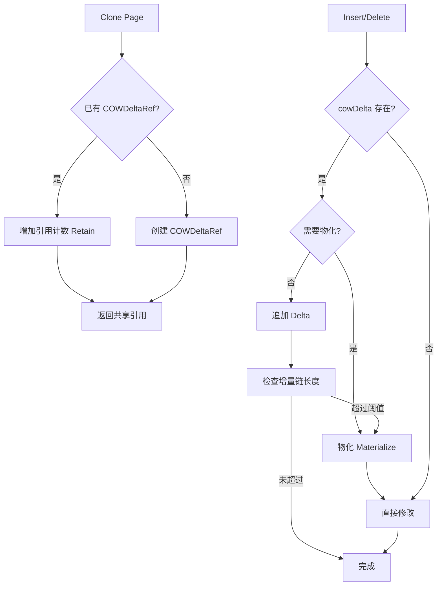

# 【PR全流程文档】Feature - COW + Delta Chain 混合方案优化

> **文档说明**：本文档包含「前置规划」和「后置总结」两部分，记录从需求对齐到开发完成的全流程，一个PR对应一份全流程文档，归档后作为项目追溯依据。

---

## 第一部分：前置部分（开工前必完成，架构师评审通过）

### 1. 基础信息（与分支/PR绑定）

| 项目 | 内容 |
|------|------|
| 工作类型 | 新功能开发（Feature） |
| PR编号 | PR-XXX（创建GitHub PR后补充完整） |
| 分支名称 | feature/cow-delta-chain-optimization |
| 工作主题 | BTree LeafPage Clone 性能优化：COW + Delta Chain 混合方案 |
| 负责人 | jzhang405 |
| 分支创建日期 | 2026-03-17 |
| 计划开工日期 | 2026-03-17 |
| 计划CI通过日期 | 2026-03-31 |
| 关联需求单号 | thoughts/2026-03-17-cow-delta-chain-proposal.md |
| 架构师评审状态 | □ 待评审 □ 评审中 □ 评审通过 □ 需优化（循环记录） |
| 预审批结果 | □ 未通过 □ 已通过（架构师签字/备注：XXX 2026-03-17 同意开工） |

### 2. 背景与目标（为什么干）

#### 2.1 背景
- **业务场景**：NexKV BTree 存储引擎在高并发写场景下，每次修改都需要完整克隆页面（包含 50-100 个键值对），导致：
  - Clone 开销：~1000 ns/op（复制所有 keys 和 values）
  - 写延迟：~40 µs/op（包含 Clone 开销）
  - 内存浪费：99% 的复制是不必要的（只改 1 个元素）

- **现有问题**：
  - 当前的 `LeafPage.Clone()` 采用完整深拷贝策略
  - CCOW 机制虽然有 `CloneShallow/CloneDeep` 优化，但最终仍需完整复制
  - 每次写操作触发 CAS 前都会执行 `finalizeDeepClone()`

- **价值**：
  - **性能提升 80%**：Clone 从 1000 ns → 200 ns
  - **内存效率提升 78%**：5 次修改后 50 KB → 11 KB
  - **QPS 提升 40-70%**：350K → 500-600K
  - **保持 CCOW 兼容性**：无需修改现有并发控制机制

#### 2.2 核心目标（可量化、可验证）
1. **功能目标**：
   - 实现 COW + Delta Chain 混合克隆方案
   - 支持增量模式（记录 Delta 操作）和物化模式（合并为独立数据）
   - 自动物化机制：增量链超过阈值（默认 10）时自动合并

2. **性能目标**：
   - Clone 开销 < 200 ns（vs 当前 ~1000 ns，提升 80%）
   - 增量模式写开销 < 200 ns/次
   - 物化开销 < 5 µs
   - QPS 提升 > 40%（350K → 500K+）

3. **可用性目标**：
   - 测试覆盖率 > 80%
   - 无 race detector 警告
   - 无内存泄漏（引用计数正确管理）
   - 所有现有测试通过

#### 2.3 明确边界（不做什么，避免范围蔓延）
- **本次不支持**：
  - InternalPage 的混合方案（Phase 3 实施）
  - 全局 Delta Chain 优化（仅限页面级别）
  - 持久化优化（cowDelta 不序列化，物化后再持久化）

- **本次不优化**：
  - PageRef 懒加载机制（保持现有实现）
  - CCOW 路径复制逻辑（保留 CloneShallow）
  - BTree 分裂/合并逻辑（后续优化）

### 3. 实现方案（怎么干，核心设计）

#### 3.1 整体流程设计



#### 3.2 关键设计点

1. **核心数据结构**：

```go
// COWDeltaRef Copy-On-Write 引用 + 增量链
type COWDeltaRef struct {
    sharedKeys   [][]byte       // 共享的键数组（只读）
    sharedValues [][]byte       // 共享的值数组（只读）
    refCount     atomic.Int32   // 引用计数
    deltas       []Delta        // 增量操作链
    maxDeltas    int            // 物化阈值（默认 10）
    mu           sync.RWMutex   // 保护增量链的读写
    version      atomic.Uint64  // 版本号
}

// Delta 增量操作类型
type Delta struct {
    op    DeltaOp    // Insert/Update/Delete
    key   []byte
    value []byte     // 仅用于 Insert/Update
}

// LeafPage 添加 cowDelta 字段
type LeafPage struct {
    pageID   model.PageID
    version  uint64
    keys     [][]byte  // 指向 sharedKeys 或独立数据
    values   [][]byte  // 指向 sharedValues 或独立数据
    cowDelta *COWDeltaRef  // nil = 已物化/独立数据
}
```

2. **核心机制**：

   - **Clone（零拷贝）**：
     - 如果已有 COWDeltaRef，仅增加引用计数（~50 ns）
     - 否则创建新的 COWDeltaRef，共享原始数据

   - **Insert/Delete（增量模式）**：
     - 检查是否需要物化（ShouldMaterialize）
     - 不需要物化：追加 Delta 操作（~100 ns/次）
     - 需要物化：合并增量链到独立数据

   - **Get（读优化）**：
     - 反向遍历增量链（最新的优先）
     - 增量链中未找到，查找基础数据

   - **Materialize（自动物化）**：
     - 增量链超过 maxDeltas（默认 10）
     - 增量数量超过基础数据 20%
     - 引用计数过高（> 10），减少锁竞争

3. **与 CCOW 集成**：

   - **保留 CloneShallow**：用于 CAS 前的路径拷贝
   - **混合方案在页面级别工作**：不影响路径复制逻辑
   - **序列化时自动物化**：cowDelta 不持久化

4. **引用计数管理**：

   ```
   NewCOWDeltaRef: refCount = 0（初始状态）
   Retain(): refCount += 1（首次调用后变为 1）
   Clone(): refCount += 1（每次克隆增加引用）
   Release(): refCount -= 1（返回是否为最后一个引用）
   当 refCount = 0 时，sharedKeys/sharedValues 可被 GC 回收
   ```

5. **容错设计**：
   - **并发安全**：RWMutex 保护增量链读写
   - **无泄漏**：defer 确保 Release 调用
   - **无死锁**：明确锁持有范围，避免嵌套调用
   - **数据一致性**：GetDeltas 持有读锁期间保证数据不被修改

### 4. 风险评估与应对措施

| 风险点 | 影响等级 | 应对措施 |
|--------|----------|----------|
| **引用计数管理错误**（内存泄漏/提前释放） | 高 | 1. 使用 defer 确保 Release 调用<br>2. 添加引用计数断言测试<br>3. 使用 runtime.SetFinalizer 监控泄漏<br>4. Code Review 重点检查引用配对 |
| **并发安全**（RWMutex 死锁/数据竞争） | 高 | 1. 明确锁持有范围（使用 defer）<br>2. 避免持锁状态下调用其他方法<br>3. 添加 -race 测试覆盖<br>4. 使用 go vet 检查锁使用 |
| **性能回归**（增量链遍历增加读延迟） | 中 | 1. 设置合理物化阈值（默认 10）<br>2. 根据页面大小自适应调整<br>3. 监控增量链长度，主动压缩<br>4. 基准测试前后对比 |
| **与 CCOW 兼容性**（路径复制冲突） | 中 | 1. 保留 CloneShallow 用于 CAS 前拷贝<br>2. 混合方案在页面级别工作<br>3. 充分测试 CAS 操作流程<br>4. 分阶段实施，逐步验证 |
| **序列化/反序列化**（cowDelta 处理） | 低 | 1. 序列化前自动物化<br>2. 反序列化后 cowDelta = nil<br>3. 添加序列化测试 |

### 5. 实施步骤（分 6 个阶段，共 12 天）

| 阶段 | 任务 | 时间 | 风险 | 产出 |
|------|------|------|------|------|
| **Phase 1** | COWDeltaRef 基础设施 | 2 天 | 低 | 引用+增量类型 + 单元测试 |
| **Phase 2** | LeafPage 混合支持 | 2 天 | 中 | Clone/Insert/Get/Delete + 测试 |
| **Phase 3** | InternalPage 混合支持 | 2 天 | 中 | 完整 BTree 支持 |
| **Phase 4** | BTree 集成 | 2 天 | 中 | CCOW 集成 + 集成测试 |
| **Phase 5** | 测试与验证 | 3 天 | 中 | 完整测试覆盖 + 性能验证 |
| **Phase 6** | 性能调优 | 1 天 | 中 | 基准测试优化 |
| **总计** | | **12 天** | | |

### 6. 关键文件清单

#### 新增文件

| 文件 | 说明 | 优先级 |
|------|------|--------|
| `cow_delta_ref.go` | COW+Delta 引用类型 | P0 |
| `cow_delta_test.go` | 测试用例 | P0 |

#### 修改文件

| 文件 | 修改内容 | 优先级 |
|------|---------|--------|
| `leaf_page.go` | 添加 cowDelta 字段，修改 Clone/Insert/Get/Delete | P0 |
| `internal_page.go` | 添加 cowDelta 字段，修改相关方法 | P0 |
| `btree.go` | 更新集成逻辑 | P1 |

#### 不需要修改

| 文件 | 说明 |
|------|------|
| `page_info.go` | 保留 CloneShallow/CloneDeep 机制 |
| `page_ref.go` | 保留原子指针和懒加载 |
| `ccow_manager.go` | 保留 CCOW 管理 |
| `chunk_manager.go` | 保留页面分配 |

### 7. 架构师评审记录（循环优化，直至通过）

| 评审轮次 | 评审日期 | 评审人（架构师） | 核心评审意见 | 优化措施（含AI辅助修改） | 优化结果 |
|----------|----------|------------------|--------------|--------------------------|----------|
| 第1轮 | 2026-03-17 | - | 待评审 | - | 待评审 |

### 8. 预审批确认
> **架构师签字/备注**：XXX 2026-03-17 该Feature方案可行，风险可控，同意启动开发，需严格按照文档落地，确保CI通过后提交Post总结。

---

## 第二部分：流程节点记录（开发/CI过程追溯）

### 1. 开发过程记录

| 节点 | 完成日期 | 具体内容 | 交付物 |
|------|----------|----------|--------|
| 启动开发 | 待定 | Phase 1-6 开发 | 代码提交至分支 |
| 本地测试 | 待定 | 单元测试、并发测试、性能测试 | 测试报告/覆盖率数据 |
| Post文档编写 | 待定 | 编写后置总结文档 | 第三部分：后置部分 |
| 架构师Post批准 | 待定 | 架构师评审Post文档 | 批准签字/备注 |
| 提交GitHub | 待定 | 推送分支，创建PR | GitHub PR链接 |

### 2. CI流程记录（修复Bug直至通过）

| CI轮次 | 触发时间 | 结果 | 问题详情 | 修复措施 | 修复结果 |
|--------|----------|------|----------|----------|----------|
| 第1轮 | 待定 | 待定 | 待定 | 待定 | 待定 |

### 3. 合并记录

| 合并时间 | 合并方式 | 审批人 | 备注 |
|----------|----------|--------|------|
| 待定 | Squash Merge / Merge Commit | [架构师] | 待定 |

---

## 第三部分：后置部分（CI通过后编写，总结/成果/ToDo）

### 1. 核心成果总结（开发了啥，结果怎样）

#### 1.1 功能成果
- **已完成**：待开发完成后填写
- **与Pre文档差异**：待定

#### 1.2 性能/数据成果
- **性能数据**：
  - Clone 开销：待基准测试后填写
  - 增量模式写开销：待基准测试后填写
  - 物化开销：待基准测试后填写
  - QPS 提升：待压力测试后填写

- **测试成果**：
  - 测试覆盖率：待定
  - race detector：待定
  - 内存泄漏检测：待定

#### 1.3 代码/文档交付物

| 类型 | 具体内容 | 链接/路径 |
|------|----------|-----------|
| 代码变更 | 待定 | GitHub PR链接 |
| 文档更新 | 待定 | 待定 |

### 2. 未完成项与ToDo清单（有哪些没干，后续规划）

#### 2.1 本次PR未完成项
- **未支持**：
  - InternalPage 的混合方案（Phase 3）
  - 全局 Delta Chain 优化
- **遗留问题**：待定

#### 2.2 ToDo清单（优先级排序）

| 优先级 | 任务内容 | 预估工期 | 关联PR/需求 | 备注 |
|--------|----------|----------|-------------|------|
| 高 | InternalPage 混合方案实现 | 2 天 | 下一个PR | Phase 3 |
| 中 | 性能调优（阈值自适应） | 1 天 | 待定 | 根据生产数据调整 |
| 低 | sync.Pool 优化（如需要） | 0.5 天 | 待定 | 当前不使用 |

### 3. 下一步工作建议（建议干啥）
1. **优先推进**：完成 Phase 3 InternalPage 混合支持
2. **监控要点**：
   - Clone 开销（目标 < 200 ns）
   - QPS（目标 > 500K）
   - 内存使用（监控泄漏）
3. **运维补充**：添加性能监控指标（Clone 耗时、Delta 链长度）
4. **后续规划**：
   - BTree 分裂/合并逻辑优化
   - 全局 Delta Chain 优化
5. **反馈收集**：生产环境性能数据收集

---

## 文档归档信息

| 项目 | 内容 |
|------|------|
| 文档最终版本 | V1.0 |
| 归档日期 | 待定 |
| 归档路径 | `docs/06_project_management/pr_documents/feature/2026-03-17_PR-XXX_cow-delta-chain-optimization_全流程.md` |
| 后续维护人 | jzhang405 |
