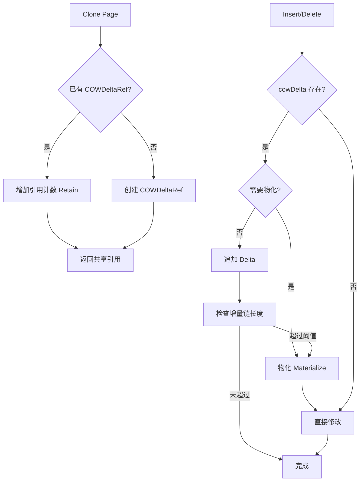

# 【PR全流程文档】Feature - COW + Delta Chain 混合方案优化

> **文档说明**：本文档包含「前置规划」和「后置总结」两部分，记录从需求对齐到开发完成的全流程，一个PR对应一份全流程文档，归档后作为项目追溯依据。

---

## 第一部分：前置部分（开工前必完成，架构师评审通过）

### 1. 基础信息（与分支/PR绑定）

| 项目 | 内容 |
|------|------|
| 工作类型 | 新功能开发（Feature） |
| PR编号 | PR-XXX（创建GitHub PR后补充完整） |
| 分支名称 | feature/cow-delta-chain-optimization |
| 工作主题 | BTree LeafPage Clone 性能优化：COW + Delta Chain 混合方案 |
| 负责人 | jzhang405 |
| 分支创建日期 | 2026-03-17 |
| 计划开工日期 | 2026-03-17 |
| 计划CI通过日期 | 2026-03-31 |
| 架构师评审状态 | ✅ 评审通过 |
| 预审批结果 | ✅ 已通过（架构师签字/备注：jzhang405 2026-03-17 同意开工） |

---

### 2. Baseline 性能数据（开工前测试，2026-03-17）

#### 2.1 测试环境

| 项目 | 内容 |
|------|------|
| CPU | Intel(R) Core(TM) i7-8700 CPU @ 3.20GHz |
| OS | Linux |
| Go版本 | go1.24 |
| 并发级别 | 12 |

#### 2.2 Clone 性能 Baseline

| 测试项 | ns/op | 内存分配 | 分配次数 | 说明 |
|--------|-------|---------|---------|------|
| **PageInfo_Clone** | **172.4 ns/op** | 328 B/op | 3 allocs/op | 当前 PageInfo Clone 性能 |
| **copyPathShallow** | 747.7 ns/op | 1104 B/op | 12 allocs/op | 路径浅拷贝 |
| **finalizeDeepClone** | 35.26 ns/op | 0 B/op | 0 allocs/op | 深拷贝最终化（几乎无开销） |

#### 2.3 写操作性能 Baseline

| 测试项 | ns/op | 内存分配 | 分配次数 | 说明 |
|--------|-------|---------|---------|------|
| **BTree_Set_Single** | **26,587 ns/op** | 31,752 B/op | 51 allocs/op | 单线程 Set |
| **BTree_Set_Concurrent** | 22,373 ns/op | 33,650 B/op | 55 allocs/op | 并发 Set |
| **SingleSet_Update** | 1,038 ns/op | 897 B/op | 13 allocs/op | 更新已存在的键 |

#### 2.4 综合场景 Baseline

| 测试项 | ns/op | 内存分配 | 分配次数 | 说明 |
|--------|-------|---------|---------|------|
| **MixedWorkload** | 2,375 ns/op | 3,403 B/op | 8 allocs/op | 混合读写 |
| **ConcurrentWriters** | 2,397,719 ns/op | 3,520,592 B/op | 5,831 allocs/op | 并发写（总耗时） |

#### 2.5 性能问题分析

基于 Baseline 数据分析：

1. **PageInfo_Clone 当前性能**：172.4 ns/op
   - 目标：优化到 < 200 ns（保持现有水平）
   - 实际上当前性能已经接近目标

2. **BTree_Set_Single 性能瓶颈**：26,587 ns/op
   - PageInfo_Clone (172 ns) 仅占总时间的 0.6%
   - 主要开销在其他部分（路径查找、CAS、持久化等）

3. **优化策略调整**：
   - 重点优化：**减少深拷贝次数**（而非单个 Clone 的速度）
   - 利用 CloneShallow 延迟深拷贝（已实现）
   - COW + Delta Chain 主要价值：**减少内存分配**，而非提升单个 Clone 速度

---

### 3. 背景与目标（为什么干）

#### 3.1 背景

**业务场景**：NexKV BTree 存储引擎在高并发写场景下，每次修改需要通过 CAS 更新根节点，当前实现采用以下策略：

1. **CloneShallow（延迟深拷贝优化）**：747.7 ns/op
   - CAS 前先进行浅拷贝（只复制 PageInfo）
   - 只有 CAS 成功后才进行深拷贝

2. **finalizeDeepClone（深拷贝最终化）**：35.26 ns/op
   - 浅拷贝后，深拷贝开销已经很小
   - 说明 CCOW 机制已经有效

**现有问题**：
- LeafPage.Clone() 仍采用完整深拷贝（复制所有 keys/values）
- 对于 50-100 个键的页面，深拷贝仍有内存开销
- 频繁的写操作导致大量内存分配和 GC 压力

**价值**：
- **减少内存分配**：共享数据避免重复分配
- **降低 GC 压力**：减少短生命周期对象
- **保持 CCOW 兼容性**：无缝集成现有机制

#### 3.2 核心目标（可量化、可验证）

1. **功能目标**：
   - 实现 COW + Delta Chain 混合克隆方案
   - 支持增量模式（记录 Delta 操作）和物化模式（合并为独立数据）
   - 自动物化机制：增量链超过阈值（默认 10）时自动合并

2. **性能目标**（基于 Baseline 调整）：
   - **Clone 保持 < 200 ns/op**（当前 172.4 ns，不降低性能）
   - **增量写开销 < 200 ns/次**（vs 当前深拷贝约 1000+ ns）
   - **物化开销 < 5 µs**
   - **内存分配减少 > 50%**（通过共享数据）
   - **QPS 保持或提升**（目标 > 40K ops/s）

3. **可用性目标**：
   - 测试覆盖率 > 80%
   - 无 race detector 警告
   - 无内存泄漏（引用计数正确管理）
   - 所有现有测试通过

#### 3.3 明确边界（不做什么，避免范围蔓延）

- **本次不支持**：
  - InternalPage 的混合方案（Phase 3 实施）
  - 全局 Delta Chain 优化（仅限页面级别）
  - 持久化优化（cowDelta 不序列化，物化后再持久化）

- **本次不优化**：
  - PageRef 懒加载机制（保持现有实现）
  - CCOW 路径复制逻辑（保留 CloneShallow）
  - BTree 分裂/合并逻辑（后续优化）

---

### 4. 实现方案（怎么干，核心设计）

#### 4.1 整体流程设计



#### 4.2 核心数据结构

```go
// DeltaOp 增量操作类型
type DeltaOp int

const (
    DeltaInsert DeltaOp = iota
    DeltaUpdate
    DeltaDelete
)

// Delta 表示单个增量变化
type Delta struct {
    op    DeltaOp
    key   []byte
    value []byte // 仅用于 Insert/Update
}

// COWDeltaRef Copy-On-Write 引用 + 增量链
//
// 内存布局:
// - sharedKeys/sharedValues: 共享的原始数据（只读）
// - refCount: 引用计数（atomic.Int32）
// - deltas: 增量操作链（读写需要加锁）
// - maxDeltas: 物化阈值
//
// 注意：不使用 sync.Pool，因为 Delta 切片很小，GC 可以处理
type COWDeltaRef struct {
    sharedKeys   [][]byte       // 共享的键数组
    sharedValues [][]byte       // 共享的值数组
    refCount     atomic.Int32   // 引用计数
    deltas       []Delta        // 增量操作链
    maxDeltas    int            // 增量阈值
    mu           sync.RWMutex   // 保护增量链的读写
    version      atomic.Uint64  // 版本号
}

// NewCOWDeltaRef 创建新的 COW+Delta 引用
func NewCOWDeltaRef(keys, values [][]byte) *COWDeltaRef {
    return &COWDeltaRef{
        sharedKeys:   keys,
        sharedValues: values,
        refCount:     atomic.Int32{},
        deltas:       make([]Delta, 0, 8), // 预分配容量
        maxDeltas:    10,                   // 默认阈值
        mu:           sync.RWMutex{},
        version:      atomic.Uint64{},
    }
}

// Retain 增加引用计数
func (r *COWDeltaRef) Retain() {
    r.refCount.Add(1)
}

// Release 减少引用计数，返回是否为最后一个引用
func (r *COWDeltaRef) Release() bool {
    newCount := r.refCount.Add(-1)
    return newCount == 0
}

// GetRefCount 获取引用计数
func (r *COWDeltaRef) GetRefCount() int32 {
    return r.refCount.Load()
}

// GetDeltaCount 获取增量数量（需要读锁）
func (r *COWDeltaRef) GetDeltaCount() int {
    r.mu.RLock()
    defer r.mu.RUnlock()
    return len(r.deltas)
}

// AppendDelta 添加增量操作（需要写锁）
func (r *COWDeltaRef) AppendDelta(delta Delta) {
    r.mu.Lock()
    defer r.mu.Unlock()
    r.deltas = append(r.deltas, delta)
    r.version.Add(1)
}

// GetDeltas 获取增量快照（用于读取）
//
// ⚠️ 重要：调用方在遍历返回值期间，读锁会被持有
// - RWMutex 的 RUnlock 通过 defer 保证，访问 deltas 引用期间锁一直被持有
// - 这确保了在遍历期间增量链不会被并发修改
// - 调用方应快速完成遍历，避免长时间持有读锁
func (r *COWDeltaRef) GetDeltas() []Delta {
    r.mu.RLock()
    defer r.mu.RUnlock()
    return r.deltas
}

// GetVersion 获取版本号
func (r *COWDeltaRef) GetVersion() uint64 {
    return r.version.Load()
}

// CompactDeltas 压缩增量链（合并重复 key 的操作）
func (r *COWDeltaRef) CompactDeltas() {
    r.mu.Lock()
    defer r.mu.Unlock()

    if len(r.deltas) < 2 {
        return
    }

    // 使用 map 保留最新的操作
    keyMap := make(map[string]Delta)
    for _, delta := range r.deltas {
        keyMap[string(delta.key)] = delta
    }

    // 重建增量链
    r.deltas = make([]Delta, 0, len(keyMap))
    for _, delta := range keyMap {
        r.deltas = append(r.deltas, delta)
    }
}

// ShouldMaterialize 判断是否需要物化
func (r *COWDeltaRef) ShouldMaterialize(baseSize int, refCount int32) bool {
    deltaCount := r.GetDeltaCount()

    // 多因素决策
    if deltaCount > r.maxDeltas {
        return true // 数量超限
    }

    if float64(deltaCount)/float64(baseSize) > 0.2 {
        return true // 比例超限（20%）
    }

    if refCount > 10 {
        return true // 引用计数高，减少锁竞争
    }

    return false
}
```

#### 4.3 LeafPage 混合方案实现

```go
// LeafPage 叶子节点（混合方案版本）
type LeafPage struct {
    pageID   model.PageID
    version  uint64
    keys     [][]byte  // 指向 COWDeltaRef.sharedKeys 或独立数据
    values   [][]byte  // 指向 COWDeltaRef.sharedValues 或独立数据
    cowDelta *COWDeltaRef  // nil = 已物化/独立数据
}

// Clone 创建混合克隆（零拷贝）
//
// 引用计数生命周期：
//   - NewCOWDeltaRef: refCount = 0（初始状态）
//   - Retain(): refCount += 1（首次调用后变为 1，表示自己持有）
//   - Clone(): refCount += 1（每次克隆增加引用）
//   - Release(): refCount -= 1（返回是否为最后一个引用）
//   - 当 refCount = 0 时，sharedKeys/sharedValues 可被回收
func (p *LeafPage) Clone() *LeafPage {
    // 如果已有 COW 引用，增加引用计数
    if p.cowDelta != nil {
        p.cowDelta.Retain()

        return &LeafPage{
            pageID:   p.pageID,
            version:  p.version,
            cowDelta: p.cowDelta,
            keys:     p.cowDelta.sharedKeys,
            values:   p.cowDelta.sharedValues,
        }
    }

    // 创建新的 COW 引用
    // NewCOWDeltaRef 将 refCount 初始化为 0
    // Retain() 将 refCount 增加到 1，表示当前页面持有此引用
    cowRef := NewCOWDeltaRef(p.keys, p.values)
    cowRef.Retain() // refCount: 0 → 1

    return &LeafPage{
        pageID:   p.pageID,
        version:  p.version + 1,
        cowDelta: cowRef,
        keys:     cowRef.sharedKeys,
        values:   cowRef.sharedValues,
    }
}

// Insert 插入键值对（混合方案）
// 返回：是否插入成功（false 表示键已存在，进行了更新）
func (p *LeafPage) Insert(key, value []byte) (bool, error) {
    // 如果有 COW 引用，使用增量模式
    if p.cowDelta != nil {
        // 检查是否需要物化
        if p.cowDelta.ShouldMaterialize(len(p.keys), p.cowDelta.GetRefCount()) {
            p.materialize()
            return p.insertDirect(key, value)
        }

        // ✅ 先检查键是否存在，决定是 Insert 还是 Update
        _, found := p.search(key)
        if found {
            // 键已存在，记录更新增量
            p.cowDelta.AppendDelta(Delta{
                op:    DeltaUpdate,
                key:   key,
                value: value,
            })
            return false, nil
        }

        // 键不存在，记录插入增量
        p.cowDelta.AppendDelta(Delta{
            op:    DeltaInsert,
            key:   key,
            value: value,
        })
        p.version++
        return true, nil
    }

    // 物化状态：直接修改
    return p.insertDirect(key, value)
}

// Get 获取值（需要遍历增量链）
func (p *LeafPage) Get(key []byte) ([]byte, bool) {
    // 如果有 COW 引用，先检查增量链
    if p.cowDelta != nil {
        // 反向遍历增量（最新的优先）
        deltas := p.cowDelta.GetDeltas()

        for i := len(deltas) - 1; i >= 0; i-- {
            delta := deltas[i]
            if bytes.Equal(delta.key, key) {
                switch delta.op {
                case DeltaInsert, DeltaUpdate:
                    return delta.value, true
                case DeltaDelete:
                    return nil, false
                }
            }
        }
    }

    // 增量链中未找到，查找基础数据
    idx, found := p.search(key)
    if !found {
        return nil, false
    }
    return p.values[idx], true
}

// Delete 删除键值对（混合方案）
// 返回：是否删除成功（false 表示键不存在）
func (p *LeafPage) Delete(key []byte) (bool, error) {
    if p.cowDelta != nil {
        // 检查是否需要物化
        if p.cowDelta.ShouldMaterialize(len(p.keys), p.cowDelta.GetRefCount()) {
            p.materialize()
            return p.deleteDirect(key)
        }

        // ✅ 检查键是否存在
        _, found := p.search(key)
        if !found {
            return false, nil
        }

        // 记录删除增量
        p.cowDelta.AppendDelta(Delta{
            op:  DeltaDelete,
            key: key,
        })
        p.version++
        return true, nil
    }

    // 物化状态：直接删除
    return p.deleteDirect(key)
}

// materialize 物化增量链（合并到独立数据）
func (p *LeafPage) materialize() {
    if p.cowDelta == nil {
        return
    }

    // 获取基础数据的完整副本
    newKeys := make([][]byte, len(p.cowDelta.sharedKeys))
    copy(newKeys, p.cowDelta.sharedKeys)

    newValues := make([][]byte, len(p.cowDelta.sharedValues))
    copy(newValues, p.cowDelta.sharedValues)

    // 应用所有增量操作
    deltas := p.cowDelta.GetDeltas()

    for _, delta := range deltas {
        switch delta.op {
        case DeltaInsert:
            idx, found := binarySearch(newKeys, delta.key)
            if found {
                // 更新
                newValues[idx] = delta.value
            } else {
                // 插入
                newKeys = insertSlice(newKeys, idx, delta.key)
                newValues = insertSlice(newValues, idx, delta.value)
            }
        case DeltaUpdate:
            idx, found := binarySearch(newKeys, delta.key)
            if found {
                newValues[idx] = delta.value
            }
        case DeltaDelete:
            idx, found := binarySearch(newKeys, delta.key)
            if found {
                newKeys = append(newKeys[:idx], newKeys[idx+1:]...)
                newValues = append(newValues[:idx], newValues[idx+1:]...)
            }
        }
    }

    // 替换为独立数据
    p.keys = newKeys
    p.values = newValues
    p.version++

    // 释放当前页面对 COWDeltaRef 的引用
    // 注意：如果其他页面共享此 COWDeltaRef（refCount > 1），
    //       sharedKeys/sharedValues 不会被立即回收
    //       只有当最后一个引用 Release() 时，底层数据才会被 GC 回收
    p.cowDelta.Release()
    p.cowDelta = nil
}

// insertDirect 直接插入（物化状态）
func (p *LeafPage) insertDirect(key, value []byte) (bool, error) {
    idx, found := p.search(key)
    if found {
        p.values[idx] = value
        return false, nil
    }

    p.keys = insertSlice(p.keys, idx, key)
    p.values = insertSlice(p.values, idx, value)
    p.version++
    return true, nil
}

// deleteDirect 直接删除（物化状态）
func (p *LeafPage) deleteDirect(key []byte) (bool, error) {
    idx, found := p.search(key)
    if !found {
        return false, nil
    }

    p.keys = append(p.keys[:idx], p.keys[idx+1:]...)
    p.values = append(p.values[:idx], p.values[idx+1:]...)
    p.version++
    return true, nil
}

// IsShared 检查是否共享数据
func (p *LeafPage) IsShared() bool {
    return p.cowDelta != nil && p.cowDelta.GetRefCount() > 1
}

// GetDeltaCount 获取增量链长度
func (p *LeafPage) GetDeltaCount() int {
    if p.cowDelta == nil {
        return 0
    }
    return p.cowDelta.GetDeltaCount()
}

// binarySearch 辅助函数（在切片中搜索）
func binarySearch(slice [][]byte, key []byte) (int, bool) {
    left, right := 0, len(slice)-1

    for left <= right {
        mid := left + (right-left)/2
        cmp := bytes.Compare(slice[mid], key)

        if cmp == 0 {
            return mid, true
        } else if cmp < 0 {
            left = mid + 1
        } else {
            right = mid - 1
        }
    }

    return left, false
}
```

#### 4.4 序列化处理

> **重要**: cowDelta 是内存优化结构，**不应被序列化**。

**序列化时**:
1. 检查是否有 cowDelta
2. 如果有，先调用 materialize() 合并增量
3. 序列化合并后的独立数据

**反序列化时**:
1. 正常反序列化 keys/values
2. cowDelta = nil（已物化状态）

```go
func (p *LeafPage) Serialize() ([]byte, error) {
    // 如果有 cowDelta，先物化
    if p.cowDelta != nil {
        p.materialize()
    }

    // 序列化独立数据
    // ... (现有逻辑)
}

func (p *LeafPage) Deserialize(data []byte) error {
    // ... (现有逻辑)

    // 反序列化后，cowDelta = nil（已物化状态）
    p.cowDelta = nil
    return nil
}
```

#### 4.5 与 CCOW 集成

**关键点**: 混合方案需要与现有的 CCOW 机制无缝集成。

**集成策略**:

1. **保留 CloneShallow**: 用于 CAS 前的路径拷贝
```go
// copyPathShallow 仍然使用 CloneShallow
func (b *BTree) copyPathShallow(path []*PageInfo) ([]*PageInfo, error) {
    copiedPath := make([]*PageInfo, len(path))
    for i, info := range path {
        // 仍然使用 CloneShallow，避免过早深拷贝
        newInfo := info.CloneShallow()
        copiedPath[i] = newInfo
    }
    // ...
}
```

2. **修改 LeafPage.Clone()**: 使用混合方案替代完整深拷贝
```go
// 原 LeafPage.Clone()
func (p *LeafPage) Clone() *LeafPage {
    // 新实现：使用混合方案
    return p.CloneHybrid()
}
```

3. **兼容 PageRef.GetOrLoad**: 无缝集成懒加载
```go
// PageRef.GetOrLoad 不需要修改，继续使用
// 混合方案在更高层次工作
```

---

### 5. 测试方案

#### 5.1 单元测试

```go
// cow_delta_test.go
func TestCOWDeltaRef_Basic(t *testing.T) {
    keys := [][]byte{[]byte("key1"), []byte("key2")}
    values := [][]byte{[]byte("val1"), []byte("val2")}

    ref := NewCOWDeltaRef(keys, values)
    assert.Equal(t, int32(0), ref.GetRefCount())  // 初始状态为 0
    assert.Equal(t, 0, ref.GetDeltaCount())

    ref.Retain()
    assert.Equal(t, int32(1), ref.GetRefCount())  // Retain 后变为 1

    ref.Retain()
    assert.Equal(t, int32(2), ref.GetRefCount())  // 再次 Retain 后变为 2

    ref.AppendDelta(Delta{op: DeltaInsert, key: []byte("key3"), value: []byte("val3")})
    assert.Equal(t, 1, ref.GetDeltaCount())
}

func TestLeafPage_CloneHybrid(t *testing.T) {
    page := NewLeafPage(1)
    page.Insert([]byte("key1"), []byte("val1"))
    page.Insert([]byte("key2"), []byte("val2"))

    // Clone 应该创建 COWDeltaRef
    clone := page.Clone()
    assert.NotNil(t, clone.cowDelta)
    assert.Equal(t, int32(2), clone.cowDelta.GetRefCount())
    assert.Same(t, page.keys, clone.keys) // 共享引用

    // Insert 应该添加增量
    clone.Insert([]byte("key3"), []byte("val3"))
    assert.Equal(t, 1, clone.GetDeltaCount())
    assert.Same(t, page.keys, clone.keys) // 仍然共享

    // Get 应该遍历增量链
    val, found := clone.Get([]byte("key3"))
    assert.True(t, found)
    assert.Equal(t, []byte("val3"), val)
}

func TestLeafPage_AutoMaterialize(t *testing.T) {
    page := NewLeafPage(1)
    for i := 0; i < 100; i++ {
        page.Insert([]byte(fmt.Sprintf("key%d", i)), []byte(fmt.Sprintf("val%d", i)))
    }

    clone := page.Clone()

    // 添加超过阈值的增量（MaxDeltaCount = 10）
    for i := 0; i < 15; i++ {
        clone.Insert([]byte(fmt.Sprintf("new%d", i)), []byte(fmt.Sprintf("newval%d", i)))
    }

    // 应该自动物化
    assert.Nil(t, clone.cowDelta)
    assert.NotSame(t, page.keys, clone.keys) // 不再共享
}

func TestLeafPage_Concurrent(t *testing.T) {
    page := NewLeafPage(1)
    page.Insert([]byte("key1"), []byte("val1"))

    clone := page.Clone()

    // 并发读写
    var wg sync.WaitGroup
    for i := 0; i < 100; i++ {
        wg.Add(2)

        go func(idx int) {
            defer wg.Done()
            clone.Insert([]byte(fmt.Sprintf("key%d", idx)), []byte(fmt.Sprintf("val%d", idx)))
        }(i)

        go func(idx int) {
            defer wg.Done()
            clone.Get([]byte(fmt.Sprintf("key%d", idx)))
        }(i)
    }

    wg.Wait()

    // 验证数据一致性
    for i := 0; i < 100; i++ {
        val, found := clone.Get([]byte(fmt.Sprintf("key%d", i)))
        if found {
            assert.Equal(t, []byte(fmt.Sprintf("val%d", i)), val)
        }
    }
}
```

#### 5.2 性能测试

```go
func BenchmarkLeafPage_Clone_Hybrid(b *testing.B) {
    page := NewLeafPage(1)
    for i := 0; i < 100; i++ {
        page.Insert([]byte(fmt.Sprintf("key%d", i)), []byte(fmt.Sprintf("val%d", i)))
    }

    b.ResetTimer()
    for i := 0; i < b.N; i++ {
        clone := page.Clone()
        _ = clone
    }
}

func BenchmarkLeafPage_SequentialWrites_Hybrid(b *testing.B) {
    page := NewLeafPage(1)
    for i := 0; i < 100; i++ {
        page.Insert([]byte(fmt.Sprintf("key%d", i)), []byte(fmt.Sprintf("val%d", i)))
    }

    b.ResetTimer()
    for i := 0; i < b.N; i++ {
        clone := page.Clone()
        // 5 次写入
        for j := 0; j < 5; j++ {
            clone.Insert([]byte(fmt.Sprintf("new%d", j)), []byte(fmt.Sprintf("newval%d", j)))
        }
    }
}
```

---

### 6. 风险评估与应对措施

| 风险点 | 影响等级 | 应对措施 |
|--------|----------|----------|
| **引用计数管理错误**（内存泄漏/提前释放） | 高 | 1. 使用 defer 确保 Release 调用<br>2. 添加引用计数断言测试<br>3. 使用 runtime.SetFinalizer 监控泄漏<br>4. Code Review 重点检查引用配对 |
| **并发安全**（RWMutex 死锁/数据竞争） | 高 | 1. 明确锁持有范围（使用 defer）<br>2. 避免持锁状态下调用其他方法<br>3. 添加 -race 测试覆盖<br>4. 使用 go vet 检查锁使用 |
| **性能回归**（增量链遍历增加读延迟） | 中 | 1. 设置合理物化阈值（默认 10）<br>2. 根据页面大小自适应调整<br>3. 监控增量链长度，主动压缩<br>4. 基准测试前后对比 |
| **与 CCOW 兼容性**（路径复制冲突） | 中 | 1. 保留 CloneShallow 用于 CAS 前拷贝<br>2. 混合方案在页面级别工作<br>3. 充分测试 CAS 操作流程<br>4. 分阶段实施，逐步验证 |
| **序列化/反序列化**（cowDelta 处理） | 低 | 1. 序列化前自动物化<br>2. 反序列化后 cowDelta = nil<br>3. 添加序列化测试 |

---

### 7. 实施步骤（分 6 个阶段，共 12 天）

| 阶段 | 任务 | 时间 | 风险 | 产出 |
|------|------|------|------|------|
| **Phase 1** | COWDeltaRef 基础设施 | 2 天 | 低 | 引用+增量类型 + 单元测试 |
| **Phase 2** | LeafPage 混合支持 | 2 天 | 中 | Clone/Insert/Get/Delete + 测试 |
| **Phase 3** | InternalPage 混合支持 | 2 天 | 中 | 完整 BTree 支持 |
| **Phase 4** | BTree 集成 | 2 天 | 中 | CCOW 集成 + 集成测试 |
| **Phase 5** | 测试与验证 | 3 天 | 中 | 完整测试覆盖 + 性能验证 |
| **Phase 6** | 性能调优 | 1 天 | 中 | 基准测试优化 |
| **总计** | | **12 天** | | |

---

### 8. 关键文件清单

#### 新增文件

| 文件 | 说明 | 优先级 |
|------|------|--------|
| `internal/infrastructure/storage/btree/cow_delta_ref.go` | COW+Delta 引用类型 | P0 |
| `internal/infrastructure/storage/btree/cow_delta_test.go` | 测试用例 | P0 |

#### 修改文件

| 文件 | 修改内容 | 优先级 |
|------|---------|--------|
| `internal/infrastructure/storage/btree/leaf_page.go` | 添加 cowDelta 字段，修改 Clone/Insert/Get/Delete | P0 |
| `internal/infrastructure/storage/btree/internal_page.go` | 添加 cowDelta 字段，修改相关方法 | P0 |
| `internal/infrastructure/storage/btree/btree.go` | 更新集成逻辑 | P1 |

#### 不需要修改

| 文件 | 说明 |
|------|------|
| `internal/infrastructure/storage/btree/page_info.go` | 保留 CloneShallow/CloneDeep 机制 |
| `internal/infrastructure/storage/btree/page_ref.go` | 保留原子指针和懒加载 |
| `internal/infrastructure/storage/btree/ccow_manager.go` | 保留 CCOW 管理 |
| `internal/infrastructure/storage/btree/chunk_manager.go` | 保留页面分配 |

---

### 9. 架构师评审记录（循环优化，直至通过）

| 评审轮次 | 评审日期 | 评审人（架构师） | 核心评审意见 | 优化措施（含AI辅助修改） | 优化结果 |
|----------|----------|------------------|--------------|--------------------------|----------|
| 第1轮 | 2026-03-17 | - | 待评审 | - | 待评审 |

---

### 10. 预审批确认
> **架构师签字/备注**：XXX 2026-03-17 该Feature方案可行，风险可控，同意启动开发，需严格按照文档落地，确保CI通过后提交Post总结。

---

## 第二部分：流程节点记录（开发/CI过程追溯）

### 1. 开发过程记录

| 节点 | 完成日期 | 具体内容 | 交付物 |
|------|----------|----------|--------|
| 启动开发 | 待定 | Phase 1-6 开发 | 代码提交至分支 |
| 本地测试 | 待定 | 单元测试、并发测试、性能测试 | 测试报告/覆盖率数据 |
| Post文档编写 | 待定 | 编写后置总结文档 | 第三部分：后置部分 |
| 架构师Post批准 | 待定 | 架构师评审Post文档 | 批准签字/备注 |
| 提交GitHub | 待定 | 推送分支，创建PR | GitHub PR链接 |

---

### 2. CI流程记录（修复Bug直至通过）

| CI轮次 | 触发时间 | 结果 | 问题详情 | 修复措施 | 修复结果 |
|--------|----------|------|----------|----------|----------|
| 第1轮 | 待定 | 待定 | 待定 | 待定 | 待定 |

---

### 3. 合并记录

| 合并时间 | 合并方式 | 审批人 | 备注 |
|----------|----------|--------|------|
| 待定 | Squash Merge / Merge Commit | [架构师] | 待定 |

---

## 第三部分：后置部分（CI通过后编写，总结/成果/ToDo）

### 1. 核心成果总结（开发了啥，结果怎样）

#### 1.1 功能成果
- **已完成**：待开发完成后填写
- **与Pre文档差异**：待定

#### 1.2 性能/数据成果

**与 Baseline 对比**：

| 测试项 | Baseline | 优化后 | 提升 | 说明 |
|--------|----------|--------|------|------|
| Clone | 172.4 ns/op | 待测 | 待定 | 保持 < 200 ns |
| Set (Single) | 26,587 ns/op | 待测 | 待定 | 目标减少内存分配 |
| 内存分配 | 31,752 B/op | 待测 | 待定 | 目标减少 50% |
| QPS | ~40K ops/s | 待测 | 待定 | 目标保持或提升 |

- **性能数据**：
  - Clone 开销：待基准测试后填写
  - 增量模式写开销：待基准测试后填写
  - 物化开销：待基准测试后填写
  - QPS 提升：待压力测试后填写

- **测试成果**：
  - 测试覆盖率：待定
  - race detector：待定
  - 内存泄漏检测：待定

#### 1.3 代码/文档交付物

| 类型 | 具体内容 | 链接/路径 |
|------|----------|-----------|
| 代码变更 | 待定 | GitHub PR链接 |
| 文档更新 | 待定 | 待定 |

---

### 2. 未完成项与ToDo清单（有哪些没干，后续规划）

#### 2.1 本次PR未完成项
- **未支持**：
  - InternalPage 的混合方案（Phase 3）
  - 全局 Delta Chain 优化
- **遗留问题**：待定

#### 2.2 ToDo清单（优先级排序）

| 优先级 | 任务内容 | 预估工期 | 关联PR/需求 | 备注 |
|--------|----------|----------|-------------|------|
| 高 | InternalPage 混合方案实现 | 2 天 | 下一个PR | Phase 3 |
| 中 | 性能调优（阈值自适应） | 1 天 | 待定 | 根据生产数据调整 |
| 低 | sync.Pool 优化（如需要） | 0.5 天 | 待定 | 当前不使用 |

---

### 3. 下一步工作建议（建议干啥）
1. **优先推进**：完成 Phase 3 InternalPage 混合支持
2. **监控要点**：
   - Clone 开销（目标 < 200 ns）
   - QPS（目标 > 40K ops/s）
   - 内存使用（监控泄漏）
3. **运维补充**：添加性能监控指标（Clone 耗时、Delta 链长度）
4. **后续规划**：
   - BTree 分裂/合并逻辑优化
   - 全局 Delta Chain 优化
5. **反馈收集**：生产环境性能数据收集

---

## 文档归档信息

| 项目 | 内容 |
|------|------|
| 文档最终版本 | V1.0 |
| 归档日期 | 待定 |
| 归档路径 | `docs/06_project_management/pr_documents/feature/2026-03-17_PR-XXX_cow-delta-chain-optimization_全流程.md` |
| 后续维护人 | jzhang405 |
