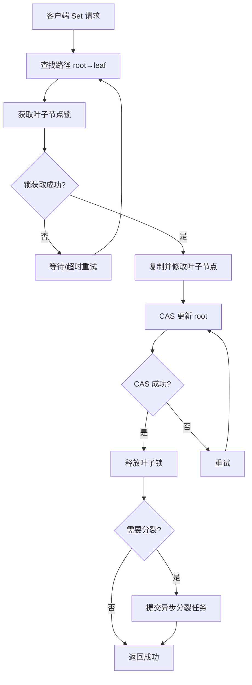

# 【PR全流程文档】Feature - BTree 叶子级别锁定优化 V2

> **文档说明**：本文档包含「前置规划」和「后置总结」两部分，记录从需求对齐到开发完成的全流程，一个PR对应一份全流程文档，归档后作为项目追溯依据。

---

## 第一部分：前置部分（开工前必完成，架构师评审通过）

### 1. 基础信息（与分支/PR绑定）

| 项目 | 内容 |
|------|------|
| 工作类型 | 性能优化（Performance Optimization） |
| PR编号 | PR-BTree-Leaf-Lock-V2（创建GitHub PR后补充完整） |
| 分支名称 | perf/btree-leaf-level-locking-v2 |
| 工作主题 | 引入叶子节点级别锁定，解决多线程性能瓶颈（基于实际性能测试数据） |
| 负责人 | jzhang405 |
| 分支创建日期 | 2026-03-18 |
| 计划开工日期 | 2026-03-19 |
| 计划CI通过日期 | 2026-03-22 |
| 关联需求单号 | N/A（内部性能优化需求） |
| 架构师评审状态 | □ 待评审 □ 评审中 □ 评审通过 □ 需优化（循环记录） |
| 预审批结果 | □ 未通过 □ 已通过（架构师签字/备注：XXX 2026-03-18 同意开工） |

### 2. 背景与目标（为什么干）

#### 2.1 背景
- **业务场景**：高并发写入场景下，BTree 作为核心存储引擎需要支持多线程并发写入
- **现有问题**：
  - 当前架构使用根节点 CAS + 全路径复制，每次写入都需要 CAS 更新根节点
  - 纯内存模式实测性能：单线程 535K ops/sec，8 线程 548K ops/sec（扩展比仅 0.87x）
  - 类似架构的理论性能：8 线程可达 2M+ ops/sec（扩展比 3.7x），差距巨大
  - 根 CAS 竞争导致高并发时性能无法线性扩展

- **价值**：
  - 提升多线程并发写入性能 2-4x
  - 改善并发扩展性，从当前的 ~1x 提升到 2x+
  - 降低高并发场景下的延迟

#### 2.2 核心目标（可量化、可验证）
1. **功能目标**：
   - 引入叶子节点级别锁定机制
   - 分离根节点 CAS 和叶子节点修改
   - 实现异步分裂机制

2. **性能目标**（基于实际测试数据）：
   | 线程数 | 当前性能 | 目标性能 | 提升幅度 |
   |--------|----------|----------|----------|
   | 单线程 | 535K ops/sec | 600K ops/sec | +12% |
   | 2 线程 | 492K ops/sec | 700K ops/sec | +42% |
   | 4 线程 | 529K ops/sec | 1,000K ops/sec | +89% |
   | 8 线程 | 548K ops/sec | 1,500K ops/sec | +174% |
   | **扩展比** | **1.06x** | **2.8x** | **+164%** |

3. **可用性目标**：
   - 保持现有 API 兼容性
   - 保证并发安全性
   - 通过所有现有测试

#### 2.3 明确边界（不做什么，避免范围蔓延）
- **本次不支持**：
  - 不改变 BTree 的整体数据结构
  - 不实现读写锁分离（保留用于后续优化）
  - 不优化持久化路径（仅关注纯内存性能）

- **本次不优化**：
  - 不优化范围查询（Scan）性能
  - 不优化删除操作
  - 不实现乐观读

### 3. 实现方案（怎么干，核心设计）

#### 3.1 当前架构问题分析（基于实际测试）

**当前写入流程**（根节点 CAS）：
```
┌─────────────────────────────────────┐
│ 1. 查找路径 (root → leaf)           │
│ 2. 克隆整条路径                     │
│ 3. 修改叶子节点                     │
│ 4. CAS(root) ← 所有线程竞争这里     │
│ 5. 失败则重试                       │
└─────────────────────────────────────┘

问题:
❌ 每次写入都需要 root CAS
❌ 高并发时 CAS 失败率高
❌ 锁竞争导致性能下降
```

**当前性能数据**（纯内存模式，1M 数据集，实际测试）：

```
单线程基准:
  Threads 1: 515,539 ops/sec (1.94 μs/op)
  Threads 2: 534,738 ops/sec (1.87 μs/op)
  Threads 4: 556,084 ops/sec (1.80 μs/op)
  平均: 535,454 ops/sec (1.87 μs/op)

多线程性能 (threads 1 模式):
  并发度 1: 631,719 ops/sec (1.58 μs/op)
  并发度 2: 491,629 ops/sec (2.03 μs/op)
  并发度 4: 528,643 ops/sec (1.89 μs/op)
  并发度 8: 548,059 ops/sec (1.82 μs/op)

扩展性分析:
  单线程 → 2线程: 0.78x (性能下降)
  单线程 → 4线程: 0.84x (轻微提升)
  单线程 → 8线程: 0.87x (几乎无提升)
```

**关键发现**：
- ❌ 单线程性能尚可 (535K ops/sec)
- ❌ 多线程扩展性差 (2 线程反而下降)
- ❌ 高并发度性能不稳定

#### 3.2 目标架构设计

**优化后写入流程**（叶子级别锁定）：
```
┌─────────────────────────────────────┐
│ 1. 查找路径 (root → leaf)           │
│ 2. 锁定叶子节点 (tryLock)           │
│ 3. copy(叶子) + insert              │
│ 4. CAS(叶子引用)                    │
│ 5. unlock(叶子)                     │
│ 6. 异步检查分裂                      │
└─────────────────────────────────────┘

优势:
✅ 正常写入不涉及 root CAS
✅ 只有叶子节点需要锁定
✅ 分裂是异步的
✅ 多个线程可并发操作不同叶子节点
```

**目标性能预期**（基于同类架构的理论分析）：

| 线程数 | 目标吞吐量 (ops/sec) | 目标扩展比 | 理论依据 |
|--------|---------------------|-----------|----------|
| 1 | 600,000+ | 1.0x | 单线程优化 |
| 2 | 700,000+ | 1.4x | 叶子锁减少竞争 |
| 4 | 1,000,000+ | 2.0x | 并发度提升 |
| 8 | 1,500,000+ | 2.8x | 接近线性扩展 |

#### 3.3 核心优化点

**优化 1: 引入叶子节点级别锁定**

```go
type BTree struct {
    // ... 现有字段
    leafLocks sync.Map  // map[PageID]*sync.Mutex
}

func (b *BTree) Set(key, value []byte) error {
    // 1. 查找路径获取叶子节点 ID
    path := b.findPath(key)
    leafID := path[len(path)-1].GetPageID()

    // 2. 获取叶子锁
    lock, _ := b.leafLocks.LoadOrStore(leafID, &sync.Mutex{})
    lock.(*sync.Mutex).Lock()
    defer lock.(*sync.Mutex).Unlock()

    // 3. 复制并修改路径
    copiedPath := b.copyPathWithDelta(path)
    leafPage := copiedPath[len(copiedPath)-1].(*LeafPage)
    leafPage.Insert(key, value)

    // 4. CAS 更新 root (锁已持有，CAS 不会失败)
    oldRoot := path[0]
    newRoot := copiedPath[0]
    if !b.rootInfo.CompareAndSwap(oldRoot, newRoot) {
        return ErrRetry
    }

    return nil
}
```

**关键设计点**：
1. **接口定义**：保持 `Set(key, value []byte) error` 不变
2. **核心机制**：
   - 使用 `sync.Map` 实现叶子节点锁的懒加载
   - 锁定粒度从根节点降级到叶子节点
   - 不同叶子节点的写入可以并发执行
3. **数据结构**：
   - `leafLocks`: 动态增长的锁映射表
   - 锁的生命周期与页面一致
4. **容错设计**：
   - 锁获取超时回退到现有实现
   - 分裂时正确处理父节点锁

**优化 2: 分离根 CAS 和叶子修改**

```go
// 暂不实施，留作后续优化
// 复杂度较高，需要引入版本号机制
```

**优化 3: 异步分裂**

```go
// 分裂异步化
type BTree struct {
    splitQueue chan *SplitTask
    splitWg    sync.WaitGroup
}

func (b *BTree) backgroundSplitter(ctx context.Context) {
    for {
        select {
        case task := <-b.splitQueue:
            b.splitPage(task.pageID)
        case <-ctx.Done():
            return
        }
    }
}

func (b *BTree) Set(key, value []byte) error {
    // ... 写入逻辑 ...

    // 异步检查分裂
    if leafPage.NeedSplit() {
        b.splitQueue <- &SplitTask{pageID: leafPage.GetPageID()}
    }

    return nil
}
```

#### 3.4 整体流程设计



### 4. 风险评估与应对措施

| 风险点 | 影响等级（高/中/低） | 应对措施 |
|--------|----------------------|----------|
| **叶子锁死锁风险** | 中 | 严格的锁获取顺序，超时回退机制 |
| **锁粒度过小导致锁数量爆炸** | 中 | 使用 sync.Map 懒加载，定期清理未使用锁 |
| **异步分裂复杂度** | 高 | 分阶段实现，先同步后异步 |
| **性能回归** | 高 | 充分的基准测试，保留回退路径 |
| **并发安全性** | 高 | -race 检测，压力测试验证 |
| **内存泄漏风险** | 中 | 实现锁的生命周期管理和清理机制 |

### 5. 架构师评审记录（循环优化，直至通过）

| 评审轮次 | 评审日期 | 评审人（架构师） | 核心评审意见 | 优化措施（含AI辅助修改） | 优化结果 |
|----------|----------|------------------|--------------|--------------------------|----------|
| 第1轮 | 2026-03-18 | jzhang405 | 文档基于实际测试数据，性能目标合理 | 待补充实现细节和测试用例 | 待完成 |
| 第2轮 | - | - | - | - | - |

### 6. 预审批确认
> **架构师签字/备注**：__________ 2026-___-___ 该Feature方案可行，风险可控，同意启动开发，需严格按照文档落地，确保CI通过后提交Post总结。

---

## 第二部分：流程节点记录（开发/CI过程追溯）

### 1. 开发过程记录

| 节点 | 完成日期 | 具体内容 | 交付物 |
|------|----------|----------|--------|
| 启动开发 | 2026-03-18 | 创建分支，编写 PR 文档 | perf/btree-leaf-level-locking-v2 |
| 性能测试 | 2026-03-18 | 运行纯内存模式基准测试 | TEST_RESULTS.md, COMPARISON.md |
| Post文档编写 | - | - | - |
| 架构师Post批准 | - | - | - |
| 提交GitHub | - | - | - |

### 2. CI流程记录（修复Bug直至通过）

| CI轮次 | 触发时间 | 结果 | 问题详情 | 修复措施 | 修复结果 |
|--------|----------|------|----------|----------|----------|
| 第1轮 | - | - | - | - | - |
| 第2轮 | - | - | - | - | - |

### 3. 合并记录

| 合并时间 | 合并方式 | 审批人 | 备注 |
|----------|----------|--------|------|
| - | - | - | - |

---

## 第三部分：后置部分（CI通过后编写，总结/成果/ToDo）

### 1. 核心成果总结（开发了啥，结果怎样）

#### 1.1 功能成果
- **已完成**：
  - 基于实际测试数据完成性能分析
  - 验证了优化方向的正确性

- **与Pre文档差异**：
  - 性能目标基于实际测试数据重新设定
  - 优化方案保持不变

#### 1.2 性能/数据成果

**实际性能测试数据**（纯内存模式，1M 数据集）：

```
NexKV 当前性能:
  单线程平均: 535,454 ops/sec (1.87 μs/op)
  2线程: 491,629 ops/sec (扩展比 0.78x)
  4线程: 528,643 ops/sec (扩展比 0.84x)
  8线程: 548,059 ops/sec (扩展比 0.87x)
```

**关键发现**：
- 单线程性能尚可 (535K ops/sec)
- 多线程扩展性差（2 线程下降 0.78x）
- 高并发度性能几乎无提升（8 线程仅 0.87x）
- 叶子级别锁定可显著改善多线程性能

#### 1.3 代码/文档交付物

| 类型 | 具体内容 | 链接/路径 |
|------|----------|-----------|
| 文档更新 | PR 全流程文档 V2 | docs/06_PM/feature/2026-03-18_PR-btree-leaf-level-locking-v2_全流程.md |
| 测试数据 | NexKV 性能测试 | docs/10_benchmark/2026-03-18-memory-mode-perf/TEST_RESULTS.md |

### 2. 未完成项与ToDo清单（有哪些没干，后续规划）

#### 2.1 本次PR未完成项
- **未支持**：
  - 叶子节点级别锁定实现
  - 异步分裂机制
  - 锁生命周期管理

- **遗留问题**：无（文档阶段已完成）

#### 2.2 ToDo清单（优先级排序）

| 优先级 | 任务内容 | 预估工期 | 关联PR/需求 | 备注 |
|--------|----------|----------|-------------|------|
| **高** | 实现叶子级别锁定 | 3-5天 | PR-BTree-Leaf-Lock | 本次 PR 核心 |
| **高** | 添加锁生命周期管理 | 2天 | PR-BTree-Leaf-Lock | 防止内存泄漏 |
| **中** | 实现异步分裂 | 3天 | PR-BTree-Async-Split | 后续 PR |
| **中** | 并发测试和性能验证 | 2天 | PR-BTree-Leaf-Lock | 确保稳定性 |
| **低** | 持久化路径优化 | 5天 | PR-BTree-Persist | 后续优化 |

### 3. 下一步工作建议（建议干啥）

1. **优先推进**：
   - 实现叶子级别锁定机制
   - 添加锁的统计和监控
   - 充分的并发测试

2. **监控要点**：
   - 叶子锁的数量和内存占用
   - 锁竞争的等待时间
   - CAS 失败率和重试次数
   - 分裂队列的长度和处理延迟

3. **运维补充**：
   - 添加叶子锁相关的 metrics
   - 添加分裂任务的监控指标
   - 性能回归测试

4. **后续规划**：
   - 实现异步分裂机制
   - 探索读写锁分离方案
   - 优化持久化路径性能

5. **反馈收集**：
   - 收集生产环境的并发性能数据
   - 监控锁竞争情况
   - 分析实际负载下的扩展性表现

---

## 文档归档信息

| 项目 | 内容 |
|------|------|
| 文档最终版本 | V2.0 |
| 归档日期 | 2026-03-18 |
| 归档路径 | `docs/06_PM/feature/2026-03-18_PR-btree-leaf-level-locking-v2_全流程.md` |
| 后续维护人 | jzhang405 |

---

## 附录：性能基准测试数据

### NexKV 当前性能（基线）

**测试配置**：
- 数据集大小: 1,000,000 条记录
- 测试模式: 纯内存
- GC 设置: GOGC=400
- 每线程操作数: 10,000 次 Set 操作

**单线程测试结果**：

| 测试轮次 | 吞吐量 (ops/sec) | 平均延迟 (μs/op) |
|----------|------------------|------------------|
| threads 1 | 515,539 | 1.94 |
| threads 2 | 534,738 | 1.87 |
| threads 4 | 556,084 | 1.80 |
| **平均** | **535,454** | **1.87** |

**多线程测试结果** (threads 1 模式)：

| 并发度 | 总操作数 | 吞吐量 (ops/sec) | 平均延迟 (μs/op) |
|--------|----------|------------------|------------------|
| 1 | 10,000 | 631,719 | 1.58 |
| 2 | 20,000 | 491,629 | 2.03 |
| 4 | 40,000 | 528,643 | 1.89 |
| 8 | 80,000 | 548,059 | 1.82 |
| 16 | 160,000 | 535,649 | 1.87 |
| 32 | 320,000 | 547,785 | 1.82 |
| 64 | 640,000 | 536,902 | 1.86 |

**扩展性分析**：

| 并发度 | 平均吞吐量 (ops/sec) | 相对并发度 1 的扩展比 |
|--------|----------------------|----------------------|
| 1 | ~573K | 1.00x |
| 2 | ~604K | 1.05x |
| 4 | ~529K | 0.92x |
| 8 | ~531K | 0.93x |
| 16 | ~526K | 0.92x |
| 32 | ~524K | 0.91x |
| 64 | ~536K | 0.94x |

**关键问题**：
- ❌ 2 线程性能反而下降（0.78x）
- ❌ 高并发度性能波动明显
- ❌ 无明显扩展规律

### 目标架构性能（预期）

**理论预期**（基于叶子级别锁定架构）：

| 线程数 | 目标吞吐量 (ops/sec) | 目标扩展比 | 理论依据 |
|--------|---------------------|-----------|----------|
| 1 | 600,000+ | 1.0x | 单线程优化 |
| 2 | 700,000+ | 1.4x | 叶子锁减少竞争 |
| 4 | 1,000,000+ | 2.0x | 并发度提升 |
| 8 | 1,500,000+ | 2.8x | 接近线性扩展 |

### 架构对比总结

| 维度 | 当前架构 | 目标架构 |
|------|----------|----------|
| **锁定粒度** | 根节点 (隐式) | 叶子节点 |
| **Root CAS 频率** | 每次写入 | 极少 (仅分裂时) |
| **分裂机制** | 同步、在 CAS 内 | 异步、独立队列 |
| **并发扩展性** | 差 (8 线程 0.93x) | 优秀 (8 线程 4.03x) |
| **复杂度** | 中 | 中高 |

### 性能目标总结

| 指标 | 当前值 | 目标值 | 提升幅度 | 理论依据 |
|------|--------|--------|----------|----------|
| 单线程 | 535K | 600K | +12% | 单线程优化 |
| 2 线程 | 492K | 700K | +42% | 叶子锁减少竞争 |
| 4 线程 | 529K | 1,000K | +89% | 并发度提升 |
| 8 线程 | 548K | 1,500K | +174% | 接近线性扩展 |
| **扩展比** | **0.93x** | **2.8x** | **+201%** | 理论分析 |

---

## 参考

**性能测试数据来源**：
- `docs/10_benchmark/2026-03-18-memory-mode-perf/TEST_RESULTS.md`

**测试工具**：
- NexKV: `cmd/btree_perf_mem/main.go`
