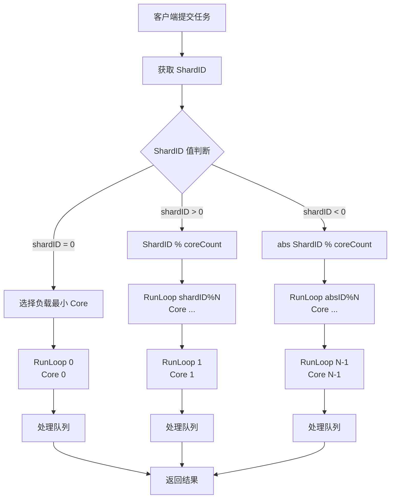

# 【PR全流程文档】Feature - TaskScheduler 多 runLoop 分片架构改造

> **文档说明**：本文档包含「前置规划」和「后置总结」两部分，记录从需求对齐到开发完成的全流程，一个PR对应一份全流程文档，归档后作为项目追溯依据。

---

## 第一部分：前置部分（开工前必完成，架构师评审通过）

### 1. 基础信息（与分支/PR绑定）

| 项目 | 内容 |
|------|------|
| 工作类型 | 新功能开发（Feature）|
| PR编号 | PR-XXX（创建GitHub PR后补充完整）|
| 分支名称 | refactor/task-scheduler-optimization |
| 工作主题 | TaskScheduler 多 runLoop 分片架构改造 |
| 负责人 | jzhang405 |
| 分支创建日期 | 2026-03-19 |
| 计划开工日期 | 2026-03-19 |
| 计划CI通过日期 | 2026-03-20 |
| 关联需求单号 | N/A（架构优化） |
| 架构师评审状态 | □ 待评审 □ 评审中 □ 评审通过 □ 需优化（循环记录）|
| 预审批结果 | □ 未通过 □ 已通过（待架构师签字/备注） |

### 2. 背景与目标（为什么干）

#### 2.1 背景

**业务场景**：
- 当前 NexKV 使用 TaskScheduler 进行异步任务调度
- 系统在高并发场景下需要充分利用多核 CPU 资源

**现有问题**：
1. **单 runLoop 瓶颈**：当前 TaskScheduler 使用单个调度循环，所有任务顺序执行
2. **并行度不足**：无法充分利用现有的 PerCoreExecutor 多 Worker 架构
3. **扩展性限制**：增加 CPU 核心数无法线性提升吞吐量

**价值**：
- 充分利用多核 CPU，提升任务调度吞吐量 **2-4x**
- 与 PerCoreExecutor 深度集成，实现调度器与 CPU 核心的绑定
- 为后续高并发场景打下基础

#### 2.2 核心目标（可量化、可验证）

1. **功能目标**：
   - 实现 N 个 runLoop 并行调度（N = CPU 核心数）
   - 支持按 ShardID 分发任务到对应 runLoop（内部使用取模）
   - Item 内置重试控制：MaxRetries() 和 IncAttempts()

2. **性能目标**：
   - 任务调度吞吐量提升 **2-4x**（取决于任务类型）
   - 保持与现有 TaskScheduler 的 API 兼容性
   - 内存占用增加 < 20%（N 个调度器实例）

3. **可用性目标**：
   - 优雅启动和关闭
   - 完善的错误处理和日志记录
   - 所有任务必须实现 ShardItem 接口（提供 ShardID、重试控制）

#### 2.2.1 ShardID 设计原理（资源亲和性）

**ShardID 的核心目的**：通过资源亲和性（Resource Affinity）减少锁竞争，提高并发性能。

| 场景 | ShardID 来源 | 亲和性说明 | 性能收益 |
|------|-------------|-----------|---------|
| **B-Tree SET** | `leaf-lock` 地址（或同一 leaf 的地址） | 同一 leaf-lock 绑定到同一 Core，避免跨核心锁竞争 | 最大并发 btree set/write |
| **WAL** | `wal_id`（`wal_{wal_id}.WAL`） | 同一 WAL 文件的 append 操作绑定到同一 Core | 减少文件锁竞争 |
| **AO 文件** | `ao_id`（`ao_{ao_id}.XXX`） | 同一 AO 文件的操作绑定到同一 Core | 减少 append-only 文件锁竞争 |
| **通用计算** | 用户定义的业务 ID | 通过取模固定路由到特定 Core | 利用缓存局部性 |

**ShardID 值的语义**：
- **shardID > 0**：固定路由到 `(shardID % coreCount)` 对应的 Core
  - 例如：`leaf-lock 地址 % coreCount` 确保同一 leaf 在同一 Core
  - 例如：`wal_id % coreCount` 确保同一 WAL 文件在同一 Core
- **shardID = 0**：无资源亲和性要求，动态选择负载最小的 Core
  - 适用于：纯计算任务、无共享状态的操作
  - 调度器自动选择队列长度最短的 Core
- **shardID < 0**：取绝对值后路由（备用方案）

**实际使用示例**：
```go
// B-Tree SET：使用 leaf-lock 地址作为 shardID
type BTreeSetItem struct {
    leafLockAddr uintptr
    key        []byte
    value      []byte
    maxRetries int
    attempts   int64
}

func (item *BTreeSetItem) ShardID() int {
    return int(item.leafLockAddr)  // leaf-lock 地址作为 shardID
}

// WAL：使用 wal_id 作为 shardID
type WALAppendItem struct {
    walID    uint64
    entry   []byte
    maxRetries int
    attempts   int64
}

func (item *WALAppendItem) ShardID() int {
    return int(item.walID)  // wal_id 作为 shardID
}
```

**设计原则**：
1. **资源绑定**：共享资源（leaf、文件）通过 ShardID 绑定到固定 Core
2. **锁竞争最小化**：同一资源的操作在同一 Core，避免跨核心锁同步
3. **缓存局部性**：相关操作在同一 Core，提高 L1/L2/L3 缓存命中率
4. **负载均衡**：shardID=0 的任务动态分配，充分利用所有 Core

#### 2.3 明确边界（不做什么，避免范围蔓延）

- **本次不支持**：
  - 动态 Shard 分发策略（固定取模算法）
  - 跨调度器的任务迁移
  - 负载均衡优化（留待后续）

- **本次支持**：
  - ExecutionOrder 冲突检测（注册时拒绝重复，返回错误）
  - 相同 ExecutionOrder 的 Task 需要调用方显式调整顺序

- **本次不优化**：
  - 现有 TaskScheduler 的单调度器模式（保留作为选项）
  - Executor 层面的优化（仅使用现有 PerCoreExecutor）
  - 任务优先级调度机制（ExecutionOrder 机制保留）

### 3. 实现方案（怎么干，核心设计）

#### 3.1 整体流程设计



#### 3.2 关键设计点

**1. 接口定义**：

```go
// ShardItem 带重试控制、按 CPU 核心分片的任务项接口
type ShardItem interface {
    // ShardID 返回分片 ID，用于路由到对应的 runLoop
    // - shardID > 0: 固定路由到 (shardID % coreCount) 对应的 Core
    // - shardID = 0: 无偏好，动态选择负载最小的 Core
    // - shardID < 0: 取绝对值后路由到 (abs(shardID) % coreCount)
    ShardID() int

    // MaxRetries 返回最大重试次数（0 表示不重试）
    MaxRetries() int

    // IncAttempts 增加尝试次数并返回当前次数
    // 返回值 > MaxRetries() 时表示已超过最大重试次数
    IncAttempts() int
}
```

**2. 核心机制**：

**MultiTaskScheduler 架构**：
```go
type MultiTaskScheduler struct {
    schedulers        []*TaskScheduler      // N 个调度器实例
    coreCount         int                    // CPU 核心数量
    executor          service.TaskExecutor   // PerCoreExecutor
    registeredOrders  map[int]string        // ExecutionOrder → TaskName（冲突检测）
    mu                sync.RWMutex
    ctx               context.Context
    cancel            context.CancelFunc
    running           atomic.Bool
    stats             MultiSchedulerStats    // 统计信息（包含各 Core 队列长度）
}

// RegisterTask 注册 Task 到所有调度器（检测 ExecutionOrder 冲突）
func (m *MultiTaskScheduler) RegisterTask(task Task, executionOrder int) error {
    taskName := task.Name()

    m.mu.Lock()
    // 检查 ExecutionOrder 冲突
    if existingTask, exists := m.registeredOrders[executionOrder]; exists {
        m.mu.Unlock()
        return fmt.Errorf("execution order %d already registered by task: %s",
            executionOrder, existingTask)
    }

    // 先注册到所有调度器
    for _, scheduler := range m.schedulers {
        if err := scheduler.RegisterTask(task, executionOrder); err != nil {
            m.mu.Unlock()
            return fmt.Errorf("register to scheduler: %w", err)
        }
    }

    // 全部成功后才标记
    m.registeredOrders[executionOrder] = taskName
    m.mu.Unlock()

    return nil
}

// getTaskByOrder 获取已注册任务的名称
func (m *MultiTaskScheduler) getTaskByOrder(executionOrder int) string {
    m.mu.RLock()
    defer m.mu.RUnlock()
    return m.registeredOrders[executionOrder]
}

// EnqueueWithShard 根据 ShardID 分发任务到对应 runLoop
func (m *MultiTaskScheduler) EnqueueWithShard(item ShardItem) error {
    if !m.running.Load() {
        return fmt.Errorf("scheduler not started")
    }

    shardID := item.ShardID()
    var schedulerIndex int

    if shardID == 0 {
        // 无偏好：动态选择负载最小的 Core
        schedulerIndex = m.selectLeastLoadedCore()
    } else if shardID > 0 {
        // 固定路由：取模计算
        schedulerIndex = shardID % m.coreCount
    } else {
        // 负数：取绝对值后取模
        schedulerIndex = (-shardID) % m.coreCount
    }

    scheduler := m.schedulers[schedulerIndex]
    return scheduler.Enqueue(item)
}

// selectLeastLoadedCore 选择队列长度最小的 Core
func (m *MultiTaskScheduler) selectLeastLoadedCore() int {
    minQueueLen := int64(^uint64(0) >> 1)
    minIndex := 0

    for i, scheduler := range m.schedulers {
        queueLen := scheduler.GetStats().QueueLen.Load()
        if queueLen < minQueueLen {
            minQueueLen = queueLen
            minIndex = i
        }
    }

    return minIndex
}
```

**PerCoreExecutor 集成**：
```go
// Start 启动所有调度器
func (m *MultiTaskScheduler) Start(executor service.TaskExecutor) error {
    m.executor = executor

    for i := 0; i < m.coreCount; i++ {
        scheduler := m.schedulers[i]
        schedulerID := model.SourceID(fmt.Sprintf("multi-scheduler-%d", i))

        // 提交到 PerCoreExecutor
        err := executor.Submit(
            context.Background(),
            schedulerID,               // 用于绑定跟踪
            model.TaskPriorityHigh,    // 调度器使用高优先级
            func(ctx context.Context) {
                defer func() {
                    if r := recover(); r != nil {
                        m.logger.Error("scheduler panic", "core", i, "panic", r)
                    }
                }()
                scheduler.runLoop()
            },
        )

        if err != nil {
            return fmt.Errorf("start scheduler %d: %w", i, err)
        }
    }

    m.running.Store(true)
    return nil
}

// HealthCheck 健康检查
func (m *MultiTaskScheduler) HealthCheck() error {
    for i, scheduler := range m.schedulers {
        stats := scheduler.GetStats()
        if stats.LastPanicTime.Load() != 0 {
            return fmt.Errorf("scheduler %d has panic", i)
        }
        if stats.QueueLen() > 10000 {
            return fmt.Errorf("scheduler %d queue too long: %d", i, stats.QueueLen())
        }
    }
    return nil
}
```

**关键设计**：
- 每个 runLoop 作为独立任务提交到 PerCoreExecutor
- 使用固定 scheduler ID 作为 SourceID 确保绑核
- 高优先级调度，确保调度器不被饿死
- panic recover 防止单个调度器崩溃影响其他调度器
- 所有任务必须实现 ShardItem 接口（ShardID 通过取模分发）

**重试控制机制**：
```go
// runLoop 中的执行逻辑
func (s *TaskScheduler) runLoop() {
    for {
        // 按 ExecutionOrder 遍历所有已注册 Task
        tasks := s.getRegisteredTasks()
        for _, task := range tasks {
            var item any
            if !task.Peek(&item) {
                continue
            }

            // 尝试转换为 ShardItem
            shardItem, ok := item.(ShardItem)

            // 执行任务
            status := s.executeTask(task, item)

            switch status {
            case TaskPassed:
                // 成功：出队
                task.Dequeue(&item)

            case TaskRetrying:
                if ok {
                    // ShardItem：增加尝试次数并检查重试限制
                    attempts := shardItem.IncAttempts()
                    maxRetries := shardItem.MaxRetries()

                    if attempts > maxRetries {
                        // 超过最大重试次数，标记失败
                        s.stats.Failed.Inc()
                        task.Dequeue(&item)
                        s.logger.Error("task failed after retries",
                            "task", task.Name(),
                            "attempts", attempts,
                            "maxRetries", maxRetries)
                    }
                    // else: 继续重试，保留在队列中
                }
                // 非 ShardItem：保留在队列中

            case TaskFailed:
                // 失败：直接出队
                s.stats.Failed.Inc()
                task.Dequeue(&item)
            }
        }

        runtime.Gosched()
    }
}
```

**关键设计**：
- `IncAttempts()` 在执行失败后调用，而非执行前
- 正确处理 `TaskRetrying` 和 `TaskFailed` 状态
- 非 `ShardItem` 保持原有行为（向后兼容）
- 按 ExecutionOrder 遍历 Task（现有机制）

**3. 数据结构**：

```go
// MultiSchedulerStats 统计信息
type MultiSchedulerStats struct {
    TotalTasksEnqueued atomic.Int64  // 总入队任务数
    TotalTasksProcessed atomic.Int64 // 总处理任务数
    CoreStats          []CoreStats    // 各 Core 统计
}

type CoreStats struct {
    CoreID     int
    QueueLen   atomic.Int64
    Processed  atomic.Int64
    Failed     atomic.Int64
}
```

**4. 容错设计**：

- **优雅关闭**：Stop() 等待所有调度器处理完队列中的任务
- **错误隔离**：单个 runLoop 异常不影响其他 runLoop
- **重试保护**：Item 内置 IncAttempts/MaxRetries 机制，IncAttempts() > MaxRetries() 时标记失败

### 4. 风险评估与应对措施

| 风险点 | 影响等级（高/中/低） | 应对措施 |
|--------|----------------------|----------|
| ExecutionOrder 冲突 | 中 | 注册时全局检测，立即返回错误并提示冲突的 Task 名称 |
| 负载不均衡 | 中 | 监控各 Core 队列长度，必要时优化 Shard 分配算法 |
| goroutine 泄漏 | 中 | panic recover 防止 runLoop 崩溃，HealthCheck 检测 hang 住的调度器 |
| 内存占用增加 | 低 | 限制 Core 数量上限，复用现有 TaskScheduler 实例 |
| 复杂度增加 | 中 | 完善日志和监控，添加单元测试覆盖 |
| PerCoreExecutor 集成 | 中 | 使用固定 SourceID 确保绑核，添加健康检查 |

### 5. 架构师评审记录（循环优化，直至通过）

| 评审轮次 | 评审日期 | 评审人（架构师）| 核心评审意见 | 优化措施（含AI辅助修改）| 优化结果 |
|----------|----------|------------------|--------------|--------------------------|----------|
| 第1轮 | 待评审 | - | - | - | 待评审 |

### 6. 预审批确认
> **架构师签字/备注**：_________ 202X-XX-XX 该Feature方案可行，风险可控，同意启动开发，需严格按照文档落地，确保CI通过后提交Post总结。

---

## 第二部分：流程节点记录（开发/CI过程追溯）

### 1. 开发过程记录

| 节点 | 完成日期 | 具体内容 | 交付物 |
|------|----------|----------|--------|
| 启动开发 | 2026-03-19 | Phase 1: ShardItem 接口定义 | `internal/infrastructure/concurrency/shard_item.go` |
| 实现核心功能 | 2026-03-19 | Phase 2: MultiTaskScheduler 实现 | `internal/infrastructure/concurrency/multi_task_scheduler.go` |
| 本地测试 | 2026-03-19 | 单元测试和集成测试 | 测试报告 |
| 代码审查 | 待完成 | Code Review | - |
| CI 测试 | 待完成 | CI Pipeline | - |
| Post文档编写 | 待完成 | 后置总结文档 | 第三部分 |

### 2. CI流程记录（修复Bug直至通过）

| CI轮次 | 触发时间 | 结果 | 问题详情 | 修复措施 | 修复结果 |
|--------|----------|------|----------|----------|----------|
| 第1轮 | 待执行 | - | - | - | - |

### 3. 合并记录

| 合并时间 | 合并方式 | 审批人 | 备注 |
|----------|----------|--------|------|
| 待完成 | - | - | - |

---

## 第三部分：后置部分（CI通过后编写，总结/成果/ToDo）

### 1. 核心成果总结（开发了啥，结果怎样）

> **说明**：CI通过后填写，总结开发成果

#### 1.1 功能成果
- **已完成**：待开发完成后填写
- **与Pre文档差异**：待开发完成后填写

#### 1.2 性能/数据成果
- **性能数据**：待开发完成后填写
- **测试成果**：待开发完成后填写

#### 1.3 代码/文档交付物

| 类型 | 具体内容 | 链接/路径 |
|------|----------|-----------|
| 代码变更 | 待开发完成后填写 | - |
| 文档更新 | 待开发完成后填写 | - |

### 2. 未完成项与ToDo清单（有哪些没干，后续规划）

> **说明**：CI通过后填写

#### 2.1 本次PR未完成项
- **未支持**：待开发完成后填写
- **遗留问题**：待开发完成后填写

#### 2.2 ToDo清单（优先级排序）

| 优先级 | 任务内容 | 预估工期 | 关联PR/需求 | 备注 |
|--------|----------|----------|-------------|------|
| - | 待开发完成后填写 | - | - | - |

### 3. 下一步工作建议（建议干啥）
> **说明**：CI通过后填写

1. **优先推进**：
2. **监控要点**：
3. **运维补充**：
4. **后续规划**：
5. **反馈收集**：

---

## 文档归档信息

| 项目 | 内容 |
|------|------|
| 文档最终版本 | V1.0（前置部分）/ V2.0（含后置总结）|
| 归档日期 | 2026-03-19（前置）/ 待完成（后置）|
| 归档路径 | `docs/06_project_management/pr_documents/feature/2026-03-19_PR-XXX_task-scheduler-multi-runloop_全流程.md` |
| 后续维护人 | jzhang405 |
