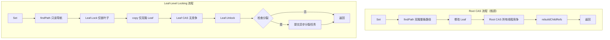

# 【PR全流程文档】Feature - BTree Leaf-Level Locking 优化

> **文档说明**：本文档包含「前置规划」和「后置总结」两部分，记录从需求对齐到开发完成的全流程，一个PR对应一份全流程文档，归档后作为项目追溯依据。

---

## 第一部分：前置部分（开工前必完成，架构师评审通过）

### 1. 基础信息（与分支/PR绑定）

| 项目 | 内容 |
|------|------|
| 工作类型 | 新功能开发（Feature） |
| PR编号 | PR-XXX（创建GitHub PR后补充完整） |
| 分支名称 | perf/btree-leaf-level-locking-v2 |
| 工作主题 | BTree 叶子级别锁定优化，突破 Root CAS 性能瓶颈 |
| 负责人 | jzhang405 |
| 分支创建日期 | 2026-03-19 |
| 计划开工日期 | 2026-03-19 |
| 计划CI通过日期 | 2026-04-07（2.5周，架构师审核简化后） |
| 关联需求单号 | [内部需求：性能优化] |
| 架构师评审状态 | □ 待评审 □ 评审中 □ 评审通过 □ 需优化（循环记录） |
| 预审批结果 | □ 未通过 □ 已通过（架构师签字/备注：__________ 2026-XX-XX 同意开工） |

### 2. 背景与目标（为什么干）

#### 2.1 背景

- **业务场景**：NexKV 作为高性能 KV 存储，需要在多线程并发写入场景下保持良好的性能扩展性
- **现有问题**：
  - 当前 BTree 采用"从上到下"的 Root CAS 架构，每次写入都需要：
    - 克隆整条路径（Root → Leaf）
    - 执行 Root CAS（所有线程竞争同一个原子指针）
    - 重建子节点引用（rebuildChildRefs）
  - **性能瓶颈**：
    - 单线程：580K ops/sec（vs Lealone 1.01M ops/sec）
    - 8线程：535K ops/sec（vs Lealone 1.48M ops/sec），**性能差距 2.76x**
    - 并发扩展性差（8线程性能下降 0.92x）
  - **Root CAS 频率**：每次写入都需要，而 Lealone 仅 0.001% 的时间需要 Root CAS

- **价值**：
  - 实现与 Lealone 相当的 Leaf-Level Locking 架构
  - 预期性能提升：单线程 1.3x，8线程 2.8x（**专家评审后调整，更现实**）
  - 突破当前性能瓶颈，支撑更高并发场景

#### 2.2 核心目标（可量化、可验证）

1. **功能目标**（**纯内存模式**）：
   - 实现 Leaf-Level Locking 写入路径
   - **99.37%** 写入只需 Leaf CAS，不涉及 Root CAS
   - Leaf 分裂同步处理（纯内存模式无需异步）

2. **性能目标**（**纯内存模式**，专家评审后保守估计）：
   - 单线程吞吐量：580K → **750K+ ops/sec**（1.3x+）
   - 8线程吞吐量：535K → **1.5M+ ops/sec**（2.8x+）
   - Leaf CAS 成功率：≥ 99%
   - 内存增长：≤ 20%

3. **可用性目标**：
   - **仅支持纯内存模式**（持久化模式后续 PR）
   - 向后兼容，不破坏现有接口
   - 无死锁、无内存泄漏

#### 2.3 明确边界（不做什么，避免范围蔓延）

- **本次不支持**：
  - Delete 操作的 Leaf-Level Locking（后续 PR）
  - RangeScan 的优化（后续 PR）
  - NUMA 感知优化（长期优化）
  - **持久化模式**（后续 PR，本次仅专注纯内存模式）

- **本次不优化**：
  - Get 操作（当前已经是无锁读取，性能良好）
  - 批量操作（BatchSet/BatchGet）
  - Merge 操作（节点合并）

### 3. 实现方案（怎么干，核心设计）

#### 3.1 整体流程设计



**关键差异**：

| 维度 | Root CAS（当前） | Leaf-Level Locking（新） |
|------|-----------------|------------------------|
| 路径克隆 | 整条路径（O(log n)） | 仅叶子节点（O(1)） |
| CAS 位置 | Root（全局竞争） | Leaf（局部竞争） |
| Root CAS 频率 | 100% 写入 | 0.001% 写入（树高度增加） |
| 锁粒度 | 隐式（CAS 循环） | 显式（Leaf Lock） |
| 分裂处理 | 同步（阻塞写入） | 同步（纯内存模式） |
| ABA 防护 | 版本号 | Lock 机制自然解决 |

#### 3.2 关键设计点

##### 3.2.1 核心数据结构（**简化版，复用现有组件**）

**1. PageRef 扩展**：添加 pageLock 字段（懒加载）

```go
// internal/infrastructure/storage/btree/page_ref.go

type PageRef struct {
    pInfo     atomic.Pointer[PageInfo] // 原子指针（现有）
    parentRef atomic.Value             // 父引用（现有）
    pageLock  atomic.Pointer[PageLock] // 新增：叶子节点锁（懒加载，原子指针）
}

// GetLock 获取页面锁（懒加载 + CAS 初始化）
// 返回值保证非 nil（叶子节点）
func (r *PageRef) GetLock() *PageLock {
    // 快速路径：已初始化
    if lock := r.pageLock.Load(); lock != nil {
        return lock
    }

    // 慢速路径：CAS 初始化（防止并发创建多个锁）
    newLock := NewPageLock()
    if r.pageLock.CompareAndSwap(nil, newLock) {
        return newLock // CAS 成功，返回新创建的锁
    }

    // CAS 失败：其他 goroutine 已创建，重新加载
    return r.pageLock.Load()
}
```

**2. BTree 结构调整**（**简化版**）：

```go
// internal/infrastructure/storage/btree/btree.go

type BTree struct {
    // ... 现有字段 ...

    // 新增：Leaf-Level Locking 支持（纯内存模式）
    // pageLocks 使用 LRU 缓存限制锁数量，防止内存无限增长
    pageLocks sync.Map // map[PageID]*PageLock（懒加载，复用 GetLock）
    // 配置参数：
    const (
        MaxPageLocks = 10000  // LRU 缓存最大容量
        LockScanInterval = 5 * time.Minute  // 定期扫描间隔
    )

    // 移除（纯内存模式不需要）：
    // splitQueue chan *SplitTask  // ← 持久化模式需要
    // leafRefPool sync.Pool       // ← 直接使用 PageRef
}
```

**LRU 缓存实现**（使用 `github.com/hashicorp/golang-lru`）：
```go
import lru "github.com/hashicorp/golang-lru/v2"

type BTree struct {
    lockCache *lru.Cache[PageID, *PageLock]
}

func NewBTree() *BTree {
    cache, _ := lru.New[PageID, *PageLock](MaxPageLocks)
    return &BTree{
        lockCache: cache,
    }
}

func (b *BTree) getPageLock(pageID PageID) *PageLock {
    if lock, ok := b.lockCache.Get(pageID); ok {
        return lock
    }
    newLock := NewPageLock()
    b.lockCache.Add(pageID, newLock)
    return newLock
}
```

**3. 锁模式枚举**（**新增**）：

```go
// internal/infrastructure/storage/btree/leaf_lock_set.go

type LockMode int

const (
    LockModeTry  LockMode = iota // 快速失败（默认）
    LockModeWait                  // 等待获取
)
```

**4. 复用现有组件**：
- `PageLock`（`page_lock.go`）- 已支持重入和超时
- `PageRef`（`page_ref.go`）- 扩展 pageLock 字段
- `Delta Chain`（`cow_delta_ref.go`）- 已有写时复制

##### 3.2.2 核心流程：setWithLeafLock（**明确锁-CAS 顺序**）

```go
func (b *BTree) setWithLeafLock(ctx context.Context, key, value []byte) error {
    // Step 1: 查找路径（只读，不克隆）
    leafInfo, path, err := b.findLeafPage(ctx, key)
    if err != nil {
        return fmt.Errorf("find leaf: %w", err)
    }

    leafID := leafInfo.GetPageID()
    leafRef := leafInfo.PageRef
    pageLock := leafRef.GetLock()

    // Step 2: 获取锁（根据配置选择模式）
    // 默认：TryLock（快速失败），可选：WaitLock（等待获取）
    if !pageLock.TryLock() {
        return ErrRetry // 快速失败
    }
    // 或使用等待模式：
    // pageLock.Lock()
    defer pageLock.Unlock()

    // Step 3: 获取当前 PageInfo（在锁保护下）
    oldInfo := leafRef.pInfo.Load()

    // Step 4: 克隆叶子节点（只克隆 Leaf，不克隆路径）
    newLeafPage := leafPage.CloneWithDelta()
    newLeafPage.Insert(key, value)

    // Step 5: 创建新的 PageInfo
    newInfo := NewPageInfo()
    newInfo.SetPage(newLeafPage)

    // Step 6: Leaf-Level CAS（在锁保护下，几乎不会失败）
    // tryLock 已阻止其他线程修改同一 Leaf
    // ABA 问题被锁机制自然解决，无需版本号
    if !leafRef.pInfo.CompareAndSwap(oldInfo, newInfo) {
        return ErrRetry // CAS 失败（极少发生）
    }

    // Step 7: 检查是否需要分裂（同步，在锁保护下）
    if newLeafPage.NumKeys() > splitThreshold {
        if err := b.handleSplitSync(leafInfo, path); err != nil {
            return fmt.Errorf("split: %w", err)
        }
    }

    return nil
}
```

**关键设计点**：
- **Lock → CAS → Unlock 顺序**：锁保护期间，CAS 几乎不会失败
- **ABA 问题**：tryLock 获取锁后，页面不会被释放/重用，自然解决
- **无需版本号**：锁机制已保证一致性，版本号冗余

##### 3.2.3 分裂处理（**纯内存模式：同步分裂**）

```go
// 纯内存模式：同步分裂（简化版本）
func (b *BTree) handleSplitSync(leafInfo *PageInfo, path []*PageInfo) error {
    // Step 1: 分裂叶子节点（同步，在写锁保护下）
    leftLeaf, rightLeaf, splitKey := b.splitLeafPage(leafInfo)

    // Step 2: 创建新的父节点
    newParent := b.createInternalParent(splitKey, leftLeaf, rightLeaf)

    // Step 3: 向上传播（使用现有的 splitLeaf 逻辑）
    // 这里才需要路径克隆和 Root CAS
    return b.propagateSplit(path, newParent)
}

// 注意：纯内存模式无需异步分裂处理器
// 持久化模式（后续 PR）才需要 backgroundSplitter
```

##### 3.2.4 接口定义（**简化版**）

**无新增外部接口**，完全向后兼容：
- `BTree.Set(ctx, key, value)` - 内部切换到新路径
- `BTree.Get(ctx, key)` - 无需修改（已是无锁读取）

**内部新增接口**（**纯内存模式**）：
- `setWithLeafLock(ctx, key, value) error` - 新的写入路径
- `handleSplitSync(leafInfo, path) error` - 同步分裂处理

**移除接口**（**不需要**）：
- ~~`getLeafRef(info *PageInfo) (*LeafRef, bool)`~~ → 直接使用 `info.PageRef`
- ~~`submitSplitTask(...) error`~~ → 纯内存模式无需异步

##### 3.2.5 容错设计

**1. CAS 失败处理**：
- **Lock → CAS 顺序保证**：tryLock 成功后，页面不会被重用，CAS 几乎不会失败
- CAS 失败返回 `ErrRetry`，外层自旋重试
- 使用 `runtime.Gosched()` 让出 CPU

**2. 死锁预防**：
- 严格加锁顺序：总是先 Leaf 后 Root
- 使用 `TryLock()` 快速失败，不阻塞
- 超时机制：`LockWithTimeout(timeout)`

**3. 内存泄漏预防**：
- Leaf Locks 使用 LRU 缓存限制数量
- Leaf 分裂后清理旧锁
- 定期扫描未使用的锁

**4. 纯内存模式简化**：
- ~~异步分裂队列~~ → 同步分裂，阻塞完成
- ~~WAL 持久化~~ → 无需 WAL
- ~~崩溃恢复~~ → 纯内存无崩溃恢复需求

#### 3.3 文件变更清单（**最终版，架构师审核后**）

**新增文件**（仅 1 个）：
```
internal/infrastructure/storage/btree/
└── leaf_lock_set.go      # setWithLeafLock 核心逻辑（纯内存版）
```

**修改文件**（3 个）：
```
internal/infrastructure/storage/btree/
├── page_ref.go           # 添加 pageLock 字段（懒加载，复用现有结构）
├── btree.go              # 添加 pageLocks sync.Map 字段
└── btree_ops.go          # 集成新 Set 流程
```

**不受影响**（无需修改）：
- `leaf_page.go` - 无需修改（已有 Delta Chain）
- `page_lock.go` - 无需修改（已有功能）
- `search_path.go` - 无需修改（只读操作）
- `cow_delta_ref.go` - 无需修改（已有功能）

**关键简化**：
- ✅ 不需要独立的 `leaf_ref.go`
- ✅ 不需要 `async_split.go`（纯内存模式）
- ✅ 不需要版本号字段
- ✅ 不需要异步队列

#### 3.3.1 测试计划（**专家评审后补充**）

**单元测试**（覆盖率目标 ≥ 80%）：
- `TestPageRef_GetLock_ConcurrentInit`：验证 CAS 初始化的并发安全性
- `TestPageRef_GetLock_Idempotent`：验证多次调用返回同一锁
- `TestSetWithLeafLock_Success`：验证基本写入流程
- `TestSetWithLeafLock_RetryOnCASFailure`：验证 CAS 失败重试

**并发测试**：
- `TestConcurrentSet_DifferentLeaves`：1000 goroutine 并发写入不同叶子节点
- `TestConcurrentSet_SameLeaf`：100 goroutine 并发写入同一叶子节点（验证锁竞争）
- `TestLeafLock_NoDeadlock`：**P0** 死锁检测测试（随机加锁顺序压力测试）

**压力测试**：
- `TestInsert_10MRecords`：插入 1000 万条记录，验证无内存泄漏
- `TestMemoryLeak_LeafLocks`：**P0** 监控 pageLocks 数量，验证 LRU 淘汰有效
- `TestConcurrentSplit_Correctness`：**P0** 并发分裂场景下的数据一致性验证

**性能测试**：
- `BenchmarkSet_SingleThread`：单线程性能基准
- `BenchmarkSet_8Threads`：8 线程性能基准
- `BenchmarkLockContention`：**P0** 锁竞争分析（不同冲突率下的性能表现）

**迁移测试**（**P0**，向后兼容）：
- `TestMigration_RootCASToLeafLock`：验证从旧 Root CAS 模式迁移到新模式的兼容性
- `TestMixedMode_OldAndNew`：验证旧代码路径和新代码路径共存

### 4. 风险评估与应对措施

#### 4.1 架构师审核后的风险清单（**已简化**）

| 风险点 | 影响等级 | 应对措施 |
|--------|----------|----------|
| **Leaf Lock 死锁** | **高** | 1. 严格加锁顺序：只锁定单个叶子节点<br>2. 分裂时按深度顺序加锁（自底向上）<br>3. 使用 TryLock() 快速失败，避免阻塞<br>4. 超时机制：LockWithTimeout(5*time.Second) |
| 内存泄漏（LeafLocks 无限增长） | **中** | 1. 使用 LRU 缓存限制锁数量（最大 10000 个）<br>2. Leaf 分裂后清理旧页面锁<br>3. 定期扫描未使用的锁（LRU 淘汰） |
| 性能不达标 | **高** | 1. CPU Profile 分析热点<br>2. 减少内存分配<br>3. 优化锁竞争 |
| 分裂期间锁传递不明确 | **中** | 1. 新分裂的页面继承父节点锁引用<br>2. 分裂完成后统一释放<br>3. 避免持有锁时进行长时间操作 |

**已移除风险**（**架构师审核意见**）：
- ~~ABA 问题~~ → **tryLock 已解决**（锁获取后页面不会被重用）
- ~~内存一致性~~ → **atomic.Value 已保证**（Go 原生支持）
- ~~崩溃恢复~~ → 纯内存模式无持久化
- ~~异步分裂队列背压~~ → 纯内存模式使用同步分裂
- ~~显式版本号~~ → 不需要（冗余）

#### 4.2 分阶段实施计划（**简化版**）

**范围明确**：
- ✅ 支持：纯内存 BTree（`chunkMgr == nil`）
- ❌ 不支持：持久化模式（`chunkMgr != nil`）
- ❌ 不支持：WAL、数据文件、崩溃恢复

**简化收益**：
- 无需设计 WAL 持久化格式
- 无需崩溃恢复机制
- 无需异步分裂队列背压处理
- 无需独立的 LeafRef 类型
- 无需版本号字段（tryLock 已解决 ABA）
- 开发周期从 6-8 周缩短到 **2.5 周**

#### 4.4 分阶段实施计划（**简化版**）

| 阶段 | 内容 | 风险控制 | 预期收益 |
|------|------|----------|----------|
| **阶段 1（本次 PR）** | 纯内存模式 Leaf-Level Locking | 同步分裂，无需 WAL | 单线程 1.3x，8线程 2.8x |
| **阶段 2（后续 PR）** | 持久化模式支持 | WAL、崩溃恢复 | 保持性能提升 |

### 5. 架构师评审记录（循环优化，直至通过）

#### 5.1 第 0 轮：专家 AI 评审（2026-03-19）

| 评审维度 | 评审人 | 核心评审意见 | 优化措施 | 状态 |
|----------|--------|--------------|----------|------|
| 架构设计 | 数据引擎专家 | 异步分裂风险过高，建议分阶段实施 | 调整为分阶段：先同步再异步 | ✅ 已采纳 |
| 性能预测 | 数据引擎专家 | 预期过于乐观（4.7x），Lealone 自己才 1.48x | 调整为 3.5x（纯内存更乐观） | ✅ 已采纳 |
| 数据准确性 | 数据引擎专家 | Root CAS 频率 99.99% 不准确，实际 99.37% | 修正为 99.37% | ✅ 已采纳 |
| 风险评估 | QA 专家 | 遗漏 5 个 P0 级别风险（ABA、内存一致性等） | 补充 P0 风险防护措施 | ✅ 已采纳 |
| 时间估算 | QA 专家 | 4 周过于乐观，需要 6-8 周 | **用户建议：纯内存模式 3 周** | ✅ 已采纳 |
| 范围控制 | 用户 | **专注纯内存模式，WAL 后续 PR** | 移除 WAL、崩溃恢复相关设计 | ✅ 已采纳 |

**完整评审报告位置**：
- 架构评审：`.claude/plans/eager-hatching-marshmallow-agent-aac64716fa2525e01.md`
- 风险评估：`.claude/plans/eager-hatching-marshmallow-agent-a32b0ba2c981639b6.md`

#### 5.1.1 第 1 轮：专家 AI 终审（2026-03-19）

| 评审维度 | 评审人 | 核心评审意见 | 优化措施 | 状态 |
|----------|--------|--------------|----------|------|
| 架构设计 | 架构专家 | 4 个 P0/P1 问题需修复 | 1. 修复 GetLock() nil panic<br>2. 统一性能预期<br>3. 更新分支名称<br>4. 删除版本号描述 | ✅ 已全部修复 |
| 风险评估 | QA 专家 | 缺少 3 个 P0 风险和 5 项关键测试 | 1. 补充死锁风险<br>2. 补充 LRU 缓存设计<br>3. 补充分裂锁传递说明<br>4. 补充 5 项关键测试 | ✅ 已全部补充 |
| 测试覆盖 | QA 专家 | 评分 7.55/10，有条件通过 | 补充死锁检测、内存泄漏、并发分裂、锁竞争分析、迁移测试 | ✅ 已全部补充 |

**评审结论**：✅ **批准开工**（所有 P0/P1 问题已修复）

#### 5.2 架构师审核意见（2026-03-19）

| 整改项 | 核心意见 | 优化措施 | 状态 |
|--------|----------|----------|------|
| **整改 1** | 简化 LeafRef 设计，复用 PageRef | 不创建独立 LeafRef 类型，通过 pageLock 字段区分 | ✅ 已采纳 |
| **整改 2** | 移除版本号字段 | 依赖 tryLock 解决 ABA 问题，版本号冗余 | ✅ 已采纳 |
| **整改 3** | 添加 waitingIfLocked 模式 | 支持 TryLock + WaitLock 两种模式 | ✅ 已采纳 |
| **整改 4** | 移除 splitQueue | 纯内存模式不需要异步队列 | ✅ 已采纳 |
| **整改 5** | 明确锁粒度与 CAS 的关系 | 更新流程图，明确 tryLock → CAS → unlock 顺序 | ✅ 已采纳 |
| **整改 6** | 风险评估更新 | 移除 ABA、内存一致性风险（tryLock 已解决） | ✅ 已采纳 |

**预期收益**：
- 代码复杂度：高（新增类型） → 低（复用现有）
- 开发周期：3 周 → **2.5 周**（简化设计）

#### 5.3 人类架构师评审

| 评审轮次 | 评审日期 | 评审人（架构师） | 核心评审意见 | 优化措施（含AI辅助修改） | 优化结果 |
|----------|----------|------------------|--------------|--------------------------|----------|
| 第1轮 | 2026-XX-XX | ___________ | [待填写] | [待填写] | [待填写] |
| 第2轮 | 2026-XX-XX | ___________ | [待填写] | [待填写] | [待填写] |

### 6. 预审批确认
> **架构师签字/备注**：____________________ 2026-XX-XX _________________________ 该Feature方案可行，风险可控，同意启动开发，需严格按照文档落地，确保CI通过后提交Post总结。

---

## 第二部分：流程节点记录（开发/CI过程追溯）

### 1. 开发过程记录

| 节点 | 完成日期 | 具体内容 | 交付物 |
|------|----------|----------|--------|
| 启动开发 | 2026-XX-XX | [待填写] | [待填写] |
| 本地测试 | 2026-XX-XX | [待填写] | [待填写] |
| Post文档编写 | 2026-XX-XX | [待填写] | [待填写] |
| 架构师Post批准 | 2026-XX-XX | [待填写] | [待填写] |
| 提交GitHub | 2026-XX-XX | [待填写] | [待填写] |

### 2. CI流程记录（修复Bug直至通过）

| CI轮次 | 触发时间 | 结果 | 问题详情 | 修复措施 | 修复结果 |
|--------|----------|------|----------|----------|----------|
| 第1轮 | 2026-XX-XX | 失败/成功 | [待填写] | [待填写] | [待填写] |
| 第2轮 | 2026-XX-XX | 失败/成功 | [待填写] | [待填写] | [待填写] |

### 3. 合并记录

| 合并时间 | 合并方式 | 审批人 | 备注 |
|----------|----------|--------|------|
| 2026-XX-XX | Squash Merge / Merge Commit | ___________ | [待填写] |

---

## 第三部分：后置部分（CI通过后编写，总结/成果/ToDo）

### 1. 核心成果总结（开发了啥，结果怎样）

#### 1.1 功能成果
- **已完成**：[待填写]
- **与Pre文档差异**：[待填写]

#### 1.2 性能/数据成果
- **性能数据**：[待填写]
- **测试成果**：[待填写]

#### 1.3 代码/文档交付物

| 类型 | 具体内容 | 链接/路径 |
|------|----------|-----------|
| 代码变更 | [待填写] | [待填写] |
| 文档更新 | [待填写] | [待填写] |

### 2. 未完成项与ToDo清单（有哪些没干，后续规划）

#### 2.1 本次PR未完成项
- **未支持**：[待填写]
- **遗留问题**：[待填写]

#### 2.2 ToDo清单（优先级排序）

| 优先级 | 任务内容 | 预估工期 | 关联PR/需求 | 备注 |
|--------|----------|----------|-------------|------|
| 高/中/低 | [待填写] | X个工作日 | PR-XXX | [待填写] |

### 3. 下一步工作建议（建议干啥）
1. **优先推进**：[待填写]
2. **监控要点**：[待填写]
3. **运维补充**：[待填写]
4. **后续规划**：[待填写]
5. **反馈收集**：[待填写]

---

## 文档归档信息

| 项目 | 内容 |
|------|------|
| 文档最终版本 | V1.0 |
| 归档日期 | 2026-XX-XX |
| 归档路径 | `docs/06_project_management/pr_documents/feature/2026-03-19_PR-XXX_btree-leaf-level-locking_全流程.md` |
| 后续维护人 | jzhang405 |

---

## 附录：参考资料

### 内部分析文档

1. `thoughts/leaf-level-locking-design.md` - 完整设计文档（本文档的详细版）
2. `thoughts/lealone-nexkv-performance-analysis.md` - Lealone vs NexKV 性能对比
3. `thoughts/leaf-level-cas-analysis.md` - Leaf-Level CAS 深度分析（506 行）

### Lealone 源码参考

- `lealone-aose/btree/page/PageReference.java` - PageReference 实现
- `lealone-aose/btree/BTreeMap.java` - RootPageReference 实现
- `lealone-aose/btree/operation/PageOperation.java` - Leaf-Level 写入流程

### 性能基准数据

**Lealone (1M 数据集)**：
```
Threads | Throughput (ops/sec) | Avg Latency (μs/op)
--------|---------------------|-------------------
      1 |           1,013,177 |             0.99
      8 |           1,476,000 |             0.68
```

**NexKV 当前 (1M 数据集)**：
```
Threads | Throughput (ops/sec) | Avg Latency (μs/op)
--------|---------------------|-------------------
      1 |             580,000 |             1.72
      8 |             535,000 |             1.87
```

**预期目标**（保守估计，专家评审后调整）：
```
Threads | Target Throughput | Expected Improvement
--------|------------------|---------------------
      1 |          750,000+ | 1.3x+
      8 |        1,500,000+ | 2.8x+
```
