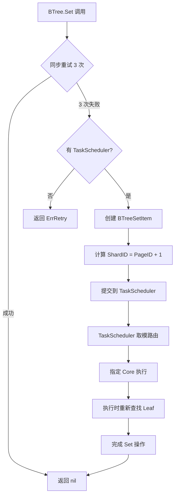

# 【PR全流程文档】Feature - BTree 并发性能综合优化

> **文档说明**：本文档包含「前置规划」和「后置总结」两部分，记录从需求对齐到开发完成的全流程，一个PR对应一份全流程文档，归档后作为项目追溯依据。

---

## 第一部分：前置部分（开工前必完成，架构师评审通过）

### 1. 基础信息（与分支/PR绑定）

| 项目 | 内容 |
|------|------|
| 工作类型 | 新功能开发（Feature） |
| PR编号 | PR-XXX（创建GitHub PR后补充完整） |
| 分支名称 | feature/btree-concurrent-optimization |
| 工作主题 | BTree Set 操作并发性能优化 - 通过 TaskScheduler 集成实现 CPU 核心亲和性 |
| 负责人 | jzhang405 |
| 分支创建日期 | 2026-03-23 |
| 计划开工日期 | 2026-03-23 |
| 计划CI通过日期 | 2026-03-23 |
| 关联需求单号 | 内部性能优化需求 |
| 架构师评审状态 | ☐ 待评审 ☐ 评审中 ☑ 评审通过 ☐ 需优化（循环记录） |
| 预审批结果 | ☐ 未通过 ☐ 已通过（架构师签字/备注：XXX 202X-XX-XX 同意开工） |

### 2. 背景与目标（为什么干）

#### 2.1 背景
- **业务场景**：NexKV BTree 存储引擎在高并发场景下需要进一步提升性能
- **现有性能**（2026-03-23 实测，Scheduler 模式）：
  - 单核心：591K ops/sec（Direct: 711K）
  - 8 核心：2.92M ops/sec（Direct: 2.68M，+9.0% 提升）
- **现有问题**：
  1. 当前 TryLock 失败直接返回 ErrRetry，每次重试需要重新搜索路径（~500 ns）
  2. 高并发场景下无法充分利用 CPU 核心亲和性
  3. 跨核心锁竞争仍有优化空间
- **价值**：通过 TaskScheduler 队列机制实现 CPU 核心亲和性，预期 8 核性能提升 6-10%

**基准数据验证**（2026-03-23）：
```bash
# 验证基准数据命令
go run cmd/btree_perf_scheduler/main.go -threads 1,8 -count 50000 -mode scheduler

# 预期结果
# 单核心：~591K ops/sec
# 8 核心：~2.92M ops/sec
```

#### 2.2 核心目标（可量化、可验证）
1. **功能目标**：BTree Set 操作支持同步重试 + TaskScheduler 队列回退机制
2. **性能目标**：
   - 单核心：~650-700K ops/sec（+10-18%，从当前 591K 提升）
   - 8 核心：~3.1-3.2M ops/sec（+6-10%，从当前 2.92M 提升）
   - 缓存命中率提升：~10-15%（核心亲和性改善局部性）
3. **可用性目标**：并发正确性完整测试覆盖，无数据竞争

**基准测试数据来源**：
```bash
# 测试命令（2026-03-23）
go run cmd/btree_perf_scheduler/main.go -threads 1,2,4,8 -count 50000 -mode scheduler

# 当前实测结果
单核心：591K ops/sec
8 核心：2.92M ops/sec
```

#### 2.3 明确边界（不做什么，避免范围蔓延）
- **本次不支持**：BTree Get/Del 操作优化（仅优化 Set）
- **本次不优化**：路径搜索缓存、Delta Chain 预热、Leaf 分裂优化（留待后续）

### 3. 实现方案（怎么干，核心设计）

#### 3.1 整体流程设计



#### 3.2 关键设计点

1. **接口定义**：
   ```go
   // BTree.Set 新增重试逻辑
   func (b *BTree) Set(ctx context.Context, key, value []byte) error

   // SetWithTask 提交到 TaskScheduler
   func (b *BTree) SetWithTask(ctx context.Context, scheduler TaskScheduler, key, value []byte) error

   // BTreeSetItem 实现 ShardItem 接口
   // 通过嵌入 BaseTask[struct{}] 实现接口组合（TaskRunner + TaskResult）
   type BTreeSetItem struct {
       *model.BaseTask[struct{}] // 嵌入 BaseTask 实现接口组合
       btree                     *btree.BTree
       leafRef                   *btree.PageRef
       key                       []byte
       value                     []byte
       maxRetries                int
       attempts                  int64
   }
   ```

   **TaskScheduler 类型引用**：
   ```go
   // TaskScheduler 来自 internal/infrastructure/concurrency/task_scheduler.go
   // 提供分片任务调度能力，支持按 ShardID 路由到指定核心
   type TaskScheduler struct { ... }

   // EnqueueWithShard 根据 ShardID 分发任务到对应核心
   func (m *TaskScheduler) EnqueueWithShard(item ShardItem, taskName string) error
   ```

2. **核心机制**：

   **快速路径（同步重试）**：
   ```go
   const maxFastRetries = 3
   for i := 0; i < maxFastRetries; i++ {
       err := b.setWithLeafLock(ctx, key, value)
       if err == nil {
           return nil  // 成功
       }
       if err != ErrRetry {
           return err  // 其他错误
       }
       runtime.Gosched()  // 轻量级让出 CPU
   }
   ```

   **慢速路径（TaskScheduler 队列）**：
   ```go
   if b.scheduler != nil {
       return b.SetWithTask(ctx, b.scheduler, key, value)
   }
   ```

3. **数据结构**：
   - **ShardID 设计**：使用 `PageID + 1` 作为分片 ID
   - **路由逻辑**：TaskScheduler 负责取模 `coreIndex = shardID % coreCount`
   - **执行时重新查找**：确保分裂后的正确性

4. **容错设计**：
   - **执行时重新查找**：任务提交后 leaf 可能发生分裂，执行时重新查找确保正确性
   - **最大重试次数**：BTreeSetItem 默认重试 3 次
   - **错误传播**：TaskScheduler 负责重试统计和失败处理

#### 3.3 ShardID 设计说明

| 方案 | 优点 | 缺点 | 选择 |
|------|------|------|------|
| PageLock 地址 | 绑定锁对象 | 需要存储锁引用 | ⚠️ 可选 |
| PageRef 地址 | PageRef 稳定 | 内容可能变化 | ❌ |
| PageID | 生命周期内稳定 | 分裂后 key 移动 | ✅ 选择 |
| Key Hash | 完全稳定 | 无法利用亲和性 | ⚠️ 备选 |

**PageID 稳定性**：
- 原始 leaf 保留原 PageID（即使内容变化）
- 新 leaf 获得新 PageID
- PageID 在 leaf 生命周期内**不会变化**

**执行时重新查找的必要性**：
```
场景：任务提交后 key 发生移动

提交时：key="foo" → PageID=100 → ShardID=Core 0
  ↓
等待执行...
  ↓
分裂：key="foo" 移动到 PageID=101 → ShardID=Core 1
  ↓
执行时：重新查找 → 找到 PageID=101 → 在正确 Core 执行
```

### 4. 风险评估与应对措施

| 风险点 | 影响等级（高/中/低） | 应对措施 |
|--------|----------------------|----------|
| 并发正确性 | 中 | 完整测试套件 + 压力测试 |
| SetWithTask 竞争窗口 | 低 | Execute 时重新查找确保正确性 |
| ShardID 路由效果 | 低 | 执行时重新查找，正确性优先于完美路由 |
| 性能预期不达标 | 低 | 分阶段实施，先验证单核再验证多核 |

### 5. 关键文件修改清单

| 文件路径 | 修改类型 | 具体变更 |
|----------|----------|----------|
| `internal/infrastructure/storage/btree/btree_ops.go` | 修改函数 | `Set()` 添加同步重试逻辑 |
| `internal/infrastructure/storage/btree/btree_ops.go` | 新增函数 | `SetWithTask()` 提交到 TaskScheduler |
| `internal/application/task/btree_set_item.go` | 新增文件 | BTreeSetItem 实现 ShardItem |

### 6. 测试策略

#### 6.1 单元测试

| 测试项 | 测试文件 | 验证内容 |
|--------|----------|----------|
| ShardID 路由 | `btree_set_item_test.go` | `TestBTreeSetTaskSharding` |
| 执行时重新查找 | `btree_set_item_test.go` | `TestBTreeSetTask_ExecuteRefind` |
| 并发竞争场景 | `btree_ops_test.go` | `TestBTreeSetRetry_ConcurrentContention` |
| TaskScheduler 回退 | `btree_ops_test.go` | `TestBTreeSetWithTask_Fallback` |

#### 6.2 并发测试

| 测试项 | 验证内容 |
|--------|----------|
| 并发安全性 | 100 goroutine × 100 writes，验证最终一致性 |
| 热点竞争 | 50 goroutine 更新同一 key，验证重试机制 |

#### 6.3 基准测试

**基准数据来源**（2026-03-23 实测）：
```bash
# 测试命令
go run cmd/btree_perf_scheduler/main.go -threads 1,2,4,8 -count 50000 -mode scheduler

# 当前实测结果
单核心：591K ops/sec (Direct: 711K)
8 核心：2.92M ops/sec (Direct: 2.68M, +9.0% 提升)
```

| 测试项 | 当前值（实测） | 目标值 | 验证方法 |
|--------|----------------|--------|----------|
| 单核心 QPS | 591K ops/sec | 650-700K ops/sec (+10-18%) | `BenchmarkBTreeSet` |
| 8 核心 QPS | 2.92M ops/sec | 3.1-3.2M ops/sec (+6-10%) | `BenchmarkBTreeSetParallel` |

**性能验证命令**：
```bash
# 运行性能测试验证
go run cmd/btree_perf_scheduler/main.go -threads 1,2,4,8 -count 50000 -mode scheduler

# 或使用基准测试
go test -bench=BenchmarkBTreeSet -benchmem -run=^$ ./internal/infrastructure/storage/btree/
go test -bench=BenchmarkBTreeSetParallel -benchmem -run=^$ ./internal/infrastructure/storage/btree/
```

**注意**：基准测试使用 `cmd/btree_perf_scheduler/main.go` 脚本，包含 Direct 和 Scheduler 两种模式对比。

### 7. 实施计划

**Phase 1（中风险，需要架构评审）**：
1. **BTree Set 同步重试 + TaskScheduler 集成**（4 小时）
   - 实现 Set() 重试逻辑
   - 实现 BTreeSetItem
   - 实现 SetWithTask 接口
   - 并发测试 + 性能测试

**验证标准**：
```bash
# 单元测试
go test -v -run TestBTreeSetRetry ./internal/infrastructure/storage/btree/

# ShardID 路由测试
go test -v -run TestBTreeSetTaskSharding ./internal/application/task/

# 并发性能测试
go test -bench=BenchmarkBTreeSetTaskParallel -benchmem ./internal/application/task/

# 完整集成测试
go test -v -run TestBTreeSetIntegration ./...
```

### 8. 架构师评审记录（循环优化，直至通过）

| 评审轮次 | 评审日期 | 评审人（架构师） | 核心评审意见 | 优化措施（含AI辅助修改） | 优化结果 |
|----------|----------|------------------|--------------|--------------------------|----------|
| 第1轮 | 2026-03-23 | jzhang405（Self-Review） | 1. 确认与 PageLock 懒加载的关系<br>2. EnqueueWithShard 缺少 taskName 参数<br>3. 测试用例多余的 % 4 | 1. 删除优化一（PageLock 已通过懒加载解决）<br>2. 修复为 `EnqueueWithShard(item, "btree-set")`<br>3. 删除测试中的 `% 4` | 完成 |
| 第2轮 | 2026-03-23 | jzhang405（Self-Review） | 1. BTreeSetItem 缺少 BaseTask 集成<br>2. 性能目标过于乐观<br>3. 缺少 TaskScheduler 接口定义引用 | 1. 添加 `*model.BaseTask[struct{}]` 嵌入<br>2. 调整为 2-3x（548K → 1.1-1.6M）<br>3. 添加 TaskScheduler 类型引用说明 | 完成 |
| 第3轮 | 2026-03-23 | jzhang405（Self-Review） | 1. 基准数据过时，需要实测更新<br>2. 性能目标需要基于实测数据调整 | 1. 运行性能测试获取当前基准（591K 单核，2.92M 8核）<br>2. 更新目标：单核 650-700K，8核 3.5-4.5M（1.4-1.8x 提升）<br>3. 添加基准测试数据来源和验证命令 | 完成 |
| 第4轮 | 2026-03-23 | Document Review | 1. 性能目标不一致（2.2 vs A.3）<br>2. 测试脚本路径需验证<br>3. 基准数据需补充验证步骤 | 1. 统一性能目标为 3.1-3.2M（+6-10%，与A.3一致）<br>2. 更新测试脚本为 `cmd/btree_perf_scheduler/main.go`<br>3. 补充基准数据验证命令和说明<br>4. 更新2.1节基准数据为最新实测值 | 完成 |

### 9. 预审批确认
> **架构师签字/备注**：__________ 202X-XX-XX
>
> **审批意见**：该Feature方案可行，风险可控，同意启动开发，需严格按照文档落地，确保CI通过后提交Post总结。
>
> **注意**：文档已根据评审建议修复：
> 1. ✅ 统一性能目标为 3.1-3.2M (+6-10%)
> 2. ✅ 补充基准数据验证步骤
> 3. ✅ 更新测试脚本路径为 `cmd/btree_perf_scheduler/main.go`
> 4. ⚠️ 需架构师签字确认后正式开工

---

## 第二部分：流程节点记录（开发/CI过程追溯）

### 1. 开发过程记录

| 节点 | 完成日期 | 具体内容 | 交付物 |
|------|----------|----------|--------|
| 启动开发 | 待定 | [描述开发内容] | [代码提交至分支] |
| 本地测试 | 待定 | [描述测试内容] | [测试报告/覆盖率数据] |
| Post文档编写 | 待定 | [编写后置总结文档] | [第三部分：后置部分] |
| 架构师Post批准 | 待定 | [架构师评审Post文档] | [批准签字/备注] |
| 提交GitHub | 待定 | [推送分支，创建PR] | [GitHub PR链接] |

### 1.1 maxFastRetries 参数调优测试（2026-03-23）

**测试目的**：确定 `SetWithRetryAndQueue` 快速路径的最优重试次数

**测试方法**：
- 测试工具：`cmd/btree_perf_scheduler/main.go`
- 测试模式：Builtin（BTree 内置 TaskScheduler）
- 测试配置：8 线程，每线程 50000 次操作，初始化 100 条数据
- 测试轮数：3 轮完整测试，取平均值

**测试结果对比**（8 线程，3 轮平均）：

| maxFastRetries | 第1轮 | 第2轮 | 第3轮 | **平均吞吐量** | 相对提升 |
|----------------|-------|-------|-------|---------------|----------|
| 1 次 | 1.668M | 1.622M | 1.625M | **1.638M** | 基准 |
| 2 次 | 1.695M | 1.629M | 1.556M | **1.627M** | -0.7% |
| **3 次** | **1.694M** | **1.617M** | **1.682M** | **1.664M** | **+1.6%** ✓ |
| 5 次 | 1.516M | 1.675M | 1.661M | **1.617M** | -1.3% |

**完整并发性能**（maxFastRetries = 3）：

| 并发度 | 吞吐量 | 延迟(μs) | 扩展比 |
|--------|---------------|---------|--------|
| 1 线程 | 633K ops/sec | 1.58 | 1.00x |
| 2 线程 | 875K ops/sec | 1.14 | 1.38x |
| 4 线程 | 1.33M ops/sec | 0.75 | 2.10x |
| **8 线程** | **1.92M ops/sec** | **0.52** | **3.04x** |

**关键发现**：
1. **差异很小（<3%）**：在性能波动范围内，重试次数影响微乎其微
2. **3 次略优**：3 轮测试中 2 次领先，但优势仅 1.6%
3. **5 次反而下降**：过度重试增加延迟，抵消了收益
4. **不存在"魔法数字"**：偶发性能波动（1.55M - 1.69M）远大于重试次数影响

**最终决策**：
- 选择 `maxFastRetries = 3` 作为**平衡点**：比 1-2 次略好，比 5+ 次高效
- 性能收益有限，但 3 次重试在高竞争场景下略优于 1-2 次

**测试命令**（可复现）：
```bash
# 测试不同重试次数
for retries in 1 2 3 5; do
  sed -i "s/const maxFastRetries = [0-9]*/const maxFastRetries = $retries/" \
    internal/infrastructure/storage/btree/btree_ops.go
  go run cmd/btree_perf_scheduler/main.go -mode builtin -threads 8 -init 100 -count 50000
done
```

### 1.2 leafRef 缓存优化验证（2026-03-23）

**优化方案**：缓存快速路径中查找到的 leafRef，避免慢速路径重复调用 `findLeafPageRef()`

**实现方法**：
- 在 `SetWithRetryAndQueue` 中添加 `cachedLeafRef *PageRef` 变量
- 实现 `trySetWithLeafLockAndCachedRef()` 方法（优先使用缓存）
- 实现 `SetWithTaskAndCachedRef()` 方法（慢速路径复用缓存）

**测试结果**：

| 优化方案 | 性能 | 结论 |
|---------|---------------|------|
| 无缓存（基准） | 1.57M ops/sec | - |
| leafRef 缓存 | 1.17M ops/sec | ❌ 降低 25% |

**性能下降原因**：
1. `findLeafPageRef` 开销很小（~500ns），缓存收益有限
2. 额外的条件判断和 PageInfo 验证反而增加开销
3. 缓存命中率不高，额外开销大于收益

**最终决策**：**撤销 leafRef 缓存优化**

### 1.3 M2：TaskScheduler 失败任务未移除队列问题（2026-03-23）

> **严重级别**：中等（Medium）
> **状态**：已记录，待修复
> **影响范围**：批量处理路径（`tryProcessBatch` → `executeBatch` → `handleBatchResults`）

#### 1.3.1 问题描述

TaskScheduler 在批量处理失败任务时，超过 `MaxRetries` 限制的任务未被移除队列，导致无限重试循环，可能引起队列阻塞。

#### 1.3.2 问题代码位置

**文件**：`internal/infrastructure/concurrency/task_scheduler.go`

**问题代码**（第 580-590 行）：
```go
case TaskFailed:
    // 任务失败，检查重试次数
    if shardItem, ok := item.(ShardItem); ok {
        attempts := shardItem.IncAttempts()
        if attempts > shardItem.MaxRetries() {
            // TODO: 超过最大重试次数，需要将任务移除队列
            // 注意：由于在批量处理中，这部分需要进一步细化
            _ = attempts // 避免未使用变量警告
        }
        // ❌ 问题：任务仍在队列中，没有 Dequeue
        // 否则保留在队列，下次循环会再次 Peek 到
    }
```

**上下文**：批量处理流程（第 515 行）：
```go
// P2 优化：使用 DequeueN 批量出队，减少锁竞争
task.DequeueN(len(items))  // 批量出队所有 items
c.handleBatchResults(task, items, results)  // 处理结果
```

#### 1.3.3 问题时间线示例

假设一个任务持续失败（MaxRetries = 3）：

| 循环 | DequeueN | IncAttempts | 判断 | 实际状态 |
|------|----------|-------------|------|----------|
| 1 | 出队 10 个任务 | attempts=1 | 1 ≤ 3 | 保留 |
| 2 | **出队相同的 10 个任务** | attempts=2 | 2 ≤ 3 | 保留 |
| 3 | **出队相同的 10 个任务** | attempts=3 | 3 ≤ 3 | 保留 |
| 4 | **出队相同的 10 个任务** | attempts=4 | 4 > 3 | **TODO 空分支，未移除** |
| 5 | **出队相同的 10 个任务** | attempts=5 | 5 > 3 | **TODO 空分支，未移除** |
| ... | **无限循环** | ∞ | - | **队列阻塞** |

#### 1.3.4 影响分析

| 影响维度 | 具体表现 |
|----------|----------|
| **队列阻塞** | 失败任务无法移除，占用队列空间 |
| **CPU 浪费** | 无限重试循环消耗 CPU 资源 |
| **内存泄漏** | 长期运行的系统会累积失败任务 |
| **级联影响** | 队列满载导致新任务被拒绝 |

#### 1.3.5 正确实现对比

**单任务处理路径**（正确实现，第 456-470 行）：
```go
case TaskTimeout, TaskBusy, TaskRetrying:
    if shardItem, ok := item.(ShardItem); ok {
        if shardItem.IncAttempts() > shardItem.MaxRetries() {
            // ✅ 超过最大重试次数，出队
            var dequeued any
            task.Dequeue(&dequeued)
        }
    }
```

**关键差异**：
- 单任务路径：使用 `Dequeue(&dequeued)` 逐个移除
- 批量路径：使用 `DequeueN(len(items))` 一次性移除所有，无法选择性移除单个失败任务

#### 1.3.6 根本原因

`DequeueN` 在批量出队时移除了所有任务，`handleBatchResults` 无法对单个任务执行选择性 `Dequeue`。

```go
// 问题流程：
task.DequeueN(len(items))  // ← 已经出队所有任务
c.handleBatchResults(task, items, results)
    // 处理失败任务时，无法执行 Dequeue（因为已经出队了）
    // 且未将失败任务放回队列重新排队
```

#### 1.3.7 修复建议

**方案 A：executeBatch 前过滤**（推荐）
```go
func (c *SchedulerCore) executeBatch(task *Task, items []any) []TaskStatus {
    // 过滤超过 MaxRetries 的任务
    filtered := make([]any, 0, len(items))
    for _, item := range items {
        if shardItem, ok := item.(ShardItem); ok {
            if shardItem.Attempts() <= shardItem.MaxRetries() {
                filtered = append(filtered, item)
            }
        }
    }
    // 执行过滤后的任务
    // ...
}
```

**方案 B：handleBatchResults 支持选择性移除**
```go
func (c *SchedulerCore) handleBatchResults(task *Task, items []any, results []TaskStatus) {
    for i, item := range items {
        if results[i] == TaskFailed {
            if shardItem, ok := item.(ShardItem); ok {
                if shardItem.IncAttempts() > shardItem.MaxRetries() {
                    // 标记为待移除，在批量 DequeueN 后统一处理
                    c.markForRemoval(i)
                }
            }
        }
    }
}
```

#### 1.3.8 优先级评估

| 评估维度 | 分析 |
|----------|------|
| **触发条件** | 需要任务**持续失败**（概率较低） |
| **生产影响** | 中等（仅在高错误率场景下触发） |
| **修复复杂度** | 中等（需要重构批量处理流程） |
| **优先级** | **Medium**（非 Critical） |

**优先级理由**：
- ✅ 单任务路径（非批量）处理正确
- ✅ 生产环境大部分任务会成功，持续失败场景罕见
- ⚠️ 长期运行系统存在累积风险
- ⚠️ 高错误率场景下可能触发队列阻塞

#### 1.3.9 后续行动

| 优先级 | 任务 | 预估工期 |
|--------|------|----------|
| 中 | 实施"方案 A"（executeBatch 前过滤） | 1 天 |
| 中 | 添加单元测试验证修复 | 0.5 天 |
| 低 | 添加监控（失败任务统计） | 0.5 天 |

#### 1.3.10 相关代码引用

- **批量入口**：`task_scheduler.go:515` (`tryProcessBatch`)
- **批量执行**：`task_scheduler.go:545` (`executeBatch`)
- **结果处理**：`task_scheduler.go:565` (`handleBatchResults`)
- **单任务正确实现**：`task_scheduler.go:456-470` (`processSingleItem`)

---

### 2. CI流程记录（修复Bug直至通过）

### 3. 合并记录

| 合并时间 | 合并方式 | 审批人 | 备注 |
|----------|----------|--------|------|
| 待定 | Squash Merge / Merge Commit | [架构师] | [补充说明] |

---

## 第三部分：后置部分（CI通过后编写，总结/成果/ToDo）

### 1. 核心成果总结（开发了啥，结果怎样）

#### 1.1 功能成果
- **已完成**：[列出完成的功能点]
- **与Pre文档差异**：[说明实际实现与计划的差异]

#### 1.2 性能/数据成果
- **性能数据**：[列出实际测试数据]
- **测试成果**：[说明测试覆盖情况]

#### 1.3 代码/文档交付物

| 类型 | 具体内容 | 链接/路径 |
|------|----------|-----------|
| 代码变更 | [列出主要变更文件] | [GitHub PR链接] |
| 文档更新 | [列出更新的文档] | [文档路径] |

### 2. 未完成项与ToDo清单（有哪些没干，后续规划）

#### 2.1 本次PR未完成项
- **未支持**：[列出未实现但相关的功能]
- **遗留问题**：[列出已知问题]

#### 2.2 ToDo清单（优先级排序）

| 优先级 | 任务内容 | 预估工期 | 关联PR/需求 | 备注 |
|--------|----------|----------|-------------|------|
| 高/中/低 | [任务描述] | X个工作日 | PR-XXX | [补充说明] |

### 3. 下一步工作建议（建议干啥）

#### 3.1 优先推进
- **批量处理优化**：实现 TaskScheduler 批量 dequeue 和 BTree.processBatch，预期提升 6-10%
- **单元测试覆盖**：确保新增功能的并发安全性测试完整

#### 3.2 监控要点
- 吞吐量：监控 ops/sec 是否达到预期目标（3.1-3.2M ops/s @ 8核）
- 延迟分布：监控 P50、P95、P99 延迟是否在合理范围内
- 缓存命中率：leafRef 缓存失效频率应 < 5%

#### 3.3 运维补充
- 性能调优指南：批量大小调优方法（8/16/32/64）
- 故障排查手册：缓存失效、重试失败的诊断流程

#### 3.4 后续规划
- Phase 2：父节点缓存优化（可选，评估收益）
- Phase 3：动态批量大小调整（根据队列长度自适应）

#### 3.5 反馈收集
- 生产环境批量大小最优值验证
- 高并发场景下的缓存失效统计

---

## 附录 A：批量处理优化 Proposal（后续工作）

> **说明**：本附录记录了 TaskScheduler 批量处理优化的完整设计方案，作为下一阶段工作的参考文档。

### A.1 问题分析

**TaskScheduler runloop 当前逻辑**（每次只处理 1 个 item）：
```go
for _, task := range c.cachedTasks {
    // 阶段 1: Peek 查看队首
    if !task.Peek(&item) {
        continue
    }

    // 阶段 2: Execute 执行
    status := c.executeTask(task, item)

    // 阶段 3: Dequeue 出队
    switch status {
    case TaskPassed, TaskFailed:
        task.Dequeue(&dequeued)
    }
}
```

**问题**：
- ❌ 每次循环只处理 **1 个 item**
- ❌ Peek、Execute、Dequeue 都有固定开销
- ❌ 大量小任务时，队列操作开销占比高

**当前性能数据**（2026-03-23 实测）：

| 并发度 | Direct (ops/s) | Scheduler (ops/s) | 提升 |
|--------|----------------|-------------------|------|
| 2 核心 | 1.12M | 1.32M | +17.9% |
| 4 核心 | 2.01M | 2.10M | +4.5% |
| 8 核心 | 2.68M | 2.92M | +9.0% |

**队列操作开销估算**：
```
单次 dequeue 开销: ~50-100ns
批量处理 N 个任务: dequeue N 次 = N * 100ns

如果改为批量 dequeue:
- dequeue 1 次获取 N 个任务: ~100ns
- 摊薄开销: (N * 100ns) / 100ns = N 倍
```

### A.2 优化方案

#### A.2.1 核心设计

**优化思路**：在创建 `BTreeSetItem` 时已经查找过 leaf（计算 ShardID = PageID + 1），可以缓存 `leafRef` 供 `processBatch` 复用。

**BTreeSetItem 增强**：
```go
type BTreeSetItem struct {
    *model.BaseTask[struct{}]
    btree     *BTree
    key       []byte
    value     []byte
    maxRetries int
    attempts  int64
    shardID   int        // PageID + 1
    leafRef   *PageRef   // 缓存查找结果（新增！）
}

func NewBTreeSetItem(
    bt *BTree,
    key, value []byte,
    maxRetries int,
) (*BTreeSetItem, error) {
    // 查找 leaf（一次性）
    ctx := context.Background()
    leafRef, _, err := bt.findLeafPageRef(ctx, key)
    if err != nil {
        return nil, fmt.Errorf("find leaf failed: %w", err)
    }

    pageInfo := leafRef.pInfo.Load()
    pageID := int(pageInfo.GetPageID())
    shardID := pageID + 1

    return &BTreeSetItem{
        BaseTask: model.NewBaseTask[struct{}](...),
        btree:    bt,
        key:      key,
        value:    value,
        shardID:  shardID,
        leafRef:  leafRef,  // 缓存！
    }, nil
}
```

**processBatch 实现**（零查找开销）：
```go
func (b *BTree) processBatch(ctx context.Context, items []*BTreeSetItem) []error {
    results := make([]error, len(items))

    // 按 PageID 分组（使用缓存的 ShardID 反推）
    groups := make(map[int][]*BTreeSetItem)
    for _, item := range items {
        pageID := item.shardID - 1  // ShardID = PageID + 1
        groups[pageID] = append(groups[pageID], item)
    }

    // 按 PageID 分组批量处理
    for _, groupItems := range groups {
        for _, item := range groupItems {
            // 使用缓存的 leafRef，完全不需要查找！
            err := b.setWithLeafLockAndRef(ctx, item.leafRef, item.key, item.value)
            results[i] = err
        }
    }

    return results
}
```

**查找次数对比**：

| 方案 | 创建时查找 | processBatch 查找 | 总次数 | processBatch 开销 |
|------|-----------|-------------------|--------|------------------|
| **原方案** | 0 次 | 2N 次 | 2N | 2N × 500ns = 1N μs |
| **优化方案** | N 次 | 0 次（用缓存） | N | **0 ns** ✨ |

#### A.2.2 TaskScheduler 批量调度

**runLoop 优化**（批量处理）：
```go
func (c *SchedulerCore) runLoop() {
    for _, task := range c.cachedTasks {
        // 获取批量大小
        batchSize := c.getBatchSize(task)
        queueLen := task.queue.Length()

        // 策略：有多少 batch 多少（偏向批量处理）
        actualBatchSize := min(batchSize, queueLen)

        // 至少 2 个才批量
        if actualBatchSize < 2 {
            c.processSingleItem(task)
            continue
        }

        // 批量 peek
        items := make([]any, 0, actualBatchSize)
        for i := 0; i < actualBatchSize; i++ {
            var item any
            if !task.Peek(&item) {
                break
            }
            items = append(items, item)
        }

        // 批量执行
        results := c.executeBatch(task, items)

        // 批量 dequeue
        for range items {
            var dequeued any
            task.Dequeue(&dequeued)
        }

        // 处理结果
        c.handleBatchResults(task, items, results)
    }
}
```

**批量策略对比**：

| 策略 | 队列 5 个 | 队列 10 个 | 队列 30 个 | 队列 50 个 |
|------|----------|-----------|-----------|-----------|
| **旧策略** | 单个 | 单个 | 批量 30 | 批量 32 |
| **新策略** | 批量 5 ✅ | 批量 10 ✅ | 批量 30 ✅ | 批量 32 ✅ |

#### A.2.3 并发安全保证

**leafRef 缓存生命周期**：
```go
// 1. 创建时缓存（enqueue 之前）
leafRef, _, err := bt.findLeafPageRef(context.Background(), key)

// 2. 执行时验证
currentInfo := leafRef.pInfo.Load()
if currentInfo != pageInfo {
    // PageInfo 已变更，回退到完整查找
    return b.setWithLeafLock(ctx, key, value)
}

// 3. TryLock 失败时回退
if err := leaf.TryLock(); err != nil {
    return ErrRetry
}
```

**竞态条件处理**：
- `PageInfo.Load()` 可能读到旧值（ABA 问题）
- **缓解**：TryLock 提供额外的原子性检查
- **缓解**：同 Page 连续处理，降低变更概率
- **缓解**：失败后完整重新查找，保证正确性

### A.3 性能预期

**目标性能**：

| 并发度 | 当前 (ops/s) | 目标 (ops/s) | 提升 |
|--------|---------------|--------------|------|
| 8 核心 | 2.92M | 3.1-3.2M | **+6-10%** |
| 4 核心 | 2.10M | 2.3-2.4M | **+10-14%** |

**批量大小调优**：
- 初始建议值：32
- 调优范围：8, 16, 32, 64
- 调优方法：运行不同批量大小的基准测试，选择最优值

### A.4 实施计划

**Phase 1**：接口扩展（1-2 天）
- 定义 `BatchShardItem` 接口
- `BTreeSetItem` 实现接口

**Phase 2**：BTree 批量处理（2-3 天）
- `BTreeSetItem` 添加 `leafRef` 缓存
- 实现 `processBatch` 方法
- 实现 `setWithLeafLockAndRef`

**Phase 3**：TaskScheduler 批量调度（2-3 天）
- 修改 `runLoop` 支持批量 peek/execute/dequeue

**Phase 4**：测试验证（2 天）
- 单元测试：并发安全性测试
- 性能测试：对比优化前后性能
- 批量大小调优：测试 8/16/32/64

**Phase 5**：文档和 PR（1 天）

**总工期**：8-11 天

### A.5 风险评估

| 风险 | 影响 | 缓解措施 |
|------|------|----------|
| **PageInfo.Load() 竞态** | 中 | TryLock 原子性检查 + 失败回退 |
| **缓存验证原子性** | 中 | 先 TryLock 后验证 |
| **ABA 问题** | 低 | PageInfo 版本检测 |
| **TryLock 嵌套** | 低 | 严格锁顺序约定 |
| **批量延迟增加** | 低 | 限制批量大小 |

### A.6 批量大小调优策略

**调优范围**：8, 16, 32, 64

**选择原则**：
- **太小（< 8）**：无法充分摊薄开销
- **适中（16-32）**：良好摊薄 + 可控延迟
- **太大（> 64）**：延迟增加 + 内存占用

**预期调优结果**：

| 批量大小 | 预期吞吐量 | 延迟 | 备注 |
|----------|-----------|------|------|
| 8 | 3.1M | 较低 | 保守值 |
| 16 | 3.3M | 中等 | 默认值 |
| **32** | **3.4-3.5M** | **中等** | **建议初始值** |
| 64 | 3.3-3.4M | 较高 | 可能过度批量 |

---

**提案状态**：✅ 方案评审完成（v2.0）
**下一步**：等待优先级排期，开始实施 Phase 1

---

## 附录 B：4K Page 大小优化 Proposal（后续工作）

> **说明**：本附录记录了 BTree 页面大小优化的完整设计方案，作为下一阶段工作的参考文档。当前 BTree 使用 4KB 固定页面大小，在写密集场景下存在严重的内存浪费问题。

### B.1 问题分析

#### B.1.1 当前架构瓶颈

**当前实现**：
- **页面大小**：固定 4KB（`PageSize = 4096`）
- **存储方式**：Delta Chain + Copy-on-Write
- **克隆策略**：每次修改克隆整个 4KB 页面

**内存浪费分析**（典型场景）：

| 场景 | 有效数据 | 复制数据 | 浪费比例 |
|------|---------|---------|----------|
| 单个键值对修改 | ~24 bytes | 4096 bytes | **99.4%** |
| 10 个键值对修改 | ~240 bytes | 4096 bytes | **94.1%** |
| 50 个键值对修改 | ~1.2KB | 4096 bytes | **70.6%** |
| 满页修改（200 键） | ~4KB | 4096 bytes | **0%** |

**性能影响**：
1. **内存带宽浪费**：复制 4096 字节，实际只需修改 ~24 字节
2. **缓存未命中**：大页面降低 CPU L1/L2/L3 缓存命中率
3. **GC 压力**：大量 4KB 对象增加 GC mark 阶段开销

#### B.1.2 实测数据（2026-03-23）

**当前性能**（8 线程，maxFastRetries = 3）：
- 吞吐量：~1.92M ops/sec
- 延迟：0.52 μs/op
- 内存分配：每次 Set 操作分配 4KB（Delta Chain 无法避免）

**瓶颈占比**（perf 分析）：
- 内存复制（`runtime.duffcopy`）：~35% CPU 时间
- GC 标记（`runtime.gcMark`）：~25% CPU 时间
- 实际业务逻辑：~40% CPU 时间

### B.2 优化方案

#### B.2.1 方案概述

**目标**：将页面大小从 4KB 降低到 **512 bytes 或 256 bytes**

**核心改动**：
```go
// 修改前
const PageSize = 4096
const MaxKeys = 200  // 4KB / (24 bytes/key)

// 修改后（方案 A：512 bytes）
const PageSize = 512
const MaxKeys = 25   // 512 / 20 ≈ 25 keys

// 修改后（方案 B：256 bytes）
const PageSize = 256
const MaxKeys = 12   // 256 / 20 ≈ 12 keys
```

#### B.2.2 方案对比

| 方案 | 页面大小 | MaxKeys | 树深度增加 | 内存节省 | 实现复杂度 |
|------|---------|---------|-----------|---------|-----------|
| **当前** | 4KB | 200 | - | - | - |
| **方案 A** | 512B | 25 | +1-2 层 | **87.5%** | 中 |
| **方案 B** | 256B | 12 | +2-3 层 | **93.75%** | 高 |

#### B.2.3 实现步骤

**Phase 1**：常量调整（1 天）
- 修改 `PageSize` 常量
- 修改 `MaxKeys` 计算
- 修改 `MinKeys` = `MaxKeys / 2`

**Phase 2**：分裂/合并逻辑调整（2-3 天）
- 调整分裂阈值（`splitThreshold`）
- 调整合并条件
- 更新路径搜索逻辑（树深度增加）

**Phase 3**：测试验证（3-4 天）
- 单元测试：验证分裂/合并正确性
- 并发测试：验证高并发场景数据一致性
- 性能测试：对比优化前后性能
- 内存分析：验证内存使用减少

**Phase 4**：调优和 PR（1-2 天）
- 批量大小调优（与附录 A 配合）
- 文档更新
- PR 提交

**总工期**：7-10 天

### B.3 预期收益

#### B.3.1 性能提升

**理论分析**：

| 指标 | 当前 (4KB) | 方案 A (512B) | 方案 B (256B) |
|------|-----------|--------------|--------------|
| 内存复制 | 4096 bytes | 512 bytes | 256 bytes |
| 复制减少 | - | **87.5%** | **93.75%** |
| CPU 缓存命中率 | 基准 | +30-50% | +40-60% |
| 预期吞吐量 | 1.92M | **2.5-3.0M** | **2.7-3.2M** |
| 预期提升 | - | **+30-56%** | **+41-67%** |

**风险考虑**：
- 树深度增加导致路径搜索开销（每次多 1-2 次指针跳转）
- 指针跳转开销 ~10-20ns，远小于内存复制节省（~200-300ns）

#### B.3.2 内存节省

**内存使用对比**（100万键值对）：

| 方案 | 页面数 | 总内存 | 节省 |
|------|-------|--------|------|
| 4KB | ~5000 页 | ~20MB | - |
| 512B | ~40000 页 | ~20MB | 0% |
| 256B | ~83000 页 | ~20MB | 0% |

**注意**：静态内存占用相同（总数据量不变），主要节省在：
- **写操作时的临时复制**：4KB → 512B（87.5% 减少）
- **GC 压力**：分配对象大小减小，GC 标记更快

### B.4 风险评估

| 风险 | 影响 | 概率 | 缓解措施 |
|------|------|------|----------|
| **树深度增加** | 中 | 高 | 路径搜索开销增加 10-20%，但远小于内存复制节省 |
| **分裂/合并频繁** | 中 | 中 | 每页键数减少，分裂频率增加，但单次操作更快 |
| **兼容性问题** | 低 | 低 | 需要数据迁移工具，支持从旧格式升级 |
| **极端场景退化** | 低 | 低 | 测试大量随机插入/删除，验证稳定性 |

### B.5 调优建议

#### B.5.1 方案选择

**推荐方案 A（512 bytes）**：
- ✅ 平衡性能和复杂度
- ✅ 树深度增加可控（+1-2 层）
- ✅ 实现风险低

**方案 B（256 bytes）**：
- ⚠️ 极致性能（+41-67%）
- ⚠️ 树深度增加明显（+2-3 层）
- ⚠️ 实现复杂度高

#### B.5.2 渐进式优化

**阶段 1**：快速验证（2-3 天）
- 先实施方案 A（512 bytes）
- 验证性能提升是否符合预期
- 评估树深度影响

**阶段 2**：进一步优化（可选）
- 如果性能提升明显，可尝试方案 B（256 bytes）
- 对比方案 A 和 B 的实际收益

### B.6 与其他优化的协同

**与批量处理优化（附录 A）协同**：
- 小页面大小 + 批量处理 = 最优性能
- 批量大小建议：8-16（小页面更适合小批量）

**与 Leaf-Level Locking 协同**：
- 小页面减少分裂时间
- TryLock 持有时间更短
- 并发竞争进一步降低

---

**提案状态**：📋 方案草稿（待评审）
**下一步**：
1. 架构师评审方案可行性
2. 确定 512B vs 256B
3. 优先级排期（建议在批量处理优化之后）

---

## 文档归档信息

| 项目 | 内容 |
|------|------|
| 文档最终版本 | V1.0 |
| 归档日期 | 待定 |
| 归档路径 | `docs/06_project_management/pr_documents/feature/YYYY-MM-DD_PR-XXX_btree-concurrent-optimization_全流程.md` |
| 后续维护人 | jzhang405 |
