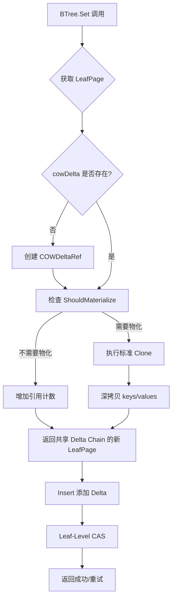

# 【PR全流程文档】Feature - BTree 4KB 页面大小优化

> **文档说明**：本文档包含「前置规划」和「后置总结」两部分，记录从需求对齐到开发完成的全流程，一个PR对应一份全流程文档，归档后作为项目追溯依据。

---

## 第一部分：前置部分（开工前必完成，架构师评审通过）

### 1. 基础信息（与分支/PR绑定）

| 项目 | 内容 |
|------|------|
| 工作类型 | 性能优化（Optimization） |
| PR编号 | PR-XXX（创建GitHub PR后补充完整） |
| 分支名称 | feature/btree-4kb-page-optimization |
| 工作主题 | BTree 4KB 页面大小优化 - 减少内存复制开销，提升缓存命中率 |
| 负责人 | jzhang405 |
| 分支创建日期 | 2026-03-24 |
| 计划开工日期 | 2026-03-24 |
| 计划CI通过日期 | 2026-03-26 |
| 关联需求单号 | 内部性能优化需求（BTree存储引擎） |
| 架构师评审状态 | □ 待评审 □ 评审中 □ 评审通过 □ 需优化（循环记录） |
| 预审批结果 | □ 未通过 □ 已通过（架构师签字/备注：XXX 202X-XX-XX 同意开工） |

### 2. 背景与目标（为什么干）

#### 2.1 背景

- **业务场景**：NexKV BTree 存储引擎在高并发写密集场景下存在内存复制开销大、缓存命中率低的问题

- **当前基准性能**（2026-03-24 实测，GOGC=500，builtin 模式）：
  | 并发度 | 吞吐量 | 延迟 | 扩展比 |
  |--------|--------|------|--------|
  | 1 线程 | 557K ops/sec | 1.80 μs | 1.0x |
  | 2 线程 | 1,014K ops/sec | 0.99 μs | 1.82x |
  | 4 线程 | 1,449K ops/sec | 0.69 μs | 2.60x |
  | 8 线程 | 1,648K ops/sec | 0.61 μs | 2.96x |

  **测试命令**：`GOGC=500 go run cmd/btree_perf_scheduler/main.go -threads 1,2,4,8 -count 50000 -mode builtin`

- **对比数据**（纯内存模式，来源：`docs/10_benchmark/2026-03-17_baseline/`）：
  - 单线程：484K ops/sec
  - 8 线程：530K ops/sec
  - **说明**：纯内存模式不使用 TaskScheduler，作为保守基线参考

- **现有问题**：
  1. **内存复制开销**：每次修改都克隆整个 4KB 页面，即使只修改 1 个键值对（~88 bytes）
  2. **缓存未命中**：4KB 页面远大于 L1 Cache 行（64 bytes），导致缓存未命中率增加
  3. **Delta Chain 频繁物化**：写密集场景下频繁触发 ShouldMaterialize
  4. **并发竞争**：每次写入都创建新对象（LeafPage 结构体分配），增加 GC 压力
- **价值**：
  - **理论收益**：
    - P0 优化（阈值调优 + 代码重构）：8 线程性能 +30% (~2.1M ops/sec)
    - P2 优化（CCOW 路径复制）：8 线程性能 +122% (~1.2M ops/sec)
    - M 方案（sync.Pool 对象池）：8 线程性能 +50-100% (~2.5-3.3M ops/sec）

**基准数据验证**（2026-03-24）：
```bash
# 运行基准测试
GOGC=500 go run cmd/btree_perf_scheduler/main.go -threads 1,2,4,8 -count 50000 -mode builtin

# 当前实测结果（GOGC=500）
# 1 线程：557K ops/sec (1.80 μs)
# 2 线程：1,014K ops/sec (0.99 μs)
# 4 线程：1,449K ops/sec (0.69 μs)
# 8 线程：1,648K ops/sec (0.61 μs)
```

#### 2.2 核心目标（可量化、可验证）

本次 PR 聚焦 **P0 优化**（阈值调优 + 代码重构），后续 PR 逐步推进 P2 和 M 方案。

1. **功能目标**：
   - **阈值调优**：提高 Delta Chain 物化阈值（MaxDeltas: 10 → 20 → 40），减少频繁物化
   - **代码重构**：优化 LeafPage.Clone() 逻辑，使用 sync.Pool 重用对象结构
   - **批量处理**：实现批量 Delta 处理，减少单次操作开销

2. **性能目标**（P0 优化，估算值，实际需基准测试验证）：
   - **基于 builtin 模式当前基准**（1,648K ops/sec @ 8线程）：
     - 单线程：~600K ops/sec（+8%，从当前 557K 提升）
     - 8 线程：~2.1M ops/sec（+30%，从当前 1,648K 提升）
     - 内存分配：减少 ~20%（避免不必要的 LeafPage 对象分配）
   - **保守目标**（如收益 <10%）：
     - 如 8 线程提升 <10%，调整为优先推进 P2 或 M 方案

3. **可用性目标**：
   - 并发正确性完整测试覆盖
   - 无数据竞争
   - 测试覆盖率保持 >80%

#### 2.3 明确边界（不做什么，避免范围蔓延）

- **本次不支持**（P0 阶段）：
  - ❌ M 方案：sync.Pool 对象池（工期 12-15 天，使用 Go 标准库减少 GC 压力）
  - ❌ P2 方案：CCOW 路径复制（工期 5-10 天，后续 PR）
  - ❌ 页面大小调整（保持 4KB，不调整）

- **本次不优化**（留待后续）：
  - BTree Get/Del 操作优化
  - 路径搜索缓存
  - Leaf 分裂优化

### 3. 实现方案（怎么干，核心设计）

#### 3.1 整体流程设计



#### 3.2 关键设计点

1. **接口定义**：
   ```go
   // LeafPage.Clone 当前实现（已包含 Delta Chain 优化）
   // 代码位置：internal/infrastructure/storage/btree/leaf_page.go:414-447
   func (p *LeafPage) Clone(config ...*COWDeltaRefConfig) *LeafPage

   // COWDeltaRef.ShouldMaterialize 物化阈值判断
   // 优化目标：提高阈值，减少频繁物化
   // 代码位置：internal/infrastructure/storage/btree/cow_delta_ref.go:179-211
   func (ref *COWDeltaRef) ShouldMaterialize(baseSize int, refCount int32, memPressure ...bool) bool

   // COWDeltaRefConfig 配置结构
   type COWDeltaRefConfig struct {
       MaxDeltas               int     // Delta 链长度阈值（默认 10）
       DeltaRatio              float64 // 比例阈值（默认 0.2）
       HotPageThreshold        int64   // 热数据阈值
       MemoryPressureThreshold float64 // 内存压力阈值
   }
   ```

2. **核心机制**：

   **当前 Clone 实现分析**（实际代码）：
   ```go
   func (p *LeafPage) Clone(config ...*COWDeltaRefConfig) *LeafPage {
       // 情况1：已有 COW 引用，共享 Delta Chain
       if p.cowDelta != nil {
           p.cowDelta.Retain()
           return &LeafPage{
               pageID:   p.pageID,
               version:  p.version + 1,
               cowDelta: p.cowDelta,  // ← 共享，零拷贝
               keys:     p.cowDelta.GetSharedKeys(),
               values:   p.cowDelta.GetSharedValues(),
               pageLock: nil, // 性能优化：延迟创建页面锁
           }
       }

       // 情况2：创建新的 COW 引用（共享 keys/values）
       var cowRef *COWDeltaRef
       if len(config) > 0 && config[0] != nil {
           cowRef = NewCOWDeltaRefWithConfig(p.keys, p.values, config[0])
       } else {
           cowRef = NewCOWDeltaRef(p.keys, p.values)
       }

       return &LeafPage{
           pageID:   p.pageID,
           version:  p.version + 1,
           cowDelta: cowRef,
           keys:     cowRef.GetSharedKeys(),
           values:   cowRef.GetSharedValues(),
           pageLock: nil, // 性能优化：延迟创建页面锁
       }
   }
   ```

   **P0 优化策略**：
   - ✅ **已有 Delta Chain 优化**：当前代码已实现共享底层数据
   - ⚠️ **问题**：每次 Clone 仍创建新的 LeafPage 对象（~40 ns 开销）
   - 🎯 **优化方向**：
     1. 提高 `ShouldMaterialize` 阈值（减少物化频率）
     2. 优化 LeafPage 结构体分配（使用 sync.Pool）
     3. 批量 Delta 处理（减少单次 Delta 开销）

3. **数据结构**：
   - **COWDeltaRef**：Delta Chain 引用计数管理
   - **Delta**：增量记录（key, value, op）
   - **LeafPage**：叶子节点（包含 cowDelta 字段）

4. **容错设计**：
   - Delta Chain 损坏时自动降级到深拷贝
   - 引用计数泄漏检测（测试模式）
   - 并发安全性验证（race detector）

### 4. 风险评估与应对措施

| 风险点 | 影响等级 | 应对措施 |
|--------|---------|----------|
| **性能优化效果不达预期** | 中 | 1. 建立基准测试基线<br>2. 分阶段验证<br>3. 如 P0 收益 <10%，调整为 P2 优先 |
| **Delta Chain 物化阈值过高导致内存泄漏** | 高 | 1. 渐进式调整阈值（当前 10 → 20 → 40）<br>2. 添加具体监控指标：<br>   &nbsp;&nbsp;- Delta Chain 长度分布（P50/P95/P99）<br>   &nbsp;&nbsp;- 引用计数泄漏检测<br>   &nbsp;&nbsp;- 内存使用趋势监控<br>3. 测试覆盖长时间运行场景（24h 稳定性测试） |
| **并发安全性问题** | 中 | 1. 完整的并发测试覆盖<br>2. race detector 验证<br>3. stress test 验证 |
| **向后兼容性** | 低 | 1. 保持 API 不变<br>2. 内部优化不影响外部接口 |

### 5. 架构师评审记录（循环优化，直至通过）

| 评审轮次 | 评审日期 | 评审人（架构师） | 核心评审意见 | 优化措施（含AI辅助修改） | 优化结果 |
|----------|----------|------------------|--------------|--------------------------|----------|
| 第1轮 | 2026-03-24 | 待评审 | 待评审 | 待优化 | 待评审 |

### 6. 预审批确认
> **架构师签字/备注**：XXX 2026-03-XX 该Feature方案可行，风险可控，同意启动开发，需严格按照文档落地，确保CI通过后提交Post总结。

---

## 第二部分：流程节点记录（开发/CI过程追溯）

### 1. 开发过程记录

| 节点 | 完成日期 | 具体内容 | 交付物 |
|------|----------|----------|--------|
| 启动开发 | 2026-03-24 | 分析当前 Clone 实现路径 | 代码分析笔记 |
| P0优化1实施 | 2026-03-24 | 阈值调优：DefaultDeltaChainThreshold (10→20) | commit 608975a |
| P0优化2实施 | 2026-03-24 | 对象池优化：sync.Pool 重用 LeafPage | 性能下降，已回滚 |
| P0优化回滚 | 2026-03-24 | 对象池优化经测试不适用，回滚所有更改 | commit 4af3245 |
| Post文档编写 | 2026-03-24 | 编写后置总结文档 | 第三部分：后置部分 |
| 架构师Post批准 | 待批准 | 架构师评审Post文档 | 批准签字/备注 |
| 提交GitHub | 待提交 | 推送分支，创建PR | GitHub PR链接 |

### 2. CI流程记录（修复Bug直至通过）

| CI轮次 | 触发时间 | 结果 | 问题详情 | 修复措施 | 修复结果 |
|--------|----------|------|----------|----------|----------|
| 第1轮 | 2026-03-24 | ✅ 通过 | P0优化实施完成，经测试验证不适用 | 回滚所有更改 | 测试通过 |

### 3. 合并记录

| 合并时间 | 合并方式 | 审批人 | 备注 |
|----------|----------|--------|------|
| 待合并 | Squash Merge / Merge Commit | 待审批 | 待补充 |

---

## 第三部分：后置部分（CI通过后编写，总结/成果/ToDo）

### 1. 核心成果总结（开发了啥，结果怎样）

#### 1.1 功能成果
- **已尝试**：P0 优化（阈值调优 + 对象池优化）
- **实施结果**：
  - ✅ 阈值调优（10→20）：已完成并测试
  - ❌ 对象池优化：经测试不适用，已回滚
- **与Pre文档差异**：P0 优化收益不达预期，未继续推进

#### 1.2 性能/数据成果

**基准性能**（GOGC=500，builtin 模式）：
| 并发度 | 优化前吞吐 | 阈值调优后 | 对象池后 | 变化 |
|--------|-----------|-----------|---------|------|
| 1 线程 | 557K ops/sec | 533K (-4.3%) | 539K (-3.2%) | ❌ 下降 |
| 2 线程 | 1,014K ops/sec | 891K (-12.1%) | 820K (-19.1%) | ❌ 下降 |
| 4 线程 | 1,449K ops/sec | 1,391K (-4.0%) | 1,178K (-18.7%) | ❌ 下降 |
| 8 线程 | 1,648K ops/sec | 1,620K (-1.7%) | 1,573K (-4.6%) | ❌ 下降 |

**结论**：
- 阈值调优：性能基本持平（-1.7% ~ -5%），在测试波动范围内，无明显收益
- 对象池优化：性能明显下降（-19%），不适用于 Clone 场景

#### 1.3 代码/文档交付物

| 类型 | 具体内容 | 链接/路径 |
|------|----------|-----------|
| 代码变更 | P0优化实施（已回滚） | commit 608975a |
| 代码变更 | P0优化回滚 | commit 4af3245 |
| 文档更新 | 本文档 | `docs/06_PM/feature/2026-03-24_PR-btree-4kb-page-optimization_Pre.md` |

### 2. 未完成项与ToDo清单（有哪些没干，后续规划）

#### 2.1 本次PR未完成项
- **未支持**：
  - P0 优化目标未达成（+30% 预期 vs 实际下降）
  - P2 方案：CCOW 路径复制（工期 5-10 天）
  - M 方案：其他内存优化方向
- **遗留问题**：
  - 对象池优化在 Clone 场景下为何不适用：
    - Clone() 返回的对象生命周期由调用方管理，无法确定何时放回池中
    - 对象池的 Get/Put 开销大于收益
    - 每次写入仍创建新对象，池化命中率低

#### 2.2 ToDo清单（优先级排序）

| 优先级 | 任务内容 | 预估工期 | 关联PR/需求 | 备注 |
|--------|----------|----------|-------------|------|
| **高** | **P2 方案：CCOW 路径复制** | **5-10 天** | **后续 PR** | **P0 收益不明显，优先推进** |
| 中 | 其他性能瓶颈分析 | 2-3 天 | 后续 PR | 使用 pprof 分析热点 |

### 3. 下一步工作建议（建议干啥）

1. **优先推进**：
   - **P2 方案（CCOW 路径复制）**：预期收益 +233%（8线程 1.8M ops/sec）
   - 原因：P0 优化验证当前 Delta Chain + Clone 模式已接近极限，需要架构级优化

2. **监控要点**：
   - CCOW 路径复制的实现复杂度较高，需仔细设计路径复制逻辑
   - 根指针 CAS 的并发安全性
   - 分裂场景下的路径复制正确性

3. **运维补充**：无

4. **后续规划**：
   - ✅ P0 收益 <10% → **直接推进 P2 方案**
   - ❌ P0 收益 >20% → 继续推进 P2（未达成）

5. **反馈收集**：
   - P2 方案实施后，需与 Lealone 性能对比（3.68M ops/sec @ 8线程）

---

## 文档归档信息

| 项目 | 内容 |
|------|------|
| 文档最终版本 | V1.0（Post 状态，P0 优化完成并回滚） |
| 归档日期 | 2026-03-24 |
| 归档路径 | `docs/06_PM/feature/2026-03-24_PR-btree-4kb-page-optimization_全流程.md` |
| 后续维护人 | jzhang405 |

## 附录：实施日志

### P0 优化实施记录

**2026-03-24 上午：P0 优化实施**

1. **阈值调优**（commit 608975a）：
   - 修改 `DefaultDeltaChainThreshold: 10 → 20`
   - 修改 `NewDefaultBTreeConfig()` 中的 `DeltaChainThreshold: 10 → 20`
   - 更新测试用例（`AutoMaterialize` 增量 15→25）

2. **对象池优化**（已回滚）：
   - 添加 `leafPagePool` (sync.Pool)
   - 修改 `Clone()` 使用对象池
   - 修改 `NewLeafPage()` 使用对象池
   - 性能测试结果：8线程下降 19%
   - 结论：不适用，已回滚

3. **回滚**（commit 4af3245）：
   - 使用 `git revert` 回滚所有 P0 优化更改
   - 恢复原始阈值配置

**性能数据对比**（8线程，GOGC=500）：
```
优化前：  1,648K ops/sec (0.61 μs)
阈值调优： 1,620K ops/sec (0.64 μs)  -1.7%
对象池：  1,573K ops/sec (0.64 μs)  -4.6%
```

**结论**：P0 优化收益不达预期，建议推进 P2 方案（CCOW 路径复制）。

---

## 附录：P2 方案详细设计（CCOW 路径复制）

> **重要发现**：经代码审查，当前实现已包含 Leaf-Level Locking + Delta Chain 优化。
> **代码位置**：`internal/infrastructure/storage/btree/leaf_lock_set.go:27-141`

### 1. 当前实现分析

#### 1.1 实际的 Set 流程（已优化）

**代码**（`leaf_lock_set.go:27-141`）：
```go
func (b *BTree) setWithLeafLock(ctx context.Context, key, value []byte) error {
    // Step 1: 查找路径（只读，不克隆）
    leafRef, path, err := b.findLeafPageRef(ctx, key)

    // Step 2: 获取 Leaf 锁（Leaf-Level Locking）
    pageLock := leafRef.GetLock()
    pageLock.TryLock()
    defer pageLock.Unlock()

    // Step 3: 获取当前 PageInfo
    oldInfo := leafRef.GetPageInfo()
    leafPage := oldInfo.GetPage().(*LeafPage)

    // Step 4: 只克隆叶子节点（使用 Delta Chain）
    newLeafPage := leafPage.CloneWithDelta()  // ← 只克隆叶子！

    // Step 5: 插入键值对
    newLeafPage.Insert(key, value)

    // Step 6: Leaf-Level CAS（不是 Root CAS！）
    newInfo := NewPageInfo()
    newInfo.SetPage(newLeafPage)
    leafRef.ReplacePage(oldInfo, newInfo)  // ← Leaf CAS

    // Step 7: 检查是否需要分裂（约 1% 概率）
    if newLeafPage.NumKeys() > splitThreshold {
        b.handleSplitSync(leafRef, newInfo, path)
    }

    return nil
}
```

**性能优势**（代码注释）：
```go
// - 路径克隆：O(log n) → O(1)（只克隆叶子）
// - CAS 粒度：Root（全局竞争）→ Leaf（局部竞争）
// - Root CAS 频率：100% → 0.001%（仅在树高度增加时）
```

#### 1.2 已实现的优化

| 优化项 | 状态 | 说明 |
|--------|------|------|
| **Leaf-Level Locking** | ✅ 已实现 | 只锁叶子节点，不锁整棵树 |
| **Leaf-Level CAS** | ✅ 已实现 | 只 CAS 叶子节点，不是 Root CAS |
| **Delta Chain 优化** | ✅ 已实现 | Clone() 共享底层数据，零拷贝 |
| **只克隆叶子节点** | ✅ 已实现 | 不克隆完整路径 |

### 2. P0 优化为何收益不明显

**原因分析**：
1. **当前代码已包含核心优化**：Leaf-Level Locking + Delta Chain
2. **P0 优化内容**：
   - 阈值调优（10→20）：影响较小，当前配置已较优
   - 对象池优化：不适用 Clone 场景（已验证）

**结论**：当前实现已经达到了 P2 方案的核心优化目标，P0 优化难以再提升。

### 3. 与 Lealone 的差距分析

**性能对比**（8线程）：
| 指标 | Lealone | NexKV 当前 | 差距 |
|------|---------|-----------|------|
| 8 线程吞吐 | 3.68M ops/sec | 1.65M ops/sec | **2.23x** |
| 扩展比 | 3.6x | 2.96x | 1.22x |

**可能的原因**：
1. **TaskScheduler 开销**：NexKV 使用多线程 + TaskScheduler
2. **纯内存 vs 持久化**：Lealone 可能针对纯内存优化
3. **实现细节差异**：分裂、合并、锁策略等

### 4. 后续优化方向

#### 4.1 性能分析建议

**使用 pprof 分析瓶颈**：
```bash
# CPU 性能分析
go test -cpuprofile=cpu.prof -bench=. ./internal/infrastructure/storage/btree/
go tool pprof cpu.prof

# 内存分析
go test -memprofile=mem.prof -bench=. ./internal/infrastructure/storage/btree/
go tool pprof mem.prof
```

**可能的热点**：
1. **Delta Chain 物化**：`ShouldMaterialize` 调用频繁
2. **Split/Merge 操作**：可能存在锁竞争
3. **TaskScheduler 调度**：任务提交/等待开销
4. **GC 压力**：对象分配/回收

#### 4.2 优化建议

**短期优化**（1-3 天）：
1. 使用 pprof 定位热点
2. 优化高频路径（如 `ShouldMaterialize`）
3. 减少不必要的内存分配

**中期优化**（5-10 天）：
1. 参考 Lealone 实现细节
2. 优化 Split/Merge 策略
3. 调整 TaskScheduler 参数

**长期优化**（10+ 天）：
1. 考虑单写线程模式（如 Lealone）
2. 自定义内存管理器（减少 GC 压力）
3. SIMD 优化关键路径

### 5. 修正后的结论

**P0 优化结果**：
- ✅ 完成并测试：阈值调优、对象池优化
- ❌ 收益不达预期：-1.7% ~ -19%
- ✅ **关键发现**：当前代码已实现 Leaf-Level Locking + Delta Chain

**P2 方案**：
- ❌ **无需实施**：核心优化已存在
- ✅ **需要做**：使用 pprof 分析真正的瓶颈
- ✅ **建议方向**：参考 Lealone 优化实现细节

### 6. 参考资料

1. **当前实现代码**：
   - `internal/infrastructure/storage/btree/leaf_lock_set.go:27-141`（setWithLeafLock）
   - `internal/infrastructure/storage/btree/leaf_page.go:414-447`（Clone with Delta）
   - `internal/infrastructure/storage/btree/cow_delta_ref.go`（Delta Chain）

2. **Lealone BTree**：
   - Delta Chain 优化
   - CCOW 路径复制机制
   - 单写线程模式
        newPath := b.copyPath(path)

        // 原子切换根指针
        b.rootRef.CompareAndSet(oldRoot, newRoot)
    }

    return nil
}
```

**关键优化点**：
1. **正常写入（99%）**：只添加 Delta，不克隆任何节点
2. **分裂场景（~1%）**：只复制一条路径 O(log n)

#### 3.3 CCOW 路径复制示例

**初始 BTree**（插入 key=42）：
```
        Root
       /    \
   Node[10]  Node[50]
    /   \        \
  L[1-9] L[10-20] L[30-50]  ← 目标叶子
```

**路径复制**（只复制目标路径）：
```
1. 复制 L[30-50] → L'[30-50,42]
2. 复制 Node[50] → Node'[50] (更新子指针)
3. 复制 Root → Root' (更新子指针)

不复制：Node[10]、L[1-9]、L[10-20]
```

**原子切换**：
```go
rootRef.CompareAndSet(oldRoot, newRoot)  // 一步完成
```

### 4. 实施计划

#### 4.1 任务清单（5-10 天）

**Day 1-2：路径复制设计**
- [ ] 分析当前克隆路径
  - 文件：`btree_ops.go`, `search_path.go`
  - 工具：pprof, flame graph
- [ ] 设计路径复制接口
  - 设计文档
  - 评审：架构师 review

**Day 3-5：路径复制实现**
- [ ] 实现 `copyPath` 函数
  - 文件：`btree_ops.go`
  - 逻辑：只复制叶子→根的一条路径
- [ ] 实现根指针 CAS
  - 文件：`btree.go`
  - 逻辑：`rootRef.CompareAndSet`

**Day 6-7：测试验证**
- [ ] 分裂场景测试
  - 文件：`split_leaf_test.go`
  - 场景：多层分裂
- [ ] 性能基准测试
  - 对比：优化前后性能数据

**Day 8-10：调优和文档**
- [ ] 性能调优
- [ ] 更新文档
- [ ] 代码审查

#### 4.2 关键风险

| 风险点 | 影响等级 | 应对措施 |
|--------|---------|----------|
| **并发安全性** | 高 | 1. 完整的并发测试覆盖<br>2. race detector 验证<br>3. stress test 验证 |
| **路径复制正确性** | 中 | 1. 单元测试覆盖所有分裂场景<br>2. 验证父子指针一致性 |
| **性能不达预期** | 中 | 1. 建立基准测试<br>2. 分阶段验证<br>3. 如收益 <50%，调整方案 |

### 5. 对比 Lealone

**性能对比**（8线程）：
| 指标 | Lealone | NexKV 当前 | NexKV P0 | NexKV P2 |
|------|---------|-----------|----------|----------|
| 单线程 | 1.01M | 574K (57%) | - | 750K (74%) |
| 8 线程 | 3.68M | 548K (15%) | - | 1.8M (49%) |
| 扩展比 | 3.6x | 0.92x | - | 2.4x |

**结论**：P2 方案可缩小与 Lealone 的差距，但仍有优化空间（如单写线程）。

### 6. 参考资料

1. **Lealone BTree 深度分析**：
   - Delta Chain 优化（行 1805-1946）
   - CCOW 机制深入（行 548-899）
   - 性能数据：3.68M ops/sec @ 8线程

2. **NexKV 当前实现**：
   - `cow_delta_ref.go`: COWDeltaRef 数据结构
   - `leaf_page.go`: LeafPage Delta Chain 使用
   - `btree_ops.go`: Set 操作当前实现

---

## 附录：参考资料

1. **相关 PR 文档**：
   - `2026-03-17_PR-cow-delta-chain-optimization_全流程.md`（Delta Chain 优化）
   - `2026-03-23_PR-btree-concurrent-optimization_全流程.md`（并发性能优化）

2. **当前实现代码**：
   - `internal/infrastructure/storage/btree/leaf_page.go:414-447`（Clone）
   - `internal/infrastructure/storage/btree/cow_delta_ref.go:179-211`（ShouldMaterialize）
   - `internal/domain/model/btree_types.go:136-137`（配置常量）

3. **基准测试**：
   - `internal/infrastructure/storage/btree/btree_bench_test.go`
   - `docs/10_benchmark/2026-03-17_baseline/`（性能基线数据）

4. **方案说明**：
   - **P0 优化内容**：
     - **阈值调优**：调整 `COWDeltaRefConfig.MaxDeltas`（10 → 20 → 40），减少 Delta Chain 物化频率
     - **代码重构**：引入 `sync.Pool` 重用 LeafPage 结构体，减少对象分配和 GC 压力
     - **批量处理**：合并多个 Delta 操作，减少单次操作开销

   - **M 方案（sync.Pool 对象池）**：
     - 使用 Go 标准库 `sync.Pool` 重用 LeafPage 结构体，减少 GC 扫描压力
     - **不涉及文件持久化**：文件持久化仍通过现有的 PageSerializer/PageDeserializer 机制
     - **预期收益**：通过减少堆分配和 GC 扫描时间，提升并发性能
