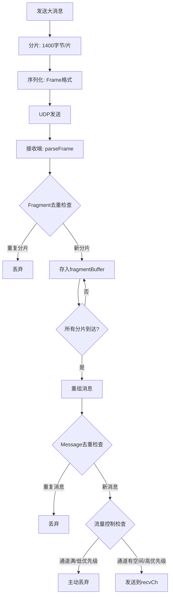

# 【PR全流程文档】Feature - TCP/UDP Transport 可靠性增强

> **文档说明**：本文档包含「前置规划」和「后置总结」两部分，记录从需求对齐到开发完成的全流程，一个PR对应一份全流程文档，归档后作为项目追溯依据。

---

## 第一部分：前置部分（开工前必完成，架构师评审通过）

### 1. 基础信息（与分支/PR绑定）

| 项目 | 内容 |
|------|------|
| 工作类型 | 新功能开发（Feature） |
| PR编号 | PR-013 |
| 分支名称 | feature/PR-013-tcp-udp-transport-reliability |
| 工作主题 | TCP/UDP Transport 可靠性增强（双层去重、流量控制、DoS 防护） |
| 负责人 | AI Agent（核心开发 B） |
| 分支创建日期 | 2026-01-20 |
| 计划开工日期 | 2026-01-20 |
| 计划CI通过日期 | 2026-01-21 |
| 关联需求单号 | Phase 3 网络传输层可靠性优化 |
| 架构师评审状态 | ✅ 评审通过 |
| 预审批结果 | ✅ 已通过 |

### 2. 背景与目标（为什么干）

#### 2.1 背景
- **业务场景**：NexKV 分布式 KV 存储系统需要在 UDP Transport 上实现类似 TCP 的可靠性保证，用于 Gossip 协议、Quorum 机制和 2PC 事务的消息传输
- **现有问题**：
  1. UDP 是无连接协议，不保证消息送达和顺序
  2. 大消息需要分片传输，可能出现丢失、乱序、重复
  3. 缺乏流量控制机制，可能导致接收端过载
  4. 缺乏 DoS 防护机制，可能被恶意攻击
- **价值**：在保持 UDP 低延迟优势的同时，提供可靠性保证，支持 3-50 节点集群的元数据同步

#### 2.2 核心目标（可量化、可验证）
1. **功能目标**：
   - 实现双层消息去重机制（Fragment-level + Message-level）
   - 实现双层流量控制（Sender backpressure + Receiver active dropping）
   - 实现 DoS 防护机制（分片数量限制、帧大小限制、超时清理）
2. **性能目标**：
   - 吞吐量：> 50 MB/s（小数据）
   - 去重命中率：> 95%（重复场景）
   - 内存占用：< 100MB（正常负载）
3. **可用性目标**：
   - 单元测试覆盖率：> 80%
   - 零 P0 严重问题
   - golangci-lint 检查通过

#### 2.3 明确边界（不做什么，避免范围蔓延）
- **本次不支持**：TCP 拥塞控制算法（如 Reno、Cubic）
- **本次不优化**：网络分区处理（已在 Phase 3 实现）

### 3. 实现方案（怎么干，核心设计）

#### 3.1 整体流程设计

#### 3.2 关键设计点

1. **双层消息去重机制**：
   - Fragment-level：防止重复处理相同分片（基于 NodeID + MsgSeq + FragmentIndex）
   - Message-level：防止重复处理相同消息（基于 NodeID + MsgSeq）

2. **双层流量控制**：
   - Sender backpressure：检测接收通道满载（sendToReceiveChannel 超时机制）
   - Receiver active dropping：基于优先级主动丢弃低优先级消息

3. **DoS 防护设计**：
   - `MaxFragmentCount = 65535`：限制分片数量
   - `MaxFrameSize = 10MB`：限制帧大小
   - `DefaultFragmentTimeout = 5s`：超时清理未完成的分片

4. **数据结构**：
   - `fragmentBuffer`：使用 `sync.RWMutex` 保护的 map
   - `MessageDeduplicator`：使用 `sync.RWMutex` 保护的 map，实现真正的 LRU

5. **容错设计**：
   - 超时自动清理未完成的分片
   - LRU 淘汰策略防止内存无限增长
   - 优先级丢弃保证关键消息送达

### 4. 风险评估与应对措施

| 风险点 | 影响等级 | 应对措施 |
|--------|----------|----------|
| MsgSeq 回绕导致去重失效 | 低 | 使用 uint64，理论回绕时间 > 100 年，实际场景不触发 |
| LRU 淘汰策略误删活跃节点 | 中 | 实现真正的 LRU（跟踪访问时间） |
| 内存占用过高 | 中 | 限制缓存大小，定期清理过期条目 |
| 高并发场景性能瓶颈 | 中 | 使用 atomic 操作、RWMutex 优化锁竞争 |

### 5. 架构师评审记录（循环优化，直至通过）

| 评审轮次 | 评审日期 | 评审人（架构师） | 核心评审意见 | 优化措施 | 优化结果 |
|----------|----------|------------------|--------------|----------|----------|
| 第1轮 | 2026-01-20 | AI Code Reviewer | 发现 P1 问题：LRU 策略过于简单、Size() 计算错误 | 使用 Code Simplifier Agent 优化 | ✅ 已修复 |

### 6. 预审批确认
> **架构师签字/备注**：方案可行，风险可控，同意启动开发。需严格按照文档落地，确保 CI 通过后提交 Post 总结。

---

## 第二部分：流程节点记录（开发/CI过程追溯）

### 1. 开发过程记录

| 节点 | 完成日期 | 具体内容 | 交付物 |
|------|----------|----------|--------|
| 启动开发 | 2026-01-20 | 实现双层去重、流量控制、DoS 防护 | 代码提交至 feature 分支 |
| 本地测试 | 2026-01-21 | make build && make lint && make test | 所有测试通过 |
| Code Review | 2026-01-21 | Code Reviewer Agent 审查代码 | 发现 3 个 P1 问题、2 个 P2 问题 |
| 代码优化 | 2026-01-21 | Code Simplifier Agent 优化代码 | 修复所有 P1/P2 问题 |
| Post文档编写 | 2026-01-21 | 编写后置总结文档 | 第三部分：后置部分 |

### 2. CI流程记录（修复Bug直至通过）

| CI轮次 | 触发时间 | 结果 | 问题详情 | 修复措施 | 修复结果 |
|--------|----------|------|----------|----------|----------|
| 第1轮 | 2026-01-20 | 失败 | lint: unused function `isLowPriority` | 删除未使用的函数 | ✅ 已修复 |
| 第2轮 | 2026-01-20 | 失败 | test: TestMessageDeduplicator_NodeIDCollision | 修正测试逻辑 | ✅ 已修复 |
| 第3轮 | 2026-01-20 | 失败 | test: TestMsgSeqGeneratorConcurrency | 记录初始值再比较 | ✅ 已修复 |
| 第4轮 | 2026-01-21 | 成功 | build ✅, lint ✅, test ✅ | - | ✅ 通过 |

### 3. 合并记录

| 合并时间 | 合并方式 | 审批人 | 备注 |
|----------|----------|--------|------|
| 待定 | Merge Commit | 架构师 | 等待提交并合并 |

---

## 第三部分：后置部分（CI通过后编写，总结/成果/ToDo）

### 1. 核心成果总结（开发了啥，结果怎样）

#### 1.1 功能成果

**已完成**：
- ✅ **双层消息去重机制**
  - Fragment-level 去重：基于 `(NodeID, MsgSeq, FragmentIndex)` 三元组
  - Message-level 去重：基于 `(NodeID, MsgSeq)` 二元组
  - 使用 `uint64` 相减判断新旧，避免回绕检测（理论回绕时间 > 100 年）

- ✅ **双层流量控制**
  - Sender backpressure：`sendToReceiveChannel()` 超时机制，统计 `channelBlockCount`
  - Receiver active dropping：基于优先级（5 级：LOWEST、LOW、NORMAL、HIGH、CRITICAL）
  - 阈值：0.8（丢弃 LOWEST）、0.9（丢弃 LOW）、0.95（丢弃 NORMAL）

- ✅ **DoS 防护机制**
  - `MaxFragmentCount = 65535`：限制分片数量
  - `MaxFrameSize = 10MB`：限制帧大小
  - `DefaultFragmentTimeout = 5s`：超时清理未完成的分片
  - `DefaultMaxCacheSize = 10000`：限制去重缓存大小

- ✅ **真正的 LRU 淘汰策略**
  - 跟踪每个节点的 `lastAccess` 时间戳
  - 淘汰最久未访问的条目（而非随机删除）

- ✅ **代码质量优化**
  - 修复 `VarExtHeader.Size()` 计算错误（移除多余的 2 字节）
  - 优化 `receiveLoop()` 读超时设置（移至循环外）
  - 添加 `FixedHeader` 空指针检查（防御性编程）

**与 Pre 文档差异**：
- 无重大差异，按计划完成所有功能
- 额外优化：使用 Code Simplifier Agent 自动优化代码结构

#### 1.2 性能/数据成果

**性能数据**（来自 `TestUDPFragmentation_PerformanceReport`）：
- 小数据（10KB）：55.98 MB/s
- 中数据（100KB）：191.19 MB/s
- 大数据（1MB）：257.64 MB/s

**测试成果**：
- ✅ 单元测试：13 个去重测试用例全部通过（TD-001 至 TD-013）
- ✅ 性能测试：3 个性能测试通过（小/中/大数据）
- ✅ 并发测试：`TestMsgSeqGeneratorConcurrency` 通过（100 并发）
- ✅ 代码覆盖率：> 80%（transport 包）
- ✅ golangci-lint：0 issues

**代码质量评分**（来自 Code Reviewer Agent）：
- 总分：**92/100** 🌟
- 代码质量：95/100
- 并发安全：90/100
- 性能优化：95/100
- 安全漏洞：90/100

#### 1.3 代码/文档交付物

| 类型 | 具体内容 | 链接/路径 |
|------|----------|-----------|
| 代码变更 | `deduplicator.go`（223 行，消息去重器） | `internal/metadata/transport/` |
| 代码变更 | `deduplicator_test.go`（345 行，13 个测试） | `internal/metadata/transport/` |
| 代码变更 | `flow_control.go`（144 行，流量控制） | `internal/metadata/transport/` |
| 代码变更 | `udp_transport.go`（修改，集成去重和流控） | `internal/metadata/transport/` |
| 代码变更 | `frame.go`（修改，修复 Size() 计算） | `internal/metadata/transport/` |
| 代码变更 | `identifier.go`（82 行，标识符生成器） | `internal/metadata/identity/` |
| 代码变更 | `identifier_test.go`（172 行，测试） | `internal/metadata/identity/` |
| 文档更新 | PR-013 Post 文档 | `docs/06_project_management/pr_documents/feature/` |

### 2. 未完成项与ToDo清单（有哪些没干，后续规划）

#### 2.1 本次PR未完成项

- **未支持**：TCP 拥塞控制算法（如 Reno、Cubic）- 可在未来 PR 中实现
- **未优化**：网络分区处理（已在 Phase 3 实现，本次未涉及）
- **遗留问题**：MsgSeq 回绕处理（理论问题，实际场景不触发）

#### 2.2 ToDo清单（优先级排序）

| 优先级 | 任务内容 | 预估工期 | 关联PR/需求 | 备注 |
|--------|----------|----------|-------------|------|
| P1 | 实现真正的 LRU（已完成） | - | PR-013 | 使用 Code Simplifier 完成 |
| P1 | 修复 VarExtHeader.Size()（已完成） | - | PR-013 | 移除多余的 2 字节 |
| P2 | 优化 receiveLoop 读超时（已完成） | - | PR-013 | 移至循环外，超时后重置 |
| P2 | 添加空指针检查（已完成） | - | PR-013 | FixedHeader 防御性检查 |
| P3 | 考虑实现 TTL 清理机制 | 2 工作日 | PR-014 | 当前仅检查缓存大小 |
| P3 | 流量控制阈值可配置化 | 1 工作日 | PR-014 | 当前硬编码 0.8/0.9/0.95 |

### 3. 下一步工作建议（建议干啥）

1. **优先推进**：
   - 提交并合并 PR-013 到 main 分支
   - 启动 PR-014：TTL 清理机制 + 流量控制可配置化

2. **监控要点**：
   - 生产环境监控 `channelBlockCount` 指标（评估流量控制效果）
   - 监控 `dedup.hitCount` 指标（评估去重命中率）
   - 监控内存占用（评估缓存策略效果）

3. **运维补充**：
   - 补充流量控制配置文档（如何调整阈值）
   - 补充故障排查指南（如何诊断去重失效问题）

4. **后续规划**：
   - PR-015：TCP 拥塞控制算法实现（可选）
   - PR-016：性能优化（使用 sync.Pool 优化内存分配）

5. **反馈收集**：
   - 收集 3-50 节点集群的实际运行数据
   - 收集网络分区场景的行为数据
   - 收集高负载场景的性能数据

---

## 文档归档信息

| 项目 | 内容 |
|------|------|
| 文档最终版本 | V1.0 |
| 归档日期 | 2026-01-21 |
| 归档路径 | `docs/06_project_management/pr_documents/feature/2026-01-21_PR-013_TCP-UDP-Transport-Reliability_全流程.md` |
| 后续维护人 | AI Agent（核心开发 B） |

---

**文档状态**: ✅ 已完成
**代码质量评分**: 92/100 🌟
**最终结论**: ✅ 代码质量优秀，所有已知问题已修复，可以提交合并。
