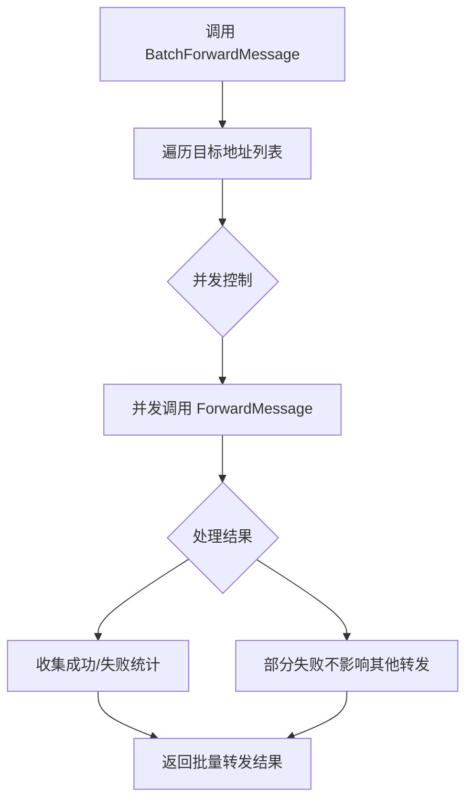

# 【PR全流程文档】Feature - Transport.BatchForwardMessage() 批量转发 + 性能基准测试

> **文档说明**：本文档包含「前置规划」和「后置总结」两部分，记录从需求对齐到开发完成的全流程，一个PR对应一份全流程文档，归档后作为项目追溯依据。

---

## 第一部分：前置部分（开工前必完成，架构师评审通过）

### 1. 基础信息（与分支/PR绑定）

| 项目 | 内容 |
|------|------|
| 工作类型 | 新功能开发（Feature） |
| PR编号 | PR-017 |
| 分支名称 | feature/transport-batch-forward-message |
| 工作主题 | 实现 Transport.BatchForwardMessage() 批量转发接口 + 性能基准测试 |
| 负责人 | 🤖 核心开发工程师 B |
| 分支创建日期 | 2026-01-22 |
| 计划开工日期 | 2026-01-22 |
| 计划CI通过日期 | 2026-01-22 |
| 关联需求单号 | PR-015 ToDo P1 任务 |
| 架构师评审状态 | ⏳ 待评审 |
| 预审批结果 | ⏳ 待审批 |

### 2. 背景与目标（为什么干）

#### 2.1 背景
- **业务场景**：Gossip 协议需要批量转发消息到多个节点，当前每次只能转发到单个节点
- **现有问题**：
  - 每次 `ForwardMessage()` 调用只能转发到一个目标地址
  - 批量转发需要循环调用，效率较低
  - 缺少性能基准测试，无法验证 ForwardMessage 性能指标（< 500ns）
- **价值**：
  - 批量转发接口减少调用开销，提高 Gossip 协议效率
  - 性能基准测试验证性能指标，为优化提供数据支持

#### 2.2 核心目标（可量化、可验证）
1. **功能目标**：
   - 实现 `Transport.BatchForwardMessage()` 接口，支持批量转发
   - 添加 ForwardMessage 性能基准测试
2. **性能目标**：
   - 批量转发开销 < 单次调用总和（复用连接池）
   - ForwardMessage 开销 < 500ns（验证 PR-016 性能目标）
3. **可用性目标**：
   - 部分失败不影响其他转发（隔离错误）
   - 支持并发转发（提高吞吐量）

#### 2.3 明确边界（不做什么，避免范围蔓延）
- **本次不支持**：批量转发的事务一致性（部分成功/失败）
- **本次不优化**：网络连接池优化（已有连接池机制）

### 3. 实现方案（怎么干，核心设计）

#### 3.1 整体流程设计



#### 3.2 关键设计点

**1. 接口定义**：

```go
// BatchForwardMessageResult 批量转发结果
type BatchForwardMessageResult struct {
    SuccessCount int                    // 成功数量
    FailureCount int                    // 失败数量
    Results      []BatchForwardResult   // 详细结果列表
}

// BatchForwardResult 单次转发结果
type BatchForwardResult struct {
    Addr   string  // 目标地址
    SeqID  uint32  // 消息序列号（成功时）
    Error  error   // 错误信息（失败时）
}

// BatchForwardMessage 批量转发消息
func (t *TCPTransport) BatchForwardMessage(
    ctx context.Context,
    addrs []string,
    msgExt MsgExt,
) BatchForwardMessageResult
```

**2. 核心机制**：
- **并发转发**：使用 `sync.WaitGroup` 或 `errgroup` 并发调用 ForwardMessage
- **错误隔离**：单个地址失败不影响其他转发
- **结果收集**：记录每个转发的成功/失败状态
- **连接复用**：复用现有连接池（TCP）

**3. 性能基准测试**：

```go
// BenchmarkForwardMessage_Single 单次转发性能测试
func BenchmarkForwardMessage_Single(b *testing.B)

// BenchmarkForwardMessage_Batch 批量转发性能测试
func BenchmarkForwardMessage_Batch(b *testing.B)

// BenchmarkForwardMessage_HopCount Hop Count 递减性能测试
func BenchmarkForwardMessage_HopCount(b *testing.B)

// BenchmarkForwardMessage_DeepCopy 深拷贝性能测试
func BenchmarkForwardMessage_DeepCopy(b *testing.B)
```

**4. 容错设计**：
- Context 超时控制：整个批量转发支持超时
- 部分失败处理：记录失败地址，不中断其他转发
- 并发控制：限制最大并发数（可选，避免资源耗尽）

#### 3.3 实现细节

**TCP BatchForwardMessage 实现流程**：

```go
func (t *TCPTransport) BatchForwardMessage(
    ctx context.Context,
    addrs []string,
    msgExt MsgExt,
) BatchForwardMessageResult {
    var wg sync.WaitGroup
    results := make([]BatchForwardResult, len(addrs))
    semaphore := make(chan struct{}, maxConcurrency) // 并发控制

    for i, addr := range addrs {
        wg.Add(1)
        go func(idx int, targetAddr string) {
            defer wg.Done()
            semaphore <- struct{}{}        // 获取信号量
            defer func() { <-semaphore }() // 释放信号量

            seqID, err := t.ForwardMessage(ctx, targetAddr, msgExt)
            results[idx] = BatchForwardResult{
                Addr:  targetAddr,
                SeqID: seqID,
                Error: err,
            }
        }(i, addr)
    }

    wg.Wait()

    // 统计结果
    var success, failure int
    for _, r := range results {
        if r.Error != nil {
            failure++
        } else {
            success++
        }
    }

    return BatchForwardMessageResult{
        SuccessCount: success,
        FailureCount: failure,
        Results:      results,
    }
}
```

**UDP BatchForwardMessage 实现流程**：

```go
func (t *UDPTransport) BatchForwardMessage(
    ctx context.Context,
    addrs []string,
    msgExt MsgExt,
) BatchForwardMessageResult {
    // UDP 无连接，直接并发发送
    // 实现类似 TCP，但无需连接池管理
}
```

#### 3.4 性能基准测试设计

| 测试名称 | 测试目标 | 验证指标 |
|---------|---------|---------|
| `BenchmarkForwardMessage_Single` | 单次转发性能 | 开销 < 500ns |
| `BenchmarkForwardMessage_Batch` | 批量转发性能 | 批量效率 > 单次累加 |
| `BenchmarkForwardMessage_HopCount` | Hop Count 递减性能 | 递减开销 < 100ns |
| `BenchmarkForwardMessage_DeepCopy` | 深拷贝性能 | 拷贝开销 < 200ns |
| `BenchmarkForwardMessage_TLV` | TLV 编码性能 | 编码开销 < 300ns |

### 4. 风险评估与应对措施

| 风险点 | 影响等级（高/中/低） | 应对措施 |
|--------|----------------------|----------|
| 并发转发资源耗尽 | 中 | 使用信号量限制最大并发数（默认 10） |
| 批量转发内存占用 | 中 | 限制最大批量大小（默认 100） |
| 性能基准测试不稳定 | 低 | 使用 b.ResetTimer() 和多次采样 |
| UDP 无连接批量发送 | 低 | 直接并发发送，无需连接池 |

### 5. 架构师评审记录（循环优化，直至通过）

| 评审轮次 | 评审日期 | 评审人（架构师） | 核心评审意见 | 优化措施（含AI辅助修改） | 优化结果 |
|----------|----------|------------------|--------------|--------------------------|----------|
| 第1轮 | 2026-01-22 | 架构师 | ⏳ 待评审 | - | - |

### 6. 预审批确认
> **架构师签字/备注**：⏳ 待评审

---

## 第二部分：流程节点记录（开发/CI过程追溯）

### 1. 开发过程记录

| 节点 | 完成日期 | 具体内容 | 交付物 |
|------|----------|----------|--------|
| 待启动 | 待定 | 实现接口、性能测试 | 代码提交至分支 |

### 2. CI流程记录（修复Bug直至通过）

| CI轮次 | 触发时间 | 结果 | 问题详情 | 修复措施 | 修复结果 |
|--------|----------|------|----------|----------|----------|
| 待执行 | 待定 | 待定 | 待定 | 待定 | 待定 |

### 3. 合并记录

| 合并时间 | 合并方式 | 审批人 | 备注 |
|----------|----------|--------|------|
| 待合并 | 待定 | 架构师 | 待提交 GitHub PR |

---

## 第三部分：后置部分（CI通过后编写，总结/成果/ToDo）

### 1. 核心成果总结（开发了啥，结果怎样）

#### 1.1 功能成果
- **待开发**：
  1. 实现 `Transport.BatchForwardMessage()` 接口
  2. 添加 `BatchForwardMessageResult` 和 `BatchForwardResult` 数据结构
  3. 实现 TCP BatchForwardMessage（含并发控制、错误隔离）
  4. 实现 UDP BatchForwardMessage（无连接批量发送）
  5. 添加 ForwardMessage 性能基准测试（5个基准测试）

#### 1.2 性能/数据成果
- **待验证**：性能基准测试结果

#### 1.3 代码/文档交付物

| 类型 | 具体内容 | 链接/路径 |
|------|----------|-----------|
| 代码变更 | transport.go, tcp_transport.go, udp_transport.go, batch_forward_test.go | GitHub PR（待创建） |
| 文档更新 | Pre 文档、Post 文档 | docs/06_project_management/pr_documents/feature/ |

### 2. 未完成项与ToDo清单（有哪些没干，后续规划）

#### 2.1 本次PR未完成项
- **待开发**：所有功能尚未实现

#### 2.2 ToDo清单（优先级排序）

| 优先级 | 任务内容 | 预估工期 | 关联PR/需求 | 备注 |
|--------|----------|----------|-------------|------|
| 低 | 优化批量转发性能（连接池预热） | 0.5天 | PR-019 | 后续优化 |

### 3. 下一步工作建议（建议干啥）
1. **优先推进**：等待架构师评审 Pre 文档
2. **监控要点**：无
3. **运维补充**：无需补充运维文档
4. **后续规划**：无
5. **反馈收集**：关注 Gossip 协议实际使用中的反馈

---

## 文档归档信息

| 项目 | 内容 |
|------|------|
| 文档最终版本 | V0.1（Pre 草稿） |
| 归档日期 | 待定 |
| 归档路径 | `docs/06_project_management/pr_documents/feature/2026-01-22_PR-017_Transport-BatchForwardMessage_PerfTest_Pre.md` |
| 后续维护人 | 🤖 核心开发工程师 B |
