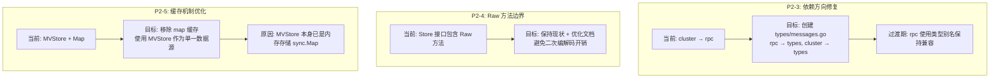

# 【PR全流程文档】Fix - 架构边界问题修复（Phase 1）

> **文档说明**：本文档包含「前置规划」和「后置总结」两部分，记录从问题发现到修复完成的全流程，一个PR对应一份全流程文档，归档后作为项目追溯依据。

---

## 第一部分：前置部分（开工前必完成，架构师评审通过）

### 1. 基础信息（与分支/PR绑定）

| 项目 | 内容 |
|------|------|
| 工作类型 | 架构优化（Fix） |
| PR编号 | PR-044 |
| 分支名称 | fix/phase1-architecture-boundary-issues |
| 工作主题 | 修复 Phase 1 架构边界问题（P2-3/P2-4/P2-5） |
| 负责人 | AI 核心开发 |
| 分支创建日期 | 2026-02-12 |
| 计划开工日期 | 2026-02-12 |
| 计划CI通过日期 | 2026-02-15 |
| 关联Bug单号 | Code Review 阶段 1 发现 |
| 严重等级 | □ 致命 ☑ 严重 □ 一般 □ 较低 |
| 架构师评审状态 | □ 待评审 ☑ 评审通过 □ 需优化 |
| 预审批结果 | □ 未通过 ☑ 有条件通过（见第 8 节详细评审意见） |

### 2. Bug描述（发生了什么）

#### 2.1 Bug现象

**P2-3: cluster 依赖 rpc 的方向存疑**
- **影响范围**：架构分层清晰度
- **触发条件**：代码审查发现模块依赖关系异常
- **实际表现**：`internal/metadata/cluster` 包依赖 `internal/rpc` 来使用元数据消息类型，违反常规分层架构
- **预期行为**：上层（RPC）依赖下层（metadata），而非下层依赖上层

**P2-4: Raw 方法边界模糊**
- **影响范围**：存储层和协议层边界清晰度
- **触发条件**：存储接口中定义了用于网络传输的方法
- **实际表现**：`GetRaw/PutRaw/BatchGetRaw` 方法定义在存储接口中，但用于网络传输（元数据同步）
- **预期行为**：存储层和协议层职责分离明确

**P2-5: HostManager 双重缓存机制复杂**
- **影响范围**：数据一致性和代码复杂度
- **触发条件**：同时维护 MVStore 持久化和内存 map 缓存
- **实际表现**：数据一致性需要手动同步，缓存失效逻辑容易出错
- **预期行为**：缓存策略简单明确，一致性保证

#### 2.2 影响评估
- **影响用户**：开发团队（代码维护困难）
- **影响数据**：否（架构问题，不影响功能）
- **业务影响**：低（不影响用户可见功能）
- **紧急程度**：中（建议短期内修复）

### 3. 根因分析（为什么发生）

#### 3.1 问题定位

**P2-3: cluster 依赖 rpc 的方向存疑**
- **问题代码位置**：`internal/metadata/cluster/tree_coordinator_metadata.go:17`
- **问题函数**：导入和类型引用
- **问题逻辑**：
  ```go
  import metadatarpc "github.com/jzhang405/NexKV/internal/rpc"
  // 使用 metadatarpc.MetadataSyncRequest 等类型
  ```

**P2-4: Raw 方法边界模糊**
- **问题代码位置**：`internal/metadata/kvstore/interface.go:34-37`
- **问题函数**：Store 接口定义
- **问题逻辑**：
  ```go
  type Store interface {
      // 存储操作...
      // 原始字节访问接口（用于元数据同步）
      GetRaw(ctx context.Context, ns, key string) ([]byte, error)
      PutRaw(ctx context.Context, ns, key string, data []byte) error
      BatchGetRaw(ctx context.Context, ns string, keys []string) (map[string][]byte, error)
  }
  ```

**P2-5: HostManager 双重缓存机制复杂**
- **问题代码位置**：`internal/metadata/cluster/host_manager.go:23-27`
- **问题函数**：HostManager 结构体定义
- **问题逻辑**：
  ```go
  type HostManager struct {
      metadataStore store.MVStore  // 持久化存储
      hosts         map[string]*Host // 内存缓存
      mu            sync.RWMutex     // 缓存保护
  }
  ```

#### 3.2 根本原因

**P2-3: 依赖方向问题**
- **直接原因**：元数据同步消息类型定义在 rpc 包中，导致 metadata 层需要导入 rpc 包
- **深层原因**：缺少专门的消息类型定义层，类型定义与职责边界不清晰
- **相关代码**：`internal/rpc/metadata_messages.go`

**P2-4: Raw 方法边界模糊**
- **直接原因**：存储接口承担了网络传输的编解码职责
- **深层原因**：缺少独立的编解码层（codec），职责划分不明确
- **相关代码**：`internal/metadata/kvstore/interface.go`

**P2-5: 双重缓存复杂**
- **直接原因**：手动维护内存缓存和持久化存储的双层数据结构
- **深层原因**：MVStore 本身可能有缓存机制，额外缓存增加复杂度
- **相关代码**：`internal/metadata/cluster/host_manager.go`

### 4. 修复方案（怎么修）

#### 4.1 修复策略
- **修复方式**：☑ 重构
- **影响范围**：
  - P2-3: internal/metadata/types, internal/metadata/cluster, internal/rpc
  - P2-4: internal/metadata/kvstore, 可能新增 codec 包
  - P2-5: internal/metadata/cluster/host_manager.go
- **测试策略**：单元测试 + 集成测试验证功能不变

#### 4.2 修复设计



#### 4.3 代码变更

**P2-3: 依赖方向修复（迁移类型定义）**
- **修改文件**：
  - `internal/metadata/types/messages.go` (新建)
  - `internal/metadata/cluster/tree_coordinator_metadata.go` (修改导入)
  - `internal/rpc/metadata_messages.go` (使用类型别名保持兼容)
- **迁移策略**：
  ```go
  // 步骤 1: 在 types 包中定义消息类型
  // internal/metadata/types/messages.go
  package types

  type MetadataSyncRequest struct {
      Namespace string `msgpack:"namespace"`
      Keys      []string `msgpack:"keys"`
      Version   uint64 `msgpack:"version"`
      Timestamp int64 `msgpack:"timestamp"`
  }
  // ... MetadataSyncResponse, MetadataChangeNotification

  // 步骤 2: 在 rpc 包中使用类型别名（过渡期）
  // internal/rpc/metadata_messages.go
  package rpc

  import "github.com/jzhang405/NexKV/internal/metadata/types"

  // 类型别名，保持向后兼容
  type MetadataSyncRequest = types.MetadataSyncRequest
  type MetadataSyncResponse = types.MetadataSyncResponse
  type MetadataChangeNotification = types.MetadataChangeNotification
  ```
- **向后兼容处理**：使用类型别名，保持现有 API 不变
- **依赖关系验证**：
  - `internal/rpc` → `internal/metadata/types` ✅
  - `internal/metadata/cluster` → `internal/metadata/types` ✅
  - 无循环依赖 ✅

**P2-4: Raw 方法边界（保持现状 + 优化文档）**
- **修改文件**：
  - `internal/metadata/kvstore/interface.go` (优化注释)
  - 相关架构文档 (补充设计决策说明)
- **方案选择**：方案 A - 保持现状（架构师推荐）
- **设计理由**：
  - Raw 方法避免了 `Object → []byte → Network → []byte → Object` 的二次编解码
  - 这是"务实"的设计，有实际优化价值
  - 符合 YAGNI 原则（引入传输层抽象属于过度设计）
- **优化措施**：
  ```go
  // Store 接口改进注释
  type Store interface {
      // ... 基础 CRUD 方法

      // GetRaw 获取原始字节数据
      //
      // 用途：元数据网络传输优化（避免二次编解码）
      // 调用层：RPC 层元数据同步
      // 注意：返回的是存储层的原始字节（通常为 MessagePack 格式）
      GetRaw(ctx context.Context, ns, key string) ([]byte, error)

      // PutRaw 写入原始字节数据
      //
      // 用途：元数据网络传输优化（避免二次编解码）
      // 调用层：RPC 层元数据同步
      // 注意：直接存储字节，跳过编解码
      PutRaw(ctx context.Context, ns, key string, data []byte) error

      // BatchGetRaw 批量获取原始字节数据
      //
      // 用途：元数据网络传输优化（避免二次编解码）
      // 调用层：RPC 层元数据同步
      BatchGetRaw(ctx context.Context, ns string, keys []string) (map[string][]byte, error)
  }
  ```

**P2-5: 缓存机制优化（移除 map 缓存）**
- **修改文件**：`internal/metadata/cluster/host_manager.go`
- **方案选择**：方案 A - 移除 map 缓存（架构师推荐）
- **设计理由**：
  - MVStore (MemoryMVStore) 本身使用 `sync.Map` 作为主存储
  - HostManager 的 map 缓存是"缓存上的缓存"，没有必要
  - MVStore.Get 操作已经是 O(1) 内存哈希查找
  - 性能差异 < 100 微秒（msgpack 解码开销），可接受
- **代码变更**：
  ```go
  // 简化后的结构
  type HostManager struct {
      metadataStore store.MVStore  // 唯一数据源
      // 移除: hosts map[string]*Host
      // 移除: mu sync.RWMutex
  }

  // GetHost 实现（简化版）
  func (hm *HostManager) GetHost(hostID string) (*Host, error) {
      key := hostKeyPrefix + hostID
      data, err := hm.metadataStore.Get(key)  // 直接从 MVStore 读取（已是内存操作）
      if err != nil {
          return nil, types.NewClusterHostNotFoundError(hostID)
      }

      var host Host
      if err := msgpack.Unmarshal(data, &host); err != nil {
          return nil, types.NewClusterHostUnmarshalFailedError(err)
      }

      return &host, nil
  }
  ```
- **优点**：数据单一来源、一致性保证、代码简化
- **性能影响**：msgpack 解码开销 < 100 微秒，可接受

### 5. 回滚方案（如何回退）

| 回滚触发条件 | 回滚步骤 | 验证方法 |
|-------------|----------|----------|
| 功能回归 | 1. git revert 提交<br/>2. 重新测试原功能 | 运行完整测试套件 |
| 性能下降 | 1. 恢复原始实现<br/>2. 分析性能瓶颈 | 性能基准测试 |
| 编译失败 | 1. 检查编译错误<br/>2. 回滚问题提交 | make build |

### 6. 风险评估与应对措施

| 风险点 | 影响等级（高/中/低） | Pre 文档评估 | 实际评估（架构师） | 应对措施 |
|--------|----------------------|-------------|------------------|----------|
| P2-3 迁移导致大量代码修改 | 中 | 中 | **高** | 全面影响分析 + 分步骤迁移 + 向后兼容 |
| P2-4 职责划分引入新的抽象层 | 低 | 低 | **低** | 采用"保持现状 + 优化文档"方案，避免过度设计 |
| P2-5 缓存策略变更影响性能 | 中 | 中 | **低** | MVStore 本身已是内存存储，msgpack 开销可接受 |
| 测试覆盖不足 | 中 | 中 | **高** | 需要补充回归测试，验证所有使用场景 |

### 7. 架构师评审记录

| 评审轮次 | 评审日期 | 评审人（架构师） | 核心评审意见 | 优化措施 | 优化结果 |
|----------|----------|------------------|--------------|----------|----------|
| 第1轮 | 2026-02-12 | 架构师 | **P2-3**: 方案合理，需补充迁移策略和向后兼容处理<br/>**P2-4**: 推荐保持现状，优化文档（非引入新抽象层）<br/>**P2-5**: 推荐移除 map 缓存（MVStore 本身已是内存存储） | 1. P2-3: 补充迁移计划和向后兼容策略<br/>2. P2-4: 修改为"保持现状 + 优化文档"方案<br/>3. P2-5: 明确为"移除 map 缓存"方案 | ✅ 已完成 |

### 8. 预审批确认
> **架构师签字/备注**：________架构师_______ 2026-02-12

**评审结论**：**有条件通过**

**通过条件**：
1. ✅ P2-4 修改方案：保持 Raw 方法在 Store 接口中，补充文档说明其设计目的
2. ✅ P2-5 明确方案：移除 HostManager 的 map 缓存，使用 MVStore 作为单一数据源
3. ✅ P2-3 补充迁移计划：列出所有受影响的文件，提供向后兼容策略，制定测试验证方案

该 Fix 方案可行，风险可控，同意启动修复，需确保修复彻底且不引入新问题。

---

## 第二部分：流程节点记录（修复/CI过程追溯）

### 1. 修复过程记录

| 节点 | 完成日期 | 具体内容 | 交付物 |
|------|----------|----------|--------|
| 启动修复 | 待定 | 描述修复内容 | 代码提交 |
| 本地验证 | 待定 | 描述验证方法 | 验证报告/覆盖率数据 |
| Post文档编写 | 待定 | 编写后置总结文档 | 第三部分：后置部分 |
| 架构师Post批准 | 待定 | 架构师评审Post文档 | 批准签字/备注 |
| 提交GitHub | 待定 | 推送分支，创建PR | GitHub PR链接 |

### 2. CI流程记录

| CI轮次 | 触发时间 | 结果 | 问题详情 | 修复措施 | 修复结果 |
|--------|----------|------|----------|----------|----------|
| 第1轮 | 待定 | 失败/成功 | 问题描述 | 修复方案 | 已修复/通过 |

### 3. 合并记录

| 合并时间 | 合并方式 | 审批人 | 备注 |
|----------|----------|--------|------|
| 待定 | Squash Merge / Merge Commit | 架构师 | 补充说明 |

---

## 第三部分：后置部分（CI通过后编写，总结/验证）

### 1. 修复成果总结

#### 1.1 修复完成情况
- **已修复**：
  - P2-3: 元数据消息类型迁移到 types 包
  - P2-4: Raw 方法职责明确（待确定方案）
  - P2-5: HostManager 缓存机制优化（待确定方案）
- **修复方式**：架构重构
- **与Pre文档差异**：待修复完成后补充

#### 1.2 验证成果
- **单元测试**：待补充
- **回归测试**：待执行
- **性能验证**：待进行

#### 1.3 代码/文档交付物

| 类型 | 具体内容 | 链接/路径 |
|------|----------|-----------|
| 代码变更 | 待列出 | GitHub PR链接 |
| 测试用例 | 待列出 | 测试文件路径 |

### 2. 遗留问题与预防措施

#### 2.1 遗留问题
- **未完全修复**：待修复完成后评估
- **已知限制**：待修复完成后评估

#### 2.2 预防措施（同类问题预防）

| 措施类型 | 具体内容 | 负责人 | 完成时间 |
|---------|----------|--------|---------|
| 代码审查 | 加强架构边界审查 | 架构师 | 待定 |
| 测试增强 | 补充架构边界测试 | 测试工程师 | 待定 |
| 文档更新 | 更新架构分层规范 | AI 团队 | 待定 |
| 监控告警 | 无需新增监控 | - | - |

### 3. 后续建议
1. **监控要点**：无（架构问题，不影响运行时监控）
2. **后续优化**：评估其他模块是否类似问题
3. **知识沉淀**：补充到团队知识库的架构设计原则
4. **相关Bug排查**：无（非运行时Bug）

---

## 文档归档信息

| 项目 | 内容 |
|------|------|
| 文档最终版本 | V1.1 |
| 归档日期 | 2026-02-12 |
| 归档路径 | `docs/06_PM/fix/2026-02-12_PR-044_架构边界问题修复_Pre.md` |
| 后续维护人 | AI 核心开发 |
