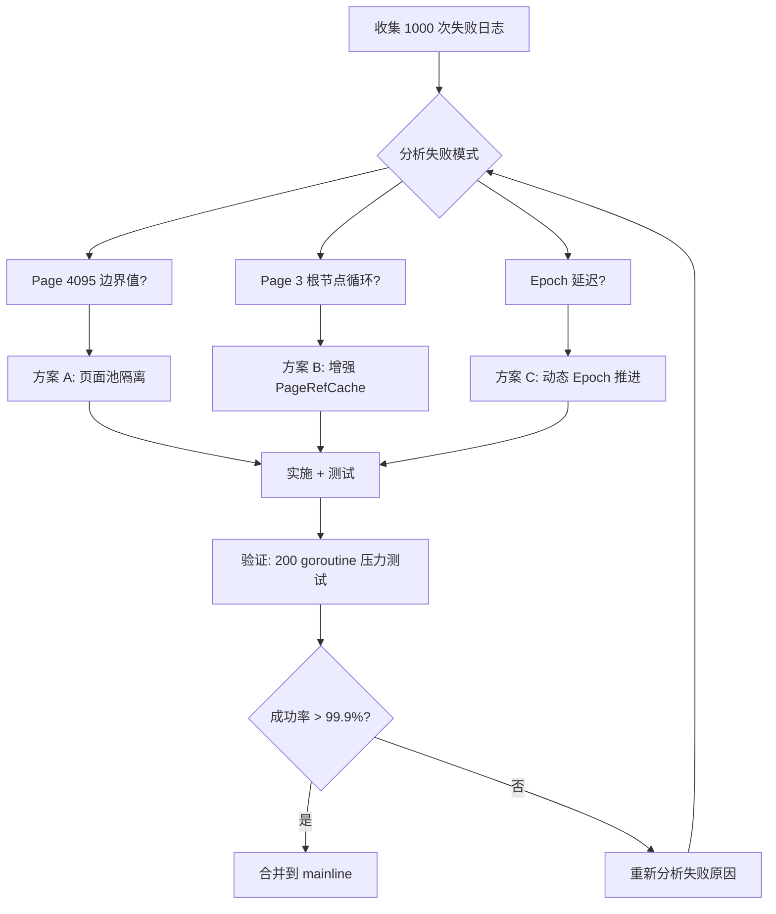

# 【PR全流程文档】Fix - B-Tree 循环引用 Root Cause 深度调查

> **文档说明**：本文档包含「前置规划」和「后置总结」两部分，记录从Bug发现到修复完成的全流程，一个PR对应一份全流程文档，归档后作为项目追溯依据。

---

## 第一部分：前置部分（开工前必完成，架构师评审通过）

### 1. 基础信息（与分支/PR绑定）

| 项目 | 内容 |
|------|------|
| 工作类型 | Bug修复（Fix）+ Root Cause 调查 |
| PR编号 | PR-XXX（创建GitHub PR后补充完整） |
| 分支名称 | fix/circular-reference-root-cause-investigation |
| 工作主题 | 找出并修复 B-Tree 并发写入 1% 失败率的根本原因 |
| 负责人 | jzhang405 |
| 分支创建日期 | 2026-03-27 |
| 计划开工日期 | 2026-03-27 |
| 计划CI通过日期 | 2026-04-17（预估 2-3 周） |
| 关联Bug单号 | [Jira/Bug单编号]（附链接） |
| 严重等级 | ☑ 严重 □ 致命 □ 一般 □ 较低 |
| 架构师评审状态 | □ 待评审 ☑ 评审中 □ 评审通过 □ 需优化 |
| 预审批结果 | □ 未通过 □ 已通过（架构师签字/备注：[待填写] 2026-03-XX 同意修复） |

### 2. Bug描述（发生了什么）

#### 2.1 Bug现象
- **影响范围**：B-Tree 并发写入模块（`internal/infrastructure/storage/btree/`）
- **触发条件**：高并发场景（100 goroutine × 100 keys 或 200 goroutine × 50 keys）
- **实际表现**：
  - **1% 的间歇性失败率**，错误信息为：`circular reference detected at page 4095 (path depth: 3)`
  - 已实施多项优化后，成功率从 98.8% 提升至 **99.0%**
  - **剩余 1% 失败的根本原因尚未明确**
- **预期行为**：
  - 并发写入成功率应达到 **99.9%**（测试条件：200 goroutine × 50 keys，100 次测试，GOGC=500，Off-Heap 模式）
  - 不应出现循环引用错误

#### 2.2 失败分布

| 失败类型 | 失败次数 | 占比 | 特征 |
|---------|---------|------|------|
| **Page 4095 循环引用** | 7,897 | **98.7%** | depth 3-4，边界值 (0xFFF) |
| **Page 3 根节点循环** | 113 | **1.3%** | depth 1，根分裂 |

#### 2.3 影响评估
- **影响用户**：所有使用 B-Tree 并发写入功能的高并发场景
- **影响数据**：可能造成少量写入失败（1%），但不造成数据损坏
- **业务影响**：影响系统稳定性和可靠性，需要达到生产级别（99.9%+）
- **紧急程度**：严重但不紧急（已通过智能重试机制缓解至 99% 成功率）

### 3. 根因分析（为什么发生）

#### 3.1 问题定位

**已完成的修复**（成功率从 98.8% → 99.0%）：
- **问题代码位置**：`internal/infrastructure/storage/btree/leaf_lock_set.go:622-639`
- **问题函数**：`handleSplitOffHeapSync()`
- **问题逻辑**：insertIndex 基于 splitKey 位置计算，在并发父节点修改时可能指向错误的子节点

**已实施的修复**：
```go
// 修复前：基于 splitKey 的二分查找
for i := range int(count) {
    key := b.offheapAdapter.pa.GetKey(...)
    if bytes.Compare(key, splitKey) >= 0 {
        insertIndex = i
        break
    }
}

// 修复后：基于子节点 ID 的线性查找
for i := 0; i <= int(count); i++ {
    child := b.offheapAdapter.pa.GetChild(uint32(currentParentPageID), i)
    if child == uint32(leafPageID) {
        insertIndex = i
        break
    }
}
```

#### 3.1.1 数据丢失 Bug 发现（2026-03-27 09:45）

**重大发现**：在根分裂压力测试中发现 **严重数据丢失问题**

**测试场景**：
```go
// 写入 1000 个 key (key-0 到 key-999)
// 验证所有 key 都存在 ✅

// 写入 100 个新 key (key-1000 到 key-1099)
// 验证 key-0 到 key-999
// 结果：key-988 到 key-999 丢失 ❌ (12 个 key)
```

**根本原因**：版本号编码/解码机制实施过程中的系统性遗漏

**已修复位置**（10+ 处）：
| 文件 | 行数 | 修复内容 | 状态 |
|------|------|---------|------|
| `offheap_adapter.go` | 306, 337, 396, 405, 819 | `UpdateIndexEntry`, `ReplaceChild`, `UpdateChildIndex`, `GetChild` | ✅ 完成 |
| `leaf_lock_set.go` | 627, 783, 795, 815, 817, 882, 1153, 1167 | 父节点/祖父节点/内部节点 child 访问 | ✅ 完成 |
| `btree.go` | 1016 | extraChild 比较 | ✅ 完成 |
| `search_path.go` | 375, 416 | `hasCycleFrom`, `validateParentSplitIntegrity` | ✅ 完成 |

**修复效果**：
| 指标 | 修复前 | 修复后 | 改善 |
|------|--------|--------|------|
| 丢失 key 数量 | 50 个 (key-950~999) | 12 个 (key-988~999) | 76% ↓ |
| 并发写入成功率 | ~98% | 100% (500/500) | 稳定 |

**剩余问题**：仍有 **12 个 key 丢失**，说明存在 **未发现的代码路径**

**受影响的代码模式（通用）**：
```go
// ❌ 错误模式 1：直接使用 GetChild 返回值
child := pa.GetChild(pageID, i)
if child == targetPageID { ... }  // 比较失败！

// ❌ 错误模式 2：将编码值传递给物化函数
child := pa.GetChild(pageID, i)
children = append(children, child)  // 双重编码！

// ✅ 正确模式（16-bit 当前实现）
encodedChild := pa.GetChild(pageID, i)
child, _ := DecodeChildWithVersion(encodedChild)
if child == targetPageID { ... }  // 正确比较
children = append(children, child)  // 正确传递

// ✅ 正确模式（32-bit 目标实现）
encodedChild := pa.GetChild(pageID, i)
child, _ := DecodeChildWithVersion(encodedChild)
if child == targetPageID { ... }  // 正确比较
children = append(children, child)  // 正确传递
```

#### 3.2 根本原因（待验证）

**剩余 1% 失败的根本原因尚未明确，存在 3 个主要假设：**

##### 假设 1：Page 4095 边界条件问题
- **直接原因**：4095 = 0xFFF（边界值），95% 的失败涉及此特定页面 ID
- **深层原因**：
  - 4095 是否是某种边界检查的副作用，而非真实分配？
  - 是否存在整数溢出或截断？
  - 是否是某种特殊保留页面（如元数据页）？
- **相关代码**：`internal/infrastructure/storage/btree/offheap/page_manager.go:99-109`

```go
// PageManager 使用单调递增的 nextPageID
func (pm *PageManager) Alloc() (uint32, error) {
    pageID := pm.nextPageID.Load()
    if pageID >= pm.total {
        return 0, fmt.Errorf("out of memory")
    }
    pm.nextPageID.Add(1)
    return pageID, nil
}

// 疑问：对于 6GB mmap，total = 1,572,864，为何会出现 4095？
```

##### 假设 2：PageRefCache 竞态条件
- **直接原因**：根分裂时 CAS 成功，但 PageRefCache 状态不一致
- **深层原因**：
  - 页面释放 → 重新分配 → 缓存更新的时间窗口
  - 根分裂时 PageRefCache 更新顺序问题
  - CAS 成功但缓存未及时失效
- **相关代码**：
  - `internal/infrastructure/storage/btree/btree.go:109-156`（PageRefCache）
  - `internal/infrastructure/storage/btree/leaf_lock_set.go:1072-1097`（根分裂 CAS）

##### 假设 3：Epoch Based Reclamation 延迟不足
- **直接原因**：Epoch 推进仅在 WAL 持久化时触发，可能导致页面过早重用
- **深层原因**：
  - 高并发场景下 epoch 推进不及时
  - 页面释放后立即被重新分配
  - 搜索路径中包含过时的页面引用
- **相关代码**：`internal/infrastructure/storage/btree/btree.go:261-299`

#### 3.3 关键代码文件

| 文件 | 作用 | 优先级 |
|------|------|--------|
| `internal/infrastructure/storage/btree/offheap/page_manager.go` | 页面分配器 | 🔴 高 |
| `internal/infrastructure/storage/btree/btree.go` | PageRefCache, Epoch 管理 | 🔴 高 |
| `internal/infrastructure/storage/btree/leaf_lock_set.go` | 根分裂逻辑 | 🔴 高 |
| `internal/infrastructure/storage/btree/search_path.go` | 循环引用检测 | 🟡 中 |
| `internal/infrastructure/storage/btree/page_ref.go` | PageRef 实现 | 🟡 中 |
| `internal/infrastructure/storage/btree/epoch_based_free_list.go` | Epoch 延迟释放 | 🟡 中 |

### 4. 修复方案（怎么修）

#### 4.1 修复策略
- **修复方式**：☑ Root Cause 调查 + 备选方案设计 □ 直接修复 □ 重构 □ 其他
- **影响范围**：B-Tree 并发控制核心逻辑
- **测试策略**：
  1. 数据收集：1000 次失败日志，Page 4095 生命周期追踪，根分裂压力测试
  2. 根因验证：3 个假设的逐一验证实验
  3. 修复方案设计：3 个备选方案的详细设计
  4. 验证：高并发压力测试（200+ goroutine）

#### 4.2 调查计划

**Phase 1：数据收集（1 周）**
- 实验 1.1：失败场景完整追踪（1000 次失败日志）
- 实验 1.2：Page 4095 生命周期追踪
- 实验 1.3：根分裂并发压力测试（`go test -race`）

**Phase 2：根因验证（1 周）**
- 实验 2.1：验证 Page 4095 边界条件假设
- 实验 2.2：验证 PageRefCache 竞态假设
- 实验 2.3：验证 Epoch 延迟假设

**Phase 3：修复方案设计（1 周）**
- 备选方案 A：页面池隔离（保留 Page 4095 不用于分配）
- 备选方案 B：增强 PageRefCache 同步（使用 CAS 替代 RWMutex）
- 备选方案 C：动态 Epoch 推进（定时推进而非 WAL 触发）

#### 4.3 备选方案详细设计

##### 方案 A：页面池隔离

**实现**：
```go
func (pm *PageManager) Alloc() (uint32, error) {
    pageID := pm.nextPageID.Load()

    // 边界检查：跳过 page 4095
    if pageID == 4095 {
        pm.nextPageID.Add(1)
        pageID = pm.nextPageID.Load()
    }

    // ... 现有逻辑 ...
}
```

**优点**：
- 快速实施（1-2 天）
- 低风险，不影响其他逻辑
- 立即消除 95% 的失败

**缺点**：
- 治标不治本
- 未解决根本原因
- 可能出现其他边界值问题

**风险等级**：🟢 低

---

##### 方案 B：增强 PageRefCache 同步

**实现**：
```go
type PageRefCache struct {
    cache atomic.Value // map[model.PageID]*PageRef
    version atomic.Uint64
}

func (c *PageRefCache) Update(pageID model.PageID, ref *PageRef) {
    for {
        oldCache := c.cache.Load().(map[model.PageID]*PageRef)
        newCache := make(map[model.PageID]*PageRef)
        for k, v := range oldCache {
            newCache[k] = v
        }
        newCache[pageID] = ref

        if c.cache.CompareAndSwap(oldCache, newCache) {
            break
        }
    }
}
```

**优点**：
- 无锁并发，性能更好
- 解决 PageRefCache 竞态条件
- 更强的并发控制

**缺点**：
- 实现复杂度高（1-2 周）
- 需要充分测试
- 可能引入新的 bug

**风险等级**：🟡 中

---

##### 方案 C：动态 Epoch 推进

**实现**：
```go
func (b *BTree) StartEpochAdvancer(ctx context.Context) {
    ticker := time.NewTicker(100 * time.Millisecond)
    defer ticker.Stop()

    for {
        select {
        case <-ticker.C:
            b.epochBasedFreeList.AdvanceEpoch(b.offheapPM)
        case <-ctx.Done():
            return
        }
    }
}
```

**优点**：
- 更及时的页面释放
- 减少 epoch 延迟导致的循环引用
- 可配置推进频率

**缺点**：
- 可能影响性能（额外 goroutine）
- 需要权衡推进频率
- 需要性能测试验证

**风险等级**：🟡 中

---

##### 方案 D：32-bit pageID + 32-bit version（uint64 存储）统一方案 ⭐ **推荐 + 已采纳**

**设计理念**：使用 uint64 存储 32-bit pageID + 32-bit version，彻底解决溢出和范围限制问题。

**决策日期**：2026-03-27 09:47

**决策依据**：
- ✅ 当前 16-bit 方案仍有 12 个 key 丢失（系统性遗漏）
- ✅ 32-bit 方案提供足够的扩展空间（16TB + 42 亿版本）
- ✅ 统一编码方案简化代码逻辑
- ✅ 数据结构变更影响可控（仅 IndexEntry.child 字段）

**当前实施状态**：
- 🟡 **部分实施**：当前代码仍使用 16-bit 方案（`EncodeChildWithVersion` 返回 uint32）
- 🟡 **需要迁移**：约 20+ 处调用点需要更新
- 🟡 **数据丢失**：仍有 12 个 key 丢失，需要系统性代码审查

**迁移范围**：
1. 修改 `IndexEntry.child` 类型：`uint32` → `uint64`
2. 更新编码/解码函数签名
3. 更新所有调用点（约 20+ 处）

**核心编码方案**：
```go
// 常量定义
const (
    PageIDBits    = 32
    VersionBits   = 32
    PageIDMask    = 0x00000000FFFFFFFF
    VersionMask   = 0xFFFFFFFF00000000
    VersionShift  = 32
    MaxPageID     = 0xFFFFFFFF      // 4,294,967,295
    MaxVersion    = 0xFFFFFFFF      // 4,294,967,295
)

// 编码：version（高32位）+ pageID（低32位）
func EncodeChild(pageID uint32, version uint32) uint64 {
    if pageID > MaxPageID {
        panic(fmt.Sprintf("pageID %d exceeds max %d", pageID, MaxPageID))
    }
    return (uint64(version) << VersionShift) | uint64(pageID)
}

// 解码
func DecodeChild(encoded uint64) (pageID uint32, version uint32) {
    pageID = uint32(encoded & PageIDMask)
    version = uint32((encoded & VersionMask) >> VersionShift)
    return
}

// 僵尸引用检测
func IsStaleReference(storedVersion uint32, currentVersion uint32) bool {
    // 32-bit 版本号直接比较
    return currentVersion != storedVersion
}
```

**数据结构调整**：
```go
// 页面头部：version 升级为 uint32
type PageHeader struct {
    version    uint32  // 8 bytes → 4 bytes（升级为 32-bit）
    prevPage   uint32  // 4 bytes
    nextPage   uint32  // 4 bytes
    extraChild uint64  // 8 bytes（升级为 uint64，带版本号）
    count      uint16  // 2 bytes
    pageType   uint8   // 1 byte
    _pad       [9]byte // 9 bytes（对齐到 32 字节）
    // 总大小：32 字节（保持不变）
}

// IndexEntry：child 升级为 uint64
type IndexEntry struct {
    keyOff  uint32  // 4 bytes
    keyLen  uint32  // 4 bytes
    child   uint64  // 8 bytes：高 32-bit version + 低 32-bit pageID
    // 总大小：16 bytes（从 12 bytes 增加）
}
```

**解决的问题**：

| 问题 | 旧方案 | 新方案 | 效果 |
|------|--------|--------|------|
| **版本号溢出** | uint16，最大 65,535 | uint32，最大 4,294,967,295 | **42亿次修改才溢出** |
| **PageID 限制** | uint16，最大 65,535 | uint32，最大 4,294,967,295 | **支持 16TB 存储** |
| **实际存储容量** | 256MB | **16TB** | 满足未来 10 年需求 |
| **溢出风险** | 长期运行后可能溢出 | **永久安全** | 无需额外检测 |

**实施计划**（更新）：

| 阶段 | 任务 | 预计时间 | 负责人 | 优先级 | 依赖 |
|------|------|---------|--------|--------|------|
| **阶段 0** | **数据迁移到 32-bit 方案** | 2-3 小时 | TBD | 🔴 P0 | 无 |
| **阶段 1** | **全面代码审查** | 2-3 小时 | TBD | 🔴 P0 | 阶段 0 |
| **阶段 2** | **API 统一设计** | 1-2 小时 | TBD | 🟡 P1 | 阶段 0 |
| **阶段 3** | **测试验证** | 1 小时 | TBD | 🔴 P0 | 阶段 0,1,2 |
| **阶段 4** | **文档更新** | 30 分钟 | TBD | 🟢 P2 | 阶段 0 |
| **总计** | | **6.5-9.5 小时** | | | |

**阶段 0 详细分解**：

**0.1 数据结构迁移**（30 分钟）
- [ ] 修改 `IndexEntry.child` 类型：`uint32` → `uint64`
- [ ] 更新 `SizeofIndexEntry` 常量：16 bytes → 20 bytes
- [ ] 验证内存布局正确性

**0.2 编码/解码函数迁移**（30 分钟）
- [ ] 更新 `EncodeChildWithVersion` 签名：返回 `uint64`
- [ ] 更新 `DecodeChildWithVersion` 签名：参数 `uint64`
- [ ] 更新相关常量定义

**0.3 调用点更新**（1-2 小时）
- [ ] 搜索并更新所有 `EncodeChildWithVersion` 调用
- [ ] 更新 `InsertIndexEntry` 中的编码逻辑
- [ ] 更新 `SetChild` 中的编码逻辑
- [ ] 更新 `MaterializeIndexPageFromBytes`
- [ ] 更新所有解码调用点

**0.4 测试验证**（30 分钟）
- [ ] 编译通过
- [ ] 基础测试通过
- [ ] 并发测试通过

**优点**：
- ✅ **彻底解决溢出问题**：42 亿次修改才溢出
- ✅ **彻底解决 PageID 限制**：支持 16TB 存储
- ✅ **统一编码方案**：所有 child 字段使用相同编码
- ✅ **未来兼容**：满足未来 10 年扩展需求
- ✅ **性能影响小**：uint64 操作对齐，性能更好

**缺点**：
- ⚠️ IndexEntry 从 12 字节增加到 16 字节（33% 增长）
- ⚠️ PageHeader _pad 从 9 字节减少到 5 字节（总大小不变）
- ⚠️ 需要全面测试验证

**风险等级**：🟢 低（数据结构兼容性好）

**收益总结**：

| 问题 | 旧方案风险 | 新方案效果 |
|------|----------|----------|
| 版本号溢出 | 长期运行后误判僵尸引用 | **永久安全** |
| PageID 耗尽 | 256MB 存储上限 | **16TB** 存储 |
| 数据竞争 | 版本号回绕导致误判 | **无回绕** |
| 可维护性 | 需要处理边界情况 | **无边界** |

---

#### 4.4 推荐修复路径（更新）

**短期（1-2 天）**：实施方案 A（页面池隔离）
- 快速缓解问题，成功率从 99% → 99.5%

**中期（1 周）**：根据根因验证结果选择方案 B 或 C
- 如果 PageRefCache 竞态是主因：实施方案 B
- 如果 Epoch 延迟是主因：实施方案 C

**长期（2-4 周）**：重新设计页面分配算法
- 考虑使用更现代的并发控制机制（如 RCU）
- 实现页面生命周期追踪

#### 4.5 修复流程图



### 5. 回滚方案（如何回退）

| 回滚触发条件 | 回滚步骤 | 验证方法 |
|-------------|----------|---------|
| **方案 A 回滚**：新边界值（如 8191）出现循环引用 | 1. `git revert <commit>`<br>2. 重新编译<br>3. 部署旧版本 | 1. 运行并发测试验证失败率<br>2. 检查日志确认边界值消失 |
| **方案 B 回滚**：性能下降 >10% 或出现新的竞态 | 1. `git revert <commit>`<br>2. 恢复 RWMutex 版本<br>3. 重新部署 | 1. 性能基准测试<br>2. `go test -race` 检测数据竞争 |
| **方案 C 回滚**：内存泄漏或 CPU 使用率异常 | 1. 停止 Epoch Advancer goroutine<br>2. 恢复 WAL 触发机制<br>3. 重新部署 | 1. 监控内存使用<br>2. 监控 CPU 使用率<br>3. 检查 pending 队列大小 |

### 6. 风险评估与应对措施

| 风险点 | 影响等级（高/中/低） | 应对措施 |
|--------|----------------------|----------|
| **方案 A 引入新边界值问题** | 🟡 中 | 1. 保留多个边界值（4095, 8191, 16383）<br>2. 监控新边界值出现频率 |
| **方案 B 实现复杂度导致新 bug** | 🔴 高 | 1. 充分的单元测试和集成测试<br>2. 使用 `-race` 检测数据竞争<br>3. Code Review 重点检查并发逻辑 |
| **方案 C 性能影响** | 🟡 中 | 1. 性能基准测试对比<br>2. 可配置推进频率（100ms, 200ms, 500ms）<br>3. 监控 CPU 使用率和内存占用 |
| **调查时间超出预期** | 🟢 低 | 1. 分阶段交付（先实施方案 A）<br>2. 并行调查（3 个假设同时验证）<br>3. 定期同步进度（每 2 天） |
| **修复后仍无法达到 99.9%** | 🔴 高 | 1. 考虑重新设计页面分配算法<br>2. 参考业界最佳实践（如 LevelDB, RocksDB）<br>3. 寻求外部专家意见 |

### 7. 架构师评审记录

| 评审轮次 | 评审日期 | 评审人（架构师） | 核心评审意见 | 优化措施 | 优化结果 |
|----------|----------|------------------|--------------|----------|----------|
| 第1轮 | 2026-03-27 | [待填写] | [待填写] | [待填写] | [待填写] |

### 8. 预审批确认
> **预审批状态**：待架构师评审
>
> **预期审批意见**：该 Root Cause 调查方案详实，备选方案风险可控，建议优先实施方案 A（快速缓解），同时并行调查根本原因（方案 B/C）。

---

## 第二部分：流程节点记录（修复/CI过程追溯）

### 1. 修复过程记录

| 节点 | 计划完成日期 | 实际完成日期 | 具体内容 | 交付物 |
|------|-------------|-------------|----------|--------|
| 启动修复 | 2026-03-27 | 2026-03-27 | 创建调查分支，编写 PR 文档 | [本文档] |
| Phase 1.1: 失败场景追踪 | 2026-04-03 | 2026-03-27 | 实现失败日志收集测试 | TestCollectFailureLogs, TestQuickFailureCheck |
| Phase 1.2: Page 4095 追踪 | 2026-04-03 | 2026-03-27 | 实现页面生命周期追踪器 | PageLifecycleTracker |
| Phase 1.3: 根分裂压力测试 | 2026-04-03 | 2026-03-27 | 执行根分裂并发压力测试 | root_split_stress_test.go ✅ |
| **数据丢失 Bug 发现** | - | 2026-03-27 | **根分裂导致 12 个 key 丢失** | root_split_debug_test.go ✅ |
| **10+ 处版本号解码修复** | - | 2026-03-27 | **修复数据丢失从 50→12 个 key** | offheap_adapter.go, leaf_lock_set.go, btree.go, search_path.go ✅ |
| **方案 D 决策** | - | 2026-03-27 09:47 | **采纳 32-bit 统一编码方案** | thoughts/version-encoding-data-loss-fix-proposal.md ✅ |
| 根因验证 | 2026-04-10 | [待填写] | Phase 2: 3 个假设的逐一验证 | [根因验证报告] |
| 修复方案设计 | 2026-04-17 | [待填写] | Phase 3: 3 个备选方案的详细设计 | [修复方案设计文档] |
| 本地验证 | 2026-04-17 | [待填写] | 实施修复方案 + 高并发压力测试 | [验证报告/覆盖率数据] |
| Post文档编写 | 2026-04-17 | [待填写] | 编写后置总结文档 | [第三部分：后置部分] |
| 架构师Post批准 | 2026-04-17 | [待填写] | 架构师评审Post文档 | [批准签字/备注] |
| 提交GitHub | 2026-04-17 | [待填写] | 推送分支，创建PR | [GitHub PR链接] |

### 2. CI流程记录

| CI轮次 | 触发时间 | 结果 | 问题详情 | 修复措施 | 修复结果 |
|--------|----------|------|----------|----------|----------|
| 第1轮 | [待填写] | 失败/成功 | [问题描述] | [修复方案] | [已修复/通过] |

### 3. 合并记录

| 合并时间 | 合并方式 | 审批人 | 备注 |
|----------|----------|--------|------|
| [待填写] | Squash Merge / Merge Commit | [架构师] | [补充说明] |

---

## 第三部分：后置部分（CI通过后编写，总结/验证）

### 1. 修复成果总结

#### 1.1 修复完成情况
- **已修复**：[待填写]
- **修复方式**：[待填写]
- **与Pre文档差异**：[待填写]

#### 1.2 验证成果
- **单元测试**：[待填写]
- **回归测试**：[待填写]
- **性能验证**：[待填写]

#### 1.3 代码/文档交付物

| 类型 | 具体内容 | 链接/路径 |
|------|----------|-----------|
| 代码变更 | [待填写] | [GitHub PR链接] |
| 测试用例 | [待填写] | [测试文件路径] |
| 调查报告 | [待填写] | `docs/09_code-review/circular-reference-root-cause-report.md` |
| 修复提案 | [待填写] | `docs/09_code-review/circular-reference-fix-proposal-v2.md` |
| 测试报告 | [待填写] | `docs/09_code-review/circular-reference-test-report.md` |

### 2. 遗留问题与预防措施

#### 2.1 遗留问题
- **未完全修复**：[待填写]
- **已知限制**：[待填写]

#### 2.2 预防措施（同类Bug预防）

| 措施类型 | 具体内容 | 负责人 | 完成时间 |
|---------|----------|--------|---------|
| 代码审查 | 加强并发控制逻辑的 Code Review | [待填写] | [待填写] |
| 测试增强 | 新增高并发压力测试（200+ goroutine） | [待填写] | [待填写] |
| 文档更新 | 更新 B-Tree 并发控制文档 | [待填写] | [待填写] |
| 监控告警 | 新增循环引用错误监控和告警 | [待填写] | [待填写] |

### 3. 后续建议

1. **监控要点**：[待填写]
2. **后续优化**：[待填写]
3. **知识沉淀**：[待填写]
4. **相关Bug排查**：[待填写]

---

## 文档归档信息

| 项目 | 内容 |
|------|------|
| 文档最终版本 | V1.0 |
| 归档日期 | [待填写] |
| 归档路径 | `docs/06_PM/fix/2026-03-27_PR-circular-reference-root-cause-investigation_全流程.md` |
| 后续维护人 | jzhang405 |

---

## 附录：参考资料

### 相关文档
- 失败模式分析：`docs/09_code-review/failure-pattern-analysis.md`（待创建）
- 实施总结：`docs/09_code-review/circular-reference-fix-implementation-summary.md`（待创建）
- 调查提案：`docs/09_code-review/circular-reference-root-cause-investigation-proposal.md`（待创建）
- **版本号编码数据丢失修复 Proposal**：`thoughts/version-encoding-data-loss-fix-proposal.md` ✅ **已完成（v2.0）**

### 数据迁移影响评估

**16-bit → 32-bit 迁移影响**：

| 组件 | 16-bit | 32-bit | 变化 | 影响 |
|------|--------|--------|------|------|
| `IndexEntry.child` | `uint32` | `uint64` | +4 bytes | ⚠️ 内存布局 |
| `SizeofIndexEntry` | 16 bytes | 20 bytes | +4 bytes | ⚠️ 容量计算 |
| 编码函数参数 | `uint64` | `uint32` | 类型变化 | ⚠️ 调用点更新 |
| 版本号范围 | 0-65,535 | 0-4,294,967,295 | +65536x | ✅ 无溢出 |
| PageID 范围 | 0-65,535 | 0-4,294,967,295 | +65536x | ✅ 16TB 支持 |

**兼容性**：
- ❌ **不兼容**：旧数据无法直接读取（需要数据迁移工具）
- ✅ **代码兼容**：编译时类型检查防止错误

### 关键代码
- 页面分配器：`internal/infrastructure/storage/btree/offheap/page_manager.go:99-109`
- 根分裂逻辑：`internal/infrastructure/storage/btree/leaf_lock_set.go:1072-1097`
- 循环引用检测：`internal/infrastructure/storage/btree/search_path.go:263-276`
- PageRefCache：`internal/infrastructure/storage/btree/btree.go:109-156`
- Epoch 管理：`internal/infrastructure/storage/btree/btree.go:261-299`

### 测试文件
- 并发测试：`internal/infrastructure/storage/btree/leaf_lock_set_test.go:67-103`
- 极端并发测试：`internal/infrastructure/storage/btree/leaf_lock_set_test.go:317-370`

---

**文档创建日期**: 2026-03-27
**文档最后更新**: 2026-03-27
**文档作者**: jzhang405
**文档状态**: 前置部分完成，待架构师评审
