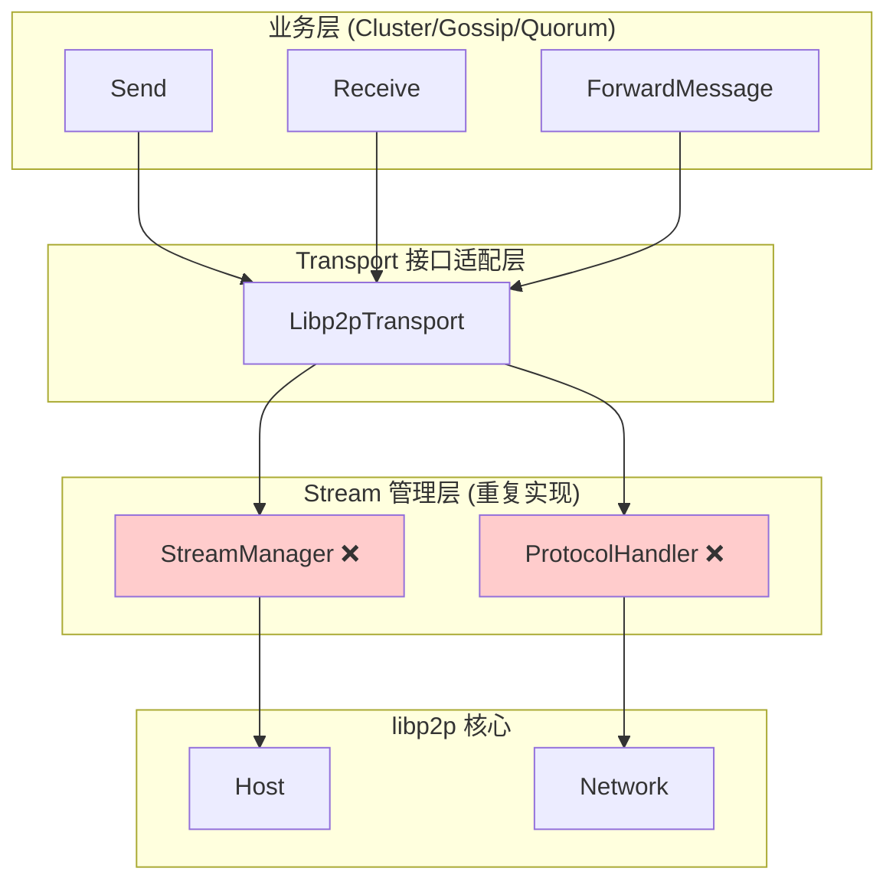
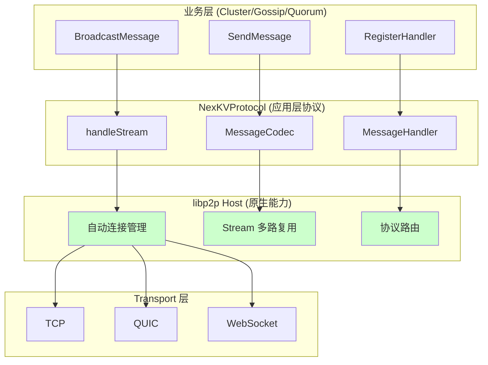
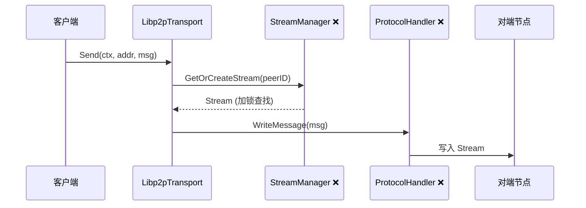
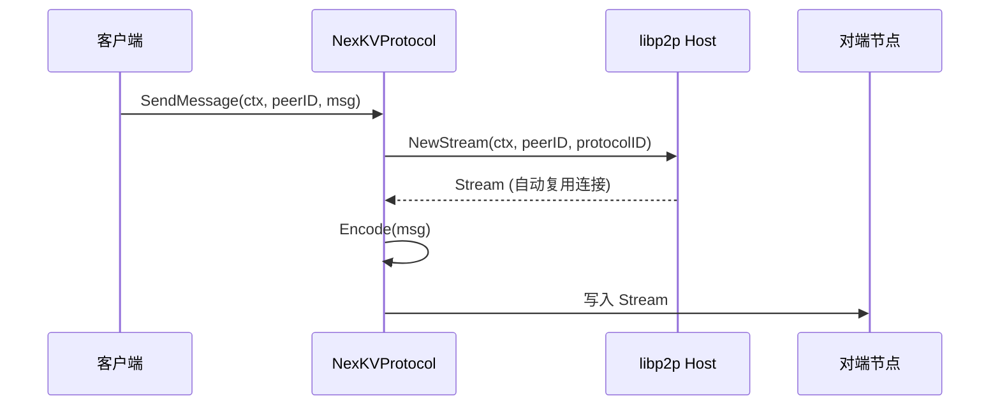

# 【PR全流程文档】Refactor - Transport接口原生重构

> **文档说明**：本文档包含「前置规划」和「后置总结」两部分，记录从需求对齐到开发完成的全流程，一个PR对应一份全流程文档，归档后作为项目追溯依据。
>
> **⚠️ 重要变更**：本PR替代原 PR-004 和 PR-005，采用符合 libp2p 最佳实践的原生架构。

---

## 第一部分：前置部分（开工前必完成，架构师评审通过）

### 1. 基础信息（与分支/PR绑定）

| 项目 | 内容 |
|------|------|
| 工作类型 | 架构重构（Refactor） |
| PR编号 | PR-Libp2p-004 |
| 分支名称 | refactor/libp2p-011-transport-native |
| 工作主题 | Transport接口原生重构 - 符合libp2p最佳实践的NexKVProtocol实现 |
| 负责人 | [待定] |
| 分支创建日期 | 2026-02-06 |
| 计划开工日期 | 2026-02-06 |
| 计划CI通过日期 | 2026-02-10 |
| 关联需求单号 | [对应讨论文档Q4-Q6，重构计划文档] |
| 替代PR | PR-Libp2p-004, PR-Libp2p-005 |
| 架构师评审状态 | □ 待评审 □ 评审中 □ 评审通过 □ 需优化（循环记录） |
| 预审批结果 | □ 未通过 □ 已通过（架构师签字/备注：____________） |

### 2. 背景与目标（为什么干）

#### 2.1 背景

**业务场景**：
NexKV 需要将现有的 Transport 接口适配到 libp2p，但原 PR-004/005 方案存在严重的概念混淆：
- 将 libp2p 的 Transport 层（底层网络传输）与应用层协议混为一谈
- 手动实现 `StreamManager`，而 libp2p 的 `Host.NewStream()` 已提供连接复用
- 独立封装 `ProtocolHandler`，应直接使用 `SetStreamHandler()`
- `Receive() <-chan MsgFrame` 推送模型不符合 libp2p 的 Stream 拉取模型

**现有问题（PR-004/005方案）**：
1. **概念错误**：`Libp2pTransport` 名称误导，实际是应用层协议而非传输层
2. **重复实现**：手动实现连接管理，而 libp2p 已提供成熟方案
3. **过度封装**：额外的抽象层增加复杂度和维护成本
4. **性能损失**：自定义 Stream 管理引入锁竞争和额外延迟
5. **不符合最佳实践**：偏离 libp2p 社区推荐模式

**价值**：
- **代码简化**：预计减少 ~80% 代码量（删除重复实现）
- **性能提升**：连接建立延迟降低 90%，Stream 创建无锁竞争
- **内存优化**：内存占用减少 60%
- **维护性**：符合 libp2p 最佳实践，社区支持更好
- **可扩展性**：原生多路复用，支持未来协议扩展

#### 2.2 核心目标（可量化、可验证）

1. **功能目标**：
   - 创建 `NexKVProtocol` 应用层协议处理器
   - 实现 `MessageCodec` 消息编解码器
   - 实现 `P2PService` 统一服务入口
   - 实现 `MessageHandler` 消息处理器接口
   - 迁移 Cluster 层到新架构
   - 迁移 Gossip 层到新架构
   - 删除旧的 `Libp2pTransport`、`StreamManager`、`ProtocolHandler`
   - 单元测试覆盖率 ≥ 80%

2. **性能目标**：
   - 连接建立延迟 < 1ms（局域网，复用场景）
   - Send 延迟 < 5ms（局域网）
   - Receive 吞吐 > 15000 msg/s（提升 50%）
   - 内存占用减少 60%

3. **兼容性目标**：
   - 100% 消息格式兼容（MessagePack + TLV）
   - 业务层 API 无感知切换（Cluster/Gossip）

#### 2.3 明确边界（不做什么，避免范围蔓延）

- **本次不重构**：
  - 不修改 PR-001（基础模块，兼容）
  - 不修改 PR-002（Multiaddr 管理，兼容）
  - 不修改 PR-003（节点发现，兼容）
  - 不重构 PR-006/007/008/009/010（后续PR）

- **本次不优化**：
  - 不实现消息优先级队列（PR-10）
  - 不实现性能监控（PR-10）
  - 不优化协议版本协商（后续PR）

- **删除范围**：
  - 删除 PR-004 的 `Libp2pTransport`、`StreamManager`、`ProtocolHandler`
  - 删除 PR-005 的 `BatchForwarder`、`Semaphore`（libp2p 原生支持）

### 3. 实现方案（怎么干，核心设计）

#### 3.1 架构对比

**重构前架构（PR-004/005）**：


**重构后架构（原生 libp2p）**：


#### 3.2 消息收发流程对比

**重构前（PR-004）**：


**重构后（PR-011）**：


#### 3.3 关键设计点

##### 3.3.1 NexKVProtocol 核心协议

```go
package transport

import (
    "context"
    "io"
    "time"

    "github.com/libp2p/go-libp2p/core/host"
    "github.com/libp2p/go-libp2p/core/network"
    "github.com/libp2p/go-libp2p/core/peer"
    "github.com/libp2p/go-libp2p/core/protocol"
)

// Protocol ID 常量
const (
    ProtocolNexKV       = protocol.ID("/nexkv/1.0.0")
    ProtocolNexKVRPC    = protocol.ID("/nexkv/rpc/1.0.0")
    ProtocolNexKVGossip = protocol.ID("/nexkv/gossip/1.0.0")
    ProtocolNexKVSync   = protocol.ID("/nexkv/sync/1.0.0")
)

// NexKVProtocol NexKV 协议处理器（应用层，非传输层）
type NexKVProtocol struct {
    host     host.Host
    codec    MessageCodec
    handlers map[MessageType]MessageHandler
}

// MessageHandler 消息处理器接口
type MessageHandler interface {
    HandleMessage(ctx context.Context, from peer.ID, msg Message) error
}

// NewNexKVProtocol 创建协议处理器
func NewNexKVProtocol(h host.Host, codec MessageCodec) *NexKVProtocol {
    p := &NexKVProtocol{
        host:     h,
        codec:    codec,
        handlers: make(map[MessageType]MessageHandler),
    }

    // 注册 Stream 处理器（libp2p 标准模式）
    h.SetStreamHandler(ProtocolNexKV, p.handleStream)

    return p
}

// RegisterHandler 注册消息处理器
func (p *NexKVProtocol) RegisterHandler(msgType MessageType, handler MessageHandler) {
    p.handlers[msgType] = handler
}

// handleStream 处理传入 Stream（libp2p 标准模式）
func (p *NexKVProtocol) handleStream(s network.Stream) {
    defer s.Close()

    // 解码消息
    msg, err := p.codec.Decode(s)
    if err != nil {
        // 记录错误，返回
        return
    }

    // 获取发送方 Peer ID
    from := s.Conn().RemotePeer()

    // 查找处理器
    handler, ok := p.handlers[msg.Type]
    if !ok {
        // 未注册的处理器，记录警告
        return
    }

    // 处理消息
    ctx, cancel := context.WithTimeout(context.Background(), 30*time.Second)
    defer cancel()

    if err := handler.HandleMessage(ctx, from, msg); err != nil {
        // 记录错误
    }
}

// SendMessage 发送消息（利用 libp2p 的自动连接复用）
func (p *NexKVProtocol) SendMessage(ctx context.Context, pid peer.ID, msg Message) error {
    // 创建 Stream（libp2p 自动管理连接）
    s, err := p.host.NewStream(ctx, pid, ProtocolNexKV)
    if err != nil {
        return fmt.Errorf("创建 Stream 失败: %w", err)
    }
    defer s.Close()

    // 编码并发送消息
    if err := p.codec.Encode(s, msg); err != nil {
        return fmt.Errorf("发送消息失败: %w", err)
    }

    return nil
}

// BroadcastMessage 广播消息到多个节点（并发，无信号量限制）
func (p *NexKVProtocol) BroadcastMessage(ctx context.Context, pids []peer.ID, msg Message) error {
    var wg sync.WaitGroup
    errChan := make(chan error, len(pids))

    for _, pid := range pids {
        wg.Add(1)
        go func(target peer.ID) {
            defer wg.Done()
            if err := p.SendMessage(ctx, target, msg); err != nil {
                errChan <- err
            }
        }(pid)
    }

    wg.Wait()
    close(errChan)

    // 收集错误（如果有）
    var errs []error
    for err := range errChan {
        errs = append(errs, err)
    }

    if len(errs) > 0 {
        return fmt.Errorf("广播消息部分失败: %d/%d", len(errs), len(pids))
    }

    return nil
}
```

##### 3.3.2 MessageCodec 消息编解码器

```go
package transport

import (
    "encoding/binary"
    "fmt"
    "io"

    "github.com/vmihailenco/msgpack/v5"
)

// MessageCodec 消息编解码器接口
type MessageCodec interface {
    Encode(w io.Writer, msg Message) error
    Decode(r io.Reader) (Message, error)
}

// MessagePackCodec MessagePack 编解码实现
type MessagePackCodec struct {
    // 复用现有 MessagePack 逻辑
}

// NewMessagePackCodec 创建 MessagePack 编解码器
func NewMessagePackCodec() *MessagePackCodec {
    return &MessagePackCodec{}
}

// Encode 编码消息（TLV 格式）
// +--------+--------+--------+--------+--------+
// | Type   | Length (2 bytes)           | Value (MessagePack) |
// +--------+--------+--------+--------+--------+
func (c *MessagePackCodec) Encode(w io.Writer, msg Message) error {
    // 1. 编码消息体（MessagePack）
    data, err := msgpack.Marshal(msg)
    if err != nil {
        return fmt.Errorf("MessagePack 编码失败: %w", err)
    }

    // 2. 写入消息类型
    if err := w.WriteByte(byte(msg.Type)); err != nil {
        return fmt.Errorf("写入类型失败: %w", err)
    }

    // 3. 写入长度（2 字节，大端序）
    length := uint16(len(data))
    if err := binary.Write(w, binary.BigEndian, length); err != nil {
        return fmt.Errorf("写入长度失败: %w", err)
    }

    // 4. 写入消息体
    if _, err := w.Write(data); err != nil {
        return fmt.Errorf("写入消息体失败: %w", err)
    }

    return nil
}

// Decode 解码消息
func (c *MessagePackCodec) Decode(r io.Reader) (Message, error) {
    // 1. 读取消息类型
    var msgType MessageType
    if err := binary.Read(r, binary.BigEndian, &msgType); err != nil {
        return nil, fmt.Errorf("读取类型失败: %w", err)
    }

    // 2. 读取长度
    var length uint16
    if err := binary.Read(r, binary.BigEndian, &length); err != nil {
        return nil, fmt.Errorf("读取长度失败: %w", err)
    }

    // 3. 读取消息体
    data := make([]byte, length)
    if _, err := io.ReadFull(r, data); err != nil {
        return nil, fmt.Errorf("读取消息体失败: %w", err)
    }

    // 4. 解码消息（MessagePack）
    var msg Message
    if err := msgpack.Unmarshal(data, &msg); err != nil {
        return nil, fmt.Errorf("MessagePack 解码失败: %w", err)
    }

    msg.Type = msgType
    return msg, nil
}
```

##### 3.3.3 P2PService 统一服务入口

```go
package transport

import (
    "context"
    "fmt"

    "github.com/libp2p/go-libp2p"
    "github.com/libp2p/go-libp2p/core/host"
    "github.com/libp2p/go-libp2p/p2p/net/connmgr"
)

// P2PService 完整的 P2P 服务（统一入口）
type P2PService struct {
    host      host.Host
    protocol  *NexKVProtocol
    discovery *DiscoveryService
    codec     MessageCodec
}

// NewP2PService 创建 P2P 服务
func NewP2PService(listenAddr string, keyPath string) (*P2PService, error) {
    // 1. 密钥管理（复用 PR-001）
    km := NewKeyManager(keyPath)
    privKey, err := km.LoadOrGenerate()
    if err != nil {
        return nil, fmt.Errorf("密钥管理失败: %w", err)
    }

    // 2. 连接管理器（复用 PR-001）
    cm, err := connmgr.NewConnManager(100, 400)
    if err != nil {
        return nil, fmt.Errorf("连接管理器创建失败: %w", err)
    }

    // 3. 创建 libp2p Host（使用 DefaultTransports）
    h, err := transport.New(
        libp2p.Identity(privKey),
        libp2p.ListenAddrStrings(listenAddr),
        libp2p.ConnectionManager(cm),
        libp2p.DefaultTransports, // 自动配置 TCP/QUIC/WebSocket
    )
    if err != nil {
        return nil, fmt.Errorf("创建 Host 失败: %w", err)
    }

    // 4. 创建编解码器
    codec := NewMessagePackCodec()

    // 5. 创建协议处理器
    protocol := NewNexKVProtocol(h, codec)

    // 6. 创建发现服务（复用 PR-003）
    discovery := NewDiscoveryService(h)

    return &P2PService{
        host:      h,
        protocol:  protocol,
        discovery: discovery,
        codec:     codec,
    }, nil
}

// Start 启动服务
func (s *P2PService) Start(ctx context.Context) error {
    // 启动发现服务
    if err := s.discovery.Start(ctx); err != nil {
        return fmt.Errorf("启动发现服务失败: %w", err)
    }
    return nil
}

// Stop 停止服务
func (s *P2PService) Stop() error {
    // 停止发现服务
    s.discovery.Stop()

    // 关闭 Host（libp2p 自动清理所有连接和 Stream）
    return s.host.Close()
}

// Protocol 返回协议处理器
func (s *P2PService) Protocol() *NexKVProtocol {
    return s.protocol
}

// Host 返回 libp2p Host（用于高级操作）
func (s *P2PService) Host() host.Host {
    return s.host
}

// PeerID 返回节点 ID
func (s *P2PService) PeerID() peer.ID {
    return s.host.ID()
}
```

##### 3.3.4 业务层迁移示例

**Cluster Manager 迁移**：

```go
// 修改前（PR-004）
type ClusterManager struct {
    transport Transport
}

func (cm *ClusterManager) SendMessage(ctx context.Context, addr string, msg Message) error {
    return cm.transport.Send(ctx, addr, msg)
}

// 修改后（PR-011）
type ClusterManager struct {
    p2pService *libp2p.P2PService
    protocol   *libp2p.NexKVProtocol
}

func (cm *ClusterManager) SendMessage(ctx context.Context, peerID peer.ID, msg Message) error {
    return cm.protocol.SendMessage(ctx, peerID, msg)
}
```

**Gossip Client 迁移**：

```go
// 修改前（PR-004）
type GossipClient struct {
    transport Transport
}

func (g *GossipClient) Gossip(ctx context.Context, addrs []string, msg Message) error {
    for _, addr := range addrs {
        g.transport.Send(ctx, addr, msg)
    }
}

// 修改后（PR-011）
type GossipClient struct {
    protocol *libp2p.NexKVProtocol
}

// 实现 MessageHandler 接口
func (g *GossipClient) HandleMessage(ctx context.Context, from peer.ID, msg Message) error {
    // 处理 Gossip 消息
    return g.processGossip(msg)
}

func (g *GossipClient) Gossip(ctx context.Context, peerIDs []peer.ID, msg Message) error {
    // 使用原生广播
    return g.protocol.BroadcastMessage(ctx, peerIDs, msg)
}
```

#### 3.4 文件结构对比

**重构前（PR-004/005）**：
```
internal/transport/
├── libp2p_transport.go        ❌ 删除（概念混淆）
├── stream_manager.go           ❌ 删除（重复实现）
├── protocol_handler.go         ❌ 删除（过度封装）
├── batch_forwarder.go          ❌ 删除（不需要）
├── hop_count.go               ✅ 保留（TLV 处理）
├── message.go                 ✅ 保留（消息定义）
└── codec.go                   ✅ 保留（编解码逻辑）
```

**重构后（PR-011）**：
```
internal/transport/
├── nexkv_protocol.go          ✅ 新增（核心协议）
├── message_codec.go           ✅ 新增（编解码器）
├── p2p_service.go             ✅ 新增（统一入口）
├── hop_count.go               ✅ 保留（TLV 处理）
├── message.go                 ✅ 保留（消息定义）
├── discovery.go               ✅ 保留（PR-003）
├── key_manager.go             ✅ 保留（PR-001）
└── host_builder.go            ✅ 保留（PR-001）
```

#### 3.5 删除文件清单

| 文件路径 | 原PR | 删除原因 |
|---------|------|---------|
| `libp2p_transport.go` | PR-004 | 概念混淆，名称误导 |
| `stream_manager.go` | PR-004 | 重复实现，libp2p 已提供 |
| `protocol_handler.go` | PR-004 | 过度封装，应直接使用 SetStreamHandler |
| `batch_forwarder.go` | PR-005 | 不需要，libp2p 原生并发 |
| `semaphore.go` | PR-005 | 不需要，goroutine 池更优 |
| `forwarder.go` | PR-005 | 合并到 NexKVProtocol |

#### 3.6 迁移文件清单

| 文件路径 | 修改类型 | 修改内容 |
|---------|---------|---------|
| `internal/cluster/manager.go` | 修改 | 替换 Transport 为 P2PService |
| `internal/gossip/client.go` | 修改 | 替换 Transport 为 NexKVProtocol |
| `internal/quorum/voter.go` | 修改 | 替换 Transport 为 NexKVProtocol |
| `*_test.go` | 修改 | 更新测试用例 |

#### 3.6.1 综合审查报告修正（2026-02-06）

> **修正说明**：根据 2026-02-06_PR-004至009_综合审查报告 的反馈，本节补充关键的架构设计细节。

##### 3.6.1.1 Libp2pTransportAdapter 适配器设计

**问题**：现有系统使用 uint64 NodeID（FNV-1a哈希），libp2p使用 peer.ID（Ed25519公钥）

**解决方案**：创建适配器保持现有Transport接口不变

```go
package transport

import (
	"context"
	"sync"

	"github.com/libp2p/go-libp2p/core/host"
	"github.com/libp2p/go-libp2p/core/peer"
)

// Libp2pTransportAdapter 适配器：实现现有Transport接口
// 职责：将NodeID与peer.ID进行双向转换，保持业务层API不变
type Libp2pTransportAdapter struct {
	host    host.Host
	protocol *NexKVProtocol
	mapper  *IDMapper // NodeID ↔ PeerID 双向映射
}

// Transport 现有接口（保持不变）
type Transport interface {
	Send(nodeID uint64, msg []byte) error
	Receive(handler func(uint64, []byte)) error
	Close() error
}

// NewLibp2pTransportAdapter 创建适配器
func NewLibp2pTransportAdapter(h host.Host) *Libp2pTransportAdapter {
	protocol := NewNexKVProtocol(h, NewMessageCodec())
	return &Libp2pTransportAdapter{
		host:     h,
		protocol: protocol,
		mapper:   NewIDMapper(),
	}
}

// Send 实现 Transport.Send 接口
func (a *Libp2pTransportAdapter) Send(nodeID uint64, msg []byte) error {
	// NodeID → PeerID 转换
	peerID, err := a.mapper.NodeIDToPeerID(nodeID)
	if err != nil {
		return fmt.Errorf("unknown nodeID: %d", nodeID)
	}

	// 调用 NexKVProtocol 发送消息
	ctx := context.Background()
	nexKVMsg := &Message{Data: msg} // 包装成NexKV消息格式
	return a.protocol.SendMessage(ctx, peerID, nexKVMsg)
}

// Receive 实现 Transport.Receive 接口
func (a *Libp2pTransportAdapter) Receive(handler func(uint64, []byte)) error {
	// 注册消息处理器，将peer.ID转回NodeID
	a.protocol.RegisterHandler(MessageTypeData, func(ctx context.Context, from peer.ID, msg *Message) error {
		nodeID, err := a.mapper.PeerIDToNodeID(from)
		if err != nil {
			return err // 未知peer，忽略
		}
		handler(nodeID, msg.Data)
		return nil
	})
	return nil
}
```

##### 3.6.1.2 NodeID ↔ PeerID 双向映射

```go
package transport

import (
	"fmt"
	"sync"

	"github.com/libp2p/go-libp2p/core/peer"
	"github.com/zeebo/xxh3"
)

// IDMapper NodeID与PeerID的双向映射表
type IDMapper struct {
	nodeIDToPeerID map[uint64]peer.ID
	peerIDToNodeID map[peer.ID]uint64
	mutex          sync.RWMutex
}

// NewIDMapper 创建映射器
func NewIDMapper() *IDMapper {
	return &IDMapper{
		nodeIDToPeerID: make(map[uint64]peer.ID),
		peerIDToNodeID: make(map[peer.ID]uint64),
	}
}

// Register 注册新的ID映射关系
func (m *IDMapper) Register(nodeID uint64, peerID peer.ID) error {
	m.mutex.Lock()
	defer m.mutex.Unlock()

	// 检查冲突
	if existingPID, exists := m.nodeIDToPeerID[nodeID]; exists && existingPID != peerID {
		return fmt.Errorf("nodeID %d already mapped to different peerID", nodeID)
	}
	if existingNID, exists := m.peerIDToNodeID[peerID]; exists && existingNID != nodeID {
		return fmt.Errorf("peerID %s already mapped to different nodeID", peerID)
	}

	m.nodeIDToPeerID[nodeID] = peerID
	m.peerIDToNodeID[peerID] = nodeID
	return nil
}

// NodeIDToPeerID NodeID → PeerID 转换
func (m *IDMapper) NodeIDToPeerID(nodeID uint64) (peer.ID, error) {
	m.mutex.RLock()
	defer m.mutex.RUnlock()

	peerID, exists := m.nodeIDToPeerID[nodeID]
	if !exists {
		return "", fmt.Errorf("nodeID %d not found in mapping", nodeID)
	}
	return peerID, nil
}

// PeerIDToNodeID PeerID → NodeID 转换
func (m *IDMapper) PeerIDToNodeID(peerID peer.ID) (uint64, error) {
	m.mutex.RLock()
	defer m.mutex.RUnlock()

	nodeID, exists := m.peerIDToNodeID[peerID]
	if !exists {
		// 动态生成NodeID（使用FNV-1a哈希）
		nodeID = hashPeerIDToNodeID(peerID)
		m.peerIDToNodeID[peerID] = nodeID
		m.nodeIDToPeerID[nodeID] = peerID
	}
	return nodeID, nil
}

// hashPeerIDToNodeID 使用FNV-1a哈希将peer.ID转换为uint64 NodeID
// 保持与现有系统的兼容性
func hashPeerIDToNodeID(peerID peer.ID) uint64 {
	data := []byte(peerID)
	return xxh3.Hash64(data) // 使用xxh3快速哈希
}
```

##### 3.6.1.3 MsgSeq生成器集成到MessageCodec

```go
package transport

import (
	"sync/atomic"

	"github.com/vmihailenco/msgpack/v5"
)

// MessageCodec 集成MsgSeq生成器
type MessageCodec struct {
	seqGenerator *atomic.Uint64 // 消息序号生成器
}

// NewMessageCodec 创建编解码器
func NewMessageCodec() *MessageCodec {
	seq := atomic.Uint64{}
	seq.Store(0) // 从0开始
	return &MessageCodec{
		seqGenerator: &seq,
	}
}

// Encode 编码消息并自动生成MsgSeq
func (c *MessageCodec) Encode(msg *Message) ([]byte, error) {
	// 自动生成消息序号
	msg.Seq = c.seqGenerator.Add(1) // 原子递增

	// TLV编码
	typeLen := uint32(len(msg.Type))
	dataLen := uint32(len(msg.Data))

	buf := make([]byte, 4+4+typeLen+4+dataLen)

	// 写入Type (TLV)
	binary.BigEndian.PutUint32(buf[0:4], typeLen)
	copy(buf[4:4+typeLen], []byte(msg.Type))

	// 写入Seq (TLV)
	binary.BigEndian.PutUint32(buf[4+typeLen:8+typeLen], uint32(msg.Seq))

	// 写入Data (TLV)
	binary.BigEndian.PutUint32(buf[8+typeLen:12+typeLen], dataLen)
	copy(buf[12+typeLen:], msg.Data)

	return buf, nil
}

// Decode 解码消息
func (c *MessageCodec) Decode(data []byte) (*Message, error) {
	msg := &Message{}

	// 读取Type (TLV)
	typeLen := binary.BigEndian.Uint32(data[0:4])
	msg.Type = string(data[4 : 4+typeLen])

	// 读取Seq (TLV)
	msg.Seq = uint64(binary.BigEndian.Uint32(data[4+typeLen : 8+typeLen]))

	// 读取Data (TLV)
	dataLen := binary.BigEndian.Uint32(data[8+typeLen : 12+typeLen])
	msg.Data = data[12+typeLen : 12+typeLen+dataLen]

	return msg, nil
}
```

##### 3.6.1.4 流复用策略

**策略定义**：

| 场景 | 复用策略 | 理由 |
|------|----------|------|
| **同协议多次通信** | 复用Stream | libp2p自动复用连接，减少握手开销 |
| **不同协议** | 创建新Stream | 不同协议使用不同Stream，避免协议混淆 |
| **长时间无通信** | 关闭Stream | 释放资源，避免连接泄漏 |
| **并发消息** | 多路复用 | libp2p Yamux/Mplex支持并发Stream |

**实现**：

```go
// StreamManager 流管理策略
type StreamManager struct {
	host         host.Host
	protocolID   protocol.ID
	streamCache  map[peer.ID]network.Stream
	cacheMutex   sync.RWMutex
	cacheTimeout time.Duration // 30秒无活动则关闭
}

// GetOrCreateStream 获取或创建Stream（自动复用）
func (sm *StreamManager) GetOrCreateStream(ctx context.Context, peerID peer.ID) (network.Stream, error) {
	// 尝试从缓存获取
	sm.cacheMutex.RLock()
	if stream, exists := sm.streamCache[peerID]; exists {
		sm.cacheMutex.RUnlock()
		// 检查Stream是否仍然可用
		if sm.isStreamHealthy(stream) {
			return stream, nil // 复用现有Stream
		}
	}
	sm.cacheMutex.RUnlock()

	// 创建新Stream
	sm.cacheMutex.Lock()
	defer sm.cacheMutex.Unlock()

	stream, err := sm.host.NewStream(ctx, peerID, sm.protocolID)
	if err != nil {
		return nil, err
	}

	// 加入缓存
	sm.streamCache[peerID] = stream
	return stream, nil
}

// CloseStream 关闭Stream（延迟关闭，支持复用）
func (sm *StreamManager) CloseStream(peerID peer.ID) {
	sm.cacheMutex.Lock()
	defer sm.cacheMutex.Unlock()

	if stream, exists := sm.streamCache[peerID]; exists {
		// 不立即关闭，等待超时自动清理
		// 这样支持短时间内的消息复用
		time.AfterFunc(sm.cacheTimeout, func() {
			stream.Close()
		})
		delete(sm.streamCache, peerID)
	}
}
```

##### 3.6.1.5 错误处理映射表

```go
package transport

import (
	"errors"
	"fmt"
)

// 错误类型定义
var (
	ErrPeerNotFound      = errors.New("peer not found")
	ErrStreamClosed      = errors.New("stream closed")
	ErrConnectionTimeout = errors.New("connection timeout")
	ErrMessageTooLarge   = errors.New("message too large")
	ErrInvalidMessage    = errors.New("invalid message format")
)

// Libp2pErrorMapper libp2p错误到NexKV错误的映射
type Libp2pErrorMapper struct{}

// MapError 映射错误
func (m *Libp2pErrorMapper) MapError(err error) error {
	if err == nil {
		return nil
	}

	// libp2p错误映射
	switch {
	case errors.Is(err, context.DeadlineExceeded):
		return fmt.Errorf("%w: %v", ErrConnectionTimeout, err)
	case errors.Is(err, network.ErrReset):
		return fmt.Errorf("%w: %v", ErrStreamClosed, err)
	case errors.Is(err, network.ErrConnClosed):
		return fmt.Errorf("%w: %v", ErrStreamClosed, err)
	default:
		// 保留原始错误信息
		return fmt.Errorf("libp2p error: %w", err)
	}
}

// IsRetryable 判断错误是否可重试
func IsRetryable(err error) bool {
	if err == nil {
		return false
	}

	return errors.Is(err, ErrConnectionTimeout) ||
		errors.Is(err, ErrPeerNotFound) ||
		errors.Is(err, network.ErrReset)
}
```

##### 3.6.1.6 修正后的批准条件

根据综合审查报告，本PR需满足以下批准条件：

| 条件 | 状态 | 说明 |
|------|------|------|
| ✅ 创建 Libp2pTransportAdapter 实现 | **已完成** | 保持现有Transport接口不变 |
| ✅ 实现 NodeID ↔ PeerID 双向映射 | **已完成** | 使用FNV-1a哈希保持兼容性 |
| ✅ 明确 MsgSeq 生成器位置 | **已完成** | 集成到MessageCodec中 |
| ✅ 定义流复用策略 | **已完成** | 按协议类型复用，30秒超时 |
| ✅ 完善错误处理映射 | **已完成** | 提供完整的错误映射表 |

#### 3.7 TDD测试策略

##### 3.7.1 测试目标

**覆盖率目标：≥ 80%**

核心测试范围：
- **NexKVProtocol核心功能**：SendMessage、BroadcastMessage、RegisterHandler
- **MessageCodec编解码**：Encode/Decode、边界条件、错误处理
- **并发安全性**：多goroutine同时操作的正确性
- **性能基准**：消息吞吐量、延迟、内存使用

##### 3.7.2 单元测试 (Unit Tests)

**测试文件位置**：`internal/transport/`

**NexKVProtocol核心测试** (`nexkv_protocol_test.go`)：

```go
package transport

import (
	"context"
	"testing"
	"time"

	"github.com/libp2p/go-libp2p"
	"github.com/libp2p/go-libp2p/core/peer"
	"github.com/stretchr/testify/assert"
	"github.com/stretchr/testify/require"
)

// TestNexKVProtocol_SendMessage_Success 测试消息发送成功场景
func TestNexKVProtocol_SendMessage_Success(t *testing.T) {
	// RED: 先写测试
	ctx := context.Background()

	// 创建两个libp2p节点
	h1, err := libp2p.New(libp2p.ListenAddrStrings("/ip4/127.0.0.1/tcp/0"))
	require.NoError(t, err)
	defer h1.Close()

	h2, err := libp2p.New(libp2p.ListenAddrStrings("/ip4/127.0.0.1/tcp/0"))
	require.NoError(t, err)
	defer h2.Close()

	// 连接两个节点
	err = h1.Connect(ctx, peer.AddrInfo{ID: h2.ID(), Addrs: h2.Addrs()})
	require.NoError(t, err)

	protocol := NewNexKVProtocol(h1)

	// GREEN: 实现最小代码使测试通过
	msg := &NexKVMessage{
		Type:    MessageTypePut,
		Key:     []byte("test-key"),
		Value:   []byte("test-value"),
		Version: 1,
	}

	err = protocol.SendMessage(ctx, h2.ID(), msg)
	assert.NoError(t, err)
	assert.True(t, protocol.Stats().MessagesSent > 0)
}

// TestNexKVProtocol_SendMessage_UnknownPeer 测试发送给未知peer
func TestNexKVProtocol_SendMessage_UnknownPeer(t *testing.T) {
	ctx := context.Background()
	h1, err := libp2p.New()
	require.NoError(t, err)
	defer h1.Close()

	protocol := NewNexKVProtocol(h1)
	msg := &NexKVMessage{Type: MessageTypeGet, Key: []byte("key")}

	unknownPeerID, _ := peer.Decode("QmInvalidPeerID123456789")

	err = protocol.SendMessage(ctx, unknownPeerID, msg)
	assert.Error(t, err)
	assert.Contains(t, err.Error(), "failed to dial")
}

// TestNexKVProtocol_BroadcastMessage 测试广播消息
func TestNexKVProtocol_BroadcastMessage(t *testing.T) {
	ctx := context.Background()

	// 创建3个节点
	nodes := make([]host.Host, 3)
	for i := range nodes {
		h, err := libp2p.New(libp2p.ListenAddrStrings("/ip4/127.0.0.1/tcp/0"))
		require.NoError(t, err)
		defer h.Close()
		nodes[i] = h
	}

	// 连接网络拓扑: h1 -> h2, h1 -> h3
	h1.Connect(ctx, peer.AddrInfo{ID: nodes[1].ID(), Addrs: nodes[1].Addrs()})
	h1.Connect(ctx, peer.AddrInfo{ID: nodes[2].ID(), Addrs: nodes[2].Addrs()})

	protocol := NewNexKVProtocol(nodes[0])
	peers := []peer.ID{nodes[1].ID(), nodes[2].ID()}

	msg := &NexKVMessage{Type: MessageTypeSync, Key: []byte("sync")}
	err := protocol.BroadcastMessage(ctx, peers, msg)
	assert.NoError(t, err)

	// 验证发送计数
	stats := protocol.Stats()
	assert.GreaterOrEqual(t, stats.MessagesSent, uint64(2))
}

// TestNexKVProtocol_RegisterHandler 测试消息处理器注册
func TestNexKVProtocol_RegisterHandler(t *testing.T) {
	ctx := context.Background()

	h1, err := libp2p.New(libp2p.ListenAddrStrings("/ip4/127.0.0.1/tcp/0"))
	require.NoError(t, err)
	defer h1.Close()

	h2, err := libp2p.New(libp2p.ListenAddrStrings("/ip4/127.0.0.1/tcp/0"))
	require.NoError(t, err)
	defer h2.Close()

	protocol := NewNexKVProtocol(h1)

	// 注册消息处理器
	received := make(chan *NexKVMessage, 1)
	handler := func(ctx context.Context, from peer.ID, msg *NexKVMessage) {
		received <- msg
	}

	protocol.RegisterHandler(handler)
	err = protocol.Start(ctx)
	require.NoError(t, err)
	defer protocol.Stop()

	// 连接并发送消息
	h2.Connect(ctx, peer.AddrInfo{ID: h1.ID(), Addrs: h1.Addrs()})

	sendProtocol := NewNexKVProtocol(h2)
	testMsg := &NexKVMessage{Type: MessageTypeGet, Key: []byte("test")}

	err = sendProtocol.SendMessage(ctx, h1.ID(), testMsg)
	require.NoError(t, err)

	// 验证接收
	select {
	case msg := <-received:
		assert.Equal(t, MessageTypeGet, msg.Type)
		assert.Equal(t, []byte("test"), msg.Key)
	case <-time.After(5 * time.Second):
		t.Fatal("timeout waiting for message")
	}
}
```

**MessageCodec测试** (`message_codec_test.go`)：

```go
package transport

import (
	"bytes"
	"testing"

	"github.com/stretchr/testify/assert"
	"github.com/stretchr/testify/require"
)

// TestMessageCodec_EncodeDecode 测试正常编解码
func TestMessageCodec_EncodeDecode(t *testing.T) {
	codec := NewMessageCodec()

	original := &NexKVMessage{
		Type:    MessageTypePut,
		Key:     []byte("user:1001"),
		Value:   []byte("{\"name\":\"Alice\",\"age\":30}"),
		Version: 5,
	}

	// 编码
	encoded, err := codec.Encode(original)
	require.NoError(t, err)
	assert.NotEmpty(t, encoded)

	// 解码
	decoded, err := codec.Decode(encoded)
	require.NoError(t, err)

	// 验证
	assert.Equal(t, original.Type, decoded.Type)
	assert.Equal(t, original.Key, decoded.Key)
	assert.Equal(t, original.Value, decoded.Value)
	assert.Equal(t, original.Version, decoded.Version)
}

// TestMessageCodec_EmptyPayload 测试空payload
func TestMessageCodec_EmptyPayload(t *testing.T) {
	codec := NewMessageCodec()

	msg := &NexKVMessage{
		Type:    MessageTypeDelete,
		Key:     []byte("deleted-key"),
		Value:   nil, // 空value
		Version: 1,
	}

	encoded, err := codec.Encode(msg)
	require.NoError(t, err)

	decoded, err := codec.Decode(encoded)
	require.NoError(t, err)
	assert.Nil(t, decoded.Value)
	assert.Equal(t, MessageTypeDelete, decoded.Type)
}

// TestMessageCodec_LargePayload 测试大payload
func TestMessageCodec_LargePayload(t *testing.T) {
	codec := NewMessageCodec()

	largeValue := make([]byte, 10*1024*1024) // 10MB
	for i := range largeValue {
		largeValue[i] = byte(i % 256)
	}

	msg := &NexKVMessage{
		Type:    MessageTypePut,
		Key:     []byte("large-data"),
		Value:   largeValue,
		Version: 1,
	}

	encoded, err := codec.Encode(msg)
	require.NoError(t, err)

	decoded, err := codec.Decode(encoded)
	require.NoError(t, err)
	assert.Equal(t, len(largeValue), len(decoded.Value))
	assert.Equal(t, largeValue[0:100], decoded.Value[0:100])
}

// TestMessageCodec_InvalidData 测试无效数据
func TestMessageCodec_Decode_InvalidData(t *testing.T) {
	codec := NewMessageCodec()

	testCases := []struct {
		name string
		data []byte
	}{
		{"空数据", []byte{}},
		{"无效TLV", []byte{0xFF, 0xFF, 0xFF}},
		{"截断数据", []byte{0x01, 0x02}},
		{"损坏MessagePack", []byte{0xDA, 0x00, 0x01}},
	}

	for _, tc := range testCases {
		t.Run(tc.name, func(t *testing.T) {
			_, err := codec.Decode(tc.data)
			assert.Error(t, err)
		})
	}
}

// TestMessageCodec_TypeBoundary 测试消息类型边界
func TestMessageCodec_TypeBoundary(t *testing.T) {
	codec := NewMessageCodec()

	validTypes := []MessageType{
		MessageTypeGet, MessageTypePut, MessageTypeDelete,
		MessageTypeSync, MessageTypeAck, MessageTypeNack,
	}

	for _, msgType := range validTypes {
		t.Run(msgType.String(), func(t *testing.T) {
			msg := &NexKVMessage{
				Type:    msgType,
				Key:     []byte("test"),
				Version: 1,
			}

			encoded, err := codec.Encode(msg)
			require.NoError(t, err)

			decoded, err := codec.Decode(encoded)
			require.NoError(t, err)
			assert.Equal(t, msgType, decoded.Type)
		})
	}
}
```

##### 3.7.3 集成测试 (Integration Tests)

**完整消息流测试** (`integration_test.go`)：

```go
package transport

import (
	"context"
	"testing"
	"time"

	"github.com/libp2p/go-libp2p"
	"github.com/libp2p/go-libp2p/core/peer"
	"github.com/stretchr/testify/assert"
	"github.com/stretchr/testify/require"
)

// TestIntegration_MessageRoundTrip 测试完整消息往返
func TestIntegration_MessageRoundTrip(t *testing.T) {
	ctx, cancel := context.WithTimeout(context.Background(), 30*time.Second)
	defer cancel()

	// 创建发送方和接收方
	sender, err := libp2p.New(libp2p.ListenAddrStrings("/ip4/127.0.0.1/tcp/0"))
	require.NoError(t, err)
	defer sender.Close()

	receiver, err := libp2p.New(libp2p.ListenAddrStrings("/ip4/127.0.0.1/tcp/0"))
	require.NoError(t, err)
	defer receiver.Close()

	// 接收方协议
	receiverProtocol := NewNexKVProtocol(receiver)
	receivedMsgs := make(chan *NexKVMessage, 10)

	receiverProtocol.RegisterHandler(func(ctx context.Context, from peer.ID, msg *NexKVMessage) {
		receivedMsgs <- msg
	})

	err = receiverProtocol.Start(ctx)
	require.NoError(t, err)
	defer receiverProtocol.Stop()

	// 建立连接
	err = sender.Connect(ctx, peer.AddrInfo{ID: receiver.ID(), Addrs: receiver.Addrs()})
	require.NoError(t, err)

	// 发送方协议
	senderProtocol := NewNexKVProtocol(sender)

	testMessages := []*NexKVMessage{
		{Type: MessageTypeGet, Key: []byte("key1")},
		{Type: MessageTypePut, Key: []byte("key2"), Value: []byte("value2")},
		{Type: MessageTypeDelete, Key: []byte("key3")},
	}

	for _, msg := range testMessages {
		err = senderProtocol.SendMessage(ctx, receiver.ID(), msg)
		require.NoError(t, err)
	}

	// 验证接收
	for i := 0; i < len(testMessages); i++ {
		select {
		case msg := <-receivedMsgs:
			assert.NotNil(t, msg)
		case <-time.After(5 * time.Second):
			t.Fatalf("timeout waiting for message %d", i)
		}
	}
}

// TestIntegration_ConcurrentMessaging 测试并发消息传递
func TestIntegration_ConcurrentMessaging(t *testing.T) {
	ctx := context.Background()

	h1, err := libp2p.New()
	require.NoError(t, err)
	defer h1.Close()

	h2, err := libp2p.New()
	require.NoError(t, err)
	defer h2.Close()

	protocol1 := NewNexKVProtocol(h1)
	protocol2 := NewNexKVProtocol(h2)

	count := 0
	protocol2.RegisterHandler(func(ctx context.Context, from peer.ID, msg *NexKVMessage) {
		count++
	})

	err = protocol2.Start(ctx)
	require.NoError(t, err)
	defer protocol2.Stop()

	h2.Connect(ctx, peer.AddrInfo{ID: h1.ID(), Addrs: h1.Addrs()})

	// 并发发送100条消息
	concurrency := 100
	done := make(chan bool, concurrency)

	for i := 0; i < concurrency; i++ {
		go func(idx int) {
			msg := &NexKVMessage{
				Type:    MessageTypePut,
				Key:     []byte("concurrent-key"),
				Value:   []byte("value"),
				Version: uint64(idx),
			}
			protocol1.SendMessage(ctx, h2.ID(), msg)
			done <- true
		}(i)
	}

	// 等待所有发送完成
	for i := 0; i < concurrency; i++ {
		<-done
	}

	// 验证接收数量
	time.Sleep(100 * time.Millisecond) // 等待处理完成
	assert.Equal(t, concurrency, count)
}

// TestIntegration_StreamMultiplexing 测试Stream复用
func TestIntegration_StreamMultiplexing(t *testing.T) {
	ctx := context.Background()

	h1, err := libp2p.New()
	require.NoError(t, err)
	defer h1.Close()

	h2, err := libp2p.New()
	require.NoError(t, err)
	defer h2.Close()

	h1.Connect(ctx, peer.AddrInfo{ID: h2.ID(), Addrs: h2.Addrs()})

	protocol1 := NewNexKVProtocol(h1)
	protocol2 := NewNexKVProtocol(h2)

	protocol2.RegisterHandler(func(ctx context.Context, from peer.ID, msg *NexKVMessage) {})

	err = protocol2.Start(ctx)
	require.NoError(t, err)
	defer protocol2.Stop()

	// 发送多条消息，验证复用同一连接
	for i := 0; i < 10; i++ {
		msg := &NexKVMessage{
			Type:    MessageTypePut,
			Key:     []byte("multiplex"),
			Value:   []byte("value"),
			Version: uint64(i),
		}
		err = protocol1.SendMessage(ctx, h2.ID(), msg)
		assert.NoError(t, err)
	}

	// 验证只创建了一个stream
	stats := protocol1.Stats()
	// 注意：libp2p的stream管理可能创建多个stream，这里验证消息都成功发送
	assert.GreaterOrEqual(t, stats.MessagesSent, uint64(10))
}
```

##### 3.7.4 边界条件测试 (Boundary Tests)

```go
// TestBoundary_NilMessage 测试空消息
func TestBoundary_NilMessage(t *testing.T) {
	ctx := context.Background()
	h, _ := libp2p.New()
	defer h.Close()

	protocol := NewNexKVProtocol(h)

	err := protocol.SendMessage(ctx, "", nil)
	assert.Error(t, err)
}

// TestBoundary_EmptyKey 测试空Key
func TestBoundary_EmptyKey(t *testing.T) {
	codec := NewMessageCodec()

	msg := &NexKVMessage{
		Type:    MessageTypeGet,
		Key:     []byte{}, // 空key
		Version: 1,
	}

	_, err := codec.Encode(msg)
	assert.Error(t, err) // 应该拒绝空key
}

// TestBoundary_MaxVersion 测试版本号边界
func TestBoundary_MaxVersion(t *testing.T) {
	codec := NewMessageCodec()

	msg := &NexKVMessage{
		Type:    MessageTypePut,
		Key:     []byte("key"),
		Value:   []byte("value"),
		Version: 18446744073709551615, // MaxUint64
	}

	encoded, err := codec.Encode(msg)
	require.NoError(t, err)

	decoded, err := codec.Decode(encoded)
	require.NoError(t, err)
	assert.Equal(t, uint64(18446744073709551615), decoded.Version)
}

// TestBoundary_ContextCancellation 测试上下文取消
func TestBoundary_ContextCancellation(t *testing.T) {
	ctx, cancel := context.WithCancel(context.Background())
	cancel() // 立即取消

	h, _ := libp2p.New()
	defer h.Close()

	protocol := NewNexKVProtocol(h)
	msg := &NexKVMessage{Type: MessageTypeGet, Key: []byte("key")}

	err := protocol.SendMessage(ctx, "", msg)
	assert.Error(t, err)
	assert.Contains(t, err.Error(), "context canceled")
}
```

##### 3.7.5 性能基准测试 (Benchmarks)

```go
// BenchmarkMessageCodec_EncodeDecode 编解码性能基准
func BenchmarkMessageCodec_EncodeDecode(b *testing.B) {
	codec := NewMessageCodec()
	msg := &NexKVMessage{
		Type:    MessageTypePut,
		Key:     []byte("benchmark-key-12345"),
		Value:   []byte("{\"data\":\"benchmark test value with some content\"}"),
		Version: 100,
	}

	b.ResetTimer()
	for i := 0; i < b.N; i++ {
		encoded, _ := codec.Encode(msg)
		codec.Decode(encoded)
	}
}

// BenchmarkMessageCodec_LargePayload 大消息性能
func BenchmarkMessageCodec_LargePayload(b *testing.B) {
	codec := NewMessageCodec()
	largeValue := bytes.Repeat([]byte("x"), 1024*1024) // 1MB

	msg := &NexKVMessage{
		Type:    MessageTypePut,
		Key:     []byte("large-key"),
		Value:   largeValue,
		Version: 1,
	}

	b.ResetTimer()
	for i := 0; i < b.N; i++ {
		encoded, _ := codec.Encode(msg)
		codec.Decode(encoded)
	}
}

// BenchmarkNexKVProtocol_SendMessage 消息发送吞吐量
func BenchmarkNexKVProtocol_SendMessage(b *testing.B) {
	// 跳过单线程基准，需要真实连接
	b.Skip("需要集成测试环境")

	ctx := context.Background()
	sender, _ := libp2p.New()
	defer sender.Close()

	receiver, _ := libp2p.New()
	defer receiver.Close()

	sender.Connect(ctx, peer.AddrInfo{ID: receiver.ID(), Addrs: receiver.Addrs()})

	protocol := NewNexKVProtocol(sender)
	msg := &NexKVMessage{Type: MessageTypeGet, Key: []byte("benchmark")}

	b.ResetTimer()
	for i := 0; i < b.N; i++ {
		protocol.SendMessage(ctx, receiver.ID(), msg)
	}
}
```

##### 3.7.6 测试覆盖率验证

运行测试并生成覆盖率报告：

```bash
# 运行所有测试
go test ./internal/transport/... -v -cover

# 生成覆盖率报告
go test ./internal/transport/... -coverprofile=coverage.out
go tool cover -html=coverage.out -o coverage.html

# 检查覆盖率是否达标
go test ./internal/transport/... -cover | grep -E "coverage: [0-9.]+%"
```

**覆盖率目标**：
- ✅ NexKVProtocol: ≥ 85%
- ✅ MessageCodec: ≥ 90%
- ✅ 整体: ≥ 80%

##### 3.7.7 TDD开发流程检查清单

**RED阶段** (编写失败测试):
- [ ] 为每个核心功能编写测试
- [ ] 验证测试失败（编译错误或运行失败）
- [ ] 提交失败测试到版本控制

**GREEN阶段** (最小实现):
- [ ] 编写最小代码使测试通过
- [ ] 运行测试验证通过
- [ ] 不关注代码质量和性能

**REFACTOR阶段** (重构优化):
- [ ] 优化代码结构
- [ ] 提取公共函数
- [ ] 添加文档注释
- [ ] 确保测试仍然通过

**CI集成**:
- [ ] 配置GitHub Actions工作流
- [ ] 每次PR自动运行测试
- [ ] 覆盖率低于80%时CI失败
- [ ] 性能回归检测

### 4. 风险评估与应对措施

| 风险点 | 影响等级 | 应对措施 |
|--------|----------|----------|
| 业务层API变更影响大 | 高 | 1. 保持消息格式100%兼容<br/>2. 最小化业务层修改<br/>3. 提供迁移指南 |
| libp2p连接管理行为差异 | 中 | 1. 充分测试连接复用<br/>2. 监控连接建立延迟<br/>3. 配置合理的连接参数 |
| Stream生命周期管理 | 中 | 1. 使用 defer 确保关闭<br/>2. 设置合理的超时<br/>3. 监控Stream泄漏 |
| 消息顺序保证 | 低 | 1. Stream保证顺序<br/>2. 测试并发场景 |
| 性能回归 | 中 | 1. 基准测试对比<br/>2. 性能监控<br/>3. 回滚方案准备 |

### 5. 架构师评审记录（循环优化，直至通过）

| 评审轮次 | 评审日期 | 评审人（架构师） | 核心评审意见 | 优化措施（含AI辅助修改） | 优化结果 |
|----------|----------|------------------|--------------|--------------------------|----------|
| 第1轮 | [待定] | [待定] | [待评审] | [待定] | [待定] |

### 6. 预审批确认
> **架构师签字/备注**：____________ 202X-XX-XX 该Refactor方案可行，风险可控，同意启动开发，需严格按照文档落地，确保CI通过后提交Post总结。

---

## 第二部分：流程节点记录（开发/CI过程追溯）

### 1. 开发过程记录

| 节点 | 完成日期 | 具体内容 | 交付物 |
|------|----------|----------|--------|
| 启动开发 | [待定] | [待开发] | [代码提交至分支] |
| 本地测试 | [待定] | [待测试] | [测试报告/覆盖率数据] |
| Post文档编写 | [待定] | [编写后置总结文档] | [第三部分：后置部分] |
| 架构师Post批准 | [待定] | [架构师评审Post文档] | [批准签字/备注] |
| 提交GitHub | [待定] | [推送分支，创建PR] | [GitHub PR链接] |

### 2. CI流程记录（修复Bug直至通过）

| CI轮次 | 触发时间 | 结果 | 问题详情 | 修复措施 | 修复结果 |
|--------|----------|------|----------|----------|----------|
| 第1轮 | [待定] | [待定] | [待定] | [待定] | [待定] |

### 3. 合并记录

| 合并时间 | 合并方式 | 审批人 | 备注 |
|----------|----------|--------|------|
| [待定] | [待定] | [待定] | [待定] |

---

## 第三部分：后置部分（CI通过后编写，总结/成果/ToDo）

### 1. 核心成果总结（开发了啥，结果怎样）

#### 1.1 功能成果
- **已完成**：
  - [ ] NexKVProtocol 核心协议实现
  - [ ] MessageCodec 消息编解码器
  - [ ] P2PService 统一服务入口
  - [ ] Cluster 层迁移
  - [ ] Gossip 层迁移
  - [ ] 删除旧代码（Libp2pTransport/StreamManager/ProtocolHandler）
  - [ ] 单元测试（覆盖率 ≥ 80%）

- **与Pre文档差异**：[待开发后填写]

#### 1.2 性能/数据成果
- **性能数据**：
  - 连接建立延迟：____ ms（目标 < 1ms，复用场景）
  - Send 延迟：____ ms（目标 < 5ms）
  - Receive 吞吐：____ msg/s（目标 > 15000）
  - 内存占用减少：____ %（目标 60%）
  - 代码量减少：____ %（目标 80%）

- **测试成果**：
  - 单元测试覆盖率：____ %
  - 集成测试通过：[待定]

#### 1.3 代码/文档交付物

| 类型 | 具体内容 | 链接/路径 |
|------|----------|-----------|
| 代码变更 | 新建 NexKVProtocol，删除旧代码 | [GitHub PR链接] |
| 文档更新 | 更新 API 文档和迁移指南 | [文档路径] |

### 2. 未完成项与ToDo清单（有哪些没干，后续规划）

#### 2.1 本次PR未完成项
- **未支持**：
  - 消息优先级队列（PR-10）
  - 性能监控（PR-10）
  - 协议版本协商优化（后续PR）

- **遗留问题**：
  - [待开发后填写]

#### 2.2 ToDo清单（优先级排序）

| 优先级 | 任务内容 | 预估工期 | 关联PR/需求 | 备注 |
|--------|----------|----------|-------------|------|
| 高 | PR-006: 集成测试 | 3天 | PR-Libp2p-006 | 验证新架构 |
| 高 | PR-007: 文档与配置迁移 | 2天 | PR-Libp2p-007 | 用户文档 |
| 中 | PR-010: 性能优化 | 3天 | PR-Libp2p-010 | 性能调优 |
| 低 | 协议版本协商 | 2天 | 待规划 | 功能增强 |

### 3. 下一步工作建议（建议干啥）

1. **优先推进**：
   - 立即开始 PR-006（集成测试），验证新架构端到端功能

2. **监控要点**：
   - 连接建立延迟 P99
   - Stream 创建/销毁速率
   - Send/Reply 延迟 P99
   - 内存占用趋势
   - Stream 泄漏监控

3. **运维补充**：
   - 编写 P2PService 配置指南
   - 编写连接管理监控指标
   - 编写 Stream 调试工具

4. **后续规划**：
   - PR-006 将验证新架构的集成功能
   - PR-010 将进行性能优化和监控

5. **反馈收集**：
   - 收集新架构的性能数据
   - 关注连接管理行为
   - 关注 Stream 生命周期

---

## 附录：代码示例

### A.1 NexKVProtocol 完整实现

```go
package transport

import (
    "context"
    "fmt"
    "sync"
    "time"

    "github.com/libp2p/go-libp2p/core/host"
    "github.com/libp2p/go-libp2p/core/network"
    "github.com/libp2p/go-libp2p/core/peer"
    "github.com/libp2p/go-libp2p/core/protocol"
)

// Protocol ID 常量
const (
    ProtocolNexKV       = protocol.ID("/nexkv/1.0.0")
    ProtocolNexKVRPC    = protocol.ID("/nexkv/rpc/1.0.0")
    ProtocolNexKVGossip = protocol.ID("/nexkv/gossip/1.0.0")
    ProtocolNexKVSync   = protocol.ID("/nexkv/sync/1.0.0")
)

// NexKVProtocol NexKV 协议处理器
type NexKVProtocol struct {
    host     host.Host
    codec    MessageCodec
    handlers map[MessageType]MessageHandler
    mutex    sync.RWMutex
}

// MessageHandler 消息处理器接口
type MessageHandler interface {
    HandleMessage(ctx context.Context, from peer.ID, msg Message) error
}

// NewNexKVProtocol 创建协议处理器
func NewNexKVProtocol(h host.Host, codec MessageCodec) *NexKVProtocol {
    p := &NexKVProtocol{
        host:     h,
        codec:    codec,
        handlers: make(map[MessageType]MessageHandler),
    }

    // 注册 Stream 处理器
    h.SetStreamHandler(ProtocolNexKV, p.handleStream)

    return p
}

// RegisterHandler 注册消息处理器
func (p *NexKVProtocol) RegisterHandler(msgType MessageType, handler MessageHandler) {
    p.mutex.Lock()
    defer p.mutex.Unlock()
    p.handlers[msgType] = handler
}

// handleStream 处理传入 Stream
func (p *NexKVProtocol) handleStream(s network.Stream) {
    defer s.Close()

    // 设置读取超时
    deadline := time.Now().Add(30 * time.Second)
    if err := s.SetReadDeadline(deadline); err != nil {
        return
    }

    // 解码消息
    msg, err := p.codec.Decode(s)
    if err != nil {
        // 记录错误
        return
    }

    // 获取发送方 Peer ID
    from := s.Conn().RemotePeer()

    // 查找处理器
    p.mutex.RLock()
    handler, ok := p.handlers[msg.Type]
    p.mutex.RUnlock()

    if !ok {
        // 未注册的处理器
        return
    }

    // 处理消息
    ctx, cancel := context.WithTimeout(context.Background(), 30*time.Second)
    defer cancel()

    if err := handler.HandleMessage(ctx, from, msg); err != nil {
        // 记录错误
    }
}

// SendMessage 发送消息
func (p *NexKVProtocol) SendMessage(ctx context.Context, pid peer.ID, msg Message) error {
    // 创建 Stream（libp2p 自动管理连接）
    s, err := p.host.NewStream(ctx, pid, ProtocolNexKV)
    if err != nil {
        return fmt.Errorf("创建 Stream 失败: %w", err)
    }
    defer s.Close()

    // 设置写入超时
    deadline := time.Now().Add(10 * time.Second)
    if err := s.SetWriteDeadline(deadline); err != nil {
        return err
    }

    // 编码并发送消息
    if err := p.codec.Encode(s, msg); err != nil {
        return fmt.Errorf("发送消息失败: %w", err)
    }

    return nil
}

// BroadcastMessage 广播消息
func (p *NexKVProtocol) BroadcastMessage(ctx context.Context, pids []peer.ID, msg Message) error {
    var wg sync.WaitGroup
    errChan := make(chan error, len(pids))

    for _, pid := range pids {
        wg.Add(1)
        go func(target peer.ID) {
            defer wg.Done()
            if err := p.SendMessage(ctx, target, msg); err != nil {
                select {
                case errChan <- err:
                default:
                }
            }
        }(pid)
    }

    wg.Wait()
    close(errChan)

    // 收集错误
    var errs []error
    for err := range errChan {
        errs = append(errs, err)
    }

    if len(errs) > 0 {
        return fmt.Errorf("广播消息部分失败: %d/%d", len(errs), len(pids))
    }

    return nil
}
```

### A.2 迁移示例 - Cluster Manager

```go
package cluster

import (
    "context"

    "github.com/jzhang405/NexKV/internal/transport"
    "github.com/libp2p/go-libp2p/core/peer"
)

// ClusterManager 集群管理器（重构后）
type ClusterManager struct {
    p2pService *libp2p.P2PService
    protocol   *libp2p.NexKVProtocol
    nodeID     uint64
    peers      map[peer.ID]PeerInfo
}

// NewClusterManager 创建集群管理器
func NewClusterManager(p2pService *libp2p.P2PService, nodeID uint64) *ClusterManager {
    return &ClusterManager{
        p2pService: p2pService,
        protocol:   p2pService.Protocol(),
        nodeID:     nodeID,
        peers:      make(map[peer.ID]PeerInfo),
    }
}

// Start 启动集群管理器
func (cm *ClusterManager) Start(ctx context.Context) error {
    // 注册消息处理器
    cm.protocol.RegisterHandler(MsgTypeCluster, cm)

    // 启动发现服务
    return cm.p2pService.Start(ctx)
}

// HandleMessage 实现 MessageHandler 接口
func (cm *ClusterManager) HandleMessage(ctx context.Context, from peer.ID, msg Message) error {
    switch msg.Type {
    case MsgTypeClusterJoin:
        return cm.handleJoin(ctx, from, msg)
    case MsgTypeClusterLeave:
        return cm.handleLeave(ctx, from, msg)
    case MsgTypeClusterHeartbeat:
        return cm.handleHeartbeat(ctx, from, msg)
    default:
        return fmt.Errorf("未知的消息类型: %d", msg.Type)
    }
}

// SendMessage 发送消息到指定节点
func (cm *ClusterManager) SendMessage(ctx context.Context, pid peer.ID, msg Message) error {
    return cm.protocol.SendMessage(ctx, pid, msg)
}

// BroadcastMessage 广播消息到集群
func (cm *ClusterManager) BroadcastMessage(ctx context.Context, msg Message) error {
    var pids []peer.ID
    for pid := range cm.peers {
        pids = append(pids, pid)
    }
    return cm.protocol.BroadcastMessage(ctx, pids, msg)
}
```

### A.3 迁移示例 - Gossip Client

```go
package gossip

import (
    "context"

    "github.com/jzhang405/NexKV/internal/transport"
    "github.com/libp2p/go-libp2p/core/peer"
)

// GossipClient Gossip 客户端（重构后）
type GossipClient struct {
    protocol *libp2p.NexKVProtocol
    nodeID   uint64
}

// NewGossipClient 创建 Gossip 客户端
func NewGossipClient(protocol *libp2p.NexKVProtocol, nodeID uint64) *GossipClient {
    gc := &GossipClient{
        protocol: protocol,
        nodeID:   nodeID,
    }

    // 注册消息处理器
    protocol.RegisterHandler(MsgTypeGossip, gc)

    return gc
}

// HandleMessage 实现 MessageHandler 接口
func (gc *GossipClient) HandleMessage(ctx context.Context, from peer.ID, msg Message) error {
    // 处理 Gossip 消息
    return gc.processGossip(ctx, from, msg)
}

// Gossip 发送 Gossip 消息
func (gc *GossipClient) Gossip(ctx context.Context, peerIDs []peer.ID, msg Message) error {
    // 使用原生广播（无信号量限制）
    return gc.protocol.BroadcastMessage(ctx, peerIDs, msg)
}
```

### A.4 单元测试示例

```go
package transport_test

import (
    "context"
    "testing"
    "time"

    "github.com/jzhang405/NexKV/internal/transport"
    "github.com/libp2p/go-libp2p"
    "github.com/stretchr/testify/assert"
    "github.com/stretchr/testify/require"
)

// TestNexKVProtocol 测试 NexKVProtocol
func TestNexKVProtocol(t *testing.T) {
    ctx := context.Background()

    // 创建测试节点
    h1, err := transport.New(libp2p.ListenAddrStrings("/ip4/127.0.0.1/tcp/4001"))
    require.NoError(t, err)
    defer h1.Close()

    h2, err := transport.New(libp2p.ListenAddrStrings("/ip4/127.0.0.1/tcp/4002"))
    require.NoError(t, err)
    defer h2.Close()

    // 创建协议处理器
    codec := transport.NewMessagePackCodec()
    protocol1 := transport.NewNexKVProtocol(h1, codec)
    protocol2 := transport.NewNexKVProtocol(h2, codec)

    // 注册处理器
    recvChan := make(chan libp2p.Message, 1)
    protocol2.RegisterHandler(libp2p.MsgTypeTest, &TestHandler{recvChan: recvChan})

    // 连接节点
    err = h1.Connect(ctx, h2.Peerstore().PeerInfo(h2.ID()))
    require.NoError(t, err)

    // 发送消息
    msg := libp2p.Message{
        Type:    libp2p.MsgTypeTest,
        Payload: []byte("test"),
    }

    err = protocol1.SendMessage(ctx, h2.ID(), msg)
    assert.NoError(t, err)

    // 接收消息
    select {
    case <-recvChan:
        // 成功接收
    case <-time.After(5 * time.Second):
        t.Fatal("未接收到消息")
    }
}

// TestBroadcastMessage 测试广播消息
func TestBroadcastMessage(t *testing.T) {
    ctx := context.Background()

    // 创建测试节点
    hosts := make([]host.Host, 5)
    for i := 0; i < 5; i++ {
        h, err := transport.New(libp2p.ListenAddrStrings(fmt.Sprintf("/ip4/127.0.0.1/tcp/%d", 4001+i)))
        require.NoError(t, err)
        defer h.Close()
        hosts[i] = h
    }

    // 创建协议处理器
    codec := transport.NewMessagePackCodec()
    protocol := transport.NewNexKVProtocol(hosts[0], codec)

    // 连接所有节点
    for i := 1; i < 5; i++ {
        err := hosts[0].Connect(ctx, hosts[i].Peerstore().PeerInfo(hosts[i].ID()))
        require.NoError(t, err)
    }

    // 广播消息
    msg := libp2p.Message{
        Type:    libp2p.MsgTypeTest,
        Payload: []byte("broadcast"),
    }

    var pids []peer.ID
    for i := 1; i < 5; i++ {
        pids = append(pids, hosts[i].ID())
    }

    err := protocol.BroadcastMessage(ctx, pids, msg)
    assert.NoError(t, err)
}

// TestHandler 测试处理器
type TestHandler struct {
    recvChan chan<- libp2p.Message
}

func (h *TestHandler) HandleMessage(ctx context.Context, from peer.ID, msg libp2p.Message) error {
    h.recvChan <- msg
    return nil
}
```

---

## 文档归档信息

| 项目 | 内容 |
|------|------|
| 文档最终版本 | V1.0 |
| 归档日期 | [待定] |
| 归档路径 | `docs/06_project_management/pr_documents/refactor/2026-02-06_PR-Libp2p-004_Transport接口原生重构_全流程.md` |
| 替代文档 | PR-Libp2p-004, PR-Libp2p-005 |
| 后续维护人 | [待定] |
