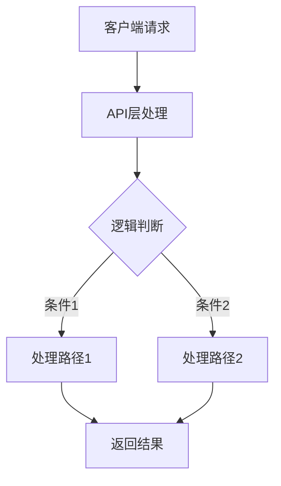

# 【PR全流程文档】Feature - [工作主题]

> **文档说明**：本文档包含「前置规划」和「后置总结」两部分，记录从需求对齐到开发完成的全流程，一个PR对应一份全流程文档，归档后作为项目追溯依据。

---

## 第一部分：前置部分（开工前必完成，架构师评审通过）

### 1. 基础信息（与分支/PR绑定）

| 项目 | 内容 |
|------|------|
| 工作类型 | 新功能开发（Feature） |
| PR编号 | PR-XXX（创建GitHub PR后补充完整） |
| 分支名称 | feature/XXX-功能描述（如：feature/KV-123-batch-put） |
| 工作主题 | [简要描述本次开发的核心内容] |
| 负责人 | [姓名/账号] |
| 分支创建日期 | YYYY-MM-DD |
| 计划开工日期 | YYYY-MM-DD |
| 计划CI通过日期 | YYYY-MM-DD |
| 关联需求单号 | [Jira/需求单编号]（附链接） |
| 架构师评审状态 | □ 待评审 □ 评审中 □ 评审通过 □ 需优化（循环记录） |
| 预审批结果 | □ 未通过 □ 已通过（架构师签字/备注：XXX 202X-XX-XX 同意开工） |

### 2. 背景与目标（为什么干）

#### 2.1 背景
- **业务场景**：[描述业务方需要解决什么问题]
- **现有问题**：[描述当前系统的痛点或不足]
- **价值**：[描述实现后的价值和收益]

#### 2.2 核心目标（可量化、可验证）
1. **功能目标**：[描述具体要实现的功能]
2. **性能目标**：[描述性能指标，如QPS、延迟等]
3. **可用性目标**：[描述可用性、容错性要求]

#### 2.3 明确边界（不做什么，避免范围蔓延）
- **本次不支持**：[明确列出本次不做但可能相关的功能]
- **本次不优化**：[明确列出暂不优化的部分]

### 3. 实现方案（怎么干，核心设计）

#### 3.1 整体流程设计

#### 3.2 关键设计点
1. **接口定义**：
   - 接口路径：`/api/v1/xxx`
   - 请求方式：POST/GET/PUT/DELETE
   - 请求体：`{"key": "value"}`
   - 响应体：`{"result": "success"}`

2. **核心机制**：[描述核心算法或机制]
3. **数据结构**：[描述关键数据结构]
4. **容错设计**：[描述错误处理和容错机制]

### 4. 风险评估与应对措施

| 风险点 | 影响等级（高/中/低） | 应对措施 |
|--------|----------------------|----------|
| [风险1] | [高/中/低] | [具体措施] |
| [风险2] | [高/中/低] | [具体措施] |
| [风险3] | [高/中/低] | [具体措施] |

### 5. 架构师评审记录（循环优化，直至通过）

| 评审轮次 | 评审日期 | 评审人（架构师） | 核心评审意见 | 优化措施（含AI辅助修改） | 优化结果 |
|----------|----------|------------------|--------------|--------------------------|----------|
| 第1轮 | 202X-XX-XX | XXX | [具体意见] | [具体优化措施] | [完成/继续优化] |
| 第2轮 | 202X-XX-XX | XXX | [具体意见] | [具体优化措施] | [完成/继续优化] |

### 6. 预审批确认
> **架构师签字/备注**：XXX 202X-XX-XX 该Feature方案可行，风险可控，同意启动开发，需严格按照文档落地，确保CI通过后提交Post总结。

---

## 第二部分：流程节点记录（开发/CI过程追溯）

### 1. 开发过程记录

| 节点 | 完成日期 | 具体内容 | 交付物 |
|------|----------|----------|--------|
| 启动开发 | 202X-XX-XX | [描述开发内容] | [代码提交至分支] |
| 本地测试 | 202X-XX-XX | [描述测试内容] | [测试报告/覆盖率数据] |
| Post文档编写 | 202X-XX-XX | [编写后置总结文档] | [第三部分：后置部分] |
| 架构师Post批准 | 202X-XX-XX | [架构师评审Post文档] | [批准签字/备注] |
| 提交GitHub | 202X-XX-XX | [推送分支，创建PR] | [GitHub PR链接] |

### 2. CI流程记录（修复Bug直至通过）

| CI轮次 | 触发时间 | 结果 | 问题详情 | 修复措施 | 修复结果 |
|--------|----------|------|----------|----------|----------|
| 第1轮 | 202X-XX-XX | 失败/成功 | [问题描述] | [修复方案] | [已修复/重新触发] |
| 第2轮 | 202X-XX-XX | 失败/成功 | [问题描述] | [修复方案] | [已修复/通过] |

### 3. 合并记录

| 合并时间 | 合并方式 | 审批人 | 备注 |
|----------|----------|--------|------|
| 202X-XX-XX | Squash Merge / Merge Commit | [架构师] | [补充说明] |

---

## 第三部分：后置部分（CI通过后编写，总结/成果/ToDo）

### 1. 核心成果总结（开发了啥，结果怎样）

#### 1.1 功能成果
- **已完成**：[列出完成的功能点]
- **与Pre文档差异**：[说明实际实现与计划的差异]

#### 1.2 性能/数据成果
- **性能数据**：[列出实际测试数据]
- **测试成果**：[说明测试覆盖情况]

#### 1.3 代码/文档交付物

| 类型 | 具体内容 | 链接/路径 |
|------|----------|-----------|
| 代码变更 | [列出主要变更文件] | [GitHub PR链接] |
| 文档更新 | [列出更新的文档] | [文档路径] |

### 2. 未完成项与ToDo清单（有哪些没干，后续规划）

#### 2.1 本次PR未完成项
- **未支持**：[列出未实现但相关的功能]
- **遗留问题**：[列出已知问题]

#### 2.2 ToDo清单（优先级排序）

| 优先级 | 任务内容 | 预估工期 | 关联PR/需求 | 备注 |
|--------|----------|----------|-------------|------|
| 高/中/低 | [任务描述] | X个工作日 | PR-XXX | [补充说明] |

### 3. 下一步工作建议（建议干啥）
1. **优先推进**：[列出高优先级任务]
2. **监控要点**：[列出需要关注的生产指标]
3. **运维补充**：[需要补充的运维文档或操作]
4. **后续规划**：[后续功能迭代方向]
5. **反馈收集**：[需要收集的使用反馈]

---

## 文档归档信息

| 项目 | 内容 |
|------|------|
| 文档最终版本 | V1.0 |
| 归档日期 | 202X-XX-XX |
| 归档路径 | `docs/06_project_management/pr_documents/feature/YYYY-MM-DD_PR-XXX_工作主题_全流程.md` |
| 后续维护人 | [姓名/账号] |
