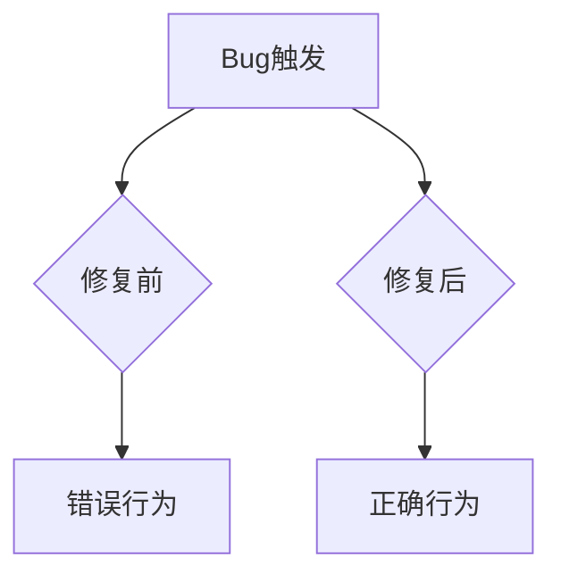

# 【PR全流程文档】Fix - [Bug描述]

> **文档说明**：本文档包含「前置规划」和「后置总结」两部分，记录从Bug发现到修复完成的全流程，一个PR对应一份全流程文档，归档后作为项目追溯依据。

---

## 第一部分：前置部分（开工前必完成，架构师评审通过）

### 1. 基础信息（与分支/PR绑定）

| 项目 | 内容 |
|------|------|
| 工作类型 | Bug修复（Fix） |
| PR编号 | PR-XXX（创建GitHub PR后补充完整） |
| 分支名称 | fix/XXX-bug描述（如：fix/KV-124-memory-leak） |
| 工作主题 | [简要描述要修复的Bug] |
| 负责人 | [姓名/账号] |
| 分支创建日期 | YYYY-MM-DD |
| 计划开工日期 | YYYY-MM-DD |
| 计划CI通过日期 | YYYY-MM-DD |
| 关联Bug单号 | [Jira/Bug单编号]（附链接） |
| 严重等级 | □ 致命 □ 严重 □ 一般 □ 较低 |
| 架构师评审状态 | □ 待评审 □ 评审中 □ 评审通过 □ 需优化 |
| 预审批结果 | □ 未通过 □ 已通过（架构师签字/备注：XXX 202X-XX-XX 同意修复） |

### 2. Bug描述（发生了什么）

#### 2.1 Bug现象
- **影响范围**：[描述Bug影响的模块/功能]
- **触发条件**：[描述如何触发此Bug]
- **实际表现**：[描述Bug的具体表现]
- **预期行为**：[描述正确的预期行为]

#### 2.2 影响评估
- **影响用户**：[描述影响的用户范围]
- **影响数据**：[是否造成数据丢失/损坏]
- **业务影响**：[对业务的影响程度]
- **紧急程度**：[是否需要紧急修复]

### 3. 根因分析（为什么发生）

#### 3.1 问题定位
- **问题代码位置**：`path/to/file.go:line_number`
- **问题函数**：`function_name()`
- **问题逻辑**：[描述错误的具体逻辑]

#### 3.2 根本原因
- **直接原因**：[描述直接导致Bug的原因]
- **深层原因**：[分析深层设计或实现问题]
- **相关代码**：[列出相关的代码片段]

```go
// 问题代码示例
func problematicFunction() {
    // 错误的逻辑
}
```

### 4. 修复方案（怎么修）

#### 4.1 修复策略
- **修复方式**：□ 直接修复 □ 重构 □ 其他
- **影响范围**：[描述修复影响的代码范围]
- **测试策略**：[描述如何验证修复]

#### 4.2 修复设计


#### 4.3 代码变更
- **修改文件**：[列出需要修改的文件]
- **新增代码**：[描述新增的代码逻辑]
- **删除代码**：[描述删除的代码逻辑]

### 5. 回滚方案（如何回退）

| 回滚触发条件 | 回滚步骤 | 验证方法 |
|-------------|----------|---------|
| [什么情况下需要回滚] | [具体回滚步骤] | [如何验证回滚成功] |

### 6. 风险评估与应对措施

| 风险点 | 影响等级（高/中/低） | 应对措施 |
|--------|----------------------|----------|
| [修复引入新问题] | [高/中/低] | [具体措施] |
| [影响其他功能] | [高/中/低] | [具体措施] |
| [性能影响] | [高/中/低] | [具体措施] |

### 7. 架构师评审记录

| 评审轮次 | 评审日期 | 评审人（架构师） | 核心评审意见 | 优化措施 | 优化结果 |
|----------|----------|------------------|--------------|----------|----------|
| 第1轮 | 202X-XX-XX | XXX | [具体意见] | [具体优化措施] | [完成/继续优化] |

### 8. 预审批确认
> **架构师签字/备注**：XXX 202X-XX-XX 该Fix方案可行，风险可控，同意启动修复，需确保修复彻底且不引入新问题。

---

## 第二部分：流程节点记录（修复/CI过程追溯）

### 1. 修复过程记录

| 节点 | 完成日期 | 具体内容 | 交付物 |
|------|----------|----------|--------|
| 启动修复 | 202X-XX-XX | [描述修复内容] | [代码提交] |
| 本地验证 | 202X-XX-XX | [描述验证方法] | [验证报告/覆盖率数据] |
| Post文档编写 | 202X-XX-XX | [编写后置总结文档] | [第三部分：后置部分] |
| 架构师Post批准 | 202X-XX-XX | [架构师评审Post文档] | [批准签字/备注] |
| 提交GitHub | 202X-XX-XX | [推送分支，创建PR] | [GitHub PR链接] |

### 2. CI流程记录

| CI轮次 | 触发时间 | 结果 | 问题详情 | 修复措施 | 修复结果 |
|--------|----------|------|----------|----------|----------|
| 第1轮 | 202X-XX-XX | 失败/成功 | [问题描述] | [修复方案] | [已修复/通过] |

### 3. 合并记录

| 合并时间 | 合并方式 | 审批人 | 备注 |
|----------|----------|--------|------|
| 202X-XX-XX | Squash Merge / Merge Commit | [架构师] | [补充说明] |

---

## 第三部分：后置部分（CI通过后编写，总结/验证）

### 1. 修复成果总结

#### 1.1 修复完成情况
- **已修复**：[列出修复的问题点]
- **修复方式**：[实际采用的修复方式]
- **与Pre文档差异**：[说明差异及原因]

#### 1.2 验证成果
- **单元测试**：[新增/修改的测试用例]
- **回归测试**：[执行的回归测试]
- **性能验证**：[性能影响评估]

#### 1.3 代码/文档交付物

| 类型 | 具体内容 | 链接/路径 |
|------|----------|-----------|
| 代码变更 | [列出变更文件] | [GitHub PR链接] |
| 测试用例 | [列出新增测试] | [测试文件路径] |

### 2. 遗留问题与预防措施

#### 2.1 遗留问题
- **未完全修复**：[描述未完全修复的部分]
- **已知限制**：[描述修复后的已知限制]

#### 2.2 预防措施（同类Bug预防）

| 措施类型 | 具体内容 | 负责人 | 完成时间 |
|---------|----------|--------|---------|
| 代码审查 | [加强审查点] | [负责人] | [时间] |
| 测试增强 | [新增测试] | [负责人] | [时间] |
| 文档更新 | [更新文档] | [负责人] | [时间] |
| 监控告警 | [新增监控] | [负责人] | [时间] |

### 3. 后续建议

1. **监控要点**：[需要持续监控的指标]
2. **后续优化**：[建议的后续优化方向]
3. **知识沉淀**：[需要补充到团队知识库的内容]
4. **相关Bug排查**：[建议排查的类似问题]

---

## 文档归档信息

| 项目 | 内容 |
|------|------|
| 文档最终版本 | V1.0 |
| 归档日期 | 202X-XX-XX |
| 归档路径 | `docs/06_project_management/pr_documents/fix/YYYY-MM-DD_PR-XXX_Bug描述_全流程.md` |
| 后续维护人 | [姓名/账号] |
