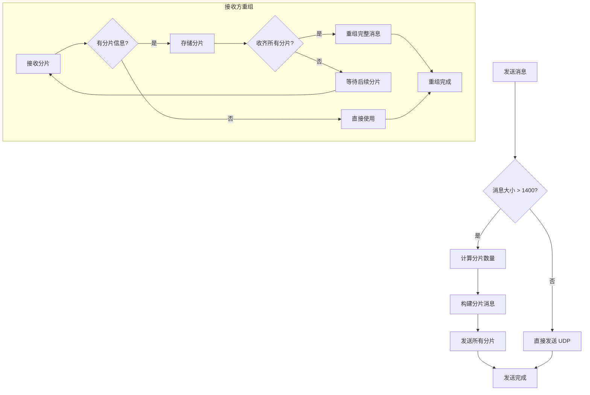

# TCP/UDP 统一 TLV 消息协议完整方案

> **文档类型**: 💡 技术建议 (Proposals)
> **创建日期**: 2026-01-20
> **状态**: ✅ 已实现（2026-01-23 更新）
> **优先级**: P1 (中优先级 - 核心协议设计)
> **替代**: 之前的 `transport_2026-01-20_tcp-udp-unified-frame-dual-transport.md`

**实现完成度**: 100%

| 功能 | 状态 | 代码位置 |
|------|------|---------|
| FixedHeader (31B) | ✅ 已实现 | `internal/metadata/transport/frame.go:67-140` |
| VarExtHeader (TLV) | ✅ 已实现 | `internal/metadata/transport/frame.go:230-378` |
| TLV 扩展字段 | ✅ 已实现 | `frame.go:380-468` (支持 Hop/Compress/Encrypt) |
| CRC32 校验 | ✅ 已实现 | `frame.go:470-493` |
| 序列化/反序列化 | ✅ 已实现 | `frame.go:495-630` |
| 单元测试 | ✅ 已实现 | `frame_test.go` |
| TCP 粘包处理 | ✅ 已实现 | `tcp_transport.go` (长度前缀) |
| UDP 无粘包处理 | ✅ 已实现 | `udp_transport.go` (直接帧) |

---

## 📋 实施状态总结

### ✅ 已完成：TLV 协议完整实现
**位置**: `internal/metadata/transport/frame.go`

**已实现功能**:
1. **FixedHeader (31 字节)** - 魔术字 + 节点ID + 消息ID + 编码器
2. **VarExtHeader (变长)** - TLV 格式扩展字段
3. **TLV 扩展类型**:
   - HopExt (跳数 TTL)
   - CompressExt (压缩)
   - EncryptExt (加密)
4. **CRC32 校验** - 覆盖扩展头 + 业务数据
5. **MessagePack 序列化** - TLV Value 使用 MessagePack
6. **TCP 粘包处理** - 4 字节长度前缀
7. **UDP 直接帧** - 无粘包处理

**消息结构**:
```
+==================+==================+==================+==================+
│ FixedHeader      │ VarExtHeader     │ Data             │ CRC32            │
│ (31 bytes)       │ (0~65535 bytes)  │ (变长)           │ (4 bytes)        │
+==================+==================+==================+==================+
```

---

## 一、方案核心设计理念

### 1.1 分层设计

```
┌─────────────────────────────────────────────────────────────┐
│                     完整消息结构                             │
├─────────────────────────────────────────────────────────────┤
│ FixedHeader (16B) │ VarExtHeader (变长) │ Data │ CRC32 (4B)│
├─────────────────────────────────────────────────────────────┤
│  基础元信息   │  TLV扩展字段(按需)   │ 业务 │  完整性校验  │
└─────────────────────────────────────────────────────────────┘
```

### 1.2 核心设计原则

| 原则 | 说明 | 实现方式 |
|------|------|---------|
| **轻量** | 最小化协议开销 | 固定头仅16字节，扩展头按需携带 |
| **灵活** | 支持未来扩展 | TLV 格式，新增 Type 即可扩展 |
| **高效** | 紧凑的序列化 | MessagePack 序列化 TLV Value |
| **可靠** | 数据完整性保障 | CRC32 校验覆盖扩展头+业务数据 |
| **跨语言** | 多语言兼容 | 基于二进制协议+标准 msgpack 库 |

### 1.3 解决的核心问题

| 问题 | 传统方案 | TLV 方案 |
|------|---------|---------|
| **扩展能力弱** | 固定预留字段，浪费带宽 | TLV 按需扩展，零冗余 |
| **序列化复杂** | 手动字节拼接，易出错 | MessagePack 自动序列化 |
| **数据完整性** | 仅 Header CRC | CRC32 覆盖扩展头+业务数据 |
| **跨语言困难** | 自定义二进制格式 | 标准 msgpack 库支持 |

---

## 二、完整消息结构（字节级）

### 2.1 整体结构

```
+==================+==================+==================+==================+
│ FixedHeader      │ VarExtHeader     │ Data             │ CRC32            │
│ (16 bytes)       │ (0~65535 bytes)  │ (变长)           │ (4 bytes)        │
+==================+==================+==================+==================+
│ 魔术字 + 节点ID   │ ExtTotalLen +    │ KV操作指令      │ CRC32-IEEE      │
│ 消息ID + 编码器   │ TLV 字段列表      │ Key/Value等     │                  │
+==================+==================+==================+==================+
```

### 2.2 各部分详解

#### （1）固定头 FixedHeader（16字节）

| 字段名 | 大小 | 类型 | 说明 |
|--------|------|------|------|
| **Magic** | 4字节 | []byte | 魔术字 `0x4E 0x58 0x55 0x54`（"NXUT"）|
| **NodeID** | 8字节 | uint64 | 发送节点 ID，全局唯一 |
| **MsgID** | 2字节 | uint16 | 消息 ID，节点内唯一，用于去重 |
| **CodecID** | 2字节 | uint16 | 业务数据编码器：0=JSON, 1=MessagePack, 2=Protobuf |

**字节序**：所有数值字段采用 **Big-Endian（网络字节序）**

#### （2）变长扩展头 VarExtHeader（变长）

```
+==================+==================+
│ ExtTotalLen      │ TLV Fields[]     │
│ (2 bytes)        │ (变长)           │
+==================+==================+
```

**ExtTotalLen**：TLV 字段列表总字节数，0 表示无扩展

**单个 TLV 字段结构**：

```
+==================+==================+==================+
│ Type             │ Length           │ Value            │
│ (2 bytes)        │ (2 bytes)        │ (变长)           │
+==================+==================+==================+
```

| 字段 | 大小 | 说明 |
|------|------|------|
| **Type** | 2字节 | 扩展字段类型（预定义枚举）|
| **Length** | 2字节 | Value 部分的字节长度 |
| **Value** | 变长 | MessagePack 序列化后的字节流 |

**预定义 Type 枚举**：

| Type 值 | 字段含义 | Go 结构体 | 适用场景 |
|---------|---------|----------|---------|
| **1** | 压缩配置 | `CompressExt{CompressID uint16}` | 大 Value 传输时压缩 |
| **2** | 加密配置 | `EncryptExt{EncryptID uint16, Nonce []byte}` | 敏感数据加密传输 |
| **3** | 分片配置 | `SegmentExt{Index uint16, Total uint16}` | 超大 Value 分片传输 |
| **4** | 优先级配置 | `PriorityExt{Level uint8, Desc string}` | 消息优先级调度 |
| **5+** | 自定义扩展 | 任意结构化数据 | 如超时、业务标识等 |

#### （3）业务数据 Data（变长）

分布式 KV 存储的实际业务内容：
- `Put` 指令：`Key + Value + TTL`
- `Get` 指令：`Key`
- `Delete` 指令：`Key`
- `Response`：`Status + Result`

格式由 `FixedHeader.CodecID` 指定（JSON/MessagePack/Protobuf）

#### （4）CRC32 校验（4字节）

- **算法**：CRC32-IEEE 标准
- **校验范围**：`VarExtHeader + Data` 完整字节流
- **作用**：防止数据篡改、验证消息完整性

---

## 三、MessagePack 序列化优势

### 3.1 为什么选择 MessagePack？

| 特性 | MessagePack | JSON | Protobuf |
|------|------------|------|----------|
| **序列化速度** | 快 | 慢 | 最快 |
| **数据大小** | 小 | 大 | 最小 |
| **可读性** | 二进制 | 可读 | 二进制 |
| **动态类型** | ✅ 支持 | ✅ 支持 | ❌ 需预定义 |
| **跨语言** | ✅ 广泛 | ✅ 标准 | ✅ 广泛 |
| **复杂结构** | ✅ 原生支持 | ✅ 原生支持 | ⚠️ 需 .proto |

### 3.2 安装依赖

```bash
go get github.com/vmihailenco/msgpack/v5
```

---

## 四、核心数据结构定义

```go
package transport

import (
    "encoding/binary"
    "fmt"
    "github.com/vmihailenco/msgpack/v5"
    "hash/crc32"
)

// ========== 常量定义 ==========
const (
    MagicNXUT        = "\x4E\x58\x55\x54" // 魔术字 NXUT
    FixedHeaderLen   = 16                 // 固定头长度：16字节
    CRCLen           = 4                  // CRC32长度：4字节
    ExtTotalLenLen   = 2                  // ExtTotalLen字段长度：2字节
)

// ========== 扩展字段Type枚举 ==========
type ExtFieldType uint16

const (
    ExtFieldCompress ExtFieldType = 1 // 压缩配置
    ExtFieldEncrypt  ExtFieldType = 2 // 加密配置
    ExtFieldSegment  ExtFieldType = 3 // 分片配置
    ExtFieldPriority ExtFieldType = 4 // 优先级配置
)

// ========== 编码器类型枚举 ==========
type CodecType uint16

const (
    CodecJSON     CodecType = 0 // JSON编码
    CodecMsgPack  CodecType = 1 // MessagePack编码
    CodecProtobuf CodecType = 2 // Protobuf编码
)

// ========== 固定头结构 ==========
type FixedHeader struct {
    Magic   [4]byte // 魔术字 NXUT
    NodeID  uint64  // 发送节点ID
    MsgID   uint16  // 消息ID
    CodecID uint16  // 业务数据编码器ID
}

// ========== TLV扩展字段结构化数据 ==========

// CompressExt 压缩配置扩展字段
type CompressExt struct {
    CompressID uint16 `msgpack:"cid"` // 0=无压缩,1=Gzip,2=Snappy,3=Zstd
}

// EncryptExt 加密配置扩展字段
type EncryptExt struct {
    EncryptID uint16 `msgpack:"eid"` // 0=无加密,1=AES-128,2=RSA
    Nonce     []byte `msgpack:"non"` // 加密随机数（变长）
    Version   string `msgpack:"ver"` // 加密版本
}

// SegmentExt 分片配置扩展字段
type SegmentExt struct {
    Index uint16 `msgpack:"idx"` // 分片索引（从0开始）
    Total uint16 `msgpack:"tot"` // 总分片数
}

// PriorityExt 优先级配置扩展字段
type PriorityExt struct {
    Level uint8  `msgpack:"lvl"` // 0=低,1=中,2=高,3=紧急
    Desc  string `msgpack:"desc"`// 优先级描述
}

// ========== TLV字段结构 ==========
type ExtField struct {
    Type  ExtFieldType // 字段类型
    Value []byte       // MessagePack序列化后的字节流
}

// ========== 变长扩展头结构 ==========
type VarExtHeader struct {
    ExtTotalLen uint16      // TLV字段列表总长度
    Fields      []*ExtField // TLV字段列表
}

// ========== 完整消息结构 ==========
type Message struct {
    FixedHeader  *FixedHeader  // 固定头（16字节）
    VarExtHeader *VarExtHeader // 变长扩展头（0~65535字节）
    Data         []byte        // 业务数据（变长）
    CRC32        uint32        // CRC32校验（4字节）
}
```

---

## 五、核心工具函数实现

### 5.1 固定头编解码

```go
// Serialize 序列化固定头为16字节字节流（Big-Endian）
func (fh *FixedHeader) Serialize() ([]byte, error) {
    buf := make([]byte, FixedHeaderLen)

    // 写入魔术字
    copy(buf[0:4], fh.Magic[:])
    if string(fh.Magic[:]) != MagicNXUT {
        return nil, fmt.Errorf("invalid magic number: expected NXUT, got %s", string(fh.Magic[:]))
    }

    // 写入NodeID
    binary.BigEndian.PutUint64(buf[4:12], fh.NodeID)

    // 写入MsgID
    binary.BigEndian.PutUint16(buf[12:14], fh.MsgID)

    // 写入CodecID
    binary.BigEndian.PutUint16(buf[14:16], fh.CodecID)

    return buf, nil
}

// Deserialize 从字节流反序列化固定头
func (fh *FixedHeader) Deserialize(data []byte) error {
    if len(data) < FixedHeaderLen {
        return fmt.Errorf("invalid fixed header length: expected %d, got %d", FixedHeaderLen, len(data))
    }

    // 读取魔术字并校验
    copy(fh.Magic[:], data[0:4])
    if string(fh.Magic[:]) != MagicNXUT {
        return fmt.Errorf("invalid magic: expected NXUT, got %s", string(fh.Magic[:]))
    }

    // 读取其他字段
    fh.NodeID = binary.BigEndian.Uint64(data[4:12])
    fh.MsgID = binary.BigEndian.Uint16(data[12:14])
    fh.CodecID = binary.BigEndian.Uint16(data[14:16])

    return nil
}
```

### 5.2 TLV字段编解码（基于MessagePack）

```go
// EncodeExtField 将结构化扩展字段序列化为TLV字段
func EncodeExtField(fieldType ExtFieldType, data any) (*ExtField, error) {
    // 用msgpack序列化结构化数据为Value字节流
    value, err := msgpack.Marshal(data)
    if err != nil {
        return nil, fmt.Errorf("msgpack marshal failed: %w", err)
    }

    return &ExtField{
        Type:  fieldType,
        Value: value,
    }, nil
}

// DecodeExtField 将TLV字段反序列化为指定结构化数据
func DecodeExtField(field *ExtField, data any) error {
    return msgpack.Unmarshal(field.Value, data)
}

// serializeTLVField 序列化单个TLV字段为字节流
func serializeTLVField(field *ExtField) []byte {
    buf := make([]byte, 4+len(field.Value))

    // 写入Type
    binary.BigEndian.PutUint16(buf[0:2], uint16(field.Type))

    // 写入Length
    binary.BigEndian.PutUint16(buf[2:4], uint16(len(field.Value)))

    // 写入Value
    copy(buf[4:], field.Value)

    return buf
}

// deserializeTLVField 从字节流反序列化单个TLV字段
func deserializeTLVField(data []byte) (*ExtField, error) {
    if len(data) < 4 {
        return nil, fmt.Errorf("invalid TLV field length: %d < 4", len(data))
    }

    fieldType := ExtFieldType(binary.BigEndian.Uint16(data[0:2]))
    fieldLen := binary.BigEndian.Uint16(data[2:4])

    if len(data) < 4+int(fieldLen) {
        return nil, fmt.Errorf("TLV value length mismatch: expected %d, got %d", fieldLen, len(data)-4)
    }

    value := make([]byte, fieldLen)
    copy(value, data[4:4+fieldLen])

    return &ExtField{
        Type:  fieldType,
        Value: value,
    }, nil
}
```

### 5.3 变长扩展头编解码

```go
// Serialize 序列化变长扩展头为字节流
func (veh *VarExtHeader) Serialize() ([]byte, error) {
    var fieldsBuf []byte
    for _, field := range veh.Fields {
        fieldsBuf = append(fieldsBuf, serializeTLVField(field)...)
    }

    // 自动修正ExtTotalLen
    veh.ExtTotalLen = uint16(len(fieldsBuf))

    // 拼接ExtTotalLen + TLV字段列表
    buf := make([]byte, ExtTotalLenLen+len(fieldsBuf))
    binary.BigEndian.PutUint16(buf[0:2], veh.ExtTotalLen)
    copy(buf[2:], fieldsBuf)

    return buf, nil
}

// Deserialize 从字节流反序列化变长扩展头
func (veh *VarExtHeader) Deserialize(data []byte) error {
    if len(data) < ExtTotalLenLen {
        return fmt.Errorf("var ext header too short: %d < %d", len(data), ExtTotalLenLen)
    }

    // 读取ExtTotalLen
    veh.ExtTotalLen = binary.BigEndian.Uint16(data[0:2])
    fieldsBufLen := int(veh.ExtTotalLen)

    if len(data) != ExtTotalLenLen+fieldsBufLen {
        return fmt.Errorf("var ext header length mismatch: expected %d, got %d",
            ExtTotalLenLen+fieldsBufLen, len(data))
    }

    // 解析TLV字段列表
    veh.Fields = make([]*ExtField, 0)
    offset := ExtTotalLenLen

    for offset < len(data) {
        field, err := deserializeTLVField(data[offset:])
        if err != nil {
            return err
        }
        veh.Fields = append(veh.Fields, field)
        offset += 4 + len(field.Value)
    }

    return nil
}
```

### 5.4 完整消息编解码+CRC校验

```go
// CalculateCRC 计算CRC32校验和（覆盖VarExtHeader + Data）
func (m *Message) CalculateCRC() error {
    extBuf, err := m.VarExtHeader.Serialize()
    if err != nil {
        return fmt.Errorf("serialize var ext header failed: %w", err)
    }

    dataToCheck := append(extBuf, m.Data...)
    table := crc32.MakeTable(crc32.IEEE)
    m.CRC32 = crc32.Checksum(dataToCheck, table)

    return nil
}

// VerifyCRC 验证CRC32校验和
func (m *Message) VerifyCRC() (bool, error) {
    extBuf, err := m.VarExtHeader.Serialize()
    if err != nil {
        return false, fmt.Errorf("serialize var ext header failed: %w", err)
    }

    dataToCheck := append(extBuf, m.Data...)
    table := crc32.MakeTable(crc32.IEEE)
    calculatedCRC := crc32.Checksum(dataToCheck, table)

    return calculatedCRC == m.CRC32, nil
}

// Serialize 序列化完整消息为字节流
func (m *Message) Serialize() ([]byte, error) {
    // 1. 序列化固定头
    fixedBuf, err := m.FixedHeader.Serialize()
    if err != nil {
        return nil, fmt.Errorf("serialize fixed header failed: %w", err)
    }

    // 2. 序列化变长扩展头
    extBuf, err := m.VarExtHeader.Serialize()
    if err != nil {
        return nil, fmt.Errorf("serialize var ext header failed: %w", err)
    }

    // 3. 计算CRC32
    if err := m.CalculateCRC(); err != nil {
        return nil, fmt.Errorf("calculate CRC failed: %w", err)
    }

    // 4. 拼接所有部分：固定头 + 扩展头 + 业务数据 + CRC
    crcBuf := make([]byte, CRCLen)
    binary.BigEndian.PutUint32(crcBuf, m.CRC32)

    totalBuf := append(fixedBuf, extBuf...)
    totalBuf = append(totalBuf, m.Data...)
    totalBuf = append(totalBuf, crcBuf...)

    return totalBuf, nil
}

// Deserialize 从字节流反序列化完整消息
func (m *Message) Deserialize(data []byte) error {
    // 校验最小长度：固定头(16) + 扩展头最小(2) + 数据最小(0) + CRC(4) = 22
    minLen := FixedHeaderLen + ExtTotalLenLen + CRCLen
    if len(data) < minLen {
        return fmt.Errorf("message too short: %d < %d", len(data), minLen)
    }

    // 1. 解析固定头
    m.FixedHeader = &FixedHeader{}
    if err := m.FixedHeader.Deserialize(data[0:FixedHeaderLen]); err != nil {
        return fmt.Errorf("deserialize fixed header failed: %w", err)
    }

    // 2. 解析CRC32
    crcStart := len(data) - CRCLen
    m.CRC32 = binary.BigEndian.Uint32(data[crcStart:])

    // 3. 解析变长扩展头
    extTotalLen := binary.BigEndian.Uint16(data[FixedHeaderLen : FixedHeaderLen+ExtTotalLenLen])
    extHeaderLen := ExtTotalLenLen + int(extTotalLen)
    extEnd := FixedHeaderLen + extHeaderLen

    if extEnd > len(data)-CRCLen {
        return fmt.Errorf("var ext header out of range: extEnd %d > data len %d",
            extEnd, len(data)-CRCLen)
    }

    m.VarExtHeader = &VarExtHeader{}
    if err := m.VarExtHeader.Deserialize(data[FixedHeaderLen:extEnd]); err != nil {
        return fmt.Errorf("deserialize var ext header failed: %w", err)
    }

    // 4. 解析业务数据
    dataStart := extEnd
    dataEnd := len(data) - CRCLen
    m.Data = make([]byte, dataEnd-dataStart)
    copy(m.Data, data[dataStart:dataEnd])

    // 5. 验证CRC32
    if ok, err := m.VerifyCRC(); err != nil {
        return fmt.Errorf("verify CRC failed: %w", err)
    } else if !ok {
        return fmt.Errorf("CRC mismatch: expected %d", m.CRC32)
    }

    return nil
}
```

---

## 六、完整使用示例

### 6.1 发送方：构建并序列化消息

```go
package main

import (
    "fmt"
    "github.com/jzhang405/NexKV/internal/metadata/transport"
    "github.com/vmihailenco/msgpack/v5"
)

func main() {
    // 1. 构建固定头
    fixedHeader := &transport.FixedHeader{
        Magic:   [4]byte(transport.MagicNXUT),
        NodeID:  1001,                          // 发送节点ID
        MsgID:   12345,                         // 消息ID
        CodecID: uint16(transport.CodecMsgPack), // 业务数据用MsgPack编码
    }

    // 2. 构建扩展字段（分片+压缩）
    // 2.1 分片扩展字段
    segData := &transport.SegmentExt{Index: 0, Total: 3}
    segField, _ := transport.EncodeExtField(transport.ExtFieldSegment, segData)

    // 2.2 压缩扩展字段
    compressData := &transport.CompressExt{CompressID: 2} // Snappy压缩
    compressField, _ := transport.EncodeExtField(transport.ExtFieldCompress, compressData)

    // 3. 构建变长扩展头
    varExtHeader := &transport.VarExtHeader{
        Fields: []*transport.ExtField{segField, compressField},
    }

    // 4. 构建业务数据（KV存储Put指令）
    kvData := map[string]any{
        "op":    "Put",
        "key":   "user:100",
        "value": []byte("hello kv store"),
        "ttl":   3600,
    }
    data, _ := msgpack.Marshal(kvData)

    // 5. 构建完整消息
    msg := &transport.Message{
        FixedHeader:  fixedHeader,
        VarExtHeader: varExtHeader,
        Data:         data,
    }

    // 6. 序列化消息为字节流（准备发送）
    msgBuf, err := msg.Serialize()
    if err != nil {
        fmt.Printf("serialize message failed: %v\n", err)
        return
    }
    fmt.Printf("✅ 序列化成功！消息长度: %d bytes\n", len(msgBuf))

    // 7. 发送消息（通过网络发送msgBuf，如TCP/UDP）
    // conn.Write(msgBuf)
}
```

### 6.2 接收方：反序列化并解析消息

```go
package main

import (
    "fmt"
    "github.com/jzhang405/NexKV/internal/metadata/transport"
    "github.com/vmihailenco/msgpack/v5"
)

func receive(msgBuf []byte) {
    // 1. 反序列化消息
    newMsg := &transport.Message{}
    if err := newMsg.Deserialize(msgBuf); err != nil {
        fmt.Printf("❌ 反序列化失败: %v\n", err)
        return
    }
    fmt.Println("✅ 消息反序列化成功！")

    // 2. 解析扩展字段
    fmt.Println("\n📋 扩展字段:")
    for _, field := range newMsg.VarExtHeader.Fields {
        switch field.Type {
        case transport.ExtFieldSegment:
            seg := &transport.SegmentExt{}
            transport.DecodeExtField(field, seg)
            fmt.Printf("  • 分片信息：Index=%d, Total=%d\n", seg.Index, seg.Total)

        case transport.ExtFieldCompress:
            compress := &transport.CompressExt{}
            transport.DecodeExtField(field, compress)
            fmt.Printf("  • 压缩信息：CompressID=%d (Snappy)\n", compress.CompressID)

        case transport.ExtFieldEncrypt:
            encrypt := &transport.EncryptExt{}
            transport.DecodeExtField(field, encrypt)
            fmt.Printf("  • 加密信息：EncryptID=%d, Nonce=%x, Version=%s\n",
                encrypt.EncryptID, encrypt.Nonce, encrypt.Version)

        case transport.ExtFieldPriority:
            priority := &transport.PriorityExt{}
            transport.DecodeExtField(field, priority)
            fmt.Printf("  • 优先级信息：Level=%d, Desc=%s\n",
                priority.Level, priority.Desc)
        }
    }

    // 3. 解析业务数据
    fmt.Println("\n📦 业务数据:")
    kvData := make(map[string]any)
    msgpack.Unmarshal(newMsg.Data, &kvData)
    for k, v := range kvData {
        fmt.Printf("  • %s: %v\n", k, v)
    }

    // 4. 元数据信息
    fmt.Println("\n🔍 消息元数据:")
    fmt.Printf("  • NodeID: %d\n", newMsg.FixedHeader.NodeID)
    fmt.Printf("  • MsgID: %d\n", newMsg.FixedHeader.MsgID)
    fmt.Printf("  • CodecID: %d (MessagePack)\n", newMsg.FixedHeader.CodecID)
    fmt.Printf("  • CRC32: 0x%08X ✅\n", newMsg.CRC32)
}
```

---

## 七、UDP 自动分片机制

### 7.1 分片触发条件

**核心原则**：当 UDP 消息大小 > **1400 字节**时，自动启用应用层分片。

**为什么是 1400 字节？**

```
以太网 MTU: 1500 字节
  ↓ 减去 IP 头 (20 字节)
  ↓ 减去 UDP 头 (8 字节)
= UDP 有效载荷: 1472 字节
  ↓ 安全边界（避免路由器 MTU 差异）
= 预留 72 字节
= 实际阈值: **1400 字节**
```

**分片 vs 不分片对比**：

| 消息大小 | 是否分片 | 原因 |
|---------|---------|------|
| ≤ 1400 字节 | ❌ 不分片 | 单个 UDP 包，性能最优 |
| > 1400 字节 | ✅ 分片 | 避免 IP 层分片，应用层可靠分片 |

### 7.2 分片实现逻辑

```go
// transport/udp_segmenter.go
package transport

import (
    "math"
)

const (
    // UDPSafePayloadSize UDP 安全负载大小（1400 字节）
    // = 以太网 MTU (1500) - IP头 (20) - UDP头 (8) - 安全边界 (72)
    UDPSafePayloadSize = 1400
)

// Segmenter UDP 分片器
type Segmenter struct {
    maxSegmentSize int // 单个分片最大大小（1400 字节）
}

// NewSegmenter 创建分片器
func NewSegmenter() *Segmenter {
    return &Segmenter{
        maxSegmentSize: UDPSafePayloadSize,
    }
}

// NeedSegment 判断是否需要分片
func (s *Segmenter) NeedSegment(dataSize int) bool {
    return dataSize > s.maxSegmentSize
}

// Segment 将数据分片为多个消息
func (s *Segmenter) Segment(
    ctx context.Context,
    msg Message,
    addr string,
) ([]*Message, error) {
    data := msg.GetPayload()
    dataSize := len(data)

    // 1. 检查是否需要分片
    if !s.NeedSegment(dataSize) {
        // 不需要分片，返回原始消息
        return []*Message{msg}, nil
    }

    // 2. 计算分片数量
    // 每个分片 = FixedHeader(16) + VarExtHeader(变长) + Data + CRC32(4)
    // 简化计算：可用空间 = 1400 - FixedHeader(16) - CRC32(4) = 1380
    availableDataSize := s.maxSegmentSize - FixedHeaderLen - CRCLen - 10 // 预留10字节给扩展头
    totalSegments := int(math.Ceil(float64(dataSize) / float64(availableDataSize)))

    log.Debug("消息过大(%d bytes)，启用分片：共 %d 个分片", dataSize, totalSegments)

    // 3. 构建分片消息
    segments := make([]*Message, totalSegments)
    nodeID := uint64(12345) // 从配置获取
    msgID := uint16(0)      // 从配置或计数器获取

    for i := 0; i < totalSegments; i++ {
        // 计算当前分片的数据范围
        start := i * availableDataSize
        end := start + availableDataSize
        if end > dataSize {
            end = dataSize
        }
        segmentData := data[start:end]

        // 构建分片扩展字段
        segExt := &SegmentExt{
            Index: uint16(i),           // 当前分片索引（从0开始）
            Total: uint16(totalSegments),// 总分片数
        }
        segField, _ := EncodeExtField(ExtFieldSegment, segExt)

        // 构建变长扩展头（包含分片信息）
        varExtHeader := &VarExtHeader{
            Fields: []*ExtField{segField},
        }

        // 构建分片消息
        segments[i] = &Message{
            FixedHeader: &FixedHeader{
                Magic:   [4]byte(MagicNXUT),
                NodeID:  nodeID,
                MsgID:   msgID, // 所有分片使用相同的 MsgID
                CodecID: uint16(CodecMsgPack),
            },
            VarExtHeader: varExtHeader,
            Data:         segmentData,
        }
    }

    return segments, nil
}
```

### 7.3 分片重组逻辑

```go
// transport/udp_reassembler.go
package transport

import (
    "sync"
    "time"
)

const (
    // ReassemblerTimeout 重组超时时间（30秒）
    ReassemblerTimeout = 30 * time.Second
    // ReassemblerMaxPending 最大待重组消息数
    ReassemblerMaxPending = 1000
)

// Reassembler UDP 分片重组器
type Reassembler struct {
    mu              sync.RWMutex
    pendingMessages map[string]*partialMessage // key: nodeID_msgID
    timeout         time.Duration
}

// partialMessage 部分消息（分片重组中）
type partialMessage struct {
    nodeID     uint64
    msgID      uint16
    total      uint16              // 总分片数
    received   uint16              // 已接收分片数
    fragments  map[uint16][]byte   // 分片索引 → 分片数据
    firstTime  time.Time           // 首个分片到达时间
}

// NewReassembler 创建重组器
func NewReassembler() *Reassembler {
    return &Reassembler{
        pendingMessages: make(map[string]*partialMessage),
        timeout:         ReassemblerTimeout,
    }
}

// AddFragment 添加分片
func (r *Reassembler) AddFragment(msg *Message) ([]byte, error) {
    r.mu.Lock()
    defer r.mu.Unlock()

    // 1. 提取分片信息
    var segExt *SegmentExt
    for _, field := range msg.VarExtHeader.Fields {
        if field.Type == ExtFieldSegment {
            segExt = &SegmentExt{}
            DecodeExtField(field, segExt)
            break
        }
    }

    // 2. 如果没有分片信息，直接返回数据
    if segExt == nil || segExt.Total == 1 {
        return msg.Data, nil
    }

    // 3. 构建消息唯一标识
    key := r.buildKey(msg.FixedHeader.NodeID, msg.FixedHeader.MsgID)

    // 4. 获取或创建 partialMessage
    partial, exists := r.pendingMessages[key]
    if !exists {
        // 检查待重组消息数量
        if len(r.pendingMessages) >= ReassemblerMaxPending {
            return nil, fmt.Errorf("too many pending messages")
        }

        partial = &partialMessage{
            nodeID:    msg.FixedHeader.NodeID,
            msgID:     msg.FixedHeader.MsgID,
            total:     segExt.Total,
            received:  0,
            fragments: make(map[uint16][]byte),
            firstTime: time.Now(),
        }
        r.pendingMessages[key] = partial
    }

    // 5. 验证分片一致性
    if partial.total != segExt.Total {
        return nil, fmt.Errorf("segment total mismatch: expected %d, got %d",
            partial.total, segExt.Total)
    }

    // 6. 存储分片数据
    partial.fragments[segExt.Index] = msg.Data
    partial.received++

    // 7. 检查是否收齐所有分片
    if int(partial.received) == int(partial.total) {
        // 重组完整消息
        reassembled := r.reassemble(partial)

        // 清理
        delete(r.pendingMessages, key)

        return reassembled, nil
    }

    // 未收齐，返回 nil
    return nil, nil
}

// reassemble 重组分片
func (r *Reassembler) reassemble(partial *partialMessage) []byte {
    var reassembled []byte

    // 按顺序拼接分片
    for i := uint16(0); i < partial.total; i++ {
        fragment, ok := partial.fragments[i]
        if !ok {
            log.Error("missing fragment %d during reassembly", i)
            return nil
        }
        reassembled = append(reassembled, fragment...)
    }

    log.Debug("重组完成：nodeID=%d, msgID=%d, total=%d, size=%d",
        partial.nodeID, partial.msgID, partial.total, len(reassembled))

    return reassembled
}

// buildKey 构建消息唯一标识
func (r *Reassembler) buildKey(nodeID uint64, msgID uint16) string {
    return fmt.Sprintf("%d_%d", nodeID, msgID)
}

// CleanupTimeout 清理超时的待重组消息
func (r *Reassembler) CleanupTimeout() {
    r.mu.Lock()
    defer r.mu.Unlock()

    now := time.Now()
    for key, partial := range r.pendingMessages {
        if now.Sub(partial.firstTime) > r.timeout {
            log.Warn("重组超时，丢弃消息：key=%s", key)
            delete(r.pendingMessages, key)
        }
    }
}
```

### 7.4 UDP Transport 集成分片

```go
// transport/udp_transport.go
package transport

import (
    "context"
    "log"
)

// UDPTransport UDP 传输器（支持分片）
type UDPTransport struct {
    conn       *net.UDPConn
    segmenter  *Segmenter   // 分片器
    reassembler *Reassembler // 重组器
}

// NewUDPTransport 创建 UDP 传输器
func NewUDPTransport(addr string) (*UDPTransport, error) {
    conn, err := net.ListenPacket("udp", addr)
    if err != nil {
        return nil, err
    }

    return &UDPTransport{
        conn:        conn.(*net.UDPConn),
        segmenter:   NewSegmenter(),
        reassembler: NewReassembler(),
    }, nil
}

// Send 发送消息（自动分片）
func (t *UDPTransport) Send(ctx context.Context, addr string, msg Message, opts ...SendOption) error {
    data := msg.GetPayload()
    dataSize := len(data)

    // 1. 检查是否需要分片
    if t.segmenter.NeedSegment(dataSize) {
        log.Debug("启用 UDP 分片：size=%d", dataSize)

        // 分片
        segments, err := t.segmenter.Segment(ctx, msg, addr)
        if err != nil {
            return fmt.Errorf("segment failed: %w", err)
        }

        // 发送所有分片
        udpAddr, err := net.ResolveUDPAddr("udp", addr)
        if err != nil {
            return fmt.Errorf("resolve addr failed: %w", err)
        }

        for i, seg := range segments {
            segBuf, err := seg.Serialize()
            if err != nil {
                return fmt.Errorf("serialize segment %d failed: %w", i, err)
            }

            if _, err := t.conn.WriteTo(segBuf, udpAddr); err != nil {
                return fmt.Errorf("send segment %d failed: %w", i, err)
            }

            log.Debug("发送分片 %d/%d，大小=%d bytes", i+1, len(segments), len(segBuf))
        }

        return nil
    }

    // 2. 不需要分片，直接发送
    msgBuf, err := msg.Serialize()
    if err != nil {
        return fmt.Errorf("serialize message failed: %w", err)
    }

    udpAddr, err := net.ResolveUDPAddr("udp", addr)
    if err != nil {
        return fmt.Errorf("resolve addr failed: %w", err)
    }

    if _, err := t.conn.WriteTo(msgBuf, udpAddr); err != nil {
        return fmt.Errorf("send message failed: %w", err)
    }

    return nil
}

// Receive 接收消息（自动重组）
func (t *UDPTransport) Receive(ctx context.Context) <-chan Message {
    ch := make(chan Message, 4096)

    go func() {
        defer close(ch)

        buf := make([]byte, 64*1024) // 64KB 接收缓冲

        for {
            select {
            case <-ctx.Done():
                return

            default:
                n, addr, err := t.conn.ReadFrom(buf)
                if err != nil {
                    log.Error("receive failed: %v", err)
                    continue
                }

                // 反序列化消息
                msg := &Message{}
                if err := msg.Deserialize(buf[:n]); err != nil {
                    log.Error("deserialize message failed: %v", err)
                    continue
                }

                // 重组分片
                data, err := t.reassembler.AddFragment(msg)
                if err != nil {
                    log.Error("reassemble failed: %v", err)
                    continue
                }

                if data != nil {
                    // 重组完成，投递到通道
                    msg.Data = data
                    ch <- *msg
                }
                // data == nil 表示分片未收齐，等待后续分片
            }
        }
    }()

    return ch
}
```

### 7.5 分片流程图



---

## 八、TCP/UDP DualTransport 集成

### 8.1 Message Protocol 接口

```go
// transport/message.go
package transport

// ProtocolType 协议类型
type ProtocolType int

const (
    ProtocolAuto ProtocolType = iota // 自动选择（根据消息大小）
    ProtocolUDP                      // 强制 UDP
    ProtocolTCP                      // 强制 TCP
)

// Message 消息接口
type Message interface {
    // 现有方法
    GetType() MessageType
    GetPayload() []byte

    // 新增：获取协议类型
    Protocol() ProtocolType

    // 新增：获取优先级（用于 QoS）
    Priority() Priority
}

// KVMessage 实现 Message 接口
type KVMessage struct {
    op      string
    key     string
    value   []byte
    ttl     int64
    protocol ProtocolType
}

func (m *KVMessage) Protocol() ProtocolType {
    return m.protocol
}

func (m *KVMessage) Priority() Priority {
    // 根据操作类型返回优先级
    switch m.op {
    case "Put", "Delete":
        return PriorityHigh // 写操作优先级高
    case "Get":
        return PriorityNormal // 读操作正常优先级
    default:
        return PriorityLow
    }
}
```

### 7.2 DualTransport 实现

```go
// transport/dual_transport.go
package transport

import (
    "context"
    "log"
)

const (
    DefaultUDPMaxSize = 60 * 1024 // 60KB
)

// DualTransport TCP/UDP 双模式传输器
type DualTransport struct {
    tcp        *TCPTransport
    udp        *UDPTransport
    udpMaxSize int
}

func NewDualTransport(tcp *TCPTransport, udp *UDPTransport) *DualTransport {
    return &DualTransport{
        tcp:        tcp,
        udp:        udp,
        udpMaxSize: DefaultUDPMaxSize,
    }
}

// Send 发送消息（自动选择协议）
func (d *DualTransport) Send(ctx context.Context, addr string, msg Message, opts ...SendOption) error {
    protocol := msg.Protocol()
    payload := msg.GetPayload()
    payloadSize := len(payload)

    // 1. 明确指定协议
    switch protocol {
    case ProtocolTCP:
        log.Debug("使用 TCP 协议 (size=%d)", payloadSize)
        return d.tcp.Send(ctx, addr, msg, opts...)

    case ProtocolUDP:
        log.Debug("使用 UDP 协议 (size=%d)", payloadSize)
        return d.udp.Send(ctx, addr, msg, opts...)
    }

    // 2. 自动选择（根据消息大小）
    if payloadSize > d.udpMaxSize {
        log.Debug("消息过大(%d bytes)，自动选择 TCP", payloadSize)
        return d.tcp.Send(ctx, addr, msg, opts...)
    }

    log.Debug("消息较小(%d bytes)，自动选择 UDP", payloadSize)
    return d.udp.Send(ctx, addr, msg, opts...)
}
```

---

## 八、与之前方案的对比

| 特性 | 之前方案 | TLV 方案 | 改进 |
|------|---------|---------|------|
| **扩展机制** | 固定预留字段（4字节Reserved）| TLV 变长扩展 | ✅ 按需扩展，零冗余 |
| **序列化** | 手动字节拼接 | MessagePack 自动序列化 | ✅ 支持复杂结构，减少错误 |
| **校验范围** | 仅 Header CRC | CRC32 覆盖扩展头+数据 | ✅ 完整性保障更强 |
| **灵活性** | 预留字段有限 | TLV 无限扩展 | ✅ 未来兼容性更好 |
| **带宽效率** | 固定开销 | 按需携带 | ✅ 小消息更高效 |

---

## 九、实施计划

### 9.1 阶段划分

| 阶段 | 任务 | 预估时间 | 交付物 |
|------|------|---------|--------|
| **阶段 1** | 实现核心协议（Frame+TLV+CRC）| 1 周 | `protocol.go` + 单元测试 |
| **阶段 2** | MessagePack 序列化集成 | 3 天 | `codec/` + 测试 |
| **阶段 3** | TCP/UDP Transport 适配 | 1 周 | 更新 `tcp_transport.go` + `udp_transport.go` |
| **阶段 4** | DualTransport 实现 | 3 天 | `dual_transport.go` |
| **阶段 5** | 集成测试和性能测试 | 1 周 | 测试用例 + 性能报告 |
| **阶段 6** | 文档更新 | 3 天 | API 文档 + 使用示例 |

**总计**：约 5 周

### 9.2 依赖项

- ✅ MessagePack Go 库：`github.com/vmihailenco/msgpack/v5`
- ✅ CRC32 标准库：`hash/crc32`
- ✅ 现有 TCP/UDP Transport 实现

---

## 十、预期收益

| 收益 | 说明 |
|------|------|
| **灵活性** | TLV 机制支持无限扩展，无需修改协议核心 |
| **高效性** | 按需携带扩展字段，小消息开销极低 |
| **可靠性** | CRC32 校验覆盖完整消息，防止数据篡改 |
| **跨语言** | 基于 MessagePack，支持 Go/Java/Python/Rust 等 |
| **可维护性** | 结构化代码，避免手动字节拼接的繁琐和错误 |

---

## 十一、参考资料

- **MessagePack 规范**: https://msgpack.org/
- **CRC32-IEEE 标准**: https://en.wikipedia.org/wiki/Cyclic_redundancy_check
- **TLV 编码**: https://en.wikipedia.org/wiki/Type-length-value
- **相关 Brainstorm**: `transport_2026-01-20_udp-fragmentation-improvements.md`

---

**文档维护者**: NexKV 开发团队
**最后更新**: 2026-01-20
**讨论记录**: 无（初始版本，基于用户提供的完整方案）
