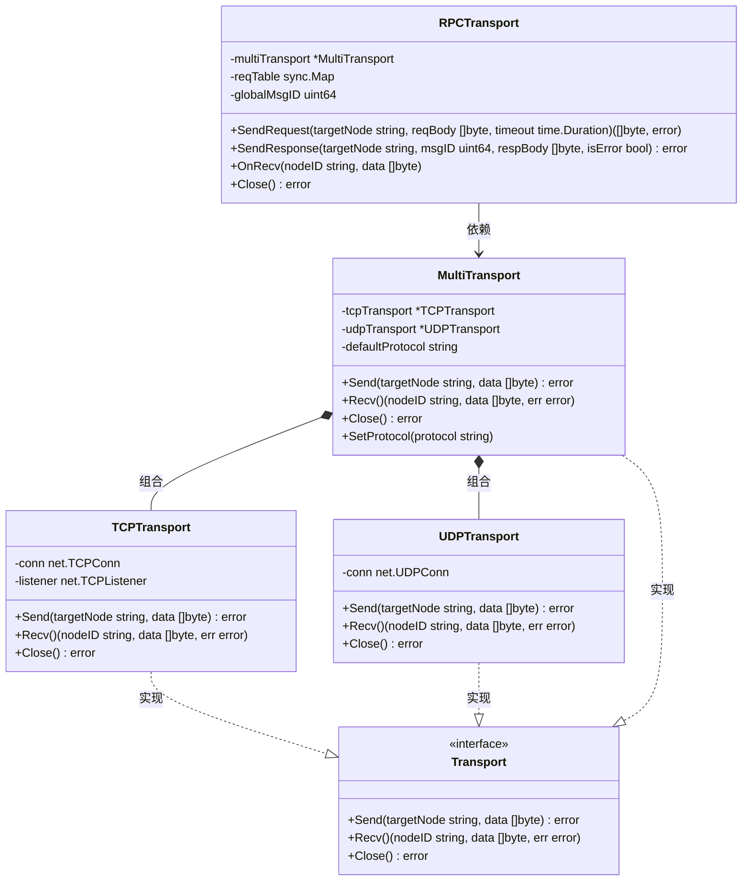

# RPCTransport 设计建议

> **文档类型**: 💡 技术建议 (Proposals)
> **创建日期**: 2026-01-23
> **状态**: 📋 待讨论
> **优先级**: P1 (高优先级 - 核心功能增强)
> **作者**: 架构师 + Go 专家 Agent

---

## 📋 背景说明

当前 NexKV Transport 模块已完成基础层和组合层实现：
- ✅ 基础层：TCPTransport、UDPTransport（单一协议收发）
- ✅ 组合层：MultiTransport（整合 TCP/UDP，屏蔽协议差异）
- ⚠️ 功能层：缺少统一的请求-应答抽象

在实际业务场景中（Gossip 协议、Quorum 投票、2PC 协调），都需要"发请求→等响应"的模式，但当前各模块都在自行实现这套逻辑，存在重复代码和一致性问题。

---

## 🎯 核心设计：三层架构

### 架构图



---

## 🏗️ 各层职责详解

### 1. 抽象层：Transport 接口

**核心职责**：定义统一的传输抽象规范

```go
type Transport interface {
    // Send 发送数据到目标节点
    Send(targetNode string, data []byte) error

    // Recv 接收数据（阻塞）
    Recv() (nodeID string, data []byte, err error)

    // Close 关闭传输
    Close() error
}
```

**设计意义**：
- 所有传输组件的统一抽象
- 上层代码无需关心底层实现
- 便于扩展新协议（QUIC、SCTP）

---

### 2. 基础层：TCP/UDP Transport

**核心职责**：封装单一协议的底层收发

| 组件 | 实现状态 | 核心能力 |
|------|---------|---------|
| TCPTransport | ✅ 已完成 | 面向连接的可靠传输 |
| UDPTransport | ✅ 已完成 | 无连接的高效传输 + 分片重组 |

**设计特点**：
- 最小粒度的传输实现
- 只负责"纯粹的字节收发"
- 不包含业务逻辑（请求-应答、协议选择）

---

### 3. 组合层：MultiTransport

**核心职责**：整合 TCP/UDP，屏蔽协议差异

```go
type MultiTransport struct {
    tcpTransport     *TCPTransport
    udpTransport     *UDPTransport
    defaultProtocol  string  // 如 "tcp"
}

func (m *MultiTransport) Send(targetNode string, data []byte) error {
    // 根据规则选择 TCP/UDP
    if m.shouldUseTCP(targetNode, data) {
        return m.tcpTransport.Send(targetNode, data)
    }
    return m.udpTransport.Send(targetNode, data)
}
```

**设计特点**：
- 对外暴露统一的 Transport 接口
- 可配置默认协议
- 支持动态协议切换

---

### 4. 功能层：RPCTransport（新增建议）

**核心职责**：基于 MultiTransport 实现请求-应答逻辑

```go
type RPCTransport struct {
    multiTransport   *MultiTransport
    reqTable         sync.Map  // key: NodeID+MsgID, value: RequestCtx
    globalMsgID      uint64    // 原子自增
    timeout          time.Duration
}

type RequestCtx struct {
    MsgID        uint64
    RespCh       chan []byte
    ErrorCh      chan error
    Timer        *time.Timer
}

// SendRequest 发送请求并等待响应
func (r *RPCTransport) SendRequest(
    targetNode string,
    reqBody []byte,
    timeout time.Duration,
) ([]byte, error)

// SendResponse 发送响应
func (r *RPCTransport) SendResponse(
    targetNode string,
    msgID uint64,
    respBody []byte,
    isError bool,
) error

// OnRecv 处理收到的消息（请求/响应）
func (r *RPCTransport) OnRecv(nodeID string, data []byte)
```

**核心能力**：
- ✅ MsgID 生成和管理
- ✅ 请求等待表（reqTable）
- ✅ 超时处理
- ✅ 请求/响应消息区分
- ✅ 透传响应标识

---

## 🔄 调用链路示例

### 业务层发送 RPC 请求

```
业务层（Gossip/Quorum/2PC）
  ↓
RPCTransport.SendRequest(targetNode, reqBody, timeout)
  ├─ 生成 MsgID
  ├─ 创建 RequestCtx（RespCh、ErrorCh、Timer）
  ├─ 存入 reqTable[NodeID+MsgID]
  └─ 调用 MultiTransport.Send()
       └─ 选择 TCP/UDP → TCPTransport.Send() / UDPTransport.Send()
  ↓
等待响应（监听 MultiTransport.Recv()）
  ↓
RPCTransport.OnRecv(nodeID, data)
  ├─ 解析 MsgID
  ├─ 匹配 reqTable
  ├─ 写入 RespCh / ErrorCh
  └─ 清理 reqTable
  ↓
返回结果给业务层
```

---

## 📊 与现有代码的关系

### 当前实现状态

| 文件 | 组件 | 状态 |
|------|------|------|
| `transport.go` | Transport 接口 | ✅ 已定义 |
| `tcp_transport.go` | TCPTransport | ✅ 已实现 |
| `udp_transport.go` | UDPTransport | ✅ 已实现 |
| `multi_transport.go` | MultiTransport | ✅ 已实现 |
| - | RPCTransport | ❌ **缺失** |

### 当前各模块自行实现 RPC 逻辑

**问题示例 1**：Gossip 协议
```go
// 当前：Gossip 模块自行实现请求-应答
msgID := generateMsgID()
respCh := make(chan []byte, 1)
// ... 手动管理等待表和超时
```

**问题示例 2**：Quorum 投票
```go
// 当前：Quorum 模块自行实现请求-应答
for _, node := range nodes {
    go func(n string) {
        // 发送请求
        transport.Send(ctx, n, msg)
        // 等待响应...（重复代码）
    }(node)
}
```

**问题**：
- 代码重复
- 超时处理不统一
- MsgID 生成方式不一致
- 错误处理逻辑分散

---

## 🎯 设计优势

### 1. 高内聚、低耦合

| 优势 | 说明 |
|------|------|
| **职责分离** | 每层专注自己的职责（基础层收发、组合层屏蔽差异、功能层业务逻辑） |
| **易于扩展** | 新增协议（QUIC）只需实现 Transport 接口，不影响 RPCTransport |
| **易于维护** | 调整请求-应答逻辑只需修改 RPCTransport |

### 2. 复用性强

```
RPCTransport 可用于：
├── Gossip 协议（节点间同步）
├── Quorum 投票（多数派确认）
├── 2PC 协调（事务协调）
└── 自定义 RPC 场景
```

### 3. 测试友好

- 可独立测试 RPCTransport 逻辑
- 可 Mock MultiTransport 进行单元测试
- 可集成测试完整调用链

---

## 📋 实施计划

### 阶段 1：RPCTransport 核心（1 周）

**文件结构**：
```
internal/metadata/transport/
├── rpc_transport.go          # RPCTransport 实现
├── rpc_transport_test.go     # 单元测试
└── rpc_bench_test.go         # 性能基准测试
```

**核心方法**：
- `NewRPCTransport(multi *MultiTransport) *RPCTransport`
- `SendRequest(targetNode, reqBody, timeout) ([]byte, error)`
- `SendResponse(targetNode, msgID, respBody, isError) error`
- `OnRecv(nodeID, data) error`
- `Close() error`

**单元测试**：
- 测试 MsgID 生成唯一性
- 测试请求等待表的并发安全
- 测试超时处理
- 测试响应匹配逻辑

### 阶段 2：集成现有模块（1 周）

**替换目标**：
- `internal/metadata/gossip/` - 使用 RPCTransport
- `internal/metadata/quorum/` - 使用 RPCTransport
- `internal/metadata/twopc/` - 使用 RPCTransport

**迁移步骤**：
1. 保留现有代码作为备份
2. 逐步替换为 RPCTransport
3. 对测试验证功能一致性
4. 删除旧代码

### 阶段 3：优化和文档（3-5 天）

**优化项**：
- 性能基准测试和调优
- 连接池复用
- 批量请求支持

**文档**：
- API 使用示例
- 设计文档更新
- 运维手册补充

---

## 🔍 技术细节

### 消息格式设计

**请求消息**：
```
┌─────────────┬─────────────┬─────────────┬─────────────┐
│ MsgType     │ MsgID       │ IsRequest   │ Body        │
│ (1 byte)    │ (8 bytes)   │ (1 byte)    │ (N bytes)   │
├─────────────┼─────────────┼─────────────┼─────────────┤
│ 0x01=Req    │ 自动生成    │ 0x01=true   │ 请求体      │
│ 0x02=Resp   │             │ 0x02=false  │ 响应体      │
└─────────────┴─────────────┴─────────────┴─────────────┘
```

### 请求等待表设计

```go
type RequestKey struct {
    NodeID uint64
    MsgID  uint64
}

type RequestCtx struct {
    MsgID     uint64
    RespCh    chan []byte
    ErrorCh   chan error
    Timer     *time.Timer
    CreatedAt time.Time
}

// 使用 sync.Map 保证并发安全
var reqTable sync.Map  // key: RequestKey, value: *RequestCtx
```

### 超时处理

```go
func (r *RPCTransport) SendRequest(...) ([]byte, error) {
    ctx := &RequestCtx{
        MsgID:     msgID,
        RespCh:    make(chan []byte, 1),
        ErrorCh:   make(chan error, 1),
        Timer:     time.AfterFunc(timeout, func() {
            r.reqTable.Delete(RequestKey{NodeID, MsgID: msgID})
            ctx.ErrorCh <- ErrTimeout
        }),
    }
    defer ctx.Timer.Stop()

    r.reqTable.Store(RequestKey{NodeID, MsgID: msgID}, ctx)

    select {
    case resp := <-ctx.RespCh:
        return resp, nil
    case err := <-ctx.ErrorCh:
        return nil, err
    }
}
```

---

## ⚠️ 风险与缓解

| 风险 | 影响 | 缓解措施 |
|------|------|---------|
| 性能下降 | 中 | 充分的性能基准测试和调优 |
| 兼容性问题 | 高 | 保留旧接口，逐步迁移 |
| 并发安全 | 高 | 使用 sync.Map 和 race detector 验证 |
| 内存泄漏 | 中 | 定期清理 reqTable，设置最大容量 |

---

## 📚 参考资料

### 现有设计文档

- `docs/02_design/05_API接口设计.md` - Transport 接口定义
- `docs/06_project_management/transport_2026-01-23_Assessment-Report.md` - Transport 模块评估报告

### 相关代码

- `internal/metadata/transport/transport.go` - Transport 接口定义
- `internal/metadata/transport/multi_transport.go` - MultiTransport 实现
- `internal/metadata/transport/udp_transport.go` - UDP Transport 实现

---

## 🎯 总结

### 核心价值

> **RPCTransport 将补全 Transport 模块的功能层，提供统一的请求-应答抽象，消除各业务模块的重复代码，提升系统的可维护性和一致性。**

### 预期收益

| 收益 | 说明 |
|------|------|
| **代码复用** | Gossip/Quorum/2PC 共用一套 RPC 逻辑 |
| **一致性** | 统一的 MsgID 生成、超时处理、错误处理 |
| **可测试性** | 独立测试 RPC 逻辑，易于 Mock |
| **可扩展性** | 新增 RPC 场景无需修改底层 |

### 建议优先级

**P1（高优先级）**：
- 补全 Transport 模块的功能层
- 消除当前系统的重复代码
- 为 Gossip/Quorum/2PC 提供统一抽象

---

**文档维护者**: NexKV 开发团队
**最后更新**: 2026-01-23
**状态**: 📋 待讨论
