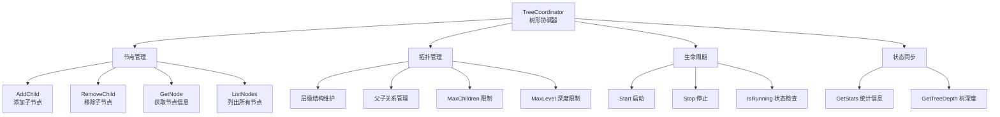
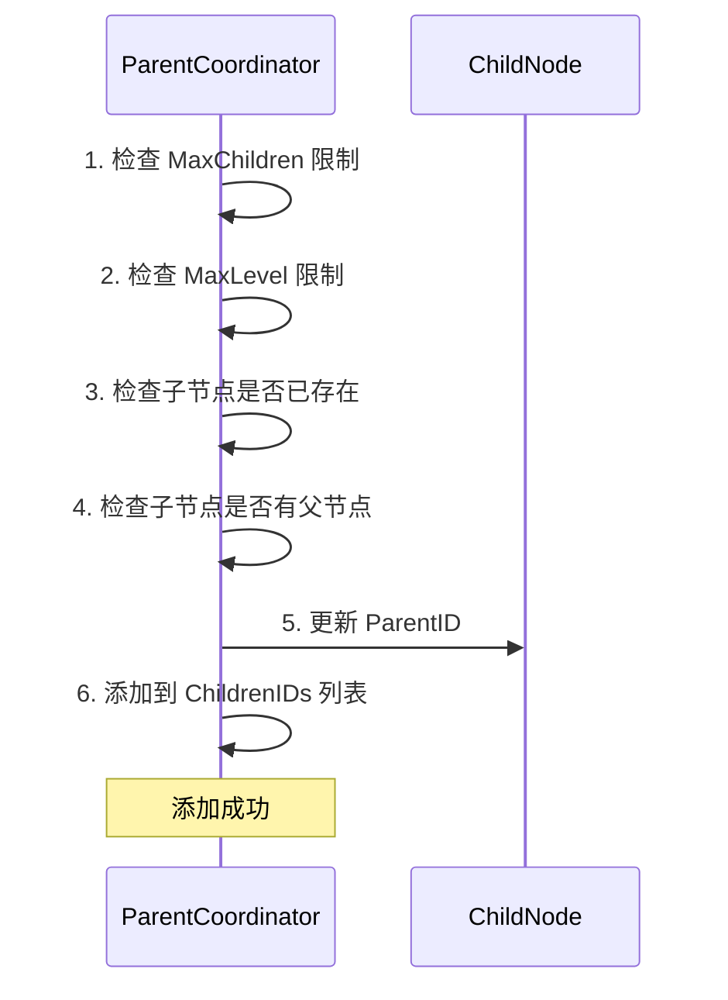
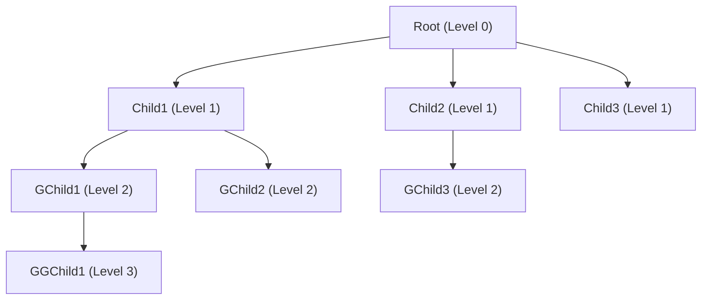
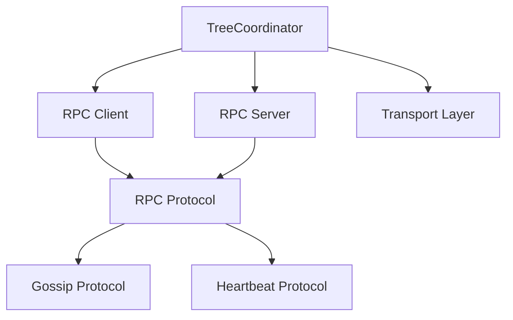

# TreeCoordinator 树形协调器功能设计与分析

> **文档类型**: 💡 技术方案与设计分析
> **创建日期**: 2026-01-28
> **状态**: ✅ 设计完成
> **优先级**: P0 (高)
> **相关文件**: internal/metadata/cluster/tree_coordinator.go

---

## 📊 执行摘要

**TreeCoordinator** 是 NexKV 分布式 KV 存储系统的**节点管理层**核心组件，负责：
- 维护树形拓扑结构（层级化管理）
- 管理节点父子关系（AddChild/RemoveChild）
- 协调节点生命周期（加入/离开/故障自愈）
- 提供集群状态查询（ListNodes/GetStats）

**当前实现进度**: **80%** - 核心功能已实现，高级功能（心跳、自愈、Gossip）待实现

---

## 🏗️ 架构设计

### 核心职责



### 数据结构

```go
type TreeCoordinator struct {
    // 配置
    config *TreeCoordinatorConfig

    // 本地节点信息
    localNode *Node

    // RPC 组件（PR-032 架构）
    RPCClient *transport.RPCClient
    RPCServer *transport.RPCServer

    // 节点管理
    allNodes map[string]*Node
    nodesMu  sync.RWMutex

    // 状态管理
    state atomic.Int32

    // 统计信息
    stats *TreeCoordinatorStats

    // 生命周期
    started atomic.Bool
    stopped atomic.Bool
    stopCh  chan struct{}
}
```

---

## 🎯 核心功能模块

### 1. 节点管理（✅ 已实现 100%）

#### 1.1 AddChild - 添加子节点

**功能描述**: 将一个节点添加为当前节点的子节点

**实现要点**:
- ✅ 检查子节点数量是否超过 MaxChildren 限制
- ✅ 检查树深度是否超过 MaxLevel 限制
- ✅ 检查子节点是否已存在（使用 `slices.Contains`）
- ✅ 检查子节点是否已有父节点（单父约束）
- ✅ 更新子节点的 ParentID 和 Level
- ✅ 更新本地节点的 ChildrenIDs 列表

**代码位置**: `tree_coordinator.go:423-487`

**示例流程**:


#### 1.2 RemoveChild - 移除子节点

**功能描述**: 从当前节点的子节点列表中移除一个节点

**实现要点**:
- ✅ 检查子节点是否存在（使用 `slices.Index` + `slices.Delete`）
- ✅ 清除子节点的 ParentID
- ✅ 重置子节点的 Level 为 0
- ✅ 从本地 ChildrenIDs 列表中删除

**代码位置**: `tree_coordinator.go:489-534`

#### 1.3 GetNode - 获取节点信息

**功能描述**: 根据 NodeID 查询节点信息

**实现要点**:
- ✅ 从 allNodes map 中查找节点
- ✅ 返回节点深拷贝（包括 Metadata）
- ✅ 节点不存在时返回错误

**代码位置**: `tree_coordinator.go:591-613`

#### 1.4 ListNodes - 列出所有节点

**功能描述**: 返回集群拓扑中所有节点的列表

**实现要点**:
- ✅ 返回所有节点的深拷贝
- ✅ 使用 `maps.Copy` 复制 Metadata
- ✅ 包含节点的 ChildrenIDs 列表

**代码位置**: `tree_coordinator.go:615-635`

---

### 2. 拓扑管理（✅ 已实现 70%）

#### 2.1 层级化树形结构

**设计原则**:
```
Level 0: 根节点（无父节点）
Level 1: 直接子节点（最多 MaxChildren 个）
Level 2: 二级子节点（最多 MaxChildren 个）
Level 3: 三级子节点（最多 MaxChildren 个）
...
MaxLevel: 树的最大深度（默认 4，支持 1+10+100+1000=1111 节点）
```

**结构图**:


**配置参数**:
| 参数 | 默认值 | 说明 |
|------|--------|------|
| MaxChildren | 10 | 每个节点最多子节点数 |
| MaxLevel | 4 | 树的最大深度 |
| HeartbeatInterval | 5s | 心跳间隔（未使用） |
| HeartbeatTimeout | 15s | 心跳超时（未使用） |
| AutoDiscovery | false | 是否自动发现节点 |
| EnableSelfHealing | false | 是否启用自愈 |

#### 2.2 单父节点约束

**设计原则**: 每个节点在同一时间只能有一个父节点

**实现方式**:
```go
// 检查 child 是否已经有父节点
if child, exists := tc.allNodes[childID]; exists {
    if child.ParentID != "" && child.ParentID != tc.localNode.NodeID {
        return types.NewClusterTreeManagementError(
            fmt.Sprintf("%s 已经是 %s 的子节点，不能同时作为 %s 的子节点",
                childID, child.ParentID, tc.localNode.NodeID))
    }
}
```

**测试覆盖**: ✅ `TestTreeCoordinator_SingleParentConstraint`

---

### 3. 生命周期管理（✅ 已实现 100%）

#### 3.1 Start - 启动协调器

**功能描述**: 启动树形协调器，进入 Ready 状态

**实现要点**:
- ✅ 状态检查：防止重复启动
- ✅ 状态转换：Init → Starting → Ready
- ✅ 日志记录

**代码位置**: `tree_coordinator.go:262-283`

#### 3.2 Stop - 停止协调器

**功能描述**: 停止树形协调器，清理资源

**实现要点**:
- ✅ 状态检查：防止重复停止
- ✅ 状态转换：Ready/Running → Stopping → Stopped
- ✅ 幂等性：多次调用 Stop 不会报错

**代码位置**: `tree_coordinator.go:285-305`

#### 3.3 IsRunning - 运行状态检查

**功能描述**: 检查协调器是否正在运行

**实现要点**:
- ✅ 基于 state 字段判断
- ✅ 返回布尔值

**代码位置**: `tree_coordinator.go:307-312`

---

### 4. 统计信息（✅ 已实现 100%）

#### 4.1 GetStats - 获取统计信息

**功能描述**: 返回集群的统计信息

**统计指标**:
```go
type TreeCoordinatorStats struct {
    TotalNodes   atomic.Int32  // 总节点数
    OnlineNodes   atomic.Int32  // 在线节点数
    OfflineNodes  atomic.Int32  // 离线节点数
    TreeDepth     atomic.Int32  // 树深度
    LastTopologyUpdate atomic.Value // time.Time 最后拓扑更新时间
}
```

**代码位置**: `tree_coordinator.go:860-885`

#### 4.2 GetTreeDepth - 获取树深度

**功能描述**: 计算并返回当前树的最大深度

**实现方式**:
- 遍历所有节点
- 找到最大的 Level 值
- 返回树深度

**代码位置**: `tree_coordinator.go:887-908`

---

## ⚠️ 未实现功能（TODO）

### 🔴 P0 - 核心功能（高优先级）

#### 1. 自动发现和加入（discoverAndJoin）

**位置**: `tree_coordinator.go:327`

**预期功能**:
- 通过传输层发现可用节点
- 选择合适的父节点（基于 Level、ChildrenIDs 数量）
- 发送加入请求到父节点
- 处理加入响应

**当前状态**: ❌ 空实现，仅有注释

---

#### 2. 心跳机制（sendHeartbeat）

**位置**: `tree_coordinator.go:356`

**预期功能**:
- 定期向父节点发送心跳
- 定期向子节点发送心跳
- 检测心跳超时
- 标记节点为离线

**当前状态**: ❌ 空实现，仅有日志

**实现建议**:
```go
// 伪代码
func (tc *TreeCoordinator) sendHeartbeat() {
    ticker := time.NewTicker(tc.config.HeartbeatInterval)
    for {
        select {
        case <-ticker.C:
            // 向父节点发送心跳
            if tc.localNode.ParentID != "" {
                tc.rpcClient.Heartbeat(tc.localNode.ParentID, tc.localNode.NodeID)
            }
            // 向子节点发送心跳
            for _, childID := range tc.localNode.ChildrenIDs {
                tc.rpcClient.Heartbeat(childID, tc.localNode.NodeID)
            }
        case <-tc.stopCh:
            return
        }
    }
}
```

---

#### 3. 自愈机制（triggerSelfHealing）

**位置**: `tree_coordinator.go:415`

**预期功能**:
- 检测到节点故障后触发
- 移除故障节点的父子关系
- 子节点重新寻找父节点
- 更新集群拓扑

**当前状态**: ❌ 空实现，仅有注释

**实现建议**:
```go
// 伪代码
func (tc *TreeCoordinator) triggerSelfHealing(failedNode *Node) {
    // 1. 从父节点的 ChildrenIDs 中移除
    if failedNode.ParentID != "" {
        parent := tc.allNodes[failedNode.ParentID]
        parent.ChildrenIDs = slices.Delete(parent.ChildrenIDs, idx)
    }

    // 2. 重新分配子节点
    for _, childID := range failedNode.ChildrenIDs {
        child := tc.allNodes[childID]
        newParent := tc.selectParentForNewNode()
        child.ParentID = newParent.NodeID
        newParent.ChildrenIDs = append(newParent.ChildrenIDs, childID)
    }

    // 3. 从集群中移除
    delete(tc.allNodes, failedNode.NodeID)
}
```

---

#### 4. 通知机制（离开时通知父节点和子节点）

**位置**: `tree_coordinator.go:429`

**预期功能**:
- 节点离开时通知父节点
- 节点离开时通知子节点
- 父节点从 ChildrenIDs 列表中移除
- 子节点重新寻找父节点

**当前状态**: ❌ 空实现，仅有日志

---

### 🟡 P1 - 协同功能（中优先级）

#### 5. Gossip 协议集成（拓扑变更扩散）

**位置**: `tree_coordinator.go:655, 720`

**预期功能**:
- 节点加入时通过 Gossip 扩散
- 节点离开时通过 Gossip 扩散
- 其他节点更新本地拓扑视图

**当前状态**: ❌ 未实现，仅有 TODO 注释

**实现建议**:
```go
// 伪代码
func (tc *TreeCoordinator) gossipTopologyChange(change *TopologyChange) {
    // 选择随机节点进行 Gossip
    peers := tc.selectRandomPeers(2) // 每轮选择 2 个随机节点

    for _, peer := range peers {
        tc.rpcClient.SendTopologyChange(peer.Addr, change)
    }
}
```

---

#### 6. ReparentChild - 节点重分配

**位置**: `cluster_handlers.go:148`

**预期功能**:
- 将子节点从当前父节点转移到新父节点
- 更新父子关系
- 通知相关节点

**当前状态**: ❌ 空实现，仅返回成功响应

---

### ⚪ P2 - 高级功能（低优先级）

#### 7. 数据迁移任务

**位置**: `tree_coordinator.go:656, 721`

**预期功能**:
- 节点离开时触发数据迁移
- 将数据迁移到其他副本
- 监控迁移进度

**当前状态**: ❌ 未实现，仅有 TODO 注释

---

## 📊 实现进度统计

| 功能模块 | 完成度 | 说明 |
|---------|--------|------|
| **节点管理** | ✅ 100% | AddChild/RemoveChild/GetNode/ListNodes 全部实现 |
| **拓扑管理** | ✅ 70% | 层级结构、单父约束已实现，Gossip 待实现 |
| **生命周期** | ✅ 100% | Start/Stop/IsRunning 全部实现 |
| **统计信息** | ✅ 100% | GetStats/GetTreeDepth 全部实现 |
| **自动发现** | ❌ 0% | discoverAndJoin() 空实现 |
| **心跳机制** | ❌ 0% | sendHeartbeat() 空实现 |
| **自愈机制** | ❌ 0% | triggerSelfHealing() 空实现 |
| **Gossip 同步** | ❌ 0% | 拓扑变更未扩散 |
| **节点重分配** | ❌ 0% | ReparentChild 未实现 |
| **数据迁移** | ❌ 0% | 迁移任务未实现 |

**总体完成度**: **约 60%**（核心节点管理功能已完成，高级协同功能待实现）

---

## 🎯 设计亮点

### 1. 简洁的 API 设计

```go
// 添加子节点
err := coordinator.AddChild("child1")

// 移除子节点
err := coordinator.RemoveChild("child1")

// 获取节点信息
node, err := coordinator.GetNode("child1")

// 列出所有节点
nodes := coordinator.ListNodes()

// 获取统计信息
stats := coordinator.GetStats()
```

### 2. 使用现代 Go 特性

- ✅ `slices.Contains` - 替代循环检查
- ✅ `slices.Index` + `slices.Delete` - 优化切片删除
- ✅ `maps.Copy` - 优化 map 复制
- ✅ `atomic.Int32` - 无锁统计计数器
- ✅ `sync.RWMutex` - 节点映射的读写锁

### 3. 防御式编程

- ✅ 参数验证（NodeID、Addr 非空）
- ✅ 状态检查（防止重复启动/停止）
- ✅ 边界检查（MaxChildren、MaxLevel 限制）
- ✅ 单父节点约束（避免拓扑冲突）

### 4. 深拷贝机制

```go
// GetNode 返回深拷贝，避免外部修改
func (tc *TreeCoordinator) GetNode(nodeID string) (*Node, error) {
    tc.nodesMu.RLock()
    defer tc.nodesMu.RUnlock()

    node, exists := tc.allNodes[nodeID]
    if !exists {
        return nil, types.NewClusterTreeManagementError("节点不存在: " + nodeID)
    }

    // 深拷贝
    nodeCopy := *node
    nodeCopy.ChildrenIDs = make([]string, len(node.ChildrenIDs))
    copy(nodeCopy.ChildrenIDs, node.ChildrenIDs)

    if node.Metadata != nil {
        nodeCopy.Metadata = make(map[string]string, len(node.Metadata))
        maps.Copy(nodeCopy.Metadata, node.Metadata)
    }

    return &nodeCopy, nil
}
```

---

## 🔗 与其他组件的关系

### 依赖组件



### 调用关系

**被谁使用**:
- `cmd/nexkvd/main.go` - 守护进程主入口
- `cluster_handlers.go` - RPC 处理器

**依赖谁**:
- `transport.Transport` - 传输层抽象
- `transport.RPCClient` - RPC 客户端
- `transport.RPCServer` - RPC 服务端
- `types` - 错误类型定义

---

## 📝 测试覆盖

### 单元测试（已实现）

| 测试函数 | 覆盖功能 | 状态 |
|---------|---------|------|
| `TestNewTreeCoordinator` | 创建协调器 | ✅ 通过 |
| `TestNewTreeCoordinator_InvalidParams` | 参数验证 | ✅ 通过 |
| `TestTreeCoordinator_StartStop` | 启动停止 | ✅ 通过 |
| `TestTreeCoordinator_AddChild` | 添加子节点 | ✅ 通过 |
| `TestTreeCoordinator_RemoveChild` | 移除子节点 | ✅ 通过 |
| `TestTreeCoordinator_GetNode` | 获取节点 | ✅ 通过 |
| `TestTreeCoordinator_ListNodes` | 列出节点 | ✅ 通过 |
| `TestTreeCoordinator_MaxChildrenConstraint` | 子节点数量限制 | ✅ 通过 |
| `TestTreeCoordinator_SingleParentConstraint` | 单父节点约束 | ✅ 通过 |

### 集成测试（已实现）

| 测试函数 | 覆盖场景 | 状态 |
|---------|---------|------|
| `TestIntegration_MultiNodeCluster` | 多节点集群管理 | ✅ 通过 |
| `TestIntegration_NodeJoinLeave` | 节点加入离开 | ✅ 通过 |
| `TestIntegration_MaxChildrenConstraint` | 子节点限制 | ✅ 通过 |
| `TestIntegration_ClusterStats` | 集群统计 | ✅ 通过 |
| `TestIntegration_ListNodes` | 节点列表 | ✅ 通过 |

---

## 🚀 下一步实现建议

### 短期目标（P0）

1. **实现心跳机制** (`sendHeartbeat`)
   - 优先级：P0
   - 预估工作量：2-3 天
   - 依赖：RPC 消息定义

2. **实现故障检测**
   - 优先级：P0
   - 预估工作量：1-2 天
   - 依赖：心跳机制

3. **实现自愈机制** (`triggerSelfHealing`)
   - 优先级：P0
   - 预估工作量：3-4 天
   - 依赖：故障检测

### 中期目标（P1）

4. **实现自动发现** (`discoverAndJoin`)
   - 优先级：P0
   - 预估工作量：2-3 天
   - 依赖：RPC 消息定义

5. **实现 Gossip 集成**
   - 优先级：P1
   - 预估工作量：3-5 天
   - 依赖：Gossip 协议实现

6. **实现 ReparentChild**
   - 优先级：P1
   - 预估工作量：2-3 天
   - 依赖：Gossip 协议

### 长期目标（P2）

7. **实现数据迁移**
   - 优先级：P2
   - 预估工作量：5-7 天
   - 依赖：分片管理层

---

## 📚 参考资料

### 相关文档

- `docs/02_design/modules/01_详细设计文档.md` - 详细设计文档
- `docs/06_project_management/pr_documents/feature/2026-01-27_PR-032_节点管理增强_全流程.md` - PR-032 全流程文档
- `internal/metadata/cluster/tree_coordinator.go` - 源代码

### 设计原则

- **KISS**: 保持简单，避免过度设计
- **YAGNI**: 只实现当前需要的功能
- **DRY**: 避免代码重复
- **SOLID**: 遵循单一职责、开闭原则

---

## 🎯 设计决策记录

### 决策 1: 使用本地 allNodes map 存储集群拓扑

**背景**: 需要维护集群的完整拓扑视图

**选择**: 使用 `map[string]*Node` 存储所有节点信息

**理由**:
- ✅ 快速查找：O(1) 时间复杂度
- ✅ 简单实现：无需复杂的树遍历
- ✅ 易于维护：拓扑变更时直接更新

**权衡**:
- ❌ 内存占用：需要维护所有节点的副本
- ❌ 一致性：需要通过 Gossip 同步其他节点的拓扑视图

---

### 决策 2: 深拷贝返回节点信息

**背景**: 防止外部修改内部状态

**选择**: GetNode/ListNodes 返回深拷贝

**理由**:
- ✅ 封装性：外部无法修改内部状态
- ✅ 安全性：避免并发冲突
- ✅ 稳定性：保护拓扑结构不被意外修改

**权衡**:
- ❌ 性能：深拷贝有性能开销
- ❌ 内存：占用额外内存

**优化**: 使用 `maps.Copy` 和 `copy()` 优化拷贝性能

---

### 决策 3: 单父节点约束

**背景**: 防止节点同时被多个父节点管理

**选择**: 强制每个节点只能有一个父节点

**理由**:
- ✅ 简化逻辑：避免复杂的协调机制
- ✅ 防止冲突：避免父子关系冲突
- ✅ 易于维护：拓扑结构清晰

**权衡**:
- ❌ 灵活性：无法实现多父节点场景
- ❌ 可用性：父节点故障时影响较大

---

**维护者**: 🤖 AI Assistant (Claude Code)
**最后更新**: 2026-01-28
**相关 PR**: PR-032 (节点管理增强)
