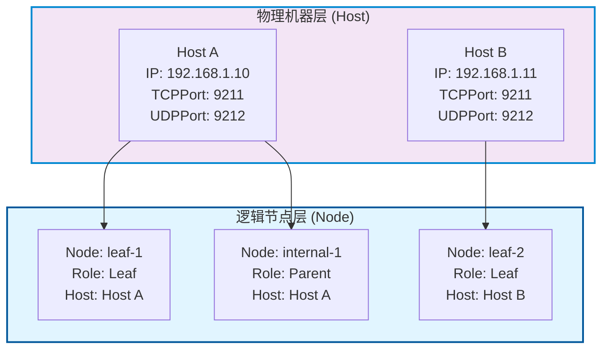
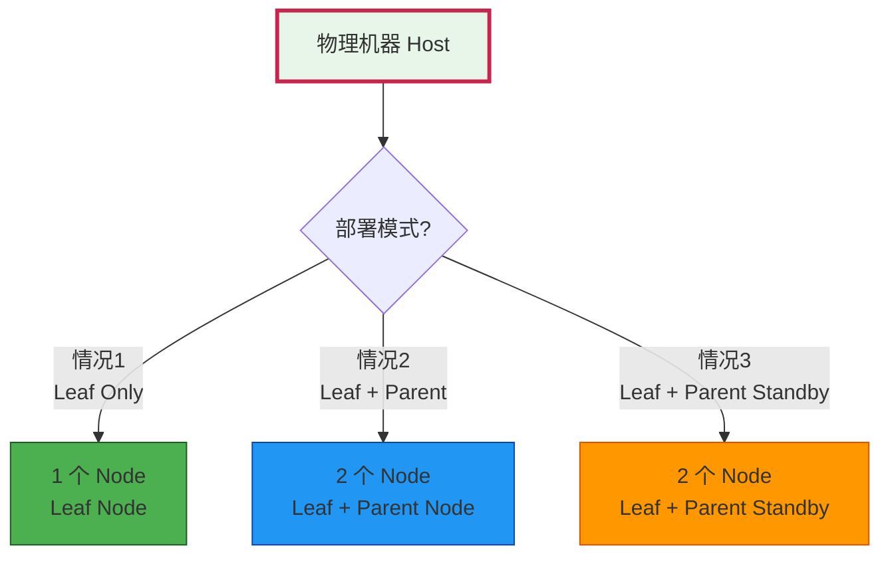
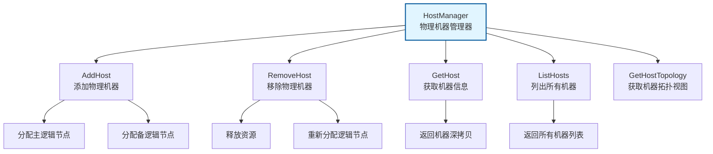
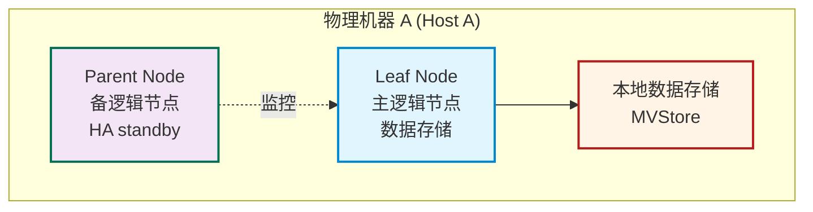

# TreeCoordinator 架构调整方案

> **文档类型**: 📊 架构调整方案
> **创建日期**: 2026-01-29
> **状态**: 🔄 待评审
> **优先级**: P0 (高)
> **相关文件**: `internal/metadata/cluster/tree_coordinator.go`

---

## 🔍 问题分析

### 问题 1: 叶子节点与 IP+TCPPort+UDPPort 的一一对应关系

#### 现状描述

**当前设计假设**:
- 假设一个 NodeID = 一个 IP+TCPPort+UDPPort
- 开发时: 单机开发,可以起多个 IP+TCPPort+UDPPort 模拟多节点
- 实际部署: 应该是一台物理机器一个 IP+TCPPort+UDPPort
- 地址格式: 使用 IPFS 风格，如 `/ip4/127.0.0.1/tcp/5001`

**问题根源**:
- 当前 Node 结构中的 `Addr` 字段存储的是 IP+TCPPort+UDPPort
- 但实际部署时,一台物理机器应该只有一个 IP+TCPPort+UDPPort
- 逻辑上可以有多个叶子节点角色,但物理上是同一台机器

**问题影响**:
- ❌ **部署复杂**: 需要为每个逻辑节点配置不同的 IP:Port
- ❌ **资源浪费**: 多个端口监听和连接管理
- ❌ **状态混乱**: 同一物理机器表现为多个独立节点
- ❌ **心跳冗余**: 同一机器发送多个心跳

### 问题 2: 非叶子节点的实际部署问题

#### 现状描述

**实际部署需求**:
- 一台物理机器存储数据,必然是数据的持有者
- 该机器在树形结构中可能是叶子节点或非叶子节点
- 如果是非叶子节点(父节点),需要有额外的 IP+TCPPort+UDPPort 作为父节点
- 父节点角色重要,需要 HA standby (高可用保障)

**问题根源**:
- 当前设计假设一个 Node 对应一个 IP+TCPPort+UDPPort
- 但实际需要: 一个物理机器同时扮演叶子节点和非叶子节点角色
- 需要关联: 实际部署的 IP+TCPPort+UDPPort (物理机器) 和多个逻辑角色

**问题影响**:
- ❌ **角色受限**: 无法一台机器同时承担存储和路由职责
- ❌ **无 HA**: 父节点角色没有 standby 保障
- ❌ **单点故障**: 一台机器作为父节点故障影响整个子树
- ❌ **数据路由**: 数据节点无法参与路由功能

---

## 🎯 架构调整方案

### 核心理念: 逻辑节点 vs 物理机器



### 核心概念

#### 1. 物理机器 (Host)

**定义**: 一台物理服务器/虚拟机

**核心字段**:
```go
type Host struct {
    HostID       string              // 机器唯一标识 (如 "server-1", "server-2")
    Role          HostRole           // 机器部署模式: leaf, parent, parent_standby
    Status        HostStatus          // 机器状态: Online, Offline, Degraded
    LeafNode     *Node              // 叶子节点（必需，每个 Host 必须有一个 Leaf Node）
    PrimaryNode   *Node              // 主节点（可选，用于 parent 角色）
    SecondaryNode *Node              // 备用节点（可选，用于 parent_standby 角色）
    LastHeartbeat time.Time         // 最后心跳时间
    Metadata      map[string]string    // 机器元数据
}

// HostRole 定义（3 种部署情况）
type HostRole string

const (
    HostRoleLeafOnly       HostRole = "leaf"           // 单机模式或边缘节点：仅叶子节点
    HostRoleLeafParent     HostRole = "parent"         // 普通分布式模式：叶子节点 + 父节点
    HostRoleLeafParentStandby HostRole = "parent_standby" // HA 主备模式：叶子节点 + 父节点（含主备）
)
```

// HostRole 机器部署模式
type HostRole int
const (
    // 情况1: Leaf Only (1 个 Node) - 仅叶子节点
    HostRoleLeafOnly HostRole = iota

    // 情况2: Leaf + Parent (2 个 Node) - 叶子+父节点（普通分布式模式）
    HostRoleLeafParent

    // 情况3: Leaf + Parent Standby (2 个 Node) - 叶子+父节点备节点（HA 模式）
    // Parent Standby 在 Parent Node 故障时快速接管
    HostRoleLeafParentStandby
)

// NodeRole 逻辑节点角色
type NodeRole int
const (
    NodeRoleLeaf NodeRole = iota      // 叶子节点：负责数据存储
    NodeRoleParent                   // 父节点：负责数据转发和路由
    NodeRoleParentStandby            // 父节点备节点：Parent Node 的热备（HA 模式）
)
```

#### 2. 逻辑节点 (Node)

**定义**: 树形拓扑中的逻辑节点,可以映射到物理机器

**调整后的字段**:
```go
type Node struct {
    NodeID       string              // 节点唯一标识 (纯逻辑标识，如 "node-leaf-1", "node-parent-1")
    HostID       string              // 所属物理机器 ID (新增字段)
    Addr          NodeAddress       // 节点地址 (使用 NodeAddress 结构类型，包含 IP、TCPPort、UDPPort)
    Role          NodeRole         // 节点角色: Leaf, Parent, ParentStandby
    ParentID     string              // 父节点ID (根节点为空)
    ChildrenIDs  []string           // 子节点ID列表
    Level        int                 // 层级 (根节点为 0)
    Status       NodeStatus          // 节点状态
    Priority     int                 // 优先级 (用于 Leader 选举)
    LastHeartbeat time.Time         // 最后心跳时间
    Metadata     map[string]string    // 节点元数据
}

// NodeAddress 结构定义 (包含 IP 和端口信息)
type NodeAddress struct {
    IPAddress string  // IP 地址
    TCPPort   int     // TCP 端口
    UDPPort   int     // UDP 端口
}
```

### Host-Node 关系约束

**核心约束**：一个 Host（物理机器）有 3 种部署情况，最多 2 个 Node



#### 部署情况详解

**情况 1：Leaf Only (HostRoleLeafOnly)**
- 配置：1 个 Leaf Node
- Node 数量：1 个
- 适用场景：单机模式或边缘节点，不承担路由职责
- 其他字段：PrimaryNode 和 SecondaryNode 均为空

**情况 2：Leaf + Parent (HostRoleLeafParent)**
- 配置：Leaf Node + Parent Node（普通分布式模式）
- Node 数量：2 个（LeafNode 必需，PrimaryNode 可选）
- 适用场景：需要同时承担存储和路由职责的标准分布式部署
- Parent Node 参与正常的数据转发
- PrimaryNode：Parent Node（可选，正常工作时）
- SecondaryNode：为空

**情况 3：Leaf + Parent Standby (HostRoleLeafParentStandby)**
- 配置：Leaf Node + Parent Standby Node（HA 主备模式）
- Node 数量：2 个
- 适用场景：需要高可用性的关键部署
- Parent Standby 在 Parent Node 故障时快速接管
- PrimaryNode：活跃的 Parent Node ID
- SecondaryNode：备用的 Parent Standby Node ID（正常状态下不参与数据转发）

#### 关键规则

| 规则 | 说明 |
|------|------|
| **最多 2 个 Node** | 一个 Host 严禁超过 2 个 Node |
| **Leaf Node 必需** | 任何部署模式都必须有 Leaf Node |
| **3 种模式** | Leaf Only、Leaf+Parent、Leaf+ParentStandby |
| **模式互斥** | 一个 Host 同一时刻只能属于一种部署模式 |

#### HostID 与物理机器的对应机制

**问题**：如何确定 `host_id` 与物理机器的对应关系？特别是在 `localhost` 测试场景下？

**解决方案**：采用**配置驱动 + 自动识别**的混合策略

##### 方案概览

| 识别方式 | 优先级 | 说明 | 适用场景 |
|----------|--------|------|---------|
| **配置文件显式指定** | 高 | 在 `config.yaml` 中明确 `hostname` 字段 | 生产环境、明确部署 |
| **hostname 自动识别** | 中 | 使用 `os.Hostname()` 获取机器名 | 测试环境、简单部署 |
| **IP 地址映射** | 低 | 根据监听 IP 反向匹配 | localhost 场景 |

##### 详细设计

**1. 配置文件显式指定（推荐生产环境）**

```yaml
hosts:
  - host_id: "server-1"           # 机器逻辑标识
    hostname: "192.168.1.100"     # 物理机器的实际地址（必需）
    role: "leaf_parent"           # 部署模式
    nodes:
      - node_id: "node-leaf-1"      # 节点 1
        role: "leaf"
        tcp_port: 9211
        udp_port: 9212
      - node_id: "node-parent-1"     # 节点 2
        role: "parent"
        tcp_port: 9213
        udp_port: 9214
```

**优点**：
- ✅ 明确性：运维人员可以直接看到哪台机器是哪个 `host_id`
- ✅ 可控性：不受 hostname 变化影响
- ✅ 跨环境：同一套配置可以用于不同网络环境

**缺点**：
- ⚠️ 配置复杂度增加
- ⚠️ 需要 DNS 或 /etc/hosts 配置（如果用 hostname 而非 IP）

**2. hostname 自动识别（推荐测试环境）**

```go
// HostManager 初始化时自动获取
func NewHostManager(config *Config) *HostManager {
    hostID := os.Hostname()  // 如 "server-1", "MacBook-Pro"

    // 支持配置覆盖
    if config.HostID != "" {
        hostID = config.HostID
    }

    return &HostManager{
        localHostID: hostID,
        hosts: make(map[string]*Host),
    }
}
```

**优点**：
- ✅ 零配置：无需手动指定，自动适配
- ✅ 测试友好：单机启动多个节点实例，自动识别

**缺点**：
- ⚠️ **localhost 场景问题**：所有实例返回相同的 hostname（如空、"localhost"）
- ⚠️ 依赖系统配置：需要正确配置 /etc/hostname

**3. localhost 场景解决方案**

**问题**：在 `127.0.0.1` 环境下，`os.Hostname()` 返回相同值，无法区分不同"物理机器"

**解决方案 A：使用 IP 地址区分**

```yaml
# 方式 1：通过 IP 端口组合区分（测试场景）
hosts:
  - host_id: "host-1"
    hostname: "127.0.0.1"      # 所有节点用同一 IP
    role: "leaf_parent"
    nodes:
      - node_id: "node-leaf-1"
        tcp_port: 9211
        udp_port: 9212
      - node_id: "node-parent-1"
        tcp_port: 9213
        udp_port: 9214

# 方式 2：通过虚拟 IP 区分（真实部署场景）
hosts:
  - host_id: "server-1"
    hostname: "192.168.1.100"     # 物理机器的实际 IP
    role: "leaf_parent"
    nodes:
      - node_id: "node-leaf-1"
        tcp_port: 9211
        udp_port: 9212
```

**解决方案 B：配置文件中的标识符（推荐）**

```yaml
# 测试环境：明确指定 host_id，覆盖 hostname
hosts:
  - host_id: "test-host-1"      # 逻辑标识，不是物理 hostname
    hostname: "127.0.0.1"
    role: "leaf_parent"
    nodes:
      - node_id: "node-leaf-1"
        role: "leaf"
        tcp_port: 9211
        udp_port: 9212

  - host_id: "test-host-2"      # 模拟第二台物理机器
    hostname: "127.0.0.1"       # 同样用 localhost
    role: "leaf_parent_standby"
    nodes:
      - node_id: "node-leaf-2"
        role: "leaf"
        tcp_port: 9213        # 不同端口
        udp_port: 9214
```

**关键点**：
- `host_id` 是**逻辑标识符**，用于区分部署单元
- `hostname` 是**物理地址**，用于实际网络通信
- **localhost 场景**：通过 `host_id` 逻辑区分，实际通信时所有节点监听在 `127.0.0.1`

##### HostManager 识别逻辑

```go
type Host struct {
    HostID       string              // 机器唯一标识（逻辑标识，如 "server-1", "test-host-1"）
    Hostname     string              // 物理机器地址（如 "192.168.1.100", "127.0.0.1"）
    Role          HostRole           // 部署模式
    // ... 其他字段
}

// 启动时的识别流程
func (hm *HostManager) identifyLocalHost(configHostID string) (string, string) {
    var hostID, hostname string

    // 1. 优先使用配置文件
    if configHostID != "" && configHostname != "" {
        hostID = configHostID
        hostname = configHostname
        return hostID, hostname
    }

    // 2. 自动获取 hostname
    hostname, _ = os.Hostname()

    // 3. 配置仅指定 host_id 时，覆盖识别结果
    if configHostID != "" {
        hostID = configHostID
        return hostID, hostname
    }

    // 4. 完全自动识别
    hostID = hostname
    return hostID, hostname
}
```

##### 地址映射示例

Host 上的多个 Node 共享物理地址（IP + TCPPort + UDPPort），但每个 Node 有独立的端口：

```yaml
# 测试环境：localhost + 多个逻辑 host
hosts:
  - host_id: "test-host-1"      # 逻辑标识符
    hostname: "127.0.0.1"
    role: "leaf_parent"
    nodes:
      - node_id: "node-leaf-1"
        role: "leaf"
        tcp_port: 9211
        udp_port: 9212
      - node_id: "node-parent-1"
        role: "parent"
        tcp_port: 9213
        udp_port: 9214

  - host_id: "test-host-2"      # 模拟第二台物理机器
    hostname: "127.0.0.1"
    role: "leaf_parent_standby"
    nodes:
      - node_id: "node-leaf-2"
        role: "leaf"
        tcp_port: 9215
        udp_port: 9216
      - node_id: "node-parent-2"
        role: "parent"
        tcp_port: 9217
        udp_port: 9218
```

**地址转换规则**：
- Host 层：HostAddr.TCPAddr() = `/ip4/127.0.0.1/tcp/5001`
- Node 层：NodeAddr.TCPAddr() = `/ip4/127.0.0.1/tcp/5003`
- Node.Addr 字段：从 NodeAddr 转换，实际使用时拼接完整 IPFS 格式

---

## 🏗️ 新架构设计

### 1. HostManager - 物理机器管理



**核心方法**:

#### 1.1 AddHost - 添加物理机器

**功能**: 注册一台新的物理机器到集群

**实现要点**:
- ✅ 验证 HostID 唯一性
- ✅ 验证 Addr 格式 (IPFS 风格，如 "/ip4/127.0.0.1/tcp/5001", "/ip4/127.0.0.1/udp/5002")
- ✅ 分配主逻辑节点 (如果角色需要)
- ✅ 分配备用逻辑节点 (如果角色需要)
- ✅ 初始化机器状态为 Online

**代码框架**:
```go
func (hm *HostManager) AddHost(hostID, addr string, role HostRole) error {
    hm.hostsMu.Lock()
    defer hm.hostsMu.Unlock()

    // 检查 HostID 是否已存在
    if _, exists := hm.allHosts[hostID]; exists {
        return types.NewClusterHostAlreadyExistsError(hostID)
    }

    // 创建 Host
    host := &Host{
        HostID:        hostID,
        Addr:          addr,
        Role:          role,
        Status:        HostStatusOnline,
        LastHeartbeat: time.Now(),
        Metadata:      make(map[string]string),
    }

    // 根据角色分配逻辑节点
    switch role {
    case HostRoleStorageOnly:
        // 仅存储角色,分配一个叶子节点
        nodeID := fmt.Sprintf("node-leaf-%s", hostID)
        host.PrimaryNode = nodeID

    case HostRoleLeafParent:
        // 叶子+父节点,分配两个逻辑节点
        leafNodeID := fmt.Sprintf("node-leaf-%s", hostID)
        parentNodeID := fmt.Sprintf("node-parent-%s", hostID)
        host.PrimaryNode = leafNodeID
        host.SecondaryNode = parentNodeID
    }

    // 添加到拓扑
    hm.allHosts[hostID] = host
    hm.stats.TotalHosts.Add(1)
    hm.stats.OnlineHosts.Add(1)

    return nil
}
```

#### 1.2 RemoveHost - 移除物理机器

**功能**: 从集群中移除一台物理机器

**实现要点**:
- ✅ 验证机器存在
- ✅ 不能移除本地机器
- ✅ 释放逻辑节点资源
- ✅ 重新分配子节点
- ✅ 标记机器状态为 Offline

**代码框架**:
```go
func (hm *HostManager) RemoveHost(hostID string) error {
    hm.hostsMu.Lock()
    defer hm.hostsMu.Unlock()

    host, exists := hm.allHosts[hostID]
    if !exists {
        return types.NewClusterHostNotFoundError(hostID)
    }

    // 不能移除本地机器
    if hostID == hm.localHost.HostID {
        return types.NewClusterHostManagementError("不能移除本地机器")
    }

    // 标记机器为离线
    host.Status = HostStatusOffline
    hm.stats.OnlineHosts.Add(-1)
    hm.stats.OfflineHosts.Add(1)

    // 重新分配逻辑节点 (具体实现见第 3 节)
    go hm.reassignNodesForHost(host)

    return nil
}
```

#### 1.3 GetHost - 获取机器信息

**功能**: 获取指定物理机器的深拷贝信息

**实现要点**:
- ✅ 返回机器深拷贝
- ✅ 包含主逻辑节点和备逻辑节点 ID
- ✅ 机器不存在时返回错误

**代码框架**:
```go
func (hm *HostManager) GetHost(hostID string) (*Host, error) {
    hm.hostsMu.RLock()
    defer hm.hostsMu.RUnlock()

    host, exists := hm.allHosts[hostID]
    if !exists {
        return nil, types.NewClusterHostNotFoundError(hostID)
    }

    // 深拷贝
    hostCopy := *host
    hostCopy.Metadata = make(map[string]string, len(host.Metadata))
    maps.Copy(hostCopy.Metadata, host.Metadata)

    return &hostCopy, nil
}
```

#### 1.4 GetHostTopology - 获取机器拓扑视图

**功能**: 返回物理机器到逻辑节点的映射关系

**实现要点**:
- ✅ 构建机器 -> 逻辑节点的映射
- ✅ 标识每台机器承担的角色
- ✅ 用于监控和可视化

**代码框架**:
```go
func (hm *HostManager) GetHostTopology() map[string][]string {
    hm.hostsMu.RLock()
    defer hm.hostsMu.RUnlock()

    topology := make(map[string][]string)

    for hostID, host := range hm.allHosts {
        var nodeIDs []string

        // 根据角色添加逻辑节点
        if host.PrimaryNode != "" {
            nodeIDs = append(nodeIDs, host.PrimaryNode)
        }
        if host.SecondaryNode != "" {
            nodeIDs = append(nodeIDs, host.SecondaryNode)
        }

        topology[hostID] = nodeIDs
    }

    return topology
}
```

### 2. TreeCoordinator 调整

#### 2.1 核心数据结构调整

```go
type TreeCoordinator struct {
    // 配置
    config *TreeCoordinatorConfig

    // 本地物理机器信息 (新增)
    localHost *Host
    localNode *Node             // 当前激活的逻辑节点 (可以是叶子或父节点)

    // RPC 组件
    RPCClient *transport.RPCClient
    RPCServer *transport.RPCServer

    // 物理机器管理 (新增)
    allHosts   map[string]*Host
    hostsMu    sync.RWMutex

    // 逻辑节点管理 (保留)
    allNodes  map[string]*Node
    nodesMu   sync.RWMutex

    // 状态管理
    state atomic.Int32

    // 统计信息
    stats *TreeCoordinatorStats

    // 生命周期
    started atomic.Bool
    stopped atomic.Bool
    stopCh  chan struct{}
}

// TreeCoordinatorConfig 新增字段
type TreeCoordinatorConfig struct {
    MaxChildren       int
    MaxLevel          int
    HeartbeatInterval time.Duration
    HeartbeatTimeout  time.Duration
    AutoDiscovery     bool
    EnableSelfHealing bool

    // 新增配置
    HostRole          HostRole        // 本地机器角色
    EnableHAMode     bool           // 是否启用 HA 模式
}
```

#### 2.2 关键方法调整

##### 2.2.1 NewTreeCoordinator - 创建协调器

**调整要点**:
```go
func NewTreeCoordinator(
    localHostID string,      // 改为 HostID
    localAddr string,
    config *TreeCoordinatorConfig,
) (*TreeCoordinator, error) {
    if config == nil {
        config = DefaultTreeCoordinatorConfig()
    }

    // 默认角色为仅存储
    if config.HostRole == 0 {
        config.HostRole = HostRoleStorageOnly
    }

    // 创建本地物理机器
    localHost := &Host{
        HostID:        localHostID,
        Addr:          localAddr,
        Role:          config.HostRole,
        Status:        HostStatusOnline,
        LastHeartbeat: time.Now(),
        Metadata:      make(map[string]string),
    }

    // 创建本地主逻辑节点
    localNodeID := fmt.Sprintf("node-leaf-%s", localHostID)
    localNode := &Node{
        NodeID:   localNodeID,
        HostID:   localHostID,  // 关联物理机器
        Addr:      localAddr,
        Role:      NodeRoleLeaf,
        ParentID:  "",
        ChildrenIDs: make([]string, 0),
        Level:     0,
        Status:    NodeStatusInit,
        Priority:  0,
        LastHeartbeat: time.Now(),
        Metadata:  make(map[string]string),
    }

    // 如果是叶子+父节点角色,创建备逻辑节点
    if config.HostRole == HostRoleLeafParent {
        parentNodeID := fmt.Sprintf("node-parent-%s", localHostID)
        localHost.SecondaryNode = parentNodeID
    }

    coordinator := &TreeCoordinator{
        config:    config,
        localHost:  localHost,
        localNode: localNode,
        allNodes:  make(map[string]*Node),
        allHosts: make(map[string]*Host),
        allHosts[localHostID] = localHost,
        allNodes[localNodeID] = localNode,
        stopCh:    make(chan struct{}),
        stats:     &TreeCoordinatorStats{},
    }

    return coordinator, nil
}
```

##### 2.2.2 Start - 启动协调器

**调整要点**:
```go
func (tc *TreeCoordinator) Start() error {
    // ... 原有检查逻辑 ...

    // 启动主逻辑节点的 RPC Server
    if err := tc.RPCServer.Start(tc.localNode.Addr); err != nil {
        return err
    }

    // 如果是叶子+父节点角色,启动备逻辑节点
    if tc.config.HostRole == HostRoleLeafParent && tc.localHost.SecondaryNode != "" {
        if err := tc.RPCServer.StartSecondary(tc.localHost.Addr); err != nil {
            return fmt.Errorf("启动备逻辑节点失败: %w", err)
        }
    }

    // ... 原有启动逻辑 ...
}
```

##### 2.2.3 sendHeartbeat - 发送心跳 (调整)

**实现要点**:
```go
func (tc *TreeCoordinator) sendHeartbeat() {
    // 更新本地机器心跳时间
    tc.localHost.LastHeartbeat = time.Now()
    tc.localNode.LastHeartbeat = time.Now()

    // 向父节点发送心跳 (如果本地节点是叶子节点)
    if tc.localNode.Role == NodeRoleLeaf && tc.localNode.ParentID != "" {
        tc.RPCClient.Heartbeat(tc.localNode.ParentID, tc.localNode.NodeID)
    }

    // 向子节点发送心跳 (如果本地节点是父节点)
    if tc.localNode.Role == NodeRoleParent {
        for _, childID := range tc.localNode.ChildrenIDs {
            tc.RPCClient.Heartbeat(childID, tc.localNode.NodeID)
        }
    }

    logging.WithFields(map[string]any{
        "host_id":   tc.localHost.HostID,
        "node_id":   tc.localNode.NodeID,
        "role":      tc.localNode.Role,
        "children":  tc.localNode.ChildrenIDs,
    }).Debug("发送心跳")
}
```

---

## 🔄 高可用 (HA) 设计

### HA 模式: 主备架构



### HA 机制

#### 1. 主备切换逻辑

```go
type HAManager struct {
    config       *HAManagerConfig
    primaryNode  *Node
    secondaryNode *Node
    status       atomic.Int32 // HAStatus
    switchCh     chan struct{}
}

type HAStatus int
const (
    HAStatusPrimary     HAStatus = iota // 主节点激活
    HAStatusSecondary               // 备节点激活
    HAStatusSwitching                // 正在切换
)

// SwitchToSecondary 切换到备节点
func (ha *HAManager) SwitchToSecondary() error {
    ha.status.Store(int32(HAStatusSwitching))

    // 1. 停止主节点服务
    if err := ha.primaryNode.Stop(); err != nil {
        return fmt.Errorf("停止主节点失败: %w", err)
    }

    // 2. 同步数据状态
    if err := ha.syncData(); err != nil {
        return fmt.Errorf("同步数据失败: %w", err)
    }

    // 3. 启动备节点
    if err := ha.secondaryNode.Start(); err != nil {
        return fmt.Errorf("启动备节点失败: %w", err)
    }

    // 4. 更新角色标识
    ha.status.Store(int32(HAStatusSecondary))

    return nil
}

// MonitorHealth 健康监控
func (ha *HAManager) MonitorHealth() {
    ticker := time.NewTicker(5 * time.Second)
    defer ticker.Stop()

    for {
        select {
        case <-ticker.C:
            // 检查主节点健康状态
            if !ha.isHealthy(ha.primaryNode) {
                logging.Warn("主节点不健康,触发切换")
                if err := ha.SwitchToSecondary(); err != nil {
                    logging.WithField("error", err).Error("HA 切换失败")
                }
            }
        }
        }
    }
}

func (ha *HAManager) isHealthy(node *Node) bool {
    // 检查心跳时间
    if time.Since(node.LastHeartbeat) > ha.config.HealthCheckTimeout {
        return false
    }

    // 检查错误率
    if node.ErrorRate > ha.config.MaxErrorRate {
        return false
    }

    return true
}
```

#### 2. 数据同步机制

```go
// 同步主备节点数据
func (ha *HAManager) syncData() error {
    // 1. 同步 WAL 日志
    if err := ha.syncWAL(); err != nil {
        return err
    }

    // 2. 同步元数据
    if err := ha.syncMetadata(); err != nil {
        return err
    }

    // 3. 验证数据一致性
    if err := ha.verifyConsistency(); err != nil {
        return err
    }

    return nil
}
```

---

## 📋 实施计划

### Phase 1: 基础架构调整 (1-2 周)

**任务清单**:
- [ ] 1.1 创建 `host_manager.go` 模块
  - [ ] 实现 Host 结构体
  - [ ] 实现 HostManager 结构体
  - [ ] 实现 AddHost/RemoveHost/GetHost/GetHostTopology
  - [ ] 单元测试覆盖

- [ ] 1.2 调整 `tree_coordinator.go`
  - [ ] 新增 HostID 字段到 Node 结构
  - [ ] 新增 Role 字段到 Node 结构
  - [ ] 新增 allHosts map 到 TreeCoordinator
  - [ ] 新增 localHost 字段到 TreeCoordinator
  - [ ] 调整 NewTreeCoordinator 构造函数
  - [ ] 调整 Start 方法支持双节点启动
  - [ ] 调整 sendHeartbeat 方法

- [ ] 1.3 更新 `cluster_handlers.go`
  - [ ] 调整 RPC 处理器支持 HostID
  - [ ] 更新心跳处理逻辑
  - [ ] 更新拓扑同步逻辑

### Phase 2: 高可用机制 (2-3 周)

**任务清单**:
- [ ] 2.1 创建 `ha_manager.go` 模块
  - [ ] 实现 HAManager 结构体
  - [ ] 实现主备切换逻辑
  - [ ] 实现健康监控机制
  - [ ] 实现数据同步机制
  - [ ] 单元测试覆盖

- [ ] 2.2 集成 HA 到 TreeCoordinator
  - [ ] TreeCoordinator 包含 HAManager
  - [ ] 启动时初始化 HA 管理
  - [ ] 心跳失败时触发 HA 切换

### Phase 3: 测试与验证 (1 周)

**任务清单**:
- [ ] 3.1 单机模式测试
  - [ ] 验证 HostRoleStorageOnly 场景
  - [ ] 验证单节点数据存储

- [ ] 3.2 分布式模式测试
  - [ ] 验证 HostRoleLeafParent 场景
  - [ ] 验证主备切换
  - [ ] 验证 HA 故障恢复

- [ ] 3.3 性能测试
  - [ ] 对比调整前后的性能差异
  - [ ] 验证心跳开销
  - [ ] 验证内存占用

### Phase 4: 文档更新 (1 周)

**任务清单**:
- [ ] 4.1 更新参考文档
  - [ ] 更新 `cluster_2026-01-29_tree-coordinator-complete-reference.md`
  - [ ] 添加 HostManager 说明
  - [ ] 添加 HA 机制说明

- [ ] 4.2 更新设计文档
  - [ ] 更新 `docs/02_design/modules/07_树形协调器拓扑同步.md`
  - [ ] 添加物理机器 vs 逻辑节点说明
  - [ ] 添加 HA 架构说明

- [ ] 4.3 更新 API 文档
  - [ ] 更新 `docs/02_design/05_API接口设计.md`
  - [ ] 添加 HostManager 接口

---

## 🎯 关键设计决策

### 决策 1: 引入物理机器层

**背景**: 当前设计假设 Node = 物理机器,无法支持单机多角色

**选择**: 引入 Host 概念,分离物理机器和逻辑节点

**理由**:
- ✅ **清晰性**: 明确区分物理部署和逻辑拓扑
- ✅ **灵活性**: 支持单机多角色、HA 主备模式
- ✅ **可维护性**: 物理机器和逻辑节点独立管理
- ✅ **扩展性**: 易于添加物理机器级别的监控和管理

**权衡**:
- ❌ **复杂度**: 增加一层抽象,需要调整现有逻辑
- ❌ **学习成本**: 新概念需要团队理解和消化
- **优化**: 通过清晰的文档和示例降低学习成本

### 决策 2: 角色明确化

**背景**: 叶子节点和父节点职责不同,需要明确区分

**选择**: 引入 HostRole 和 NodeRole 枚举

**理由**:
- ✅ **语义清晰**: 明确表达物理机器和逻辑节点的角色
- ✅ **类型安全**: 编译期检查角色一致性
- ✅ **易于理解**: 代码阅读者一目了然
- ✅ **易于扩展**: 未来添加新角色类型简单

**权衡**:
- ❌ **状态复杂**: 需要维护两种角色的状态
- ❌ **测试复杂**: 需要测试所有角色组合场景
- **优化**: 通过清晰的测试用例降低复杂度

### 决策 3: HA 主备模式

**背景**: 父节点角色重要,需要高可用保障

**选择**: 使用主备 (Active-Standby) 模式,同一物理机器部署主备逻辑节点

**理由**:
- ✅ **快速切换**: 备节点可以快速接管
- ✅ **数据一致性**: 主备节点共享同一物理存储
- ✅ **资源利用**: Standby 开销低,资源利用率高
- ✅ **实现简单**: 相比分布式 Raft 等协议,主备模式简单

**权衡**:
- ❌ **短暂不可用**: 主备切换期间有短暂停机
- ❌ **脑裂风险**: 网络分区时可能出现双主
- ❌ **数据延迟**: Standby 同步可能有延迟
- **优化**: 通过快速检测和自动切换降低影响

---

## 🚨 风险与缓解

### 风险 1: 架构调整复杂度高

**影响**: 大规模代码重构,可能引入新 Bug

**缓解措施**:
- 分阶段实施,逐步验证
- 保持向后兼容,支持渐进式迁移
- 增加单元测试和集成测试覆盖率
- 代码 Review 重点关注逻辑正确性

### 风险 2: 性能回退

**影响**: 新架构可能影响性能

**缓解措施**:
- 性能基准测试,对比调整前后差异
- 关键路径优化,特别是心跳和同步逻辑
- 必要时使用缓存减少锁竞争
- 异步处理非关键路径

### 风险 3: HA 切换故障

**影响**: 主备切换可能失败,导致双主或无主

**缓解措施**:
- 强制切换失败回滚
- 心跳检测时间短,避免误判
- 切换前数据完整性校验
- 告警机制,及时人工介入

---

## 📚 参考资料

### 相关文档
- `cluster_2026-01-29_tree-coordinator-complete-reference.md` - TreeCoordinator 完整参考
- `docs/02_design/modules/01_详细设计文档.md` - 详细设计文档
- `docs/02_design/modules/07_树形协调器拓扑同步.md` - 拓扑同步设计

### 设计原则
- **关注点分离**: 分离关注点 (物理机器 vs 逻辑节点)
- **单一职责**: 每个组件职责单一明确
- **依赖倒置**: 高层模块不依赖低层实现
- **接口隔离**: 通过接口解耦模块间依赖

---

## 🎯 下一步行动

1. **评审本方案**: 与架构师讨论架构调整的合理性
2. **创建实施 PR**: 创建 feature/cluster-host-based-architecture 分支
3. **分阶段实施**: 按照 Phase 1-4 的计划逐步实施
4. **持续验证**: 每个阶段完成后验证功能正确性
5. **文档同步**: 实施过程中同步更新相关文档

---

**维护者**: 👤 架构师 + 🤖 AI Assistant
**最后更新**: 2026-01-29
**文档版本**: v1.0
