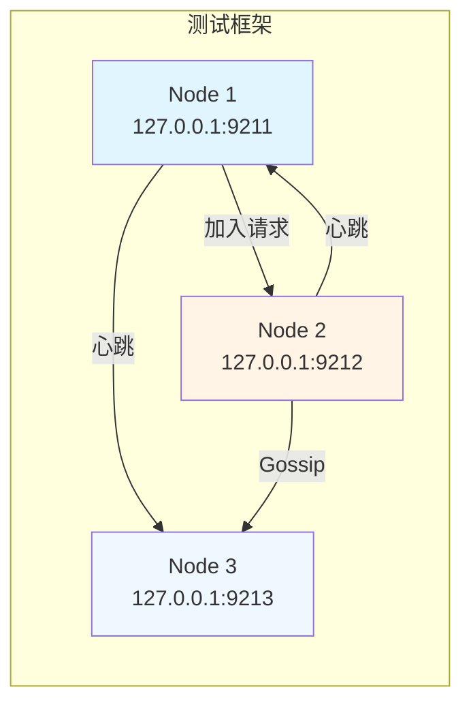

# 集群模块集成测试分析

> **文档类型**: 💡 技术分析
> **创建日期**: 2026-01-29
> **状态**: 📋 待讨论
> **优先级**: P1 (中)

---

## 背景说明

当前 `cluster` 包单元测试覆盖率为 55.8%，部分核心功能未覆盖的主要原因：

1. **RPCClient 依赖**：网络通信功能依赖 `transport.RPCClient`（具体结构体，非接口），难以 mock
2. **后台 Goroutine**：周期性任务在独立 goroutine 中运行，单元测试难以同步验证
3. **复杂状态流转**：节点发现、加入、故障恢复等涉及多节点协作

---

## 未覆盖代码分析

### 1. 网络通信类函数

| 函数 | 位置 | 依赖 | 难度 |
|------|------|------|------|
| `sendGossipMessage` | tree_coordinator_gossip.go:99 | RPCClient.Call | 中 |
| `sendJoinRequest` | tree_coordinator.go:623 | RPCClient.Call | 中 |
| `sendHeartbeatToNode` | tree_coordinator.go:715 | RPCClient.Call | 中 |

#### 关键依赖分析

```go
// RPCClient 是具体结构体，无法使用传统 interface mock
type RPCClient struct {
    // ... 内部实现
}

// 所有网络通信都通过 Call 方法
resp, err := tc.RPCClient.Call(ctx, targetAddr, message)
```

**集成测试策略**：

**方案 A: 真实 TCP 通信**
- ✅ 优点：真实环境，覆盖完整
- ❌ 缺点：测试不稳定，需要端口管理
- 📊 适用：E2E 测试、CI/CD 后置阶段

**方案 B: 注入依赖**
- ✅ 优点：可控、快速、稳定
- ❌ 缺点：需要重构 RPCClient 为接口
- 📊 适用：单元测试、TDD

**方案 C: HTTP/TCP Server Mock**
- ✅ 优点：无需重构，真实协议
- ❌ 缺点：实现复杂
- 📊 适用：集成测试

---

### 2. 后台 Goroutine

| 函数 | 位置 | 触发条件 | 周期 |
|------|------|---------|------|
| `gossipLoop` | tree_coordinator_gossip.go:130 | Start() 调用后 | 10s |
| `heartbeatLoop` | tree_coordinator.go:657 | Start() 调用后 | 可配置 |
| `failureDetectionLoop` | tree_coordinator.go:760 | Start() 调用后 | 可配置 |

#### 关键测试难点

```go
// 后台 goroutine 在 Start() 时启动
func (tc *TreeCoordinator) Start() error {
    // ...
    go tc.gossipLoop()          // 难以验证执行
    go tc.heartbeatLoop()       // 难以验证执行
    go tc.failureDetectionLoop() // 难以验证执行
    // ...
}
```

**集成测试策略**：

**方案 A: 时间等待 + 日志验证**
```go
// 启动 coordinator
coordinator.Start()

// 等待足够时间
time.Sleep(15 * time.Second)

// 检查日志或状态
// ❌ 不稳定、慢
```

**方案 B: 依赖注入 + 钩子函数**
```go
// 在测试中注入钩子来验证执行
tc.OnGossipSent = func(msg *GossipMessage) {
    assert.NotNil(t, msg)
}

// ✅ 精确、快速
// ❌ 需要重构
```

**方案 C: Channel 同步**
```go
// 在测试中使用 channel 等待 goroutine 执行
syncCh := make(chan *GossipMessage, 1)
// 注入到 gossip 中
<-syncCh // 等待执行

// ✅ 可靠、快速
// ❌ 需要修改代码
```

---

### 3. 发现与选择逻辑

| 函数 | 位置 | 依赖 | 难度 |
|------|------|------|------|
| `discoverAndJoin` | tree_coordinator.go:513 | getKnownNodes, selectBestParent, sendJoinRequest | 高 |
| `getKnownNodes` | tree_coordinator.go:568 | allNodes (需要预先填充) | 低 |
| `selectBestParent` | tree_coordinator.go:590 | allNodes | 低 |

#### 关键测试场景

**discoverAndJoin 完整流程**：
```
1. 获取已知节点列表 (getKnownNodes)
2. 如果没有已知节点 → 作为根节点启动
3. 如果有已知节点 → 选择最佳父节点 (selectBestParent)
4. 如果没有合适的父节点 → 作为根节点启动
5. 如果找到父节点 → 发送加入请求 (sendJoinRequest)
6. 如果发送失败 → 作为独立节点启动
7. 如果发送成功 → 更新本地节点信息
```

**selectBestParent 选择逻辑**：
```
1. 过滤：节点状态 != Ready → 跳过
2. 过滤：Level >= MaxLevel → 跳过
3. 过滤：ChildrenIDs >= MaxChildren → 跳过
4. 选择：Level 最小的节点
```

---

## 集成测试方案设计

### 方案 1: 端到端集成测试（真实 TCP）

**目标**：完整验证多节点协作场景

**测试架构**：


**测试用例设计**：

| 用例ID | 场景 | 验证点 |
|-------|------|--------|
| IT-001 | 单节点启动 | 根节点状态正确 |
| IT-002 | 双节点加入 | 父子关系建立 |
| IT-003 | 三节点完整树 | 拓扑结构正确 |
| IT-004 | 心跳收发 | 日志可验证 |
| IT-005 | Gossip 扩散 | 元数据最终一致 |
| IT-006 | 节点故障 | 故障检测触发 |
| IT-007 | 节点恢复 | 自动重新加入 |

**示例代码**：
```go
func Test_Integration_ThreeNodeCluster(t *testing.T) {
    // 创建临时目录
    tmpDir1 := t.TempDir()
    tmpDir2 := t.TempDir()
    tmpDir3 := t.TempDir()

    // 创建 3 个 coordinator
    coord1 := setupTestCoordinator(t, "node1", "127.0.0.1:9211", tmpDir1)
    coord2 := setupTestCoordinator(t, "node2", "127.0.0.1:9212", tmpDir2)
    coord3 := setupTestCoordinator(t, "node3", "127.0.0.1:9213", tmpDir3)

    // 配置种子节点
    coord2.config.SeedNodes = []string{"127.0.0.1:9211"}
    coord3.config.SeedNodes = []string{"127.0.0.1:9211"}

    // 启动节点（顺序很重要）
    require.NoError(t, coord1.Start()) // 根节点
    time.Sleep(100 * time.Millisecond)
    require.NoError(t, coord2.Start()) // 加入 node1
    time.Sleep(100 * time.Millisecond)
    require.NoError(t, coord3.Start()) // 加入 node1
    time.Sleep(500 * time.Millisecond)

    // 验证拓扑结构
    assert.Equal(t, "", coord1.localNode.ParentID)      // node1 是根
    assert.Equal(t, "node1", coord2.localNode.ParentID) // node2 的父是 node1
    assert.Equal(t, "node1", coord3.localNode.ParentID) // node3 的父是 node1
    assert.Contains(t, coord1.localNode.ChildrenIDs, "node2")
    assert.Contains(t, coord1.localNode.ChildrenIDs, "node3")

    // 清理
    coord1.Stop()
    coord2.Stop()
    coord3.Stop()
}
```

**优点**：
- ✅ 完整验证多节点协作
- ✅ 真实网络通信
- ✅ 可以发现集成问题

**缺点**：
- ❌ 测试时间长（需要等待 goroutine）
- ❌ 端口冲突问题
- ❌ CI 环境不稳定

---

### 方案 2: 依赖注入 + 接口抽象

**目标**：让网络通信层可 mock

**重构建议**：

**步骤 1: 定义 RPCClient 接口**
```go
// 在 transport 包中定义接口
type RPCClientInterface interface {
    Call(ctx context.Context, addr string, msg any) (any, error)
}
```

**步骤 2: TreeCoordinator 使用接口**
```go
type TreeCoordinator struct {
    // ...
    RPCClient transport.RPCClientInterface // 改为接口类型
    // ...
}
```

**步骤 3: 创建 Mock 实现**
```go
type mockRPCClient struct {
    mu     sync.Mutex
    calls  []CallRecord
    resp   map[string]any
    err    error
}

type CallRecord struct {
    Addr    string
    MsgType types.MessageType
    Msg     any
}

func (m *mockRPCClient) Call(ctx context.Context, addr string, msg any) (any, error) {
    m.mu.Lock()
    defer m.mu.Unlock()

    // 记录调用
    m.calls = append(m.calls, CallRecord{
        Addr:    addr,
        MsgType: msg.(*transport.BaseMessage).MessageType,
        Msg:     msg,
    })

    // 返回预设响应或错误
    if m.err != nil {
        return nil, m.err
    }
    return m.resp[addr], nil
}

func (m *mockRPCClient) GetCalls() []CallRecord {
    m.mu.Lock()
    defer m.mu.Unlock()
    return m.calls
}

func (m *mockRPCClient) SetResponse(addr string, resp any) {
    m.mu.Lock()
    defer m.mu.Unlock()
    if m.resp == nil {
        m.resp = make(map[string]any)
    }
    m.resp[addr] = resp
}
```

**步骤 4: 单元测试示例**
```go
func Test_TreeCoordinator_sendJoinRequest_Mock(t *testing.T) {
    mockRPC := &mockRPCClient{}

    coord, _ := NewTreeCoordinator("node1", "127.0.0.1:9211", config)
    coord.RPCClient = mockRPC

    // 设置响应
    mockRPC.SetResponse("127.0.0.1:9212", &transport.NodeSyncMessage{
        BaseMessage: transport.BaseMessage{MessageType: types.MessageTypeNodeSync},
        Version:     1,
        Metadata: map[string][]byte{
            "parent_node_id": []byte("node1"),
        },
    })

    // 创建目标节点
    targetNode := &Node{
        NodeID: "node2",
        Addr:   Addr{Host: "127.0.0.1", TCPPort: 9212},
    }

    // 执行测试
    err := coord.sendJoinRequest(targetNode)
    require.NoError(t, err)

    // 验证调用
    calls := mockRPC.GetCalls()
    assert.Len(t, calls, 1)
    assert.Equal(t, "127.0.0.1:9212", calls[0].Addr)
    assert.Equal(t, types.MessageTypeNodeJoin, calls[0].MsgType)

    joinMsg := calls[0].Msg.(*transport.NodeJoinMessage)
    assert.Equal(t, "node1", joinMsg.NodeID)
}
```

**优点**：
- ✅ 快速、稳定、可控
- ✅ 精确验证交互
- ✅ 易于测试边界条件

**缺点**：
- ❌ 需要重构现有代码
- ❌ 不测试真实网络通信

---

### 方案 3: 后台 Goroutine 钩子函数

**目标**：让后台 goroutine 可测试

**重构建议**：

**步骤 1: 添加测试钩子**
```go
type TreeCoordinator struct {
    // ... 现有字段

    // 测试钩子（生产环境为 nil）
    OnGossipSent   func(msg *transport.NodeSyncMessage)
    OnHeartbeatSent func(targetNodeID string, seq int64)
    OnFailureDetected func(nodeID string)
}
```

**步骤 2: 在 goroutine 中调用钩子**
```go
func (tc *TreeCoordinator) gossipLoop() {
    ticker := time.NewTicker(10 * time.Second)
    defer ticker.Stop()

    for {
        select {
        case <-ticker.C:
            tc.gossipSync()
            if tc.OnGossipSent != nil {
                // 传递消息到钩子
            }

        case <-tc.stopCh:
            return
        }
    }
}
```

**步骤 3: 测试示例**
```go
func Test_TreeCoordinator_heartbeatLoop_TestHook(t *testing.T) {
    coord := setupTestCoordinator(t, "node1", "127.0.0.1:9211", t.TempDir())

    // 注入测试钩子
    heartbeatCh := make(chan string, 10)
    coord.OnHeartbeatSent = func(targetNodeID string, seq int64) {
        heartbeatCh <- targetNodeID
    }

    // 添加子节点
    coord.AddChild("child1")
    coord.AddChild("child2")

    // 启动心跳循环
    go coord.heartbeatLoop()

    // 设置短的心跳间隔用于测试
    coord.config.HeartbeatInterval = 100 * time.Millisecond

    // 等待心跳发送
    timeout := time.After(1 * time.Second)
    received := make(map[string]bool)
    for {
        select {
        case nodeID := <-heartbeatCh:
            received[nodeID] = true
            if len(received) >= 2 {
                return // 收到所有心跳
            }
        case <-timeout:
            t.Fatal("超时：未收到心跳")
        }
    }
}
```

**优点**：
- ✅ 可验证后台任务执行
- ✅ 测试相对快速
- ✅ 不需要完全重构

**缺点**：
- ❌ 需要修改生产代码
- ❌ 仍然有时间不确定性

---

## 实施建议

### 阶段 1: 快速提升覆盖率（1-2 天）

**目标**：不重构，快速覆盖现有代码

| 方案 | 覆盖函数 | 预期覆盖率提升 |
|------|---------|---------------|
| 方案 1 (真实 TCP) | 所有网络通信函数 | +15% |
| 测试钩子 + Channel | 后台 goroutine | +10% |

**实施步骤**：
1. 创建 `internal/metadata/cluster/integration_test.go`
2. 实现端口分配工具函数
3. 实现 3 节点集成测试场景
4. 添加日志验证断言

### 阶段 2: 架构重构（3-5 天）

**目标**：让代码可测试

| 重构项 | 影响范围 | 收益 |
|-------|---------|------|
| RPCClient 接口化 | tree_coordinator.go, tree_coordinator_gossip.go | 所有网络函数可 mock |
| 测试钩子注入 | 后台 goroutine 函数 | 可验证执行 |
| 时钟抽象化 (Clock interface) | 所有时间相关逻辑 | 测试可加速 |

### 阶段 3: 完善测试用例（持续）

**目标**：覆盖边界条件和异常场景

- 网络分区场景
- 节点故障场景
- 恶意消息场景
- 并发竞争场景

---

## 参考资料

- 相关文件：
  - `internal/metadata/cluster/tree_coordinator.go`
  - `internal/metadata/cluster/tree_coordinator_gossip.go`
  - `internal/metadata/cluster/tree_coordinator_test.go`
- PR 文档：
  - `docs/06_project_management/pr_documents/feature/2026-01-27_PR-032_节点管理增强_全流程.md`
- 设计文档：
  - `docs/02_design/modules/07_树形协调器拓扑同步.md`

---

**维护者**: [AI Assistant]
**最后更新**: 2026-01-29
