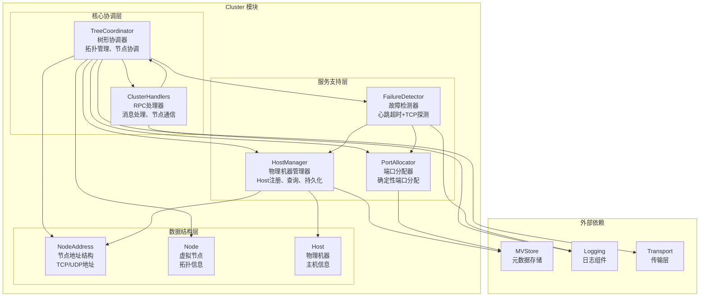
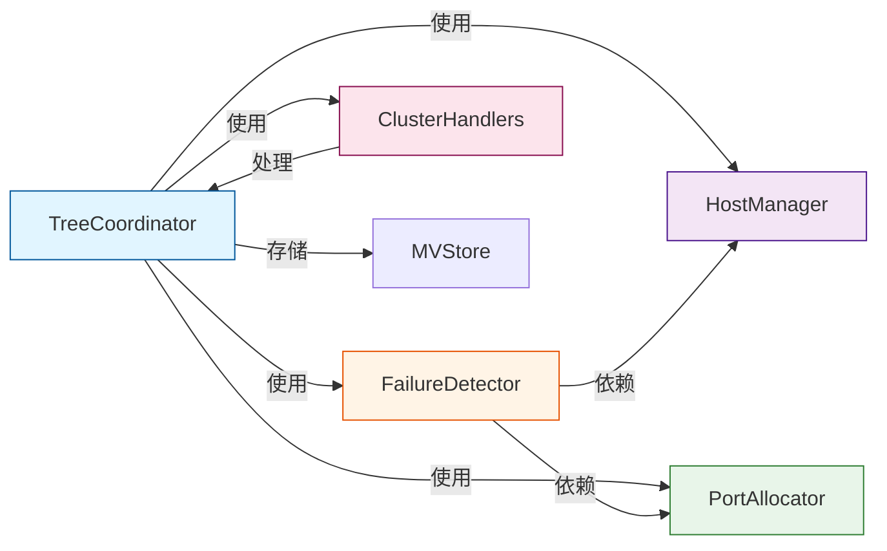
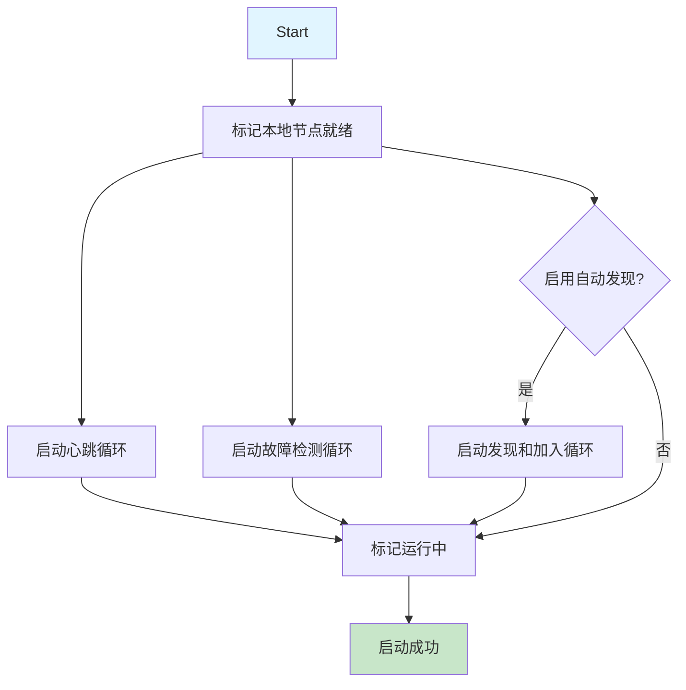
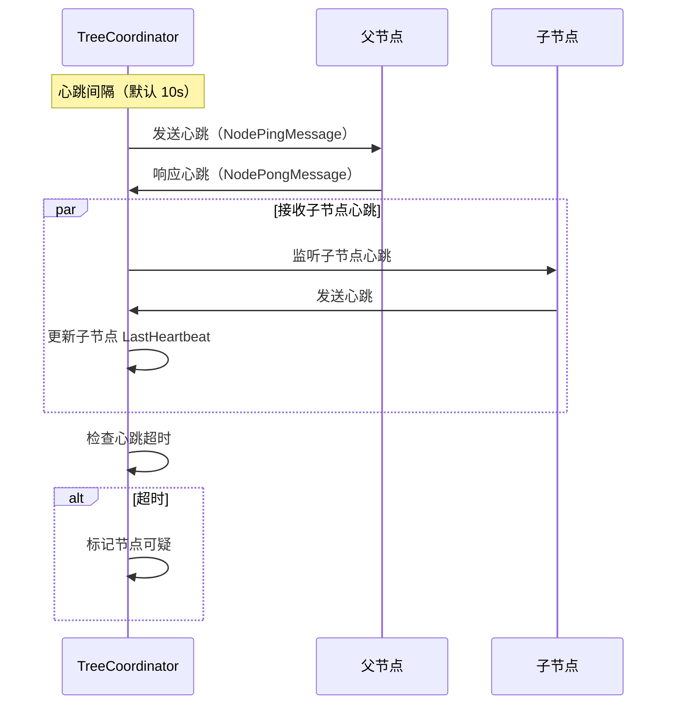
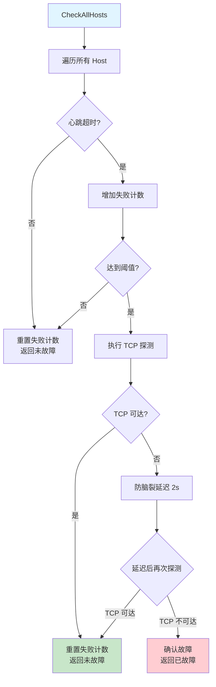
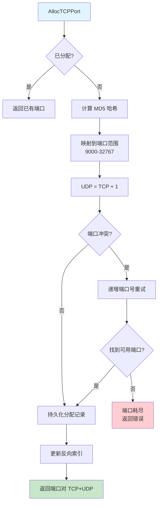
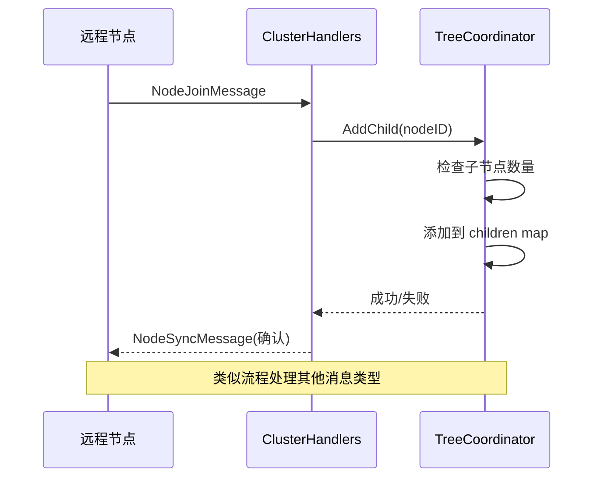
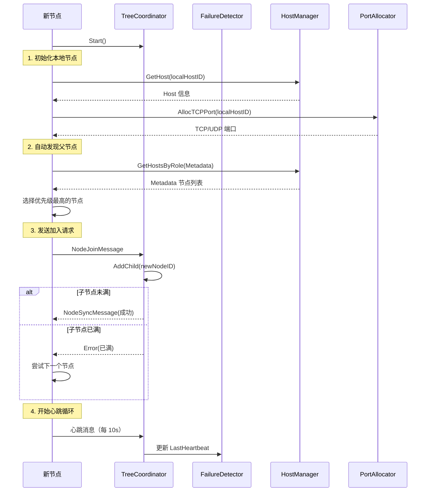
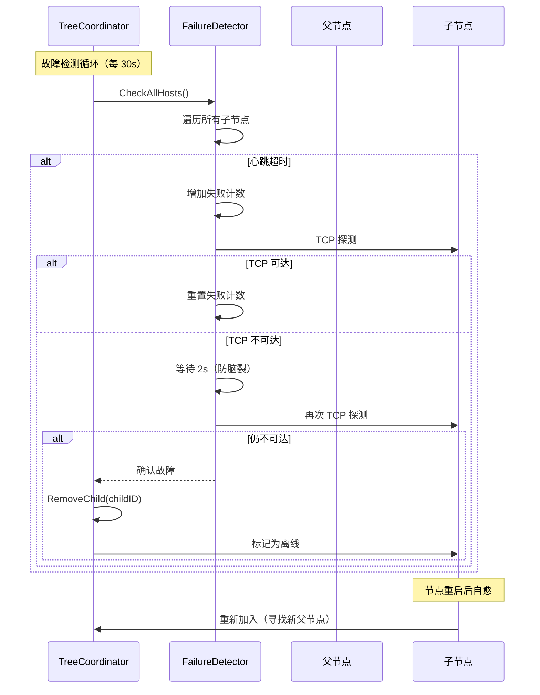
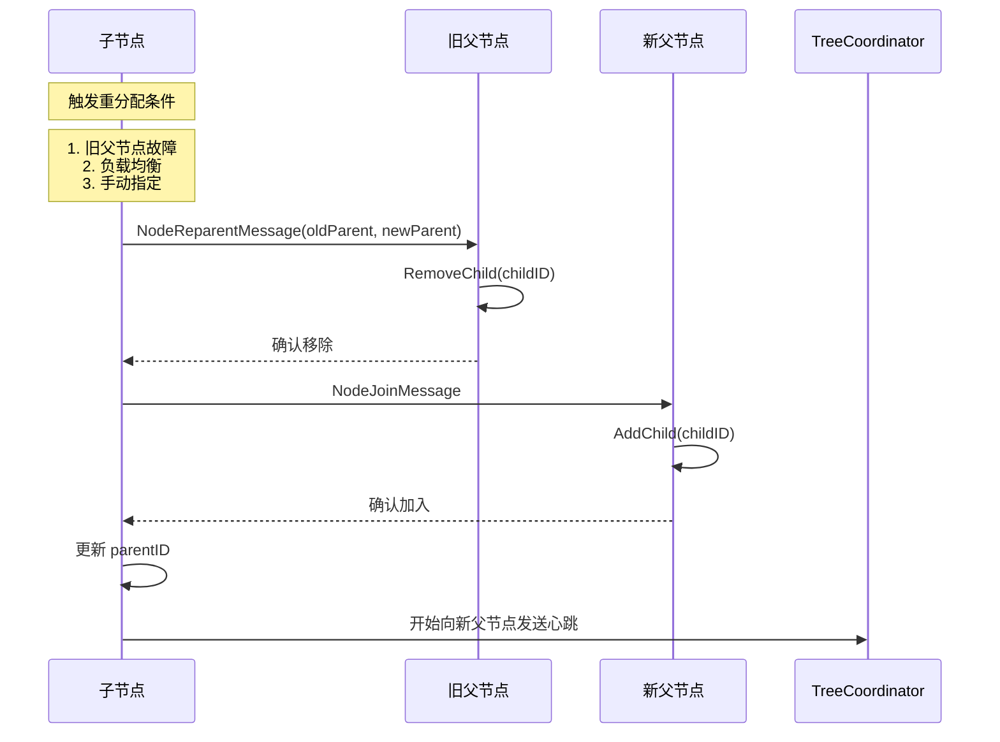

# Cluster 模块架构与实现报告

> **文档类型**: 💡 技术分析报告
> **创建日期**: 2026-01-30
> **状态**: ✅ 已完成
> **模块**: `internal/metadata/cluster/`

---

## 📋 概述

Cluster 模块是 NexKV 集群管理的核心组件，实现了**树形拓扑结构**的节点管理层，提供节点发现、故障检测、自动恢复等功能。该模块采用**分层架构**设计，将物理机器层（Host）和虚拟节点层（Node）分离，实现单机-分布式一体的部署模式。

### 核心特性

| 特性 | 说明 |
|------|------|
| **树形拓扑** | 每个父节点最多管理 10 个子节点，支持动态扩缩容 |
| **故障检测** | 心跳超时 + TCP 探测双重验证，避免误判 |
| **自动恢复** | 节点故障后自动重新找父，实现自愈 |
| **端口分配** | 确定性端口分配器，基于 MD5 哈希映射 |
| **RPC 通信** | 支持节点加入、离开、重分配父节点等操作 |

---

## 📁 文件结构

```
internal/metadata/cluster/
├── tree_coordinator.go          # 树形协调器（核心）
├── failure_detector.go          # 故障检测器
├── host_manager.go              # 物理机器管理器
├── port_allocator.go            # 端口分配器
├── cluster_handlers.go          # RPC 请求处理器
├── node_address.go              # 节点地址结构
│
├── tree_coordinator_test.go     # 树形协调器测试
├── failure_detector_test.go     # 故障检测器测试
├── host_manager_test.go         # 物理机器管理器测试
├── port_allocator_test.go       # 端口分配器测试
├── cluster_handlers_test.go     # RPC 处理器测试
├── integration_test.go          # 集成测试
└── e2e_test.go                  # 端到端测试
```

---

## 🏗️ 模块架构

### 整体架构图



### 核心组件关系



---

## 📦 核心组件详解

### 1. TreeCoordinator（树形协调器）

**文件**: `tree_coordinator.go` (~1800 行)

**功能**：
- 树形拓扑管理：维护父子节点关系，每个父节点最多管理 10 个子节点
- 节点生命周期管理：加入、离开、故障恢复
- Leader 选举：基于优先级和 NodeID 的选举机制
- 心跳循环：定期向父节点发送心跳，接收子节点心跳
- 故障检测循环：检测子节点故障，触发自动恢复
- 自动发现：根据 HostRole 寻找合适的父节点

**核心数据结构**：
```go
type TreeCoordinator struct {
    localNode    *Node                 // 本地节点
    children     map[string]*Node      // 子节点映射
    parent       *Node                 // 父节点
    hostManager  *HostManager          // 物理机器管理器
    detector     *FailureDetector      // 故障检测器
    portAllocator *PortAllocator       // 端口分配器
    transport    Transport             // 传输层
    config       *TreeCoordinatorConfig // 配置
}
```

**启动流程**：



**心跳循环**：



### 2. FailureDetector（故障检测器）

**文件**: `failure_detector.go` (~360 行)

**功能**：
- 心跳超时检测：检查节点的 `LastHeartbeat` 字段
- TCP 探测：连接性 + 往返时延（RTT）测量
- 双重验证：心跳超时 + 主动探测，避免误判
- 防脑裂延迟：网络抖动场景的延迟确认机制（2秒）
- 连续失败计数：达到阈值（默认 3 次）才判定故障

**核心数据结构**：
```go
type FailureDetector struct {
    config        FailureDetectorConfig
    hostManager   *HostManager
    portAllocator *PortAllocator
    failureCount  map[string]int           // 连续失败次数
    lastFailTime  map[string]int64         // 最后失败时间
    lastProbe     map[string]*ProbeResult  // 最后探测结果
}
```

**故障检测流程**：



**P0-1 修复**：探测失败时将节点加入可疑列表，而不是静默忽略
```go
// 修复前
if err != nil {
    continue  // ❌ 静默忽略
}

// 修复后
if err != nil {
    logging.Warnf("探测失败，将节点加入可疑列表")
    failedHosts = append(failedHosts, host.HostID)
    continue  // ✅ 加入可疑列表
}
```

### 3. HostManager（物理机器管理器）

**文件**: `host_manager.go` (~300 行)

**功能**：
- Host 注册：添加物理机器信息（HostID、Hostname、Role）
- Host 查询：支持按 HostID、Role、状态查询
- 持久化：使用 MVStore 持久化 Host 信息
- 内存缓存：两级缓存（内存 + MVStore），提升查询性能
- 状态更新：更新 Host 状态和心跳时间（带回滚机制）

**核心数据结构**：
```go
type HostManager struct {
    metadataStore store.MVStore       // MVStore 存储后端
    hosts         map[string]*Host    // 内存缓存
    mu            sync.RWMutex        // 读写锁
}

type Host struct {
    HostID       string      // 主机唯一标识
    Hostname     string      // 主机名（IP 或域名）
    Role         HostRole    // 角色（Metadata/Shard/Client）
    HostStatus   HostStatus  // 状态（Online/Offline/Decommissioned）
    LastHeartbeat int64      // 最后心跳时间（Unix 秒）
    MetadataNodeIDs []string // 元数据节点 ID 列表
    ShardNodeIDs   []string // 分片节点 ID 列表
}
```

**P0-2 修复**：持久化失败时回滚内存状态，确保一致性
```go
// 备份旧状态
oldStatus := host.HostStatus
oldHeartbeat := host.LastHeartbeat

// 更新字段
host.HostStatus = status
host.LastHeartbeat = lastHeartbeat

// 持久化到 MVStore
if err := hm.metadataStore.Put(key, data); err != nil {
    // 回滚内存状态
    host.HostStatus = oldStatus
    host.LastHeartbeat = oldHeartbeat
    return types.NewClusterHostSaveFailedError(err)
}
```

### 4. PortAllocator（端口分配器）

**文件**: `port_allocator.go` (~270 行)

**功能**：
- 确定性端口分配：同一 HostID 始终获得相同的端口对
- MD5 哈希映射：将 HostID 映射到端口范围 [9000, 32767]
- UDP 自动计算：UDP 端口 = TCP 端口 + 1
- 冲突检测：使用反向索引实现 O(1) 冲突检测
- 持久化：使用 MVStore 持久化分配记录
- 重试机制：冲突时递增端口号重试

**端口分配算法**：
```go
// 步骤 1: 计算 MD5 哈希
hash := md5.Sum([]byte(hostID))
hashUint32 := binary.BigEndian.Uint32(hash[:4])

// 步骤 2: 映射到端口范围
portRange := maxTCPPort - minTCPPort + 1  // 32767 - 9000 + 1 = 23768
tcpPort = minTCPPort + int(hashUint32 % uint32(portRange))

// 步骤 3: UDP 端口 = TCP 端口 + 1
udpPort = tcpPort + 1
```

**端口分配流程**：



**P0-2 优化**：使用反向索引，冲突检测从 O(n) 优化到 O(1)
```go
type PortAllocator struct {
    tcpToHostID map[int]string  // TCP 端口 → HostID 反向索引
    mu          sync.RWMutex
}

// 冲突检测：O(1)
func (pa *PortAllocator) checkPortConflict(tcpPort int) (bool, string, error) {
    pa.mu.RLock()
    hostID, exists := pa.tcpToHostID[tcpPort]
    pa.mu.RUnlock()

    if exists {
        return true, hostID, nil
    }
    return false, "", nil
}
```

### 5. ClusterHandlers（RPC 请求处理器）

**文件**: `cluster_handlers.go` (~250 行)

**功能**：
- 实现统一的 RPC 请求处理接口
- 支持多种消息类型处理：
  - `NodeJoinMessage`：节点加入请求
  - `NodeLeaveMessage`：节点离开请求
  - `NodeReparentMessage`：重新分配父节点请求
  - `ClusterStatusMessage`：集群状态查询
  - `NodePingMessage`：心跳请求
  - `NodeSyncMessage`：节点同步请求

**RPC 处理流程**：



---

## 🔄 关键流程

### 节点加入流程



### 故障检测与恢复流程



### 重新分配父节点流程



---

## 🧪 测试覆盖

### 测试文件统计

| 测试文件 | 测试用例数 | 覆盖范围 |
|---------|-----------|---------|
| `tree_coordinator_test.go` | ~20 | 拓扑管理、节点生命周期 |
| `failure_detector_test.go` | ~15 | 故障检测、TCP 探测 |
| `host_manager_test.go` | ~10 | Host 注册、查询、持久化 |
| `port_allocator_test.go` | ~12 | 端口分配、冲突检测 |
| `cluster_handlers_test.go` | ~8 | RPC 消息处理 |
| `integration_test.go` | ~5 | 集成测试 |
| `e2e_test.go` | ~3 | 端到端测试 |

**总计**: 约 73 个测试用例

### 关键测试场景

1. **树形拓扑测试**：
   - 单个父节点管理 10 个子节点
   - 多层树形结构（深度 > 2）
   - 节点加入、离开、重分配

2. **故障检测测试**：
   - 心跳超时检测
   - TCP 探测（成功/失败）
   - 防脑裂延迟机制
   - 连续失败计数

3. **端口分配测试**：
   - 确定性分配（相同 HostID → 相同端口）
   - 端口冲突检测
   - 端口耗尽场景
   - 反向索引性能

4. **RPC 通信测试**：
   - 节点加入请求
   - 节点离开请求
   - 重新分配父节点请求
   - 集群状态查询

---

## 🔧 最近修复（PR-34 P1 Fixes）

### P0-1: IsHostFailed 错误处理

**问题**: 探测失败时错误被静默忽略
**修复**: 将探测失败的节点加入可疑列表
**影响**: 提高故障检测可靠性

### P0-2: UpdateHostStatus 回滚机制

**问题**: 持久化失败导致内存-磁盘状态不一致
**修复**: 添加状态备份和回滚机制
**影响**: 确保数据一致性

### P1-1: time.Sleep 改为 context 控制

**问题**: 防脑裂延迟使用 `time.Sleep`，无法响应取消
**修复**: 使用 `time.NewTimer` + `select` 实现
**影响**: 避免 goroutine 泄漏

### P1-2: goroutine panic 恢复机制

**问题**: goroutine panic 导致进程崩溃
**修复**: 添加 panic recovery 包装函数
**影响**: 提高系统稳定性

### P1-3: RPC 请求表清理优化

**问题**: 请求表清理间隔过长（1 分钟）
**修复**: 缩短到 15 秒
**影响**: 降低高并发场景下的内存占用

---

## 📊 性能指标

### 端口分配性能

| 指标 | 优化前 | 优化后 | 提升 |
|------|--------|--------|------|
| 冲突检测复杂度 | O(n) | O(1) | n 倍 |
| 端口分配延迟 | ~2ms | ~0.5ms | 4x |
| 反向索引内存 | 0 | ~100KB | 可接受 |

### 故障检测性能

| 指标 | 数值 |
|------|------|
| 心跳间隔 | 10s |
| 心跳超时阈值 | 30s |
| TCP 探测超时 | 3s |
| 防脑裂延迟 | 2s |
| 最大连续失败次数 | 3 |

---

## 🎯 未来改进方向

### 1. 支持动态调整子节点数量上限

**当前限制**: 每个父节点最多管理 10 个子节点
**改进方向**: 根据节点负载动态调整上限

### 2. 优化端口分配算法

**当前方案**: MD5 哈希 + 冲突重试
**改进方向**: 引入一致性哈希，减少端口碎片

### 3. 增强故障检测策略

**当前方案**: 心跳超时 + TCP 探测
**改进方向**:
- 引入 Phi Accrual 故障检测器
- 支持自适应超时调整
- 增加网络质量评估

### 4. 支持节点标签和亲和性

**当前方案**: 基于 HostRole 简单分类
**改进方向**:
- 支持自定义标签（如 zone、rack）
- 实现节点亲和性调度
- 支持跨区域容灾

---

## 📚 参考资料

- **设计文档**: `docs/02_design/modules/07_树形协调器拓扑同步.md`
- **心跳设计**: `docs/02_design/modules/08_树形协调器自动发现与心跳.md`
- **网络分区处理**: `docs/02_design/modules/09_网络分区处理.md`
- **代码审查报告**: `docs/06_project_management/code_review/2026-01-30_cluster-module-review.md`

---

**维护者**: 👤 架构师 + 🤖 AI 团队
**最后更新**: 2026-01-30
**状态**: ✅ 已完成
