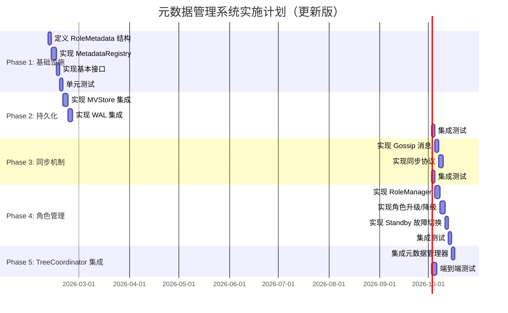

# 元数据管理设计讨论决策

> **文档类型**: 📝 讨论决策记录
> **创建日期**: 2026-02-09
> **状态**: ✅ 已决策
> **相关文档**:
> - `cluster_2026-02-09_tree-coordinator-metadata-management.md`

---

## 📊 决策摘要

基于对 TreeCoordinator 元数据管理方案的讨论，形成以下核心决策。

---

## 🎯 决策记录

### 决策 1：元数据分类体系

**问题**：文档中提出 5 类元数据，是否合理？

**决策**：确定为 **6 类元数据**，新增 RoleMetadata 作为独立分类。

| 分类 | 说明 | 动态性 | 持久化频率 |
|------|------|--------|-----------|
| **StaticMetadata** | 节点ID、地址、版本、硬件信息 | 静态 | 启动时一次 |
| **RoleMetadata** | 角色、端口、Standby、转换历史 | 准静态 | 变更时 |
| **DynamicMetadata** | 状态、心跳、CPU/内存、网络流量 | 高频 | 定期（5分钟TTL） |
| **TopologyMetadata** | 父子关系、层级、路径 | 中频 | 变更时 |
| **ShardMetadata** | 分片分配、副本、迁移 | 中频 | 变更时 |
| **OperationMetadata** | 标签、位置、优先级 | 低频 | 变更时 |

**理由**：
- Role 有特殊的动态属性（Leaf 静态，Parent 动态）
- Role 变更需要级联更新其他元数据
- Role 变动少但重要，需要专门管理

---

### 决策 2：Role 的动态属性

**问题**：Role（NodeRole/HostRole）是静态还是动态？

**决策**：
- **NodeRole**：Leaf 静态，Parent/ParentStandby 动态
- **HostRole**：全部动态（LeafOnly, LeafParent, LeafParentStandby）

**理由**：
- 叶子节点角色通常不变
- 父节点角色可以升级/降级
- 物理机器角色可以根据负载动态调整

---

### 决策 3：Standby 节点管理

**问题**：Standby 节点是否需要独立的 StandbyMetadata？

**决策**：**否**，合并入 RoleMetadata。

**理由**：
- Standby 与角色强相关（ParentStandby 角色）
- 简化元数据分类体系
- Standby 切换本质是角色转换

**实现**：
```go
type RoleMetadata struct {
    // ... 其他字段 ...

    // Standby 管理（合并）
    StandbyState        StandbyState      `msgpack:"standby_state"`
    PrimaryNodeID       string            `msgpack:"primary_node_id"`
    LastPrimaryHeartbeat time.Time        `msgpack:"last_primary_heartbeat"`
    MissedHeartbeats   int               `msgpack:"missed_heartbeats"`
    FailoverThreshold  int               `msgpack:"failover_threshold"`
    FailoverTimeout    time.Duration     `msgpack:"failover_timeout"`
    FailoverHistory    []*FailoverRecord `msgpack:"failover_history"`
}
```

---

### 决策 4：分组管理

**问题**：是否需要独立的 GroupMetadata？

**决策**：**否**，树形结构本身管理分组。

**理由**：
- 父节点 = 组中心
- 子节点列表 = 组成员
- TopologyMetadata.ChildrenIDs = 分组成员
- 避免额外的抽象层

**实现**：
```go
// 通过父节点判断是否在分组
func (tm *TopologyMetadata) IsInGroup(parentNodeID string) bool {
    return tm.ParentID == parentNodeID
}

// 获取同组成员（父节点的所有子节点）
func (tm *TopologyMetadata) GetGroupMembers(tc *TreeCoordinator) []string {
    if tm.ParentID == "" {
        return []string{tm.NodeID}
    }
    parentMeta := tc.GetTopologyMetadata(tm.ParentID)
    return parentMeta.ChildrenIDs
}
```

---

### 决策 5：转换历史保留策略

**问题**：角色转换历史保留多少条？

**决策**：**100 条**，通过配置可调。

**理由**：
- 足够追溯最近的变更
- 不会无限增长占用存储
- 可根据实际需求调整

**实现**：
```go
type RoleMetadataConfig struct {
    MaxTransitionHistory int `yaml:"max_transition_history"` // 默认 100
}

func (rm *RoleMetadata) AddTransition(transition *RoleTransition) {
    rm.TransitionHistory = append(rm.TransitionHistory, transition)

    if len(rm.TransitionHistory) > rm.MaxHistorySize {
        // 保留最近的 N 条
        rm.TransitionHistory = rm.TransitionHistory[len(rm.TransitionHistory)-rm.MaxHistorySize:]
    }
}
```

---

## 🔗 级联更新机制

**决策**：Role 变更需要触发其他元数据变更。

```
Leaf → Parent:
  ├─ RoleMetadata.Role           : Leaf → Parent
  ├─ RoleMetadata.ParentNodePort   : 分配新端口
  ├─ TopologyMetadata.ChildrenIDs  : 预留空间
  └─ NetworkMetadata              : 更新端口映射

Parent → Leaf:
  ├─ RoleMetadata.Role           : Parent → Leaf
  ├─ RoleMetadata.ParentNodePort   : 释放端口
  ├─ TopologyMetadata.ChildrenIDs  : 迁移子节点
  └─ NetworkMetadata              : 更新端口映射
```

---

## 📐 RoleMetadata 最终设计

```go
// RoleMetadata 角色元数据（包含 Standby）
type RoleMetadata struct {
    // ===== 当前角色 =====
    CurrentHostRole     HostRole   `msgpack:"host_role"`
    CurrentNodeRole     NodeRole   `msgpack:"node_role"`

    // ===== 角色状态 =====
    RoleState           RoleState  `msgpack:"role_state"`
    LastStateChange     time.Time  `msgpack:"last_state_change"`

    // ===== 配置参数 =====
    MaxChildren         int        `msgpack:"max_children"`
    MaxLevel            int        `msgpack:"max_level"`

    // ===== 端口分配 =====
    LeafNodeTCPPort     int        `msgpack:"leaf_tcp_port"`
    ParentNodeTCPPort   int        `msgpack:"parent_tcp_port"`
    StandbyNodeTCPPort  int        `msgpack:"standby_tcp_port"`

    // ===== Standby 管理 =====
    StandbyState        StandbyState      `msgpack:"standby_state"`
    PrimaryNodeID       string            `msgpack:"primary_node_id"`
    LastPrimaryHeartbeat time.Time        `msgpack:"last_primary_heartbeat"`
    MissedHeartbeats   int               `msgpack:"missed_heartbeats"`
    FailoverThreshold  int               `msgpack:"failover_threshold"`
    FailoverTimeout    time.Duration     `msgpack:"failover_timeout"`
    FailoverHistory    []*FailoverRecord `msgpack:"failover_history"`

    // ===== 转换历史 =====
    TransitionHistory   []*RoleTransition `msgpack:"transition_history"`
    MaxHistorySize      int               `msgpack:"max_history_size"`

    // ===== 版本控制 =====
    Version             MetadataVersion   `msgpack:"version"`
}

type RoleState int
const (
    RoleStateStable     RoleState = iota // 稳定状态
    RoleStatePromoting                      // 升级中
    RoleStateDemoting                       // 降级中
    RoleStateStandbyActivating             // 激活 Standby 中
)
```

---

## 📝 后续行动

### 行动 1：更新设计文档

需要更新 `cluster_2026-02-09_tree-coordinator-metadata-management.md`：

| 章节 | 更新内容 |
|------|----------|
| 1.2 元数据类型定义 | 添加 RoleMetadata，删除 GroupMetadata |
| 1.3 结构化元数据定义 | 添加 RoleMetadata 完整定义 |
| 2. 内存结构设计 | 更新 MetadataRegistry 支持 RoleMetadata |
| 3. 元数据接口设计 | 添加 GetRole/SetRole 接口 |
| 6. 分片相关元数据 | 删除 GroupMetadata 相关内容 |
| 7. 完整代码实现 | 添加 RoleManager 实现 |

### 行动 2：创建实施计划



---

## 🔖 相关文档

- `cluster_2026-02-09_tree-coordinator-metadata-management.md` - 完整设计方案
- `cluster_2026-01-29_tree-coordinator-complete-reference.md` - TreeCoordinator 参考文档

---

**文档版本**: v1.0
**创建日期**: 2026-02-09
**维护者**: NexKV 开发团队
**状态**: ✅ 已决策
