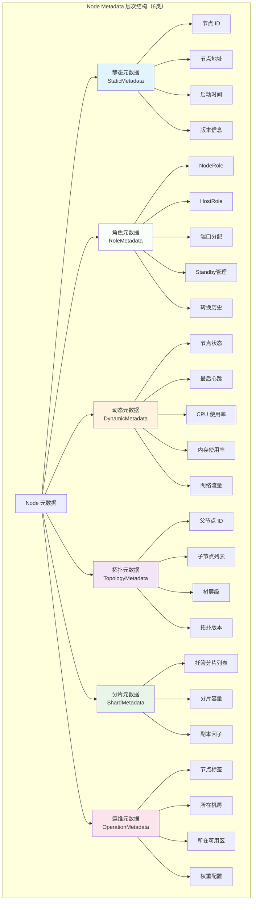
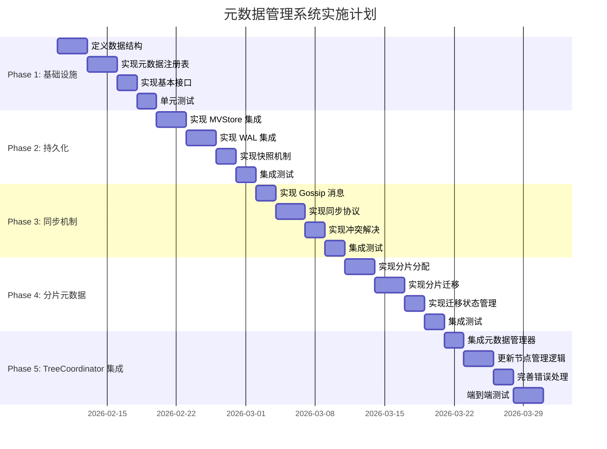

# TreeCoordinator 元数据管理全面研究

> **⚠️ 文档状态**: 已废弃 - 被 KV Mapping 方案替代
> **替代文档**: [`cluster_2026-02-09_tree-coordinator-metadata-kv-mapping.md`](./cluster_2026-02-09_tree-coordinator-metadata-kv-mapping.md)
> **废弃原因**: 原方案（复杂接口体系）已被简化方案（KV Mapping）替代
> **废弃日期**: 2026-02-09

---

> **文档类型**: 📚 技术研究与设计方案
> **创建日期**: 2026-02-09
> **最后更新**: 2026-02-09
> **状态**: ⚠️ 已废弃
> **优先级**: P0 (高)
> **相关文档**:
> - `cluster_2026-02-09_tree-coordinator-metadata-kv-mapping.md` - **新方案（请阅读）**
> - `cluster_2026-02-09_metadata-design-decisions.md` - 架构讨论决策

---

## 📊 执行摘要

**研究目标**: 为 TreeCoordinator 设计一套完整的元数据管理系统，涵盖内存结构、持久化、同步机制等所有方面。

**核心问题**:
1. 当前 `Node.Metadata` 仅为 `map[string]string`，缺乏结构化定义
2. 元数据变更未同步到其他节点
3. 元数据未持久化，重启后丢失
4. 缺少元数据版本控制和冲突解决机制

**解决方案**:
- 定义结构化元数据类型系统
- 设计元数据持久化层（MVStore 集成）
- 实现元数据同步机制（Gossip 协议）
- 建立元数据版本控制（HLC + Version Vector）

---

## 📁 目录

1. [元数据分类体系](#1-元数据分类体系)
2. [内存结构设计](#2-内存结构设计)
3. [元数据接口设计](#3-元数据接口设计)
4. [持久化方案](#4-持久化方案)
5. [同步机制](#5-同步机制)
6. [分片相关元数据](#6-分片相关元数据)
7. [完整代码实现](#7-完整代码实现)
8. [测试计划](#8-测试计划)
9. [实施路线图](#9-实施路线图)

---

## 1. 元数据分类体系

### 1.1 元数据层次结构



### 1.2 元数据类型定义

```go
// internal/metadata/cluster/node_metadata.go

package cluster

import (
    "time"
)

// MetadataType 元数据类型
type MetadataType string

const (
    MetadataTypeStatic    MetadataType = "static"    // 静态元数据（启动后不变）
    MetadataTypeRole      MetadataType = "role"      // 角色元数据（准静态，包含Standby）
    MetadataTypeDynamic   MetadataType = "dynamic"   // 动态元数据（频繁变化）
    MetadataTypeTopology  MetadataType = "topology"  // 拓扑元数据（父子关系）
    MetadataTypeShard     MetadataType = "shard"     // 分片元数据（分片分布）
    MetadataTypeOperation MetadataType = "operation" // 运维元数据（配置标签）
)

// MetadataScope 元数据作用域
type MetadataScope string

const (
    ScopeLocal  MetadataScope = "local"  // 本地元数据（不同步）
    ScopeCluster MetadataScope = "cluster" // 集群元数据（需要同步）
    ScopeGlobal MetadataScope = "global"  // 全局元数据（跨集群同步）
)

// MetadataChangeType 元数据变更类型
type MetadataChangeType string

const (
    MetadataChangeAdd    MetadataChangeType = "add"    // 添加元数据
    MetadataChangeUpdate MetadataChangeType = "update" // 更新元数据
    MetadataChangeDelete MetadataChangeType = "delete" // 删除元数据
)

// MetadataChangeAction 元数据变更动作
type MetadataChangeAction int

const (
    MetadataActionSet MetadataChangeAction = iota // 设置
    MetadataActionDelete                           // 删除
    MetadataActionMerge                            // 合并（用于复杂类型）
)

// MetadataVersion 元数据版本
type MetadataVersion struct {
    // HLC 时间戳
    Timestamp uint64

    // 版本向量（用于冲突检测）
    VersionVector map[string]uint64 // nodeID -> version

    // 变更类型
    ChangeType MetadataChangeType

    // 变更节点 ID
    NodeID string
}

// CompareTo 比较版本
func (v *MetadataVersion) CompareTo(other *MetadataVersion) int {
    if v.Timestamp > other.Timestamp {
        return 1
    } else if v.Timestamp < other.Timestamp {
        return -1
    }
    return 0
}
```

### 1.3 结构化元数据定义

> **📝 2026-02-09 更新**: 新增 RoleMetadata 作为独立分类，包含 Standby 节点管理。

```go
// StaticMetadata 静态元数据（启动后不变）
type StaticMetadata struct {
    // 节点基本信息
    NodeID       string    `msgpack:"node_id"`
    Addr         string    `msgpack:"addr"`
    Hostname     string    `msgpack:"hostname"`
    StartupTime  time.Time `msgpack:"startup_time"`

    // 版本信息
    Version      string    `msgpack:"version"`
    GitCommit    string    `msgpack:"git_commit"`
    BuildTime    time.Time `msgpack:"build_time"`

    // 配置信息
    MaxChildren  int       `msgpack:"max_children"`
    MaxLevel     int       `msgpack:"max_level"`

    // 硬件信息
    CPUCount     int       `msgpack:"cpu_count"`
    MemoryBytes  int64     `msgpack:"memory_bytes"`
    DiskBytes    int64     `msgpack:"disk_bytes"`
}

// RoleMetadata 角色元数据（准静态，包含 Standby 管理）
//
// **设计决策** (2026-02-09):
// - RoleMetadata 作为独立分类，包含角色、端口、Standby、转换历史
// - NodeRole: Leaf 静态, Parent/ParentStandby 动态
// - HostRole: 全部动态 (LeafOnly, LeafParent, LeafParentStandby)
// - Standby 合并入 RoleMetadata，无需独立的 StandbyMetadata
// - 转换历史保留 100 条（可配置）
//
// **动态属性**:
// - Role 变动少但重要，需要专门的版本控制和级联更新机制
// - Role 变更会触发 TopologyMetadata 和端口分配的更新
type RoleMetadata struct {
    // ===== 当前角色 =====
    CurrentHostRole  HostRole  `msgpack:"host_role"`  // 物理机器角色
    CurrentNodeRole  NodeRole  `msgpack:"node_role"`  // 逻辑节点角色

    // ===== 角色状态 =====
    RoleState        RoleState `msgpack:"role_state"`       // 角色状态
    LastStateChange  time.Time `msgpack:"last_state_change"` // 最后状态变更时间

    // ===== 配置参数 =====
    MaxChildren      int       `msgpack:"max_children"` // 最大子节点数
    MaxLevel         int       `msgpack:"max_level"`    // 最大层级

    // ===== 端口分配 =====
    LeafNodeTCPPort      int        `msgpack:"leaf_tcp_port"`      // 叶子节点 TCP 端口（静态）
    ParentNodeTCPPort    int        `msgpack:"parent_tcp_port"`    // 父节点 TCP 端口（动态，0表示无）
    StandbyNodeTCPPort   int        `msgpack:"standby_tcp_port"`   // Standby 节点 TCP 端口（动态，0表示无）

    // ===== Standby 管理（合并入 RoleMetadata）=====
    StandbyState         StandbyState      `msgpack:"standby_state"`           // Standby 状态
    PrimaryNodeID        string            `msgpack:"primary_node_id"`         // 主节点 ID
    LastPrimaryHeartbeat time.Time         `msgpack:"last_primary_heartbeat"`  // 最后主节点心跳
    MissedHeartbeats     int               `msgpack:"missed_heartbeats"`       // 心跳丢失次数
    FailoverThreshold    int               `msgpack:"failover_threshold"`     // 心跳丢失阈值（默认 3）
    FailoverTimeout      time.Duration     `msgpack:"failover_timeout"`       // 故障切换超时（默认 15s）
    FailoverHistory      []*FailoverRecord `msgpack:"failover_history"`      // 故障切换历史（最近 100 条）

    // ===== 转换历史（可配置，默认 100 条）=====
    TransitionHistory    []*RoleTransition `msgpack:"transition_history"`    // 角色转换历史
    MaxHistorySize       int               `msgpack:"max_history_size"`      // 最大历史记录数（配置项）

    // ===== 版本控制 =====
    Version              MetadataVersion   `msgpack:"version"`                // 元数据版本
}

// RoleState 角色状态
type RoleState int

const (
    RoleStateStable       RoleState = iota // 稳定状态
    RoleStatePromoting                      // 升级中（Leaf → Parent）
    RoleStateDemoting                       // 降级中（Parent → Leaf）
    RoleStateStandbyActivating             // 激活 Standby 中
)

// String 返回 RoleState 的字符串表示
func (s RoleState) String() string {
    switch s {
    case RoleStateStable:
        return "Stable"
    case RoleStatePromoting:
        return "Promoting"
    case RoleStateDemoting:
        return "Demoting"
    case RoleStateStandbyActivating:
        return "StandbyActivating"
    default:
        return "Unknown"
    }
}

// StandbyState Standby 节点状态
type StandbyState int

const (
    StandbyStateActive     StandbyState = iota // 活跃（正常监控）
    StandbyStatePromoting                       // 升级中（接管中）
    StandbyStatePromoted                        // 已接管
    StandbyStateDemoting                        // 降级中
)

// String 返回 StandbyState 的字符串表示
func (s StandbyState) String() string {
    switch s {
    case StandbyStateActive:
        return "Active"
    case StandbyStatePromoting:
        return "Promoting"
    case StandbyStatePromoted:
        return "Promoted"
    case StandbyStateDemoting:
        return "Demoting"
    default:
        return "Unknown"
    }
}

// RoleTransition 角色转换记录
type RoleTransition struct {
    TransitionID   string    `msgpack:"transition_id"`   // 转换 ID（UUID）
    HostID         string    `msgpack:"host_id"`        // Host ID
    OldRole        HostRole  `msgpack:"old_role"`       // 旧 Host 角色
    NewRole        HostRole  `msgpack:"new_role"`       // 新 Host 角色
    OldNodeRole    NodeRole  `msgpack:"old_node_role"` // 旧 Node 角色
    NewNodeRole    NodeRole  `msgpack:"new_node_role"` // 新 Node 角色
    Timestamp      time.Time `msgpack:"timestamp"`      // 转换时间
    Reason         string    `msgpack:"reason"`         // 转换原因
    Initiator      string    `msgpack:"initiator"`      // 发起者（local | remote）
    Success        bool      `msgpack:"success"`        // 是否成功
}

// String 返回角色转换的字符串表示
func (rt *RoleTransition) String() string {
    return rt.OldRole.String() + " -> " + rt.NewRole.String()
}

// FailoverRecord 故障切换记录
type FailoverRecord struct {
    Timestamp   time.Time     `msgpack:"timestamp"`    // 切换时间
    FromNodeID  string        `msgpack:"from_node_id"` // 源节点 ID
    ToNodeID    string        `msgpack:"to_node_id"`   // 目标节点 ID
    Reason      string        `msgpack:"reason"`       // 切换原因
    Success     bool          `msgpack:"success"`      // 是否成功
    Duration    time.Duration `msgpack:"duration"`     // 切换耗时
    TriggeredBy string        `msgpack:"triggered_by"` // 触发者
}

// AddTransition 添加转换记录（自动清理超过限制的历史）
func (rm *RoleMetadata) AddTransition(transition *RoleTransition) {
    rm.TransitionHistory = append(rm.TransitionHistory, transition)

    // 清理超过限制的历史记录
    if len(rm.TransitionHistory) > rm.MaxHistorySize {
        rm.TransitionHistory = rm.TransitionHistory[len(rm.TransitionHistory)-rm.MaxHistorySize:]
    }
}

// DynamicMetadata 动态元数据（频繁变化）
type DynamicMetadata struct {
    // 节点状态
    Status       NodeStatus `msgpack:"status"`
    LastHeartbeat time.Time `msgpack:"last_heartbeat"`

    // 资源使用率（0-100）
    CPUUsage     float64    `msgpack:"cpu_usage"`      // CPU 使用率
    MemoryUsage  float64    `msgpack:"memory_usage"`   // 内存使用率
    DiskUsage    float64    `msgpack:"disk_usage"`     // 磁盘使用率
    NetworkIn    int64      `msgpack:"network_in"`     // 网络入流量（bytes/s）
    NetworkOut   int64      `msgpack:"network_out"`    // 网络出流量（bytes/s）

    // 负载指标
    ActiveConnections int     `msgpack:"active_connections"`
    RequestCount       int64   `msgpack:"request_count"`
    RequestRate        float64 `msgpack:"request_rate"`    // 请求速率（req/s）
    AvgLatency         float64 `msgpack:"avg_latency"`     // 平均延迟（ms）

    // 健康指标
    HealthScore  float64   `msgpack:"health_score"`    // 健康分数（0-100）
    ErrorRate    float64   `msgpack:"error_rate"`      // 错误率（0-1）
}

// TopologyMetadata 拓扑元数据（父子关系、树形结构管理分组）
//
// **设计决策** (2026-02-09):
// - 不使用独立的 GroupMetadata，树形结构本身管理分组
// - 父节点 = 组中心，子节点列表 = 组成员
// - TopologyMetadata.ChildrenIDs = 分组成员
// - 通过父节点判断是否在某个分组
//
// **分组管理**:
// - 父节点存在 → 属于该父节点的"分组"
// - 父节点为空 → 根节点，独立分组
// - GetGroupMembers() 获取同组成员（父节点的所有子节点）
type TopologyMetadata struct {
    ParentID      string   `msgpack:"parent_id"`
    ChildrenIDs   []string `msgpack:"children_ids"`
    Level         int      `msgpack:"level"`
    Path          []string `msgpack:"path"`          // 从根节点到当前节点的路径
    SubtreeSize   int      `msgpack:"subtree_size"`   // 子树节点数
    TopologyVersion uint64 `msgpack:"topology_version"` // 拓扑版本号

    // ===== 一致性配置（分组内）=====
    ConsistencyMode ConsistencyMode `msgpack:"consistency_mode"` // 组内一致性模式
    QuorumThreshold int             `msgpack:"quorum_threshold"` // Quorum 阈值
}

// IsInGroup 判断是否在某个分组（通过父节点判断）
func (tm *TopologyMetadata) IsInGroup(parentNodeID string) bool {
    return tm.ParentID == parentNodeID
}

// GetGroupMembers 获取同一组的成员（通过父节点获取）
func (tm *TopologyMetadata) GetGroupMembers(tc *TreeCoordinator) []string {
    if tm.ParentID == "" {
        // 根节点，独立分组
        return []string{tm.NodeID}
    }

    // 获取父节点的所有子节点（同组成员）
    parentMeta := tc.GetTopologyMetadata(tm.ParentID)
    return parentMeta.ChildrenIDs
}

// ShardMetadata 分片元数据（分片分布）
type ShardMetadata struct {
    // 托管的分片
    ShardIDs      []string            `msgpack:"shard_ids"`

    // 分片详情
    ShardDetails  map[string]ShardInfo `msgpack:"shard_details"` // shard_id -> ShardInfo

    // 容量信息
    TotalCapacity int64               `msgpack:"total_capacity"` // 总容量（bytes）
    UsedCapacity  int64               `msgpack:"used_capacity"`  // 已用容量（bytes）

    // 副本信息
    ReplicationFactor int             `msgpack:"replication_factor"`
    IsPrimary         bool            `msgpack:"is_primary"`
}

// ShardInfo 分片详细信息
type ShardInfo struct {
    ShardID       string    `msgpack:"shard_id"`
    TableID       string    `msgpack:"table_id"`
    IsPrimary     bool      `msgpack:"is_primary"`
    ReplicaCount  int       `msgpack:"replica_count"`
    ReplicaList   []string  `msgpack:"replica_list"` // 副本节点列表
    DataSize      int64     `msgpack:"data_size"`
    KeyCount      int64     `msgpack:"key_count"`
    LastSyncTime  time.Time `msgpack:"last_sync_time"`
}

// OperationMetadata 运维元数据（配置标签）
type OperationMetadata struct {
    // 节点标签
    Labels        map[string]string `msgpack:"labels"`

    // 位置信息
    Datacenter    string            `msgpack:"datacenter"`
    Rack          string            `msgpack:"rack"`
    Zone          string            `msgpack:"zone"`
    Host          string            `msgpack:"host"`

    // 负载均衡配置
    Weight        int               `msgpack:"weight"`        // 节点权重（用于负载均衡）
    Priority      int               `msgpack:"priority"`      // 节点优先级

    // 功能开关
    EnabledFeatures []string        `msgpack:"enabled_features"` // 启用的功能列表

    // 自定义属性
    CustomProperties map[string]string `msgpack:"custom_properties"`
}
```

---

## 2. 内存结构设计

### 2.1 统一元数据容器

```go
// NodeMetadata 统一的节点元数据容器
type NodeMetadata struct {
    // 元数据类型
    Type  MetadataType `msgpack:"type"`
    Scope MetadataScope `msgpack:"scope"`

    // 版本控制
    Version MetadataVersion `msgpack:"version"`

    // 实际数据（使用接口支持多种类型）
    Data interface{} `msgpack:"-"`

    // 序列化后的数据
    SerializedData []byte `msgpack:"data"`

    // 过期时间（TTL）
    ExpiresAt time.Time `msgpack:"expires_at,omitempty"`
}

// MetadataKey 元数据键
type MetadataKey struct {
    Type  MetadataType
    Key   string
    NodeID string
}

// String 返回字符串表示
func (k MetadataKey) String() string {
    return fmt.Sprintf("%s:%s:%s", k.Type, k.NodeID, k.Key)
}

// MetadataRegistry 元数据注册表（TreeCoordinator 内部）
type MetadataRegistry struct {
    // 元数据存储
    metadata map[MetadataKey]*NodeMetadata

    // 元数据索引（按类型、按作用域）
    byType  map[MetadataType][]*NodeMetadata
    byScope map[MetadataScope][]*NodeMetadata

    // 变更通知
    subscribers map[MetadataKey][]chan MetadataChange

    // 读写锁
    mu sync.RWMutex

    // 统计信息
    stats MetadataRegistryStats
}

// MetadataRegistryStats 统计信息
type MetadataRegistryStats struct {
    TotalMetadata   atomic.Int64
    StaticMetadata  atomic.Int64
    DynamicMetadata atomic.Int64
    TopologyMetadata atomic.Int64
    ShardMetadata   atomic.Int64
    OperationMetadata atomic.Int64

    ChangesCount atomic.Int64
    LastChange   atomic.Value // time.Time
}
```

### 2.2 元数据变更通知

```go
// MetadataChange 元数据变更
type MetadataChange struct {
    // 变更类型
    Action MetadataChangeAction

    // 元数据键
    Key MetadataKey

    // 旧值
    OldValue interface{}

    // 新值
    NewValue interface{}

    // 变更时间
    Timestamp time.Time

    // 变更来源
    Source string // local | remote | gossip

    // 版本
    Version MetadataVersion
}

// MetadataSubscriber 元数据订阅者
type MetadataSubscriber interface {
    // OnMetadataChange 元数据变更回调
    OnMetadataChange(change MetadataChange) error

    // Filter 判断是否订阅该元数据
    Filter(key MetadataKey) bool
}

// Subscribe 订阅元数据变更
func (r *MetadataRegistry) Subscribe(
    key MetadataKey,
    subscriber MetadataSubscriber,
) chan MetadataChange {
    ch := make(chan MetadataChange, 100)

    r.mu.Lock()
    defer r.mu.Unlock()

    if r.subscribers == nil {
        r.subscribers = make(map[MetadataKey][]chan MetadataChange)
    }

    r.subscribers[key] = append(r.subscribers[key], ch)

    return ch
}

// Publish 发布元数据变更
func (r *MetadataRegistry) Publish(change MetadataChange) {
    r.mu.Lock()
    subscribers := r.subscribers[change.Key]
    r.mu.Unlock()

    for _, ch := range subscribers {
        select {
        case ch <- change:
        default:
            // channel 满了，丢弃变更
            logging.WithField("key", change.Key.String()).
                Warn("元数据变更 channel 满了，丢弃变更")
        }
    }

    // 更新统计
    r.stats.ChangesCount.Add(1)
    r.stats.LastChange.Store(change.Timestamp)
}
```

---

## 3. 元数据接口设计

### 3.1 核心接口

```go
// MetadataManager 元数据管理器接口
type MetadataManager interface {
    // ===== 基本操作 =====

    // Set 设置元数据
    Set(key MetadataKey, metadata *NodeMetadata) error

    // Get 获取元数据
    Get(key MetadataKey) (*NodeMetadata, error)

    // Delete 删除元数据
    Delete(key MetadataKey) error

    // List 列出元数据
    List(filter MetadataFilter) ([]*NodeMetadata, error)

    // ===== 批量操作 =====

    // SetBatch 批量设置元数据
    SetBatch(items []MetadataItem) error

    // GetBatch 批量获取元数据
    GetBatch(keys []MetadataKey) (map[MetadataKey]*NodeMetadata, error)

    // ===== 类型特定操作 =====

    // SetStatic 设置静态元数据
    SetStatic(nodeID string, metadata *StaticMetadata) error

    // GetStatic 获取静态元数据
    GetStatic(nodeID string) (*StaticMetadata, error)

    // SetDynamic 设置动态元数据
    SetDynamic(nodeID string, metadata *DynamicMetadata) error

    // GetDynamic 获取动态元数据
    GetDynamic(nodeID string) (*DynamicMetadata, error)

    // SetTopology 设置拓扑元数据
    SetTopology(nodeID string, metadata *TopologyMetadata) error

    // GetTopology 获取拓扑元数据
    GetTopology(nodeID string) (*TopologyMetadata, error)

    // SetShard 设置分片元数据
    SetShard(nodeID string, metadata *ShardMetadata) error

    // GetShard 获取分片元数据
    GetShard(nodeID string) (*ShardMetadata, error)

    // SetOperation 设置运维元数据
    SetOperation(nodeID string, metadata *OperationMetadata) error

    // GetOperation 获取运维元数据
    GetOperation(nodeID string) (*OperationMetadata, error)

    // ===== 订阅与通知 =====

    // Subscribe 订阅元数据变更
    Subscribe(key MetadataKey, handler MetadataChangeHandler) error

    // Unsubscribe 取消订阅
    Unsubscribe(key MetadataKey, handler MetadataChangeHandler) error

    // ===== 版本控制 =====

    // GetVersion 获取元数据版本
    GetVersion(key MetadataKey) (*MetadataVersion, error)

    // UpdateVersion 更新元数据版本
    UpdateVersion(key MetadataKey, version MetadataVersion) error

    // ===== 持久化 =====

    // Persist 持久化元数据
    Persist() error

    // Load 加载元数据
    Load() error

    // ===== 同步 =====

    // Sync 同步元数据到其他节点
    Sync(metadata []*NodeMetadata) error

    // Merge 合并远程元数据
    Merge(remote *NodeMetadata) (bool, error)
}

// MetadataItem 元数据项
type MetadataItem struct {
    Key      MetadataKey
    Metadata *NodeMetadata
}

// MetadataFilter 元数据过滤器
type MetadataFilter struct {
    Types  []MetadataType
    Scopes []MetadataScope
    NodeIDs []string
    Prefix string // 键前缀
}

// Matches 判断是否匹配过滤器
func (f *MetadataFilter) Matches(key MetadataKey) bool {
    // 类型过滤
    if len(f.Types) > 0 {
        matched := false
        for _, t := range f.Types {
            if key.Type == t {
                matched = true
                break
            }
        }
        if !matched {
            return false
        }
    }

    // 作用域过滤
    if len(f.Scopes) > 0 {
        matched := false
        for _, s := range f.Scopes {
            if key.Scope == s {
                matched = true
                break
            }
        }
        if !matched {
            return false
        }
    }

    // 节点 ID 过滤
    if len(f.NodeIDs) > 0 {
        matched := false
        for _, nid := range f.NodeIDs {
            if key.NodeID == nid {
                matched = true
                break
            }
        }
        if !matched {
            return false
        }
    }

    // 前缀过滤
    if f.Prefix != "" && !strings.HasPrefix(key.Key, f.Prefix) {
        return false
    }

    return true
}

// MetadataChangeHandler 元数据变更处理器
type MetadataChangeHandler interface {
    Handle(change MetadataChange) error
}

// MetadataChangeHandlerFunc 元数据变更处理器函数
type MetadataChangeHandlerFunc func(change MetadataChange) error

// Handle 实现 MetadataChangeHandler
func (f MetadataChangeHandlerFunc) Handle(change MetadataChange) error {
    return f(change)
}
```

### 3.2 TreeCoordinator 集成

```go
// TreeCoordinator 扩展：添加元数据管理
type TreeCoordinator struct {
    // ... 原有字段 ...

    // 元数据管理器
    metadataManager MetadataManager

    // 元数据持久化器
    metadataStore MetadataStore

    // 元数据同步器
    metadataSync MetadataSync
}

// GetMetadata 获取节点元数据（便捷方法）
func (tc *TreeCoordinator) GetMetadata(
    nodeID string,
    metadataType MetadataType,
) (interface{}, error) {
    key := MetadataKey{
        Type:   metadataType,
        NodeID: nodeID,
    }

    metadata, err := tc.metadataManager.Get(key)
    if err != nil {
        return nil, err
    }

    return metadata.Data, nil
}

// SetMetadata 设置节点元数据（便捷方法）
func (tc *TreeCoordinator) SetMetadata(
    nodeID string,
    metadataType MetadataType,
    data interface{},
) error {
    // 序列化数据
    serialized, err := msgpack.Marshal(data)
    if err != nil {
        return fmt.Errorf("序列化元数据失败: %w", err)
    }

    key := MetadataKey{
        Type:   metadataType,
        NodeID: nodeID,
    }

    metadata := &NodeMetadata{
        Type:            metadataType,
        Scope:           ScopeCluster,
        SerializedData:  serialized,
        Data:            data,
        Version: MetadataVersion{
            Timestamp:     tc.hlc.Now().Value(),
            VersionVector: make(map[string]uint64),
            ChangeType:    MetadataChangeUpdate,
            NodeID:        nodeID,
        },
    }

    if err := tc.metadataManager.Set(key, metadata); err != nil {
        return fmt.Errorf("设置元数据失败: %w", err)
    }

    // 触发同步
    go tc.syncMetadataChange(metadata)

    return nil
}

// syncMetadataChange 同步元数据变更
func (tc *TreeCoordinator) syncMetadataChange(metadata *NodeMetadata) {
    // 通过 Gossip 协议扩散元数据变更
    if tc.gossipService != nil {
        msg := &MetadataSyncMessage{
            Type:            metadata.Type,
            NodeID:          metadata.Version.NodeID,
            SerializedData:  metadata.SerializedData,
            Version:         metadata.Version,
            SourceNodeID:    tc.localNode.NodeID,
        }

        if err := tc.gossipService.Publish(msg); err != nil {
            logging.WithError(err).Error("发布元数据同步失败")
        }
    }
}
```

---

## 4. 持久化方案

### 4.1 MVStore 集成

```go
// internal/metadata/cluster/metadata_store.go

package cluster

import (
    "context"
    "encoding/binary"
)

// MetadataStore 元数据持久化存储接口
type MetadataStore interface {
    // Save 保存元数据
    Save(ctx context.Context, key MetadataKey, metadata *NodeMetadata) error

    // Load 加载元数据
    Load(ctx context.Context, key MetadataKey) (*NodeMetadata, error)

    // Delete 删除元数据
    Delete(ctx context.Context, key MetadataKey) error

    // LoadAll 加载所有元数据
    LoadAll(ctx context.Context) (map[MetadataKey]*NodeMetadata, error)

    // Snapshot 创建快照
    Snapshot(ctx context.Context) ([]byte, error)

    // Restore 从快照恢复
    Restore(ctx context.Context, snapshot []byte) error
}

// MVStoreMetadataStore MVStore 元数据存储实现
type MVStoreMetadataStore struct {
    mvstore MVStore

    // 元数据表名
    staticTable    string // "node_static_metadata"
    dynamicTable   string // "node_dynamic_metadata"
    topologyTable  string // "node_topology_metadata"
    shardTable     string // "node_shard_metadata"
    operationTable string // "node_operation_metadata"
}

// NewMVStoreMetadataStore 创建 MVStore 元数据存储
func NewMVStoreMetadataStore(mvstore MVStore) *MVStoreMetadataStore {
    return &MVStoreMetadataStore{
        mvstore:        mvstore,
        staticTable:    "node_static_metadata",
        dynamicTable:   "node_dynamic_metadata",
        topologyTable:  "node_topology_metadata",
        shardTable:     "node_shard_metadata",
        operationTable: "node_operation_metadata",
    }
}

// Save 保存元数据
func (s *MVStoreMetadataStore) Save(
    ctx context.Context,
    key MetadataKey,
    metadata *NodeMetadata,
) error {
    // 选择表
    tableName := s.getTableByType(key.Type)

    // 构造存储键
    storeKey := s.buildStoreKey(key)

    // 构造存储值
    storeValue := &MetadataStoreValue{
        NodeID:         key.NodeID,
        Type:           key.Type,
        Scope:          key.Scope,
        SerializedData: metadata.SerializedData,
        Version:        metadata.Version,
        ExpiresAt:      metadata.ExpiresAt,
        UpdatedAt:      time.Now(),
    }

    // 序列化
    valueBytes, err := msgpack.Marshal(storeValue)
    if err != nil {
        return fmt.Errorf("序列化元数据失败: %w", err)
    }

    // 存储到 MVStore
    if err := s.mvstore.Put(tableName, storeKey, valueBytes); err != nil {
        return fmt.Errorf("保存元数据到 MVStore 失败: %w", err)
    }

    return nil
}

// Load 加载元数据
func (s *MVStoreMetadataStore) Load(
    ctx context.Context,
    key MetadataKey,
) (*NodeMetadata, error) {
    // 选择表
    tableName := s.getTableByType(key.Type)

    // 构造存储键
    storeKey := s.buildStoreKey(key)

    // 从 MVStore 读取
    valueBytes, err := s.mvstore.Get(tableName, storeKey)
    if err != nil {
        return nil, fmt.Errorf("从 MVStore 读取元数据失败: %w", err)
    }

    // 反序列化
    var storeValue MetadataStoreValue
    if err := msgpack.Unmarshal(valueBytes, &storeValue); err != nil {
        return nil, fmt.Errorf("反序列化元数据失败: %w", err)
    }

    // 构造元数据
    metadata := &NodeMetadata{
        Type:           storeValue.Type,
        Scope:          storeValue.Scope,
        SerializedData: storeValue.SerializedData,
        Version:        storeValue.Version,
        ExpiresAt:      storeValue.ExpiresAt,
    }

    return metadata, nil
}

// MetadataStoreValue 元数据存储值
type MetadataStoreValue struct {
    NodeID         string           `msgpack:"node_id"`
    Type           MetadataType     `msgpack:"type"`
    Scope          MetadataScope    `msgpack:"scope"`
    SerializedData []byte           `msgpack:"data"`
    Version        MetadataVersion  `msgpack:"version"`
    ExpiresAt      time.Time        `msgpack:"expires_at"`
    UpdatedAt      time.Time        `msgpack:"updated_at"`
}

// getTableByType 根据类型获取表名
func (s *MVStoreMetadataStore) getTableByType(typ MetadataType) string {
    switch typ {
    case MetadataTypeStatic:
        return s.staticTable
    case MetadataTypeDynamic:
        return s.dynamicTable
    case MetadataTypeTopology:
        return s.topologyTable
    case MetadataTypeShard:
        return s.shardTable
    case MetadataTypeOperation:
        return s.operationTable
    default:
        return "node_metadata"
    }
}

// buildStoreKey 构造存储键
func (s *MVStoreMetadataStore) buildStoreKey(key MetadataKey) []byte {
    // 格式: nodeID:type:key
    buf := make([]byte, 0, len(key.NodeID)+len(key.Type)+len(key.Key)+2)

    buf = append(buf, key.NodeID...)
    buf = append(buf, ':')
    buf = append(buf, key.Type...)
    buf = append(buf, ':')
    buf = append(buf, key.Key...)

    return buf
}
```

### 4.2 WAL 集成

```go
// MetadataWAL 元数据 WAL
type MetadataWAL struct {
    wal      WAL
    encoder  *msgpack.Encoder
    decoder  *msgpack.Decoder
}

// MetadataWALEntry 元数据 WAL 条目
type MetadataWALEntry struct {
    // 条目类型
    Type WALEntryType

    // 元数据键
    Key MetadataKey

    // 元数据值
    Metadata *NodeMetadata

    // LSN
    LSN uint64

    // 时间戳
    Timestamp time.Time
}

type WALEntryType int

const (
    WALEntryTypeSet WALEntryType = iota
    WALEntryTypeDelete
)

// Append 追加 WAL 条目
func (mw *MetadataWAL) Append(entry *MetadataWALEntry) (uint64, error) {
    // 序列化条目
    data, err := msgpack.Marshal(entry)
    if err != nil {
        return 0, fmt.Errorf("序列化 WAL 条目失败: %w", err)
    }

    // 写入 WAL
    lsn, err := mw.wal.Append(data)
    if err != nil {
        return 0, fmt.Errorf("写入 WAL 失败: %w", err)
    }

    entry.LSN = lsn

    return lsn, nil
}

// Replay 重放 WAL
func (mw *MetadataWAL) Replay(
    ctx context.Context,
    handler WALReplayHandler,
) error {
    // 从 WAL 读取所有条目
    entries, err := mw.wal.ReadAll()
    if err != nil {
        return fmt.Errorf("读取 WAL 失败: %w", err)
    }

    // 重放每个条目
    for _, entryData := range entries {
        var entry MetadataWALEntry
        if err := msgpack.Unmarshal(entryData, &entry); err != nil {
            return fmt.Errorf("反序列化 WAL 条目失败: %w", err)
        }

        if err := handler(&entry); err != nil {
            return fmt.Errorf("处理 WAL 条目失败: %w", err)
        }
    }

    return nil
}

// WALReplayHandler WAL 重放处理器
type WALReplayHandler func(entry *MetadataWALEntry) error
```

---

## 5. 同步机制

### 5.1 Gossip 消息定义

```go
// internal/metadata/cluster/metadata_sync.go

package cluster

// MetadataSyncMessage 元数据同步消息
type MetadataSyncMessage struct {
    // 消息类型
    Type MetadataType `msgpack:"type"`

    // 节点 ID
    NodeID string `msgpack:"node_id"`

    // 序列化后的元数据
    SerializedData []byte `msgpack:"data"`

    // 版本
    Version MetadataVersion `msgpack:"version"`

    // 来源节点
    SourceNodeID string `msgpack:"source_node_id"`

    // 消息 ID（去重）
    MessageID string `msgpack:"message_id"`

    // 时间戳
    Timestamp uint64 `msgpack:"timestamp"`
}

// MetadataSyncMessageBatch 元数据同步消息批次
type MetadataSyncMessageBatch struct {
    // 消息列表
    Messages []*MetadataSyncMessage `msgpack:"messages"`

    // 批次 ID
    BatchID string `msgpack:"batch_id"`

    // 来源节点
    SourceNodeID string `msgpack:"source_node_id"`

    // 时间戳
    Timestamp uint64 `msgpack:"timestamp"`
}

// MetadataSyncResponse 元数据同步响应
type MetadataSyncResponse struct {
    // 接收的消息 ID 列表
    AcceptedMessageIDs []string `msgpack:"accepted_message_ids"`

    // 拒绝的消息 ID 及原因
    RejectedMessages map[string]string `msgpack:"rejected_messages"`

    // 节点当前版本
    NodeVersions map[string]MetadataVersion `msgpack:"node_versions"`
}
```

### 5.2 同步协议实现

```go
// MetadataSync 元数据同步器
type MetadataSync struct {
    tc *TreeCoordinator

    // Gossip 客户端
    gossipClient GossipClient

    // 消息去重
    seenMessages map[string]time.Time
    seenMu       sync.RWMutex

    // 同步配置
    config *MetadataSyncConfig
}

// MetadataSyncConfig 同步配置
type MetadataSyncConfig struct {
    // 同步间隔
    SyncInterval time.Duration

    // 批量大小
    BatchSize int

    // 消息过期时间
    MessageExpiration time.Duration

    // 压缩阈值
    CompressionThreshold int
}

// PublishMetadata 发布元数据变更
func (ms *MetadataSync) PublishMetadata(
    ctx context.Context,
    metadata *NodeMetadata,
) error {
    // 构造消息
    msg := &MetadataSyncMessage{
        Type:           metadata.Type,
        NodeID:         metadata.Version.NodeID,
        SerializedData: metadata.SerializedData,
        Version:        metadata.Version,
        SourceNodeID:   ms.tc.localNode.NodeID,
        MessageID:      ms.generateMessageID(metadata),
        Timestamp:      ms.tc.hlc.Now().Value(),
    }

    // 通过 Gossip 发布
    if err := ms.gossipClient.Publish(ctx, msg); err != nil {
        return fmt.Errorf("发布元数据同步失败: %w", err)
    }

    return nil
}

// PublishMetadataBatch 批量发布元数据变更
func (ms *MetadataSync) PublishMetadataBatch(
    ctx context.Context,
    metadataList []*NodeMetadata,
) error {
    if len(metadataList) == 0 {
        return nil
    }

    // 构造消息
    messages := make([]*MetadataSyncMessage, 0, len(metadataList))
    for _, metadata := range metadataList {
        msg := &MetadataSyncMessage{
            Type:           metadata.Type,
            NodeID:         metadata.Version.NodeID,
            SerializedData: metadata.SerializedData,
            Version:        metadata.Version,
            SourceNodeID:   ms.tc.localNode.NodeID,
            MessageID:      ms.generateMessageID(metadata),
            Timestamp:      ms.tc.hlc.Now().Value(),
        }
        messages = append(messages, msg)
    }

    // 构造批次消息
    batch := &MetadataSyncMessageBatch{
        Messages:     messages,
        BatchID:      ms.generateBatchID(),
        SourceNodeID: ms.tc.localNode.NodeID,
        Timestamp:    ms.tc.hlc.Now().Value(),
    }

    // 通过 Gossip 发布
    if err := ms.gossipClient.Publish(ctx, batch); err != nil {
        return fmt.Errorf("批量发布元数据同步失败: %w", err)
    }

    return nil
}

// HandleMetadataSync 处理元数据同步消息
func (ms *MetadataSync) HandleMetadataSync(
    ctx context.Context,
    msg *MetadataSyncMessage,
) (*MetadataSyncResponse, error) {
    // 检查消息是否已处理
    if ms.isMessageSeen(msg.MessageID) {
        return &MetadataSyncResponse{
            AcceptedMessageIDs: nil,
            RejectedMessages: map[string]string{
                msg.MessageID: "duplicate message",
            },
        }, nil
    }

    // 标记消息已处理
    ms.markMessageSeen(msg.MessageID)

    // 合并元数据
    merged, err := ms.tc.metadataManager.Merge(&NodeMetadata{
        Type:           msg.Type,
        SerializedData: msg.SerializedData,
        Version:        msg.Version,
    })
    if err != nil {
        return &MetadataSyncResponse{
            AcceptedMessageIDs: nil,
            RejectedMessages: map[string]string{
                msg.MessageID: err.Error(),
            },
        }, nil
    }

    response := &MetadataSyncResponse{
        AcceptedMessageIDs: []string{},
        RejectedMessages:   make(map[string]string),
    }

    if merged {
        response.AcceptedMessageIDs = append(response.AcceptedMessageIDs, msg.MessageID)
    } else {
        response.RejectedMessages[msg.MessageID] = "version conflict"
    }

    return response, nil
}

// HandleMetadataSyncBatch 处理批量元数据同步消息
func (ms *MetadataSync) HandleMetadataSyncBatch(
    ctx context.Context,
    batch *MetadataSyncMessageBatch,
) (*MetadataSyncResponse, error) {
    response := &MetadataSyncResponse{
        AcceptedMessageIDs: []string{},
        RejectedMessages:   make(map[string]string),
    }

    // 处理每个消息
    for _, msg := range batch.Messages {
        resp, err := ms.HandleMetadataSync(ctx, msg)
        if err != nil {
            logging.WithError(err).WithField("message_id", msg.MessageID).
                Error("处理元数据同步消息失败")
            continue
        }

        response.AcceptedMessageIDs = append(
            response.AcceptedMessageIDs,
            resp.AcceptedMessageIDs...,
        )

        for id, reason := range resp.RejectedMessages {
            response.RejectedMessages[id] = reason
        }
    }

    return response, nil
}

// isMessageSeen 检查消息是否已处理
func (ms *MetadataSync) isMessageSeen(messageID string) bool {
    ms.seenMu.RLock()
    defer ms.seenMu.RUnlock()

    _, seen := ms.seenMessages[messageID]
    return seen
}

// markMessageSeen 标记消息已处理
func (ms *MetadataSync) markMessageSeen(messageID string) {
    ms.seenMu.Lock()
    defer ms.seenMu.Unlock()

    ms.seenMessages[messageID] = time.Now()

    // 清理过期记录
    ms.cleanupSeenMessages()
}

// cleanupSeenMessages 清理过期的已处理消息记录
func (ms *MetadataSync) cleanupSeenMessages() {
    now := time.Now()
    expiration := ms.config.MessageExpiration

    for id, timestamp := range ms.seenMessages {
        if now.Sub(timestamp) > expiration {
            delete(ms.seenMessages, id)
        }
    }
}

// generateMessageID 生成消息 ID
func (ms *MetadataSync) generateMessageID(metadata *NodeMetadata) string {
    return fmt.Sprintf("%s:%s:%d",
        metadata.Version.NodeID,
        metadata.Type,
        metadata.Version.Timestamp,
    )
}

// generateBatchID 生成批次 ID
func (ms *MetadataSync) generateBatchID() string {
    return fmt.Sprintf("%s:%d",
        ms.tc.localNode.NodeID,
        ms.tc.hlc.Now().Value(),
    )
}
```

---

## 6. 分片相关元数据

### 6.1 节点-分片映射

```go
// ShardAssignment 分片分配
type ShardAssignment struct {
    // 分片 ID
    ShardID string

    // 表 ID
    TableID string

    // 副本列表
    Replicas []*ReplicaInfo

    // 分片版本
    Version MetadataVersion

    // 迁移状态
    MigrationState *ShardMigrationState
}

// ReplicaInfo 副本信息
type ReplicaInfo struct {
    // 节点 ID
    NodeID string

    // 副本角色
    Role ReplicaRole

    // 副本状态
    State ReplicaState

    // 数据大小
    DataSize int64

    // 键数量
    KeyCount int64

    // 最后同步时间
    LastSyncTime time.Time
}

// ReplicaRole 副本角色
type ReplicaRole int

const (
    ReplicaRolePrimary  ReplicaRole = iota // 主副本
    ReplicaRoleSecondary                   // 从副本
    ReplicaRolePending                     // 待提升
)

// ReplicaState 副本状态
type ReplicaState int

const (
    ReplicaStateInit     ReplicaState = iota // 初始状态
    ReplicaStateBootstrapping                // 启动中
    ReplicaStateSyncing                      // 同步中
    ReplicaStateActive                       // 活跃
    ReplicaStateStale                        // 过期
    ReplicaStateFailed                       // 故障
)

// ShardMigrationState 分片迁移状态
type ShardMigrationState struct {
    // 迁移 ID
    MigrationID string

    // 源节点
    SourceNodeID string

    // 目标节点
    TargetNodeID string

    // 迁移阶段
    Phase MigrationPhase

    // 进度 (0-100)
    Progress int

    // 开始时间
    StartTime time.Time

    // 预计完成时间
    EstimatedEndTime time.Time

    // 错误信息
    Error string
}

// MigrationPhase 迁移阶段
type MigrationPhase int

const (
    MigrationPhasePending   MigrationPhase = iota // 待开始
    MigrationPhaseBootstrapping                   // 启动中
    MigrationPhaseSyncing                         // 同步中
    MigrationPhaseCutover                         // 切换中
    MigrationPhaseComplete                        // 已完成
    MigrationPhaseFailed                          // 已失败
    MigrationPhaseCancelled                       // 已取消
)
```

### 6.2 分片元数据管理器

```go
// ShardMetadataManager 分片元数据管理器
type ShardMetadataManager struct {
    tc *TreeCoordinator

    // 分片分配
    assignments map[string]*ShardAssignment // shard_id -> ShardAssignment
    mu          sync.RWMutex

    // 节点-分片映射
    nodeShards map[string][]string // node_id -> []shard_id

    // 迁移任务
    migrations map[string]*ShardMigrationState // migration_id -> ShardMigrationState
}

// GetShardAssignment 获取分片分配
func (smm *ShardMetadataManager) GetShardAssignment(
    shardID string,
) (*ShardAssignment, error) {
    smm.mu.RLock()
    defer smm.mu.RUnlock()

    assignment, exists := smm.assignments[shardID]
    if !exists {
        return nil, fmt.Errorf("分片 %s 不存在", shardID)
    }

    return assignment, nil
}

// GetNodeShards 获取节点的所有分片
func (smm *ShardMetadataManager) GetNodeShards(
    nodeID string,
) ([]string, error) {
    smm.mu.RLock()
    defer smm.mu.RUnlock()

    shardIDs, exists := smm.nodeShards[nodeID]
    if !exists {
        return []string{}, nil
    }

    return shardIDs, nil
}

// AssignShard 分配分片
func (smm *ShardMetadataManager) AssignShard(
    shardID string,
    tableID string,
    replicas []*ReplicaInfo,
) error {
    smm.mu.Lock()
    defer smm.mu.Unlock()

    // 创建分片分配
    assignment := &ShardAssignment{
        ShardID: shardID,
        TableID: tableID,
        Replicas: replicas,
        Version: MetadataVersion{
            Timestamp:     smm.tc.hlc.Now().Value(),
            VersionVector: make(map[string]uint64),
            ChangeType:    MetadataChangeAdd,
            NodeID:        smm.tc.localNode.NodeID,
        },
    }

    // 存储分配
    smm.assignments[shardID] = assignment

    // 更新节点-分片映射
    for _, replica := range replicas {
        smm.nodeShards[replica.NodeID] = append(
            smm.nodeShards[replica.NodeID],
            shardID,
        )
    }

    return nil
}

// UpdateShardState 更新分片状态
func (smm *ShardMetadataManager) UpdateShardState(
    shardID string,
    nodeID string,
    state ReplicaState,
) error {
    smm.mu.Lock()
    defer smm.mu.Unlock()

    assignment, exists := smm.assignments[shardID]
    if !exists {
        return fmt.Errorf("分片 %s 不存在", shardID)
    }

    // 更新副本状态
    for _, replica := range assignment.Replicas {
        if replica.NodeID == nodeID {
            replica.State = state

            // 更新版本
            assignment.Version.Timestamp = smm.tc.hlc.Now().Value()
            assignment.Version.ChangeType = MetadataChangeUpdate

            return nil
        }
    }

    return fmt.Errorf("节点 %s 不是分片 %s 的副本", nodeID, shardID)
}

// StartMigration 启动分片迁移
func (smm *ShardMetadataManager) StartMigration(
    shardID string,
    sourceNodeID string,
    targetNodeID string,
) (*ShardMigrationState, error) {
    smm.mu.Lock()
    defer smm.mu.Unlock()

    assignment, exists := smm.assignments[shardID]
    if !exists {
        return nil, fmt.Errorf("分片 %s 不存在", shardID)
    }

    // 检查源节点是否是副本
    var sourceReplica *ReplicaInfo
    for _, replica := range assignment.Replicas {
        if replica.NodeID == sourceNodeID {
            sourceReplica = replica
            break
        }
    }
    if sourceReplica == nil {
        return nil, fmt.Errorf("节点 %s 不是分片 %s 的副本", sourceNodeID, shardID)
    }

    // 创建迁移状态
    migrationID := fmt.Sprintf("%s:%s:%d", shardID, sourceNodeID, time.Now().Unix())

    migration := &ShardMigrationState{
        MigrationID:      migrationID,
        ShardID:          shardID,
        SourceNodeID:     sourceNodeID,
        TargetNodeID:     targetNodeID,
        Phase:            MigrationPhasePending,
        Progress:         0,
        StartTime:        time.Now(),
        EstimatedEndTime: time.Now().Add(30 * time.Minute), // 预计 30 分钟
    }

    // 存储迁移状态
    smm.migrations[migrationID] = migration

    // 更新分片分配的迁移状态
    assignment.MigrationState = migration

    return migration, nil
}
```

---

## 7. 完整代码实现

### 7.1 元数据管理器实现

```go
// internal/metadata/cluster/metadata_manager.go

package cluster

import (
    "context"
    "fmt"
    "sync"
    "time"
)

// metadataManager 元数据管理器实现
type metadataManager struct {
    registry *MetadataRegistry
    store    MetadataStore
    sync     MetadataSync
    hlc      *clock.HLC
    localNodeID string
}

// NewMetadataManager 创建元数据管理器
func NewMetadataManager(
    store MetadataStore,
    sync MetadataSync,
    hlc *clock.HLC,
    localNodeID string,
) MetadataManager {
    return &metadataManager{
        registry: NewMetadataRegistry(),
        store:    store,
        sync:     sync,
        hlc:      hlc,
        localNodeID: localNodeID,
    }
}

// Set 设置元数据
func (mm *metadataManager) Set(
    key MetadataKey,
    metadata *NodeMetadata,
) error {
    // 生成版本
    metadata.Version = MetadataVersion{
        Timestamp:     mm.hlc.Now().Value(),
        VersionVector: make(map[string]uint64),
        ChangeType:    MetadataChangeUpdate,
        NodeID:        key.NodeID,
    }

    // 存储到注册表
    if err := mm.registry.Set(key, metadata); err != nil {
        return fmt.Errorf("存储元数据到注册表失败: %w", err)
    }

    // 持久化
    if err := mm.store.Save(context.Background(), key, metadata); err != nil {
        return fmt.Errorf("持久化元数据失败: %w", err)
    }

    // 触发变更通知
    mm.registry.Publish(MetadataChange{
        Action:    MetadataActionSet,
        Key:       key,
        NewValue:  metadata,
        Timestamp: time.Now(),
        Source:    "local",
        Version:   metadata.Version,
    })

    return nil
}

// Get 获取元数据
func (mm *metadataManager) Get(key MetadataKey) (*NodeMetadata, error) {
    // 先从注册表获取
    metadata, err := mm.registry.Get(key)
    if err == nil {
        return metadata, nil
    }

    // 注册表不存在，尝试从存储加载
    metadata, err = mm.store.Load(context.Background(), key)
    if err != nil {
        return nil, fmt.Errorf("加载元数据失败: %w", err)
    }

    // 加载到注册表
    mm.registry.Set(key, metadata)

    return metadata, nil
}

// Delete 删除元数据
func (mm *metadataManager) Delete(key MetadataKey) error {
    // 从注册表删除
    oldMetadata, err := mm.registry.Get(key)
    if err != nil {
        return fmt.Errorf("元数据不存在: %w", err)
    }

    if err := mm.registry.Delete(key); err != nil {
        return fmt.Errorf("从注册表删除元数据失败: %w", err)
    }

    // 从存储删除
    if err := mm.store.Delete(context.Background(), key); err != nil {
        return fmt.Errorf("从存储删除元数据失败: %w", err)
    }

    // 触发变更通知
    mm.registry.Publish(MetadataChange{
        Action:    MetadataActionDelete,
        Key:       key,
        OldValue:  oldMetadata,
        Timestamp: time.Now(),
        Source:    "local",
        Version: MetadataVersion{
            Timestamp:     mm.hlc.Now().Value(),
            VersionVector: make(map[string]uint64),
            ChangeType:    MetadataChangeDelete,
            NodeID:        key.NodeID,
        },
    })

    return nil
}

// List 列出元数据
func (mm *metadataManager) List(
    filter MetadataFilter,
) ([]*NodeMetadata, error) {
    return mm.registry.List(filter)
}

// SetBatch 批量设置元数据
func (mm *metadataManager) SetBatch(items []MetadataItem) error {
    for _, item := range items {
        if err := mm.Set(item.Key, item.Metadata); err != nil {
            return fmt.Errorf("设置元数据 %s 失败: %w", item.Key.String(), err)
        }
    }
    return nil
}

// GetBatch 批量获取元数据
func (mm *metadataManager) GetBatch(
    keys []MetadataKey,
) (map[MetadataKey]*NodeMetadata, error) {
    result := make(map[MetadataKey]*NodeMetadata)

    for _, key := range keys {
        metadata, err := mm.Get(key)
        if err != nil {
            logging.WithField("key", key.String()).WithError(err).
                Warn("获取元数据失败")
            continue
        }
        result[key] = metadata
    }

    return result, nil
}

// SetStatic 设置静态元数据
func (mm *metadataManager) SetStatic(
    nodeID string,
    data *StaticMetadata,
) error {
    key := MetadataKey{
        Type:   MetadataTypeStatic,
        NodeID: nodeID,
    }

    serialized, err := msgpack.Marshal(data)
    if err != nil {
        return fmt.Errorf("序列化静态元数据失败: %w", err)
    }

    metadata := &NodeMetadata{
        Type:           MetadataTypeStatic,
        Scope:          ScopeCluster,
        SerializedData: serialized,
        Data:           data,
    }

    return mm.Set(key, metadata)
}

// GetStatic 获取静态元数据
func (mm *metadataManager) GetStatic(
    nodeID string,
) (*StaticMetadata, error) {
    key := MetadataKey{
        Type:   MetadataTypeStatic,
        NodeID: nodeID,
    }

    metadata, err := mm.Get(key)
    if err != nil {
        return nil, err
    }

    data, ok := metadata.Data.(*StaticMetadata)
    if !ok {
        // 尝试反序列化
        var staticData StaticMetadata
        if err := msgpack.Unmarshal(metadata.SerializedData, &staticData); err != nil {
            return nil, fmt.Errorf("反序列化静态元数据失败: %w", err)
        }
        data = &staticData
    }

    return data, nil
}

// SetDynamic 设置动态元数据
func (mm *metadataManager) SetDynamic(
    nodeID string,
    data *DynamicMetadata,
) error {
    key := MetadataKey{
        Type:   MetadataTypeDynamic,
        NodeID: nodeID,
    }

    serialized, err := msgpack.Marshal(data)
    if err != nil {
        return fmt.Errorf("序列化动态元数据失败: %w", err)
    }

    metadata := &NodeMetadata{
        Type:           MetadataTypeDynamic,
        Scope:          ScopeCluster,
        SerializedData: serialized,
        Data:           data,
        ExpiresAt:      time.Now().Add(5 * time.Minute), // 动态元数据 5 分钟过期
    }

    return mm.Set(key, metadata)
}

// GetDynamic 获取动态元数据
func (mm *metadataManager) GetDynamic(
    nodeID string,
) (*DynamicMetadata, error) {
    key := MetadataKey{
        Type:   MetadataTypeDynamic,
        NodeID: nodeID,
    }

    metadata, err := mm.Get(key)
    if err != nil {
        return nil, err
    }

    data, ok := metadata.Data.(*DynamicMetadata)
    if !ok {
        // 尝试反序列化
        var dynamicData DynamicMetadata
        if err := msgpack.Unmarshal(metadata.SerializedData, &dynamicData); err != nil {
            return nil, fmt.Errorf("反序列化动态元数据失败: %w", err)
        }
        data = &dynamicData
    }

    return data, nil
}

// SetTopology 设置拓扑元数据
func (mm *metadataManager) SetTopology(
    nodeID string,
    data *TopologyMetadata,
) error {
    key := MetadataKey{
        Type:   MetadataTypeTopology,
        NodeID: nodeID,
    }

    serialized, err := msgpack.Marshal(data)
    if err != nil {
        return fmt.Errorf("序列化拓扑元数据失败: %w", err)
    }

    metadata := &NodeMetadata{
        Type:           MetadataTypeTopology,
        Scope:          ScopeCluster,
        SerializedData: serialized,
        Data:           data,
    }

    return mm.Set(key, metadata)
}

// GetTopology 获取拓扑元数据
func (mm *metadataManager) GetTopology(
    nodeID string,
) (*TopologyMetadata, error) {
    key := MetadataKey{
        Type:   MetadataTypeTopology,
        NodeID: nodeID,
    }

    metadata, err := mm.Get(key)
    if err != nil {
        return nil, err
    }

    data, ok := metadata.Data.(*TopologyMetadata)
    if !ok {
        // 尝试反序列化
        var topologyData TopologyMetadata
        if err := msgpack.Unmarshal(metadata.SerializedData, &topologyData); err != nil {
            return nil, fmt.Errorf("反序列化拓扑元数据失败: %w", err)
        }
        data = &topologyData
    }

    return data, nil
}

// SetShard 设置分片元数据
func (mm *metadataManager) SetShard(
    nodeID string,
    data *ShardMetadata,
) error {
    key := MetadataKey{
        Type:   MetadataTypeShard,
        NodeID: nodeID,
    }

    serialized, err := msgpack.Marshal(data)
    if err != nil {
        return fmt.Errorf("序列化分片元数据失败: %w", err)
    }

    metadata := &NodeMetadata{
        Type:           MetadataTypeShard,
        Scope:          ScopeCluster,
        SerializedData: serialized,
        Data:           data,
    }

    return mm.Set(key, metadata)
}

// GetShard 获取分片元数据
func (mm *metadataManager) GetShard(
    nodeID string,
) (*ShardMetadata, error) {
    key := MetadataKey{
        Type:   MetadataTypeShard,
        NodeID: nodeID,
    }

    metadata, err := mm.Get(key)
    if err != nil {
        return nil, err
    }

    data, ok := metadata.Data.(*ShardMetadata)
    if !ok {
        // 尝试反序列化
        var shardData ShardMetadata
        if err := msgpack.Unmarshal(metadata.SerializedData, &shardData); err != nil {
            return nil, fmt.Errorf("反序列化分片元数据失败: %w", err)
        }
        data = &shardData
    }

    return data, nil
}

// SetOperation 设置运维元数据
func (mm *metadataManager) SetOperation(
    nodeID string,
    data *OperationMetadata,
) error {
    key := MetadataKey{
        Type:   MetadataTypeOperation,
        NodeID: nodeID,
    }

    serialized, err := msgpack.Marshal(data)
    if err != nil {
        return fmt.Errorf("序列化运维元数据失败: %w", err)
    }

    metadata := &NodeMetadata{
        Type:           MetadataTypeOperation,
        Scope:          ScopeCluster,
        SerializedData: serialized,
        Data:           data,
    }

    return mm.Set(key, metadata)
}

// GetOperation 获取运维元数据
func (mm *metadataManager) GetOperation(
    nodeID string,
) (*OperationMetadata, error) {
    key := MetadataKey{
        Type:   MetadataTypeOperation,
        NodeID: nodeID,
    }

    metadata, err := mm.Get(key)
    if err != nil {
        return nil, err
    }

    data, ok := metadata.Data.(*OperationMetadata)
    if !ok {
        // 尝试反序列化
        var operationData OperationMetadata
        if err := msgpack.Unmarshal(metadata.SerializedData, &operationData); err != nil {
            return nil, fmt.Errorf("反序列化运维元数据失败: %w", err)
        }
        data = &operationData
    }

    return data, nil
}

// Subscribe 订阅元数据变更
func (mm *metadataManager) Subscribe(
    key MetadataKey,
    handler MetadataChangeHandler,
) error {
    ch := mm.registry.Subscribe(key, func(change MetadataChange) {
        return handler.Handle(change)
    })

    // 启动处理协程
    go func() {
        for change := range ch {
            if err := handler.Handle(change); err != nil {
                logging.WithError(err).WithField("key", change.Key.String()).
                    Error("处理元数据变更失败")
            }
        }
    }()

    return nil
}

// Unsubscribe 取消订阅
func (mm *metadataManager) Unsubscribe(
    key MetadataKey,
    handler MetadataChangeHandler,
) error {
    return mm.registry.Unsubscribe(key, handler)
}

// GetVersion 获取元数据版本
func (mm *metadataManager) GetVersion(
    key MetadataKey,
) (*MetadataVersion, error) {
    metadata, err := mm.Get(key)
    if err != nil {
        return nil, err
    }

    return &metadata.Version, nil
}

// UpdateVersion 更新元数据版本
func (mm *metadataManager) UpdateVersion(
    key MetadataKey,
    version MetadataVersion,
) error {
    metadata, err := mm.Get(key)
    if err != nil {
        return err
    }

    metadata.Version = version

    return mm.Set(key, metadata)
}

// Persist 持久化元数据
func (mm *metadataManager) Persist() error {
    // 获取所有元数据
    allMetadata, err := mm.registry.List(MetadataFilter{})
    if err != nil {
        return fmt.Errorf("获取所有元数据失败: %w", err)
    }

    // 批量持久化
    ctx := context.Background()
    for _, metadata := range allMetadata {
        key := MetadataKey{
            Type:   metadata.Type,
            NodeID: metadata.Version.NodeID,
        }

        if err := mm.store.Save(ctx, key, metadata); err != nil {
            return fmt.Errorf("持久化元数据 %s 失败: %w", key.String(), err)
        }
    }

    return nil
}

// Load 加载元数据
func (mm *metadataManager) Load() error {
    // 从存储加载所有元数据
    ctx := context.Background()
    allMetadata, err := mm.store.LoadAll(ctx)
    if err != nil {
        return fmt.Errorf("从存储加载所有元数据失败: %w", err)
    }

    // 加载到注册表
    for key, metadata := range allMetadata {
        if err := mm.registry.Set(key, metadata); err != nil {
            return fmt.Errorf("加载元数据 %s 到注册表失败: %w", key.String(), err)
        }
    }

    return nil
}

// Sync 同步元数据到其他节点
func (mm *metadataManager) Sync(
    metadataList []*NodeMetadata,
) error {
    // 批量发布元数据变更
    if err := mm.sync.PublishMetadataBatch(context.Background(), metadataList); err != nil {
        return fmt.Errorf("同步元数据失败: %w", err)
    }

    return nil
}

// Merge 合并远程元数据
func (mm *metadataManager) Merge(
    remote *NodeMetadata,
) (bool, error) {
    key := MetadataKey{
        Type:   remote.Type,
        NodeID: remote.Version.NodeID,
    }

    // 获取本地元数据
    local, err := mm.registry.Get(key)
    if err != nil {
        // 本地不存在，直接使用远程元数据
        if err := mm.registry.Set(key, remote); err != nil {
            return false, err
        }
        return true, nil
    }

    // 比较版本
    cmp := local.Version.CompareTo(remote.Version)
    if cmp >= 0 {
        // 本地版本更新或相同，不需要合并
        return false, nil
    }

    // 远程版本更新，合并
    if err := mm.registry.Set(key, remote); err != nil {
        return false, err
    }

    return true, nil
}
```

### 7.2 元数据注册表实现

```go
// internal/metadata/cluster/metadata_registry.go

package cluster

import (
    "fmt"
    "sync"
    "time"
)

// NewMetadataRegistry 创建元数据注册表
func NewMetadataRegistry() *MetadataRegistry {
    return &MetadataRegistry{
        metadata:    make(map[MetadataKey]*NodeMetadata),
        byType:      make(map[MetadataType][]*NodeMetadata),
        byScope:     make(map[MetadataScope][]*NodeMetadata),
        subscribers: make(map[MetadataKey][]chan MetadataChange),
    }
}

// Set 设置元数据
func (r *MetadataRegistry) Set(
    key MetadataKey,
    metadata *NodeMetadata,
) error {
    r.mu.Lock()
    defer r.mu.Unlock()

    // 检查是否已存在
    oldMetadata, exists := r.metadata[key]

    // 存储元数据
    r.metadata[key] = metadata

    // 更新索引
    r.updateIndexes(key, metadata)

    // 更新统计
    r.stats.TotalMetadata.Add(1)
    r.incrementTypeCount(metadata.Type)

    // 发布变更通知
    if exists {
        r.Publish(MetadataChange{
            Action:    MetadataActionSet,
            Key:       key,
            OldValue:  oldMetadata,
            NewValue:  metadata,
            Timestamp: time.Now(),
            Source:    "local",
        })
    } else {
        r.Publish(MetadataChange{
            Action:    MetadataActionSet,
            Key:       key,
            NewValue:  metadata,
            Timestamp: time.Now(),
            Source:    "local",
        })
    }

    return nil
}

// Get 获取元数据
func (r *MetadataRegistry) Get(
    key MetadataKey,
) (*NodeMetadata, error) {
    r.mu.RLock()
    defer r.mu.RUnlock()

    metadata, exists := r.metadata[key]
    if !exists {
        return nil, fmt.Errorf("元数据不存在: %s", key.String())
    }

    // 检查是否过期
    if !metadata.ExpiresAt.IsZero() && time.Now().After(metadata.ExpiresAt) {
        delete(r.metadata, key)
        return nil, fmt.Errorf("元数据已过期: %s", key.String())
    }

    return metadata, nil
}

// Delete 删除元数据
func (r *MetadataRegistry) Delete(
    key MetadataKey,
) error {
    r.mu.Lock()
    defer r.mu.Unlock()

    metadata, exists := r.metadata[key]
    if !exists {
        return fmt.Errorf("元数据不存在: %s", key.String())
    }

    // 删除元数据
    delete(r.metadata, key)

    // 更新索引
    r.removeFromIndexes(key, metadata)

    // 更新统计
    r.stats.TotalMetadata.Add(-1)
    r.decrementTypeCount(metadata.Type)

    // 发布变更通知
    r.Publish(MetadataChange{
        Action:    MetadataActionDelete,
        Key:       key,
        OldValue:  metadata,
        Timestamp: time.Now(),
        Source:    "local",
    })

    return nil
}

// List 列出元数据
func (r *MetadataRegistry) List(
    filter MetadataFilter,
) ([]*NodeMetadata, error) {
    r.mu.RLock()
    defer r.mu.RUnlock()

    var result []*NodeMetadata

    for key, metadata := range r.metadata {
        // 检查是否过期
        if !metadata.ExpiresAt.IsZero() && time.Now().After(metadata.ExpiresAt) {
            continue
        }

        // 检查过滤器
        if filter.Matches(key) {
            result = append(result, metadata)
        }
    }

    return result, nil
}

// updateIndexes 更新索引
func (r *MetadataRegistry) updateIndexes(
    key MetadataKey,
    metadata *NodeMetadata,
) {
    // 按类型索引
    r.byType[metadata.Type] = append(r.byType[metadata.Type], metadata)

    // 按作用域索引
    r.byScope[metadata.Scope] = append(r.byScope[metadata.Scope], metadata)
}

// removeFromIndexes 从索引中移除
func (r *MetadataRegistry) removeFromIndexes(
    key MetadataKey,
    metadata *NodeMetadata,
) {
    // 从类型索引中移除
    if list, exists := r.byType[metadata.Type]; exists {
        for i, item := range list {
            if item == metadata {
                r.byType[metadata.Type] = append(list[:i], list[i+1:]...)
                break
            }
        }
    }

    // 从作用域索引中移除
    if list, exists := r.byScope[metadata.Scope]; exists {
        for i, item := range list {
            if item == metadata {
                r.byScope[metadata.Scope] = append(list[:i], list[i+1:]...)
                break
            }
        }
    }
}

// incrementTypeCount 增加类型计数
func (r *MetadataRegistry) incrementTypeCount(typ MetadataType) {
    switch typ {
    case MetadataTypeStatic:
        r.stats.StaticMetadata.Add(1)
    case MetadataTypeDynamic:
        r.stats.DynamicMetadata.Add(1)
    case MetadataTypeTopology:
        r.stats.TopologyMetadata.Add(1)
    case MetadataTypeShard:
        r.stats.ShardMetadata.Add(1)
    case MetadataTypeOperation:
        r.stats.OperationMetadata.Add(1)
    }
}

// decrementTypeCount 减少类型计数
func (r *MetadataRegistry) decrementTypeCount(typ MetadataType) {
    switch typ {
    case MetadataTypeStatic:
        r.stats.StaticMetadata.Add(-1)
    case MetadataTypeDynamic:
        r.stats.DynamicMetadata.Add(-1)
    case MetadataTypeTopology:
        r.stats.TopologyMetadata.Add(-1)
    case MetadataTypeShard:
        r.stats.ShardMetadata.Add(-1)
    case MetadataTypeOperation:
        r.stats.OperationMetadata.Add(-1)
    }
}

// GetStats 获取统计信息
func (r *MetadataRegistry) GetStats() *MetadataRegistryStats {
    return &r.stats
}
```

---

## 8. 测试计划

### 8.1 单元测试

| 用例ID | 测试场景 | 验证目标 |
|-------|---------|---------|
| MM-001 | 设置静态元数据 | 验证元数据存储和序列化 |
| MM-002 | 获取不存在的元数据 | 验证返回正确错误 |
| MM-003 | 删除元数据 | 验证元数据被正确删除 |
| MM-004 | 元数据过期 | 验证过期元数据不被返回 |
| MM-005 | 批量设置元数据 | 验证批量操作正确性 |
| MM-006 | 订阅元数据变更 | 验证变更通知机制 |
| MM-007 | 元数据版本比较 | 验证版本比较逻辑 |
| MM-008 | 合并远程元数据 | 验证合并逻辑正确性 |
| MM-009 | 持久化元数据 | 验证存储层集成 |
| MM-010 | 加载元数据 | 验证加载逻辑正确性 |
| MM-011 | 发布元数据同步 | 验证 Gossip 发布 |
| MM-012 | 处理远程同步消息 | 验证消息处理逻辑 |
| MM-013 | 分片分配 | 验证分片分配逻辑 |
| MM-014 | 分片迁移 | 验证迁移状态管理 |

### 8.2 集成测试

| 用例ID | 测试场景 | 验证目标 |
|-------|---------|---------|
| MM-101 | 元数据持久化恢复 | 验证重启后元数据恢复 |
| MM-102 | 元数据集群同步 | 验证多节点元数据同步 |
| MM-103 | 元数据冲突解决 | 验证版本冲突处理 |
| MM-104 | 分片迁移完整流程 | 验证迁移端到端流程 |
| MM-105 | 元数据订阅通知 | 验证订阅通知机制 |

### 8.3 性能测试

| 用例ID | 测试场景 | 目标指标 |
|-------|---------|---------|
| MM-P01 | 元数据读写性能 | 读 < 1ms，写 < 5ms |
| MM-P02 | 元数据同步性能 | 1000 条/秒 |
| MM-P03 | 元数据存储性能 | 持久化延迟 < 10ms |
| MM-P04 | 元数据内存占用 | 每节点 < 10MB |

---

## 9. 实施路线图

### 9.1 Phase 1: 基础设施（1-2 周）



### 9.2 里程碑

| 里程碑 | 交付物 | 完成标准 |
|--------|--------|---------|
| **M1: 基础设施** | 元数据管理器框架 | 单元测试通过，接口完整 |
| **M2: 持久化** | MVStore + WAL 集成 | 持久化恢复测试通过 |
| **M3: 同步机制** | Gossip 同步协议 | 多节点同步测试通过 |
| **M4: 分片元数据** | 分片分配与迁移 | 迁移流程测试通过 |
| **M5: 生产就绪** | 完整集成与测试 | 端到端测试通过，性能达标 |

---

## 📚 参考文档

- `cluster_2026-01-29_tree-coordinator-complete-reference.md` - TreeCoordinator 完整参考
- `07_树形协调器拓扑同步.md` - 拓扑同步设计
- `08_树形协调器自动发现与心跳.md` - 自动发现与心跳
- `bftree-metadata-integration.md` - Bf-Tree 元数据集成方案

---

**文档版本**: v1.0
**创建日期**: 2026-02-09
**维护者**: NexKV 开发团队
**状态**: 📝 研究中
