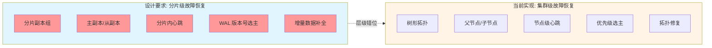

# 故障恢复机制实现状态分析

**类型**: Findings（发现）
**状态**: 📋 待讨论
**创建日期**: 2026-01-18
**标签**: failure-recovery, shard, replica, heartbeat

---

## 问题描述

审查 `docs/02_design/modules/04_故障恢复.md` 设计文档与实际实现，发现**核心故障恢复功能存在层级错位**：当前实现的是**集群级故障恢复**，而设计要求的是**分片级故障恢复**。

---

## 设计要求（来自 04_故障恢复.md）

### 核心功能

| 功能 | 设计要求 | 作用域 |
|------|---------|--------|
| **心跳检测** | 主副本 ↔ 从副本 心跳 | 分片副本组内 |
| **从副本故障恢复** | 暂停同步 → 重启后增量恢复 WAL | 分片副本组内 |
| **主副本故障恢复** | 分片内自动选主（基于 WAL 版本号） | 分片副本组内 |
| **数据补全** | WAL 日志增量同步 | 分片副本组内 |

### 关键特点

- **分片内自治**：无需集群级中心节点干预
- **以 WAL 为核心**：增量同步 WAL 日志
- **快速恢复**：毫秒级故障检测和切换
- **与一致性联动**：强一致分片数据零丢失

---

## 实现状态对比

### ✅ 已实现（集群级）

| 组件 | 代码位置 | 功能 | 作用域 |
|------|---------|------|--------|
| **FailureDetector** | `internal/metadata/cluster/failure_detector.go:30-493` | 节点级心跳检测、Φ Accrual 算法 | 集群级 |
| **LeaderElection** | `internal/metadata/cluster/leader_election.go:23-491` | 集群级 Leader 选举、租约机制 | 集群级 |
| **SelfHealer** | `internal/metadata/cluster/self_healing.go:23-550` | 树形拓扑修复、节点重连 | 集群级 |
| **QuorumService** | `internal/metadata/consensus/quorum.go:19-737` | 元数据变更一致性 | 元数据层 |

### ❌ 未实现（分片级）

| 功能 | 设计要求 | 当前状态 |
|------|---------|---------|
| **分片副本组管理** | 管理分片的主副本、从副本关系 | ❌ 无分片副本组抽象 |
| **主副本标识** | 标识哪个副本是主副本 | ❌ 元数据中无 `is_primary` 字段 |
| **WAL 版本号** | 记录每个副本的 WAL 版本号 | ❌ 元数据中无 `wal_version` 字段 |
| **分片级心跳** | 主副本 ↔ 从副本心跳 | ❌ 只有节点级心跳 |
| **分片内选主** | 从副本基于 WAL 版本号选主 | ❌ 选主是集群级的 |
| **WAL 增量同步** | 故障副本增量同步 WAL | ❌ WAL 无版本号，无法增量同步 |

---

## 核心问题：层级错位



**层级错位**：
- 设计要求针对的是**分片副本组**（一个分片有 3 个副本：1 主 + 2 从）
- 当前实现针对的是**树形拓扑节点**（树形协调器的父/子节点关系）
- 两者是**完全不同的抽象层级**

---

## 详细对比

### 1. 心跳检测

| 维度 | 设计要求 | 当前实现 |
|------|---------|---------|
| **检测对象** | 主副本 ↔ 从副本 | 节点之间 |
| **检测范围** | 分片副本组内（3-5 个副本） | 整个集群（所有节点） |
| **检测内容** | 副本存活状态、WAL 同步状态 | 节点存活状态 |
| **代码位置** | ❌ 未实现 | ✅ `failure_detector.go` |

**设计要求的心跳流程**：
```
主副本 ━━━ 发送心跳 ━━━→ 从副本1
  ↓                          ↓
从副本2 ━━━ 发送心跳 ━━━→ 主副本
```

**当前实现的心跳流程**：
```
节点A ━━━ 发送心跳 ━━━→ 节点B
  ↓
节点C
```

### 2. 选主机制

| 维度 | 设计要求 | 当前实现 |
|------|---------|---------|
| **选主范围** | 分片副本组内（3-5 个副本） | 整个集群（所有节点） |
| **选主依据** | WAL 日志版本号（最新的成为新主） | 节点优先级 + 节点状态 |
| **选主触发** | 主副本心跳超时 | Leader 租约过期 |
| **代码位置** | ❌ 未实现 | ✅ `leader_election.go` |

**设计要求的选主流程**：
```
主副本故障
  ↓
从副本1（WAL版本V5）← 比较版本 → 从副本2（WAL版本V4）
  ↓
从副本1 成为新主（版本号最高）
```

**当前实现的选主流程**：
```
Leader 故障
  ↓
所有候选节点竞争（基于优先级）
  ↓
优先级最高的成为新 Leader
```

### 3. 数据补全

| 维度 | 设计要求 | 当前实现 |
|------|---------|---------|
| **补全对象** | 分片副本组内副本 | ❌ 无对应概念 |
| **补全内容** | WAL 日志（增量） | ❌ 无 WAL 版本号 |
| **补全触发** | 副本重启后主动拉取 | ❌ 未实现 |
| **代码位置** | ❌ 未实现 | ❌ 未实现 |

**设计要求的恢复流程**：
```
从副本故障重启
  ↓
向主副本发送恢复请求（携带自身 WAL 版本 V1）
  ↓
主副本对比版本（V3 vs V1）
  ↓
主副本发送缺失的 WAL 日志（V1+1 ~ V3）
  ↓
从副本回放 WAL 日志
```

**当前实现**：
- 拓扑修复（为孤儿节点找新父节点）
- 无 WAL 日志同步机制

---

## 元数据结构差异

### 设计要求的分片元数据

```go
type ShardInfo struct {
    ShardID     uint64
    Replicas    []*ReplicaInfo  // 副本列表
    PrimaryID   string          // 主副本 ID
    WALVersion  uint64          // 当前 WAL 版本号
}

type ReplicaInfo struct {
    NodeID      string
    IsPrimary   bool           // 是否为主副本
    WALVersion  uint64         // 本地 WAL 版本号
    Status      ReplicaStatus  // 副本状态
}
```

### 当前实现的元数据

从 `metadata_store.go:67-71` 可以看到：
```go
CriticalPrefixes: []string{
    "shard/",   // 分片元数据（仅前缀，无结构定义）
    "replica/", // 副本元数据（仅前缀，无结构定义）
    "node/",    // 节点元数据
}
```

**缺失的关键字段**：
- ❌ `ReplicaInfo.IsPrimary` - 无主副本标识
- ❌ `ReplicaInfo.WALVersion` - 无 WAL 版本号
- ❌ `ShardInfo.PrimaryID` - 无主副本 ID
- ❌ `ShardInfo.ReplicaGroup` - 无副本组抽象

---

## 实现建议

### 优先级 P0：分片副本组抽象

```go
// ReplicaSet 分片副本组
type ReplicaSet struct {
    ShardID     uint64
    Primary     *ReplicaInfo
    Secondaries []*ReplicaInfo
    WALVersion  uint64
}

// ReplicaInfo 副本信息
type ReplicaInfo struct {
    NodeID      string
    IsPrimary   bool
    WALVersion  uint64
    Status      ReplicaStatus
    LastSync    time.Time  // 最后同步时间
}

// ReplicaService 副本管理服务
type ReplicaService struct {
    replicaSets map[uint64]*ReplicaSet
    walSyncer   *WALSyncer
    heartbeat   *ReplicaHeartbeat
}
```

### 优先级 P1：分片级心跳机制

```go
// ReplicaHeartbeat 副本级心跳
type ReplicaHeartbeat struct {
    primary    string
    secondaries []string
    interval    time.Duration
    timeout     time.Duration
}

// SendHeartbeat 主副本向从副本发送心跳
func (rh *ReplicaHeartbeat) SendHeartbeat() {
    for _, secondary := range rh.secondaries {
        // 发送携带 WAL 版本号的心跳
        heartbeat := &ReplicaHeartbeatMessage{
            ShardID:    rh.shardID,
            PrimaryID:  rh.primary,
            WALVersion: rh.currentWALVersion,
        }
        rh.transport.Send(secondary, heartbeat)
    }
}
```

### 优先级 P2：分片内选主

```go
// ElectPrimary 分片内选主
func (rs *ReplicaSet) ElectPrimary() (*ReplicaInfo, error) {
    var bestReplica *ReplicaInfo
    var highestVersion uint64

    // 选择 WAL 版本号最高的副本
    for _, replica := range rs.Secondaries {
        if replica.WALVersion > highestVersion && replica.Status == ReplicaStatusReady {
            highestVersion = replica.WALVersion
            bestReplica = replica
        }
    }

    if bestReplica == nil {
        return nil, fmt.Errorf("no eligible replica found")
    }

    // 更新主副本
    rs.Primary = bestReplica
    bestReplica.IsPrimary = true

    return bestReplica, nil
}
```

### 优先级 P3：WAL 增量同步

```go
// SyncWAL 增量同步 WAL
func (ws *WALSyncer) SyncWAL(shardID uint64, fromVersion, toVersion uint64) error {
    // 获取主副本的 WAL 日志
    walEntries, err := ws.primaryWAL.GetEntries(fromVersion, toVersion)
    if err != nil {
        return err
    }

    // 发送给从副本
    for _, replica := range ws.replicaSet.Secondaries {
        for _, entry := range walEntries {
            if err := ws.replicaWAL.Append(entry); err != nil {
                return err
            }
        }
    }

    return nil
}
```

---

## 待讨论事项

1. **架构决策**：
   - 是否保留当前的集群级故障恢复（树形拓扑修复）？
   - 分片级故障恢复是作为新增功能，还是替换现有实现？

2. **设计分歧**：
   - 设计文档中的"分片副本组"概念与当前代码中的"树形拓扑"概念关系是什么？
   - 是否需要两种故障恢复机制并存？

3. **实现复杂度**：
   - 需要引入 WAL 日志版本号管理
   - 需要重构现有的心跳和选主机制
   - 需要添加副本组管理模块

4. **与现有系统集成**：
   - 分片级故障恢复如何与现有的 Gossip/Quorum/2PC 协议集成？
   - 是否需要新的一致性协议来支持分片级选主？

---

## 参考文档

- **设计文档**: `docs/02_design/modules/04_故障恢复.md`
- **当前实现**:
  - `internal/metadata/cluster/failure_detector.go`
  - `internal/metadata/cluster/leader_election.go`
  - `internal/metadata/cluster/self_healing.go`
  - `internal/metadata/consensus/quorum.go`

---

**文档版本**: v1.0
**最后更新**: 2026-01-18
**维护者**: NexKV 开发团队
