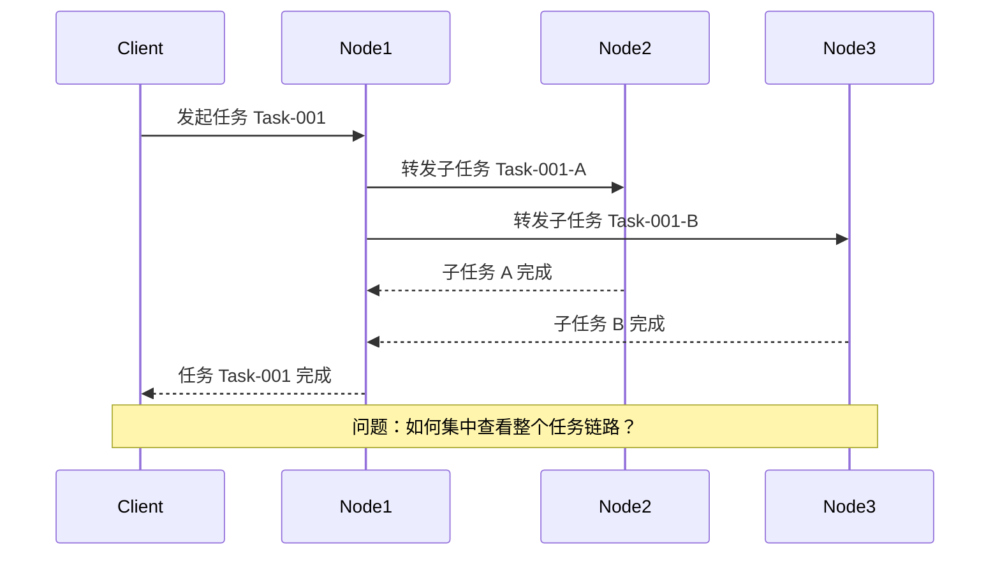
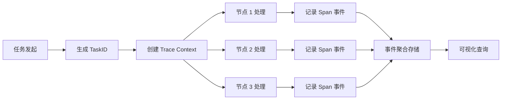
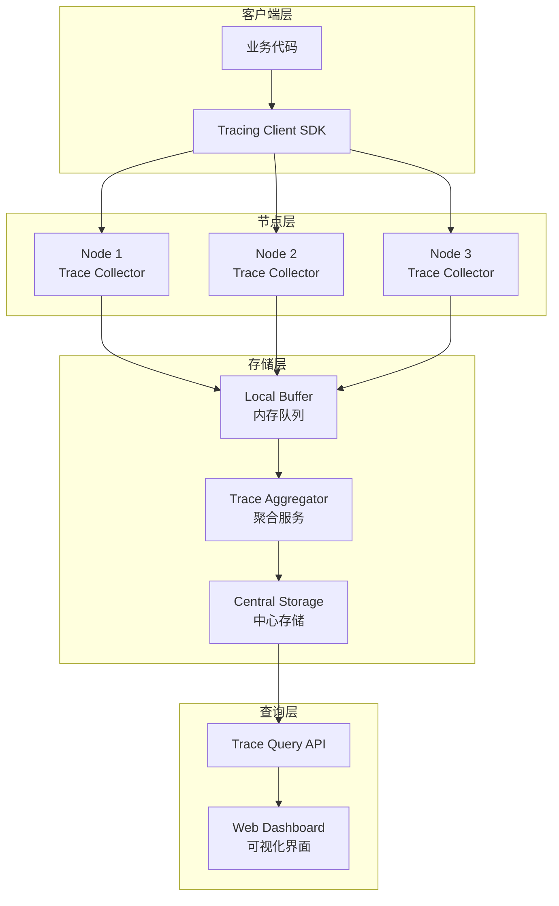
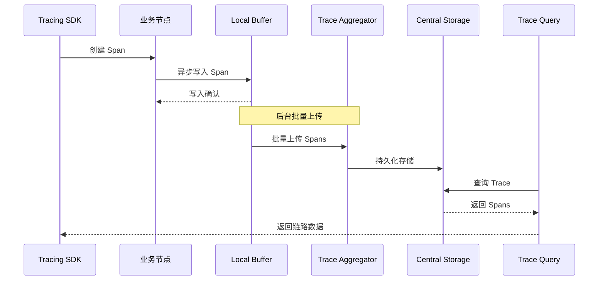

# 分布式任务跨节点可追溯性方案

> **文档类型**: 💡 技术建议 / Proposals
> **创建日期**: 2026-01-31
> **状态**: 📋 待讨论
> **优先级**: P1 (中)
> **标签**: distributed-system, tracing, observability

---

## 问题描述

### 核心问题

在分布式系统中，一个任务可能经过多个节点处理（如分布式事务、跨分片查询、Gossip 同步等），如何：

1. **集中描述**任务的完整执行路径？
2. **追溯**任务在每个节点的处理状态？
3. **定位**任务失败或卡住的位置？
4. **聚合**跨节点的日志和事件？

### 具体场景



**典型场景**：

| 场景 | 任务路径 | 追溯需求 |
|------|----------|---------|
| **分布式事务** | 协调者 → 参与者 1 → 参与者 2 → ... | 查看事务在各个节点的状态 |
| **跨分片查询** | 请求节点 → 分片 1 → 分片 2 → 分片 3 | 聚合查询结果和耗时 |
| **Gossip 同步** | 源节点 → 随机节点 1 → 随机节点 2 → ... | 追踪消息传播路径 |
| **数据迁移** | 源分片 → 目标分片（跨节点） | 监控迁移进度和状态 |
| **故障恢复** | 检测节点 → 候选父节点 → 新父节点 | 记录重试和最终成功的路径 |

---

## 技术方案

### 方案概览

采用 **分布式链路追踪 (Distributed Tracing)** 模式，核心思想：

1. **全局唯一任务 ID**：每个任务分配全局唯一标识符
2. **任务上下文传递**：节点间传递任务上下文信息
3. **事件流记录**：每个节点记录任务处理事件
4. **集中式存储**：将事件流聚合到中心存储
5. **可视化查询**：提供任务链路可视化查询接口



---

### 核心组件设计

#### 1. 任务标识符 (TaskID)

```go
// TaskID 全局任务标识符
type TaskID struct {
    // 高 64 位：时间戳（毫秒）
    Timestamp uint64
    // 中 16 位：节点 ID
    NodeID uint16
    // 低 48 位：序列号
    Sequence uint64
}

func (t TaskID) String() string {
    return fmt.Sprintf("%016x-%04x-%012x", t.Timestamp, t.NodeID, t.Sequence)
}

// 示例输出：66f1c2a3e8b4-0001-000000000123
```

**设计考虑**：
- **时间戳**：粗略排序，按时间查询
- **节点 ID**：快速定位发起节点
- **序列号**：节点内唯一性，防碰撞

#### 2. 追踪上下文 (TraceContext)

```go
// TraceContext 追踪上下文
type TraceContext struct {
    // 任务唯一标识
    TaskID TaskID

    // 父节点 Span ID（用于构建调用链）
    ParentSpanID string

    // 当前 Span ID（当前处理单元）
    SpanID string

    // 采样标志（0=不记录，1=记录）
    Sampled uint8

    // 附加 baggage（可选，用于传递业务信息）
    Baggage map[string]string
}
```

**节点间传递方式**：

```protobuf
// 在 RPC 消息中传递 TraceContext
message BaseMessage {
    MessageType type = 1;
    TraceContext trace_context = 2;  // 新增字段
    // ... 其他字段
}
```

#### 3. Span 事件记录

```go
// Span 表示任务在一个节点上的处理过程
type Span struct {
    // 基本信息
    TraceID    TaskID    // 关联的任务 ID
    SpanID     string    // 当前 Span ID
    ParentSpanID string  // 父 Span ID（构建调用树）

    // 节点信息
    NodeID     string    // 处理节点
    HostID     string    // 物理主机
    ProcessID  string    // 进程标识

    // 时间信息
    StartTime  time.Time // 开始时间
    Duration   time.Duration // 耗时

    // 操作信息
    Operation  string    // 操作名称（如 "Put", "Get", "JoinTree"）
    Status     string    // 状态（"success", "failure", "timeout"）

    // 详细信息
    Tags       map[string]string   // 标签（键值对）
    Logs       []LogEntry          // 日志条目
    Events     []TimedEvent        // 时间点事件
}

type LogEntry struct {
    Timestamp time.Time
    Level     string  // "info", "warn", "error"
    Message   string
}

type TimedEvent struct {
    Timestamp time.Time
    Name      string
    Attributes map[string]string
}
```

#### 4. 事件存储接口

```go
// TraceStore 追踪事件存储接口
type TraceStore interface {
    // 记录 Span
    RecordSpan(span *Span) error

    // 批量记录
    RecordSpans(spans []*Span) error

    // 查询任务链路
    QueryTrace(taskID TaskID) ([]*Span, error)

    // 按时间范围查询
    QueryByTimeRange(start, end time.Time) ([]*Span, error)

    // 按节点查询
    QueryByNode(nodeID string) ([]*Span, error)
}
```

---

### 架构设计

#### 整体架构



#### 数据流



---

### 实施建议

#### 阶段 1：核心基础 (P0 - 2周)

| 任务 | 说明 | 交付物 |
|------|------|--------|
| **TaskID 生成** | 实现全局唯一任务 ID 生成算法 | `internal/tracing/taskid.go` |
| **TraceContext** | 定义追踪上下文结构和序列化 | `internal/tracing/context.go` |
| **Span 定义** | 定义 Span 数据结构 | `internal/tracing/span.go` |
| **消息传递** | 在 RPC 消息中添加 TraceContext 字段 | 修改 `transport/*.go` |
| **内存存储** | 实现内存级别的 Span 缓冲 | `internal/tracing/buffer.go` |

#### 阶段 2：节点记录 (P1 - 2周)

| 任务 | 说明 | 交付物 |
|------|------|--------|
| **SDK 封装** | 提供易用的 Tracing SDK | `internal/tracing/sdk.go` |
| **自动埋点** | 在关键路径自动记录 Span | 标注关键函数 |
| **TreeCoordinator** | 为集群操作添加追踪 | `cluster/tree_coordinator.go` |
| **Gossip 协议** | 为消息传播添加追踪 | `gossip/*.go` |
| **2PC 协议** | 为分布式事务添加追踪 | `transaction/*.go` |

#### 阶段 3：聚合存储 (P1 - 2周)

| 任务 | 说明 | 交付物 |
|------|------|--------|
| **Trace Aggregator** | 实现事件聚合服务 | `cmd/trace-aggregator/main.go` |
| **批量上传** | 实现异步批量上传机制 | `internal/tracing/uploader.go` |
| **持久化存储** | 实现 Storage 接口（支持 WAL） | `internal/tracing/store.go` |
| **压缩编码** | 使用 MessagePack 压缩 Span 数据 | 减少存储开销 |

#### 阶段 4：查询可视化 (P2 - 1周)

| 任务 | 说明 | 交付物 |
|------|------|--------|
| **Query API** | 实现链路查询接口 | `internal/tracing/query.go` |
| **Web Dashboard** | 实现可视化界面（可选） | `web/trace-dashboard/` |
| **CLI 工具** | 命令行查询工具 | `cmd/nexkv-trace/main.go` |

---

### 关键场景示例

#### 场景 1：节点加入树形拓扑

```go
// 在 TreeCoordinator.JoinTree 中添加追踪
func (tc *TreeCoordinator) JoinTree(ctx context.Context) error {
    // 创建根 Span
    rootSpan := tracing.StartSpan("TreeCoordinator.JoinTree")
    defer rootSpan.Finish()

    // 1. 查找候选父节点
    parentSpan := tracing.StartSpan("FindCandidateParents", rootSpan)
    candidates, err := tc.findCandidateParents()
    parentSpan.SetTag("candidate_count", len(candidates))
    if err != nil {
        parentSpan.SetError(err)
        return err
    }
    parentSpan.Finish()

    // 2. 向父节点发送加入请求
    joinSpan := tracing.StartSpan("SendJoinRequest", rootSpan)
    joinSpan.SetTag("parent_id", candidates[0].NodeID)

    // TraceContext 会自动通过 RPC 传递
    err = tc.transport.SendMessage(candidates[0].Addr, &transport.NodeJoinMessage{
        BaseMessage: transport.BaseMessage{
            TraceContext: tracing.GetContext(), // 自动传递
        },
        NodeID: tc.localNode.NodeID,
    })
    if err != nil {
        joinSpan.SetError(err)
        return err
    }
    joinSpan.Finish()

    // 3. 等待确认
    confirmSpan := tracing.StartSpan("WaitForConfirmation", rootSpan)
    select {
    case <-ctx.Done():
        confirmSpan.SetTag("timeout", true)
        return ctx.Err()
    case <-tc.joinConfirmed:
        confirmSpan.SetTag("success", true)
    }
    confirmSpan.Finish()

    return nil
}
```

**生成的 Trace 链路**：

```
TaskID: 66f1c2a3e8b4-0001-000000000123

└─ Span-001: TreeCoordinator.JoinTree (100ms)
   ├─ Span-002: FindCandidateParents (20ms)
   │  └─ Tags: candidate_count=3
   ├─ Span-003: SendJoinRequest (15ms)
   │  └─ Tags: parent_id=node-2
   └─ Span-004: WaitForConfirmation (60ms)
      └─ Tags: success=true
```

#### 场景 2：Gossip 消息传播

```go
// 在 Gossip 同步中追踪传播路径
func (g *GossipService) SyncToNode(peerAddr string) {
    // 创建 Span，继承父节点的 TraceContext
    span := tracing.StartSpan("Gossip.SyncToNode")
    defer span.Finish()

    span.SetTag("peer_addr", peerAddr)

    // 发送同步请求（TraceContext 自动传递）
    resp, err := g.transport.SendSyncRequest(peerAddr, &SyncMessage{
        BaseMessage: transport.BaseMessage{
            TraceContext: tracing.GetContext(),
        },
        Version: g.metadata.GetVersion(),
        Data: g.metadata.GetChangeLogs(),
    })

    if err != nil {
        span.SetError(err)
        return
    }

    span.SetTag("remote_version", resp.Version)
    span.SetTag("synced_keys", len(resp.Data))
}
```

**传播路径可视化**：

```
TaskID: 66f1c2a3e8b4-0001-000000000456

Node-1 (源节点)
└─ Span-001: Gossip.SyncToNode [node-2] (25ms)
   └─ Tags: synced_keys=10

Node-2 (中间节点)
└─ Span-002: Gossip.ReceiveSync (10ms)
   └─ Span-003: Gossip.SyncToNode [node-3] (20ms)
      └─ Tags: synced_keys=8

Node-3 (目标节点)
└─ Span-004: Gossip.ReceiveSync (12ms)
   └─ Tags: synced_keys=8
```

#### 场景 3：查询接口

```go
// 查询任务链路
func GetTaskTrace(taskID TaskID) (*Trace, error) {
    // 从中心存储查询所有 Spans
    spans, err := traceStore.QueryTrace(taskID)
    if err != nil {
        return nil, err
    }

    // 构建调用树
    trace := &Trace{
        TaskID: taskID,
        Spans:  spans,
    }

    // 按 ParentSpanID 构建树形结构
    trace.BuildTree()

    return trace, nil
}

// 使用 CLI 查询
// $ nexkv-trace get --task-id 66f1c2a3e8b4-0001-000000000123
//
// 输出：
// TaskID: 66f1c2a3e8b4-0001-000000000123
// Duration: 100ms
// Status: success
//
// Tree:
// ├─ [00:00:00.000] TreeCoordinator.JoinTree (100ms) ✅
// │  ├─ [00:00:00.010] FindCandidateParents (20ms) ✅
// │  ├─ [00:00:00.030] SendJoinRequest (15ms) ✅
// │  └─ [00:00:00.045] WaitForConfirmation (60ms) ✅
```

---

### 技术选型

#### 1. TaskID 生成算法

| 方案 | 优点 | 缺点 | 推荐度 |
|------|------|------|--------|
| **UUID v7** | 时间排序 + 随机性 | 非标准 | ⭐⭐⭐ |
| **Snowflake** | 高性能、有序 | 需要中心化配置 | ⭐⭐⭐⭐ |
| **自定义** | 完全控制 | 需要实现 | ⭐⭐⭐⭐⭐ |

**推荐**：自定义方案（时间戳 + 节点 ID + 序列号）

#### 2. 序列化格式

| 格式 | 优点 | 缺点 | 推荐度 |
|------|------|------|--------|
| **JSON** | 可读性强 | 体积大 | ⭐⭐⭐ |
| **MessagePack** | 高效、紧凑 | 需要schema | ⭐⭐⭐⭐⭐ |
| **Protobuf** | 强类型 | 复杂 | ⭐⭐⭐⭐ |

**推荐**：MessagePack（已在项目使用）

#### 3. 存储引擎

| 方案 | 优点 | 缺点 | 推荐度 |
|------|------|------|--------|
| **MVStore** | 复用现有存储 | 写入频率高 | ⭐⭐⭐⭐ |
| **独立 WAL** | 隔离性好 | 需要维护 | ⭐⭐⭐⭐⭐ |
| **外部系统** | 功能强大 | 依赖外部 | ⭐⭐⭐ |

**推荐**：独立 WAL（复用现有的 WAL 机制）

---

### 性能考虑

#### 采样策略

```go
// 采样决策
func ShouldSample(traceContext TraceContext) bool {
    // 1. 全局采样率（默认 10%）
    if rand.Float64() > GlobalSampleRate {
        return false
    }

    // 2. 关键操作强制采样
    if IsCriticalOperation(traceContext.Operation) {
        return true
    }

    // 3. 错误场景强制采样
    if traceContext.HasError() {
        return true
    }

    return true
}
```

#### 批量上传

```go
// 批量上传优化
type BatchUploader struct {
    buffer    []*Span
    batchSize int    // 默认 100
    flushIntv time.Duration // 默认 5s
}

func (u *BatchUploader) AddSpan(span *Span) {
    u.buffer = append(u.buffer, span)

    // 达到批次大小立即上传
    if len(u.buffer) >= u.batchSize {
        u.Flush()
    }
}

func (u *BatchUploader) Start() {
    ticker := time.NewTicker(u.flushIntv)
    go func() {
        for range ticker.C {
            u.Flush() // 定期刷新
        }
    }()
}
```

#### 内存限制

```go
// 内存缓冲限制
type BoundedBuffer struct {
    spans    []*Span
    capacity int // 默认 10000
}

func (b *BoundedBuffer) AddSpan(span *Span) error {
    if len(b.spans) >= b.capacity {
        // 容量满时，丢弃最旧的 Span
        b.spans = b.spans[1:]
    }
    b.spans = append(b.spans, span)
    return nil
}
```

---

### 与现有系统集成

#### 1. 与 TreeCoordinator 集成

```go
// 在 TreeCoordinator 中嵌入 Tracing
type TreeCoordinator struct {
    tracer *tracing.Tracer
    // ... 其他字段
}

func (tc *TreeCoordinator) AddChild(childID string) error {
    span := tc.tracer.StartSpan("TreeCoordinator.AddChild")
    defer span.Finish()

    span.SetTag("child_id", childID)

    // 原有逻辑
    if err := tc.addChildInternal(childID); err != nil {
        span.SetError(err)
        return err
    }

    span.SetTag("success", true)
    return nil
}
```

#### 2. 与 Transport 集成

```go
// 在 Transport 消息中自动传递 TraceContext
type BaseMessage struct {
    MessageType MessageType
    TraceContext *tracing.TraceContext // 新增
    MessageID   uint64
}

// 在发送前注入 TraceContext
func (t *Transport) SendMessage(addr string, msg Message) error {
    // 自动注入当前的 TraceContext
    if baseMsg, ok := msg.(BaseMessageer); ok {
        baseMsg.SetTraceContext(tracing.GetContext())
    }
    // ... 发送逻辑
}
```

#### 3. 与 Gossip 集成

```go
// 在 Gossip 消息中携带 TraceContext
func (g *GossipService) Gossip() {
    span := g.tracer.StartSpan("Gossip.Round")
    defer span.Finish()

    for _, peer := range g.selectPeers() {
        peerSpan := g.tracer.StartSpan("Gossip.SyncPeer", span)
        peerSpan.SetTag("peer_addr", peer.Addr)

        // 发送同步消息
        msg := &SyncMessage{
            BaseMessage: transport.BaseMessage{
                TraceContext: peerSpan.Context(), // 传递 Span
            },
            // ... 其他字段
        }

        if err := g.transport.SendSync(peer.Addr, msg); err != nil {
            peerSpan.SetError(err)
        }
        peerSpan.Finish()
    }
}
```

---

### 可观测性增强

#### 1. 关键指标

| 指标 | 说明 | 用途 |
|------|------|------|
| **Trace 采集率** | 实际采集 Trace / 总请求数 | 评估覆盖率 |
| **Span 丢失率** | 丢失 Span / 总 Span | 评估存储压力 |
| **平均 Trace 延迟** | 任务完成时间分布 | 性能分析 |
| **跨节点调用耗时** | 各节点耗时占比 | 定位瓶颈 |
| **错误 Trace 数量** | 失败任务数量 | 质量监控 |

#### 2. 告警规则

```yaml
alerts:
  - name: 高错误率告警
    condition: error_trace_rate > 0.05  # 错误率 > 5%
    duration: 5m
    severity: P0

  - name: Trace 丢失告警
    condition: span_drop_rate > 0.1  # 丢失率 > 10%
    duration: 1m
    severity: P1

  - name: 任务超时告警
    condition: trace_duration > 30s
    duration: 1m
    severity: P2
```

---

### 风险与挑战

| 风险 | 影响 | 缓解措施 |
|------|------|---------|
| **性能开销** | 每个任务额外 ~5% 开销 | 采样、异步写入 |
| **存储压力** | 大量 Span 数据 | 内存限制、定期清理 |
| **网络开销** | TraceContext 增加消息大小 | 压缩编码、批量传输 |
| **时钟同步** | 时间戳不一致 | HLC（混合逻辑时钟） |
| **数据一致性** | Span 丢失或乱序 | 序列号、重传机制 |

---

## 下一步行动

### 讨论议题

1. **是否需要全链路追踪？**
   - 如果只需要失败追溯，可以简化为"错误上报"模式
   - 如果需要性能分析，需要完整的 Span 记录

2. **存储策略选择？**
   - 独立存储 vs 复用 MVStore
   - 本地存储 vs 远程存储

3. **采样率配置？**
   - 默认采样率（建议 10%）
   - 关键操作是否强制采样

4. **优先级排序？**
   - 先实现 TreeCoordinator 追踪（最复杂）
   - 还是先实现 Gossip 追踪（最频繁）

### 实施建议

**最小可行方案 (MVP)**：

1. **核心功能**（1 周）
   - TaskID 生成
   - TraceContext 定义
   - 内存缓冲
   - TreeCoordinator 埋点

2. **存储查询**（1 周）
   - WAL 持久化
   - CLI 查询工具
   - 基础可视化（树形打印）

3. **增强功能**（可选）
   - Web Dashboard
   - 高级查询
   - 性能分析

---

## 参考资料

### 相关文档

- `docs/02_design/protocols/01_一致性协议设计.md` - 分布式事务协议
- `docs/02_design/modules/07_树形协调器拓扑同步.md` - TreeCoordinator 设计
- `docs/03_development/02_运行时细节文档.md` - Gossip 协议细节

### 外部参考

- **OpenTelemetry**: https://opentelemetry.io/
- **Jaeger**: https://www.jaegertracing.io/
- **Dapper**: Google's distributed tracing system
- **Zipkin**: Twitter's distributed tracing system

---

**维护者**: 🤖 AI 团队
**最后更新**: 2026-01-31
**相关 Issue**: 待创建
**相关 PR**: 待创建
