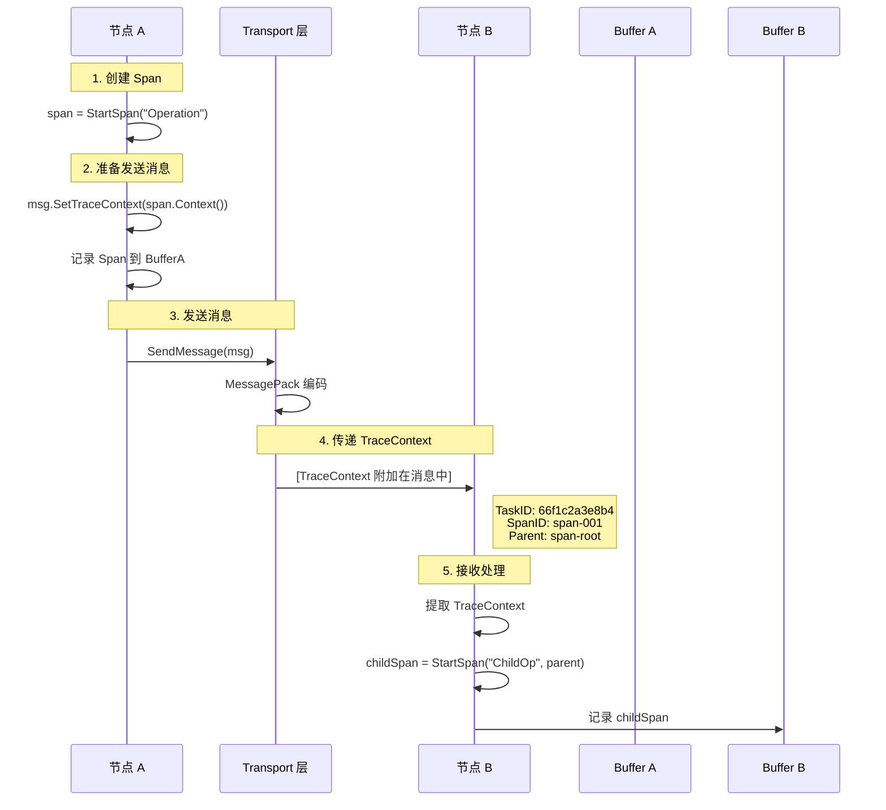
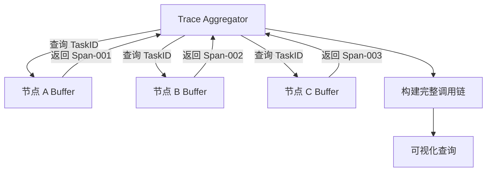

# TraceContext 传送机制设计

> **类型**: 💡 技术方案补充
> **创建日期**: 2026-01-31
> **状态**: 📋 待讨论
> **关联文档**: traceability_2026-01-31_cross-node-task-tracing-proposal.md

---

## 问题

Span 数据如何通过现有的 transport 机制在节点间传递？

---

## 核心设计原则

### 轻量级传递

**关键决策**：只传递 **TraceContext（轻量级）**，不传递 **Span（重量级）**

| 传递内容 | 大小 | 说明 |
|---------|------|------|
| **TraceContext** | ~100 bytes | TaskID + SpanID + ParentSpanID + Tags |
| **Span** | ~1-5 KB | 完整的事件日志、时间戳、标签等 |

**原因**：
- ✅ 减少 RPC 消息大小
- ✅ 避免序列化开销
- ✅ 各节点自主控制 Span 存储策略
- ✅ 符合 OpenTelemetry 标准做法

---

## 方案设计

### 1. 扩展 BaseMessage

```go
// BaseMessage 消息基类
type BaseMessage struct {
    MessageType  MessageType
    correlationID string

    // ====== 新增：TraceContext 字段 ======
    // TraceContext 追踪上下文（可选，用于分布式链路追踪）
    // 节点间传递轻量级追踪信息，Span 数据由各节点独立存储
    TraceContext *TraceContext `msgpack:"trace_context,omitempty"`
}
```

**字段说明**：

```go
// TraceContext 追踪上下文（轻量级）
type TraceContext struct {
    // TaskID 全局任务标识
    TaskID TaskID `msgpack:"task_id"`

    // SpanID 当前处理单元的标识
    // 发送节点生成的 Span ID，用于构建调用链
    SpanID string `msgpack:"span_id"`

    // ParentSpanID 父 Span ID
    // 用于构建树形调用关系
    ParentSpanID string `msgpack:"parent_span_id,omitempty"`

    // Sampled 采样标志
    // 0=不记录后续 Span，1=记录
    Sampled uint8 `msgpack:"sampled"`

    // Baggage 附加数据（可选）
    // 用于传递业务级别的上下文信息
    Baggage map[string]string `msgpack:"baggage,omitempty"`
}
```

**大小估算**：

```
TaskID:        32 bytes (十六进制字符串)
SpanID:        16 bytes (UUID 格式)
ParentSpanID:  16 bytes (可选)
Sampled:       1 byte
Baggage:       ~30 bytes (假设 2-3 个键值对)
─────────────────────────────────
总计:          ~95 bytes (压缩后 ~60-70 bytes)
```

### 2. 序列化集成

#### MessagePack 序列化

```go
// BaseMessage 的序列化（已支持 msgpack tag）
func (m *BaseMessage) Marshal() ([]byte, error) {
    // 使用现有的 msgpack 编码器
    return msgpack.Marshal(m)
}

func (m *BaseMessage) Unmarshal(data []byte) error {
    return msgpack.Unmarshal(data, m)
}
```

**序列化示例**：

```json
// 原始消息
{
  "message_type": 1,
  "correlation_id": "req-12345",
  "trace_context": {
    "task_id": "66f1c2a3e8b4-0001-000000000123",
    "span_id": "span-001",
    "parent_span_id": "span-root",
    "sampled": 1
  }
}

// MessagePack 编码后（二进制）
// 大小：~100 bytes（vs JSON ~200 bytes）
```

### 3. 传送流程



---

## 具体实现

### 发送端（Node A）

```go
// 在业务代码中使用 Tracing SDK
func (tc *TreeCoordinator) AddChild(childID string) error {
    // 1. 创建 Span
    span := tracing.StartSpan("TreeCoordinator.AddChild")
    defer span.Finish()

    span.SetTag("child_id", childID)
    span.SetTag("node_id", tc.localNode.NodeID)

    // 2. 准备 RPC 消息
    msg := &transport.NodeJoinMessage{
        BaseMessage: transport.BaseMessage{
            MessageType: types.MessageTypeNodeJoin,
            // ====== 关键：自动注入 TraceContext ======
            TraceContext: span.Context(), // 返回轻量级的 TraceContext
        },
        NodeID: tc.localNode.NodeID,
    }

    // 3. Span 记录到本地 buffer（异步）
    tracing.RecordSpan(span) // 非阻塞，写入内存队列

    // 4. 发送消息
    err := tc.transport.SendMessage(parentAddr, msg)
    if err != nil {
        span.SetError(err)
        return err
    }

    return nil
}
```

### 接收端（Node B）

```go
// 在 RPC Handler 中提取 TraceContext
func (h *TreeCoordinatorRPCHandler) handleNodeJoin(ctx context.Context, msg *transport.NodeJoinMessage) (types.Message, error) {
    // 1. 提取 TraceContext（如果存在）
    var span *tracing.Span
    if msg.BaseMessage.TraceContext != nil {
        // 2. 创建子 Span（继承 ParentSpanID）
        span = tracing.StartSpan("Handler.handleNodeJoin", tracing.Parent(msg.BaseMessage.TraceContext))
        defer span.Finish()

        span.SetTag("remote_node", msg.NodeID)
        span.SetTag("source_span", msg.BaseMessage.TraceContext.SpanID)
    } else {
        // 没有追踪上下文，创建独立的 Span
        span = tracing.StartSpan("Handler.handleNodeJoin")
        defer span.Finish()
    }

    // 3. 业务逻辑处理
    if err := h.coordinator.AddChild(msg.NodeID); err != nil {
        span.SetError(err)
        return nil, err
    }

    span.SetTag("success", true)
    return &transport.NodeSyncMessage{
        BaseMessage: transport.BaseMessage{
            MessageType: types.MessageTypeNodeSync,
            // ====== 响应也携带 TraceContext ======
            TraceContext: span.Context(),
        },
    }, nil
}
```

### TraceContext 传递

```go
// Tracing SDK 实现
package tracing

import (
    "context"
    "time"
    "github.com/jzhang405/NexKV/internal/metadata/transport"
)

var contextKey = &struct{}{}

// Context 从 Span 提取轻量级的 TraceContext
func (s *Span) Context() *transport.TraceContext {
    return &transport.TraceContext{
        TaskID:       s.TraceID,
        SpanID:       s.SpanID,
        ParentSpanID: s.ParentSpanID,
        Sampled:      s.Sampled,
        Baggage:      s.Baggage,
    }
}

// StartSpan 创建新 Span
func StartSpan(name string, opts ...SpanOption) *Span {
    span := &Span{
        SpanID:    generateSpanID(),
        StartTime: time.Now(),
        Operation: name,
    }

    // 应用选项
    for _, opt := range opts {
        opt(span)
    }

    return span
}

// Parent 从 TraceContext 创建父 Span 选项
func Parent(tc *transport.TraceContext) SpanOption {
    return func(s *Span) {
        if tc != nil {
            s.TraceID = tc.TaskID
            s.ParentSpanID = tc.SpanID // 关键：使用发送节点的 SpanID 作为父 ID
        }
    }
}

// RecordSpan 记录 Span 到本地 buffer（异步）
func RecordSpan(span *Span) {
    // 非阻塞写入内存队列
    spanBuffer.Push(span)
}
```

---

## 数据流示意

### 调用链示例

```
节点 A (协调者)
└─ Span-001: TreeCoordinator.AddChild [10ms]
   ├─ TraceContext: {
   │    task_id: "66f1c2a3e8b4-0001-000000000123",
   │    span_id: "span-001",
   │    parent_span_id: ""
   │  }
   └─ 发送消息 → 节点 B

节点 B (接收者)
└─ Span-002: Handler.handleNodeJoin [5ms]
   ├─ TraceContext: {
   │    task_id: "66f1c2a3e8b4-0001-000000000123",  // 继承
   │    span_id: "span-002",                         // 新生成
   │    parent_span_id: "span-001"                    // 指向节点 A 的 Span
   │  }
   └─ 记录到本地 Buffer
```

### 聚合查询



---

## 消息格式示例

### 请求消息

```go
// NodeJoinMessage 携带 TraceContext
msg := &transport.NodeJoinMessage{
    BaseMessage: transport.BaseMessage{
        MessageType: types.MessageTypeNodeJoin,
        correlationID: "req-12345",
        TraceContext: &transport.TraceContext{
            TaskID:       "66f1c2a3e8b4-0001-000000000123",
            SpanID:       "span-001",
            ParentSpanID:  "",
            Sampled:      1,
            Baggage: map[string]string{
                "node_role": "coordinator",
            },
        },
    },
    NodeID: "node-2",
    Addr:   "/ip4/127.0.0.1/tcp/9213",
}
```

### MessagePack 编码

```
二进制格式（近似）：
81                    // map (1 个元素，为简化示例)
a0                    // key 长度 (实际会更长)
...
TracedContext 部分：
a4                    // map (4 个元素)
a7 task_id            // key "task_id"
7a                    // str 32 (32 字节字符串)
36 36 66 31 63 ...    // "66f1c2a3e8b4-0001-000000000123"
a6 span_id            // key "span_id"
6a                    // str 16
73 70 61 6e ...      // "span-001"
...
总大小：~100 bytes
```

---

## 兼容性考虑

### 向后兼容

```go
// 接收端兼容处理（没有 TraceContext 的旧版本）
func (h *Handler) HandleRequest(msg Message) error {
    var span *Span

    if msg.GetTraceContext() != nil {
        // 新版本：有追踪上下文
        span = StartSpan("Handler", Parent(msg.GetTraceContext()))
    } else {
        // 旧版本：没有追踪上下文，创建独立 Span
        span = StartSpan("Handler")
    }
    defer span.Finish()

    // 业务逻辑
    // ...
}
```

### 性能影响

| 指标 | 影响 | 说明 |
|------|------|------|
| **消息大小** | +~100 bytes | 可接受（<1% 增长） |
| **序列化开销** | <1ms | MessagePack 高效编码 |
| **内存开销** | +~200 bytes/node | TraceContext + Span 对象 |
| **网络延迟** | 可忽略 | 带宽影响 <1% |

---

## 实施步骤

### 阶段 1：扩展 BaseMessage（1 天）

```go
// 1. 添加 TraceContext 字段
type BaseMessage struct {
    MessageType  MessageType
    correlationID string
    TraceContext *TraceContext `msgpack:"trace_context,omitempty"`
}

// 2. 更新 MessagePack 序列化
// （自动支持，因为有 msgpack tag）

// 3. 更新所有消息类型的构造函数
// （保持向后兼容，TraceContext 可选）
```

### 阶段 2：实现 Tracing SDK（2 天）

```go
// internal/tracing/
├── context.go      // TraceContext 定义
├── span.go         // Span 定义
├── tracer.go       // SDK 核心接口
├── buffer.go       // 内存缓冲
└── middleware.go   // Transport 中间件
```

### 阶段 3：集成到 Transport（1 天）

```go
// 在 Transport 的 SendMessage 中自动注入 TraceContext
func (t *Transport) SendMessage(addr string, msg Message) error {
    // 如果当前有 Span 上下文，自动注入
    if span := tracing.ActiveSpan(); span != nil {
        if baseMsg, ok := msg.(BaseMessageGetter); ok {
            baseMsg.GetBaseMessage().TraceContext = span.Context()
        }
    }

    // 原有发送逻辑
    return t.send(addr, msg)
}
```

### 阶段 4：埋点关键路径（2 天）

```go
// 关键埋点位置：
// 1. TreeCoordinator.JoinTree
// 2. GossipService.SyncToNode
// 3. TwoPC 协调者
// 4. Quorum 提案
```

---

## 测试验证

### 单元测试

```go
func TestTraceContextSerialization(t *testing.T) {
    tc := &TraceContext{
        TaskID:       "66f1c2a3e8b4-0001-000000000123",
        SpanID:       "span-001",
        ParentSpanID: "",
        Sampled:      1,
    }

    // 序列化
    data, err := msgpack.Marshal(tc)
    assert.NoError(t, err)
    assert.Less(t, len(data), 150) // 验证大小

    // 反序列化
    var tc2 TraceContext
    err = msgpack.Unmarshal(data, &tc2)
    assert.NoError(t, err)
    assert.Equal(t, tc.TaskID, tc2.TaskID)
}
```

### 集成测试

```go
func TestTraceContextPropagation(t *testing.T) {
    // 节点 A 发送消息
    spanA := tracing.StartSpan("SendOp")
    msg := &NodeJoinMessage{
        BaseMessage: BaseMessage{
            TraceContext: spanA.Context(),
        },
    }

    // 序列化传输
    data, _ := msg.Marshal()

    // 节点 B 接收消息
    var msgB NodeJoinMessage
    msgB.Unmarshal(data)

    // 验证 TraceContext 正确传递
    assert.Equal(t, spanA.Context().TaskID, msgB.BaseMessage.TraceContext.TaskID)
    assert.Equal(t, spanA.Context().SpanID, msgB.BaseMessage.TraceContext.ParentSpanID)
}
```

---

## 总结

### 关键点

1. **轻量级传递**：只传 TraceContext（~100 bytes），不传 Span
2. **自动注入**：Transport 层自动注入当前 Span 的 TraceContext
3. **本地存储**：每个节点独立存储 Span 到本地 Buffer
4. **异步聚合**：Trace Aggregator 后续聚合各节点的 Span
5. **向后兼容**：旧版本节点自动降级为独立 Span

### 优势

| 优势 | 说明 |
|------|------|
| **低开销** | 消息大小增加 <100 bytes |
| **解耦合** | 业务逻辑与追踪逻辑分离 |
| **可扩展** | 易于添加新的追踪点 |
| **标准化** | 符合 OpenTelemetry 标准 |

---

**维护者**: 🤖 AI 团队
**最后更新**: 2026-01-31
**相关 Issue**: 待创建
**相关 PR**: 待创建
