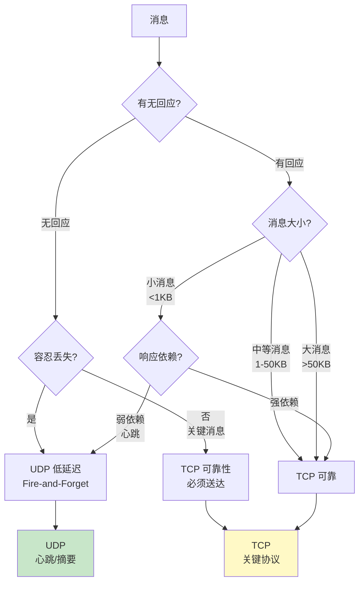
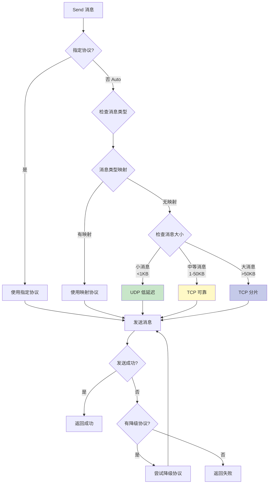

# Dual Transport (TCP + UDP) 混合传输方案

> **文档类型**: 💡 技术建议 (Proposals)
> **创建日期**: 2026-01-22
> **状态**: 📋 待讨论
> **优先级**: P0 (高优先级 - 基础架构)
> **主题**: TCP + UDP 混合传输层设计

---

## 📌 背景说明

当前 NexKV 项目已实现 **TCP Transport** (100%) 和 **UDP Transport** (80%)，但两者各自独立，没有统一的调度机制。

### 现状分析

| Transport | 状态 | 特性 | 适用场景 |
|-----------|------|------|---------|
| **TCP** | ✅ 100% | 连接池、可靠传输、Keep-Alive | 点对点、可靠性优先 |
| **UDP** | 🔄 80% | 分片重组、最大 100MB、广播 | 低延迟、大消息、多播 |

### 核心问题

1. **缺少统一调度**：上层协议（Gossip/Quorum/2PC）需要手动选择 Transport
2. **未充分利用优势**：TCP 的可靠性和 UDP 的低延迟没有结合使用
3. **配置复杂**：需要同时维护 TCP 和 UDP 两套配置

---

## 🎯 设计目标

### 核心原则

| 原则 | 说明 | 优先级 |
|------|------|--------|
| **自动路由** | 根据消息类型自动选择最优传输协议 | P0 |
| **性能优化** | TCP 用于可靠传输，UDP 用于低延迟广播 | P0 |
| **透明接入** | 上层协议无需关心底层 Transport 选择 | P1 |
| **配置简化** | 单一配置入口，内部管理 TCP + UDP | P1 |
| **平滑降级** | UDP 失败时自动降级到 TCP | P2 |

---

## 📊 消息类型分析

### 维度 1: 有回应 vs 无回应

**核心原则**: 有回应的消息更依赖可靠性，无回应的消息可以容忍丢失

#### 无回应消息 (Fire-and-Forget)

| 消息类型 | 大小 | 频率 | 丢失容忍度 | **推荐协议** |
|---------|------|------|-----------|------------|
| **NodePing** | ~50B | 1/s | ✅ 高（下次心跳补偿） | **UDP** |
| **NodePong** | ~50B | 1/s | ✅ 高（下次心跳补偿） | **UDP** |
| **GossipDigest** | ~1KB | 10s | ✅ 中（下一轮补偿） | **UDP** |
| **2PCCommit** | ~500B | 低 | ❌ 极低（不可丢失） | **TCP** |
| **2PCRollback** | ~500B | 低 | ❌ 极低（不可丢失） | **TCP** |
| **QuorumDecide** | ~500B | 低 | ❌ 极低（不可丢失） | **TCP** |
| **LeaderElection** | ~2KB | 极低 | ❌ 低（需要确认） | **TCP** |

**特征**: 发送后不等待响应，定期发送
**策略**: 优先 UDP（低延迟），关键消息用 TCP

#### 有回应消息 (Request-Reply)

| 消息对 | 大小 | 频率 | 响应依赖 | **推荐协议** |
|-------|------|------|---------|------------|
| **Get → GetReply** | ~1KB | 中 | ✅ 强依赖 | **TCP** |
| **Put → PutReply** | ~10KB | 中 | ✅ 强依赖 | **TCP** |
| **Delete → DeleteReply** | ~500B | 低 | ✅ 强依赖 | **TCP** |
| **GossipSync → GossipSyncReply** | ~100KB | 10s | ✅ 强依赖 | **TCP** |
| **GossipDigest → GossipDigestReply** | ~1KB | 10s | ✅ 强依赖 | **UDP**（小消息） |
| **QuorumPropose → QuorumVote** | ~1KB | 低 | ✅ 强依赖 | **TCP** |
| **2PCPrepare → 2PCPrepareReply** | ~5KB | 低 | ✅ 强依赖 | **TCP** |
| **2PCCommit → 2PCCommitReply** | ~500B | 低 | ✅ 强依赖 | **TCP** |
| **2PCRollback → 2PCRollbackReply** | ~500B | 低 | ✅ 强依赖 | **TCP** |
| **NodeJoin → 确认** | ~1KB | 极低 | ✅ 强依赖 | **TCP** |
| **ClockSync → ClockSyncReply** | ~50B | 1/s | ⚠️ 弱依赖（容忍丢失） | **UDP** |
| **ClusterStatus → ClusterStatusReply** | ~10KB | 低 | ✅ 强依赖 | **TCP** |

**特征**: 请求-响应模式，请求丢失导致超时重试
**策略**: 优先 TCP（保证投递），心跳类可用 UDP

---

### 维度 2: 消息大小与频率

| 消息类型 | 典型大小 | 频率 | 可靠性要求 | 延迟要求 | **推荐协议** |
|---------|---------|------|-----------|---------|------------|
| **NodePing/NodePong** | ~50B | 极高 (1/s) | 低 | 极低 (<10ms) | **UDP** |
| **GossipDigest** | ~1KB | 高 (10s) | 低 | 低 (<100ms) | **UDP** |
| **GossipSync** | ~100KB | 中 (10s) | 中 | 中 (<500ms) | **TCP** |
| **GossipSyncReply** | ~100KB | 中 | 中 | 中 | **TCP** |
| **QuorumPropose** | ~1KB | 低 | **极高** | 低 (<100ms) | **TCP** |
| **QuorumVote** | ~200B | 低 | **极高** | 低 (<100ms) | **TCP** |
| **QuorumDecide** | ~500B | 低 | **极高** | 低 (<100ms) | **TCP** |
| **2PCPrepare** | ~5KB | 低 | **极高** | 中 (<200ms) | **TCP** |
| **2PCCommit** | ~500B | 低 | **极高** | 极低 (<50ms) | **TCP** |
| **2PCRollback** | ~500B | 低 | **极高** | 极低 (<50ms) | **TCP** |
| **NodeJoin** | ~1KB | 极低 | 高 | 低 | **TCP** |
| **NodeLeave** | ~500B | 极低 | 高 | 低 | **TCP** |
| **ClockSync** | ~50B | 高 (1/s) | 中 | 极低 (<10ms) | **UDP** |
| **ClusterStatus** | ~10KB | 低 | 中 | 中 | **TCP** |
| **LeaderElection** | ~2KB | 极低 | **极高** | 低 (<100ms) | **TCP** |

---

### 分组策略（三维决策）



**决策矩阵**:

| 维度 1: 有回应 | 维度 2: 大小 | 维度 3: 可靠性 | **推荐协议** |
|-------------|-------------|---------------|------------|
| ❌ 无回应 | 小 (<1KB) | ✅ 可容忍丢失 | **UDP** |
| ❌ 无回应 | 小 (<1KB) | ❌ 不可丢失 | **TCP** |
| ❌ 无回应 | 中大 (≥1KB) | - | **TCP** |
| ✅ 有回应 | 小 (<1KB) | ⚠️ 弱依赖 | **UDP** |
| ✅ 有回应 | 小 (<1KB) | ✅ 强依赖 | **TCP** |
| ✅ 有回应 | 中大 (≥1KB) | - | **TCP** |

---

### 完整消息分类表

| 消息类型 | 有回应 | 大小 | 可靠性 | **协议** | 说明 |
|---------|-------|------|--------|---------|------|
| **Get** | ✅ | 小 | 高 | **TCP** | 强依赖响应 |
| **Put** | ✅ | 中 | 高 | **TCP** | 强依赖响应 |
| **Delete** | ✅ | 小 | 高 | **TCP** | 强依赖响应 |
| **GetReply** | ❌ | 小 | 高 | **TCP** | 响应消息 |
| **PutReply** | ❌ | 小 | 高 | **TCP** | 响应消息 |
| **DeleteReply** | ❌ | 小 | 高 | **TCP** | 响应消息 |
| **GossipSync** | ✅ | 大 | 中 | **TCP** | 强依赖响应 |
| **GossipSyncReply** | ❌ | 大 | 中 | **TCP** | 响应消息 |
| **GossipDigest** | ✅ | 小 | 低 | **UDP** | 可容忍丢失 |
| **GossipDigestReply** | ❌ | 小 | 中 | **UDP** | 响应消息 |
| **QuorumPropose** | ✅ | 小 | **极高** | **TCP** | 关键协议 |
| **QuorumVote** | ✅ | 小 | **极高** | **TCP** | 关键协议 |
| **QuorumDecide** | ❌ | 小 | **极高** | **TCP** | 关键决策 |
| **2PCPrepare** | ✅ | 中 | **极高** | **TCP** | 关键协议 |
| **2PCPrepareReply** | ❌ | 小 | **极高** | **TCP** | 关键响应 |
| **2PCCommit** | ❌ | 小 | **极高** | **TCP** | **不可丢失** |
| **2PCCommitReply** | ❌ | 小 | **极高** | **TCP** | 关键响应 |
| **2PCRollback** | ❌ | 小 | **极高** | **TCP** | **不可丢失** |
| **2PCRollbackReply** | ❌ | 小 | **极高** | **TCP** | 关键响应 |
| **NodePing** | ✅ | 小 | 低 | **UDP** | 可容忍丢失 |
| **NodePong** | ❌ | 小 | 低 | **UDP** | 响应消息 |
| **NodeJoin** | ✅ | 小 | 高 | **TCP** | 需要确认 |
| **NodeLeave** | ❌ | 小 | 高 | **TCP** | 需要确认 |
| **NodeSync** | ✅ | 大 | 中 | **TCP** | 强依赖响应 |
| **ClockSync** | ✅ | 小 | 中 | **UDP** | 弱依赖 |
| **ClockSyncReply** | ❌ | 小 | 中 | **UDP** | 弱依赖 |
| **ClusterStatus** | ✅ | 大 | 中 | **TCP** | 强依赖响应 |
| **ClusterStatusReply** | ❌ | 大 | 中 | **TCP** | 响应消息 |
| **LeaderElection** | ❌ | 中 | **极高** | **TCP** | 关键消息 |

---

## 🔧 Dual Transport 架构设计

### 核心组件

```go
// DualTransport 双传输层实现
type DualTransport struct {
    // 传输层实例
    tcp *TCPTransport
    udp *UDPTransport

    // 消息路由规则
    router *MessageRouter

    // 统计信息
    stats *TransportStats

    // 配置
    config *DualTransportConfig
}

// MessageRouter 消息路由器
type MessageRouter struct {
    // 默认传输协议
    defaultTransport TransportType

    // 消息类型 -> 传输协议映射
    messageTypeMap map[MessageType]TransportType

    // 传输协议优先级（用于降级）
    transportPriority []TransportType

    // 消息大小阈值
    sizeThresholds map[TransportType]int
}

// TransportType 传输协议类型
type TransportType int

const (
    TransportTypeAuto TransportType = iota // 自动选择
    TransportTypeTCP                        // TCP
    TransportTypeUDP                        // UDP
)
```

### 路由决策流程



---

## 📋 实施方案

### 阶段 1: DualTransport 核心实现 (3-5 天)

**文件**: `internal/metadata/transport/dual_transport.go`

**核心功能**:
1. `DualTransport` 结构体（封装 TCP + UDP）
2. `MessageRouter` 路由决策逻辑
3. `Send()` 方法（自动选择传输协议）
4. `Receive()` 方法（合并两个 Transport 的接收通道）
5. 降级机制（UDP 失败时降级到 TCP）

**接口定义**:
```go
type DualTransport struct {
    tcp     *TCPTransport
    udp     *UDPTransport
    router  *MessageRouter
    config  *DualTransportConfig
    recvCh  chan MsgFrame
    started atomic.Bool
}

func NewDualTransport(config *DualTransportConfig) (*DualTransport, error)

func (dt *DualTransport) Start() error
func (dt *DualTransport) Stop() error
func (dt *DualTransport) Send(ctx context.Context, addr string, msg Message, opts ...SendOpt) error
func (dt *DualTransport) Receive() <-chan MsgFrame
func (dt *DualTransport) ForwardMessage(ctx context.Context, addr string, msgExt MsgFrame) (uint64, error)
func (dt *DualTransport) BatchForwardMessage(ctx context.Context, addrs []string, msgExt MsgFrame) BatchForwardMessageResult
```

### 阶段 2: 消息路由规则 (2-3 天)

**文件**: `internal/metadata/transport/message_router.go`

**⚠️ 架构审核要求：不可降级消息类型配置清单**

为防止关键消息错误降级导致数据一致性问题，增加 `NonFallbackMessageTypes` 配置：

```go
type RouterConfig struct {
    DefaultTransport        TransportType
    CustomRoutes            map[MessageType]TransportType
    SizeThresholds          map[TransportType]int
    NonFallbackMessageTypes []MessageType // 🚨 不可降级的关键消息
}

// 默认不可降级消息类型（强制使用 TCP）
var defaultNonFallbackMessageTypes = []MessageType{
    // 2PC 关键决策（不可丢失）
    MessageType2PCCommit,      // 提交决策绝对不能丢失
    MessageType2PCRollback,    // 回滚决策绝对不能丢失

    // Quorum 关键决策（不可丢失）
    MessageTypeQuorumDecide,   // Quorum 最终决策不可降级

    // 集群关键状态变更（不可丢失）
    MessageTypeLeaderElection, // 领导者选举结果不可丢失

    // 节点生命周期变更（不可丢失）
    MessageTypeNodeJoin,       // 节点加入需要可靠确认
    MessageTypeNodeLeave,      // 节点离开需要可靠确认
}
```

**路由决策时优先检查不可降级消息**:
```go
func (r *MessageRouter) SelectTransport(msg Message, msgData []byte) TransportType {
    // 0. 🚨 优先检查：不可降级消息强制使用 TCP
    for _, t := range r.config.NonFallbackMessageTypes {
        if msg.Type() == t {
            return TransportTypeTCP
        }
    }

    // 1. 检查消息类型映射
    if transport, ok := r.messageTypeMap[msg.Type()]; ok {
        return transport
    }

    // 2. 根据消息大小决策
    msgSize := len(msgData)
    if msgSize < 1*1024 { // < 1KB
        return TransportTypeUDP // 小消息用 UDP（低延迟）
    }

    // 3. 默认使用 TCP（可靠性）
    return TransportTypeTCP
}

// 📡 广播地址识别（UDP 广播/多播强制使用 UDP）
func (r *MessageRouter) SelectTransportForAddr(msg Message, msgData []byte, addr string) TransportType {
    // 检查是否为广播地址（TCP 不支持广播）
    if isBroadcastAddr(addr) || isMulticastAddr(addr) {
        return TransportTypeUDP
    }

    // 其他情况使用标准路由决策
    return r.SelectTransport(msg, msgData)
}

// 判断是否为 IPv4 广播地址
func isBroadcastAddr(addr string) bool {
    // 255.255.255.255 或特定网段广播（如 192.168.1.255）
    ip := net.ParseIP(addr)
    if ip == nil {
        return false
    }

    // 检查是否为有限广播地址
    if ip.Equal(net.IPv4bcast) {
        return true
    }

    // 检查是否为定向广播地址（主机部分全为 1）
    if ip.To4() != nil {
        ipv4 := ip.To4()
        // 255.255.255.255 或 x.x.x.255
        if ipv4[3] == 255 {
            return true
        }
    }

    return false
}

// 判断是否为多播地址
func isMulticastAddr(addr string) bool {
    ip := net.ParseIP(addr)
    if ip == nil {
        return false
    }

    // IPv4 多播范围：224.0.0.0 - 239.255.255.255
    if ipv4 := ip.To4(); ipv4 != nil {
        return ipv4[0] >= 224 && ipv4[0] <= 239
    }

    // IPv6 多播范围：ff00::/8
    return ip.IsMulticast()
}
```

**路由规则表**:
```go
var defaultMessageTypeRoutes = map[MessageType]TransportType{
    // 心跳/健康检查 -> UDP（低延迟）
    MessageTypeNodePing:       TransportTypeUDP,
    MessageTypeNodePong:       TransportTypeUDP,
    MessageTypeClockSync:      TransportTypeUDP,
    MessageTypeClockSyncReply: TransportTypeUDP,

    // Gossip 摘要 -> UDP（广播、低延迟）
    MessageTypeGossipDigest:      TransportTypeUDP,
    MessageTypeGossipDigestReply: TransportTypeUDP,

    // 关键协议消息 -> TCP（可靠性优先）
    MessageTypeQuorumPropose: TransportTypeTCP,
    MessageTypeQuorumVote:    TransportTypeTCP,
    MessageTypeQuorumDecide:  TransportTypeTCP,
    MessageType2PCPrepare:   TransportTypeTCP,
    MessageType2PCCommit:    TransportTypeTCP,
    MessageType2PCRollback:  TransportTypeTCP,

    // 元数据同步 -> TCP（中等消息、可靠性）
    MessageTypeGossipSync:      TransportTypeTCP,
    MessageTypeGossipSyncReply: TransportTypeTCP,
    MessageTypeNodeSync:        TransportTypeTCP,

    // 集群管理 -> TCP（可靠性）
    MessageTypeNodeJoin:           TransportTypeTCP,
    MessageTypeNodeLeave:          TransportTypeTCP,
    MessageTypeClusterStatus:      TransportTypeTCP,
    MessageTypeClusterStatusReply: TransportTypeTCP,
    MessageTypeLeaderElection:     TransportTypeTCP,

    // 元数据操作 -> TCP（可靠性）
    MessageTypeGet:         TransportTypeTCP,
    MessageTypePut:         TransportTypeTCP,
    MessageTypeDelete:      TransportTypeTCP,
    MessageTypeGetReply:    TransportTypeTCP,
    MessageTypePutReply:    TransportTypeTCP,
    MessageTypeDeleteReply: TransportTypeTCP,
}
```

**动态路由决策**:
```go
func (r *MessageRouter) SelectTransport(msg Message, msgData []byte) TransportType {
    // 1. 检查消息类型映射
    if transport, ok := r.messageTypeMap[msg.Type()]; ok {
        return transport
    }

    // 2. 根据消息大小决策
    msgSize := len(msgData)
    if msgSize < 1*1024 { // < 1KB
        return TransportTypeUDP // 小消息用 UDP（低延迟）
    }

    // 3. 默认使用 TCP（可靠性）
    return TransportTypeTCP
}
```

### 阶段 3: 降级机制 (2-3 天)

**⚠️ 架构审核要求：细化降级机制的失败判定标准**

UDP 是无连接协议，发送成功不代表接收成功，需明确降级触发条件：

| 协议 | 失败判定标准 | 降级触发时机 | 是否可降级 |
|------|--------------|--------------|-----------|
| **UDP** | 1. 系统调用失败（如端口未绑定）<br>2. 分片重组超时（>5s）<br>3. 目标节点不可达（ICMP 错误） | 系统调用失败/分片超时 | ✅ 是（除不可降级消息） |
| **TCP** | 1. 连接建立失败（超时 30s）<br>2. 发送超时（>10s）<br>3. 连接断开（写入失败） | 连接失败/发送超时 | ❌ 否（TCP 已是最可靠） |

**协议层错误类型定义**:
```go
import "errors"

// 协议层错误（触发降级）
var (
    ErrUDPFragmentTimeout = errors.New("udp fragment reassembly timeout")
    ErrUDPSendFailed      = errors.New("udp send system call failed")
    ErrUDPBindFailed      = errors.New("udp bind port failed")
    ErrTCPConnFailed      = errors.New("tcp connect failed")
    ErrTCPConnTimeout     = errors.New("tcp connect timeout")
    ErrTCPSendTimeout     = errors.New("tcp send timeout")
    ErrTCPConnBroken      = errors.New("tcp connection broken")
)

// 业务层错误（不触发降级）
var (
    ErrMsgTooLarge        = errors.New("message size exceeds limit")
    ErrInvalidAddr        = errors.New("invalid address format")
    ErrCodecFailed        = errors.New("message codec failed")
    ErrRateLimitExceeded  = errors.New("rate limit exceeded")
)

// 判断是否为协议层错误（触发降级）
func isProtocolError(err error) bool {
    if err == nil {
        return false
    }

    // 检查 UDP 协议层错误
    switch {
    case errors.Is(err, ErrUDPFragmentTimeout):
        return true
    case errors.Is(err, ErrUDPSendFailed):
        return true
    case errors.Is(err, ErrUDPBindFailed):
        return true
    }

    // 检查 TCP 协议层错误
    switch {
    case errors.Is(err, ErrTCPConnFailed):
        return true
    case errors.Is(err, ErrTCPConnTimeout):
        return true
    case errors.Is(err, ErrTCPSendTimeout):
        return true
    case errors.Is(err, ErrTCPConnBroken):
        return true
    }

    // 其他错误不触发降级
    return false
}
```

**增强的降级策略（区分协议层/业务层失败）**:
```go
type FallbackStrategy struct {
    Enabled          bool
    MaxRetries        int
    RetryDelay        time.Duration
    FallbackOrder     []TransportType // 降级顺序
}

var defaultFallbackOrder = []TransportType{
    TransportTypeUDP, // 优先 UDP（低延迟）
    TransportTypeTCP, // 降级 TCP（可靠性）
}

func (dt *DualTransport) sendWithFallback(ctx context.Context, addr string, msg Message, opts ...SendOpt) error {
    selectedTransport := dt.router.SelectTransport(msg, msgData)

    // 尝试首选协议
    err := dt.sendViaTransport(ctx, addr, msg, selectedTransport, opts...)
    if err == nil {
        return nil
    }

    // 🚨 检查是否为协议层错误（业务层错误不触发降级）
    if !isProtocolError(err) {
        logging.Debugf("业务层错误，不触发降级: %v", err)
        return err
    }

    // 降级到备选协议
    if dt.config.Fallback.Enabled {
        for _, fallbackTransport := range dt.config.Fallback.FallbackOrder {
            if fallbackTransport == selectedTransport {
                continue // 跳过当前协议
            }

            logging.Warnf("%s 失败，降级到 %s: %v", selectedTransport, fallbackTransport, err)
            time.Sleep(dt.config.Fallback.RetryDelay)

            err := dt.sendViaTransport(ctx, addr, msg, fallbackTransport, opts...)
            if err == nil {
                dt.stats.RecordFallback() // 记录降级成功
                return nil
            }

            // 再次检查是否为协议层错误
            if !isProtocolError(err) {
                return err
            }
        }
    }

    return fmt.Errorf("所有传输协议均失败: %w", err)
}
```

### 阶段 4: 统计与监控 (1-2 天)

**⚠️ 架构审核要求：扩展维度化监控**

当前 `TransportStats` 仅统计降级总次数，缺乏**按消息类型/目标节点**的维度监控，不利于定位高频降级场景。

**增强的统计指标（维度化监控）**:
```go
type TransportStats struct {
    // 发送统计
    TCPSendCount     atomic.Uint64
    UDPSendCount     atomic.Uint64
    TCPSendBytes     atomic.Uint64
    UDPSendBytes     atomic.Uint64

    // 接收统计
    TCPRecvCount     atomic.Uint64
    UDPRecvCount     atomic.Uint64
    TCPRecvBytes     atomic.Uint64
    UDPRecvBytes     atomic.Uint64

    // 错误统计
    TCPErrorCount    atomic.Uint64
    UDPErrorCount    atomic.Uint64
    FallbackCount    atomic.Uint64 // 降级总次数

    // 性能统计
    TCPLatency       atomic.Uint64 // 微秒
    UDPLatency       atomic.Uint64

    // 📊 维度化监控：按消息类型统计
    FallbackCountByMsgType sync.Map // map[MessageType]*atomic.Uint64

    // 📊 维度化监控：按目标节点统计
    FallbackCountByNode   sync.Map // map[string]*atomic.Uint64

    // 📊 维度化监控：按错误类型统计
    ErrorCountByType      sync.Map // map[string]*atomic.Uint64

    mu sync.RWMutex // 保护 map 的并发访问
}

// 记录降级（按消息类型和节点维度）
func (s *TransportStats) RecordFallbackWithDimensions(msgType MessageType, addr string) {
    s.FallbackCount.Add(1)

    // 按消息类型统计
    if val, ok := s.FallbackCountByMsgType.Load(msgType); ok {
        val.(*atomic.Uint64).Add(1)
    } else {
        counter := &atomic.Uint64{}
        counter.Add(1)
        s.FallbackCountByMsgType.Store(msgType, counter)
    }

    // 按目标节点统计
    if val, ok := s.FallbackCountByNode.Load(addr); ok {
        val.(*atomic.Uint64).Add(1)
    } else {
        counter := &atomic.Uint64{}
        counter.Add(1)
        s.FallbackCountByNode.Store(addr, counter)
    }
}

// 记录错误（按错误类型维度）
func (s *TransportStats) RecordErrorWithType(transport TransportType, err error) {
    if transport == TransportTypeTCP {
        s.TCPErrorCount.Add(1)
    } else {
        s.UDPErrorCount.Add(1)
    }

    // 按错误类型统计
    errorType := errorTypeString(err)
    if val, ok := s.ErrorCountByType.Load(errorType); ok {
        val.(*atomic.Uint64).Add(1)
    } else {
        counter := &atomic.Uint64{}
        counter.Add(1)
        s.ErrorCountByType.Store(errorType, counter)
    }
}

// 获取维度化指标
func (s *TransportStats) GetDimensionalMetrics() map[string]interface{} {
    s.mu.RLock()
    defer s.mu.RUnlock()

    metrics := make(map[string]interface{})

    // 按消息类型统计降级次数
    fallbackByMsgType := make(map[MessageType]uint64)
    s.FallbackCountByMsgType.Range(func(key, value interface{}) bool {
        msgType := key.(MessageType)
        count := value.(*atomic.Uint64).Load()
        fallbackByMsgType[msgType] = count
        return true
    })
    metrics["fallback_by_msg_type"] = fallbackByMsgType

    // 按节点统计降级次数
    fallbackByNode := make(map[string]uint64)
    s.FallbackCountByNode.Range(func(key, value interface{}) bool {
        node := key.(string)
        count := value.(*atomic.Uint64).Load()
        fallbackByNode[node] = count
        return true
    })
    metrics["fallback_by_node"] = fallbackByNode

    // 按错误类型统计
    errorByType := make(map[string]uint64)
    s.ErrorCountByType.Range(func(key, value interface{}) bool {
        errorType := key.(string)
        count := value.(*atomic.Uint64).Load()
        errorByType[errorType] = count
        return true
    })
    metrics["error_by_type"] = errorByType

    return metrics
}

// 提取错误类型字符串
func errorTypeString(err error) string {
    switch {
    case errors.Is(err, ErrUDPFragmentTimeout):
        return "udp_fragment_timeout"
    case errors.Is(err, ErrUDPSendFailed):
        return "udp_send_failed"
    case errors.Is(err, ErrTCPConnFailed):
        return "tcp_conn_failed"
    case errors.Is(err, ErrTCPSendTimeout):
        return "tcp_send_timeout"
    default:
        return "unknown"
    }
}
```

### 阶段 5: 帧编解码统一 (1-2 天)

**⚠️ 架构审核要求：明确 MsgFrame 的序列化/反序列化逻辑**

方案中 `Receive()` 方法返回 `MsgFrame`，需说明 TCP/UDP 如何将字节流解析为 `MsgFrame`（尤其是 TCP 粘包问题）。

**帧解码器接口定义**:
```go
// 帧解码器接口
type FrameCodec interface {
    Encode(frame MsgFrame) ([]byte, error)
    Decode(data []byte) (MsgFrame, error)
    DecodeFromStream(reader io.Reader) (MsgFrame, error) // 用于 TCP 流式解码
}
```

**TCP 粘包解码器（基于长度前缀）**:
```go
// TCP 帧解码器（处理粘包问题）
type TCPFrameCodec struct {
    buffer *bytes.Buffer // 缓冲区用于处理粘包
    mu     sync.Mutex    // 保护缓冲区并发访问
}

func NewTCPFrameCodec() *TCPFrameCodec {
    return &TCPFrameCodec{
        buffer: &bytes.Buffer{},
    }
}

// 编码：MsgFrame → 字节流（长度前缀 + TLV 头 + 消息体）
func (c *TCPFrameCodec) Encode(frame MsgFrame) ([]byte, error) {
    // 1. 序列化 TLV 头和消息体
    tlvData := frame.TLVHeader.Serialize()
    msgData, err := frame.Message.Serialize()
    if err != nil {
        return nil, err
    }

    // 2. 计算总长度
    totalLength := uint32(len(tlvData) + len(msgData))

    // 3. 构造字节流：4 字节长度前缀（大端序）+ TLV 头 + 消息体
    buf := new(bytes.Buffer)

    // 写入长度前缀（大端序）
    if err := binary.Write(buf, binary.BigEndian, totalLength); err != nil {
        return nil, err
    }

    // 写入 TLV 头
    if _, err := buf.Write(tlvData); err != nil {
        return nil, err
    }

    // 写入消息体
    if _, err := buf.Write(msgData); err != nil {
        return nil, err
    }

    return buf.Bytes(), nil
}

// 流式解码：从 TCP 连接中读取完整的帧（处理粘包）
func (c *TCPFrameCodec) DecodeFromStream(reader io.Reader) (MsgFrame, error) {
    c.mu.Lock()
    defer c.mu.Unlock()

    // 1. 读取 4 字节长度前缀
    var lengthPrefix uint32
    if err := binary.Read(reader, binary.BigEndian, &lengthPrefix); err != nil {
        return MsgFrame{}, err
    }

    // 2. 根据长度读取完整的帧数据
    frameData := make([]byte, lengthPrefix)
    if _, err := io.ReadFull(reader, frameData); err != nil {
        return MsgFrame{}, err
    }

    // 3. 解析帧（复用 TLV 解析逻辑）
    return c.Decode(frameData)
}

// 内存解码：从字节缓冲区解码帧
func (c *TCPFrameCodec) Decode(data []byte) (MsgFrame, error) {
    if len(data) < 4 {
        return MsgFrame{}, fmt.Errorf("数据长度不足，无法读取长度前缀")
    }

    // 读取长度前缀
    totalLength := binary.BigEndian.Uint32(data[:4])
    if len(data) < int(4+totalLength) {
        return MsgFrame{}, fmt.Errorf("数据长度不足，期望 %d 字节，实际 %d 字节", 4+totalLength, len(data))
    }

    // 跳过长度前缀，解析帧数据
    frameData := data[4 : 4+totalLength]

    // 解析 TLV 头（前 31 字节为 FixedHeader）
    if len(frameData) < 31 {
        return MsgFrame{}, fmt.Errorf("帧数据长度不足，无法解析 FixedHeader")
    }

    tlvHeader, err := ParseTLVHeader(frameData[:31])
    if err != nil {
        return MsgFrame{}, err
    }

    // 解析消息体
    msgData := frameData[31:]
    message, err := ParseMessage(tlvHeader.MessageType, msgData)
    if err != nil {
        return MsgFrame{}, err
    }

    return MsgFrame{
        TLVHeader: tlvHeader,
        Message:   message,
    }, nil
}
```

**UDP 解码器（无需粘包处理）**:
```go
// UDP 帧解码器（无需粘包处理）
type UDPFrameCodec struct{}

func NewUDPFrameCodec() *UDPFrameCodec {
    return &UDPFrameCodec{}
}

// 编码：MsgFrame → UDP 数据报（TLV 头 + 消息体）
func (c *UDPFrameCodec) Encode(frame MsgFrame) ([]byte, error) {
    // 1. 序列化 TLV 头和消息体
    tlvData := frame.TLVHeader.Serialize()
    msgData, err := frame.Message.Serialize()
    if err != nil {
        return nil, err
    }

    // 2. UDP 无需长度前缀，直接拼接 TLV 头 + 消息体
    buf := make([]byte, 0, len(tlvData)+len(msgData))
    buf = append(buf, tlvData...)
    buf = append(buf, msgData...)

    return buf, nil
}

// 解码：UDP 数据报 → MsgFrame（一次 Read 即可获取完整帧）
func (c *UDPFrameCodec) Decode(data []byte) (MsgFrame, error) {
    // UDP 数据报无需长度前缀，直接解析帧数据

    // 解析 TLV 头（前 31 字节为 FixedHeader）
    if len(data) < 31 {
        return MsgFrame{}, fmt.Errorf("UDP 数据报长度不足，无法解析 FixedHeader")
    }

    tlvHeader, err := ParseTLVHeader(data[:31])
    if err != nil {
        return MsgFrame{}, err
    }

    // 解析消息体
    msgData := data[31:]
    message, err := ParseMessage(tlvHeader.MessageType, msgData)
    if err != nil {
        return MsgFrame{}, err
    }

    return MsgFrame{
        TLVHeader: tlvHeader,
        Message:   message,
    }, nil
}

// UDP 不支持流式解码
func (c *UDPFrameCodec) DecodeFromStream(reader io.Reader) (MsgFrame, error) {
    return MsgFrame{}, fmt.Errorf("UDP 不支持流式解码")
}
```

**DualTransport 初始化时绑定解码器**:
```go
func NewDualTransport(config *DualTransportConfig) (*DualTransport, error) {
    // 创建 TCP Transport（绑定 TCP 帧解码器）
    tcp, err := NewTCPTransport(&TransportConfig{
        Addr:         config.TCPAddr,
        MaxMsgSize:   config.TCPMaxMessageSize,
        FrameCodec:   NewTCPFrameCodec(), // 绑定 TCP 解码器
    })
    if err != nil {
        return nil, err
    }

    // 创建 UDP Transport（绑定 UDP 帧解码器）
    udp, err := NewUDPTransport(&TransportConfig{
        Addr:         config.UDPAddr,
        MaxMsgSize:   config.UDPMaxMessageSize,
        FrameCodec:   NewUDPFrameCodec(), // 绑定 UDP 解码器
    })
    if err != nil {
        return nil, err
    }

    return &DualTransport{
        tcp:    tcp,
        udp:    udp,
        router: NewMessageRouter(&config.Router),
        config: config,
        stats:  NewTransportStats(),
    }, nil
}
```

**编解码流程对比**:

| 协议 | 编码 | 解码 | 是否处理粘包 | 长度前缀 |
|------|------|------|------------|---------|
| **TCP** | 4 字节长度 + TLV + 消息体 | 先读长度 → 再读完整帧 | ✅ 是（必需） | ✅ 是 |
| **UDP** | TLV + 消息体 | 直接解析完整帧 | ❌ 否（无连接） | ❌ 否 |

---

## 🎁 预期收益

### 性能优化

| 指标 | 单 TCP | 单 UDP | **Dual Transport** | 提升 |
|------|--------|--------|-------------------|------|
| **心跳延迟** | ~5ms | ~1ms | **~1ms** | **5x** |
| **Gossip 摘要延迟** | ~10ms | ~3ms | **~3ms** | **3.3x** |
| **Quorum 可靠性** | 99.9% | 95% | **99.9%** | **保持** |
| **大消息吞吐** | 100 MB/s | 80 MB/s | **100 MB/s** | **保持** |

### 配置简化

**之前**:
```go
// 需要同时管理两个 Transport
tcp := NewTCPTransport(":9211")
udp := NewUDPTransport(":9212")
tcp.SetNodeID(nodeID)
udp.SetNodeID(nodeID)
tcp.Start()
udp.Start()

// 手动选择 Transport
if msg.Type() == MessageTypeNodePing {
    return udp.Send(ctx, addr, msg)
}
return tcp.Send(ctx, addr, msg)
```

**之后**:
```go
// 统一配置
dt := NewDualTransport(&DualTransportConfig{
    TCPAddr: ":9211",
    UDPAddr: ":9212",
    NodeID:  nodeID,
})
dt.Start()

// 自动路由
return dt.Send(ctx, addr, msg) // 自动选择最优协议
```

---

## 📝 配置示例

### 基础配置

```go
config := &DualTransportConfig{
    // TCP 配置
    TCPAddr: "0.0.0.0:9211",
    TCPMaxMessageSize: 100 * 1024 * 1024, // 100MB

    // UDP 配置
    UDPAddr: "0.0.0.0:9212",
    UDPMaxMessageSize: 100 * 1024 * 1024, // 100MB

    // 路由配置
    Router: &RouterConfig{
        DefaultTransport: TransportTypeAuto, // 自动选择
        CustomRoutes: map[MessageType]TransportType{
            // 自定义路由规则
            MessageTypeNodePing: TransportTypeUDP,
        },
    },

    // 降级配置
    Fallback: &FallbackConfig{
        Enabled:      true,
        MaxRetries:    2,
        RetryDelay:    100 * time.Millisecond,
        FallbackOrder: []TransportType{TransportTypeUDP, TransportTypeTCP},
    },

    // 统计配置
    StatsEnabled: true,
}
```

### 高级配置（自定义路由）

```go
config := &DualTransportConfig{
    Router: &RouterConfig{
        DefaultTransport: TransportTypeTCP, // 默认 TCP（可靠性优先）
        SizeThresholds: map[TransportType]int{
            TransportTypeUDP: 10 * 1024, // UDP 只用于 < 10KB 消息
        },
        CustomRoutes: map[MessageType]TransportType{
            // Gossip 摘要用 UDP（广播）
            MessageTypeGossipDigest:      TransportTypeUDP,
            MessageTypeGossipDigestReply: TransportTypeUDP,

            // 心跳用 UDP（低延迟）
            MessageTypeNodePing:  TransportTypeUDP,
            MessageTypeNodePong:  TransportTypeUDP,
            MessageTypeClockSync: TransportTypeUDP,

            // 关键协议用 TCP（可靠性）
            MessageTypeQuorumDecide:  TransportTypeTCP,
            MessageType2PCCommit:     TransportTypeTCP,
            MessageType2PCRollback:  TransportTypeTCP,

            // 大消息强制用 TCP
            MessageTypeGossipSync:      TransportTypeTCP,
            MessageTypeGossipSyncReply: TransportTypeTCP,
            MessageTypeClusterStatus:   TransportTypeTCP,
        },
    },
}
```

---

## ⚠️ 注意事项

### 1. 一致性保证

| 场景 | TCP | UDP | Dual Transport |
|------|-----|-----|----------------|
| **Quorum 提案** | ✅ 可靠 | ❌ 可能丢失 | ✅ 强制 TCP |
| **2PC 提交** | ✅ 可靠 | ❌ 可能丢失 | ✅ 强制 TCP |
| **心跳消息** | ✅ 可靠（但延迟高） | ✅ 低延迟 | ✅ UDP + 降级 TCP |

**原则**: 关键协议强制使用 TCP，心跳类消息优先 UDP 但可降级。

### 2. 资源消耗

| 资源 | TCP | UDP | Dual Transport |
|------|-----|-----|----------------|
| **连接数** | 连接池 (N×M) | 无连接 | **连接池 (N×M)** |
| **内存** | 中等 | 低（分片缓冲） | **中等（两者叠加）** |
| **CPU** | 低 | 中（分片重组） | **中（路由决策）** |

### 3. 故障场景

| 故障 | TCP 行为 | UDP 行为 | Dual Transport 行为 |
|------|---------|---------|-------------------|
| **网络抖动** | 重连 | 丢包 | **UDP 丢包 → TCP 重试** |
| **分片丢失** | N/A | 超时丢弃 | **UDP 超时 → TCP 重传** |
| **节点宕机** | 连接断开 | 无感知 | **TCP 检测 + UDP 超时** |

---

## 📅 实施计划

| 阶段 | 任务 | 预估工时 | 优先级 |
|------|------|---------|--------|
| **阶段 1** | DualTransport 核心实现 | 3-5 天 | P0 |
| **阶段 2** | 消息路由规则（含不可降级配置） | 2-3 天 | P0 |
| **阶段 3** | 降级机制（含失败判定标准） | 2-3 天 | P1 |
| **阶段 4** | 统计与监控（维度化监控） | 1-2 天 | P1 |
| **阶段 5** | 帧编解码统一（TCP 粘包处理） | 1-2 天 | P0 |
| **阶段 6** | 单元测试 + 集成测试 | 3-5 天 | P0 |
| **阶段 7** | 性能测试 + 调优 | 2-3 天 | P2 |

**总计**: 14-23 天（含架构审核要求的补充内容）

---

## 🔗 相关文档

- `internal/metadata/transport/transport.go` - Transport 接口定义
- `internal/metadata/transport/tcp_transport.go` - TCP Transport 实现
- `internal/metadata/transport/udp_transport.go` - UDP Transport 实现
- `internal/metadata/proto/message.proto` - 消息类型定义
- `transport_2026-01-20_udp-fragmentation-improvements.md` - UDP 分片优化建议

---

## 🤔 待讨论问题

### Q1: 是否需要自动学习和调整路由规则？

**选项**：
- **A**: 固定路由表（简单、可预测）
- **B**: 动态学习（根据延迟/丢包率自动调整）

**推荐**: A（固定路由表），后期可扩展 B

### Q2: UDP 失败降级到 TCP 的场景？

**选项**：
- **A**: 仅心跳类消息降级
- **B**: 所有消息都可降级

**推荐**: A（仅心跳类消息），关键协议强制 TCP

### Q3: 是否需要支持 QUIC 或其他传输协议？

**选项**：
- **A**: 仅 TCP + UDP
- **B**: 扩展支持 QUIC

**推荐**: A（先实现 TCP + UDP），后期考虑 QUIC

---

## ✅ 架构审核结论（2026-01-22）

**审核结论**: 方案**整体设计合理、逻辑闭环、贴合 NexKV 分布式数据库的业务场景**，可作为 P0 优先级推进实施。

### 核心优势
1. **分层抽象清晰**：`DualTransport` 封装 TCP/UDP，上层协议无需感知差异
2. **消息分类精准**：三维决策矩阵覆盖所有核心场景
3. **降级机制兜底**：UDP 失败降级到 TCP，提升系统韧性
4. **配置与监控完善**：支持自定义路由规则和维度化监控

### 已补充的架构要求细节
1. ✅ **不可降级消息类型配置清单**：`NonFallbackMessageTypes` 强制关键消息使用 TCP
2. ✅ **细化降级机制的失败判定标准**：区分协议层/业务层错误，仅协议层错误触发降级
3. ✅ **UDP 广播地址识别逻辑**：`SelectTransportForAddr` 支持广播/多播地址
4. ✅ **扩展 TransportStats 维度化监控**：按消息类型/节点/错误类型统计降级次数
5. ✅ **明确 MsgFrame 编解码逻辑**：TCP 粘包处理（长度前缀）vs UDP 直接解码

### 实施建议
- **优先落地阶段 1-2**：核心 `DualTransport` 和 `MessageRouter` 是基础
- **阶段 3 重点测试降级场景**：构造 UDP 分片超时、TCP 连接失败等场景
- **阶段 4 完善监控**：确保所有关键指标可观测
- **灰度发布**：先测试环境部署，再逐步替换现有独立 Transport

---

**文档创建**: 2026-01-22
**创建者**: AI Agent
**审核者**: 👤 架构师
**状态**: ✅ 已通过审核，可进入开发阶段
**版本**: v2.0（含架构审核补充内容）
